import { CardGrid, Card, FileTree, Steps } from '@astrojs/starlight/components';
import CourseProgressBar from '../../../components/ui/CourseProgressBar.astro';
import Figure from '../../../components/figures/Figure.astro';
import Screenshot from '../../../components/figures/screenshot/Screenshot.astro';
import TabbedContent from '../../../components/figures/tabbed-content/TabbedContent.astro';
import TabbedItem from '../../../components/figures/tabbed-content/TabbedItem.astro';

<CourseProgressBar value={frontmatter['course-progress']} />

Every SaaS app needs an answer to one question before it can do anything else: who is this request from? You are about to build that answer — a runnable email and password auth flow with a verification gate. A visitor signs up with their name, email, and a password; a verification email lands in their inbox; clicking the link verifies the account and drops them, signed in, on a protected `/dashboard`; signing out deletes their session and bounces them back to the sign-in page. That last detail is the proof the model is real and not a UI trick: the session lives as a row in Postgres, and when you sign out you watch the row vanish. This is the foundation almost everything later sits on top of — organizations and roles, the list views that gate their reads with `requireUser`, billing, notifications. They all assume there is a signed-in user to talk about, and this is the chapter that produces one.

This first lesson builds none of that. Its job is narrower, and it comes first for a reason: stand up the starter, fill the environment, and confirm it runs, so that when you start wiring auth in the next lesson the moving parts are already legible. By the end you will have Postgres up, the dev server serving the sign-up and sign-in shells and a placeholder dashboard, and a clear map of which later lesson adds which capability.

Here is where the four lessons after this one land you. These are screenshots of the *finished* flow — not what your starter renders today, which is still unwired — so read the strip as a destination, not a current state.

<TabbedContent syncKey="building-flow">
  <TabbedItem label="Sign up" caption="The sign-up form: name, email, and password, with a Create account button.">
    <Screenshot viewport="desktop">
      
    </Screenshot>
  </TabbedItem>

  <TabbedItem label="Verify email" caption="After sign-up, the check-your-inbox screen showing the address the link was sent to and a button to resend it.">
    <Screenshot viewport="desktop">
      
    </Screenshot>
  </TabbedItem>

  <TabbedItem label="Sign in" caption="The sign-in form: email and password, with a Sign in button.">
    <Screenshot viewport="desktop">
      
    </Screenshot>
  </TabbedItem>

  <TabbedItem label="Dashboard" caption="Signed in and gated: a nav strip with the user's email and a Sign out button, above a Hello greeting.">
    <Screenshot viewport="desktop">
      
    </Screenshot>
  </TabbedItem>
</TabbedContent>

## What we'll practice

The chapter cashes in everything the authentication chapters installed. You are not meeting many new primitives — this is where the isolated pieces lock together into the one flow a team would actually run in production. Across the four lessons you will be:

- Configuring Better Auth's `auth` instance and reading the four-table schema (`user`, `session`, `account`, `verification`) the CLI generates for you, rather than hand-writing it.
- Driving a sign-up, verification, and sign-in flow through Server Actions that return the canonical `Result` shape, with Zod parsing the form at the boundary.
- Composing a transactional React Email template and sending it through the Resend pipeline you already built — no re-implementing the send path, just a new template and a callback.
- Building the two-layer request-time gate: a cheap cookie-presence check in `proxy.ts` plus a validating read in the protected layout.

Just as important is what stays out. This project lives in the email and password lane and nothing else: no OAuth providers, no passkeys, no two-factor, no magic links, no password reset, no account linking, no rate limiting, no organization scoping, no audit log. Each of those is real and each has its own home later in the course — drawing the line here keeps the flow small enough to ship and understand in one sitting.

## Architecture

Before the file tree, walk one request through the moving parts. The shape matters more than any single line of code, and it is the thing the next four lessons fill in piece by piece.

1. The browser hits `/sign-up`. A Server Action calls `auth.api.signUpEmail`, which creates the `user` and `account` rows — but because the project runs with `requireEmailVerification: true`, it issues **no session**. The visitor is redirected to `/verify-email` with no cookie at all.
2. As part of sign-up, a `sendVerificationEmail` callback rides the existing Resend pipeline to deliver the link. The verification token is a stateless signed JWT carried in the URL, so nothing is written to the `verification` table — it stays empty throughout this flow.
3. Clicking the link in the email hits the catch-all `/api/auth/[...all]` handler, the single route file that serves every Better Auth endpoint. Verification flips `emailVerified` to `true` and, via `autoSignInAfterVerification`, issues the session. The `nextCookies()` plugin is what lands the `Set-Cookie` header on the response — this is the first point in the entire flow where a cookie actually exists.
4. From here the two-layer gate guards `/dashboard`. `proxy.ts` does a cookie-presence redirect — cheap, no database read — and the protected `layout.tsx` does the validating `requireUser()` read. The proxy is the fast first line; the layout is the defense-in-depth catch for a cookie that looks present but no longer maps to a live session.

```mermaid
%%{init: {'flowchart': {'nodeSpacing': 28, 'rankSpacing': 42}, 'themeCSS': '.nodeLabel, .nodeLabel * { font-size: 17px !important; } .edgeLabel, .edgeLabel * { font-size: 15px !important; }'} }%%
flowchart LR
  browser(["<b>Browser</b><br/>/sign-up"])
  action["<b>Server Action</b>"]
  api["<b>auth.api</b><br/>signUpEmail<br/>rows, no session"]
  resend(["Resend<br/>sends link"])
  handler["<b>catch-all handler</b><br/>verify + sign in"]
  gate["<b>two-layer gate</b><br/>/dashboard"]

  browser --> action
  action --> api
  api --> resend
  action -- "no session yet" --> handler
  resend -. "email link" .-> handler
  handler -- "cookie lands here" --> gate

  class browser edge
  class action,api cookieless
  class resend mail
  class handler born
  class gate guarded
  classDef edge fill:#1f2937,stroke:#94a3b8,color:#f8fafc
  classDef cookieless fill:#fef3c7,stroke:#b45309,color:#111,stroke-width:2px
  classDef mail fill:#e0e7ff,stroke:#4338ca,color:#111,stroke-width:2px
  classDef born fill:#bbf7d0,stroke:#15803d,color:#111,stroke-width:2px
  classDef guarded fill:#dbeafe,stroke:#1d4ed8,color:#111,stroke-width:2px
```

<Figure caption="One request through the flow — a session and cookie exist only from the verification callback onward.">

</Figure>

The reason that flow is worth tracing before you write any of it: the cookie is the only moving part, and it does not exist until step 3. Most of the bugs people hit building auth come from assuming a session is present somewhere it is not, and the map above is what keeps you honest about which requests are signed in and which are not.

## Starting file tree

Here is the top-level layout you start from. This project continues the toolchain and the data layer you have been carrying — pnpm, the strict `tsconfig`, Biome, the Docker Postgres service, Drizzle, the `@t3-oss/env-nextjs` boundary, and the Resend send path — and the work the chapter is about lives in a set of stubs. The **bold** files are those stubs; each comment opens with the lesson that fills it (`TODO L2`, `TODO L3`, …) and names what lands there. Everything unbold is provided and already done; the comments call out only the files a lesson will touch or that changed from the email chapter you carried this in from.

<FileTree>
- .env.example *provided — every env var, with safe local defaults*
- docker-compose.yml *provided — local Postgres*
- drizzle.config.ts *provided — two-file schema array, snake_case*
- drizzle/
  - 0000_init_schema.sql *provided — `email_suppressions` + enum only; no auth tables yet*
- scripts/ *provided — the seed script and the per-lesson test runner*
- package.json *provided — `db:*`, `auth:generate`, and `test:lesson` scripts*
- src/
  - **env.ts** *TODO L2 — add the two Better Auth env vars to the validated boundary*
  - **proxy.ts** *TODO L5 — cookie-presence gate, `?next=` round-trip, inverse gate*
  - lib/
    - **auth.ts** *TODO L2 — the `betterAuth` instance, `SESSION_COOKIE_PREFIX`, `getCurrentUser`, `requireUser`*
    - **auth-schema.config.ts** *TODO L2 — CLI-only config the schema generator reads*
    - auth-client.ts *provided — bare same-origin browser client*
    - auth/
      - error-mapping.ts *provided — thrown auth codes mapped to a `Result`*
    - result.ts *provided — `Result<T>`, `ok`, `err`*
    - redirects.ts *provided — `safeNext` open-redirect guard*
    - email.ts *provided — the Resend `sendEmail` wrapper*
    - suppressions.ts *provided — suppression-list lookup*
  - db/
    - **index.ts** *TODO L2 — spread the generated auth schema into the client*
    - schema.ts *provided — `email_suppressions` table + enum*
    - schema/
      - **auth.ts** *TODO L2 — empty stub; the CLI writes the four tables here*
  - app/
    - api/
      - auth/
        - `[...all]`/
          - **route.ts** *TODO L2 — mount the Better Auth catch-all handler*
    - (auth)/
      - sign-up/
        - page.tsx *provided — shell wrapping the form*
        - sign-up-form.tsx *provided — `useActionState` client form*
        - **actions.ts** *TODO L2 — the sign-up Server Action*
      - sign-in/
        - page.tsx *provided — reads `?next=`, passes it to the form*
        - sign-in-form.tsx *provided — client form; resend link on refusal*
        - **actions.ts** *TODO L4 — the sign-in Server Action*
      - verify-email/
        - **page.tsx** *TODO L3 — show the target email + the resend button*
        - **verify-email-resend.tsx** *TODO L3 — client island that resends the link (new file)*
    - (protected)/
      - **layout.tsx** *TODO L5 — `requireUser()` + nav with email and sign-out*
      - **sign-out-action.ts** *TODO L5 — the sign-out Server Action*
      - dashboard/
        - **page.tsx** *TODO L5 — read the current user, greet them by name*
  - emails/
    - **welcome-verification.tsx** *TODO L3 — the React Email verification template*
    - email-tailwind-config.ts *provided — shared email styling*
    - components/
      - email-layout.tsx *provided — email header and footer chrome*
- tests/
  - lessons/ *provided — the `Lesson 2`–`Lesson 5` suites, stubbed for now*
</FileTree>

The underscore is missing from those route folders on purpose — `(auth)` and `(protected)` are App Router *route groups*: the parentheses keep the folders out of the URL while still letting each group share a layout, which is how `/sign-in` and `/sign-up` get one chrome and `/dashboard` gets another.

Two stubs look odd at a glance and are worth a sentence now. `src/db/schema/auth.ts` ships **empty** — you do not write its four tables by hand; the Better Auth CLI generates them and you commit the result. And `src/lib/auth-schema.config.ts` is a stripped-down mirror of `auth.ts` that exists only so the CLI has something it can load: the real `auth.ts` opens with `'server-only'`, which the generator cannot import. Both make sense the moment you run the generate step in the next lesson.

## Roadmap

Four lessons turn that tree of stubs into the running flow, each closing on a state you can confirm — a row in Studio, a redirect in the address bar, or a cookie that does or does not exist.

<CardGrid>
  <Card title="Lesson 2 — Sign up creates the account" icon="add-document">
    Wire the `auth` instance, generate the schema, mount the catch-all handler, and ship a sign-up that creates the `user` and `account` rows and redirects to the verification screen — no session yet.
  </Card>
  <Card title="Lesson 3 — The email verification gate" icon="email">
    Build the verification email, turn the gate on, and prove the link verifies the user and signs them in.
  </Card>
  <Card title="Lesson 4 — Sign in, with unverified refusal and safe redirects" icon="approve-check-circle">
    Add the sign-in action with opaque credential errors, the refusal of unverified accounts, and the `?next=` open-redirect closure.
  </Card>
  <Card title="Lesson 5 — Gate the protected surface" icon="padlock">
    Add the cookie-presence proxy, the layout's validating read, the inverse gate, and a sign-out that deletes the session row.
  </Card>
</CardGrid>

## Setup

Work through these in order. The lesson is done when the dev server boots and the pages below render — the actions and the gate are still stubs, so you are standing up the shell, not the flow.

:::caution[The verification email is load-bearing, not decoration]
Use the verified-domain sender you set up in the email chapter, not Resend's sandbox address. The sandbox sender bounces verification mail into spam, and when that happens the flow *looks* broken for a reason that has nothing to do with your code. This bites later, in the verification lesson, but the value belongs in `.env` now.
:::

<Steps>
1. Get the starter codebase from the [project repository](https://github.com/terencicp/react-saas-course-projects), under `Chapter 055/start/`:

   ```bash
   pnpm dlx degit terencicp/react-saas-course-projects/Chapter-055/start email-password-auth
   cd email-password-auth
   ```

   `degit` copies that folder into a fresh `email-password-auth` directory with no git history. Each chapter project ships a `start/` and a `solution/` sibling, so you can diff your work against the reference whenever you want.

2. Bring up Postgres:

   ```bash
   docker compose up -d
   ```

   This starts the `postgres:18` service on port `5432` in the background. The first run pulls the image; after that it is instant.

3. Install the dependencies:

   ```bash
   pnpm install
   ```

   The repo is pnpm-only — a `preinstall` hook blocks any other package manager — and the versions are pinned. The install completes with no errors.

4. Copy the example env file and fill in the values (the table below covers every variable):

   ```bash
   cp .env.example .env
   ```

   The database variables already match the Docker Postgres above, so they work as-is. The two you supply yourself are a fresh `BETTER_AUTH_SECRET` and your carried-in Resend values.

5. Run the existing migration. This creates the `email_suppressions` table and the `suppression_reason` enum only — no auth tables yet, since those land in the next lesson:

   ```bash
   pnpm db:migrate
   ```

6. Start the dev server:

   ```bash
   pnpm dev
   ```

   The Next app comes up at `http://localhost:3000`.
</Steps>

Generate the auth secret with one command — it returns 32 bytes of CSPRNG output, base64-encoded, which is exactly what Better Auth wants for signing cookies and tokens:

```bash
openssl rand -base64 32
```

Most of the `.env` values ship with working local defaults; the two you supply yourself are the auth secret and the Resend credentials.

| Variable | Purpose | How to get it |
| --- | --- | --- |
| `DATABASE_URL` | Postgres connection string. | Matches the `docker-compose.yml` defaults; leave as-is. |
| `DATABASE_URL_UNPOOLED` | The same value locally. The pooled/unpooled split exists so a managed Postgres can drop in later without renaming anything. | Leave as-is. |
| `SEED` | Seed toggle. | Leave as `1`. |
| `BETTER_AUTH_SECRET` | Signs session cookies and verification tokens. Server-only. | A fresh value from `openssl rand -base64 32`. Use a different one per environment — reusing a secret across environments is the failure mode the Better Auth setup chapter warned about. |
| `BETTER_AUTH_URL` | The auth server's origin. | `http://localhost:3000`. |
| `NEXT_PUBLIC_APP_URL` | The public app origin. | `http://localhost:3000`. It is split from `BETTER_AUTH_URL` for deploy shapes where the auth-server origin differs from the public one; here they match. |
| `RESEND_API_KEY` | Authenticates the verification-email send. | Carry-in from the email chapter — your Resend API key. |
| `EMAIL_FROM` | The verified sender identity, in `Name <addr>` form. | Carry-in from the email chapter. |
| `EMAIL_REPLY_TO` | The reply-to address. | Carry-in from the email chapter. |
| `NEXT_PUBLIC_APP_NAME` | The app name shown in the email chrome. | Carry-in from the email chapter. |

On success, the app boots and you can see the starter's current, deliberately-unwired state — which is the intended starting point, not a problem to fix:

- `/` redirects to `/sign-in`.
- `/sign-up` and `/sign-in` render their forms, but submitting does nothing yet. Both actions still return `Not implemented`, which is exactly what you wire up over the next lessons.
- `/dashboard` serves a static "Dashboard" placeholder with no auth gate — it answers whether you are signed in or not, and anyone can open it right now.
- Running `pnpm db:studio` shows only the `email_suppressions` table. There are no `user`, `session`, `account`, or `verification` tables yet; generating them is the first thing you do in the next lesson.

That is the whole point of this lesson: a running starter with every action and gate visible but unwired, so the work ahead is legible. In the next lesson, *Sign up creates the account*, you turn the first part of the flow on — wiring the `auth` instance, letting the CLI generate those four tables, and shipping a sign-up that creates an account and sends you to the verify screen, still without issuing a session.
