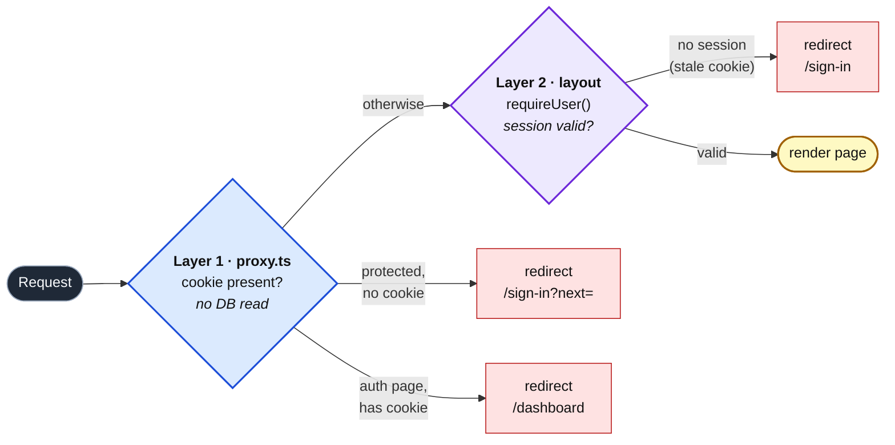

import CourseProgressBar from '../../../components/ui/CourseProgressBar.astro';
import Figure from '../../../components/figures/Figure.astro';
import Screenshot from '../../../components/figures/screenshot/Screenshot.astro';
import VideoCallout from '../../../components/embeds/VideoCallout.astro';
import ExternalResource from '../../../components/ui/ExternalResource.astro';
import AnnotatedCode from '../../../components/code/annotated-code/AnnotatedCode.astro';
import AnnotatedStep from '../../../components/code/annotated-code/AnnotatedStep.astro';
import Checklist from '../../../components/ui/checklist/Checklist.astro';
import ChecklistItem from '../../../components/ui/checklist/ChecklistItem.astro';
import { CardGrid } from '@astrojs/starlight/components';

<CourseProgressBar value={frontmatter['course-progress']} />

Every piece of the auth spine works now — accounts get created, emails verify, sessions issue on sign-in. But `/dashboard` is still wide open: type the URL while signed out and it serves the page anyway. This lesson installs the gate. By the end, `/dashboard` is reachable only when you are signed in, signed-in users are kept off the auth pages, and signing out deletes the `session` row that was the proof you were ever there. This is the runnable end state the project promised — sign up, verify, sign in, land on a protected surface, sign out, watch the row disappear.

<Figure caption="The gated dashboard this lesson ships — the app nav strip with the signed-in user's email on the left and a Sign out button on the right, above the &quot;Hello Ada Lovelace&quot; greeting.">
  <Screenshot viewport="desktop">
    
  </Screenshot>
</Figure>

## Your mission

This gate is two layers, and the reason it is two layers is the whole lesson. The first layer is the proxy — `proxy.ts`, the code that runs before any route renders. It checks for a session cookie and redirects on its absence: no cookie on `/dashboard`, you go to `/sign-in`; a cookie on `/sign-in`, you go to `/dashboard`. What it must not do is read the database. The proxy runs on *every* matched request, including the prefetches the router fires as a user hovers links, so a `getSession` call there would bill a round trip to Postgres for traffic the user never even sees. Presence of the cookie is all the proxy is allowed to know. Collapsing the two layers into one DB-reading check at the proxy is the exact mistake the two-layer rule from the request-time gate chapter exists to prevent.

The second layer is the validating read, and it lives one layer deeper, in the protected `layout.tsx`. The proxy trusts the cookie's *presence*; the layout verifies the session is *real*. That gap matters because a cookie can outlive its session — a stale entry the browser still holds after the row behind it is gone. The proxy waves that cookie through; the layout calls `requireUser()` (the read ladder you wrote when you stood up the auth instance) and redirects when the session genuinely no longer resolves. This is defense in depth: the cheap check on the hot path, the authoritative check at the boundary where a render actually happens.

Sign-out is a Server Action, wired as `<form action={…}>` rather than an `onClick` fetch. That choice is deliberate: a form action is progressively enhanced, so the button works and the redirect lands cleanly even before — or without — client JS. The single `auth.api.signOut` call clears the cookie and deletes the `session` row in one shot, and that deletion is the point. The opaque server-stored session from the authn chapter means the row *is* the session; its absence *is* the revocation. There is no token to expire and no client state to trust — once the row is gone, the same cookie value resolves to nothing, and the layout's validating read turns the next `/dashboard` visit straight back to `/sign-in`.

Keep the matcher explicit. It lists exactly the paths the proxy runs on, and it pairs with the layout: every protected segment you add later needs both an entry in the matcher *and* a `requireUser()` call in its layout. The matcher alone is not the gate — it only decides where the proxy looks; the validating read is what actually refuses a stale session. Nothing new is deferred past this lesson; it closes the flow end to end. The hardening you would do before pointing a real domain at this gets *named* in the walkthrough below, not built here.

<Checklist id="mission">
  <ChecklistItem chip="tested">A signed-out request to `/dashboard` redirects to `/sign-in?next=%2Fdashboard`, and signing in returns to `/dashboard`.</ChecklistItem>
  <ChecklistItem chip="tested">A signed-in request to `/sign-in` or `/sign-up` is redirected to `/dashboard` without the form ever rendering.</ChecklistItem>
  <ChecklistItem chip="tested">Clicking sign-out deletes the `session` row for that token from Postgres and redirects to `/sign-in`; refreshing `/dashboard` afterward redirects again.</ChecklistItem>
  <ChecklistItem chip="untested">A signed-in `/dashboard` renders a nav strip showing the user's email alongside a sign-out button, with the user's name in the page body.</ChecklistItem>
  <ChecklistItem chip="untested">Sign-out clears the `__Host-` session cookie — DevTools shows it gone.</ChecklistItem>
  <ChecklistItem chip="untested">The proxy decides on cookie presence only — it never imports or calls `auth.api.getSession`.</ChecklistItem>
</Checklist>

## Coding time

Wire the proxy, the protected layout, the sign-out action, and the dashboard read against the brief and the tests, then open the walkthrough below to compare.

<details>
<summary>Reference solution and walkthrough</summary>

Four files. Two of them are the gate itself; the other two are the surface behind it. Take them in the order a request travels: the proxy first, then the layout, then sign-out, then the page.

### The proxy: cookie presence, nothing more

Three parts of this file are load-bearing and easy to get subtly wrong, so step through it before reading on.

<AnnotatedCode lang="ts" maxLines={18} code={`
import { getSessionCookie } from 'better-auth/cookies';
import { type NextRequest, NextResponse } from 'next/server';

import { SESSION_COOKIE_PREFIX } from '@/lib/auth';

export async function proxy(request: NextRequest) {
  // cookiePrefix is mandatory — the better-auth default silently misses the
  // __Host- cookie. This is presence-only; no authz decision lives here.
  const cookie = getSessionCookie(request, {
    cookiePrefix: SESSION_COOKIE_PREFIX,
  });
  const path = request.nextUrl.pathname;
  const isProtected = path.startsWith('/dashboard');
  const isAuthPage = path === '/sign-in' || path === '/sign-up';

  if (isProtected && !cookie) {
    const next = encodeURIComponent(path + request.nextUrl.search);
    return NextResponse.redirect(new URL(\`/sign-in?next=\${next}\`, request.url));
  }

  if (isAuthPage && cookie) {
    return NextResponse.redirect(new URL('/dashboard', request.url));
  }

  return NextResponse.next();
}

export const config = {
  matcher: ['/dashboard/:path*', '/sign-in', '/sign-up'],
};
`}>
  <AnnotatedStep meta="{9-11}" color="blue">
    This is the entire database contact the proxy makes: none. `getSessionCookie` reads the cookie off the request and returns its value or `undefined` — it does not validate the session against Postgres. That is the rule the proxy lives by.
  </AnnotatedStep>

  <AnnotatedStep meta="{16-23}" color="blue">
    The forward gate and the inverse gate share one function. A protected path with no cookie bounces to sign-in carrying the original path in `?next=`; an auth page with a cookie bounces a signed-in user off a form they have no business seeing. Anything else falls through to `NextResponse.next()`.
  </AnnotatedStep>

  <AnnotatedStep meta="{27-29}" color="blue">
    The matcher is what makes the whole thing cheap: the proxy never even runs on routes outside this list. It pairs with the layout — adding a protected segment later means an entry here *and* a `requireUser()` call in that segment's layout.
  </AnnotatedStep>
</AnnotatedCode>

The export must be named `proxy`. Next.js 16 dispatches the request-time gate by that exact name; rename it and the file silently does nothing.

The `cookiePrefix` argument is not optional, and leaving it off is the canonical silent failure to pre-empt. `getSessionCookie`'s built-in default does not match the `__Host-`-prefixed cookie name the auth instance sets in production. Drop the argument and locally everything looks fine — the dev prefix is the plain `better-auth`, which the default happens to find — but the moment you deploy, every signed-in user's cookie goes unseen, the proxy treats them as signed out, and the inverse gate bounces them off `/sign-in` into a redirect loop. Passing `SESSION_COOKIE_PREFIX` — imported from `lib/auth.ts`, the one place the prefix is declared — guarantees the proxy reads the cookie under the same name the auth instance wrote it. Re-typing the literal here instead of importing it would let the two drift apart, which is the same failure wearing a different mask.

Note what is *not* imported in this file: there is no `import { auth }`, and no `auth.api.getSession` call anywhere. That absence is the untested requirement made visible. The proxy reaches for `getSessionCookie` only, because reading the database is the layout's job, not the proxy's.

### The layout: the validating read

```tsx title="src/app/(protected)/layout.tsx"
import { type ReactNode, Suspense } from 'react';

import { signOutAction } from '@/app/(protected)/sign-out-action';
import { Button } from '@/components/ui/button';
import { requireUser } from '@/lib/auth';

const AppNav = async () => {
  // The layout's own request-time read must sit under <Suspense> — a co-located
  // loading.tsx covers the children, not the layout body.
  const user = await requireUser('/dashboard');

  return (
    <nav
      data-testid="app-nav"
      className="flex items-center justify-between border-b px-6 py-4"
    >
      <span data-testid="nav-user-email" className="text-sm font-medium">
        {user.email}
      </span>
      <form action={signOutAction}>
        <Button type="submit" variant="outline" data-testid="sign-out-button">
          Sign out
        </Button>
      </form>
    </nav>
  );
};

export default async function ProtectedLayout({
  children,
}: {
  children: ReactNode;
}) {
  return (
    <>
      <Suspense>
        <AppNav />
      </Suspense>
      <main>{children}</main>
    </>
  );
}
```

This is the layer that catches what the proxy can't see. `requireUser('/dashboard')` calls `getSession` for real — `auth.api.getSession` against the session store — and if no session resolves, it redirects to `/sign-in?next=/dashboard`. A stale cookie the proxy honored dies right here. The `'/dashboard'` argument is the path it stuffs into `?next=`, so a session that expires mid-visit still sends the user back to where they were.

The structure looks heavier than it needs to be — why an inner `AppNav` under `<Suspense>` instead of just `await requireUser()` at the top of the layout? Because of the `loading.tsx` sitting next to the dashboard page. A co-located loading file becomes the Suspense fallback for the route's *children*, the streamed page content — not for the layout shell itself. If the gate's `await` ran in the layout body, it would block the shell from rendering and the loading skeleton would never get a chance to show; the user would stare at nothing until the session read resolved. Pushing the read into `AppNav` and wrapping that one component in its own `<Suspense>` keeps the gate off the path that the page's loading state owns, so the nav can resolve on its own schedule while the dashboard streams behind its skeleton.

The nav renders `{user.email}` beside a sign-out form. That covers the untested nav-shape requirement: the email lives in the nav strip, the user's *name* goes in the page body (next file), and sign-out is the form — not a button with an `onClick`. A `<form action={signOutAction}>` posts to the Server Action directly; it is progressively enhanced, so it works without client JS and the post-action redirect lands as a real navigation rather than a client-side router push that needs hydration to fire.

### Sign-out: the revocation

```ts title="src/app/(protected)/sign-out-action.ts"
'use server';

import { headers } from 'next/headers';
import { redirect } from 'next/navigation';

import { auth } from '@/lib/auth';

export const signOutAction = async () => {
  // Deleting the session row is the revocation — the cookie clear follows.
  await auth.api.signOut({ headers: await headers() });
  redirect('/sign-in');
};
```

One call does the work. `auth.api.signOut` reads the current session cookie out of the incoming request `headers`, deletes the matching `session` row, and writes the cookie-clearing `Set-Cookie` back onto the response — all of which the `nextCookies()` plugin you wired into the auth instance lands on the action's response for you. Then `redirect('/sign-in')` sends the now-signed-out user to the door.

The deletion is the whole revocation, and it is worth dwelling on why. Because the session is server-stored and opaque, the cookie value is just a lookup key into the `session` table. Delete the row and the key points at nothing — there is no signed token to wait out, no expiry to honor, no client state that could keep the session alive. The next request that presents the same cookie sails through the proxy (the cookie is still *present*) but dies at the layout's validating read, which finds no row and redirects. This is exactly the gap the two-layer design accounts for: revocation is instant at the database, and the layer that reads the database is the one that enforces it.

### The dashboard: a free second read

```tsx title="src/app/(protected)/dashboard/page.tsx"
import { getCurrentUser } from '@/lib/auth';

const DashboardPage = async () => {
  // Second read in the request — served from the React-cache dedupe, no extra
  // DB round trip.
  const user = await getCurrentUser();

  return (
    <section
      data-testid="dashboard-page"
      className="mx-auto max-w-2xl px-6 py-16"
    >
      <h1 className="text-2xl font-semibold">Hello {user?.name}</h1>
      <dl className="mt-6 text-sm text-muted-foreground">
        <dt className="font-medium text-foreground">Email</dt>
        <dd>{user?.email}</dd>
      </dl>
    </section>
  );
};

export default DashboardPage;
```

The layout already read the session to gate the route — and now the page reads it again with `getCurrentUser()` to greet the user by name. That looks like two round trips to Postgres for one request, but it isn't. The read ladder wraps `getSession` in React's `cache`, which dedupes calls within a single request: the layout's `requireUser()` does the actual read, and the page's `getCurrentUser()` hits the cached result. One render, one session read, two consumers. That dedupe is exactly why the ladder is shaped the way it is — you call `requireUser()` or `getCurrentUser()` freely wherever you need the user, and the request pays for the lookup once.

The `user?.` optional chaining is here only because `getCurrentUser` is typed to return `User | null` — it can hand back `null` when there is no session. On this page the layout's gate guarantees a user is present by the time the page renders, so the `null` branch never actually fires; the `?.` is satisfying the type, not guarding a real case.

If you watch the Drizzle query log on a signed-in `/dashboard` request, most of the time you will see *zero* session reads hit the table, not even one. The auth instance runs a five-minute cookie cache: within that window, `getSession` resolves the session straight out of a signed value in the cookie without touching Postgres at all. The single dedupe above is the worst case — when the cache window has lapsed and the session must be re-read from the row. The pairing is the point: the proxy never reads the database, and the layout's read is usually served from cache anyway.

### How a request flows through both layers

<Figure caption="The two-layer request path. Layer 1 — the proxy — decides on cookie *presence* alone, never touching the database; its two redirect branches are the forward gate and the inverse gate. Only a pass-through reaches Layer 2 — the layout's `requireUser()` — the authoritative read that catches a stale cookie the proxy waved through.">

</Figure>

The proxy branch reads the cookie and never the database; the layout branch reads the session and is where a stale cookie finally gets caught. The forward gate, the inverse gate, the `?next=` round trip, and the open-redirect reasoning behind that `encodeURIComponent` are all introduced in full in the request-time gate chapter — this lesson is where you apply them, paired with the `safeNext` guard you wired into the sign-in action last lesson, and the opaque server-stored session model is the one from the authentication-foundations chapter made concrete by the sign-out delete.

<VideoCallout videoId="N_sUsq_y10U" videoTitle="Next.js Patterns: Authentication (Best Practices for Server Components, Actions, Middleware)">
  Delba from the Next.js team walks the exact two-layer split you just built — optimistic, non-blocking proxy checks versus the validating read close to the data, with React `cache` dedupe (12 min).
</VideoCallout>

</details>

<CardGrid>
  <ExternalResource
    title="Next.js — How to implement authentication"
    href="https://nextjs.org/docs/app/guides/authentication"
    icon="simple-icons:nextdotjs"
    iconColor="#000000"
    description="The canonical guide for this exact pattern: proxy optimistic checks, the matcher, a Data Access Layer, and React cache dedupe."
  />
  <ExternalResource
    title="Better Auth — Next.js integration"
    href="https://www.better-auth.com/docs/integrations/next"
    icon="simple-icons:betterauth"
    iconColor="#000000"
    description="getSessionCookie, the proxy pattern, and signOut wired the way this lesson uses them."
  />
  <ExternalResource
    title="Next.js — proxy.ts file convention"
    href="https://nextjs.org/docs/app/api-reference/file-conventions/proxy"
    icon="simple-icons:nextdotjs"
    iconColor="#000000"
    description="Why the export must be named proxy, plus the matcher config reference for the paths the gate runs on."
  />
  <ExternalResource
    title="Better Auth — Session management"
    href="https://www.better-auth.com/docs/concepts/session-management"
    icon="simple-icons:betterauth"
    iconColor="#000000"
    description="signOut and revocation, plus the cookie cache behind the five-minute window the dashboard read leans on."
  />
</CardGrid>

With the flow runnable end to end, here is what stays on the list before you would point a real domain at this — named, not built here, because each belongs to a chapter further on.

- **Rotate `BETTER_AUTH_SECRET`** on a cadence and on every staff turnover. It signs the session cookie cache; a leaked secret is a forged-session risk, and rotation is the containment.
- **Wire Resend's bounce and complaint webhooks** to write `email_suppressions`, so verification mail to a bouncing address stops going out before it scorches the sending domain's reputation. The webhook handler that ingests those events lands in the Stripe-and-webhooks chapter.
- **Add rate limits** to the sign-in, sign-up, and verify-resend endpoints before any of this reaches a public URL — an unthrottled credential endpoint is a brute-force and enumeration target. The rate-limiting chapter owns that layer.

And here is where this same auth spine gets extended, so you can see the shape it was built to grow into:

- The authentication chapter material layers magic links, TOTP, passkeys, and OAuth onto this *exact* schema — the four tables you generated absorb every one of those without re-shaping.
- The credential-change and step-up tier reads the `freshAge` knob you set on the session config: a recently-authenticated session is allowed to change a password; a stale one is forced to re-authenticate first.
- The active-sessions list reads the `ipAddress` and `userAgent` columns the `session` table already populates on every sign-in — the data is being captured now, ready for that screen.
- The organizations work wraps `requireUser` with org scoping and an `authedAction` authorization layer, turning "who are you" into "what may you do here."
- The list-view chapters call `requireUser()` in their server reads rather than re-checking the cookie by hand — the read ladder you wrote is the load-bearing primitive every protected read leans on from here out.

## Moment of truth

Run the lesson's test suite:

```bash
pnpm test:lesson 5
```

The suite drives the proxy with synthetic requests and reads the rows the sign-out action leaves behind. Expect every test to pass, covering the signed-out `/dashboard` redirect with `?next=%2Fdashboard`, a cookie-carrying `/dashboard` request passing through untouched, the inverse gate bouncing `/sign-in` and `/sign-up` to `/dashboard`, a signed-out `/sign-in` still rendering, and a real sign-in whose `session` row count drops from one to zero after sign-out lands on `/sign-in`.

```text
 ✓ tests/lessons/Lesson 5.test.ts (6 tests)

 Test Files  1 passed (1)
      Tests  6 passed (6)
```

The tests assert the gate's behavior with synthetic requests; confirm the things they can't see by running the flow in a real browser.

<Checklist id="verify">
  <ChecklistItem chip="untested">Signed out, visiting `/dashboard` redirects to `/sign-in?next=%2Fdashboard`; signing in lands you back on `/dashboard`.</ChecklistItem>
  <ChecklistItem chip="untested">Signed in, visiting `/sign-in` bounces straight to `/dashboard` without the form rendering.</ChecklistItem>
  <ChecklistItem chip="untested">After sign-out, Studio shows the `session` row gone, DevTools → Application → Cookies shows the session cookie cleared, and refreshing `/dashboard` redirects to sign-in again.</ChecklistItem>
  <ChecklistItem chip="untested">`proxy.ts` imports `getSessionCookie` only — no `auth` import, no `auth.api.getSession` call anywhere in the file.</ChecklistItem>
  <ChecklistItem chip="untested">With two browsers signed in as the same account, signing out of one and refreshing the other redirects it to `/sign-in` once the five-minute cookie-cache window lapses — the active-sessions trade-off the sessions chapter unpacks.</ChecklistItem>
</Checklist>
