import { CardGrid, Card, FileTree, Steps } from '@astrojs/starlight/components';
import CourseProgressBar from '../../../components/ui/CourseProgressBar.astro';
import Figure from '../../../components/figures/Figure.astro';
import Screenshot from '../../../components/figures/screenshot/Screenshot.astro';
import TabbedContent from '../../../components/figures/tabbed-content/TabbedContent.astro';
import TabbedItem from '../../../components/figures/tabbed-content/TabbedItem.astro';

<CourseProgressBar value={frontmatter['course-progress']} />

Before a web app can do anything, it has to answer one question: who is this request from?
This chapter builds that answer: a runnable email and password auth flow with a verification gate.
A visitor signs up, a verification email lands in their inbox, the link signs them in on a protected `/dashboard`, and signing out deletes their session and returns them to the sign-in page.

This first lesson builds none of that.
It stands up the starter, fills in the environment, and confirms it runs, so the moving parts are in place when you wire auth in the next lesson.
By the end you will have Postgres running and the dev server serving the sign-up and sign-in shells and a placeholder dashboard.

The four screenshots below are the *finished* flow the next four lessons build, not what your starter renders today.

<TabbedContent syncKey="building-flow">
  <TabbedItem label="Sign up" caption="The sign-up form: name, email, and password, with a Create account button.">
    <Screenshot viewport="desktop">
      
    </Screenshot>
  </TabbedItem>

  <TabbedItem label="Verify email" caption="After sign-up, the check-your-inbox screen showing the address the link was sent to and a button to resend it.">
    <Screenshot viewport="desktop">
      
    </Screenshot>
  </TabbedItem>

  <TabbedItem label="Sign in" caption="The sign-in form: email and password, with a Sign in button.">
    <Screenshot viewport="desktop">
      
    </Screenshot>
  </TabbedItem>

  <TabbedItem label="Dashboard" caption="Signed in and gated: a nav strip with the user's email and a Sign out button, above a Hello greeting.">
    <Screenshot viewport="desktop">
      
    </Screenshot>
  </TabbedItem>
</TabbedContent>

## What we'll practice

This chapter assembles the authentication pieces into one sign-up, verification, and sign-in flow.
Across four lessons you will:

- Configure Better Auth's `auth` instance and read the four-table schema (`user`, `session`, `account`, `verification`) the CLI generates.
- Drive the flow through Server Actions that return the canonical `Result` shape, with Zod parsing the form at the boundary.
- Compose a React Email verification template and send it through the Resend pipeline you built earlier.
- Build the two-layer request-time gate: a cheap cookie-presence check in `proxy.ts` plus a validating read in the protected layout.

Out of scope: OAuth providers, passkeys, two-factor, magic links, password reset, account linking, rate limiting, organization scoping, and audit logs.

## One request through the auth flow

Follow one request through the flow the next four lessons build:

1. The browser hits `/sign-up`. A Server Action calls `auth.api.signUpEmail`, creating the `user` and `account` rows but issuing **no session**, because the project runs with `requireEmailVerification: true`. The visitor is redirected to `/verify-email` with no cookie.
2. A `sendVerificationEmail` callback rides the existing Resend pipeline to deliver the link. The token is a stateless signed JWT carried in the URL, so the `verification` table stays empty.
3. Clicking the link hits the catch-all `/api/auth/[...all]` handler, the single route file serving every Better Auth endpoint. Verification flips `emailVerified` to `true` and, via `autoSignInAfterVerification`, issues the session; the `nextCookies()` plugin lands the `Set-Cookie` header. This is the first point in the flow where a cookie exists.
4. A two-layer gate now guards `/dashboard`. `proxy.ts` runs a cookie-presence redirect with no database read, while the protected `layout.tsx` runs the validating `requireUser()` read. The proxy is the fast first line; the layout catches a cookie that looks present but no longer maps to a live session.

```mermaid
%%{init: {'flowchart': {'nodeSpacing': 28, 'rankSpacing': 42}, 'themeCSS': '.nodeLabel, .nodeLabel * { font-size: 17px !important; } .edgeLabel, .edgeLabel * { font-size: 15px !important; }'} }%%
flowchart LR
  browser(["<b>Browser</b><br/>/sign-up"])
  action["<b>Server Action</b>"]
  api["<b>auth.api</b><br/>signUpEmail<br/>rows, no session"]
  resend(["Resend<br/>sends link"])
  handler["<b>catch-all handler</b><br/>verify + sign in"]
  gate["<b>two-layer gate</b><br/>/dashboard"]

  browser --> action
  action --> api
  api --> resend
  action -- "no session yet" --> handler
  resend -. "email link" .-> handler
  handler -- "cookie lands here" --> gate

  class browser edge
  class action,api cookieless
  class resend mail
  class handler born
  class gate guarded
  classDef edge fill:#1f2937,stroke:#94a3b8,color:#f8fafc
  classDef cookieless fill:#fef3c7,stroke:#b45309,color:#111,stroke-width:2px
  classDef mail fill:#e0e7ff,stroke:#4338ca,color:#111,stroke-width:2px
  classDef born fill:#bbf7d0,stroke:#15803d,color:#111,stroke-width:2px
  classDef guarded fill:#dbeafe,stroke:#1d4ed8,color:#111,stroke-width:2px
```

<Figure caption="One request through the flow. The cookie is the only moving part, and it does not exist until the verification callback in step 3.">

</Figure>

## Starting file tree

You start from the layout below.
The **bold** files are stubs you fill in this chapter; each comment opens with the lesson that fills it (`TODO L2`, `TODO L3`, …) and names what lands there.
Everything else is already done, with a comment only when a lesson touches it or it changed from the previous chapter.

<FileTree>
- .env.example *provided — every env var, safe local defaults*
- docker-compose.yml *provided — local Postgres*
- drizzle.config.ts *provided — two-file schema array, snake_case*
- drizzle/
  - 0000_init_schema.sql *provided — `email_suppressions` + enum only; no auth tables*
- scripts/ *provided — seed script and per-lesson test runner*
- package.json *provided — `db:*`, `auth:generate`, `test:lesson` scripts*
- src/
  - **env.ts** *TODO L2 — add the two Better Auth env vars to the validated boundary*
  - **proxy.ts** *TODO L5 — cookie-presence gate, `?next=` round-trip, inverse gate*
  - lib/
    - **auth.ts** *TODO L2 — the `betterAuth` instance, `SESSION_COOKIE_PREFIX`, `getCurrentUser`, `requireUser`*
    - **auth-schema.config.ts** *TODO L2 — CLI-only config the schema generator reads*
    - auth-client.ts *provided — bare same-origin browser client*
    - auth/
      - error-mapping.ts *provided — thrown auth codes mapped to a `Result`*
    - result.ts *provided — `Result<T>`, `ok`, `err`*
    - redirects.ts *provided — `safeNext` open-redirect guard*
    - email.ts *provided — Resend `sendEmail` wrapper*
    - suppressions.ts *provided — suppression-list lookup*
  - db/
    - **index.ts** *TODO L2 — spread the generated auth schema into the client*
    - schema.ts *provided — `email_suppressions` table + enum*
    - schema/
      - **auth.ts** *TODO L2 — empty stub; the CLI writes the four tables here*
  - app/
    - api/
      - auth/
        - `[...all]`/
          - **route.ts** *TODO L2 — mount the Better Auth catch-all handler*
    - (auth)/
      - sign-up/
        - page.tsx *provided — shell wrapping the form*
        - sign-up-form.tsx *provided — `useActionState` client form*
        - **actions.ts** *TODO L2 — the sign-up Server Action*
      - sign-in/
        - page.tsx *provided — reads `?next=`, passes it to the form*
        - sign-in-form.tsx *provided — client form; resend link on refusal*
        - **actions.ts** *TODO L4 — the sign-in Server Action*
      - verify-email/
        - **page.tsx** *TODO L3 — show the target email + the resend button*
        - **verify-email-resend.tsx** *TODO L3 — client island that resends the link (new file)*
    - (protected)/
      - **layout.tsx** *TODO L5 — `requireUser()` + nav with email and sign-out*
      - **sign-out-action.ts** *TODO L5 — the sign-out Server Action*
      - dashboard/
        - **page.tsx** *TODO L5 — read the current user, greet them by name*
  - emails/
    - **welcome-verification.tsx** *TODO L3 — the React Email verification template*
    - email-tailwind-config.ts *provided — shared email styling*
    - components/
      - email-layout.tsx *provided — email header and footer chrome*
- tests/
  - lessons/ *provided — the `Lesson 2`–`Lesson 5` suites, stubbed for now*
</FileTree>

The `(auth)` and `(protected)` folders drop their leading underscore on purpose: the parentheses make them App Router *route groups*.
A route group stays out of the URL while letting its folders share a layout, so `/sign-in` and `/sign-up` get one chrome and `/dashboard` another.

Two stubs look odd.
`src/db/schema/auth.ts` ships **empty** because you don't hand-write its four tables: the Better Auth CLI generates them and you commit the result.
`src/lib/auth-schema.config.ts` is a stripped-down mirror of `auth.ts` that exists only to give the CLI something to load, since the real `auth.ts` opens with `'server-only'`, which the generator can't import.

## Roadmap

Four lessons turn the stubs into a running flow, each closing on a state you can confirm: a row in Studio, a redirect in the address bar, or a cookie that does or doesn't exist.

<CardGrid>
  <Card title="Lesson 2 — Sign up creates the account" icon="add-document">
    Wire the `auth` instance, generate the schema, mount the catch-all handler. Sign-up creates the `user` and `account` rows, then redirects to the verification screen with no session yet.
  </Card>
  <Card title="Lesson 3 — The email verification gate" icon="email">
    Build the verification email and turn on the gate, then prove the link verifies the user and signs them in.
  </Card>
  <Card title="Lesson 4 — Sign in, with unverified refusal and safe redirects" icon="approve-check-circle">
    Add the sign-in action: opaque credential errors, refusal of unverified accounts, and the `?next=` open-redirect closure.
  </Card>
  <Card title="Lesson 5 — Gate the protected surface" icon="padlock">
    Add the cookie-presence proxy, the layout's validating read, the inverse gate, and a sign-out that deletes the session row.
  </Card>
</CardGrid>

## Setup

Work through these in order.
You are done when the dev server boots and the pages below render.
The actions and the gate are still stubs, so you are standing up the shell, not the flow.

:::caution[Use the verified sender, not the sandbox]
Set `EMAIL_FROM` to the verified-domain sender from the email chapter, not Resend's sandbox address.
The sandbox sender drops verification mail into spam, which makes the flow look broken later for a reason unrelated to your code.
Put the verified value in `.env` now.
:::

<Steps>
1. Get the starter codebase from the [project repository](https://github.com/terencicp/react-saas-course-projects), under `Chapter 055/start/`:

   ```bash
   pnpm dlx degit terencicp/react-saas-course-projects/Chapter-055/start email-password-auth
   cd email-password-auth
   ```

   `degit` copies that folder into a fresh `email-password-auth` directory with no git history. Every chapter ships `start/` and `solution/` siblings, so you can diff against the reference anytime.

2. Bring up Postgres:

   ```bash
   docker compose up -d
   ```

   This starts the `postgres:18` service on port `5432` in the background. The first run pulls the image; later runs are instant.

3. Install the dependencies:

   ```bash
   pnpm install
   ```

   The repo is pnpm-only: a `preinstall` hook blocks other package managers, and versions are pinned.

4. Copy the example env file and fill in the values (the table below covers every variable):

   ```bash
   cp .env.example .env
   ```

   The database variables already match the Docker Postgres above. You supply two yourself: a fresh `BETTER_AUTH_SECRET` and your carried-in Resend values.

5. Run the existing migration. It creates only the `email_suppressions` table and the `suppression_reason` enum; the auth tables land in the next lesson:

   ```bash
   pnpm db:migrate
   ```

6. Start the dev server:

   ```bash
   pnpm dev
   ```

   The Next app comes up at `http://localhost:3000`.
</Steps>

Generate the auth secret with one command.
It returns the base64-encoded 32 bytes of CSPRNG output that Better Auth wants for signing cookies and tokens:

```bash
openssl rand -base64 32
```

| Variable | Purpose | How to get it |
| --- | --- | --- |
| `DATABASE_URL` | Postgres connection string. | Matches the `docker-compose.yml` defaults; leave as-is. |
| `DATABASE_URL_UNPOOLED` | Same value locally. The pooled/unpooled split lets a managed Postgres drop in later without renaming anything. | Leave as-is. |
| `SEED` | Seed toggle. | Leave as `1`. |
| `BETTER_AUTH_SECRET` | Signs session cookies and verification tokens. Server-only. | A fresh value from `openssl rand -base64 32`. Use a different one per environment; reusing one across environments is the failure mode the Better Auth setup chapter warned about. |
| `BETTER_AUTH_URL` | The auth server's origin. | `http://localhost:3000`. |
| `NEXT_PUBLIC_APP_URL` | The public app origin. | `http://localhost:3000`. Split from `BETTER_AUTH_URL` for deploys where the auth-server origin differs from the public one; here they match. |
| `RESEND_API_KEY` | Authenticates the verification-email send. | Carry-in from the email chapter: your Resend API key. |
| `EMAIL_FROM` | The verified sender identity, in `Name <addr>` form. | Carry-in from the email chapter. |
| `EMAIL_REPLY_TO` | The reply-to address. | Carry-in from the email chapter. |
| `NEXT_PUBLIC_APP_NAME` | The app name shown in the email chrome. | Carry-in from the email chapter. |

On success, the app boots into the starter's deliberately-unwired state:

- `/` redirects to `/sign-in`.
- `/sign-up` and `/sign-in` render their forms, but submitting does nothing: both actions return `Not implemented`, which you wire up over the next lessons.
- `/dashboard` serves a static "Dashboard" placeholder with no auth gate, so anyone can open it now.
- `pnpm db:studio` shows only the `email_suppressions` table; there are no `user`, `session`, `account`, or `verification` tables yet.
