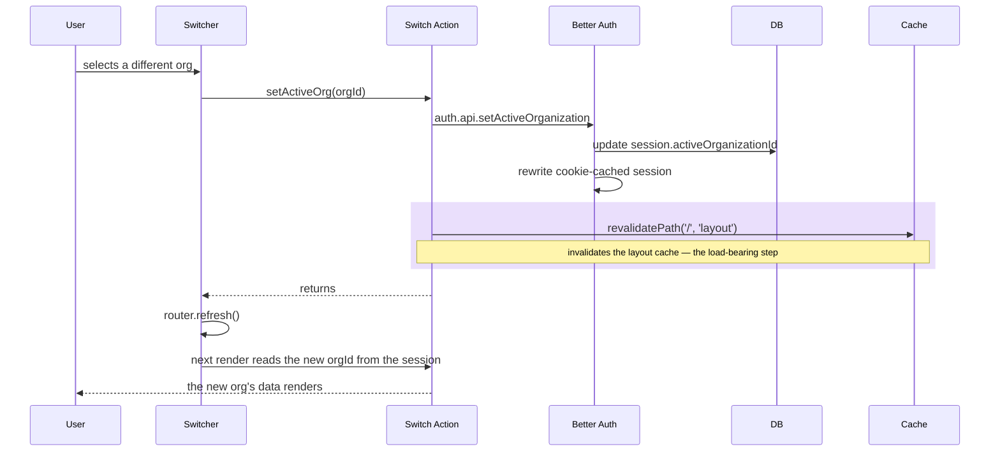

import CourseProgressBar from '../../../components/ui/CourseProgressBar.astro';
import Figure from '../../../components/figures/Figure.astro';
import AnnotatedCode from '../../../components/code/annotated-code/AnnotatedCode.astro';
import AnnotatedStep from '../../../components/code/annotated-code/AnnotatedStep.astro';
import CodeVariants from '../../../components/code/code-variants/CodeVariants.astro';
import CodeVariant from '../../../components/code/code-variants/CodeVariant.astro';
import Buckets from '../../../components/exercises/buckets/Buckets.astro';
import Bucket from '../../../components/exercises/buckets/Bucket.astro';
import Item from '../../../components/exercises/buckets/Item.astro';
import Sequence from '../../../components/exercises/sequence/Sequence.astro';
import Step from '../../../components/exercises/sequence/Step.astro';
import Term from '../../../components/ui/Term.astro';
import ExternalResource from '../../../components/ui/ExternalResource.astro';
import VideoCallout from '../../../components/embeds/VideoCallout.astro';
import { Steps, CardGrid } from '@astrojs/starlight/components';

<CourseProgressBar value={frontmatter['course-progress']} />

You finished the authentication work with an app that knows about *people*. A user signs up, verifies their email, signs in, and lands on a protected dashboard backed by four tables (`user`, `session`, `account`, `verification`) and a session-read ladder (`getCurrentUser`, `requireUser`) that every protected surface leans on. That app is single-tenant in the most literal sense: it knows who you are, and nothing else.

Real SaaS isn't sold to people. It's sold to *companies*. One person signs up and might run a single company through your product, or several: a consultancy invoicing under one brand and a side venture under another. Their teammates sign in to the same company and see the same invoices. So the unit of ownership isn't the user, it's the organization, and almost every row your app stores from here on belongs to one.

That reframing is the whole of this chapter, and it raises one question that the rest of the lesson answers. A user signs up: where does "the company" live in the schema, how does the session know which one they're *currently* working inside, and what does *switching* companies do to the session, to the next request, and to the cache that's already in flight?

By the end of this lesson you'll have organizations installed, a session that carries the active one forward, and the create, switch, and list surface that moves a user between them. You will not write a single `CREATE TABLE`, and that is the first decision worth slowing down for.

## Where the company lives: three tables from one plugin

With Drizzle fresh in hand, your instinct is probably to open the schema file and hand-write an `organizations` table and a join table linking users to it. Resist it. The org data model is a solved problem with a few sharp edges (slug uniqueness, the owner-on-create invariant, the membership join, the active-org switch), and Better Auth ships all of it as a plugin. You add the plugin, regenerate the schema, and three tables drop in next to your existing four.

This is <Term definition="One application instance serving many isolated customer organizations, each unable to see the others' data.">multi-tenancy</Term>, and the plugin owns three tables for it:

- **`organization`** is the company itself: `id`, `name`, `slug`, optional `logo` and `metadata`, `createdAt`.
- **`member`** is the <Term definition="A row that links two tables in a many-to-many relationship: here, which user belongs to which organization, and in what role.">join table</Term>: `id`, `userId`, `organizationId`, `role`, `createdAt`. A user reaches an org *through* one of these rows.
- **`invitation`** is the pending-invite record. It's generated now because the plugin emits all three tables together, but it stays dormant this chapter. Wiring the invite-and-accept flow is a later chapter's job; for now, know that the columns exist and move on.

If the "one app, one database, isolate by tenant id" model is still abstract, this clip grounds it before you wire any code.

<VideoCallout videoId="bFLGwVyIotA" videoTitle="Multi-Tenant SaaS Architecture in 3 Simple Steps">
  Jan Marshal's first ten minutes (skip the build) walk through the multi-tenancy concept and the org-id ERD this lesson is built on.
</VideoCallout>

### Wiring the plugin

Two files change, and they have to change together. The server `auth` instance gains the plugin, and the browser `authClient` gains its matching client plugin. The following two tabs show the edit on each file.

<CodeVariants>
  <CodeVariant label="src/lib/auth.ts">
    <div data-mark-color="green">

    ```ts {2,8-10}
    import { betterAuth } from 'better-auth';
    import { organization } from 'better-auth/plugins';
    import { nextCookies } from 'better-auth/next-js';

    export const auth = betterAuth({
      // ...adapter, email/password, and session config from the auth chapters
      plugins: [
        organization({
          teams: { enabled: false },
        }),
        nextCookies(),
      ],
    });
    ```

    </div>
    **The server instance gains the plugin.** `organization()` goes in the `plugins` array, and `nextCookies()` must stay **last**. `nextCookies()` flushes Better Auth's `Set-Cookie` headers onto the response, so any plugin listed after it won't get its cookies written. The `teams: { enabled: false }` line is a decision the next section unpacks.
  </CodeVariant>

  <CodeVariant label="src/lib/auth-client.ts">
    <div data-mark-color="green">

    ```ts {2,6}
    import { createAuthClient } from 'better-auth/react';
    import { organizationClient } from 'better-auth/client/plugins';

    export const authClient = createAuthClient({
      plugins: [
        organizationClient(),
      ],
    });
    ```

    </div>
    **The browser client gains the matching plugin.** The client plugin set must mirror the server's. Without `organizationClient()` here, the typed `authClient.organization.create`, `.setActive`, and `.list` methods you'll call in a moment simply don't exist: TypeScript won't find them and your editor won't autocomplete them.
  </CodeVariant>
</CodeVariants>

### Generating the schema

The plugin declares the tables, but it doesn't write them. You run the same Better Auth schema generator you used to stand up the four core tables, review the diff, and migrate with Drizzle Kit.

<Steps>

1. Run the generator. It reads your `auth` config, sees the organization plugin, and writes the three new tables, plus a new column on `session`, into `src/db/schema/auth.ts`.

   ```bash
   npx @better-auth/cli generate
   ```

2. **Read the diff before you trust it.** You should see `organization`, `member`, and `invitation` appear, and one quiet addition: an `activeOrganizationId` column on the existing `session` table. That column is the centerpiece of this lesson, so hold onto it.

3. Generate and apply the migration. Name it intentionally, the way every migration in this project is named.

   ```bash
   npx drizzle-kit generate --name add_organizations
   npx drizzle-kit migrate
   ```

</Steps>

### Don't rename the plugin's tables

When you read the generated `src/db/schema/auth.ts`, the table names will be `organization` and `member`, singular rather than the plural `organizations` and `org_members` your house style might prefer. Leave them. Every call you make into the plugin (`create`, `setActive`, `list`) issues SQL against `organization` and `member` by those exact names. A "tidy-up" rename breaks every one of those calls, and it breaks them silently: no type error, no red squiggle, just a runtime failure the first time a user tries to create a company. This is the same discipline from the auth work, where you consume the library on its terms, not yours.

The following diagram pins the new tables to the ones you already had. Read it as the answer to the first part of the lesson's question: *where the company lives*.

<Figure>
```d2
direction: right

**.style.font-size: 28

classes: {
  dormant: {
    style: {
      fill: "#f3f4f6"
      stroke: "#9ca3af"
      font-color: "#9ca3af"
    }
  }
}

user: {
  shape: sql_table
  id: text { constraint: primary_key }
  email: text { constraint: unique }
}

session: {
  shape: sql_table
  id: text { constraint: primary_key }
  userId: text { constraint: foreign_key }
  activeOrganizationId: "activeOrganizationId  (active org)" { constraint: foreign_key }
}

organization: {
  shape: sql_table
  id: text { constraint: primary_key }
  name: text
  slug: text { constraint: unique }
}

member: {
  shape: sql_table
  id: text { constraint: primary_key }
  userId: text { constraint: foreign_key }
  organizationId: text { constraint: foreign_key }
  role: text
}

invitation: "invitation  —  wired in a later chapter" {
  class: dormant
  shape: sql_table
  id: text { constraint: primary_key }
  organizationId: text { constraint: foreign_key }
  email: text
}

member.userId -> user.id
member.organizationId -> organization.id
session.userId -> user.id
session.activeOrganizationId -> organization.id: "active org" {
  style: { stroke: "#7c3aed"; stroke-width: 4; font-color: "#7c3aed" }
}
invitation.organizationId -> organization.id: {
  style: { stroke: "#9ca3af"; stroke-dash: 4 }
}
```
  <Fragment slot="caption">
    A user reaches an organization *through* a `member` row, and the session points at the one org that's active right now. The violet edge from `session.activeOrganizationId` to `organization` marks the column this lesson adds, and the rest of the chapter rides on it. `invitation` is generated alongside the rest but stays dormant for now.
  </Fragment>
</Figure>

## Organizations, not teams: the second level you turn off

That `teams: { enabled: false }` line in the config deserves an explanation, because it's a decision, not boilerplate.

The plugin can model two levels of hierarchy. The level you're using is the organization: a company, with members who each hold a role inside it. But it also supports a second level *inside* the org, called teams. With teams on, an organization can hold a Sales team and an Engineering team, a member belongs to the org and optionally to one or more teams within it, and the session gains an `activeTeamId` alongside the active org. It's the same shape you're building, one level deeper.

For a year-one SaaS, the call is **organizations only**. Teams are the right tool the day your product surfaces "departments inside a company," where Sales and Engineering need separate scopes within one Acme. Until that requirement is real and a customer is asking for it, turning teams on buys you nothing but extra config surface and migration weight. So you turn it off explicitly, and you turn it off in writing: `teams: { enabled: false }` documents the decision at the call site, so the next developer sees that a choice was made rather than wondering whether teams were forgotten.

When departments do become real, you flip that one line to `true`, the plugin adds the `team` and `teamMember` tables and the `activeTeamId` slot, and you build the team layer on top of the org layer you have. That day is not today.

## One slot per session: adding activeOrganizationId

The generate step slipped one column onto `session`: `activeOrganizationId`, a nullable string foreign key to `organization.id`. This column is the heart of the lesson's model, so let's be precise about what it is and, more importantly, why it lives where it does.

It answers the second part of the question: which org is the user working inside right now? There is **one row per session**, and that row carries exactly one active org. Switching companies doesn't mint a new session, it updates the existing session row's `activeOrganizationId`. One slot, rewritten in place.

### Why on `session` and not on `user`

Here's the instinct to resist: the active org feels like a property of the *person*, so it seems to belong on the `user` row. It doesn't, and the reason is something you already built.

The same human can have two sessions open at once. Picture a founder reviewing their own consultancy's invoices in one browser tab while triaging Acme's in another: two tabs, two devices, two different active orgs, one person. If the active org lived on `user`, both tabs would share one slot, and switching in one would change the active org in the other. It has to be per-session.

Per-session is a model you've already met. When you stood up sessions, each `session` row was independent: its own cookie, its own `ipAddress` and `userAgent`, revocable on its own. The active org is just one more column on that same independent row. You're not learning a new model here, you're extending the multi-device session model you already have by one column. Each device carries its own active org because each device already carries its own session.

### Server-side session state, not URL, not client

One more framing, and it's the thread that runs through this entire chapter: the active org is **server-side session state**. It lives on a row in your database that only the server can read and write.

It is not URL state: there's no `/o/:orgId/...` segment driving which tenant's data you see. It is not client state either: no `localStorage.activeOrg`, no separate cookie the browser sets. Those alternatives feel convenient, and they're both wrong for the tenancy decision. The full reason lands next lesson, but here's the shape of it. The helper that scopes every database read to the current org will read `orgId` from the validated session and nowhere else. The moment the org identity comes from a source the user can edit (a URL segment, a form field, a client cookie), a user can type another company's id and read its data. Keeping the active org on the session, where the server is the only writer, is what makes that attack impossible. Everything in this chapter is downstream of that one decision.

That distinction is worth pinning down before you write code that depends on it. The following exercise sorts state into where it actually belongs.

<Buckets twoCol instructions="Sort each piece of state into where it should live. The trap is the difference between *linking* to an org and deciding which org's data the request is allowed to touch.">
  <Bucket name="session" label="Session row" description="Server-side, one per device — only the server writes it" />
  <Bucket name="user" label="User row" description="Server-side, one per person" />
  <Bucket name="wrong" label="URL or client state" description="Wrong home for a tenancy decision" />

  <Item bucket="session">`activeOrganizationId`</Item>
  <Item bucket="session">Which org's data the dashboard renders right now</Item>
  <Item bucket="user">`email`</Item>
  <Item bucket="user">The user's display name</Item>
  <Item bucket="wrong">`localStorage.activeOrg`</Item>
  <Item bucket="wrong">An `orgId` from a route param the server trusts</Item>
</Buckets>

<details>
<summary>Why each lands where it does, and the one subtle case</summary>

- **Session row.** `activeOrganizationId` and "which org's data the dashboard renders right now" are the *same* decision: which company this *device* is operating inside. It's per-session, so it lives on the `session` row.
- **User row.** `email` and display name belong to the *person*. They're the same value no matter which device they're on or which org is active, so they live on `user`.
- **URL or client state.** `localStorage.activeOrg` drifts from the server's truth and breaks the moment two devices disagree. An `orgId` pulled from a route param and trusted bypasses the membership check entirely, which is next lesson's security hole.

The genuinely subtle one: putting an org *slug* in a shareable deep link like `/o/acme/invoices/123` is **fine**, because a URL is good for *linking* to a resource. What's wrong is using that path value as the *tenancy decision*. The server must still resolve the active org from the session and verify membership; it never trusts the slug in the path.

</details>

## Setting the initial active org with a session-creation hook

The slot exists. Who fills it when a user signs in?

Your first thought is the sign-in action: read the user's first org, set `activeOrganizationId`, done. Resist it, because that covers exactly one entry point. Sign-up mints a session too, and so will every auth method you add later, such as OAuth callbacks and magic links. Set the active org in the sign-in action and it ships `null` for all of them, a latent bug that surfaces the day someone wires Google sign-in and wonders why those users land on a broken dashboard.

One place structurally covers every path that mints a session: a database hook on session creation. Better Auth lets you intercept the session row before it's written and return a modified version. Run the lookup there and every entry point is covered by construction.

The following hook is the entire mechanism. Step through the three things your eye needs to land on.

<AnnotatedCode lang="ts" maxLines={12} code={`
databaseHooks: {
  session: {
    create: {
      before: async (session) => {
        const activeOrganizationId = await resolveInitialOrg(session.userId);
        return { data: { ...session, activeOrganizationId } };
      },
    },
  },
}
`}>
  <AnnotatedStep meta="{4}" color="violet">
    The **`before` phase** runs before the session row is inserted, and whatever you return becomes the inserted row. That's what makes this the right hook: you're shaping the row on its way into the database, not patching it after the fact.
  </AnnotatedStep>

  <AnnotatedStep meta={`{6} "{ data:"`} color="violet">
    The **return contract** is an object with a `data` key, not the bare session. You spread the existing session before overriding, so every field the framework set stays intact and you change only the one you care about. Returning `{ ...session }` instead of `{ data: { ...session } }` is the common mistake, and the hook then silently does nothing.
  </AnnotatedStep>

  <AnnotatedStep meta={`"activeOrganizationId" "resolveInitialOrg"`} color="violet">
    The **override** sets `activeOrganizationId` on top of the spread, and the value comes from a small helper. The hook's only job is the shape; the policy of which org to pick lives in `resolveInitialOrg`, next.
  </AnnotatedStep>
</AnnotatedCode>

The helper decides which org a new session opens into. The policy is simple: pick one of the user's memberships if they have any (here, their **most recent**) and fall back to **`null`** when they have none. It's a short read against `member`.

```ts title="src/lib/auth/resolve-initial-org.ts"
export const resolveInitialOrg = async (
  userId: string,
): Promise<string | null> => {
  const membership = await db.query.member.findFirst({
    where: eq(member.userId, userId),
    orderBy: desc(member.createdAt),
    columns: { organizationId: true },
  });

  return membership?.organizationId ?? null;
};
```

The point here is the policy, not the query. A user with memberships opens into one of their orgs; a user with none gets `null`, which is not an error but the next section's entire subject. If you later want to reopen each user into the *last* org they had active, that's a small refinement: persist their choice in a column and read it here first. The default above is enough to start. And because the hook runs on every session creation by construction, this one helper covers sign-in, sign-up, and every auth method you'll ever add.

## The brand-new user has no org: the null branch

A user who just signed up has zero memberships. `resolveInitialOrg` returns `null`, so their session's `activeOrganizationId` is `null`. This is a real, expected state, "signed in, but no active org," and your app needs exactly one place that handles it and exactly one place where it's allowed.

That place is the protected layout. You already have `(protected)/layout.tsx` calling `requireUser()` to gate the authenticated surface, a read that flows through the cached `getSession` at the heart of the ladder. The active org rides on that same session row, so the gate should resolve it from the same read rather than fire a second `getSession`. That's exactly what the org-aware rung of the ladder does. `requireOrgUser()`, which you'll build at the end of this lesson, runs one cached session read, returns the user and the active `orgId`, and (the part that matters here) redirects to `/onboarding/create-org` itself when that org is `null`:

```tsx title="src/app/(protected)/layout.tsx" {1}
const { user, orgId } = await requireOrgUser();

// One ladder read gates the user, resolves the active org, and has already
// redirected to /onboarding/create-org if it was null. Below here, orgId is
// guaranteed non-null.
```

For now, `/onboarding/create-org` is a stub: an empty page with a heading. The real create form lands two sections from now. What matters is the invariant this single read establishes:

**`/onboarding/create-org` is the only route in the authenticated app that tolerates a null active org.** Every other read assumes a non-null org, and next lesson's data helper enforces that assumption. That's why the null branch lives inside `requireOrgUser`: one helper, called once at the top of the layout, instead of the same redirect scattered across every page.

:::caution
This branch can turn into an infinite loop if your proxy's authed-pages matcher blocks `/onboarding/create-org`. A user with a valid session cookie but no org sails through the proxy, which only checks cookie presence, hits the layout, and gets redirected to `/onboarding/create-org`. If the proxy also gated that route on something the org-less user can't satisfy, they'd bounce forever. The rule that prevents this is the one you already follow: authorization lives at the layout, never the proxy. Keep the proxy cookie-presence only and the loop can't form.
:::

## Creating an organization

The create flow looks like every form you built when you wired up Server Actions: uncontrolled inputs, a Zod schema at the boundary, a Server Action returning a `Result`, and the form reading errors back through `useActionState`. The only genuinely new decision is the slug.

### The slug decision

Every org gets a <Term definition="A URL-safe, lowercase identifier for a resource, like the acme in /o/acme/dashboard.">slug</Term> because URLs and emails want a stable, human-readable handle, such as `/o/acme/dashboard` and `noreply+acme@yourapp.com`. There are two strategies:

- **App-generated** from the name, with a uniqueness suffix: the second "Acme" becomes `acme-2`.
- **User-chosen** at create time, with a uniqueness check that rejects taken slugs.

Go with **user-chosen**. Companies care about their URL identity, and an `acme-2` they never asked for is a surprise they'll notice later, in every link they share. The "that handle is taken" message is a normal, expected part of the create flow, not an error to engineer around. You'll validate the slug at the action boundary against `^[a-z0-9-]{3,32}$` and a small blocklist of reserved words (`admin`, `api`, `app`, `auth`, `billing`) so an org's slug can never collide with a future top-level route.

### The call and the action

Better Auth does the heavy lifting in one round trip. `authClient.organization.create({ name, slug })` validates slug uniqueness, inserts the `organization` row, inserts a `member` row with role `owner` for the creator, and sets the new session's `activeOrganizationId` to the org just created, since the active org isn't preserved by default. Sign up, create your company, and you're already operating inside it.

The Server Action is the five-seam shape you know (parse, authorize, mutate, revalidate, return) with the org-specific parts called out. Step through it.

<AnnotatedCode lang="ts" maxLines={18} code={`
'use server';

const CreateOrgSchema = z.strictObject({
  name: z.string().trim().min(1).max(100),
  slug: z
    .string()
    .regex(/^[a-z0-9-]{3,32}$/)
    .refine((s) => !RESERVED_SLUGS.has(s), 'That handle is reserved.'),
});

export const createOrg = async (
  _prevState: Result<never> | null,
  formData: FormData,
): Promise<Result<never>> => {
  const parsed = CreateOrgSchema.safeParse(Object.fromEntries(formData));
  if (!parsed.success) {
    return err(
      'validation',
      'Check the highlighted fields.',
      z.flattenError(parsed.error).fieldErrors,
    );
  }

  await requireUser();

  try {
    await auth.api.createOrganization({
      body: parsed.data,
      headers: await headers(),
    });
  } catch {
    return err('conflict', 'That handle is taken.', {
      slug: ['That handle is taken.'],
    });
  }

  revalidatePath('/', 'layout');
  redirect('/dashboard');
};
`}>
  <AnnotatedStep meta="{3-9}" color="blue">
    **Parse.** The slug carries the rules from the decision above: the `^[a-z0-9-]{3,32}$` allowlist as a regex, and the reserved-word blocklist as a `.refine`. A bad slug shape fails here and returns a `validation` result before any database call runs.
  </AnnotatedStep>

  <AnnotatedStep meta="{24}" color="blue">
    **Authorize.** `requireUser()` is the whole gate: any signed-in user may create an org. There's no role check, because there's no role to check yet, since the creator doesn't have a role in an org that doesn't exist. (Role-gated actions arrive in the next chapter.)
  </AnnotatedStep>

  <AnnotatedStep meta="{27-30}" color="blue">
    **Mutate.** This is the server-side twin of `authClient.organization.create`. `headers: await headers()` is required, because it's how the call reads the current session, the same shape as every `auth.api` call you've made. One call inserts the org, inserts the membership, and rewrites the active org.
  </AnnotatedStep>

  <AnnotatedStep meta="{31-35}" color="blue">
    **Map the failure.** A taken slug is the one expected error, and it maps to a `conflict` result with a `fieldErrors.slug` message, so the form can render "that handle is taken" right under the slug input, exactly where the user is looking.
  </AnnotatedStep>

  <AnnotatedStep meta="{37-38}" color="blue">
    **Revalidate, then redirect.** The new org is now active, so the layout's switcher and every org-scoped read are stale. `revalidatePath('/', 'layout')` wipes them before the redirect to `/dashboard` renders the fresh state.
  </AnnotatedStep>
</AnnotatedCode>

You won't re-learn the form. It's the same uncontrolled-input, `useActionState`, `<SubmitButton>` shape you've written half a dozen times. The only org-specific touch is the slug field reading its error back from the result:

```tsx
<FieldError>{state?.error.fieldErrors?.slug?.[0]}</FieldError>
```

Both the `validation` discriminant (bad slug shape) and the `conflict` discriminant (slug taken) land in that same `fieldErrors.slug` slot, so the field shows the right message whichever way the create fails.

## Switching organizations and the cache that goes stale

This is the conceptual peak of the lesson, and it rests on one rule you must never break: switching orgs is **two moves that always travel together**. You change the active org, and you invalidate the cache that was keyed to the old one. Do the first without the second and you ship the headline bug of this lesson.

### The call

`authClient.organization.setActive({ organizationId })` verifies the user is actually a member of the target org (you can't switch into a company you don't belong to), updates `activeOrganizationId` on the existing session row, and rewrites the cookie-cached session immediately so the very next request reads the new value. That last part matters: there's no waiting for a cache to expire, because the switch is visible on the next request.

### Invalidate the cache on switch

Here's the bug. After `setActive`, every cached layout and page that was computed under the old org is now stale. If your switch action stops at `setActive` and returns, the user clicks over to Acme and the dashboard keeps streaming the consultancy's invoices until the route cache happens to expire on its own. They switched companies and the data didn't follow. To the user, the switch silently failed.

So wipe the layout cache on switch instead of hoping for a reload. The switch action calls `revalidatePath('/', 'layout')` after `setActive` to clear the server-rendered cache, and the client completes the picture with `router.refresh()` to pull the freshly-rendered layout.

```ts title="src/app/(protected)/set-active-org-action.ts"
'use server';

export const setActiveOrg = async (organizationId: string): Promise<void> => {
  await auth.api.setActiveOrganization({
    body: { organizationId },
    headers: await headers(),
  });
  revalidatePath('/', 'layout');
};
```

One note closes off a wrong fix. When you set up sessions, the cookie cache had a short staleness window: Better Auth caches the decoded session for a few minutes to skip a database hit per request. That window is irrelevant here, because `setActive` rewrites the cookie immediately, so the next request already reads the new org. Don't reach for a shorter cookie-cache to "fix" stale data on switch. The cache isn't the problem; a missing `revalidatePath` is.

The following diagram traces the full switch, server and client. Watch where the revalidate sits: between the database write and the next render. That position is the whole point, because if you skip it, the gap is exactly where the stale data leaks through.

<Figure>

  <Fragment slot="caption">
    The switch, end to end. The `revalidatePath` step sits between the database write and the next render. Skip it and the next render reads fresh org state from a stale cache, which is the bug.
  </Fragment>
</Figure>

Now reconstruct that lifecycle yourself. The following steps are scrambled, and the revalidate step is among them; getting it in the right place is the skill this drill builds.

<Sequence instructions="Put the org-switch lifecycle in order. One of these steps is the one developers forget — and forgetting it ships stale data.">
  <Step>The user picks a different org and the client calls `setActive`</Step>
  <Step>Better Auth verifies the user is a member of the target org</Step>
  <Step>The `session` row's `activeOrganizationId` is updated</Step>
  <Step>The cookie-cached session is rewritten so the next request reads the new value</Step>
  <Step>`revalidatePath('/', 'layout')` invalidates the stale layout cache</Step>
  <Step>The action returns and the client calls `router.refresh()`</Step>
  <Step>The next request resolves the new active org from the session</Step>
  <Step>The new org's data renders</Step>
</Sequence>

### One nuance: in-flight actions are snapshots

A fair question: what if the user switches orgs while a slow save from the old org is still in flight? That action read its `orgId` when it started, so it completes against the old org and writes there, and **that's correct**, not a bug. An action resolves in the context it began; it's a snapshot of the org it started in. The `router.refresh()` after the switch keeps the UI unambiguous, and the in-flight write landing in the old org is the model behaving consistently under concurrency, exactly as it should.

## The org switcher in the layout

The switcher is the thin UI cap on everything above: a dropdown in the protected-layout header that lists the user's orgs and calls the switch action on change. Keep it small, since the weight of this lesson is the model, not the widget.

Two decisions shape it. First, where the org list comes from. You could read it on the client with `authClient.organization.list()`, but on first paint the client hasn't fetched yet and the switcher flashes empty. So read it on the server, in the layout, and pass it down as a prop, and the switcher renders populated from the very first frame. The server read is `auth.api.listOrganizations({ headers: await headers() })`.

Second, where the switcher lives. Render it **once, in the protected layout**, not per page. One mount point means one source of truth for the membership list and one place that calls the switch action. Scatter it across pages and you get N copies drifting out of sync. This is the same instinct behind the nav strip you already render in the layout: cross-cutting chrome belongs to the layout, not to every page that happens to show it.

```tsx title="src/app/(protected)/layout.tsx" {1,2-4,11-14}
const { orgId } = await requireOrgUser(); // one ladder read — gate + active org
const organizations = await auth.api.listOrganizations({
  headers: await headers(),
});

// requireOrgUser already redirected an org-less user to /onboarding/create-org.

return (
  <>
    <header className="flex items-center justify-between border-b px-6 py-4">
      <OrgSwitcher
        organizations={organizations}
        activeOrgId={orgId}
      />
      {/* ...the user email + sign-out form... */}
    </header>
    <main>{children}</main>
  </>
);
```

The `<OrgSwitcher>` itself is a client island: a `<Select>` rendering the list, with the active org preselected, calling `setActiveOrg(orgId)` then `router.refresh()` on change. It's a handful of lines and you've built `<Select>`-driven controls before, so we won't belabor it. The server feeds it the list, it fires the action, the action revalidates, and the page re-renders under the new org.

To see the whole flow built live, including the plugin, migration, create form, and the switcher with its active-org bug fix, watch this walkthrough on the same Better Auth and Next.js stack.

<VideoCallout videoId="grvwy4qySVI" videoTitle="Better Auth Organizations – The Basics (Part 1)">
  OrcDev builds organizations end to end (25 min), including the exact switcher-staleness fix this lesson centers on.
</VideoCallout>

## Reading the active org at request time: requireOrgUser

Everything so far has set the active org. The last piece reads it, once and from one place, so every server surface that touches tenant data resolves the same `orgId` the same way.

You have two rungs of the session-read ladder: `getCurrentUser()` for surfaces that render differently signed-in versus signed-out, and `requireUser()` for protected pages and actions. The protected layout already reached for the third, named in the project's conventions: **`requireOrgUser(role?)`**, which returns `{ user, orgId, role }`. Here's how it's built; this lesson builds its org-resolution half.

```ts title="src/lib/auth.ts"
export const requireOrgUser = cache(async () => {
  const session = await getSession();

  if (!session?.user) {
    redirect('/sign-in');
  }
  if (!session.session.activeOrganizationId) {
    redirect('/onboarding/create-org');
  }

  const activeMember = await auth.api.getActiveMember({
    headers: await headers(),
  });

  return {
    user: session.user,
    orgId: session.session.activeOrganizationId,
    role: activeMember?.role ?? null,
  };
});
```

It resolves the session once, through the same React-`cache`d `getSession` the rest of the ladder uses, so it shares the per-request dedupe and never fires a second `getSession`. No user redirects to sign-in. A null active org redirects to `/onboarding/create-org`, the same null branch the protected layout already leaned on, now living in one helper so actions get it too, not just page renders. Then it reads the caller's membership in the active org for the `role`, and returns the non-null `orgId` alongside it.

About that `role`: this lesson resolves and returns it, but it does not gate on it. The `role?` parameter and the actual enforcement of roles (who's an `owner`, who's an `admin`, what each may do) is the next chapter's job. Here, `role` rides along in the return shape so the seam is ready, and the authority semantics come later. That's where this lesson stops.

Now the rule this entire lesson was building toward, and the bridge to the next one:

**`orgId` comes only from the server-validated session: never a route param, never a form field, never a client header.**

Next lesson's data helper, `tenantDb(orgId)`, trusts this `orgId` completely and uses it to scope every database read. If `orgId` could come from the URL, a user could read another company's invoices by editing a path segment. It can't, because the only source is `requireOrgUser`, and `requireOrgUser` reads the session the server alone controls. This is the concrete payoff of every "the active org lives on the session" decision you made in this lesson.

In practice, that means every tenant-scoped action and Server Component in the rest of this course opens with one line:

```ts
const { user, orgId } = await requireOrgUser();
```

One line that produces a trusted org id. Next lesson hands that `orgId` to `tenantDb` and makes a missing org filter, the one-line mistake that would leak every customer's data, fail to compile.

## Watch-outs that ship the bug

You've met most of these above; they're collected here for recall. Each is a bug that ships the moment the discipline isn't structural.

:::caution[The failure modes]
- **Active org in `localStorage` or a side cookie.** It drifts from the session's truth and breaks across devices the moment they disagree. The session row is the only home.
- **Reading `activeOrganizationId` from a URL or route param and trusting it.** This bypasses the membership check, and it's next lesson's security hole. The org id comes from the session, full stop.
- **Renaming the plugin's `organization` or `member` tables.** Every plugin call issues SQL by those exact names, so a rename breaks them silently, at runtime, on first use.
- **Setting the active org in the sign-in action only.** Sign-up and every future auth method leave the slot null. The database hook is the one place that covers every path.
- **Forgetting `revalidatePath` after `setActive`.** The user switches companies and keeps seeing the old org's data until the route cache expires. Revalidate is not optional.
- **Blocking `/onboarding/create-org` in the proxy matcher.** Org-less users get redirect-looped. Keep authorization out of the proxy.
- **Assuming `setActive` could be called for a non-member.** It can't, because the library checks. Still, read the source on first use rather than trusting a sentence in a doc.
:::

<CardGrid>
  <ExternalResource
    title="Better Auth — Organization plugin"
    href="https://www.better-auth.com/docs/plugins/organization"
    icon="simple-icons:betterauth"
    iconColor="#000000"
    description="The organization plugin reference — the three tables, create / setActive / listOrganizations, and the teams option you turned off."
  />
  <ExternalResource
    title="Better Auth — Database hooks"
    href="https://www.better-auth.com/docs/concepts/database#database-hooks"
    icon="simple-icons:betterauth"
    iconColor="#000000"
    description="The session.create.before hook shape behind setting the initial active org on every session-minting path."
  />
  <ExternalResource
    title="Next.js — revalidatePath"
    href="https://nextjs.org/docs/app/api-reference/functions/revalidatePath"
    icon="simple-icons:nextdotjs"
    iconColor="#000000"
    description="The layout-scoped revalidation the switch action fires so a stale org's cache doesn't outlive the switch."
  />
</CardGrid>
