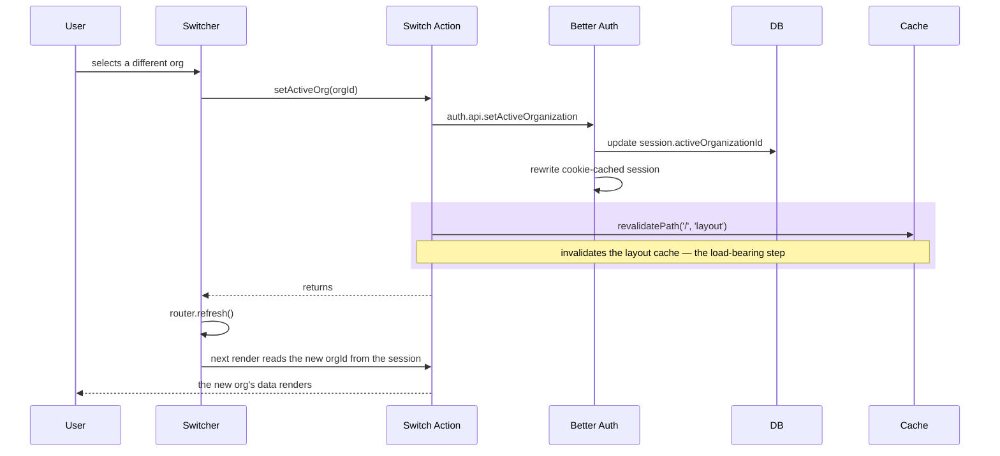

import CourseProgressBar from '../../../components/ui/CourseProgressBar.astro';
import Figure from '../../../components/figures/Figure.astro';
import AnnotatedCode from '../../../components/code/annotated-code/AnnotatedCode.astro';
import AnnotatedStep from '../../../components/code/annotated-code/AnnotatedStep.astro';
import CodeVariants from '../../../components/code/code-variants/CodeVariants.astro';
import CodeVariant from '../../../components/code/code-variants/CodeVariant.astro';
import Buckets from '../../../components/exercises/buckets/Buckets.astro';
import Bucket from '../../../components/exercises/buckets/Bucket.astro';
import Item from '../../../components/exercises/buckets/Item.astro';
import Term from '../../../components/ui/Term.astro';
import ExternalResource from '../../../components/ui/ExternalResource.astro';
import VideoCallout from '../../../components/embeds/VideoCallout.astro';
import { Steps, CardGrid } from '@astrojs/starlight/components';

<CourseProgressBar value={frontmatter['course-progress']} />

The authentication unit left you with an app that knows about *people*: a user signs up, verifies their email, signs in, and lands on a protected dashboard backed by four tables and the `getCurrentUser`/`requireUser` ladder. But real SaaS isn't sold to people, it's sold to *companies*. One person might run several through your product, a consultancy invoicing under one brand and a side venture under another, while teammates sign in to the same company and see the same invoices. So the unit of ownership becomes the *organization*, and almost every row your app stores from here on belongs to one.

That shift raises a schema question: where does the company live, and how does a session know which one a user is *currently* working inside? By the end of this lesson you'll have organizations installed, a session that carries the active one forward, and the create, switch, and list surface that moves a user between them, all without writing a single `CREATE TABLE`, because the plugin generates the schema for you.

## Where the company lives: three tables from one plugin

Don't hand-write an `organizations` table and a join table linking users to it. The org data model is solved, and Better Auth ships it as a plugin: add the plugin, regenerate the schema, and three tables drop in next to your existing four.

This is <Term definition="One application instance serving many isolated customer organizations, each unable to see the others' data.">multi-tenancy</Term>, and the plugin owns three tables for it:

- **`organization`** is the company itself: `id`, `name`, `slug`, optional `logo` and `metadata`, `createdAt`.
- **`member`** is the <Term definition="A row that links two tables in a many-to-many relationship: here, which user belongs to which organization, and in what role.">join table</Term>: `id`, `userId`, `organizationId`, `role`, `createdAt`. A user reaches an org *through* one of these rows.
- **`invitation`** is the pending-invite record. All three tables ship together, so its columns exist now, but the invite-and-accept flow waits for a later chapter.

<VideoCallout videoId="bFLGwVyIotA" videoTitle="Multi-Tenant SaaS Architecture in 3 Simple Steps">
  Jan Marshal's first ten minutes (skip the build) walk through the multi-tenancy concept and the org-id ERD this lesson is built on.
</VideoCallout>

### Wiring the plugin

Two files change together: the server `auth` instance gains the plugin, and the browser `authClient` gains its matching client plugin.

<CodeVariants>
  <CodeVariant label="src/lib/auth.ts">
    <div data-mark-color="green">

    ```ts {2,8-10}
    import { betterAuth } from 'better-auth';
    import { organization } from 'better-auth/plugins';
    import { nextCookies } from 'better-auth/next-js';

    export const auth = betterAuth({
      // ...adapter, email/password, and session config from the auth chapters
      plugins: [
        organization({
          teams: { enabled: false },
        }),
        nextCookies(),
      ],
    });
    ```

    </div>
    `organization()` goes in the `plugins` array, and `nextCookies()` must stay **last**: it flushes Better Auth's `Set-Cookie` headers onto the response, so any plugin after it won't get its cookies written. The next section covers `teams: { enabled: false }`.
  </CodeVariant>

  <CodeVariant label="src/lib/auth-client.ts">
    <div data-mark-color="green">

    ```ts {2,6}
    import { createAuthClient } from 'better-auth/react';
    import { organizationClient } from 'better-auth/client/plugins';

    export const authClient = createAuthClient({
      plugins: [
        organizationClient(),
      ],
    });
    ```

    </div>
    The client's plugin set must mirror the server's. Without `organizationClient()`, the typed `authClient.organization.create`, `.setActive`, and `.list` methods don't exist and your editor won't autocomplete them.
  </CodeVariant>
</CodeVariants>

### Generating the schema

The plugin declares the tables but doesn't write them. Run the same Better Auth schema generator you used for the four core tables, review the diff, and migrate with Drizzle Kit.

<Steps>

1. Run the generator. It reads your `auth` config, sees the organization plugin, and writes the three new tables plus a new column on `session` into `src/db/schema/auth.ts`.

   ```bash
   npx @better-auth/cli generate
   ```

2. **Read the diff before you trust it.** You should see `organization`, `member`, and `invitation` appear, plus one quiet addition: an `activeOrganizationId` column on the existing `session` table. That column is the centerpiece of this lesson, so hold onto it.

3. Generate and apply the migration, named the way every migration in this project is.

   ```bash
   npx drizzle-kit generate --name add_organizations
   npx drizzle-kit migrate
   ```

</Steps>

### Don't rename the plugin's tables

The generated schema names the tables `organization` and `member`, singular, not the plural your house style might prefer. Leave them: every plugin call issues SQL against those exact names, so a rename breaks every call at runtime with no type error to warn you.

<Figure>
```d2
direction: right

**.style.font-size: 28

classes: {
  dormant: {
    style: {
      fill: "#f3f4f6"
      stroke: "#9ca3af"
      font-color: "#9ca3af"
    }
  }
}

user: {
  shape: sql_table
  id: text { constraint: primary_key }
  email: text { constraint: unique }
}

session: {
  shape: sql_table
  id: text { constraint: primary_key }
  userId: text { constraint: foreign_key }
  activeOrganizationId: "activeOrganizationId  (active org)" { constraint: foreign_key }
}

organization: {
  shape: sql_table
  id: text { constraint: primary_key }
  name: text
  slug: text { constraint: unique }
}

member: {
  shape: sql_table
  id: text { constraint: primary_key }
  userId: text { constraint: foreign_key }
  organizationId: text { constraint: foreign_key }
  role: text
}

invitation: "invitation  —  wired in a later chapter" {
  class: dormant
  shape: sql_table
  id: text { constraint: primary_key }
  organizationId: text { constraint: foreign_key }
  email: text
}

member.userId -> user.id
member.organizationId -> organization.id
session.userId -> user.id
session.activeOrganizationId -> organization.id: "active org" {
  style: { stroke: "#7c3aed"; stroke-width: 4; font-color: "#7c3aed" }
}
invitation.organizationId -> organization.id: {
  style: { stroke: "#9ca3af"; stroke-dash: 4 }
}
```
  <Fragment slot="caption">
    A user reaches an organization *through* a `member` row, and the session points at the one org active right now. The violet edge marks `session.activeOrganizationId`, the column this lesson adds and the rest of the chapter rides on. `invitation` stays dormant for now.
  </Fragment>
</Figure>

## Organizations only: why teams stay off

`teams: { enabled: false }` is a decision. The plugin models two levels of hierarchy. The first is the organization: a company whose members each hold a role inside it, which is what you're building. The second lives *inside* the org, where one company can hold a Sales team and an Engineering team and the session gains an `activeTeamId` beside the active org.

A year-one app doesn't need that second level. Until a customer needs separate scopes for departments inside one company, teams buy nothing but config and migration weight, so you turn them off in writing where the next developer reads it as a choice, not an oversight. The day departments become real, flip the line to `true`: the plugin adds the `team` and `teamMember` tables and the `activeTeamId` slot, and you build the team layer on the org layer you already have.

## One slot per session: adding activeOrganizationId

The generate step added one column to `session`: `activeOrganizationId`, a nullable string foreign key to `organization.id`. It answers which org the user is working inside right now. There is **one row per session**, and that row carries exactly one active org. Switching companies doesn't mint a new session; it rewrites the existing row's `activeOrganizationId`.

### Why on `session` and not on `user`

The active org feels like a property of the *person*, so the instinct is to put it on the `user` row. Resist it.

One human can have two sessions open at once. Picture a founder reviewing their consultancy's invoices in one tab while triaging Acme's in another: two tabs, two active orgs, one person. If the active org lived on `user`, both tabs would share one slot, and switching in one would change the other.

You've already met this model. Each `session` row is independent: its own cookie, its own `ipAddress` and `userAgent`, revocable on its own. The active org is one more column on that row, so each device carries its own.

### Server-side session state, not URL, not client

The active org is **server-side session state**: it lives on a database row only the server can read and write. It is not URL state, with no `/o/:orgId/...` segment driving which tenant you see, and not client state, with no `localStorage.activeOrg` or browser-set cookie.

Both alternatives feel convenient and both are wrong, for a reason that lands in full next lesson. The helper that scopes every database read to the current org reads `orgId` from the validated session and nowhere else. The moment org identity comes from a source the user can edit, a URL segment, a form field, a client cookie, they can type another company's id and read its data. Keeping the active org on the session, where the server is the only writer, closes that hole.

Sort the state below into where it belongs before you write code that depends on it.

<Buckets twoCol instructions="Sort each piece of state into where it should live. The trap is the difference between *linking* to an org and deciding which org's data the request is allowed to touch.">
  <Bucket name="session" label="Session row" description="Server-side, one per device — only the server writes it" />
  <Bucket name="user" label="User row" description="Server-side, one per person" />
  <Bucket name="wrong" label="URL or client state" description="Wrong home for a tenancy decision" />

  <Item bucket="session">`activeOrganizationId`</Item>
  <Item bucket="session">Which org's data the dashboard renders right now</Item>
  <Item bucket="user">`email`</Item>
  <Item bucket="user">The user's display name</Item>
  <Item bucket="wrong">`localStorage.activeOrg`</Item>
  <Item bucket="wrong">An `orgId` from a route param the server trusts</Item>
</Buckets>

<details>
<summary>Why each lands where it does, and the one subtle case</summary>

- **Session row.** `activeOrganizationId` and "which org's data the dashboard renders right now" are the *same* decision: which company this *device* is operating inside. Per-session, so it lives on `session`.
- **User row.** `email` and display name belong to the *person*, the same on every device, so they live on `user`.
- **URL or client state.** `localStorage.activeOrg` drifts from the server's truth and breaks the moment two devices disagree. An `orgId` pulled from a route param and trusted bypasses the membership check, which is next lesson's security hole.

The subtle one: an org *slug* in a shareable deep link like `/o/acme/invoices/123` is **fine**, because a URL is good for *linking* to a resource. What's wrong is using that path value as the *tenancy decision*. The server still resolves the active org from the session and verifies membership; it never trusts the slug in the path.

</details>

## Setting the initial active org on session creation

The slot exists. Who fills it when a user signs in?

Your first thought is the sign-in action: read the user's first org, set `activeOrganizationId`, done. Resist it: that covers one entry point. Sign-up mints a session too, as will every auth method you add later, like OAuth callbacks and magic links. Set the org only in sign-in and they all ship `null`, a latent bug that surfaces the day someone wires up Google sign-in.

One place covers every session-minting path by construction: a database hook on session creation. Better Auth lets you intercept the session row before it's written and return a modified version, so no entry point can slip past.

This hook is the whole mechanism.

<AnnotatedCode lang="ts" maxLines={12} code={`
databaseHooks: {
  session: {
    create: {
      before: async (session) => {
        const activeOrganizationId = await resolveInitialOrg(session.userId);
        return { data: { ...session, activeOrganizationId } };
      },
    },
  },
}
`}>
  <AnnotatedStep meta="{4}" color="violet">
    The **`before` phase** runs before the row is inserted, and whatever you return becomes that row. You shape the row on its way into the database instead of patching it afterward.
  </AnnotatedStep>

  <AnnotatedStep meta={`{6} "{ data:"`} color="violet">
    The **return contract** is an object with a `data` key, not the bare session. Spread the existing session before overriding so every framework-set field survives and you change only one. Returning `{ ...session }` instead of `{ data: { ...session } }` is the common mistake: the hook then silently does nothing.
  </AnnotatedStep>

  <AnnotatedStep meta={`"activeOrganizationId" "resolveInitialOrg"`} color="violet">
    The **override** sets `activeOrganizationId` on top of the spread. The hook handles shape; which org to pick lives in `resolveInitialOrg`, next.
  </AnnotatedStep>
</AnnotatedCode>

The helper decides which org a new session opens into. The policy: pick one of the user's memberships if they have any (here, their **most recent**), and fall back to **`null`** when they have none. It's a short read against `member`.

```ts title="src/lib/auth/resolve-initial-org.ts"
export const resolveInitialOrg = async (
  userId: string,
): Promise<string | null> => {
  const membership = await db.query.member.findFirst({
    where: eq(member.userId, userId),
    orderBy: desc(member.createdAt),
    columns: { organizationId: true },
  });

  return membership?.organizationId ?? null;
};
```

The point is the policy, not the query. A user with memberships opens into one of their orgs; a user with none gets `null`, which is not an error but the next section's whole subject. To reopen each user into their *last* active org, persist the choice in a column and read it here first; this default is enough to start.

## A null active org redirects new users to onboarding

A user who just signed up has zero memberships, so `resolveInitialOrg` returns `null` and their session's `activeOrganizationId` is `null`. This is an expected state, "signed in, but no active org," and your app needs exactly one place that handles it and one place where it's allowed.

That place is the protected layout. Your `(protected)/layout.tsx` already calls `requireUser()` to gate the authenticated surface, reading the cached session. The active org rides on that same session row, so resolve it from the same read rather than fire a second `getSession`. `requireOrgUser()`, which you'll build at the end of this lesson, does that: one cached read returns the user and the active `orgId`, and redirects to `/onboarding/create-org` itself when that org is `null`.

```tsx title="src/app/(protected)/layout.tsx" {1}
const { user, orgId } = await requireOrgUser();

// One ladder read gates the user, resolves the active org, and has already
// redirected to /onboarding/create-org if it was null. Below here, orgId is
// guaranteed non-null.
```

For now `/onboarding/create-org` is a stub, an empty page with a heading; the real create form comes next. What matters is the invariant this single read establishes:

**`/onboarding/create-org` is the only route in the authenticated app that tolerates a null active org.** Every other read assumes a non-null org, and next lesson's data helper enforces that. The null branch lives inside `requireOrgUser` so the redirect sits in one helper, called once at the top of the layout, instead of scattered across every page.

:::caution
Keep the proxy cookie-presence only, or this branch becomes an infinite loop. The proxy checks only for a session cookie, so an org-less user passes through, hits the layout, and is redirected to `/onboarding/create-org`. If the proxy also gated that route on something an org-less user can't satisfy, they'd bounce forever. Authorization lives at the layout, never the proxy.
:::

## Creating an organization

The create flow is a form you've built many times: uncontrolled inputs, a Zod schema at the boundary, a Server Action returning a `Result`, and errors read back through `useActionState`. The one new decision is the slug.

### The slug decision

Every org needs a <Term definition="A URL-safe, lowercase identifier for a resource, like the acme in /o/acme/dashboard.">slug</Term>, the stable handle in URLs and emails like `/o/acme/dashboard` and `noreply+acme@yourapp.com`. Two strategies:

- **App-generated** from the name, with a uniqueness suffix: the second "Acme" becomes `acme-2`.
- **User-chosen** at create time, rejecting taken slugs.

Choose **user-chosen**. Companies care about their URL identity, and an `acme-2` they never asked for surfaces in every link they share. A taken handle is a normal part of the flow, not an error to engineer around. You'll validate the slug at the action boundary against `^[a-z0-9-]{3,32}$` and a blocklist of reserved words (`admin`, `api`, `app`, `auth`, `billing`) so it can never collide with a future top-level route.

### The call and the action

`authClient.organization.create({ name, slug })` does the work in one round trip: it checks slug uniqueness, inserts the `organization` row, inserts a `member` row with role `owner` for the creator, and sets the session's `activeOrganizationId` to the new org (not preserved by default). The Server Action is the five-seam shape (parse, authorize, mutate, revalidate, return) with the org-specific parts called out.

<AnnotatedCode lang="ts" maxLines={18} code={`
'use server';

const CreateOrgSchema = z.strictObject({
  name: z.string().trim().min(1).max(100),
  slug: z
    .string()
    .regex(/^[a-z0-9-]{3,32}$/)
    .refine((s) => !RESERVED_SLUGS.has(s), 'That handle is reserved.'),
});

export const createOrg = async (
  _prevState: Result<never> | null,
  formData: FormData,
): Promise<Result<never>> => {
  const parsed = CreateOrgSchema.safeParse(Object.fromEntries(formData));
  if (!parsed.success) {
    return err(
      'validation',
      'Check the highlighted fields.',
      z.flattenError(parsed.error).fieldErrors,
    );
  }

  await requireUser();

  try {
    await auth.api.createOrganization({
      body: parsed.data,
      headers: await headers(),
    });
  } catch {
    return err('conflict', 'That handle is taken.', {
      slug: ['That handle is taken.'],
    });
  }

  revalidatePath('/', 'layout');
  redirect('/dashboard');
};
`}>
  <AnnotatedStep meta="{3-9}" color="blue">
    **Parse.** The slug rules from above become the schema: the `^[a-z0-9-]{3,32}$` regex plus the reserved-word `.refine`, so a bad shape returns a `validation` result before any database call.
  </AnnotatedStep>

  <AnnotatedStep meta="{24}" color="blue">
    **Authorize.** `requireUser()` is the whole gate: any signed-in user may create an org, since the creator has no role in an org that doesn't exist yet.
  </AnnotatedStep>

  <AnnotatedStep meta="{27-30}" color="blue">
    **Mutate.** The server-side twin of `authClient.organization.create`, where `headers: await headers()` reads the current session as every `auth.api` call does.
  </AnnotatedStep>

  <AnnotatedStep meta="{31-35}" color="blue">
    **Map the failure.** A taken slug is the one expected error, mapped to a `conflict` result with a `fieldErrors.slug` message for the form to render under the slug input.
  </AnnotatedStep>

  <AnnotatedStep meta="{37-38}" color="blue">
    **Revalidate, then redirect.** The new org is now active, so `revalidatePath('/', 'layout')` clears the stale switcher and org-scoped reads before redirecting to `/dashboard`.
  </AnnotatedStep>
</AnnotatedCode>

The form is the familiar uncontrolled-input, `useActionState`, `<SubmitButton>` shape. The one org-specific touch is the slug field reading its error from the result:

```tsx
<FieldError>{state?.error.fieldErrors?.slug?.[0]}</FieldError>
```

Both a bad slug shape (`validation`) and a taken slug (`conflict`) land in that same `fieldErrors.slug` slot, so the field shows the right message whichever way create fails.

## Switching the active org and invalidating its cache

Switching orgs is **two moves that always travel together**: change the active org, then invalidate the cache keyed to the old one. Do the first without the second and you ship the headline bug of this lesson.

### The call

`authClient.organization.setActive({ organizationId })` verifies the user belongs to the target org, updates `activeOrganizationId` on the session row, and rewrites the cookie-cached session immediately, so the next request reads the new value.

### Invalidate the cache on switch

After `setActive`, every layout and page cached under the old org is stale. If the switch action stops there, the user clicks over to Acme and the dashboard keeps streaming the consultancy's invoices until the route cache happens to expire. They switched companies and the data didn't follow; to them, the switch silently failed.

So the action calls `revalidatePath('/', 'layout')` after `setActive` to clear the server-rendered cache, then `router.refresh()` on the client pulls the freshly-rendered layout.

```ts title="src/app/(protected)/set-active-org-action.ts"
'use server';

export const setActiveOrg = async (organizationId: string): Promise<void> => {
  await auth.api.setActiveOrganization({
    body: { organizationId },
    headers: await headers(),
  });
  revalidatePath('/', 'layout');
};
```

One wrong fix to rule out: shortening the cookie-cache window. Better Auth caches the decoded session for a few minutes to skip a database hit per request, but that window is irrelevant here, because `setActive` rewrites the cookie on the spot. The cache isn't the problem; a missing `revalidatePath` is.

<Figure>

```mermaid
%%{init: {'themeCSS': '.messageText, .messageText tspan { font-size: 19px !important; } .actor, .actor tspan { font-size: 15px !important; } .noteText, .noteText tspan { font-size: 15px !important; }'} }%%
sequenceDiagram
  participant U as User
  participant S as Switcher
  participant A as Switch Action
  participant BA as Better Auth
  participant DB as DB
  participant C as Cache

  U->>S: selects a different org
  S->>A: setActiveOrg(orgId)
  A->>BA: auth.api.setActiveOrganization
  BA->>DB: update session.activeOrganizationId
  BA->>BA: rewrite cookie-cached session
  rect rgba(124, 58, 237, 0.16)
  A->>C: revalidatePath('/', 'layout')
  Note over A,C: invalidates the layout cache — the load-bearing step
  end
  A-->>S: returns
  S->>S: router.refresh()
  S->>A: next render reads the new orgId from the session
  A-->>U: the new org's data renders
```
  <Fragment slot="caption">
    The switch, end to end. `revalidatePath` sits between the database write and the next render: skip it and the next render reads fresh org state from a stale cache.
  </Fragment>
</Figure>

### One nuance: in-flight actions are snapshots

What if the user switches orgs while a slow save from the old org is still in flight? That action read its `orgId` when it started, so it writes against the old org, and **that's correct**. An action resolves in the context it began; the write landing in the old org is the model behaving consistently under concurrency, and `router.refresh()` keeps the UI unambiguous afterward.

## The org switcher in the layout

The switcher is a dropdown in the protected-layout header: it lists the user's orgs and calls the switch action on change. It's chrome, not the model, so keep it small. Two decisions shape it.

First, where the org list comes from. Read it on the client with `authClient.organization.list()` and the switcher flashes empty on the first paint, before the fetch returns. Read it on the server instead, in the layout, and pass it down as a prop with `auth.api.listOrganizations({ headers: await headers() })`; now it renders populated from the first frame.

Second, where the switcher lives: **once, in the protected layout**, not per page. One mount point is one source of truth for the membership list and one caller of the switch action. Scatter it across pages and the copies drift. Cross-cutting chrome belongs to the layout, like the nav strip already there.

```tsx title="src/app/(protected)/layout.tsx" {1,2-4,11-14}
const { orgId } = await requireOrgUser(); // one ladder read — gate + active org
const organizations = await auth.api.listOrganizations({
  headers: await headers(),
});

// requireOrgUser already redirected an org-less user to /onboarding/create-org.

return (
  <>
    <header className="flex items-center justify-between border-b px-6 py-4">
      <OrgSwitcher
        organizations={organizations}
        activeOrgId={orgId}
      />
      {/* ...the user email + sign-out form... */}
    </header>
    <main>{children}</main>
  </>
);
```

`<OrgSwitcher>` is a client island: a `<Select>` with the active org preselected that calls `setActiveOrg(orgId)` then `router.refresh()` on change. The server feeds the list, the action fires and revalidates, and the page re-renders under the new org.

<VideoCallout videoId="grvwy4qySVI" videoTitle="Better Auth Organizations – The Basics (Part 1)">
  OrcDev builds organizations end to end (25 min) on this same Better Auth and Next.js stack, including the exact switcher-staleness fix this lesson centers on.
</VideoCallout>

## Reading the active org at request time: requireOrgUser

Everything so far has set the active org. The last piece reads it, once and from one place, so every server surface that touches tenant data resolves the same `orgId` the same way.

You have two rungs of the session-read ladder so far: `getCurrentUser()` for surfaces that render differently signed-in versus signed-out, and `requireUser()` for protected pages and actions. The protected layout already reached for the third, **`requireOrgUser(role?)`**, which returns `{ user, orgId, role }`.

```ts title="src/lib/auth.ts"
export const requireOrgUser = cache(async () => {
  const session = await getSession();

  if (!session?.user) {
    redirect('/sign-in');
  }
  if (!session.session.activeOrganizationId) {
    redirect('/onboarding/create-org');
  }

  const activeMember = await auth.api.getActiveMember({
    headers: await headers(),
  });

  return {
    user: session.user,
    orgId: session.session.activeOrganizationId,
    role: activeMember?.role ?? null,
  };
});
```

It resolves the session through the same React-`cache`d `getSession` the rest of the ladder uses, so it shares the per-request dedupe instead of firing a second read. No user redirects to sign-in; a null active org redirects to `/onboarding/create-org`, the same branch the layout leaned on, now in one helper so actions get it too, not just page renders. Then it reads the caller's membership for `role` and returns it alongside the non-null `orgId`.

It returns `role` but does not gate on it. The `role?` parameter and the rules for who's an `owner` or `admin` are the next chapter's job; here `role` just rides along so the seam is ready.

Now the rule the whole lesson was building toward:

**`orgId` comes only from the server-validated session: never a route param, never a form field, never a client header.**

Next lesson's `tenantDb(orgId)` trusts this `orgId` to scope every database read. If `orgId` could come from the URL, a user could read another company's invoices by editing a path segment; because its only source is `requireOrgUser`, reading a session the server alone controls, it can't. So every tenant-scoped action and Server Component in the rest of this course opens with one line:

```ts
const { user, orgId } = await requireOrgUser();
```

Next lesson hands that `orgId` to `tenantDb` and makes a missing org filter, the one-line mistake that would leak every customer's data, fail to compile.

<CardGrid>
  <ExternalResource
    title="Better Auth — Organization plugin"
    href="https://www.better-auth.com/docs/plugins/organization"
    icon="simple-icons:betterauth"
    iconColor="#000000"
    description="The organization plugin reference — the three tables, create / setActive / listOrganizations, and the teams option you turned off."
  />
  <ExternalResource
    title="Better Auth — Database hooks"
    href="https://www.better-auth.com/docs/concepts/database#database-hooks"
    icon="simple-icons:betterauth"
    iconColor="#000000"
    description="The session.create.before hook shape behind setting the initial active org on every session-minting path."
  />
  <ExternalResource
    title="Next.js — revalidatePath"
    href="https://nextjs.org/docs/app/api-reference/functions/revalidatePath"
    icon="simple-icons:nextdotjs"
    iconColor="#000000"
    description="The layout-scoped revalidation the switch action fires so a stale org's cache doesn't outlive the switch."
  />
</CardGrid>
