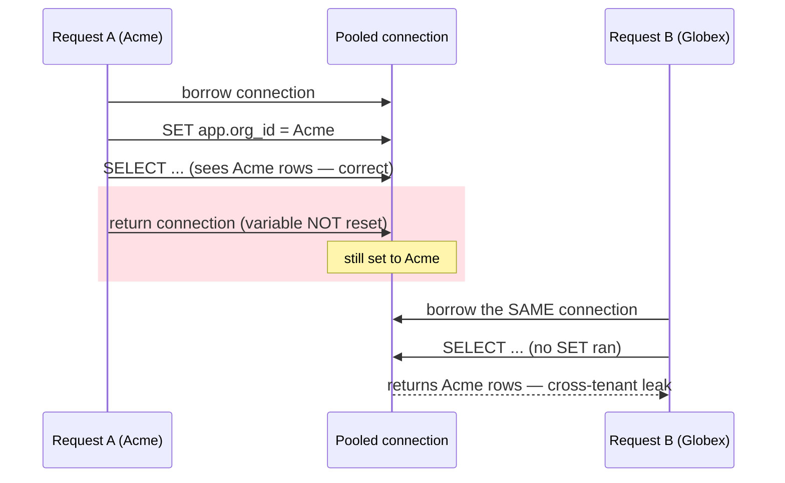
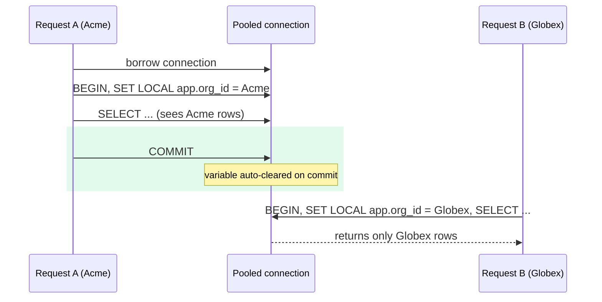

import TabbedContent from '../../../components/figures/tabbed-content/TabbedContent.astro';
import TabbedItem from '../../../components/figures/tabbed-content/TabbedItem.astro';
import Figure from '../../../components/figures/Figure.astro';
import StateMachineWalker from '../../../components/figures/state-machine-walker/StateMachineWalker.astro';
import Question from '../../../components/figures/state-machine-walker/Question.astro';
import Branch from '../../../components/figures/state-machine-walker/Branch.astro';
import Leaf from '../../../components/figures/state-machine-walker/Leaf.astro';
import TrueFalse from '../../../components/exercises/true-false/TrueFalse.astro';
import Statement from '../../../components/exercises/true-false/Statement.astro';
import TfWhy from '../../../components/exercises/true-false/TfWhy.astro';
import Buckets from '../../../components/exercises/buckets/Buckets.astro';
import Bucket from '../../../components/exercises/buckets/Bucket.astro';
import Item from '../../../components/exercises/buckets/Item.astro';
import ExternalResource from '../../../components/ui/ExternalResource.astro';
import { Card, CardGrid } from '@astrojs/starlight/components';
import LayeredDefenseGates from '../../../components/lessons/056/3/LayeredDefenseGates.astro';
import Term from '../../../components/ui/Term.astro';
import CourseProgressBar from '../../../components/ui/CourseProgressBar.astro';

<CourseProgressBar value={frontmatter['course-progress']} />

You shipped `tenantDb` in the last lesson. In the normal request path, the missing org filter no longer compiles: forget the scope and the code won't typecheck. So a fair question arrives. Are you done, or do you also need Postgres <Term definition="Row-Level Security — a Postgres feature where a table refuses to return or modify rows that don't match a per-row policy condition, enforced inside the database for every query and every connection.">Row-Level Security</Term> on top of that?

Search for the answer and you'll find a thread that contradicts itself. Half the replies say RLS belongs on every table, no exceptions, because the database is your last line of defense. The other half say never bother and just scope it in the application. Both sides write with total confidence, and both are wrong as stated, because both skip the only question that matters: for which table, and at what cost.

This lesson answers that question. Here is the verdict up front. Application-layer scope is your year-one default: `tenantDb` everywhere, every tenant table, no exceptions. RLS is a conditional addition, applied per table only when a specific threshold is crossed. You won't write a policy here, since that's the next lesson, but by the end you'll be able to look at any table you design and decide, defensibly, whether it needs one. For this course's stack, you'll run that decision and land RLS on exactly one table.

## What Row-Level Security actually buys you

To weigh RLS honestly you need a precise picture of what it does, so let's get the mechanism right before we judge it.

You attach a <Term definition="A per-row boolean rule Postgres evaluates to decide which rows a query is allowed to see or modify.">policy</Term> to a table. The policy is a boolean condition. From that point on, every query against that table has that condition evaluated row by row, and the database silently drops the rows that don't match. This applies to every `SELECT`, `INSERT`, `UPDATE`, and `DELETE`, from every connection, on every code path. The filtering happens in the database engine itself, not in the application.

Here's what one looks like, so you have something concrete to picture.

```sql title="Illustrative only — you'll author the real policy in Drizzle next lesson"
USING (organization_id = current_setting('app.org_id')::uuid)
```

Read it loosely as "only return rows whose `organization_id` equals the org id stashed on this connection." The exact spelling, including what `current_setting` reads and why the cast is there, is the next lesson's job. What matters now is the shape of the guarantee.

The guarantee is the whole point: this defense is total within the database boundary, and it does not depend on application discipline. Picture the worst case. A developer omits the org filter entirely, forgetting the `where`, reaching past `tenantDb` to the raw client, running hand-written SQL in a one-off script. With RLS on the table, the database still refuses to hand back another org's rows, because the condition runs regardless of how the query got there.

Compare that to `tenantDb`. The helper is excellent at what it does: it makes the scoped query the only call shape that compiles, so the missing filter becomes a type error instead of a silent leak. But it lives in your application. It guards the door you walk through every day, and does nothing about the door it can't see. Reach for the unwrapped `db` client and the helper is simply not in the picture, so nothing about that code fails to compile. RLS lives one layer down, in the database, where that escape hatch doesn't exist.

Hold onto that contrast, because it's the seed of the entire decision. The helper catches what flows through it; RLS catches everything; and the rest of the lesson is the price of "everything."

## What Row-Level Security costs you

If RLS catches everything, why isn't it on by default? Because "everything" has a bill, and naming that bill honestly is exactly what the *RLS on every table* crowd skips. There are three costs, and none of them are the abstract "overhead" people wave at. They're concrete, recurring, and they land on real people on your team.

**First, every connection needs a session variable set before its first query.** The policy compares against an org id stashed on the connection, a <Term definition="A connection-scoped key/value Postgres holds for the life of a session, read back with current_setting; the tenant id is stashed here so a policy has something to compare each row against.">session variable</Term>, so something has to run `SET app.org_id = '...'` on that connection before any query touches the table. Your connection pool also has to support setting that state and, critically, resetting it between uses. This is the seam where the next, more dangerous cost lives.

**Second, local debugging gets harder.** A developer opens `psql`, runs `SELECT * FROM audit_logs`, and gets zero rows. The data is right there in the table, but the session variable isn't set, so the policy matches nothing and the database returns an empty result with no error and no explanation. They spend twenty minutes convinced the data was deleted before they remember they're behind a policy. This "why are there no rows" loop happens repeatedly to everyone who works on an RLS table. It's a tax on every debugging session, not a one-time setup cost.

**Third, policy authoring is its own discipline, and a wrong policy fails silently.** A policy that's slightly too strict, excluding legitimate rows, doesn't crash. It shows empty lists, missing records, a dashboard with nothing on it, and no error anywhere. Nobody notices for a week, because "no data" reads as "no data," not as "broken." A silent-empty failure is genuinely worse than a loud crash: a crash gets a stack trace and a fix that afternoon, while a quietly wrong policy gets shipped, sits in production, and surfaces as a confused support ticket days later.

Now hold those three costs against what you already have. You have `tenantDb` enforcing the scope at the application layer, plus a code-review reflex that checks the client import and where the `orgId` came from. That combination gives you most of the protection at a fraction of the cost: no session variables, no empty `psql`, no silent policies. So RLS doesn't get to justify itself in a vacuum. It has to clear that bar by adding enough defense over the helper-plus-review baseline to be worth these three recurring costs. On most tables it doesn't, and on a few it does. The rest of the lesson is about telling them apart.

## The pooled-connection footgun

The first cost, that session variable on the connection, deserves its own section, because if it's handled casually it turns RLS from a safety net into a cross-tenant leak. This is the most important thing to watch out for in the lesson, and the reason the next lesson's transaction discipline is not optional. Let's build it up one step at a time.

Start with a premise you might not be holding, because it inverts the naive mental model. In 2026, your application does not open a fresh database connection for each request. Opening connections is expensive, so connections are pooled and reused: Drizzle's default Postgres adapter pools them, Neon's serverless driver pools them, and PgBouncer in transaction mode pools them. Request A borrows a connection from the pool, does its work, and returns it. Moments later, Request B is handed the same physical connection.

Now layer RLS on top. The policy reads `current_setting('app.org_id')`, and that value is set per connection. A session variable persists across reuses of the same connection: it stays set until something resets it or the connection closes. Put those two facts together and the danger is immediate.

There are two ways it leaks, and both are cross-tenant disasters:

- **Inheritance.** Request A sets `app.org_id` to Acme and runs its query. The connection goes back to the pool still carrying Acme's value. Request B, a Globex user, borrows that same connection and queries `audit_logs`, but the framework didn't set the variable for B. The policy reads the stale Acme value left behind, so Globex's user reads Acme's audit log.
- **No reset.** This is the same root cause stated from the other side: A sets the variable and never clears it, so whoever lands on that connection next inherits A's tenant until someone overwrites it.

Consider how bad this is. You turned RLS on, the apparently secure move, and the result is a connection that quietly carries one tenant's identity into the next tenant's request. The naive setup doesn't just fail to help; it looks secure while leaking. That is worse than no RLS at all, because no RLS at least doesn't lull you into trusting a broken backstop.

<TabbedContent syncKey="pooled-connection-footgun">
  <TabbedItem label="The leak" icon="error">

    <Fragment slot="caption">
      The variable outlives the request that set it. B never ran a `SET`, so the policy reads Acme's stale value left on the connection. The fix is built next lesson.
    </Fragment>
  </TabbedItem>

  <TabbedItem label="The fix" icon="approve-check">

    <Fragment slot="caption">
      `SET LOCAL` binds the variable to the *transaction*, so Postgres clears it on commit or rollback and it can't survive to the connection's next checkout. Full wiring in the next lesson.
    </Fragment>
  </TabbedItem>
</TabbedContent>

The mitigation is `SET LOCAL`, run inside an explicit transaction. `SET LOCAL` binds the variable to the transaction rather than the connection, and Postgres clears it automatically when that transaction commits or rolls back, so it cannot survive to the connection's next checkout. The full machinery, a `withTenant(orgId, fn)` helper that wraps each request's work in a transaction with the variable set, is the next lesson's deliverable. The point here is simpler: the variable's lifetime is the entire bug, and transaction-scoping is what bounds that lifetime. Turning RLS on without this discipline is not a half-measure but a regression.

:::caution
The lifetime of the session variable is the vulnerability. Any RLS setup that sets it once and trusts it to stick has the leak baked in. The next lesson's transaction wrapper isn't a nice-to-have around RLS; it's the part that makes RLS safe to turn on at all.
:::

## The three triggers that flip the decision

So most tables don't earn RLS, and a few do. What separates them is three triggers. They aren't a checklist you score: any one of them, on its own, flips the decision. Below all three, your application-layer scope plus the review reflex is enough, and adding RLS buys you little while charging you all three costs. Learn to recognize these as situations, not definitions.

<CardGrid>
  <Card title="The data is the highest-stakes class" icon="warning">
    A single missed scope here isn't a bug, it's an incident: <Term definition="Protected Health Information — health data regulated under HIPAA; the canonical example of data whose leak is a legal event, not just an embarrassment.">PHI</Term> under HIPAA, financial PII, audit logs that legal will one day subpoena, or security-sensitive credentials.

    **Why it clears the bar:** one leak is unrecoverable, since you can't un-disclose a breach, so a second, independent layer is worth its operational price.
  </Card>
  <Card title="Many paths the helper can't span" icon="code-branch">
    The table is touched by admin tools, batch jobs, BI dashboards, support consoles, and data exports: entry points that don't all flow through the request-path `tenantDb`.

    **Why it clears the bar:** when the application-layer helper structurally can't cover every door, the database-layer policy covers the doors it misses.
  </Card>
  <Card title="You are not the only writer" icon="puzzle">
    A partner integration, an external job runner, or a third-party reporting tool: code that holds your database credentials and runs SQL your team never reviews.

    **Why it clears the bar:** the helper protects code you write, and RLS protects you against code you don't.
  </Card>
</CardGrid>

The rule is that any one trigger is sufficient. If a table trips even one, RLS earns its place. If it trips none, `tenantDb` plus code review is the right answer, and RLS is cost without commensurate benefit.

## Application-layer scope versus RLS, side by side

Before we turn this into a procedure, let's consolidate the trade-off into one table, the kind you screenshot and keep. Each row is something you can act on, not an adjective.

| | Application scope (`tenantDb`) | Row-Level Security |
| --- | --- | --- |
| **Layer** | Application (TypeScript) | Database (Postgres) |
| **Bug class caught** | Missing `where` in the normal request path, made not-compile | Cross-org read on *any* path, including raw SQL and external writers |
| **Where it fails** | The unwrapped `db` client used deliberately, but that's review-visible (a different import) | The app server is compromised and free to `SET` any org id |
| **Operational cost** | Roughly free: one helper, one review reflex | Session variable per request, pool discipline, harder local debugging, silent-fail policies |
| **Debugging story** | Normal Drizzle; rows are visible in `psql` | "Why are there no rows?" until the variable is set |
| **When to reach** | Always; the unconditional default | Per table, when a trigger fires |

Read the bottom row again, because it's the whole lesson in two cells: `tenantDb` is always, and RLS is sometimes, on top. This table is not a menu you pick one item from. The columns aren't rivals, they're stacked, which is exactly the mental model the next section nails down.

## Two layers, not one: RLS as defense in depth

Here is the rule to carry out of this lesson and repeat in your next code review: even on an RLS-protected table, the application still uses `tenantDb`. RLS does not replace the helper, it joins it.

Think of it as two independent gates a request must pass through to read a row, with the stress on *independent*. The application-layer helper catches the common case in the request path, the 99% of reads that go through your handlers. The database policy catches the case the helper structurally cannot reach, such as a one-off script with hand-written SQL that forgot the filter, or an external integration holding credentials. Neither makes the other redundant, because they fail in different ways, and the value lives precisely in that difference: for data to leak, a single bug now has to slip past both layers at once.

The symmetry is what makes it powerful. A bug in your application, where you forgot to scope a query, is caught by the policy. A bug in your policy, such as a typo in the condition or forgetting to enable it on the table, is caught by the helper. Defense in depth means a single mistake in either layer is survivable, because the other layer is still standing. That's the entire reason to pay RLS's cost on a high-stakes table: not because the helper is unreliable, but because on data where one leak is unrecoverable, you want two layers that fail in different ways instead of one.

<LayeredDefenseGates />

## The "RLS everywhere" anti-pattern

Now you can see precisely why the *RLS on every table* advice backfires. It's worth walking the failure, because it's the most common real-world mistake and the direct foil to the call you're learning to make.

A shop adopts a blanket policy: RLS on everything, no exceptions. It feels rigorous. Here's the cascade that follows.

Every developer hits the missing-session-variable trap weekly, and local work becomes a stop-and-restart loop of empty result sets and "oh, right, the variable." Policy authoring drifts as the schema evolves, with new tables, new columns, and new join shapes, so silent-empty policies quietly accumulate, each one a dashboard that's mysteriously missing rows. Admin scripts sprout special-case "set the variable from the script" boilerplate at every entry point. The most corrosive effect is also the quietest: the helper discipline atrophies. The reasoning becomes "why bother checking the import in review when the database catches it," right up until a pool is misconfigured, the database doesn't catch it, and the cross-tenant bug ships, now with the team's application-layer guard already lowered because everyone stopped trusting it years ago.

That's the trap in one line: blanket RLS takes your conditional layer and makes it mandatory, and in doing so it lets your mandatory layer rot. The senior move is the inverse. The unconditional layer is the helper, always on, every table, checked in every review. RLS is the conditional layer, added precisely where a trigger fires. The fix for a leak is never "more RLS everywhere." It's RLS where a trigger fires, the helper everywhere, and review always.

## The per-table decision you run at table-design time

Time to make this a procedure you can actually run. The key idea is that you decide per table, at design time, when you're adding the table to the schema, rather than as a project-wide switch you flip once. The same well-designed project has RLS on one table and not on the one right next to it. That's not inconsistency, that's the decision working.

Here it is in three steps:

1. **Is this table's cross-tenant leak unrecoverable** for legal, regulatory, audit, or security reasons? If yes, RLS.
2. **Is it written or read by paths outside the request handler**, such as jobs, scripts, or external integrations holding credentials? If yes, RLS, or at minimum an explicitly named and audited review exception.
3. **Otherwise**, use application scope via `tenantDb`, rely on code review for helper discipline, and ship.

Walk it yourself. The order is the lesson: you ask about stakes first, then paths, then fall through to the default. Commit to each branch before you see the next question.

<StateMachineWalker title="Does this table need RLS?">
  <Question id="leak-stakes" prompt="If one row of this table leaked to the wrong org, is it an unrecoverable legal / regulatory / trust incident?">
    <Branch label="Yes — unrecoverable" to="leaf-rls-stakes" />
    <Branch label="No — it'd be a normal bug" to="writer-paths" />
  </Question>

  <Question id="writer-paths" prompt="Is it written or read by paths outside the request handler — jobs, scripts, external integrations with DB credentials?">
    <Branch label="Yes — paths the helper can't span" to="leaf-rls-paths" />
    <Branch label="No — request-path only" to="default-confirm" rationale="Only your reviewed, helper-wrapped code touches it" />
  </Question>

  <Question id="default-confirm" prompt="Then every access goes through code you write and review, on the normal request path." description="No high-stakes leak, no out-of-band writers.">
    <Branch label="Confirm — apply the default" to="leaf-default" />
  </Question>

  <Leaf id="leaf-rls-stakes" verdict="RLS + tenantDb">
    This is the highest-stakes trigger. One leak is unrecoverable, so you want two independent layers: the helper for the request path, the policy for everything else. You still scope every query with `tenantDb`, and RLS sits on top. Build the policy next lesson.
  </Leaf>

  <Leaf id="leaf-rls-paths" verdict="RLS + tenantDb (or a named, audited exception)">
    The helper protects code you write, but these paths run code it can't span. Add the database policy so the doors the helper misses are still guarded. If those paths are few and fully owned by you, an explicitly named and audited review exception can stand in instead. The app still uses `tenantDb` on the request path. Policy wiring is next lesson.
  </Leaf>

  <Leaf id="leaf-default" verdict="Application scope via tenantDb">
    This is the year-one default. The helper makes the scoped query the only call shape that compiles, and review checks the client import. RLS here would buy little and cost session variables, pool discipline, and harder debugging. Ship it.
  </Leaf>
</StateMachineWalker>

Now run that procedure against the tables you already know, so it stops being abstract. The `invoices`, `customers`, and `documents` tables are all request-path, and all carry only normal-bug stakes if something slips. Step 1 says no, step 2 says no, so they land on **application scope via `tenantDb`**. Then take `audit_logs`. A leak there puts forensic evidence in the wrong company's hands, the kind of thing legal subpoenas, so it's unrecoverable and step 1 already says yes. On top of that, it's written from many paths and read by tooling outside the request handler. It trips two triggers, so it lands on **RLS**.

So the chapter's verdict, earned rather than asserted, is **RLS on `audit_logs`, application scope everywhere else.** One table. A fair note on timing: the `audit_logs` table itself, its columns and the events that write to it, arrives in the next chapter, and its RLS policy gets wired in the next lesson. You're deciding that it needs one now, and the how and the where follow.

:::note
The next lesson uses a typed authoring surface for the policy rather than raw `CREATE POLICY` SQL; on Neon's Postgres that's `crudPolicy`. You'll meet it there. Here you only needed to decide that `audit_logs` earns a policy at all.
:::

## Checking the decision

Start with a quick warm-up to practice the per-table call: sort each table into the layer it earns.

<Buckets twoCol instructions="Drop each table where it belongs. Assume the request-path versions hold normal-bug stakes; the audit log is legally-subpoenable and written from many paths.">
  <Bucket name="rls" label="RLS + tenantDb" description="A trigger fires — two independent layers" />
  <Bucket name="helper" label="tenantDb only" description="The year-one default" />

  <Item bucket="rls">`audit_logs`</Item>
  <Item bucket="helper">`invoices`</Item>
  <Item bucket="helper">`customers`</Item>
  <Item bucket="helper">`documents`</Item>
</Buckets>

The heart of this lesson, though, is a set of judgments, so test them as judgments. Work through this round. Each statement targets a specific way this goes wrong in the field, and the reasoning lands in the end-of-round review.

<TrueFalse instructions="Each statement is a judgment a developer might make about RLS in a multi-tenant app.">
  <Statement answer="false">
    Once a table has an RLS policy, you can drop the application-layer `tenantDb` filter for that table.
    <TfWhy>Two independent layers. On an RLS table the application still scopes every query with `tenantDb`; the policy is defense in depth on top, not a replacement. Delete the helper and you've removed a gate.</TfWhy>
  </Statement>

  <Statement answer="false">
    RLS protects you against SQL injection.
    <TfWhy>Orthogonal concerns. Injection is defended by parameterized queries; RLS decides which rows a (correctly parameterized) query may see. One does nothing for the other.</TfWhy>
  </Statement>

  <Statement answer="false">
    Whether to adopt RLS is a project-wide decision you make once.
    <TfWhy>It's per-table, decided at table-design time. The same project correctly has RLS on `audit_logs` and not on `invoices`.</TfWhy>
  </Statement>

  <Statement answer="true">
    With a pooled connection, running `SET app.org_id` without `LOCAL` can leak one request's tenant into the next request on that connection.
    <TfWhy>The footgun. A plain `SET` persists on the connection past the request; the next request to borrow it inherits the stale value. `SET LOCAL` inside a transaction bounds the variable's lifetime so it clears on commit.</TfWhy>
  </Statement>

  <Statement answer="false">
    RLS keeps your data safe even if the application server is compromised and can set any org id it wants.
    <TfWhy>RLS defends against application *bugs*, not application *compromise*. A compromised server can `SET` any tenant id and read freely. That's a least-privilege / DB-role problem — a separate layer covered much later in the course, when you give the app's database role only the privileges it needs.</TfWhy>
  </Statement>

  <Statement answer="true">
    For this course's stack, the senior call is RLS on `audit_logs` and application scope everywhere else.
    <TfWhy>`audit_logs` trips both the highest-stakes and the many-writer-paths triggers; the other tenant tables are request-path with normal-bug stakes, so the helper plus review is the right cost.</TfWhy>
  </Statement>
</TrueFalse>

## External resources

You decided whether and where; the next lesson decides how. If you want to read ahead, these are the canonical references for the mechanism you just learned to reason about.

<CardGrid>
  <ExternalResource
    title="Row Security Policies"
    href="https://www.postgresql.org/docs/current/ddl-rowsecurity.html"
    icon="simple-icons:postgresql"
    iconColor="#4169E1"
    description="The canonical reference for what a policy is and exactly how Postgres evaluates it."
  />
  <ExternalResource
    title="Drizzle ORM — Row-Level Security"
    href="https://orm.drizzle.team/docs/rls"
    icon="simple-icons:drizzle"
    iconColor="#C5F74F"
    description="The typed authoring surface for policies the next lesson uses."
  />
  <ExternalResource
    title="Multi-tenant data isolation with PostgreSQL RLS"
    href="https://aws.amazon.com/blogs/database/multi-tenant-data-isolation-with-postgresql-row-level-security/"
    icon="simple-icons:amazonwebservices"
    iconColor="#FF9900"
    description="AWS on the pooled-connection model — current_setting per tenant and the connection-pooling caveats this lesson warns about."
  />
  <ExternalResource
    title="Shipping multi-tenant SaaS using Postgres RLS"
    href="https://www.thenile.dev/blog/multi-tenant-rls"
    icon="simple-icons:postgresql"
    iconColor="#4169E1"
    description="A production write-up on the silent-fail failure mode and resetting tenant context on reused connections."
  />
</CardGrid>
