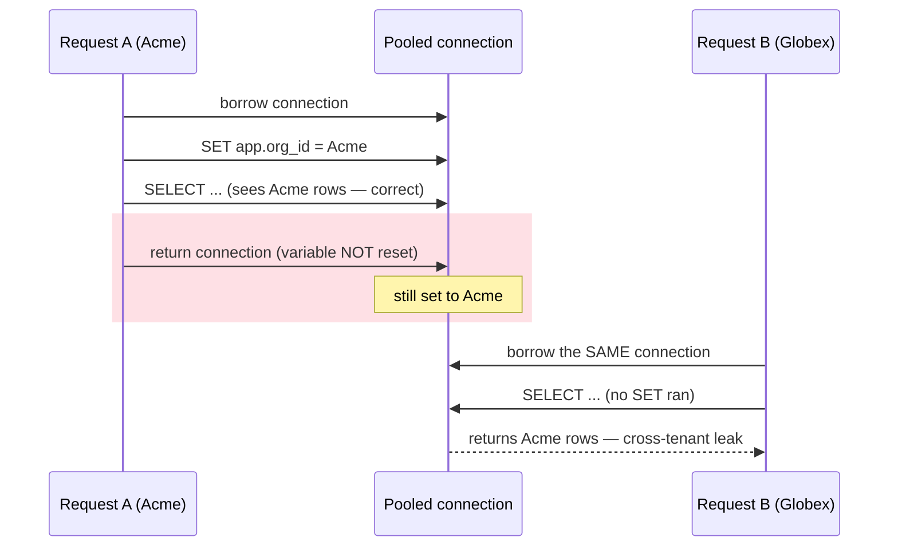
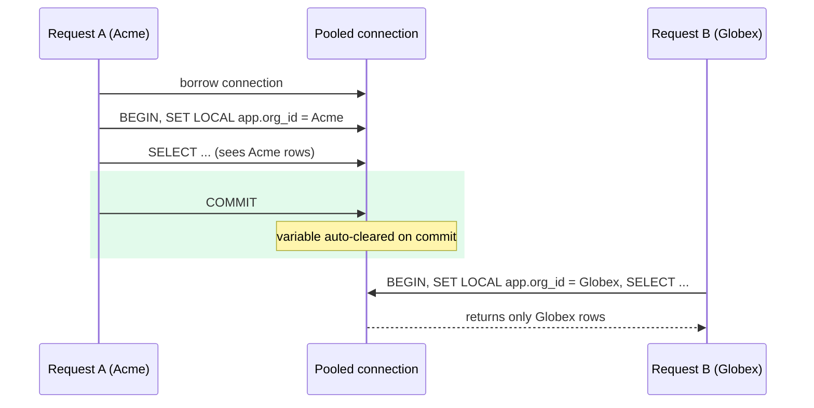

import TabbedContent from '../../../components/figures/tabbed-content/TabbedContent.astro';
import TabbedItem from '../../../components/figures/tabbed-content/TabbedItem.astro';
import Figure from '../../../components/figures/Figure.astro';
import StateMachineWalker from '../../../components/figures/state-machine-walker/StateMachineWalker.astro';
import Question from '../../../components/figures/state-machine-walker/Question.astro';
import Branch from '../../../components/figures/state-machine-walker/Branch.astro';
import Leaf from '../../../components/figures/state-machine-walker/Leaf.astro';
import TrueFalse from '../../../components/exercises/true-false/TrueFalse.astro';
import Statement from '../../../components/exercises/true-false/Statement.astro';
import TfWhy from '../../../components/exercises/true-false/TfWhy.astro';
import Buckets from '../../../components/exercises/buckets/Buckets.astro';
import Bucket from '../../../components/exercises/buckets/Bucket.astro';
import Item from '../../../components/exercises/buckets/Item.astro';
import ExternalResource from '../../../components/ui/ExternalResource.astro';
import { Card, CardGrid } from '@astrojs/starlight/components';
import LayeredDefenseGates from '../../../components/lessons/056/3/LayeredDefenseGates.astro';
import Term from '../../../components/ui/Term.astro';
import CourseProgressBar from '../../../components/ui/CourseProgressBar.astro';

<CourseProgressBar value={frontmatter['course-progress']} />

You shipped `tenantDb` last lesson.
On the normal request path, forgetting the org scope is now a type error instead of a silent leak.
So a fair question follows: are you done, or do you also need Postgres <Term definition="A Postgres feature where a table refuses to return or modify rows that don't match a per-row policy condition, enforced inside the database for every query and every connection.">Row-Level Security</Term> on top?

Ask around and you'll get two opposite answers: put RLS on every table because the database is the last line of defense, or skip it and scope everything in the application.
Both skip the only question that matters: for which table, and at what cost.

The verdict up front: application-layer scope is your default, `tenantDb` on every tenant table.
RLS is a conditional addition, applied per table only when a specific threshold is crossed.
You won't write a policy here, that's the next lesson, but by the end you'll be able to look at any table and decide whether it needs one.
For this stack, that decision lands RLS on exactly one table.

## What RLS does that `tenantDb` can't

You attach a <Term definition="A per-row boolean rule Postgres evaluates to decide which rows a query is allowed to see or modify.">policy</Term> to a table: a boolean condition Postgres evaluates row by row, silently dropping the rows that don't match.
It applies to every `SELECT`, `INSERT`, `UPDATE`, and `DELETE`, from every connection, on every code path, and the filtering happens in the database engine, not the application.

One looks like this:

```sql title="Illustrative only — you'll author the real policy in Drizzle next lesson"
USING (organization_id = current_setting('app.org_id')::uuid)
```

Read it loosely as "only return rows whose `organization_id` equals the org id stashed on this connection."
What matters now is the shape of the guarantee, not the spelling.

That guarantee is total within the database boundary, and it does not depend on application discipline.
Picture the worst case: a developer omits the org filter, reaches past `tenantDb` to the raw client, and runs hand-written SQL in a one-off script.
With RLS on the table, the database still refuses to hand back another org's rows, because the condition runs no matter how the query arrived.

`tenantDb` can't make that promise, because it lives in your application.
It makes the scoped query the only call shape that compiles, but reach for the unwrapped `db` client and the helper is no longer in the picture, so that code compiles fine.
RLS lives one layer down, where that escape hatch doesn't exist.

The helper catches what flows through it; RLS catches everything.
The rest of the lesson is the price of "everything."

## What RLS costs you

If RLS catches everything, why isn't it on by default?
Because catching everything has a bill, and it lands on three concrete, recurring things, not abstract "overhead."

**First, every connection needs a session variable set before its first query.**
The policy compares each row against an org id stashed on the connection, a <Term definition="A connection-scoped key/value Postgres holds for the life of a session, read back with current_setting; the tenant id is stashed here so a policy has something to compare each row against.">session variable</Term>, so something must run `SET app.org_id = '...'` before any query touches the table.
Your connection pool has to set that state and, critically, reset it between uses.
That seam is where the next, more dangerous cost lives.

**Second, local debugging gets harder.**
A developer opens `psql`, runs `SELECT * FROM audit_logs`, and gets zero rows.
The data is right there, but the session variable isn't set, so the policy matches nothing and returns an empty result with no error.
That loop hits everyone who works on an RLS table, every debugging session.

**Third, policy authoring is its own discipline, and a wrong policy fails silently.**
A policy that's slightly too strict excludes legitimate rows without crashing: empty lists, missing records, a blank dashboard, no error anywhere.
A loud crash gets a stack trace and a fix that afternoon; a quietly wrong policy ships and surfaces as a confused support ticket days later.

Hold those three costs against what you already have: `tenantDb` enforcing the scope, plus a code-review reflex that checks the client import and where the `orgId` came from.
That gives you most of the protection at a fraction of the cost.
So RLS has to earn its place over the helper-plus-review baseline.
On most tables it doesn't, and on a few it does.
The rest of the lesson is about telling them apart.

## The pooled-connection footgun

The session variable deserves its own warning, because handled casually it turns RLS from a safety net into a cross-tenant leak.
It is the reason the next lesson's transaction discipline is not optional.

Your application does not open a fresh database connection per request.
Connections are expensive, so they are pooled and reused: Drizzle's Postgres adapter, Neon's serverless driver, and PgBouncer all do this.
Request A borrows a connection, does its work, and returns it; moments later Request B is handed the same physical connection.

Now layer RLS on top.
The policy reads `current_setting('app.org_id')`, a per-connection session variable that persists across reuses until something resets it or the connection closes.
That persistence leaks across tenants: Request A sets `app.org_id` to Acme and runs its query, then returns the connection to the pool still carrying Acme's value.
Request B, a Globex user, borrows that connection and queries `audit_logs` without setting the variable.
The policy reads the stale Acme value, so Globex reads Acme's audit log.

You turned RLS on, the apparently secure move, and got a connection that carries one tenant's identity into the next tenant's request.
That is worse than no RLS at all, which at least never lulls you into trusting a broken backstop.

<TabbedContent syncKey="pooled-connection-footgun">
  <TabbedItem label="The leak" icon="error">

```mermaid
%%{init: {'themeCSS': '.messageText, .messageText tspan { font-size: 19px !important; } .actor { font-size: 16px !important; } .noteText, .noteText tspan { font-size: 16px !important; }'} }%%
sequenceDiagram
  participant A as Request A (Acme)
  participant Conn as Pooled connection
  participant B as Request B (Globex)
  A->>Conn: borrow connection
  A->>Conn: SET app.org_id = Acme
  A->>Conn: SELECT ... (sees Acme rows — correct)
  rect rgba(244, 63, 94, 0.16)
  A->>Conn: return connection (variable NOT reset)
  Note over Conn: still set to Acme
  end
  B->>Conn: borrow the SAME connection
  B->>Conn: SELECT ... (no SET ran)
  Conn-->>B: returns Acme rows — cross-tenant leak
```
    <Fragment slot="caption">
      The variable outlives the request that set it. B never ran a `SET`, so the policy reads Acme's stale value. Fixed next lesson.
    </Fragment>
  </TabbedItem>

  <TabbedItem label="The fix" icon="approve-check">

```mermaid
%%{init: {'themeCSS': '.messageText, .messageText tspan { font-size: 19px !important; } .actor { font-size: 16px !important; } .noteText, .noteText tspan { font-size: 16px !important; }'} }%%
sequenceDiagram
  participant A as Request A (Acme)
  participant Conn as Pooled connection
  participant B as Request B (Globex)
  A->>Conn: borrow connection
  A->>Conn: BEGIN, SET LOCAL app.org_id = Acme
  A->>Conn: SELECT ... (sees Acme rows)
  rect rgba(74, 222, 128, 0.16)
  A->>Conn: COMMIT
  Note over Conn: variable auto-cleared on commit
  end
  B->>Conn: BEGIN, SET LOCAL app.org_id = Globex, SELECT ...
  Conn-->>B: returns only Globex rows
```
    <Fragment slot="caption">
      `SET LOCAL` binds the variable to the *transaction*, so Postgres clears it on commit or rollback and it can't survive to the next checkout. Full wiring next lesson.
    </Fragment>
  </TabbedItem>
</TabbedContent>

The fix is `SET LOCAL` inside an explicit transaction, which the next lesson wires into a `withTenant(orgId, fn)` helper that wraps each request's work.

:::caution
The session variable's lifetime is the vulnerability.
Any RLS setup that sets it once and trusts it to stick has the leak baked in, which is why transaction-scoping is what makes RLS safe to turn on at all.
:::

## Three triggers that flip the decision

Three triggers separate the tables that earn RLS from the ones that don't.
They aren't a checklist you score: any one, on its own, flips the decision.

<CardGrid>
  <Card title="The data is the highest-stakes class" icon="warning">
    A single missed scope here isn't a bug, it's an incident: <Term definition="Protected Health Information — health data regulated under HIPAA; the canonical example of data whose leak is a legal event, not just an embarrassment.">PHI</Term> under HIPAA, financial PII, audit logs that legal will one day subpoena, or security-sensitive credentials.

    **Why it clears the bar:** one leak is unrecoverable, so a second, independent layer is worth its price.
  </Card>
  <Card title="Many paths the helper can't span" icon="code-branch">
    The table is touched by admin tools, batch jobs, BI dashboards, support consoles, and data exports: entry points that don't all flow through the request-path `tenantDb`.

    **Why it clears the bar:** when the helper structurally can't cover every door, the policy covers the doors it misses.
  </Card>
  <Card title="You are not the only writer" icon="puzzle">
    A partner integration, an external job runner, or a third-party reporting tool: code that holds your database credentials and runs SQL your team never reviews.

    **Why it clears the bar:** the helper protects code you write; RLS protects you against code you don't.
  </Card>
</CardGrid>

If a table trips even one trigger, RLS earns its place.
If it trips none, `tenantDb` plus code review is the right answer, and RLS is cost without benefit.

## tenantDb versus RLS, side by side

The trade-off in one table, each row a concrete difference you can act on.

| | Application scope (`tenantDb`) | Row-Level Security |
| --- | --- | --- |
| **Layer** | Application (TypeScript) | Database (Postgres) |
| **Bug class caught** | Missing `where` in the normal request path, made not-compile | Cross-org read on *any* path, including raw SQL and external writers |
| **Where it fails** | The unwrapped `db` client used deliberately, but that's review-visible (a different import) | The app server is compromised and free to `SET` any org id |
| **Operational cost** | Roughly free: one helper, one review reflex | Session variable per request, pool discipline, harder local debugging, silent-fail policies |
| **Debugging story** | Normal Drizzle; rows are visible in `psql` | "Why are there no rows?" until the variable is set |
| **When to reach** | Always; the unconditional default | Per table, when a trigger fires |

## Two layers, not one: RLS as defense in depth

Even on an RLS-protected table, the application still uses `tenantDb`.
RLS does not replace the helper; it joins it.

A request now passes two independent gates to read a row.
The helper catches the common case, the reads that go through your handlers; the policy catches what the helper cannot reach, a one-off script that forgot the filter or an external integration holding credentials.
For data to leak, a single bug has to slip past both.

The symmetry is the point: a forgotten scope is caught by the policy, and a typo in the policy, or forgetting to enable it, is caught by the helper.
A mistake in either layer is survivable because the other still stands.
That is why you pay RLS's cost where one leak is unrecoverable: two layers that fail differently beat one.

<LayeredDefenseGates />

## Why blanket RLS backfires

A shop adopts a blanket policy: RLS on every table, no exceptions.
It feels rigorous.
Here is the cascade that follows.

Every developer hits the missing-session-variable trap weekly, so local work becomes a stop-and-restart loop of empty results.
As the schema grows, policy authoring drifts behind, and silent-empty policies accumulate, each one a dashboard mysteriously missing rows.
Admin scripts sprout special-case "set the variable" boilerplate at every entry point.
The quietest effect is the worst: helper discipline atrophies.
Reviewers stop checking the import, trusting the database to catch any mistake, right up until a pool is misconfigured, the database doesn't catch it, and the cross-tenant bug ships with the application-layer guard already lowered.

So blanket RLS makes your conditional layer mandatory and lets your mandatory layer rot.
The senior move is the inverse: the helper everywhere, checked in every review, and RLS added only where a trigger fires.
The fix for a leak is never more RLS everywhere.

## Deciding RLS per table, at schema-design time

You decide per table, as you add it to the schema, not as a project-wide switch you flip once.
The same well-designed project runs RLS on one table and not on the one next to it.
That isn't inconsistency, it's the decision working.

In three steps:

1. **Is a cross-tenant leak here unrecoverable** for legal, regulatory, audit, or security reasons? If yes, RLS.
2. **Is it written or read by paths outside the request handler**, such as jobs, scripts, or external integrations holding credentials? If yes, RLS, or at minimum a named and audited review exception.
3. **Otherwise**, scope it with `tenantDb`, rely on review for helper discipline, and ship.

The order is the lesson: stakes first, then paths, then the default.

<StateMachineWalker title="Does this table need RLS?">
  <Question id="leak-stakes" prompt="If one row of this table leaked to the wrong org, is it an unrecoverable legal / regulatory / trust incident?">
    <Branch label="Yes — unrecoverable" to="leaf-rls-stakes" />
    <Branch label="No — it'd be a normal bug" to="writer-paths" />
  </Question>

  <Question id="writer-paths" prompt="Is it written or read by paths outside the request handler — jobs, scripts, external integrations with DB credentials?">
    <Branch label="Yes — paths the helper can't span" to="leaf-rls-paths" />
    <Branch label="No — request-path only" to="default-confirm" rationale="Only your reviewed, helper-wrapped code touches it" />
  </Question>

  <Question id="default-confirm" prompt="Then every access goes through code you write and review, on the normal request path." description="No high-stakes leak, no out-of-band writers.">
    <Branch label="Confirm — apply the default" to="leaf-default" />
  </Question>

  <Leaf id="leaf-rls-stakes" verdict="RLS + tenantDb">
    The highest-stakes trigger. One leak is unrecoverable, so you want two independent layers: the helper on the request path, the policy for everything else. You still scope every query with `tenantDb`, with RLS on top. Build the policy next lesson.
  </Leaf>

  <Leaf id="leaf-rls-paths" verdict="RLS + tenantDb (or a named, audited exception)">
    The helper guards code you write, but these paths run code it can't span, so add the database policy to cover the doors it misses. If those paths are few and fully yours, a named and audited review exception can stand in instead. The request path still uses `tenantDb`. Policy wiring is next lesson.
  </Leaf>

  <Leaf id="leaf-default" verdict="Application scope via tenantDb">
    The year-one default. The helper makes the scoped query the only call shape that compiles, and review checks the client import. RLS here would buy little and cost session variables, pool discipline, and harder debugging. Ship it.
  </Leaf>
</StateMachineWalker>

Run it against the tables you already know.
The `invoices`, `customers`, and `documents` tables are request-path only with normal-bug stakes, so both steps say no, and they land on **application scope via `tenantDb`**.
Now take `audit_logs`.
A leak there puts forensic evidence in the wrong company's hands, the kind of thing legal subpoenas, so step 1 says yes; on top of that it's written and read outside the request handler.
Two triggers, so it lands on **RLS**.

The chapter's verdict, earned rather than asserted, is **RLS on `audit_logs`, application scope everywhere else.**
The table itself arrives in the next chapter and its policy gets wired in the next lesson; here you only decide that it needs one.

:::note
The next lesson writes the policy through a typed authoring surface rather than raw `CREATE POLICY` SQL; on Neon's Postgres that's `crudPolicy`.
:::

## Test the RLS decision

Warm up on the per-table call: sort each table into the layer it earns.

<Buckets twoCol instructions="Drop each table where it belongs. Assume the request-path versions hold normal-bug stakes; the audit log is legally-subpoenable and written from many paths.">
  <Bucket name="rls" label="RLS + tenantDb" description="A trigger fires — two independent layers" />
  <Bucket name="helper" label="tenantDb only" description="The year-one default" />

  <Item bucket="rls">`audit_logs`</Item>
  <Item bucket="helper">`invoices`</Item>
  <Item bucket="helper">`customers`</Item>
  <Item bucket="helper">`documents`</Item>
</Buckets>

The rest of the lesson is judgment calls, so the next round tests them as judgments.

<TrueFalse instructions="Each statement is a judgment a developer might make about RLS in a multi-tenant app.">
  <Statement answer="false">
    Once a table has an RLS policy, you can drop the application-layer `tenantDb` filter for that table.
    <TfWhy>Two independent layers. On an RLS table the application still scopes every query with `tenantDb`; the policy is defense in depth on top, not a replacement. Delete the helper and you've removed a gate.</TfWhy>
  </Statement>

  <Statement answer="false">
    RLS protects you against SQL injection.
    <TfWhy>Orthogonal concerns. Injection is defended by parameterized queries; RLS decides which rows a (correctly parameterized) query may see. One does nothing for the other.</TfWhy>
  </Statement>

  <Statement answer="false">
    Whether to adopt RLS is a project-wide decision you make once.
    <TfWhy>It's per-table, decided at table-design time. The same project correctly has RLS on `audit_logs` and not on `invoices`.</TfWhy>
  </Statement>

  <Statement answer="true">
    With a pooled connection, running `SET app.org_id` without `LOCAL` can leak one request's tenant into the next request on that connection.
    <TfWhy>The footgun. A plain `SET` persists on the connection past the request; the next request to borrow it inherits the stale value. `SET LOCAL` inside a transaction bounds the variable's lifetime so it clears on commit.</TfWhy>
  </Statement>

  <Statement answer="false">
    RLS keeps your data safe even if the application server is compromised and can set any org id it wants.
    <TfWhy>RLS defends against application *bugs*, not application *compromise*. A compromised server can `SET` any tenant id and read freely. Defending against that is a least-privilege problem for the app's database role, a separate layer covered later.</TfWhy>
  </Statement>

  <Statement answer="true">
    For this course's stack, the senior call is RLS on `audit_logs` and application scope everywhere else.
    <TfWhy>`audit_logs` trips both the highest-stakes and the many-writer-paths triggers; the other tenant tables are request-path with normal-bug stakes, so the helper plus review is the right cost.</TfWhy>
  </Statement>
</TrueFalse>

## External resources

You decided whether and where; the next lesson decides how. To read ahead, these are the canonical references for the mechanism.

<CardGrid>
  <ExternalResource
    title="Row Security Policies"
    href="https://www.postgresql.org/docs/current/ddl-rowsecurity.html"
    icon="simple-icons:postgresql"
    iconColor="#4169E1"
    description="The canonical reference for what a policy is and exactly how Postgres evaluates it."
  />
  <ExternalResource
    title="Drizzle ORM — Row-Level Security"
    href="https://orm.drizzle.team/docs/rls"
    icon="simple-icons:drizzle"
    iconColor="#C5F74F"
    description="The typed authoring surface for policies the next lesson uses."
  />
  <ExternalResource
    title="Multi-tenant data isolation with PostgreSQL RLS"
    href="https://aws.amazon.com/blogs/database/multi-tenant-data-isolation-with-postgresql-row-level-security/"
    icon="simple-icons:amazonwebservices"
    iconColor="#FF9900"
    description="AWS on the pooled-connection model — current_setting per tenant and the connection-pooling caveats this lesson warns about."
  />
  <ExternalResource
    title="Shipping multi-tenant SaaS using Postgres RLS"
    href="https://www.thenile.dev/blog/multi-tenant-rls"
    icon="simple-icons:postgresql"
    iconColor="#4169E1"
    description="A production write-up on the silent-fail failure mode and resetting tenant context on reused connections."
  />
</CardGrid>
