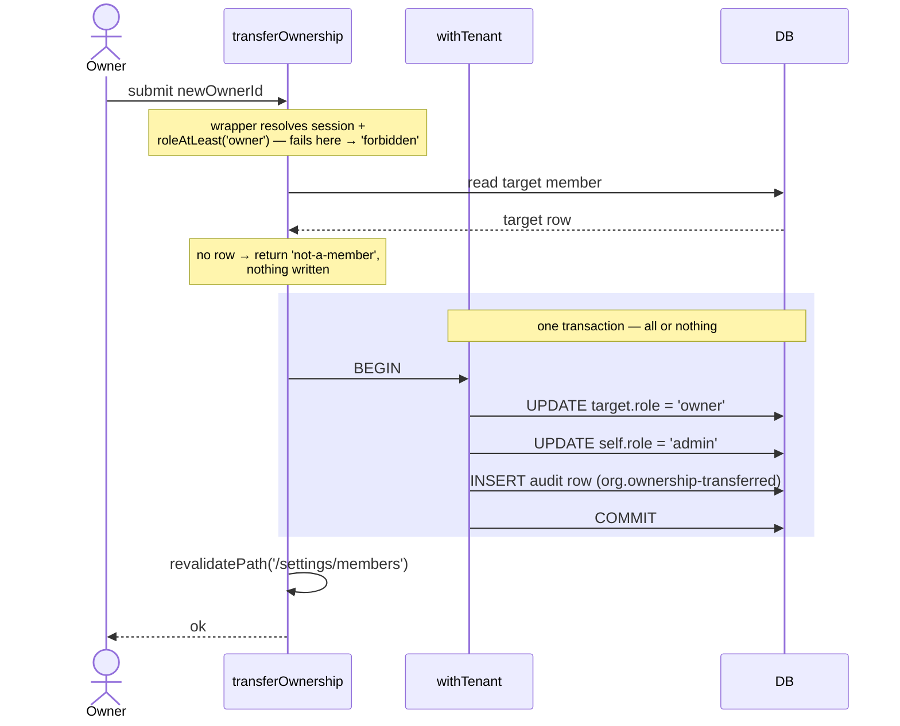

import CourseProgressBar from '../../../components/ui/CourseProgressBar.astro';
import Figure from '../../../components/figures/Figure.astro';
import AnnotatedCode from '../../../components/code/annotated-code/AnnotatedCode.astro';
import AnnotatedStep from '../../../components/code/annotated-code/AnnotatedStep.astro';
import CodeVariants from '../../../components/code/code-variants/CodeVariants.astro';
import CodeVariant from '../../../components/code/code-variants/CodeVariant.astro';
import RemovedMemberSelfHeal from '../../../components/lessons/057/4/RemovedMemberSelfHeal.astro';
import Sequence from '../../../components/exercises/sequence/Sequence.astro';
import Step from '../../../components/exercises/sequence/Step.astro';
import Buckets from '../../../components/exercises/buckets/Buckets.astro';
import Bucket from '../../../components/exercises/buckets/Bucket.astro';
import Item from '../../../components/exercises/buckets/Item.astro';
import Term from '../../../components/ui/Term.astro';
import VideoCallout from '../../../components/embeds/VideoCallout.astro';
import ExternalResource from '../../../components/ui/ExternalResource.astro';
import { CardGrid } from '@astrojs/starlight/components';

<CourseProgressBar value={frontmatter['course-progress']} />

Picture the settings page of any team product you've used. There's a "Members" tab. It shows everyone in the org with their role and the date they joined, and next to each row — if you're an admin or the owner — there's a little menu: change this person's role, remove them. Somewhere there's a "Leave organization" button for yourself, and if you're the owner, a way to hand the org to someone else before you go.

That's five operations, and you already own every tool needed to build them. `authedAction(role, schema, fn)` from two lessons ago gives you the role gate and a tenant-scoped `ctx`. `roleAtLeast`, the `Role` union, and `isLastOwner` from the roles lesson give you the invariant checks. `withTenant(orgId, fn)` from the org chapter gives you a tenant-scoped transaction for atomic multi-row writes. Nothing in this lesson is a new primitive. The whole lesson is *how those primitives compose into four near-identical actions plus one read* — and the handful of traps each flow hides that will bite you if you're not looking for them.

Here's the map. One read and four mutations:

- **List members** — a read, the simplest surface, and where we'll settle the difference between hiding a button and refusing an action.
- **Change a member's role** — the reference mutation. We'll build this one end to end; the next three are variations on it.
- **Remove a member** — same shape, different invariants, and one genuinely new decision (hard delete, not soft delete).
- **Leave the organization** — self-service, with a session side effect the others don't have.
- **Transfer ownership** — the only flow that writes two rows at once, and the only one that earns a diagram.

Every mutation is an `authedAction`. Every mutation guards its domain invariants in the body — the things the UI can't be trusted to enforce. Every mutation writes exactly one audit row, in the same transaction as the change. By the end, that sentence will read as a single shape, not five separate things to memorize.

## The members settings page

Start with the read, because it's the gentle on-ramp.

The `/settings/members` page is a Server Component. Its job is to list the members of the active org with their name, email, role, and joined date. The query lives in `db/queries/members.ts` — the tenant-scoped-read home you established in the org chapter — and it closes over `tenantDb(orgId)`, so the scoping is already done for you.

```ts title="db/queries/members.ts"
import { tenantDb } from '@/db/tenant';

export async function listMembers(orgId: string) {
  const db = tenantDb(orgId);
  return db.query.member.findMany({
    with: { user: true },
    orderBy: (member, { asc }) => asc(member.createdAt),
  });
}
```

Notice what isn't here. There's no `where org_id = ...` clause — `tenantDb(orgId)` already pins every read to this tenant, exactly as it did in the org chapter. The `with: { user: true }` pulls each member's name and email alongside the `role` and `createdAt` that already live on the `member` row, all in one query.

One thing this read deliberately doesn't do: paginate. Most orgs are under fifty seats, and a list of fifty rows needs no cursor. The unbounded case — orgs with thousands of members — is a problem you'll solve later when we build production list views; reaching for pagination here would be solving a problem you don't have.

### Gate the UI for UX, gate the action for security

Now the distinction that every later section in this lesson leans on.

The page reads the current user's role and uses it to decide what to *render*. If `roleAtLeast(role, 'admin')` is false, it doesn't draw the role dropdowns or the remove buttons — a plain `member` sees a read-only roster. This is the **UI gate**. Its purpose is purely cosmetic: don't show someone a button that will only ever tell them "no."

The UI gate is not security. It's a hint. A `member` who opens devtools, reads your network traffic, and crafts a request to `changeMemberRole` directly has completely bypassed the rendered UI — there was never a button standing between them and your server. So the *action* re-checks the role, on the server, every time it runs. That's the **security gate**, and it's the one that actually holds. It lives inside `authedAction`, which you built to make the role check the only call shape that compiles.

Hold onto this as one sentence: **gate the UI for UX, gate the action for security — a user can lie about the UI, but they cannot lie their way past the wrapper.** Every flow below renders a gated control and re-checks the same role server-side. The rendering is a courtesy. The wrapper is the boundary.

## The shape every member action shares

Before we write a single action, let's write the *shape* of all four. This is the load-bearing section of the lesson: once you can see the skeleton, the four mutations stop being four things to learn and become one thing plus four small variations.

Every member-management action follows the same five-step body. In the forms chapter you learned the universal Server Action seam — `parse → authorize → mutate → revalidate → return`. Here the first two steps have already been lifted out of the body and into the wrapper, so what's left is a tight skeleton:

1. **`authedAction(role, schema, fn)` supplies the gate.** It validates the session, checks the role, parses the input, and hands you `ctx = { user, orgId, role, db }` with `db` already tenant-scoped. Your body never re-checks the session, never re-checks the transport role, never touches the bare `db`.
2. **Read** what you need through `ctx.db` — the target member's row, the count of owners, whatever the invariant requires.
3. **Check the domain invariant** and, if it's violated, return a typed domain reason with `err(...)` — `'last-owner'`, `'cannot-demote-owner'`, `'not-a-member'`, and so on.
4. **Write inside `withTenant(ctx.orgId, async (tx) => …)`** — the membership change *and* the audit row, together, in one <Term definition="A group of database writes that all commit together or all roll back — there is no partial state in between.">transaction</Term>. `withTenant` (imported from `@/db`: `import { withTenant } from '@/db';`) is the tenant-scoped transaction helper you built in the org chapter — and it's the one you must use here rather than a bare transaction, because the audit row's org-isolation policy only lets the insert through when `app.org_id` is set, and `withTenant` is the only primitive that sets it.
5. After the transaction commits, **`revalidatePath('/settings/members')`**, then **`return ok(...)`**.

Here's that skeleton with nothing filled in. Every action below is "fill in steps 1 through 3":

```ts {4-7}
export const someMemberAction = authedAction(role, someSchema, async (input, ctx) => {
  // 1. read the rows the invariant needs, through ctx.db
  // 2. check the domain invariant; on failure: return err('reason', '…')
  await withTenant(ctx.orgId, async (tx) => {
    // 3. mutate the member row
    // 4. logAudit(tx, { … })  — same transaction as the mutation
  });
  revalidatePath('/settings/members'); // 5. after commit, revalidate and return ok
  return ok(/* … */);
});
```

There's one more rule baked into that skeleton, and it's the single most important decision this lesson makes. Look at where the membership write happens: inside `withTenant`, through Drizzle. Not through `auth.api.updateMemberRole` or `auth.api.removeMember`.

### Write the membership row through Drizzle, not through `auth.api`

Better Auth's organization plugin ships its own methods for these operations — `auth.api.updateMemberRole`, `auth.api.removeMember`, `auth.api.leaveOrganization`. You consume Better Auth directly everywhere else in this app, so the instinct to call them here is reasonable. For member management, you don't. Here's why.

This chapter's whole contract for the audit log is *the mutation and its audit row land in one transaction, so the audit row exists if and only if the work landed*. That's what makes the log trustworthy three months later. Now, Better Auth's org methods write through the plugin's own adapter, and since Better Auth 1.5 they run their `after` hooks *after* that internal transaction has already committed. So if you called `auth.api.removeMember` and then tried to write the audit row from the plugin's `after` hook, your audit write would land in a *different* transaction than the membership delete. The membership could vanish and the audit write could fail right after — exactly the partial state the contract forbids.

The fix is to own the write. The `member` table is a normal table in `db/schema.ts` — Better Auth's adapter maps to it, but it doesn't own writes that need to be atomic with your audit trail. So you write the `member` row directly through Drizzle, inside the same `withTenant` transaction as `logAudit(tx, …)`, and the two are now genuinely inseparable.

There's a trade here, and it's worth naming honestly: by writing the row yourself, you give up the plugin's built-in permission checks and its built-in last-owner guard on these specific operations. That's not a regret — it's the reason this chapter built `authedAction` and `isLastOwner` in the first place. The app owns the gate (`authedAction`), the app owns the invariant (`isLastOwner`), and now the app owns the write. This is the same posture the chapter took for `tenantDb` and `authedAction`: consume the library directly almost everywhere, but own the one seam where a real bug class lives.

:::note
`logAudit(tx, event)` and the full catalog of audit events are the next lesson's subject. Here you'll just *call* it inside each transaction with the event name and payload that flow needs — `logAudit` itself is a black box until then.
:::

That's the whole pattern. Five steps, the write through Drizzle, the audit row in the same transaction. Now let's fill it in four times.

The reason this pattern holds rests entirely on one database property — atomicity, the *A* in ACID. If the word "transaction" still feels abstract, this is worth five minutes before you read on.

<VideoCallout videoId="GAe5oB742dw" videoTitle="ACID Properties in Databases With Examples">
  ByteByteGo walks the four ACID properties in 5 minutes — start with atomicity, the all-or-nothing guarantee that makes "the mutation and its audit row land together or not at all" possible.
</VideoCallout>

## Changing a member's role

This is the reference implementation. We'll walk every line, because the next three actions are deltas against this one — once you've read this carefully, you've read most of the lesson.

The signature follows the naming contract from this chapter: verb plus noun, no `Action` suffix.

The schema is tiny — a member id and a target role:

```ts
const changeMemberRoleSchema = z.object({
  memberId: z.uuid(),
  role: z.enum(['owner', 'admin', 'member']),
});
```

`z.uuid()` is the Zod 4 top-level format builder — never the old `z.string().uuid()` chain. `z.enum` over the three role literals means a request with `role: 'superadmin'` fails parsing in the wrapper before your body ever runs.

Now the action itself. The wrapper's first argument is `'admin'` — the minimum role to change anyone's role. Then come the body's three domain invariants, each refusing with its own typed code. Step through it:

<AnnotatedCode lang="ts" maxLines={18} code={`
export const changeMemberRole = authedAction(
  'admin',
  changeMemberRoleSchema,
  async ({ memberId, role }, ctx) => {
    const target = await ctx.db.query.member.findFirst({
      where: (m, { eq }) => eq(m.id, memberId),
    });
    if (!target) return err('not-a-member', 'That member no longer exists.');
    if (role === 'owner') return err('cannot-promote-to-owner', 'Use "Transfer ownership" to make someone an owner.');
    if (target.role === 'owner' && ctx.role !== 'owner') return err('cannot-demote-owner', 'Only an owner can change another owner.');
    if (target.role === 'owner' && (await isLastOwner(ctx.orgId))) return err('last-owner', 'This org must always have an owner.');

    const updated = await withTenant(ctx.orgId, async (tx) => {
      const [row] = await tx.update(member).set({ role }).where(eq(member.id, memberId)).returning();
      await logAudit(tx, { action: 'member.role-changed', subjectId: memberId, payload: { before: target.role, after: role } });
      return row;
    });
    revalidatePath('/settings/members');
    return ok(updated);
  },
);
`}>
  <AnnotatedStep meta="{1-3}" color="blue">
    The security gate. By the time the body runs, the wrapper has already confirmed a valid session, that the caller is at least an `admin`, and that the input parsed against `changeMemberRoleSchema`. Everything below is *only* domain logic.
  </AnnotatedStep>

  <AnnotatedStep meta="{5-8}" color="blue">
    Read the target member through the tenant-scoped `ctx.db`. If there's no row, the member was already removed (or never existed in this org); refuse with `'not-a-member'`. This is a body check, not a Zod check — Zod validated the *shape* of `memberId`, but only a database read can confirm the row *exists*.
  </AnnotatedStep>

  <AnnotatedStep meta="{9-11}" color="orange">
    The domain invariants, each with its own typed reason. Nobody mints an owner here — promotion to owner is the transfer flow, full stop. An `admin` can't touch an existing owner (only a fellow owner can change an owner). And the org's *last* owner can't be demoted — `isLastOwner` guards it, and that single check also covers a sole owner trying to demote themselves, so you need no separate self-check.
  </AnnotatedStep>

  <AnnotatedStep meta="{13-17}" color="green">
    The atomic write. One `member` row update and one audit row, in a single transaction. The event is `'member.role-changed'` with `{ before, after }` — the role diff the next lesson formalizes. Because both writes share the transaction, the audit row exists if and only if the role actually changed.
  </AnnotatedStep>

  <AnnotatedStep meta="{18-19}" color="green">
    After the transaction commits, revalidate the members page so the table reflects the new role, then return `ok` with the updated row. Revalidation lands *after* the commit and *outside* the transaction — never inside it.
  </AnnotatedStep>
</AnnotatedCode>

A few things to sit with. The three invariant checks in step 3 are not "the UI prevents this." The UI does hide the relevant options, but these checks are the real defense — they return a typed code regardless of what the caller sent. And notice that the last-owner check covers the case you might have reached for a separate guard against: a sole owner trying to demote themselves. They're an owner, they're the last owner, so the `'last-owner'` refusal fires. No redundant self-check needed.

That `'cannot-promote-to-owner'` refusal is also doing quiet structural work. By making "become an owner" *impossible* through the role-change action, it forces every ownership change down a single, deliberate path — the transfer flow — where the extra invariants and the two-row write live. That's why transfer is a separate action and not just `changeMemberRole({ role: 'owner' })`.

## Removing a member

Removal is the same skeleton as change-role. Steps 1 and 4 and 5 are identical in spirit; only the invariants and the kind of write differ. So we won't re-show the skeleton — we'll show the diff.

The schema is just a member id. The wrapper minimum is still `'admin'`. Three invariants are unique to removal:

- You can't remove **yourself** — the path to self-exit is `leaveOrganization`, not removal. Compare the target's `userId` to `ctx.user.id` and refuse with `'cannot-target-self'`.
- You can't remove the **last owner** — `isLastOwner` again, refusing with `'last-owner'`.
- An `admin` can remove `admin`s and `member`s but not `owner`s — refuse with `'cannot-remove-owner'`.

Here it is against the empty skeleton:

<CodeVariants maxLines={18}>
  <CodeVariant label="Skeleton">
    ```ts {4-7}
    export const someMemberAction = authedAction(role, someSchema, async (input, ctx) => {
      // 1. read the rows the invariant needs, through ctx.db
      // 2. check the domain invariant; on failure: return err('reason', '…')
      await withTenant(ctx.orgId, async (tx) => {
        // 3. mutate the member row
        // 4. logAudit(tx, { … })  — same transaction as the mutation
      });
      revalidatePath('/settings/members'); // 5. after commit, revalidate and return ok
      return ok(/* … */);
    });
    ```

    **The shape you already know** — fill in the read, the checks, and the write.
  </CodeVariant>

  <CodeVariant label="removeMember">
    <div data-mark-color="green">

    ```ts {9,13}
    export const removeMember = authedAction(
      'admin',
      removeMemberSchema,
      async ({ memberId }, ctx) => {
        const target = await ctx.db.query.member.findFirst({
          where: (m, { eq }) => eq(m.id, memberId),
        });
        if (!target) return err('not-a-member', 'That member no longer exists.');
        if (target.userId === ctx.user.id) return err('cannot-target-self', 'Use "Leave organization" to remove yourself.');
        if (target.role === 'owner') return err('cannot-remove-owner', 'Owners cannot be removed.');

        await withTenant(ctx.orgId, async (tx) => {
          await tx.delete(member).where(eq(member.id, memberId));
          await logAudit(tx, { action: 'member.removed', subjectId: memberId, payload: { previousRole: target.role } });
        });
        revalidatePath('/settings/members');
        return ok({ memberId });
      },
    );
    ```

    </div>

    **Membership is not an entity with its own history** — so removal is a hard `delete`, and the audit row *is* the record that it happened. The two highlights are all that's new versus change-role: the `cannot-target-self` check, and the `delete` where change-role had an `update`. The schema is just `const removeMemberSchema = z.object({ memberId: z.uuid() });`.
  </CodeVariant>
</CodeVariants>

The one genuinely new decision here is **hard delete, not soft delete**. You may have a reflex by now — flag a row `deletedAt` rather than physically removing it, so you can restore it and keep its history. That reflex is right for content like invoices. It's wrong for membership. A membership isn't a document with a lifecycle worth preserving; it's a join between a user and an org that's either present or absent. When you remove someone, you want them *gone* — no orphaned soft-deleted row to leak into queries or seat counts. And you don't lose the history, because the audit row records who removed whom and when. The membership row is the live state; the audit log is the trail. Delete the row, keep the log.

The delete and the audit write share one transaction, same as before — if the audit write fails, the delete rolls back, and the member stays. And the audit event carries `previousRole` in its payload, because once the row is gone that information is only recoverable from the log.

You might be wondering what happens to the removed person's session right now — they were signed in a second ago. Hold that thought; there's a short section on it once all the actions are built. The short version: you do nothing, and it's fine.

## Leaving the organization

Leaving is removal pointed at yourself — but with one new wrinkle the others don't have. It's the first flow that has to touch the session, and that's the part worth your attention.

Any role may *attempt* to leave, so the wrapper's minimum is `'member'`. There's no input — you're always leaving as yourself, identified by `ctx.user.id` — so the schema is an empty object, which the chapter names `emptySchema` (`z.object({})`).

There's exactly one invariant: an owner can't abandon the org. If you're an owner and `isLastOwner(ctx.orgId)` is true, you must transfer ownership before you can leave — refuse with `'last-owner-must-transfer'`. (A non-last owner can't trigger this, because by definition another owner remains.) This is the third place the single-owner invariant shows up — the roles lesson named all three: removal, demotion, and now leaving.

The write is a delete of your own `member` row plus the audit event `'member.left'`, in one transaction. So far, identical to removal. Here's the new part:

<div data-mark-color="blue">

```ts {13-18}
export const leaveOrganization = authedAction('member', emptySchema, async (_input, ctx) => {
  if (ctx.role === 'owner' && (await isLastOwner(ctx.orgId))) {
    return err('last-owner-must-transfer', 'Transfer ownership before you leave.');
  }

  await withTenant(ctx.orgId, async (tx) => {
    await tx
      .delete(member)
      .where(and(eq(member.organizationId, ctx.orgId), eq(member.userId, ctx.user.id)));
    await logAudit(tx, { action: 'member.left' });
  });

  const remaining = await listMemberships(ctx.user.id);
  const fallback = remaining[0]?.organizationId ?? null;
  await auth.api.setActiveOrganization({
    headers: await headers(),
    body: { organizationId: fallback },
  });

  revalidatePath('/settings/members');
  redirect(fallback ? '/dashboard' : '/onboarding/create-org');
});
```

</div>

`listMemberships(userId)` is a small sibling read of the user's remaining memberships across every org — not tenant-scoped, because it deliberately spans orgs. The blue-highlighted block is the post-commit side effect, run *after* the transaction commits.

Look at what happens after the transaction commits. The user just deleted their membership in this org — but their session still points at it via `activeOrganizationId`. If you left that pointer dangling, their next request would resolve to an org they're no longer a member of. So you fix the session pointer: find their first remaining membership (or `null` if they have none), and call `auth.api.setActiveOrganization` to move the pointer there. Then redirect — to `/dashboard` if they still belong to an org, or to the create-org route if this was their last one.

Now, that `auth.api` call should make you pause, because the last big rule of this lesson was "write membership through Drizzle, not `auth.api`." This is the sanctioned exception, and the reason it's allowed is precise. The session — including which org is active — is *Better Auth's* state to own, not yours. And moving the pointer is a **post-commit side effect**, not part of the membership-delete atom. Contrast the two writes cleanly:

- The **audit row** *must* be inside the transaction — it has to be atomic with the delete, or the contract breaks.
- The **session pointer** *must* be outside the transaction — it's an external call into Better Auth, and the chapter's transaction rule has always been "no external service calls inside `db.transaction`."

So the line isn't "never call `auth.api`." It's "the membership write is yours and must co-transact with the audit row; the session is Better Auth's and lives after the commit." Two different owners, two different positions relative to the transaction bracket.

:::note
The redirect targets — `/dashboard` when other orgs remain, the create-org route when none do — depend on your app's routing. Match them to wherever a signed-in user with no active org belongs.
:::

## Transferring ownership

This is the most complex flow, and the only one that writes more than one row. It's the flow students reach for an `auth.api` call to handle — and there isn't one. There is no `auth.api.transferOwnership`. You compose a transfer yourself, out of two role changes, and you make them atomic. That's exactly why this flow earns the lesson's one diagram: order and atomicity genuinely matter here in a way they didn't for the single-row flows.

Only an owner can initiate a transfer, so the wrapper minimum is `'owner'`. The schema takes the new owner's member id. Two invariants:

- The target must be an **existing member of this org** — refuse with `'not-a-member'`. This is a body check: you read the target's `member` row through `ctx.db`. Reaffirm the rule once more — Zod validates that `newOwnerId` is shaped like a UUID; only a database read confirms it points at a real member.
- You can't transfer to **yourself** — refuse with `'cannot-target-self'`.

Now the write, which is the heart of it. Better Auth has no transfer endpoint, so a transfer *is* two role updates: promote the target to `'owner'`, and demote yourself. Demote to what? The year-1 default is `'admin'` — the former owner keeps administrative access but loses billing. (`'member'` is a perfectly valid choice if your product wants the outgoing owner fully stepped back; that's a product decision, not a technical one. We'll go with `'admin'`.) Both updates, plus the audit row, go inside one transaction — so a half-transferred org, with two owners or zero, is impossible.

The schema takes only the new owner's member id: `const transferOwnershipSchema = z.object({ newOwnerId: z.uuid() });`.

<div data-mark-color="green">

```ts {12-16}
export const transferOwnership = authedAction(
  'owner',
  transferOwnershipSchema,
  async ({ newOwnerId }, ctx) => {
    const target = await ctx.db.query.member.findFirst({
      where: (m, { eq }) => eq(m.id, newOwnerId),
    });
    if (!target) return err('not-a-member', 'That person is not a member of this org.');
    if (target.userId === ctx.user.id) return err('cannot-target-self', 'You already own this org.');

    await withTenant(ctx.orgId, async (tx) => {
      await tx.update(member).set({ role: 'owner' }).where(eq(member.id, newOwnerId));
      await tx
        .update(member)
        .set({ role: 'admin' })
        .where(and(eq(member.organizationId, ctx.orgId), eq(member.userId, ctx.user.id)));
      await logAudit(tx, {
        action: 'org.ownership-transferred',
        subjectId: newOwnerId,
        payload: { from: ctx.user.id, to: target.userId, demotedTo: 'admin' },
      });
    });
    revalidatePath('/settings/members');
    return ok({ newOwnerId });
  },
);
```

</div>

The two highlighted `update` calls are the whole transfer: promote the target to `'owner'`, demote yourself to `'admin'`. Both, plus the audit row, sit inside one transaction.

The diagram below is the point of this section. Walk the request from the owner's browser through the action and into the transaction, and watch where the writes happen. The thing to *see* is the transaction bracket: the two role updates and the audit insert all sit inside it, and nothing — nothing — is committed until `COMMIT`. If the demote failed after the promote, the promote would roll back with it. There is no moment when the org has two owners or none.

<Figure caption="Ownership transfer: both role writes and the audit row commit inside one transaction, or none do.">

</Figure>

Let's drill the ordering, because it's the one thing worth getting into muscle memory: the audit write and *both* role updates are inside the transaction; the revalidate is after it. Order these steps.

<Sequence instructions="Order the steps `transferOwnership` runs when an owner hands the org to a teammate.">
  <Step>The wrapper resolves the session and checks `roleAtLeast('owner')`</Step>
  <Step>Read the target member's row through `ctx.db`</Step>
  <Step>Refuse with `'not-a-member'` if no row exists, `'cannot-target-self'` if it's you</Step>
  <Step>Open the transaction</Step>
  <Step>Promote the target: `member.role = 'owner'`</Step>
  <Step>Demote yourself: `member.role = 'admin'`</Step>
  <Step>Write the `org.ownership-transferred` audit row</Step>
  <Step>Commit the transaction</Step>
  <Step>`revalidatePath('/settings/members')` and return `ok`</Step>
</Sequence>

One more thing about transfer, named so you know it exists but not built here: ownership transfer is a *high-stakes* mutation — the kind where a production app re-checks that the session is recent (`session.freshAge`) and returns `'requires-re-authentication'` if it's stale, forcing a password re-prompt before such a consequential change. That gate belongs to the auth chapter's fresh-session machinery; we're naming it, not wiring it, to keep this lesson's focus on the membership writes.

## Why removed members don't need a logout

Back to the question that's been nagging since the remove section: you just deleted Bob's membership, but Bob is still signed in, with a valid session cookie sitting in his browser. How do you force-log-him-out of the org he can no longer access?

You don't. And the reason you don't is the most satisfying payoff of everything this chapter built.

Bob's session is still valid — he's still a signed-in user of your *app*. But that session carries `activeOrganizationId = thisOrg`. On Bob's very next request, `requireOrgUser` runs, exactly as it does on every request, and reads his role and membership *fresh from the database* — because the roles lesson established that authority is read per request, never trusted from the token. It looks for a `member` row matching `(thisOrg, bobUserId)`, finds none, and redirects him to the no-org route, `/onboarding/create-org` — the exact same exit `requireOrgUser` takes for an active org you aren't a member of, because that's a broken state, not a role to invent. Bob's session cookie is never touched; it stays valid. The removal action did nothing special to make this happen. Correctness simply falls out of the per-request membership read the chapter already built.

Scrub through the two steps below to see the self-heal play out:

<RemovedMemberSelfHeal />

There's one bound on how fast this bites. Better Auth caches the decoded session for a short window — minutes — to avoid a database hit on every request, so if Bob's request happens to hit that cache, the change can take up to the cache window to take effect. For the stricter case — instantly killing the removed or demoted user's other sessions — there's `revokeOtherSessions`, the production hardening from the auth chapter. We're not building it here; the per-request read already self-heals within seconds, and that's the right default.

The thread to pull on: the remove action is *boring*. It deletes a row and writes a log. All the "how do we revoke their access" complexity you might have braced for simply doesn't exist, because the system reads authority fresh every request. Build the read once, correctly, and removal is a one-line delete forever after.

## What the user sees when an action fails

The actions are only useful if their typed failures reach the user as words. Let's close the loop from `err(code, message)` to a rendered message.

Recall the UI surface. The members table renders, per row, a role dropdown and a remove button — both gated on `roleAtLeast(role, 'admin')`, and both hidden on the current user's *own* row (you don't demote or remove yourself from this table; you leave or transfer). Owners additionally see a "Transfer ownership" affordance, and every user sees a "Leave organization" button for themselves. Same rule as always: the rendering is gated for UX, the action is gated for security.

Every one of these actions returns a `Result` — `ok` on success, or `err(code, userMessage)` on failure. At the form root, `useActionState` exposes that result, and the UI reads `state.error.userMessage` to show a toast or an inline error. Your job at the UI is to wire one message per code. And here's the distinction that's run through the entire chapter, now made concrete: some of those codes come from the **wrapper** (transport-level: the role gate failed, the input didn't parse) and some come from your **action body** (domain-level: the invariant was violated). Same `Result` shape, two different origins.

Here's the full surface in one table:

| Code | Origin | Emitted by | What the user sees |
| --- | --- | --- | --- |
| `forbidden` | wrapper | any action (role gate fails) | "You don't have permission to do this." |
| `validation` | wrapper | any action (bad input) | "Something's off with that request." |
| `not-a-member` | body | change role, transfer | "That member is no longer part of this org." |
| `cannot-promote-to-owner` | body | change role | "Use \"Transfer ownership\" to make someone an owner." |
| `cannot-demote-owner` | body | change role | "Only an owner can change another owner." |
| `cannot-remove-owner` | body | remove | "Owners can't be removed." |
| `cannot-target-self` | body | remove, transfer | "You can't do that to yourself." |
| `last-owner` | body | change role | "This org must always have an owner." |
| `last-owner-must-transfer` | body | leave | "Transfer ownership before you leave." |

Read that table top to bottom and you can see the chapter's architecture in miniature: two transport codes the wrapper owns, a stack of domain codes the bodies own, every one of them a typed string the UI maps to a sentence. No `try/catch` guessing at error messages, no stringly-typed comparisons — the action tells the UI exactly what went wrong, and the UI decides how to say it.

Two senior options to name and *not* reach for by default:

**Optimistic updates.** A role change is a single, fast row, so flipping the dropdown the instant the user picks a new role — before the server confirms — is a reasonable reach with <Term definition="Showing the result of an action in the UI immediately, before the server confirms, then rolling back if the server returns an error.">`useOptimistic`</Term>. You'd show the new role immediately and roll it back with a toast if the action returns an error code. It's a nicer feel, but it's not the default — the default is the plain `useActionState` flow, which waits for the real result. Reach for optimism when the latency is actually felt.

**The last-write-wins race.** Two admins open the same member's dropdown and both change the role within a few seconds of each other. The second write wins; the first is silently overwritten. For role changes, that's acceptable — no invariant is violated, and the audit log records *both* writes, so "who changed what, when" always has an answer. The heavier fix — a `version` column that rejects a write made against stale data — belongs to the optimistic-concurrency chapter and matters mostly for genuinely conflicting transfers. Year-1 default: last-write-wins, and let the audit log be the source of truth.

Before you go, one quick check on the distinction the whole chapter turns on. Sort these refusal codes by where they come from.

<Buckets twoCol instructions="Each of these refusals is a code an action can return. Which come from the `authedAction` wrapper, and which from the action body?">
  <Bucket name="wrapper" label="Wrapper (transport)" description="Resolved before your body runs" />
  <Bucket name="body" label="Action body (domain)" description="A domain invariant you check yourself" />

  <Item bucket="wrapper">`forbidden`</Item>
  <Item bucket="wrapper">`validation`</Item>
  <Item bucket="body">`last-owner`</Item>
  <Item bucket="body">`cannot-demote-owner`</Item>
  <Item bucket="body">`cannot-remove-owner`</Item>
  <Item bucket="body">`cannot-target-self`</Item>
  <Item bucket="body">`not-a-member`</Item>
  <Item bucket="body">`last-owner-must-transfer`</Item>
</Buckets>

That's the whole surface. Five flows, one skeleton: `authedAction` for the role gate, a body that reads, checks one invariant, writes the mutation and its audit row in one transaction, revalidates, and returns. The wrapper makes the role check structural; the transaction makes the audit trail honest; the per-request role read makes removal self-healing. Next lesson, you'll build the other half of every one of these flows — `logAudit` and the append-only `audit_logs` table that has been quietly receiving a row from each transaction all along.

## External resources

<CardGrid>
  <ExternalResource
    title="Better Auth — Organization plugin"
    href="https://better-auth.com/docs/plugins/organization"
    icon="simple-icons:betterauth"
    description="The members/roles API this lesson deliberately writes around — removeMember, updateMemberRole, leaveOrganization."
  />
  <ExternalResource
    title="Drizzle ORM — Transactions"
    href="https://orm.drizzle.team/docs/transactions"
    icon="simple-icons:drizzle"
    iconColor="#C5F74F"
    description="The db.transaction API that withTenant wraps to make the membership write and its audit row atomic."
  />
  <ExternalResource
    title="Next.js — revalidatePath"
    href="https://nextjs.org/docs/app/api-reference/functions/revalidatePath"
    icon="simple-icons:nextdotjs"
    description="Step 5 of every flow: invalidate the members page cache after the transaction commits."
  />
</CardGrid>
