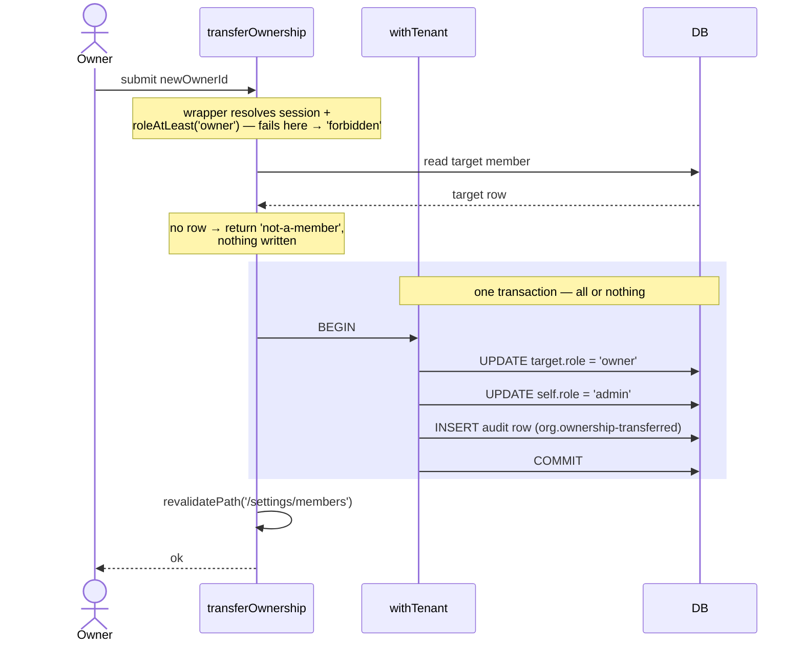

import CourseProgressBar from '../../../components/ui/CourseProgressBar.astro';
import Figure from '../../../components/figures/Figure.astro';
import AnnotatedCode from '../../../components/code/annotated-code/AnnotatedCode.astro';
import AnnotatedStep from '../../../components/code/annotated-code/AnnotatedStep.astro';
import CodeVariants from '../../../components/code/code-variants/CodeVariants.astro';
import CodeVariant from '../../../components/code/code-variants/CodeVariant.astro';
import RemovedMemberSelfHeal from '../../../components/lessons/057/4/RemovedMemberSelfHeal.astro';
import Term from '../../../components/ui/Term.astro';
import VideoCallout from '../../../components/embeds/VideoCallout.astro';
import ExternalResource from '../../../components/ui/ExternalResource.astro';
import { CardGrid } from '@astrojs/starlight/components';

<CourseProgressBar value={frontmatter['course-progress']} />

Picture the settings page of a team product you've used.
A "Members" tab lists everyone in the org with their role and join date.
Admins and owners get a per-row menu to change a person's role or remove them, plus a "Leave organization" button for themselves, and, for the owner, a way to hand off the org before leaving.

That's five operations, and you already own every tool to build them.
`authedAction(role, schema, fn)` gives you the role gate and a tenant-scoped `ctx`; `roleAtLeast`, the `Role` union, and `isLastOwner` give you the invariant checks; `withTenant(orgId, fn)` gives you an atomic transaction for multi-row writes.
This lesson adds no new primitive; it shows how these compose into one read and four near-identical mutations, and the trap each flow hides.

Every mutation is an `authedAction` that guards its domain invariants in the body, the rules the UI can't be trusted to enforce, and writes one audit row in the same transaction as the change.
So the five are one shape, not five things to memorize.

## The members settings page

The read is the simplest flow, so start there.
The `/settings/members` page is a Server Component that lists the active org's members with their name, email, role, and joined date.
The query lives in `db/queries/members.ts`, the home for tenant-scoped reads, and closes over `tenantDb(orgId)`.

```ts title="db/queries/members.ts"
import { tenantDb } from '@/db/tenant';

export async function listMembers(orgId: string) {
  const db = tenantDb(orgId);
  return db.query.member.findMany({
    with: { user: true },
    orderBy: (member, { asc }) => asc(member.createdAt),
  });
}
```

There is no `where org_id = ...` clause: `tenantDb(orgId)` already pins every read to this tenant.
The `with: { user: true }` pulls each member's name and email alongside the `role` and `createdAt` on the `member` row, in one query.

This read doesn't paginate.
Most orgs are under fifty seats, and fifty rows need no cursor.

### Two gates: a UI hint and a server check

The page reads the current user's role to decide what to *render*.
When `roleAtLeast(role, 'admin')` is false, it omits the role dropdowns and remove buttons, so a plain `member` sees a read-only roster.
This is the **UI gate**, and it's cosmetic: don't show someone a button that will only ever answer "no."

The UI gate is not security.
A `member` who opens devtools and posts a request to `changeMemberRole` directly never touched the rendered UI, so the *action* re-checks the role on the server every time it runs.
That's the **security gate**, and it's the one that holds; it lives inside `authedAction`, where the role check is the only call shape that compiles.

Gate the UI for UX, gate the action for security: a user can lie about the UI but cannot lie past the wrapper.
Every flow below renders a gated control and re-checks the same role server-side.

## The five-step body every member action shares

The four mutations are one body plus four small variations.

Every member-management action runs the same five steps. The forms chapter taught the Server Action seam `parse → authorize → mutate → revalidate → return`; here the first two steps live in the wrapper, leaving a tight body:

1. **`authedAction(role, schema, fn)` is the gate.** It validates the session, checks the role, parses the input, and hands you `ctx = { user, orgId, role, db }` with `db` already tenant-scoped. Your body never re-checks the session or role and never touches the bare `db`.
2. **Read** what the invariant needs through `ctx.db`: the target member's row, the owner count, and so on.
3. **Check the domain invariant.** On violation, return a typed reason with `err(...)`, such as `'last-owner'`, `'cannot-demote-owner'`, or `'not-a-member'`.
4. **Write inside `withTenant(ctx.orgId, async (tx) => …)`.** The membership change *and* the audit row commit in one <Term definition="A group of database writes that all commit together or all roll back — there is no partial state in between.">transaction</Term>. `withTenant` (imported from `@/db`: `import { withTenant } from '@/db';`) is the tenant-scoped transaction helper from the org chapter. You need it because the audit row's org-isolation policy admits the insert only when `app.org_id` is set, and `withTenant` is the only primitive that sets it.
5. After the transaction commits, **`revalidatePath('/settings/members')`**, then **`return ok(...)`**.

Here's the skeleton empty. Every action below fills in steps 1 through 3:

```ts {4-7}
export const someMemberAction = authedAction(role, someSchema, async (input, ctx) => {
  // 1. read the rows the invariant needs, through ctx.db
  // 2. check the domain invariant; on failure: return err('reason', '…')
  await withTenant(ctx.orgId, async (tx) => {
    // 3. mutate the member row
    // 4. logAudit(tx, { … })  — same transaction as the mutation
  });
  revalidatePath('/settings/members'); // 5. after commit, revalidate and return ok
  return ok(/* … */);
});
```

The membership write happens inside `withTenant`, through Drizzle, not through `auth.api.updateMemberRole` or `auth.api.removeMember`.

### Write the membership row through Drizzle, not through `auth.api`

Better Auth's organization plugin ships `auth.api.updateMemberRole`, `removeMember`, and `leaveOrganization`, and you call Better Auth directly everywhere else. Here, don't. The contract is that a mutation and its audit row land in one transaction, so the audit row exists exactly when the work did. Better Auth's org methods write through the plugin's own adapter, and since version 1.5 they run their `after` hooks *after* that adapter's transaction has committed. An audit row written from such a hook lands in a different transaction than the membership change: the membership could change while the audit write fails right after, the partial state the contract forbids.

So own the write. The `member` table is a normal table in `db/schema.ts`; Better Auth's adapter can read and write it, but cannot make those writes atomic with your audit trail. Write the `member` row yourself through Drizzle, in the same `withTenant` transaction as `logAudit(tx, …)`. The cost is the plugin's built-in permission checks and last-owner guard, which is why the chapter built `authedAction` and `isLastOwner`: the app owns the gate, the invariant, and the write.

:::note
`logAudit(tx, event)` and the full catalog of audit events are the next lesson's subject. Here you just *call* it inside each transaction with the event name and payload that flow needs. Treat it as a black box until then.
:::

This works because of one database property: atomicity, the *A* in ACID. If "transaction" still feels abstract, the video below is worth five minutes first.

<VideoCallout videoId="Oy2NpxfV9ok" videoTitle="Understand SQL Transactions in 5 Minutes">
  Unwired demos a Postgres transaction live with `BEGIN`/`COMMIT`/`ROLLBACK`: the all-or-nothing boundary that lets the mutation and its audit row land together or not at all.
</VideoCallout>

## Changing a member's role

This is the reference implementation; the next three actions are variations on it. The schema is a member id and a target role:

```ts
const changeMemberRoleSchema = z.object({
  memberId: z.uuid(),
  role: z.enum(['owner', 'admin', 'member']),
});
```

Listing the three roles in `z.enum` makes a request with `role: 'superadmin'` fail parsing in the wrapper, before your body runs.

The first argument, `'admin'`, is the minimum role to change anyone's role. The body then enforces three domain invariants, each refusing with its own typed code.

<AnnotatedCode lang="ts" maxLines={18} code={`
export const changeMemberRole = authedAction(
  'admin',
  changeMemberRoleSchema,
  async ({ memberId, role }, ctx) => {
    const target = await ctx.db.query.member.findFirst({
      where: (m, { eq }) => eq(m.id, memberId),
    });
    if (!target) return err('not-a-member', 'That member no longer exists.');
    if (role === 'owner') return err('cannot-promote-to-owner', 'Use "Transfer ownership" to make someone an owner.');
    if (target.role === 'owner' && ctx.role !== 'owner') return err('cannot-demote-owner', 'Only an owner can change another owner.');
    if (target.role === 'owner' && (await isLastOwner(ctx.orgId))) return err('last-owner', 'This org must always have an owner.');

    const updated = await withTenant(ctx.orgId, async (tx) => {
      const [row] = await tx.update(member).set({ role }).where(eq(member.id, memberId)).returning();
      await logAudit(tx, { action: 'member.role-changed', subjectId: memberId, payload: { before: target.role, after: role } });
      return row;
    });
    revalidatePath('/settings/members');
    return ok(updated);
  },
);
`}>
  <AnnotatedStep meta="{1-3}" color="blue">
    The security gate. By the time the body runs, the wrapper has confirmed a valid session, checked the caller is at least an `admin`, and parsed the input. The rest is domain logic.
  </AnnotatedStep>

  <AnnotatedStep meta="{5-8}" color="blue">
    Read the target through the tenant-scoped `ctx.db`. No row means the member was already removed or never existed here, so refuse with `'not-a-member'`. Zod checked the *shape* of `memberId`; only a read confirms the row exists.
  </AnnotatedStep>

  <AnnotatedStep meta="{9-11}" color="orange">
    The three invariants. Nobody becomes an owner here; promotion is the transfer flow. An `admin` can't touch an existing owner, only a fellow owner can. And the last owner can't be demoted, which `isLastOwner` guards, including a sole owner demoting themselves.
  </AnnotatedStep>

  <AnnotatedStep meta="{13-17}" color="green">
    The atomic write: one `member` update and one `member.role-changed` audit row with the `{ before, after }` diff, in a single transaction. So the audit row exists if and only if the role changed.
  </AnnotatedStep>

  <AnnotatedStep meta="{18-19}" color="green">
    Once the transaction commits, revalidate the members page so the table shows the new role, then return `ok`. Revalidation never runs inside the transaction.
  </AnnotatedStep>
</AnnotatedCode>

Refusing `'cannot-promote-to-owner'` forces every ownership change down one path, the transfer flow, where the extra invariants and two-row write live.

## Removing a member

Removal reuses the change-role skeleton; steps 1, 4, and 5 are unchanged, so only the diff follows. The wrapper minimum is still `'admin'`, and two invariants are unique to removal:

- You can't remove **yourself**: self-exit is `leaveOrganization`, so compare the target's `userId` to `ctx.user.id` and refuse with `'cannot-target-self'`.
- An `admin` can remove `admin`s and `member`s but not `owner`s, refusing with `'cannot-remove-owner'`. (This also keeps the last owner safe: an owner can never be the target.)

<CodeVariants maxLines={18}>
  <CodeVariant label="Skeleton">
    ```ts {4-7}
    export const someMemberAction = authedAction(role, someSchema, async (input, ctx) => {
      // 1. read the rows the invariant needs, through ctx.db
      // 2. check the domain invariant; on failure: return err('reason', '…')
      await withTenant(ctx.orgId, async (tx) => {
        // 3. mutate the member row
        // 4. logAudit(tx, { … })  — same transaction as the mutation
      });
      revalidatePath('/settings/members'); // 5. after commit, revalidate and return ok
      return ok(/* … */);
    });
    ```

    **The shape you already know.** Fill in the read, the checks, and the write.
  </CodeVariant>

  <CodeVariant label="removeMember">
    <div data-mark-color="green">

    ```ts {9,13}
    export const removeMember = authedAction(
      'admin',
      removeMemberSchema,
      async ({ memberId }, ctx) => {
        const target = await ctx.db.query.member.findFirst({
          where: (m, { eq }) => eq(m.id, memberId),
        });
        if (!target) return err('not-a-member', 'That member no longer exists.');
        if (target.userId === ctx.user.id) return err('cannot-target-self', 'Use "Leave organization" to remove yourself.');
        if (target.role === 'owner') return err('cannot-remove-owner', 'Owners cannot be removed.');

        await withTenant(ctx.orgId, async (tx) => {
          await tx.delete(member).where(eq(member.id, memberId));
          await logAudit(tx, { action: 'member.removed', subjectId: memberId, payload: { previousRole: target.role } });
        });
        revalidatePath('/settings/members');
        return ok({ memberId });
      },
    );
    ```

    </div>

    **Two changes versus change-role:** the `cannot-target-self` check, and a `delete` where change-role had an `update`. The schema is just `const removeMemberSchema = z.object({ memberId: z.uuid() });`.
  </CodeVariant>
</CodeVariants>

The one new decision is **hard delete, not soft delete**. You may reflex to set a `deletedAt` flag instead of removing the row, the way you would for content like invoices, so you could restore it later. A membership isn't a document with a lifecycle; it's a join between a user and an org that is either present or absent. Remove someone and you want them gone, with no soft-deleted row leaking into queries or seat counts. The history survives in the audit row, which records who removed whom and when.

The delete and the audit write share one transaction: if the audit write fails, the delete rolls back and the member stays. The audit event carries `previousRole`, the only place to recover it once the row is gone.

The removed person's session is handled in a later section, once all the actions are built; the short answer is you do nothing.

## Leaving the organization

Leaving is removal pointed at yourself, and it's the first flow that touches the session.

Any role may leave, so the wrapper's minimum is `'member'`. You leave as yourself, identified by `ctx.user.id`, so there's no input: the schema is an empty object the chapter names `emptySchema` (`z.object({})`).

The one invariant: an owner can't abandon the org. If you're an owner and `isLastOwner(ctx.orgId)` is true, refuse with `'last-owner-must-transfer'` so ownership moves first.

The write deletes your own `member` row and logs `'member.left'` in one transaction, exactly like removal. What follows the commit is new.

<div data-mark-color="blue">

```ts {13-18}
export const leaveOrganization = authedAction('member', emptySchema, async (_input, ctx) => {
  if (ctx.role === 'owner' && (await isLastOwner(ctx.orgId))) {
    return err('last-owner-must-transfer', 'Transfer ownership before you leave.');
  }

  await withTenant(ctx.orgId, async (tx) => {
    await tx
      .delete(member)
      .where(and(eq(member.organizationId, ctx.orgId), eq(member.userId, ctx.user.id)));
    await logAudit(tx, { action: 'member.left' });
  });

  const remaining = await listMemberships(ctx.user.id);
  const fallback = remaining[0]?.organizationId ?? null;
  await auth.api.setActiveOrganization({
    headers: await headers(),
    body: { organizationId: fallback },
  });

  revalidatePath('/settings/members');
  redirect(fallback ? '/dashboard' : '/onboarding/create-org');
});
```

</div>

`listMemberships(userId)` reads the user's memberships across every org, so it isn't tenant-scoped. The blue-highlighted block runs once the transaction commits.

The user just deleted their membership, but their session still points at the org via `activeOrganizationId`. Left dangling, their next request resolves to an org they no longer belong to. So you move the pointer to their first remaining membership, or `null` if they have none, then redirect: `/dashboard` if an org remains, the create-org route if this was their last.

That `setActiveOrganization` call is the sanctioned exception to writing membership through Drizzle. The membership write is yours, so it co-transacts with the audit row inside `withTenant`; the session is Better Auth's, so moving its active-org pointer is a post-commit side effect, not part of the delete atom. The rule was never "never call `auth.api`," it was "keep external calls out of the transaction."

:::note
The redirect targets depend on your app's routing: `/dashboard` when other orgs remain, the create-org route when none do. Match them to wherever a signed-in user with no active org belongs.
:::

## Transferring ownership

This is the most complex flow and the only one that writes more than one row.
There is no `auth.api.transferOwnership`, so you compose a transfer from two atomic role changes, where order and atomicity matter in a way they didn't for the single-row flows.

Only an owner can initiate a transfer, so the wrapper minimum is `'owner'`.
There are two invariants:

- The target must be an **existing member of this org**, or refuse with `'not-a-member'`.
  This is a body check: you read the target's `member` row through `ctx.db`, since only a database read confirms `newOwnerId` points at a real member.
- You can't transfer to **yourself**, or refuse with `'cannot-target-self'`.

A transfer *is* two role updates: promote the target to `'owner'`, and demote yourself.
Demote to what? The year-1 default is `'admin'`, so the former owner keeps administrative access but loses billing.
Both updates and the audit row go inside one transaction, so a half-transferred org with two or zero owners is impossible, and the revalidate comes after.

The schema takes only the new owner's member id: `const transferOwnershipSchema = z.object({ newOwnerId: z.uuid() });`.

<div data-mark-color="green">

```ts {12-16}
export const transferOwnership = authedAction(
  'owner',
  transferOwnershipSchema,
  async ({ newOwnerId }, ctx) => {
    const target = await ctx.db.query.member.findFirst({
      where: (m, { eq }) => eq(m.id, newOwnerId),
    });
    if (!target) return err('not-a-member', 'That person is not a member of this org.');
    if (target.userId === ctx.user.id) return err('cannot-target-self', 'You already own this org.');

    await withTenant(ctx.orgId, async (tx) => {
      await tx.update(member).set({ role: 'owner' }).where(eq(member.id, newOwnerId));
      await tx
        .update(member)
        .set({ role: 'admin' })
        .where(and(eq(member.organizationId, ctx.orgId), eq(member.userId, ctx.user.id)));
      await logAudit(tx, {
        action: 'org.ownership-transferred',
        subjectId: newOwnerId,
        payload: { from: ctx.user.id, to: target.userId, demotedTo: 'admin' },
      });
    });
    revalidatePath('/settings/members');
    return ok({ newOwnerId });
  },
);
```

</div>

<Figure caption="Ownership transfer: both role writes and the audit row commit inside one transaction, or none do.">

</Figure>

A production app would gate so consequential a change behind a fresh-session check, returning `'requires-re-authentication'` if the session is stale; that machinery belongs to the auth chapter.

## Why removed members don't need a logout

Back to the question the remove section left open: you deleted Bob's membership, but his browser still holds a valid session cookie. How do you force him out?

You don't. Bob is still a signed-in user of your app, so his session stays valid, but it carries `activeOrganizationId = thisOrg`. On his next request, `requireOrgUser` runs as it does on every request and reads his membership fresh from the database, never from the token. It looks for a `member` row matching `(thisOrg, bobUserId)`, finds none, and redirects him to `/onboarding/create-org`, the same exit it takes for any active org you don't belong to. His cookie is never touched; correctness falls out of the per-request membership read.

Scrub through the two steps below to see the self-heal play out:

<RemovedMemberSelfHeal />

One bound: Better Auth caches the decoded session for a few minutes to avoid a database hit on every request, so a removal can take up to that window to apply. To kill a removed or demoted user's other sessions instantly there's `revokeOtherSessions` from the auth chapter, but the per-request read self-heals within seconds, which is the right default.

## What the user sees when an action fails

Typed failures are only useful if they reach the user as words, so close the loop from `err(code, message)` to a rendered message.

Each row of the members table renders a role dropdown and a remove button, both gated on `roleAtLeast(role, 'admin')` and both hidden on the user's *own* row, since you leave or transfer rather than demote or remove yourself. Owners also see "Transfer ownership," and everyone sees "Leave organization" for themselves.

Every action returns a `Result`: `ok` on success, or `err(code, userMessage)` on failure. At the form root, `useActionState` exposes that result, and the UI reads `state.error.userMessage` to show a toast or inline error. You wire one message per code. The codes split by origin: some come from the **wrapper** (transport-level: the role gate failed or the input didn't parse), some from your **action body** (domain-level: an invariant was violated). Same `Result` shape, two origins.

Here's the full surface in one table:

| Code | Origin | Emitted by | What the user sees |
| --- | --- | --- | --- |
| `forbidden` | wrapper | any action (role gate fails) | "You don't have permission to do this." |
| `validation` | wrapper | any action (bad input) | "Something's off with that request." |
| `not-a-member` | body | change role, transfer | "That member is no longer part of this org." |
| `cannot-promote-to-owner` | body | change role | "Use \"Transfer ownership\" to make someone an owner." |
| `cannot-demote-owner` | body | change role | "Only an owner can change another owner." |
| `cannot-remove-owner` | body | remove | "Owners can't be removed." |
| `cannot-target-self` | body | remove, transfer | "You can't do that to yourself." |
| `last-owner` | body | change role | "This org must always have an owner." |
| `last-owner-must-transfer` | body | leave | "Transfer ownership before you leave." |

Two senior options are worth naming and *not* reaching for by default:

**Optimistic updates.** With <Term definition="Showing the result of an action in the UI immediately, before the server confirms, then rolling back if the server returns an error.">`useOptimistic`</Term> you flip the dropdown the instant the user picks a role and roll it back with a toast on an error code. Reach for it only when the latency is actually felt; otherwise the plain `useActionState` flow that waits for the real result is the default.

**The last-write-wins race.** When two admins change the same member's role within seconds, the second write wins and the first is silently overwritten. That's acceptable for role changes: no invariant breaks, and the audit log records *both* writes. The heavier fix, a `version` column that rejects writes against stale data, belongs to a later chapter; the year-1 default is last-write-wins with the audit log as the source of truth.

Next lesson builds `logAudit` and the append-only `audit_logs` table that each transaction has been quietly feeding all along.

## External resources

<CardGrid>
  <ExternalResource
    title="Better Auth — Organization plugin"
    href="https://better-auth.com/docs/plugins/organization"
    icon="simple-icons:betterauth"
    description="The members/roles API this lesson deliberately writes around — removeMember, updateMemberRole, leaveOrganization."
  />
  <ExternalResource
    title="Drizzle ORM — Transactions"
    href="https://orm.drizzle.team/docs/transactions"
    icon="simple-icons:drizzle"
    iconColor="#C5F74F"
    description="The db.transaction API that withTenant wraps to make the membership write and its audit row atomic."
  />
  <ExternalResource
    title="Next.js — revalidatePath"
    href="https://nextjs.org/docs/app/api-reference/functions/revalidatePath"
    icon="simple-icons:nextdotjs"
    description="Step 5 of every flow: invalidate the members page cache after the transaction commits."
  />
</CardGrid>
