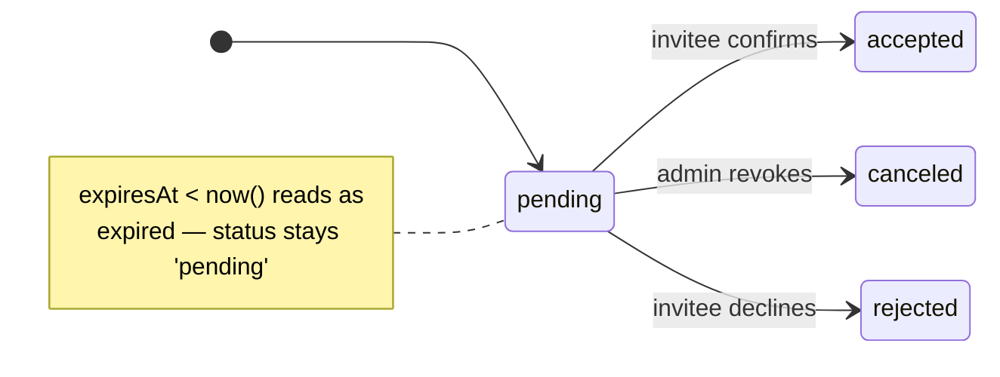

import { Aside, CardGrid } from '@astrojs/starlight/components';
import Figure from '../../../components/figures/Figure.astro';
import AnnotatedCode from '../../../components/code/annotated-code/AnnotatedCode.astro';
import AnnotatedStep from '../../../components/code/annotated-code/AnnotatedStep.astro';
import CodeVariants from '../../../components/code/code-variants/CodeVariants.astro';
import CodeVariant from '../../../components/code/code-variants/CodeVariant.astro';
import StateMachineWalker from '../../../components/figures/state-machine-walker/StateMachineWalker.astro';
import Question from '../../../components/figures/state-machine-walker/Question.astro';
import Branch from '../../../components/figures/state-machine-walker/Branch.astro';
import DrizzleSchemaCoding from '../../../components/live-coding/DrizzleSchemaCoding/DrizzleSchemaCoding.astro';
import ExternalResource from '../../../components/ui/ExternalResource.astro';
import Term from '../../../components/ui/Term.astro';
import CourseProgressBar from '../../../components/ui/CourseProgressBar.astro';
import TokenAtRest from '../../../components/lessons/058/1/TokenAtRest.astro';
import InvitationHandoff from '../../../components/lessons/058/1/InvitationHandoff.astro';
import VideoCallout from '../../../components/embeds/VideoCallout.astro';

<CourseProgressBar value={frontmatter['course-progress']} />

An admin opens your members page, types `bob@acme.com` into the invite field, picks **Member** from a role dropdown, and clicks invite. Here is the thing the rest of this chapter is built around: at that moment, Bob does not exist. There is no `user` row with that email, no session, no record of him anywhere in your system. He might accept in five minutes. He might accept in three days, after the email surfaces from under a pile of unread notifications. He might never accept at all.

That gap — between "an admin offered a seat" and "a human claimed it" — is the entire reason this lesson exists. You already have the pieces around it: the organization plugin gives you `member` rows, `requireOrgUser()` hands you `{ user, orgId, role }`, and every mutation writes to the audit log. What you are missing is the thing that *survives* that gap: a row that holds the offer open across an unbounded stretch of time, bound to an email address rather than a user who isn't there yet, carrying the role the admin chose so the accept screen never has to ask a question. By the end of this lesson you can model that table, reason about the states it moves through, and explain two decisions that look like details but are really the security spine of the whole flow — why the token is hashed before it touches the database, and why a single index is what stops Bob from collecting five duplicate invites.

## An invitation is a reservation, not a membership

Before any schema, get the mental model exactly right, because everything in the columns falls out of it.

You already know what a `member` row means. It is a fact in the present tense: *this person is in this org, with this role, right now.* The accept flow you'll build later writes one. An invitation row is a different kind of thing entirely. It does not say Bob is in the org. It says: *we offered this email address a seat, and nobody has claimed it yet.* It is a record of an intention, not a record of a state.

The closest everyday analogy is a restaurant reservation. A booking under a name holds a table for a window of time. The party might walk in and sit down. They might call and cancel. They might simply never show. The booking is not the meal — it is a *promise to hold the table*, and it only matters because of the gap between when it's made and when it's honored. An invitation is the same shape: a promise to hold a seat, valid for a window, that resolves into a membership only if and when the person acts.

Three properties drop straight out of that framing, and they preview the rest of the lesson:

- It is bound to an **email address**, not a user. The invitee may have no account at all when the invite is created — the email is the only handle you have on them.
- It carries the **role chosen at invite time**. Picking the role is the inviter's call, a privileged decision, and capturing it on the row means the accept screen is a single button: "you're invited to Acme — accept." No decision left for Bob to make.
- It has a **lifetime**. A pending offer is not open forever; it expires.

Hold those three. They are the load-bearing columns, and the next section gives them their shape.

## The shape Better Auth gives you, and the two columns you add

Here is the senior reflex, and it is worth saying before a single line of schema: you do not author the `invitation` table from scratch. Better Auth's organization plugin already defines it — the same plugin that owns `organization` and `member`. The table ships with the plugin. Your job is to *consume* its columns and extend the table with exactly the things the framework deliberately leaves to you, through the plugin's <Term definition="Better Auth's mechanism for adding your own columns to a table a plugin already owns. You declare the extra fields in the plugin config; the migration and the row type pick them up.">`additionalFields`</Term> mechanism. Reinventing the table would mean fighting the plugin's own queries; extending it means the plugin keeps working and you get your two extra columns.

The plugin owns eight columns. Walk them once, because naming them is half the lesson:

- `id` — the primary key, a UUID.
- `organizationId` — which org the seat is in (a foreign key to `organization`).
- `email` — the invited address. This is the invitation's identity, the thing we hang everything on.
- `role` — the role to grant when the invite is accepted.
- `inviterId` — who sent it (a foreign key to `user.id`).
- `status` — where the row sits in its lifecycle.
- `createdAt` — when it was sent.
- `expiresAt` — when the offer lapses.

(The plugin also defines a `teamId` column, but only if you turn on its teams feature. This course doesn't, so you'll never see it populated — mentioned once so it doesn't surprise you in a migration.)

To that, you add **two** columns of your own:

- `tokenHash` — the <Term definition="The SHA-256 digest of the raw invitation token. The raw token lives only in the emailed URL; the database stores this hash, so a database read can't reconstruct a working accept link.">`tokenHash`</Term>, the SHA-256 of the secret token that goes in the invite link.
- `acceptedAt` — the exact moment the invite was accepted, nullable because most pending rows have never been accepted.

Why *these* two specifically, and not others? Because the plugin owns identity, tenancy, and lifecycle state — that's its job, and it does it well. But two concerns are deliberately yours: how the token is stored at rest, and the precise instant of acceptance. The framework doesn't dictate either, because they're application policy. You'll see why the token hashing is non-negotiable later in this lesson; for now, just register that these two columns are *the application's additions*, and the other eight are *the plugin's*.

Here is the table. Step through it part by part rather than reading it top to bottom — the structure is the point, not any single line.

<AnnotatedCode lang="ts" maxLines={18} code={`
export const invitation = pgTable(
  'invitation',
  {
    id: uuid('id').primaryKey().$defaultFn(() => uuidv7()),
    organizationId: uuid('organization_id')
      .notNull()
      .references(() => organization.id, { onDelete: 'cascade' }),
    email: text('email').notNull(),
    role: text('role').notNull(),
    inviterId: uuid('inviter_id')
      .notNull()
      .references(() => user.id, { onDelete: 'cascade' }),
    status: text('status').notNull().default('pending'),
    createdAt: timestamp('created_at', { withTimezone: true })
      .notNull()
      .defaultNow(),
    expiresAt: timestamp('expires_at', { withTimezone: true }).notNull(),
    tokenHash: text('token_hash').notNull(), // added
    acceptedAt: timestamp('accepted_at', { withTimezone: true }), // added
  },
  (t) => [
    uniqueIndex('invitation_org_email_pending_unique')
      .on(t.organizationId, lower(t.email))
      .where(sql\`\${t.status} = 'pending'\`),
  ],
);
`}>
  <AnnotatedStep meta="{4} {5-7} {10-12}" color="blue">
    Identity plus the two foreign keys: a UUIDv7 primary key, the `organizationId` the seat lives in, and the `inviterId` who sent it. Note `onDelete: 'cascade'` on `organizationId` — deleting an org takes its open invitations with it, the same cascade you used on the org skeleton. The "accept after the org was deleted" edge case later in the chapter relies on exactly this.
  </AnnotatedStep>

  <AnnotatedStep meta="{8-9}" color="violet">
    The invitation's identity value and the captured role. `email` is the handle on a person who may have no account at all; `role` is the inviter's decision, frozen onto the row so the accept screen asks nothing.
  </AnnotatedStep>

  <AnnotatedStep meta="{13-17}" color="orange">
    The three lifecycle columns the plugin owns: `status` is where the row sits, `createdAt` is when it was born, `expiresAt` is when it lapses. The next two sections give the lifecycle and the expiry their full weight.
  </AnnotatedStep>

  <AnnotatedStep meta="{18-19}" color="green">
    Your two additions, marked `// added`. `tokenHash` stores the SHA-256 of the secret in the link, never the secret itself; `acceptedAt` is nullable because a pending row has never been accepted. The rest of the lesson earns the `tokenHash` decision.
  </AnnotatedStep>

  <AnnotatedStep meta="{22-24}" color="blue">
    The duplicate-pending guard — at most one pending invite per `(org, email)` — declared as a partial unique index in the table's second-arg callback. It gets its own section near the end; for now just register that it lives here, in the table definition.
  </AnnotatedStep>
</AnnotatedCode>

Two columns in that table are typed as plain `text` but should not be allowed to hold *any* text — `role` and `status` each have a small, fixed set of legal values. The next two short sections lock those down, because a typo in a status string is exactly the kind of bug that fails silently in production.

One footnote worth recording before you move on, so it doesn't bite you later.

:::note
There's a rough edge in configuring `additionalFields` on a plugin-owned table. The fields work at the database layer — the migration adds the columns, and your Drizzle table sees them fine. But as of early 2026, Better Auth's generated `auth.api.*` types don't always surface added fields cleanly (a known type-inference bug). That's not a problem for this course, because the data-layer convention says your Drizzle table is the source of truth anyway: you read and write `tokenHash` through `typeof invitation.$inferSelect`, not through the plugin's inferred API types. So the gap costs you nothing — just don't expect the plugin's API surface to magically know about your columns.
:::

### Constrain status to its four values

The plugin's `status` column is one of exactly four strings: `pending`, `accepted`, `rejected`, or `canceled`. That's a closed set. Leaving the column as open `text` means a seed-data typo like `'penidng'` slips in and *fails silently* — the row just never matches your `status = 'pending'` filters, and you spend an afternoon wondering why an invite vanished.

The fix is to make bad values fail loudly, at the database. The course bans TypeScript's `enum`, so you don't model this as a TS enum — you keep the legal set as a string-literal union on the TS side and enforce it with a `CHECK` constraint on the column. The union and the check derive from one `as const` list:

```ts title="src/db/schema/invitation.ts"
export const INVITATION_STATUSES = [
  'pending',
  'accepted',
  'rejected',
  'canceled',
] as const;

export type InvitationStatus = (typeof INVITATION_STATUSES)[number];

// in the table's second-arg callback, alongside the unique index:
check(
  'invitation_status_check',
  sql`${t.status} IN ('pending', 'accepted', 'rejected', 'canceled')`,
)
```

Now the TypeScript side stays a clean string-literal union (no `enum` in sight), and the database physically rejects any other value on insert or update. Of the four, `rejected` is the rare one — it's the invitee actively declining, which barely happens in B2B; it exists in the set, but this chapter hardly touches it. The other three carry the whole flow.

### The role is captured here, and `'owner'` is refused

The `role` column is a *decision record*. When you build RBAC's three roles, you'll see that the role an invite carries is the inviter's privileged choice, captured at invite time precisely so the accept screen stays trivial — the accept flow writes `member.role = invitation.role` and never re-prompts.

But there's a constraint on which roles are *legal* to invite into, and it's narrower than the full member role set. `'owner'` is excluded. An organization has exactly one owner, and transferring ownership is its own deliberate flow — you never grant it by sending an invite. So the valid domain for `role` *at invite time* is just two values: `'admin'` and `'member'`.

This is defense in depth. The invite form will disable the owner option in the dropdown, but the UI is not where you enforce a security boundary — someone can always craft a request that skips the form. The real enforcement lands in the next lesson, where the send action's Zod schema validates `role` as `z.enum(['admin', 'member'])` and refuses anything else before the row is ever written. Here, just register that the column's legal domain at invite time is those two roles, and that it's deliberately narrower than the roles a member can eventually hold.

## The lifecycle: pending, then one terminal state

An invitation row moves through a tiny state machine, and getting its shape right is what immunizes you against the single most common mistake people make with this table.

A row is born `pending` — created, with the email about to go out. From there it transitions exactly once, into a terminal state, and then it's done:

- `accepted` — the invitee clicked the link and confirmed. A `member` row now exists.
- `canceled` — an admin revoked the invite before anyone accepted.
- `rejected` — the invitee actively declined (rare, as noted).

Three terminal states, one starting state, a single transition between them. That's the whole machine. But there's a fourth word people *expect* to see here, and its absence is the lesson.

**`expired` is not a stored status.** There is no `status = 'expired'` row in your database, ever. Expiry is *computed*: a row is expired when `expiresAt < now()`, evaluated at read time. The status column still says `pending`; the row has simply aged past its window. This matters enormously, because the instinct — and it is a strong, almost universal instinct — is to reach for a background job: a cron that wakes up every hour, scans for `pending` rows past their expiry, and flips them to `'expired'`. *Resist that.* It is a moving part you don't need, a job that can fall behind or fail, and a second source of truth competing with the column. The read path's `where` clause is the source of truth: every query that cares filters on `status = 'pending' AND expiresAt > now()`. Expired-but-still-`pending` rows accumulate harmlessly — they simply never match — and a retention job (which you'll meet at the end of this lesson) eventually deletes the old ones in batch. No job *marks* anything expired. The filter does the work.

Here is the machine. Click through each state to read what it means and what the accept flow does when it lands on a row in that state — the part inside each state is where the lesson actually lives.

<StateMachineWalker kind="machine" title="The invitation lifecycle">
  <Figure slot="diagram">



  </Figure>

  <Question id="pending" prompt="pending — the offer is open"
    description="The row was created and the email is going out. This is the only non-terminal state. A pending row past its expiresAt reads as expired everywhere it's queried, but the status column never changes — expiry is computed, not stored.">
    <Branch label="Invitee clicks and confirms" to="accepted" rationale="The accept flow writes acceptedAt and inserts a member row." />
    <Branch label="Admin revokes it" to="canceled" rationale="A pending offer pulled before anyone acted on it." />
    <Branch label="Invitee declines" to="rejected" rationale="The invitee actively says no — rare in B2B." />
  </Question>

  <Question id="accepted" prompt="accepted — terminal"
    description="acceptedAt is stamped and a member row now exists. If the accept page is opened again on this row, it sees the accepted status and renders a friendly 'you're already a member', with a link into the org. No further transitions.">
  </Question>

  <Question id="canceled" prompt="canceled — terminal"
    description="An admin revoked the invite before it was accepted. Opening the accept link now renders 'this invite was revoked'. No further transitions.">
  </Question>

  <Question id="rejected" prompt="rejected — terminal"
    description="The invitee actively declined. Rare in B2B — it exists in the set but the chapter barely touches it. No further transitions.">
  </Question>
</StateMachineWalker>

The thing the diagram makes visible is that the expired condition sits *outside* the node set, as a note on `pending`, not as a box of its own. That placement is the whole point: expired is a lens you look through at read time, never a transition the row takes.

## Seven days, on purpose: expiry as a security primitive

So a pending invite has a window. How long should it be? This is a decision, and the right way to make it is to start from the platform default and then justify any move away from it.

Better Auth's default expiry for an invitation is **48 hours**, configured through the plugin's `invitationExpiresIn` option, in seconds. Forty-eight hours is reasonable but tight for a year-one SaaS: an invite sent on Friday afternoon is dead by Sunday, before the recipient is back at their desk. So the senior call here is to override it — to **seven days**. Long enough that "I'll deal with it Monday" survives a weekend with room to spare; short enough that an old invite email, forwarded or leaked months later, does not still hand someone a live door into your org.

That framing is the important part. Expiry is not a UX convenience knob you tune for conversion. It is a *security primitive* — it bounds the blast radius of a leaked link in time. Treat it like one. That means the value does not live as a bare literal buried in your plugin config; it lives in a named constant, so its purpose is legible and so there is exactly one place to change it.

<div data-mark-color="green">

```ts title="src/lib/auth.ts" "INVITATION_TTL_SECONDS"
const INVITATION_TTL_SECONDS = 60 * 60 * 24 * 7; // 7 days

// in the organization() plugin config:
organization({ invitationExpiresIn: INVITATION_TTL_SECONDS });
```

</div>

Two consequences follow from treating expiry as a hard contract, and both are worth stating now even though you build them later:

- **Resending an expired invite mints a brand-new row** — new token, fresh seven-day window — and never extends the old one. You'll implement that rotation later in the chapter; the principle lands here. An expired invite is dead; you replace it, you don't revive it.
- **The accept path enforces `expiresAt > now()`** as a precondition on the lookup. The column is the contract, and the read is where it's honored.

## Why the token is hashed at rest

This is the security heart of the lesson, so build it the way a security decision should be built: as a threat model, starting simple and adding the complete picture one step at a time.

**Start with what the token is.** Bob has no account, no password, no session. When he clicks the link in his inbox, the only thing that proves "this invite is mine, let me in" is a secret string in the URL — the token. That makes the token a <Term definition="A credential where possession alone grants access — no separate identity check. Whoever holds a valid bearer token is treated as authorized, which is why the token must be unguessable and must not leak.">bearer token</Term>: whoever holds it is treated as the invitee. Possession *is* authorization. Two things follow immediately — the token must be impossible to guess, and it must not leak.

**Decision A: make it unguessable.** The token is 32 bytes of cryptographic randomness, from the same `crypto.getRandomValues(new Uint8Array(32))` you already know, then <Term definition="URL-safe Base64. Replaces the standard alphabet's '+' and '/' with '-' and '_' and drops '=' padding, so the string is safe to drop straight into a URL.">base64url</Term>-encoded into a 43-character string for the URL. Thirty-two random bytes is 256 bits of entropy — there is no guessing that. You might wonder why not `crypto.randomUUID()`, which is also unguessable at 122 bits. The answer is taste with a reason: a UUID *means something* (it's an identifier format), and a bearer token should be opaque — pure random bytes with no semantics to accidentally lean on. 122 bits would be plenty of entropy, but the 32-byte buffer is the cleaner reflex for "this is a secret, nothing more." And `Math.random()` is simply disqualified — it is not cryptographically secure, and a token from it is a guessable token.

**Decision B: hash it before it touches the database.** Here is the move that separates this from naive implementations. The *raw* token goes into exactly one place: the URL in the email that reaches Bob. The database never sees it. What the database stores is `sha256(token)`, in your `tokenHash` column. Picture the split:

<Figure>
  <TokenAtRest />
  <Fragment slot="caption">
    One secret, two trust zones. The *raw* token travels only down the amber path — into the emailed URL, to Bob's inbox — the one live copy outside server memory. Down the green path the token is run through SHA-256 and **only the hash** lands in `invitation.tokenHash`. A read of that column sees the hash and nothing else, and because SHA-256 is one-way it can't be turned back into the token — so the database read can't forge a working accept URL.
  </Fragment>
</Figure>

Now name the threat this defends against, concretely. Suppose an attacker gets **read access** to your `invitation` table — a leaked database backup, a SQL-injection bug on some read path, a curious insider with a query console. What do they get? Only hashes. And because <Term definition="A fast, one-way cryptographic hash. Easy to compute token → digest; computationally infeasible to reverse digest → token.">SHA-256</Term> is one-way, a hash cannot be turned back into the token. They cannot forge a working accept URL, because the URL needs the *raw* token and the raw token isn't there. The blast radius of a database read just shrank from "every pending invite is compromised" to "nothing useful." That's the entire payoff.

If this smells like password hashing, you're right — same posture, raw secret in, hash stored. But there's a deliberate difference, and it's a "know *why* the tool" moment that separates someone who reaches for the right primitive from someone who cargo-cults the heavyweight one. Passwords get a *slow* hash — bcrypt, argon2 — on purpose: humans pick weak, low-entropy passwords, and a slow hash makes offline brute-force expensive. An invitation token is the opposite case. It is 256 bits of uniform randomness with no structure to brute-force, and it's throwaway, valid for seven days. There is nothing for a slow hash to defend. So SHA-256 — a *fast* hash — is exactly correct here, and reaching for bcrypt would be cargo: paying a cost that buys you nothing. Match the cryptographic tool to the actual threat, not to a vague sense that "more is safer."

<VideoCallout videoId="zt8Cocdy15c" videoTitle="System Design: How to store passwords in the database?">
  ByteByteGo's 4-minute take on why secrets are hashed before they hit the database — and why the slow-vs-fast hash distinction this section just drew is the whole game.
</VideoCallout>

Two more notes that belong with this decision, woven in rather than bundled at the end:

- The accept path looks invitations *up by* `tokenHash` — it hashes the incoming raw token and queries for the matching row. That lookup needs `tokenHash` to be **indexed**, or every accept click means a full table scan. A plain, non-unique index is enough: two distinct 256-bit tokens colliding on the same hash is so improbable you don't model it, so the index is there for speed, not to enforce uniqueness. When you wire it in the next lesson, that's why.
- As a discipline, comparing a stored hash against a candidate should use a timing-safe comparison — the same constant-time compare you met with Web Crypto. Strictly, an indexed SHA-256 *lookup* doesn't carry the timing exposure that an HMAC *verification* does (the database does the matching, not a byte-by-byte string compare in your code). The place constant-time comparison truly bites is the HMAC signature on the accept URL, which you add in the next lesson. Name the discipline now; apply it there.

The actual token generation and hashing happen in the send action, next lesson. This lesson establishes the *posture* — raw token in the URL, hash in the database — and the column that holds the hash.

## One pending invite per address: the partial unique index

The second structural decision, and the second place beginners reliably get it wrong.

The business rule is simple: at most one *pending* invitation per `(organization, email)` pair. Alice should not be able to fire off five pending invites to Bob — that's five emails, five live tokens, one confused recipient. So you need to enforce "one pending invite per address per org."

The wrong way to enforce it is in application code: before inserting, `SELECT` to check whether a pending invite already exists, and only insert if not. That has a race window. Two rapid submits — a double-click, two tabs — both run the `SELECT`, both see nothing, both `INSERT`. You get your duplicate anyway. The check and the write aren't atomic, and the gap between them is exactly where the bug lives.

The senior reflex is to encode the rule as a **database invariant** — a constraint the database enforces atomically, so the duplicate `INSERT` is rejected no matter how the requests interleave. The right tool is a *partial* unique index:

```sql
CREATE UNIQUE INDEX invitation_org_email_pending_unique
  ON invitation (organization_id, lower(email))
  WHERE status = 'pending';
```

Read that carefully, because two refinements are doing real work:

- **`lower(email)`** normalizes case. `Bob@Acme.com` and `bob@acme.com` are the *same address* per the email spec, so the index keys on the lowercased form and they collide as they should. This is one face of a broader discipline — store and compare email lowercased — that the send action's `.toLowerCase()` and the accept flow's mismatch check both depend on.
- **`WHERE status = 'pending'`** is what makes it *partial*. Only pending rows participate in the uniqueness check. Accepted, canceled, and (computed-)expired rows are invisible to it. That's not incidental — it's the entire reason this is a partial index and not a plain one. Bob can have an accepted row from when he joined last year *and* a fresh pending row when you re-invite him after he left. A plain unique on `(org, email)` would block that legitimate re-invite; the partial unique allows it and blocks only the genuine duplicate-pending case.

<VideoCallout videoId="WL2NXQmUOC0" videoTitle="Partial Indexing | The Backend Engineering Show">
  Hussein Nasser spends 18 minutes on partial indexes, building to the exact `status`-filtered example this section uses — watch if you want the storage and write-cost reasons behind the technique.
</VideoCallout>

Now the part you have to get *exactly* right, because it's a real trap. Translating that index to Drizzle has two footguns, and the first one produces an index that looks correct and silently emits broken DDL.

<CodeVariants>
  <CodeVariant label="Looks right — broken DDL">
    <div data-mark-color="red">

    ```ts {9}
    import { sql, eq } from 'drizzle-orm';
    import type { AnyPgColumn } from 'drizzle-orm/pg-core';

    const lower = (col: AnyPgColumn) => sql`lower(${col})`;

    // in the table's second-arg callback:
    uniqueIndex('invitation_org_email_pending_unique')
      .on(t.organizationId, lower(t.email))
      .where(eq(t.status, 'pending'));
    ```

    </div>
    **Compiles, ships broken DDL.** `eq()` emits a parameterized placeholder (`$1`) into the index's `WHERE`, and a partial index predicate can't be a bound parameter — Postgres rejects or mis-builds it. The bug hides because the TypeScript is perfectly valid; it surfaces only at migration time, or worse, as an index that doesn't constrain what you think.
  </CodeVariant>

  <CodeVariant label="Correct">
    <div data-mark-color="green">

    ```ts {9}
    import { sql } from 'drizzle-orm';
    import type { AnyPgColumn } from 'drizzle-orm/pg-core';

    const lower = (col: AnyPgColumn) => sql`lower(${col})`;

    // in the table's second-arg callback:
    uniqueIndex('invitation_org_email_pending_unique')
      .on(t.organizationId, lower(t.email))
      .where(sql`${t.status} = 'pending'`);
    ```

    </div>
    **Emits the literal predicate.** A `sql` template literal writes `WHERE status = 'pending'` verbatim into the index DDL — no placeholder. This is the form that produces a valid partial index. The second footgun is `lower()` itself: Drizzle has no built-in `lower`, so you hand-write the ``sql`lower(${col})` `` helper shown at the top of both tabs.
  </CodeVariant>
</CodeVariants>

The takeaway is narrow but sharp: in a partial index's `.where()`, use a `sql` template literal, never `eq()`. The `eq()` version type-checks and looks idiomatic, which is exactly why it's dangerous — it fails where you're not looking.

What does this constraint *buy* you downstream? When an admin re-invites an address that already has a pending invite, the `INSERT` fails — at the database, atomically, no race. The send action catches that specific constraint error and translates it into a clean `'already-invited'` result, which the UI turns into a "Bob already has a pending invite — resend or revoke?" prompt. You'll build that catch-and-translate later in the chapter. The point for now: **this index *is* the source of that signal.** The whole "already invited" UX exists because the database refused a duplicate, not because some application code remembered to check.

Time to make the constraint fire under your own hands. The exercise below gives you the `organization` and `invitation` tables with the partial unique index missing. Add it so that the duplicate-pending insert is rejected — but cross-org and post-cancel re-invites still go through.

<DrizzleSchemaCoding
  instructions="Add a partial unique index named invitation_org_email_pending_unique on (organization_id, lower(email)) where status = 'pending', so a second pending invite to the same email in the same org is rejected — while cross-org invites and re-invites after a cancel still go through. Two footguns: lower() has no Drizzle built-in, so hand-write the sql`lower(${col})` helper; and the .where() must be a sql template literal, never eq() (eq emits a bound placeholder that breaks the index DDL)."
  starter={`import { sql } from 'drizzle-orm';
import type { AnyPgColumn } from 'drizzle-orm/pg-core';

// Drizzle has no built-in lower() — write the helper:
const lower = (col: AnyPgColumn) => sql\`lower(\${col})\`;

export const organization = pgTable('organization', {
  id: integer('id').primaryKey(),
  name: text('name').notNull(),
});

export const invitation = pgTable(
  'invitation',
  {
    id: integer('id').primaryKey(),
    organizationId: integer('organization_id')
      .notNull()
      .references(() => organization.id),
    email: text('email').notNull(),
    status: text('status').notNull().default('pending'),
  },
  (t) => [
    // Add the partial unique index here.
  ],
);`}
  requirements={[
    {
      name: 'invitation',
      columns: [
        { name: 'id', type: 'integer', primaryKey: true },
        { name: 'organization_id', type: 'integer', notNull: true,
          references: { table: 'organization', column: 'id' } },
        { name: 'email', type: 'text', notNull: true },
        { name: 'status', type: 'text', notNull: true },
      ],
    },
  ]}
  seedSQL={`INSERT INTO organization (id, name) VALUES (1, 'Acme'), (2, 'Globex');`}
  probes={[
    {
      description: "The same email can have a pending invite in two different orgs",
      sql: `INSERT INTO invitation (id, organization_id, email, status) VALUES
        (1, 1, 'alice@acme.com', 'pending'),
        (2, 2, 'alice@acme.com', 'pending');`,
      mustSucceed: true,
    },
    {
      description: "A second pending invite to the same email in the same org is rejected",
      sql: `INSERT INTO invitation (id, organization_id, email, status) VALUES
        (10, 1, 'bob@acme.com', 'pending'),
        (11, 1, 'Bob@Acme.com', 'pending');`,
      mustSucceed: false,
    },
    {
      description: "A re-invite is allowed when an earlier invite to the same address was canceled",
      sql: `INSERT INTO invitation (id, organization_id, email, status) VALUES
        (20, 1, 'carol@acme.com', 'canceled'),
        (21, 1, 'carol@acme.com', 'pending');`,
      mustSucceed: true,
    },
  ]}
/>

If you got the third probe to pass, you've felt precisely why the index is partial: the canceled row is invisible to the constraint, so the re-invite slides through.

## After the click: the invitation and the member are sequential, not joined

When Bob finally accepts, two writes happen. The `invitation` row flips to `accepted` and gets its `acceptedAt` stamp, and a brand-new `member` row is inserted with `role = invitation.role`. Two tables touched in one moment. The instinct of anyone who's learned database normalization is to *connect* them — add a `memberId` foreign key on `invitation` pointing at the member it produced. Don't.

These two tables are **sequential in time, not foreign-keyed to each other.** The invitation's job *ends* at acceptance; the member's job *begins*. They describe two different moments of one event, and wiring a hard FK between them models a relationship that doesn't really exist — the invitation isn't a parent of the member, it's its predecessor. What actually links them, historically, is the audit log: the `'invitation.accepted'` event you write carries the new `memberId` in its payload. If you ever need to answer "which invite produced this membership," the audit trail has it — that's its job.

<Figure>
  <InvitationHandoff />
  <Fragment slot="caption">
    Accept writes *two* rows — the `invitation` flips to `accepted` and a new `member` is inserted with `role = invitation.role` — but there is **no foreign key between them**. They're sequential, not joined. What records which invite produced which membership is the audit log's `invitation.accepted` event, whose payload carries the new `memberId`.
  </Fragment>
</Figure>

And note what *doesn't* happen on accept: the invitation row is not deleted. The status flip is the only write to it. Why keep it? Because an admin will eventually ask "was Bob ever invited, and when did he accept?" — and the answer is right there in the table. Rows are cheap; the answer is not reconstructable once it's gone.

That said, rows do accumulate, so there's a retention story. Accepted rows stay forever — the audit log references them, and they're the historical record. But `canceled` rows and stale `pending`-past-expiry rows pile up with no further use. The cleanup is a single retention job (background-jobs territory, built much later in the course) that *deletes* terminal and stale rows older than roughly 90 days, in batch. Connect this back to the earlier point: no job ever *marks* a row expired — the read filter handles that. One job, eventually, *deletes* the old dead rows. Marking and deleting are different operations, and only the second one earns a job.

## What this schema deliberately does not do: count seats

One boundary to draw before you go, because it pre-empts a predictable question.

:::note
Some products gate invites on seat count: "you have 2 of 5 seats left; this invite uses one." Notice this schema tracks *no* seat count, and that's on purpose — seat counting is billing and entitlements territory, which the course reaches later, when it wires up Stripe (you'll meet `entitlements.canInviteMember(orgId)` there). When that check exists, it runs in the *action body, before* the invite is written — never as a column on this table. The invitation table models the reservation; the entitlement check decides whether you're *allowed* to make one. Keep them separate, and don't bolt a seat counter onto this table.
:::

## External resources

The references that ground this lesson — the plugin that owns the table, the index shape you hand-built, the case-insensitive email discipline, and the security posture behind the hashed token — are worth a bookmark, not a full read.

<CardGrid>
  <ExternalResource
    title="Better Auth — Organization plugin"
    href="https://better-auth.com/docs/plugins/organization"
    icon="simple-icons:betterauth"
    description="Source of truth for the plugin-owned invitation columns and the invitationExpiresIn option."
  />
  <ExternalResource
    title="OWASP — Forgot Password Cheat Sheet"
    href="https://cheatsheetseries.owasp.org/cheatsheets/Forgot_Password_Cheat_Sheet.html"
    icon="simple-icons:owasp"
    iconColor="#1A2E48"
    description="The security spine behind the token: CSPRNG generation, entropy, hashing at rest, and expiry."
  />
  <ExternalResource
    title="Drizzle ORM — Indexes & constraints"
    href="https://orm.drizzle.team/docs/indexes-constraints"
    icon="simple-icons:drizzle"
    iconColor="#C5F74F"
    description="Partial unique indexes and the sql-template predicate shape this lesson's index needs."
  />
  <ExternalResource
    title="Drizzle ORM — Case-insensitive email"
    href="https://orm.drizzle.team/docs/guides/unique-case-insensitive-email"
    icon="simple-icons:drizzle"
    iconColor="#C5F74F"
    description="The exact lower(email) unique-index pattern behind the store-and-compare-lowercased discipline."
  />
</CardGrid>
