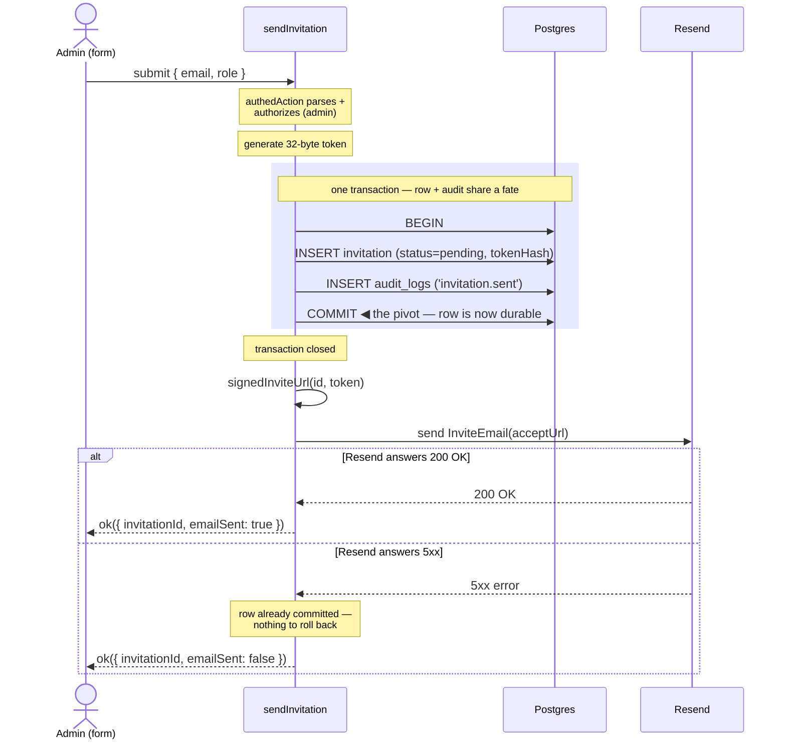

import { CardGrid } from '@astrojs/starlight/components';
import Figure from '../../../components/figures/Figure.astro';
import AnnotatedCode from '../../../components/code/annotated-code/AnnotatedCode.astro';
import AnnotatedStep from '../../../components/code/annotated-code/AnnotatedStep.astro';
import CodeVariants from '../../../components/code/code-variants/CodeVariants.astro';
import CodeVariant from '../../../components/code/code-variants/CodeVariant.astro';
import CodeTooltips from '../../../components/code/CodeTooltips.astro';
import Sequence from '../../../components/exercises/sequence/Sequence.astro';
import Step from '../../../components/exercises/sequence/Step.astro';
import ScriptCoding from '../../../components/live-coding/ScriptCoding/ScriptCoding.astro';
import VideoCallout from '../../../components/embeds/VideoCallout.astro';
import ExternalResource from '../../../components/ui/ExternalResource.astro';
import Term from '../../../components/ui/Term.astro';
import CourseProgressBar from '../../../components/ui/CourseProgressBar.astro';
import TokenTrustBoundaries from '../../../components/lessons/058/2/TokenTrustBoundaries.astro';
import SignedUrlAnatomy from '../../../components/lessons/058/2/SignedUrlAnatomy.astro';

<CourseProgressBar value={frontmatter['course-progress']} />

Alice opens the members page, types `bob@acme.com`, picks **Member** from the role dropdown, and clicks **Send invite**. From the last lesson you already have the row that this click is going to create — the `invitation` table, with its `tokenHash` column, its pending status, its seven-day `expiresAt`. What you don't have yet is the thing that fills that row in and gets a clickable link into Bob's mailbox.

That single click kicks off a short chain of obligations. Mint a random token. Hash it. Write a pending row. Build a URL Bob can click from his inbox. Sign that URL so junk rejects fast. Mail it. And do all of that without leaking the raw token into your server logs, and without leaving a half-built mess behind if Resend happens to hiccup mid-send.

You already have the pieces this assembles from. `authedAction` lifts the session, the role check, and the schema parse out of the body. `withTenant` opens a tenant-scoped transaction. `logAudit` writes the audit row inside it. `sendEmail` is the Resend wrapper from the email unit. This lesson is where those four become a single real send path: one Server Action, `sendInvitation`, built end to end, plus a small helper underneath it called `signedInviteUrl`.

There's one sentence that frames every decision you're about to make, so hold it from the start: a pending invitation is a bearer credential you are mailing to a stranger — so build it like one.

## A bearer credential you mail to a stranger

Before any code, install the threat model, because every later decision falls out of it. Get this wrong and the rest reads like ceremony; get it right and each step is the only move that makes sense.

Here is the uncomfortable truth about that accept URL. Whoever holds it can join the org. Not "whoever is logged in as Bob" — whoever *holds the link*. The URL itself is the proof of identity. That makes it a <Term definition="A credential where possession alone grants access — no further identity proof. Whoever holds it is treated as authorized.">bearer token</Term>: a credential where possession alone grants access, with no second identity check behind it. The raw token inside that URL is, for the seven days it lives, exactly as sensitive as a password.

With one difference you already settled in the last lesson. A password is long-lived and human-chosen, so it gets a deliberately *slow* hash. This token is high-entropy and throwaway — 32 random bytes, a seven-day window — so a *fast* hash is the correct call. That's why the database stores `sha256(token)` and not a bcrypt or argon digest: reaching for a slow hash here would be cargo-culting the password playbook into a place it doesn't belong. You don't need to re-derive that; you proved it last lesson. Generating the token it hashes is this lesson's job.

So if the raw token is that sensitive, the whole design comes down to one question: **where is it allowed to exist?** There are exactly three places it could show up outside server memory, and each one has a verdict.

<Figure caption="One secret, three trust boundaries. The database keeps only sha256(token); the logger redacts the token and sig params before any line is written. The raw token leaves server memory exactly once — into the email, its destination — and nowhere else.">
  <TokenTrustBoundaries />
</Figure>

Walk those three left to right, because the asymmetry is the whole point. The **database** never sees the raw token; only its hash lands there, which is the posture you built last lesson — now you can see *why* it mattered. **Server logs and Sentry breadcrumbs** never see it either; the `token` and `sig` query params get redacted at the logger before any line is written, the same way `password` and `authorization` already are. (The redaction rule lives in the logger config, not at your call sites — you state the rule here; the pino wiring is its own concern later in the course.)

The **email body** is the exception, and it's a deliberate one. The inbox is the credential's *destination* — the entire point of the flow is to deliver this secret to the person who can use it. So the raw token belongs there, in the URL, and absolutely nowhere else. One secret, three boundaries, one legitimate exit.

That single rule — "the raw token leaves server memory exactly once, into the email" — is the spec the rest of the action is written to satisfy.

### Why you're writing this yourself

A fair question hangs over all of this: Better Auth's organization plugin already owns the `invitation` table, and it ships an `inviteMember` API and an `acceptInvitation` API. Why hand-roll a send path at all?

Because the plugin's default credential is the invitation's *id* — a value the rest of your system treats as a non-secret database key — and its mail path isn't yours to instrument. You can't slot your audit row into it, you can't sign the URL, you can't control where the secret is allowed to appear. The experienced move is to keep the plugin's *table shape* (you did, last lesson) and write the *send* by hand, so the random token, the hash-at-rest, the HMAC signature, and the audit row all live in code you own. That's the entire reason this is a lesson and not a one-line plugin call. You're not reinventing the table; you're putting the credential discipline where you can see it.

## Thirty-two random bytes, encoded for a URL

The credential starts as randomness. Get the generation right and everything downstream is mechanical; get it subtly wrong and you've shipped a guessable token that no amount of hashing or signing can save.

The correct call is two lines. Ask the platform's cryptographic random source for 32 bytes, then encode those bytes into something safe to drop in a URL.

<div data-mark-color="blue">

<CodeTooltips tooltips={{
  getRandomValues: 'Fills a typed array with cryptographically-strong random values. The CSPRNG behind every token in this stack — unguessable, unlike Math.random().',
  base64url: 'URL-safe Base64: - and _ instead of + and /, and no = padding. 32 bytes become 43 characters you can drop straight into a query string, no escaping.',
}}>
```ts "getRandomValues" "base64url"
const rawBytes = crypto.getRandomValues(new Uint8Array(32));
const rawToken = Buffer.from(rawBytes).toString('base64url');
```
</CodeTooltips>

</div>

`crypto.getRandomValues(new Uint8Array(32))` fills a 32-byte array from the platform's cryptographically-secure random generator — 256 bits of entropy, the same <Term definition="Cryptographically-Secure Pseudo-Random Number Generator. Its output is unpredictable even to someone who has seen previous outputs — the property a credential needs and Math.random() lacks.">CSPRNG</Term> you met when you first touched Web Crypto. Thirty-two bytes is the number to remember: it's comfortably more than any attacker could ever search, and it lines up cleanly with the 256-bit output of the SHA-256 you'll hash it with.

Raw bytes aren't URL-safe, though, so you encode them. `Buffer.from(rawBytes).toString('base64url')` gives you a 43-character string in the URL-safe Base64 alphabet — `-` and `_` instead of `+` and `/`, and no trailing `=` padding. That's the whole reason to pick `base64url` over plain `base64`: nothing in it needs escaping when it rides in a query string. The result is one tidy high-entropy string. It gets hashed into `tokenHash`, it goes into the URL, and once the email is sent it's discarded.

Two ways of doing this are wrong, and an experienced engineer recognizes both on sight.

The first is `Math.random()`. It is not cryptographically secure — its output is predictable to anyone who cares to model it — so as the source of a credential it's disqualifying, full stop. If you ever see `Math.random()` feeding a token, that's a finding.

The second is subtler, and it's worth being precise about rather than hand-wavy. Using `crypto.randomUUID()` as the *sole* token isn't a security hole — a v4 UUID carries 122 bits of entropy, which is genuinely plenty to be unguessable. The reason it's not the move here is that a UUID is an *identity-shaped* value; reaching for one as a *credential* quietly mixes two roles that you want kept apart. The 32-byte approach gives you a uniform, purpose-built bearer string that composes cleanly with the hash and the URL and signals exactly what it is. So: `randomUUID` for an id, `getRandomValues(32)` for a secret. Not "wrong," just not the reflex.

## What the signature adds that the token can't

Here's a puzzle you should be feeling already. The token is 32 random bytes, verified by hashing the incoming value and looking up the matching `tokenHash`. Guessing a valid one is infeasible. So if the token already authenticates on its own — why sign anything at all? What does an HMAC on top of an already-unguessable value buy you?

The answer is that the token and the signature do two different jobs, and conflating them is the single most common way people misunderstand this pattern. Let's separate them cleanly.

**The token authenticates.** That job is finished. The accept path hashes the incoming token, looks up the row by `tokenHash`, and either finds a pending invitation or doesn't. Nothing about the security of *who gets in* depends on the signature. If the signature didn't exist, a valid token would still be a valid token.

**The signature is a cheap doorman.** Picture the accept route without it. Someone points a script at `/accept-invite?token=garbage` and fires a thousand random values a second. Every one of those forces a database round-trip — hash the junk, run the lookup, come back empty — before it fails. The HMAC lets the server throw out a tampered or fabricated URL with a single in-memory string comparison, *before* it ever touches the database. Cheaper, faster, and it never gives a fuzzer the satisfaction of a query.

And it closes one more gap, a subtle one. Suppose an attacker somehow reads your `invitation` table — a leaked backup, a misconfigured replica. They now hold every `tokenHash`. Can they forge a working URL? Without the signature, the database read would be the only barrier, and a hash is the thing they'd need to reverse. *With* the signature, they're stuck: they don't hold the signing secret, so they can't produce a valid `sig`, so they can't forge a link no matter what they read out of the table. The database becomes a pure key/value store with no forge-from-read power. That's defense in depth — the signature isn't the lock, it's a second, independent door.

So the URL has a precise shape:

<Figure caption="Two layers, two jobs. The token (green) is the credential the accept path verifies by hash lookup; the sig (blue) is the doorman — an HMAC over id + token that the verify side recomputes and constant-time-compares, rejecting any forged or tampered URL before a single database query runs.">
  <SignedUrlAnatomy />
</Figure>

In words: the URL is `${NEXT_PUBLIC_APP_URL}/accept-invite?id=${invitationId}&token=${rawToken}&sig=${hmac}`, where `hmac = base64url(HMAC-SHA256(secret, invitationId + '.' + rawToken))`. The `id` says which row; the `token` is the credential; the `sig` is the doorman. The string that gets signed — `invitationId + '.' + rawToken` — is the *canonical signing payload*, and it has one ironclad rule: it must be byte-for-byte identical on the signing side and the verifying side. A single different character, a stray space, the wrong separator, and the recomputed signature won't match and every legitimate link breaks. That contract is exactly what the helper you're about to write exists to enforce in one place.

One thing the HMAC needs: a secret. And it gets its *own* secret, a separate env var called `INVITATION_SIGNING_SECRET` — 32 random bytes, base64-encoded, declared in `env.ts` on the server side, with a generated value sitting in your `.env.local`. Not the session secret, not any other secret you already have. This is a rule worth internalizing as a reflex.

:::caution
Never reuse one secret across two cryptographic purposes. The session secret and the invite-signing secret have different blast radii and different rotation cadences — the day you need to rotate one, sharing it with the other turns a clean key-roll into a tangle of "what else breaks if I change this." One secret, one job.
:::

A quick vocabulary anchor before the code, since two terms are about to carry real weight. An <Term definition="Hash-based Message Authentication Code: a keyed signature. Anyone with the secret can produce or verify it; without the secret you can't forge one, even knowing the message.">HMAC</Term> — Hash-based Message Authentication Code — is a keyed signature: anyone holding the secret can produce one or verify one, but without the secret you can't forge one even if you know the exact message. And a <Term definition="String comparison that always takes the same time regardless of where the first difference is, so an attacker can't learn the secret byte-by-byte from response timing.">constant-time compare</Term> is a string comparison that always takes the same amount of time regardless of where the first mismatching byte is, so an attacker can't learn the secret one byte at a time by measuring how long a rejection takes. You met both when you first used Web Crypto; here they finally have a production job to do.

<VideoCallout videoId="fzMIjWFYQl0" videoTitle="MAC / HMAC — Message Authentication Code">
  Practical Networking's 7-minute primer on why hashing alone isn't enough and how an HMAC — a message combined with a secret key before hashing — gives you the keyed signature this URL relies on.
</VideoCallout>

## Building `signedInviteUrl`, and its verify twin

Now you write the crypto by hand, once, as a pure function — and you write its mirror image too, because the fastest way to internalize that signing and verifying must agree on the exact payload is to build both halves and watch them shake hands.

The helper is the single source of truth for what's in the URL. `signedInviteUrl(invitationId, rawToken)` lives at `src/lib/invitations/url.ts`. It's async, because `crypto.subtle` is async — every method on that surface hands you back a Promise. One function, one place to read the URL shape, one place to keep the signature in lockstep with the accept path that will verify it next lesson.

<AnnotatedCode lang="ts" maxLines={18} code={`
import 'server-only';
import { env } from '@/env';

const encoder = new TextEncoder();

async function signingKey() {
  const secret = Buffer.from(env.INVITATION_SIGNING_SECRET, 'base64');
  return crypto.subtle.importKey(
    'raw',
    secret,
    { name: 'HMAC', hash: 'SHA-256' },
    false,
    ['sign'],
  );
}

export async function signedInviteUrl(
  invitationId: string,
  rawToken: string,
): Promise<string> {
  const key = await signingKey();
  const payload = encoder.encode(\`\${invitationId}.\${rawToken}\`);
  const signature = await crypto.subtle.sign('HMAC', key, payload);
  const sig = Buffer.from(signature).toString('base64url');
  const url = new URL('/accept-invite', env.NEXT_PUBLIC_APP_URL);
  url.searchParams.set('id', invitationId);
  url.searchParams.set('token', rawToken);
  url.searchParams.set('sig', sig);
  return url.toString();
}
`}>
  <AnnotatedStep meta="{1-2}" color="violet">
    `import 'server-only'` makes it a build error for any client bundle to pull this module in — the signing secret must never reach the browser. The secret is read from `env`, the build-time-validated env object, not from `process.env` directly.
  </AnnotatedStep>

  <AnnotatedStep meta={`{6-15} "importKey"`} color="blue">
    Import the secret as an HMAC `CryptoKey`. `Buffer.from(..., 'base64')` decodes the env string back to the raw 32 bytes; `importKey('raw', …)` hands those bytes to Web Crypto; `false` marks the key non-extractable (it can sign but can never be exported back out); `['sign']` is the one capability it's allowed.
  </AnnotatedStep>

  <AnnotatedStep meta={`{22-23} "sign"`} color="green">
    Sign the canonical payload. `` `${invitationId}.${rawToken}` `` is the byte-exact string the verify side must reproduce; `encoder.encode` turns it into bytes; `crypto.subtle.sign('HMAC', key, …)` returns the signature as an `ArrayBuffer`.
  </AnnotatedStep>

  <AnnotatedStep meta="{24}" color="green">
    Encode the signature for the URL. `Buffer.from(signature).toString('base64url')` renders the raw bytes into the same URL-safe alphabet as the token — no escaping needed in the query string.
  </AnnotatedStep>

  <AnnotatedStep meta={`{25-29} "NEXT_PUBLIC_APP_URL"`} color="blue">
    Assemble the absolute URL from the named env var, never from a route handler's `request.url`. Building the host from `env.NEXT_PUBLIC_APP_URL` keeps the link stable; deriving it from the incoming request host breaks the moment the action runs behind a preview deployment or a proxy. The `URL` + `searchParams` API encodes each value for you.
  </AnnotatedStep>
</AnnotatedCode>

A few things in that code earn a sentence. The key is imported as **non-extractable** (`false`) with only the `sign` capability — there's no reason this module should ever be able to hand the raw key material back out, so you don't let it. The URL is built with the `URL` constructor and `searchParams.set`, which handle query-string encoding for you, rather than gluing strings together by hand. And the host comes from `env.NEXT_PUBLIC_APP_URL` — a senior detail worth stating plainly: **never** build the accept URL from a route handler's `request.url`. The named env var is stable across local, preview, and production; the request host is whatever proxy or preview domain happened to route the call, and a link built from it will point at the wrong place exactly when you can least afford it.

Now the twin. The accept path next lesson will *verify* this URL, and the verification has to recompute the signature and compare. The correct comparison is not `===`. Reaching for `crypto.subtle.verify` instead is the reflex — it's built to check a MAC in constant time, so it doesn't leak the secret through timing the way a plain string equality would. You proved the timing-attack theory when you first met HMAC; the takeaway you carry here is just the call: verify a signature with `crypto.subtle.verify`, never with `===`.

You'll write a small `verifyInviteUrl(invitationId, rawToken, sig)` to prove the round-trip closes. It's a teaching stub — the production verify gate is the next lesson's job — but writing it now is what makes the sign-and-verify-must-agree rule land in your hands instead of just your notes.

The following exercise is where you build both halves. The sandbox gives you `crypto.subtle` directly in the browser — no imports, no setup — and your job is to fill in `signInvite` and `verifyInvite` so they agree on the exact payload string. Watch what the tests check: not just that a round-trip works, but that flipping a single character of the token, or swapping the secret, makes verification fail. That's the whole property in five assertions.

<ScriptCoding
  runner="sandpack"
  maxHeight={520}
  instructions="The sandbox hands you the browser's crypto.subtle plus three helpers: importKey (the HMAC key), toBase64url, and fromBase64url. Fill in signInvite to return the base64url HMAC-SHA256 of the canonical payload `${id}.${token}` under the given secret, and verifyInvite to recompute the signature and constant-time-compare it against sig — use crypto.subtle.verify, never ===. Both are async. The whole point: sign and verify must agree on the exact payload string."
  starter={`// crypto.subtle, btoa/atob, and TextEncoder are all available in the browser.
// (Plain JS here so the sandbox runs it directly — the real helper in
// src/lib/invitations/url.ts is the typed version you just read.)

const encoder = new TextEncoder();

// Import the secret as an HMAC key. In the real helper the secret is 32
// base64-decoded bytes; here it's encoded as UTF-8 to keep things self-contained.
// The crypto discipline is identical.
async function importKey(secret, usage) {
  return crypto.subtle.importKey(
    'raw',
    encoder.encode(secret),
    { name: 'HMAC', hash: 'SHA-256' },
    false,
    [usage],
  );
}

// Bytes (ArrayBuffer | Uint8Array) -> URL-safe base64 string, no padding.
// Stands in for Buffer.from(bytes).toString('base64url'), which the real
// server helper uses; Buffer isn't available in this browser sandbox.
function toBase64url(bytes) {
  let binary = '';
  for (const b of new Uint8Array(bytes)) binary += String.fromCharCode(b);
  return btoa(binary).replace(/\\+/g, '-').replace(/\\//g, '_').replace(/=+$/, '');
}

// The inverse: URL-safe base64 string -> Uint8Array of signature bytes.
function fromBase64url(str) {
  const b64 = str.replace(/-/g, '+').replace(/_/g, '/');
  const binary = atob(b64);
  return Uint8Array.from(binary, (ch) => ch.charCodeAt(0));
}

export async function signInvite(id, token, secret) {
  // 1. Build the canonical payload \\\`\${id}.\${token}\\\` and encode it to bytes.
  // 2. crypto.subtle.sign('HMAC', key, payload) with a 'sign' key.
  // 3. Return toBase64url(...) of the signature.
  return '';
}

export async function verifyInvite(id, token, secret, sig) {
  // 1. Decode sig back to bytes with fromBase64url(sig).
  // 2. Recompute the same canonical payload bytes.
  // 3. Return crypto.subtle.verify('HMAC', key, sigBytes, payload) with a
  //    'verify' key. Never compare the strings with ===.
  return false;
}
`}
  tests={`
const id = '018f3a1c-7b2e-7c44-9f10-aa01bb02cc03';
const token = 'example-invite-token-0000000000000000000000';
const secret = 'test-signing-secret-value';

test('signInvite is deterministic — same inputs, same signature', async () => {
  const a = await signInvite(id, token, secret);
  const b = await signInvite(id, token, secret);
  expect(typeof a).toBe('string');
  expect(a).toBe(b);
});

test('round-trip — a freshly signed URL verifies true', async () => {
  const sig = await signInvite(id, token, secret);
  expect(await verifyInvite(id, token, secret, sig)).toBe(true);
});

test('tamper — flipping one character of the token fails verification', async () => {
  const sig = await signInvite(id, token, secret);
  const tampered = 'Z' + token.slice(1);
  expect(await verifyInvite(id, tampered, secret, sig)).toBe(false);
});

test('wrong secret — verifying with a different secret fails', async () => {
  const sig = await signInvite(id, token, secret);
  expect(await verifyInvite(id, token, 'a-different-secret', sig)).toBe(false);
});

test('empty token — signInvite resolves to a non-empty signature, no throw', async () => {
  const sig = await signInvite(id, '', secret);
  expect(typeof sig).toBe('string');
  expect(sig.length).toBeTruthy();
});
`}
/>

<details>
<summary>Reveal solution</summary>

```js
export async function signInvite(id, token, secret) {
  const key = await importKey(secret, 'sign');
  const payload = encoder.encode(`${id}.${token}`);
  const signature = await crypto.subtle.sign('HMAC', key, payload);
  return toBase64url(signature);
}

export async function verifyInvite(id, token, secret, sig) {
  const key = await importKey(secret, 'verify');
  const payload = encoder.encode(`${id}.${token}`);
  const sigBytes = fromBase64url(sig);
  return crypto.subtle.verify('HMAC', key, sigBytes, payload);
}
```

Both halves build the *same* canonical payload — `` `${id}.${token}` `` — and that string has to be byte-for-byte identical on each side, or `verify` returns `false` even when nothing was tampered with. `signInvite` HMACs that payload and base64url-encodes the bytes; `verifyInvite` decodes the incoming `sig` back to bytes and hands the recomputation to `crypto.subtle.verify`, which compares the MAC in constant time — never `===` on the signature string, which would leak the secret one byte at a time through response timing. Flip a character of the token or swap the secret and the recomputed MAC no longer matches, so verification fails: exactly the two failures the tamper and wrong-secret tests prove.

</details>

## The send action, seam by seam

Every primitive is now in your hands — the token, the hash, the signed URL. Time to assemble them. `sendInvitation` is the centerpiece of this lesson, and it has eight steps, but you've already built or met every one of them, so the walkthrough is about *order*, not novelty.

Start with the declaration:

<div data-mark-color="green">

```ts title="src/app/(app)/settings/members/actions.ts" "z.email()" ".toLowerCase()" "z.enum(['admin', 'member'])"
const sendInvitationSchema = z.object({
  email: z.email().toLowerCase(),
  role: z.enum(['admin', 'member']),
});

export const sendInvitation = authedAction(
  'admin',
  sendInvitationSchema,
  async ({ email, role }, ctx) => {
    // walked step by step below
  },
);
```

</div>

`authedAction('admin', …)` is doing a lot of quiet work: only an admin reaches the body at all, the session and tenant context arrive pre-loaded in `ctx`, and the `FormData` is already parsed against the schema. A note on the name, the same one you saw for `removeMember` last chapter — it's `sendInvitation`, not `sendInvitationAction`. Server Actions in this codebase are plain verb-plus-noun; the `Action` suffix only shows up when it's needed to disambiguate from a same-named non-action, which this isn't.

The schema is small but every line is a decision. `z.email()` is the Zod 4 top-level email builder — the current form, not the deprecated `z.string().email()` chain. `.toLowerCase()` is load-bearing, not cosmetic: last lesson's partial unique index keys on `lower(email)`, so unless you lowercase here, `Bob@Acme.com` and `bob@acme.com` slip past duplicate detection as if they were different people. And `z.enum(['admin', 'member'])` quietly refuses `'owner'` at the type level — the form already hides that option, and the schema refusing it too is defense in depth: two independent layers both have to fail before someone mints an owner invite.

Now the body, step by step. Read it in execution order — the order matters more than any single line.

<AnnotatedCode lang="tsx" maxLines={18} code={`
// 1. Entitlement check — seat count. TODO(chapter 064)
//    if (!(await canInviteMember(ctx.orgId))) return err('forbidden', …);

// 2. Collision check is handled by the partial unique index,
//    caught and translated to 'already-invited' in the resend flow.

// 3. Generate the token; read the org name for the email.
const rawBytes = crypto.getRandomValues(new Uint8Array(32));
const rawToken = Buffer.from(rawBytes).toString('base64url');
const expiresAt = new Date(Date.now() + INVITATION_TTL_SECONDS * 1000);
const orgName = await getOrgName(ctx.orgId);

// 4 + 5. Row and audit, inside one tenant transaction.
const invitationId = await withTenant(ctx.orgId, async (tx) => {
  const [row] = await tx
    .insert(invitation)
    .values({
      organizationId: ctx.orgId,
      email,
      role,
      inviterId: ctx.user.id,
      status: 'pending',
      tokenHash: await sha256(rawToken),
      expiresAt,
    })
    .returning({ id: invitation.id });

  await logAudit(tx, {
    action: 'invitation.sent',
    subjectType: 'invitation',
    subjectId: row.id,
    payload: { email, role },
  });

  return row.id;
});

// 6. Sign the URL — after COMMIT, the id now exists.
const acceptUrl = await signedInviteUrl(invitationId, rawToken);

// 7. Send the email — outside the transaction.
const sent = await sendEmail({
  to: email,
  subject: \`You're invited to \${orgName}\`,
  react: (
    <InviteEmail
      orgName={orgName}
      inviterName={ctx.user.name}
      acceptUrl={acceptUrl}
      expiresAt={expiresAt}
    />
  ),
  idempotencyKey: \`invite:\${invitationId}\`,
});

// 8. Revalidate and return.
revalidatePath('/settings/members');
return ok({ invitationId, emailSent: sent.ok });
`}>
  <AnnotatedStep meta="{1-2}" color="orange">
    Entitlement check, deferred. Before writing, a paid product asks "does this org have a seat free?" That's billing territory (chapter 064 — `canInviteMember`), so it's a `TODO` line here, not built. It belongs *first*: refuse before you mint anything.
  </AnnotatedStep>

  <AnnotatedStep meta="{4-5}" color="orange">
    Collision check, deferred. "Has this address already got a pending invite?" isn't a pre-query — a SELECT-then-INSERT has a race window where two clicks both pass the check. Instead you let the partial unique index reject the duplicate at the database and translate that error in the resend flow.
  </AnnotatedStep>

  <AnnotatedStep meta={`{7-11} "getRandomValues"`} color="green">
    Generate the token. The two lines you now know cold, plus `expiresAt` computed from `INVITATION_TTL_SECONDS` (last lesson's named constant, seconds → milliseconds) and `getOrgName` — a tenant-scoped read for the recognition line in the email. The raw-millisecond `new Date()` here is deliberate: this value is bound straight for Better Auth's plugin-owned `invitation` column, and the database is exactly the third-party seam where chapter 009 sanctions `Date` rather than `Temporal`. Nothing here writes yet.
  </AnnotatedStep>

  <AnnotatedStep meta={`{13-26} "withTenant"`} color="blue">
    Write the row, inside the transaction. `withTenant(ctx.orgId, …)` opens a tenant-scoped transaction; the insert stores `tokenHash: await sha256(rawToken)` (never the raw token), `status: 'pending'`, the role and email, and `inviterId` from `ctx.user.id`. `.returning({ id })` hands back the generated id.
  </AnnotatedStep>

  <AnnotatedStep meta={`{28-33} "logAudit"`} color="violet">
    Write the audit row, *in the same transaction*. `logAudit(tx, …)` rides the same `tx` as the insert, so the invitation and its audit record share a fate — both commit or neither does. It records *intent*: Alice invited Bob as member, at this time. Whether the email later lands is a separate dimension, not an audit fact.
  </AnnotatedStep>

  <AnnotatedStep meta={`{38-39} "signedInviteUrl"`} color="green">
    Sign the URL, *after the transaction closes*. It needs the committed `invitationId` (it didn't exist until the insert returned) and the `rawToken`, still sitting in memory. This is the helper you just built.
  </AnnotatedStep>

  <AnnotatedStep meta={`{41-54} "sendEmail"`} color="blue">
    Send the email, *outside the transaction*. `sendEmail` renders the `<InviteEmail>` template and dispatches through Resend. The `acceptUrl` is the one place the raw token leaves server memory. The `idempotencyKey` keyed on `invitationId` makes a double-submit harmless.
  </AnnotatedStep>

  <AnnotatedStep meta={`{56-58} "revalidatePath"`} color="violet">
    Revalidate and return. `revalidatePath('/settings/members')` refreshes the admin's pending list, then you return `ok`. The return carries `invitationId` and whether the send succeeded — if Resend failed, the row still committed, so the UI can offer a resend rather than report a dead end.
  </AnnotatedStep>
</AnnotatedCode>

Two orderings in that walkthrough are non-negotiable, and they're worth pulling out of the code and stating as rules you carry to every action like this. **The audit write rides inside the transaction.** **The email send rides outside it.** Everything else can shuffle; those two cannot. The first is so the audit row and the thing it describes can never disagree — they commit together or not at all. The second is the rule you met last chapter, now with real stakes attached, which the next section makes visual.

There's a small piece of mechanical defense worth noticing too: `logAudit` takes the transaction `tx` as its first argument. That's not a convenience — it's the call refusing to compile if you hand it the pooled client instead of a transaction. The signature makes the wrong shape impossible to write, which is exactly the kind of guardrail you want around an append-only audit trail.

Before moving on, lock the ordering in. The action's body is fixed above the steps in the next exercise; drag the eight steps into the order they execute. The constraint to feel in your hands: the two writes live inside the transaction, and the send comes after it.

<Sequence instructions="Order the eight stages of `sendInvitation` as they execute. Two are fixed by rule: the row write and the audit write both live *inside* the transaction, and the email send comes *after* it.">

```ts
async ({ email, role }, ctx) => {
  // A. if (!(await canInviteMember(ctx.orgId))) return err('forbidden', …)
  // B. const rawToken = base64url(getRandomValues(32)); expiresAt = …
  // C. const id = await withTenant(ctx.orgId, async (tx) => {
  // D.   const [row] = await tx.insert(invitation).values({ … }).returning()
  // E.   await logAudit(tx, { action: 'invitation.sent', … })
  // F.   return row.id })                         // ◀ COMMIT
  // G. const acceptUrl = await signedInviteUrl(id, rawToken)
  // H. await sendEmail({ … }); revalidatePath('/settings/members'); return ok(…)
}
```

  <Step>Check the seat entitlement (deferred to billing)</Step>
  <Step>Generate the 32-byte token and compute `expiresAt`</Step>
  <Step>Open the tenant transaction with `withTenant`</Step>
  <Step>Insert the pending `invitation` row, returning its id</Step>
  <Step>Write the `'invitation.sent'` audit row on the same `tx`</Step>
  <Step>Commit — the transaction block closes</Step>
  <Step>Build the signed accept URL from the committed id</Step>
  <Step>Send the email, then `revalidatePath` and return `ok`</Step>
</Sequence>

## Why the email send waits for COMMIT

That second rule — send after the row commits — looks like a stylistic preference until you trace what happens when something fails. Then it's the difference between a recoverable hiccup and a genuine mess. Let it earn its place by walking both timelines.

<Figure caption="The COMMIT is the dividing line. Everything database-side — BEGIN, the invitation insert, the audit insert, COMMIT — sits inside the shaded transaction, left of the line. The Resend call is always to the right of it, so the row is durable before a single packet reaches Resend. If Resend answers 5xx, the action still returns ok — emailSent is false, the row survives, and the admin gets a resend affordance instead of a half-built mess (Unit 9).">

</Figure>

Read the diagram as two halves split by that COMMIT line. Left of it: BEGIN, the invitation insert, the audit insert, COMMIT. Right of it: build the URL, call Resend, return. Now imagine moving the Resend call to the *left* of the line — inside the transaction — and watch what breaks.

The **send-inside-the-transaction** version is the trap. Two things go wrong, and the second is the serious one. First, the Resend call is network IO, and network IO is slow and unpredictable; holding it open inside a transaction means holding a database connection hostage to a third party's latency — straight back to the pool-starvation rule from last chapter. Second, and worse: if the transaction rolls back *after* the send — any later error, any constraint trip — you've already mailed Bob a working link to a row that no longer exists. An orphan credential, live in his inbox, pointing at nothing. That's the failure you can't take back.

The **send-after-commit** version, the one in the diagram, can't produce that. The row is durable before Resend is ever called. If Resend is down, the worst case is an `ok` whose `emailSent` is `false` — the row exists, the admin sees a "resend email" affordance (the pending-invites surface you'll build a couple of lessons on), and resending is cheap because the source of truth already committed. The email is a *delivery*, not the *fact*; the fact is the row, and the row is safe.

:::note
Two reaches you'll recognize and deliberately *not* build here. The year-two version pushes the send through a background queue (Trigger.dev) with automatic retries and a dead-letter queue — that's later in the course; year one is the synchronous send plus the visible resend button. And invite-sending is a genuine abuse vector: a compromised admin firing thousands of invites can land your domain on a deliverability blocklist, so the limiter — roughly 20 invites per admin per hour, plan-configurable — rides the same middleware that gates your other actions. Named here; both built later.
:::

## The email Bob actually receives

The action's seventh step hands a React component to `sendEmail`. That component is the `InviteEmail` template, and it's the last piece of the loop — the rendered place where the raw token finally surfaces.

Keep this light. You authored React Email templates in depth back in the email unit; this template reuses the same chrome as the `WelcomeEmail` you built then — the same `EmailLayout`, the same react-node-into-`sendEmail` posture. The only genuinely new thing is which props flow through.

<CodeVariants>
  <CodeVariant label="Template">
    <div data-mark-color="green">

    ```tsx title="src/emails/invite.tsx" "acceptUrl"
    export default function InviteEmail({
      orgName,
      inviterName,
      acceptUrl,
      expiresAt,
    }: InviteEmailProps) {
      return (
        <EmailLayout preview={`${inviterName} invited you to ${orgName}`}>
          <Heading>{inviterName} invited you to {orgName}</Heading>
          <Text>You've been given a seat on {orgName}. Accept to join.</Text>
          <Button href={acceptUrl}>Accept invite</Button>
          <Text>This invite expires {formatExpiry(expiresAt)}.</Text>
        </EmailLayout>
      );
    }
    ```

    </div>
    **The `acceptUrl` prop is the only place the raw token appears in the rendered output.** The heading and inviter name are recognition; the button is the credential.
  </CodeVariant>

  <CodeVariant label="Call site">
    <div data-mark-color="green">

    ```tsx "acceptUrl"
    const sent = await sendEmail({
      to: email,
      subject: `You're invited to ${orgName}`,
      react: (
        <InviteEmail
          orgName={orgName}
          inviterName={ctx.user.name}
          acceptUrl={acceptUrl}
          expiresAt={expiresAt}
        />
      ),
      idempotencyKey: `invite:${invitationId}`,
    });
    ```

    </div>
    **`react` takes a React node, so the template is just a component you instantiate.** `orgName` is the tenant-scoped read from step 3, `inviterName` comes from `ctx.user`, and `acceptUrl` is the signed URL from step 6.
  </CodeVariant>
</CodeVariants>

Two details on this template separate a careful build from a careless one, and each is one sentence. First: the accept URL carries **no UTM or analytics tags**. A link is a marketing surface you *want* prefetched and tracked; this URL is a credential, and a tracker or a mail-client link-prefetcher that fetched it would *consume the invitation* before Bob ever clicked. Second: the `inviterName` and `orgName` are a *recognition* feature, not a security one — "Alice invited you to Acme" reads in a fraction of a second and tells Bob this is real; it's there for trust, not for access.

That distinction sets up the one production rule on this template you must not soften:

:::caution
Three ways a well-meaning developer burns a live invitation. **Adding UTM tags** to the accept URL — a tracker that fetches it consumes it. **Letting it be prefetched** — some mail clients fetch links to generate previews; the same consume problem. And **surfacing the URL in the inviter's own UI in production** — after the send, that link is a credential the inviter has no business holding. In development it's fine to print the accept URL next to the "invite sent" toast so you can test without a mailbox; in production, never.
:::

That dev-only convenience is worth one more line. When `NODE_ENV !== 'production'`, dropping the accept URL beside the success toast lets you click through the whole flow locally without opening an inbox. The instant you ship, that affordance is gone — the production rule is sharp, and the diff between the two environments is exactly the line that gates it.

## Where this leaves the invitee

Step back and look at what you built. `sendInvitation` mints a credential from 32 bytes of real randomness, hashes it before it touches the database, signs the URL so junk rejects before a query runs, commits the row and its audit record together inside one transaction, and only *then* mails the link. The raw token now lives in exactly one place outside your server's memory — Bob's inbox — which is precisely where the threat model said it should be.

The next lesson is the other side of that URL. Bob clicks the link, and the accept route has to do the work this lesson set up: verify the signature first — the doorman from the `verifyInviteUrl` twin you sketched becomes the accept path's first gate — look up the row by `tokenHash`, and then handle the four genuinely different ways a human can arrive at an invite link. Signed in with the same email. Signed in with a *different* email. Signed out but already holding an account. Signed out with no account at all. Each one is a real arrival shape, and routing them correctly is where the invitation finally turns into a `member` row.

## External resources

<CardGrid>
  <ExternalResource
    href="https://developer.mozilla.org/en-US/docs/Web/API/Crypto/getRandomValues"
    title="Crypto.getRandomValues() — MDN"
    description="The CSPRNG behind the token: what it guarantees, the typed-array forms it fills, and why it's not Math.random()."
    icon="simple-icons:mdnwebdocs"
    iconColor="#000000"
  />
  <ExternalResource
    href="https://developer.mozilla.org/en-US/docs/Web/API/SubtleCrypto/sign"
    title="SubtleCrypto.sign() — MDN"
    description="The HMAC signing call used by signedInviteUrl, with the key-import and algorithm options spelled out."
    icon="simple-icons:mdnwebdocs"
    iconColor="#000000"
  />
  <ExternalResource
    href="https://www.better-auth.com/docs/plugins/organization"
    title="Better Auth — Organization plugin"
    description="The plugin whose invitation table you consume and whose default send path you replace with this hand-rolled one."
    icon="simple-icons:betterauth"
    iconColor="#3B82F6"
  />
  <ExternalResource
    href="https://cheatsheetseries.owasp.org/cheatsheets/Session_Management_Cheat_Sheet.html"
    title="OWASP — Session Management Cheat Sheet"
    description="The bearer-token discipline from a security authority: why a token needs a CSPRNG, the entropy floor, and why its value must stay meaningless."
    icon="simple-icons:owasp"
    iconColor="#607000"
  />
</CardGrid>
