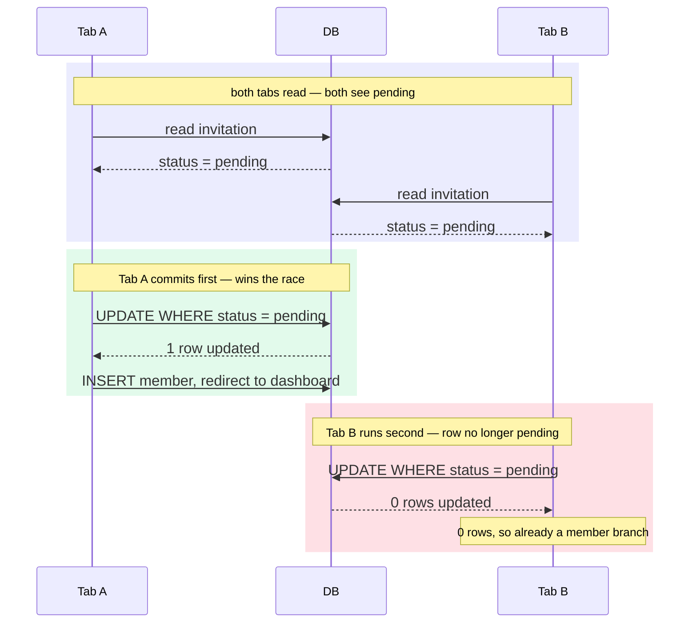

import Figure from '../../../components/figures/Figure.astro';
import Term from '../../../components/ui/Term.astro';
import CodeVariants from '../../../components/code/code-variants/CodeVariants.astro';
import CodeVariant from '../../../components/code/code-variants/CodeVariant.astro';
import StateMachineWalker from '../../../components/figures/state-machine-walker/StateMachineWalker.astro';
import Question from '../../../components/figures/state-machine-walker/Question.astro';
import Branch from '../../../components/figures/state-machine-walker/Branch.astro';
import Leaf from '../../../components/figures/state-machine-walker/Leaf.astro';
import Buckets from '../../../components/exercises/buckets/Buckets.astro';
import Bucket from '../../../components/exercises/buckets/Bucket.astro';
import Item from '../../../components/exercises/buckets/Item.astro';
import SeniorCallsTable from '../../../components/lessons/058/5/SeniorCallsTable.astro';
import ExternalResource from '../../../components/ui/ExternalResource.astro';
import { CardGrid } from '@astrojs/starlight/components';
import CourseProgressBar from '../../../components/ui/CourseProgressBar.astro';

<CourseProgressBar value={frontmatter['course-progress']} />

Alice invited Bob to Acme three weeks ago. Last week Alice left the company and her seat was removed. Today Bob finally clicks the link. Does it work?

Here's a second one. The invite landed in Bob's personal Gmail, but Bob signs into Acme with his work account. He clicks the link while signed in as `bob.personal@gmail.com`. Should that accept the seat that was offered to `bob@acme.com`?

And a third. Bob opens the link, the page is slow to load, so he opens it again in a second tab and clicks Accept in both within the same second. Two requests race for the same row. Does Bob end up a member once, twice, or with an error?

Over the last four lessons you built the invitation flow end to end: the table, the signed send, the four arrival shapes on the accept route, and the management surface. Every one of those lessons walked the happy path: the right person, the right email, one click, one row. That path is real, but in production it's the rare one. The three scenes above are not thought experiments. They are the support tickets that show up in month two, once real humans start forwarding emails, leaving companies, and double-clicking slow pages.

This lesson is mostly judgment, not code. You won't write new tables or new actions. You'll drop a guard here, a comparison there, and one precondition clause into flows you already have. The harder work is the reasoning: for each odd arrival, what's the senior call, and which layer of the system should enforce it? By the end you'll have a settled answer for each of these specific cases. More durably, you'll have three principles that let you reason about an invite edge case you've never seen before, which is the actual job, because production will always invent a new one.

## An invitation is the org's decision, frozen at send time

Start with the principle that resolves most of the cases below, because once it's in your head the rest follow almost mechanically.

When Alice invites `bob@acme.com` as `admin`, the row that gets written records a decision the organization made: "Acme offers this email a seat as `admin`, valid until `expiresAt`." Alice is the clerk who filed that decision, not its owner. The offer belongs to Acme.

That distinction matters. The invite's authority does not depend on Alice still being a member, still being an admin, or still being around at all. The `role` is snapshotted onto the row at send time and never recomputed. When Bob accepts, the accept flow reads `invitation.role` off that row; it does not go ask "what can Alice grant today?" The decision was made and recorded the moment the row was written, and everything afterward just executes it.

We'll apply this principle twice in the next two sections: once when the inviter has left the org, and once when the inviter has been demoted. The reuse is deliberate. Two cases that feel different, "the inviter is gone" and "the inviter lost power," are really the same case wearing different clothes, and the principle is what lets you see that.

:::note
Some products take the opposite posture: they treat an invite as the inviter's personal sponsorship and auto-revoke pending invites the moment the inviter leaves. That's a legitimate choice, just a different product decision with a different default. The next section works out why "the org's decision" is the better default in year one.
:::

## The orphan invite: the inviter left before the invitee accepted

Here is the principle applied to the first case. Alice invites Bob on day 1. Alice is removed from Acme on day 5. Bob clicks on day 6.

**The senior call: honor the invite.** Acme's offer outlives Alice's departure, so the accept flow proceeds exactly as it always does. Nothing in `acceptInvitation` checks whether the inviter is still a member, and that absence is correct, not an oversight. The row says Acme offered Bob a seat, and Alice leaving doesn't un-offer it.

Why is "honor it" the right default rather than "revoke it to be safe"? Because the two failure modes are not symmetric. If you block the invite, you've stopped a legitimate new hire from joining when they had every right to: Bob is left staring at a refusal screen for a seat that was genuinely his, and someone has to notice, investigate, and re-issue. If you honor it, the worst case is that Bob joins an org whose inviter has since left, which is exactly what happens with every normal hire whose recruiter later changes teams. A blocked legitimate join is a loud, expensive failure; a slightly stale sponsorship is a shrug. When the costs are this lopsided, you choose the cheap failure.

The audit trail still tells the true story, so honoring the invite costs you nothing in traceability. The `'invitation.sent'` row still names Alice as the actor: that history was frozen when she sent it and doesn't rewrite itself when she leaves. The `'invitation.accepted'` row names Bob. "Who invited Bob, and were they still here when he joined?" is answerable by reading those two rows side by side. The rows are tombstones: they record what happened, not what is currently true.

There's exactly one place the inviter's departure should change something, and it's cosmetic. The accept page can show "Invited by Alice" as a friendly touch, but only if Alice is still a member, which is a cheap existence read against `member`. If Alice is gone, you omit the line. The seat is still offered; you just don't name someone who is no longer there. Keep this split clear: a missing inviter changes the **copy**, never the **decision**.

The guard that decides whether to show the inviter line is one cosmetic conditional in the JSX, not a clause in the action.

<div data-mark-color="blue">

```tsx "inviterStillMember"
{inviterStillMember && <p>Invited by {inviterName}</p>}
```

</div>

:::caution
The alternative, auto-revoking pending invites whenever an inviter is removed, is defensible. The danger isn't picking it; it's picking it implicitly. Choose a posture and write it down, so the next engineer who reads "Bob's invite still worked after Alice left" knows it was a decision, not a bug.
:::

## The demoted inviter, and other state that moved under the invite

This is a quick companion to the orphan case, the same principle with a lighter touch. Here are two more arrangements where state shifted underneath an open invite, and in both the principle answers immediately.

**The inviter was demoted before accept.** Alice invited Bob as `admin` while she herself was an admin. Before Bob accepts, Alice gets demoted to `member`. Bob still becomes an `admin` on accept. The invite carries `role`, not `inviterRole`: Acme's snapshotted decision was "Bob gets admin," and Alice's later loss of power doesn't reach back and rewrite a decision that's already on the row. This is principle one again, unchanged; the only thing that moved is which attribute of the inviter changed.

**Cross-org independence.** Bob already owns "Bob Consulting," a separate org of his own, and he accepts Acme's invite as `member`. The accept writes one `member` row in Acme's tenant and switches his session's `activeOrganizationId` to Acme so the redirect lands him in the right place. His ownership of Bob Consulting is untouched: it lives in a different tenant entirely, and accepting an Acme seat never reaches across that boundary. The accept is a write in one tenant, not a multi-tenant operation, and the `tenantDb` scoping you set up in the organizations work is what keeps these two orgs from bleeding into each other.

Neither of these needed new reasoning, and that's the point. The principle is doing the work, and watching it absorb two more cases without strain is what tells you it'll hold for the next novel one you hit.

## The email mismatch: never bind an invite to the wrong account

Now the second principle, and the most security-critical edge in the lesson. This is also where we settle a debt: when you built the accept route's four arrival shapes, the "signed in as a different email" branch rendered only a refusal stub. Here we work out the full posture behind that refusal.

**The scene.** Alice invited `bob@acme.com`. Bob, signed in as `bob.personal@gmail.com`, forwarded the email to his personal inbox and clicked the link there. The session belongs to one identity; the invitation names another. Does this accept?

**The senior call: strict refusal, and no escape hatch.** The accept page detects that `session.user.email` does not equal `invitation.email` and renders the mismatch screen. The action refuses too, server-side: the contract you wrote already includes `user.email !== invitation.email → err('forbidden')`. Both layers earn their place. The page exists for UX, so Bob sees a clear explanation instead of a dead button. The action is the real gate, because the page render is only a suggestion and the write is what actually grants the seat.

Why so strict? Because the invitation's identity is the email address. The danger is in the friendly-sounding alternative: bind the invite to whatever account happens to be signed in. Picture where that goes. Alice invites a new contractor at `bob@acme.com`. Bob forwards the email to a colleague to ask "is this legit?" The colleague, signed into their own account, clicks the link, and an auto-bind would hand them an Acme seat that was never offered to them. The strict refusal is what stops that: a session whose email doesn't match the invited address gets turned away, no matter how it got the link. That failure class has a name, <Term definition="A class of bug where an action runs under the wrong identity's authority — e.g. the wrong user accepting a forwarded credential and inheriting access that was never granted to them.">privilege confusion</Term>, and it's the same reasoning behind the consent gate you built on the accept route: the click is not consent from the right party, so the click must not grant the seat.

Now sharpen the principle one notch, because email equality alone is not actually enough. Suppose an attacker pre-registers an account at the victim's address, `bob@acme.com`, but never verifies it. A naive string-equality gate would happily match that session against the invitation and let the attacker accept Bob's seat. The real predicate isn't "the session email string-matches the invited address," it's "the session belongs to a verified owner of the invited address." Two facts have to line up: the invite click proves the address is reachable, because the email arrived there, and email verification proves the session-holder actually owns it. This is why the accept path leans on both the unguessable 32-byte token from the send work and a verified-email check. The secret in the URL is the token, not the invitation `id`: a `uuidv7` is time-ordered and carries a timestamp, so it's an identifier, not a credential. Better Auth's organization plugin enforces exactly this for emailed invitations through a `requireEmailVerificationOnInvitation` switch that hardens the recipient endpoints against the pre-registered-unverified-account attack. You don't need to memorize the config; you need to remember the predicate is verified ownership, never bare equality.

:::danger
Do not add an "accept anyway" button to the mismatch screen because it feels friendlier. That button **is** the vulnerability. There is no benign version of "bind this invite to whatever account is signed in," and the entire defense is that you never offer that path. If you find yourself reaching for it to smooth a support ticket, you are about to build the exact hole this section exists to close.
:::

So what does the screen do, if not let Bob through? It tells him exactly how to fix it himself, out of band: "This invitation was sent to `bob@acme.com`. Sign out and sign in as `bob@acme.com` to accept, or ask Alice to re-invite your current email." Two concrete recoveries, neither of them an in-app shortcut. Note where the second one lands: "re-invite my current email" is not an edit to the existing row. Changing the target address is a brand-new offer to a different identity, so it routes through the revoke-and-resend you built on the management surface. A new email is a new invite, by definition.

### Comparing emails: lowercase to compare, original to display

One nuance hides inside the equality check, and it causes real bugs in production if you miss it. `Bob@Acme.com` and `bob@acme.com` are the same address. The local part can be case-sensitive in theory, but no real mail provider treats it that way, and your invitation was stored lowercased back when you built the schema (the `lower(email)` index) and the send action (the `.toLowerCase()` on input). So at compare time you have to lowercase the session side too, or a perfectly legitimate Bob whose account capitalizes his name gets bounced to the mismatch screen for no reason.

The following two variants show the trap and the fix.

<CodeVariants>
  <CodeVariant label="Naive">
    ```ts del={1}
    session.user.email === invitation.email
    ```
    **Breaks the instant either side carries different casing.** The invite display elsewhere preserves the user's original casing, so this will mismatch a real Bob whose account reads `Bob@Acme.com`.
  </CodeVariant>

  <CodeVariant label="Correct">
    ```ts ins={1}
    session.user.email.toLowerCase() === invitation.email
    ```
    **Only the session side needs `.toLowerCase()`.** `invitation.email` was already stored lowercased at rest, so lowering it again would be redundant; that's why the right side looks bare.
  </CodeVariant>
</CodeVariants>

The flip side: lowercase is an internal comparison key, never a presentation form. When you show the address back to Bob, on the mismatch screen, in the pending list, anywhere, display the original casing he or Alice typed. Users own how their email looks; the lowercased form is plumbing, and plumbing stays behind the wall.

## The double-click race: who wins when two tabs accept at once

The third principle finally explains a clause you've been planting without fully unpacking. Back when you wrote the accept action you added `WHERE status = 'pending'` to the update, and I told you it made the action idempotent. On the management surface you leaned on it again as "the guard." Now you get the full mechanical story.

**The scene.** Bob clicks Accept in two browser tabs within the same second. Each click fires its own `acceptInvitation` invocation: two separate requests, two separate transactions. Both enter the tenant scope, and both read the same row and see `status = 'pending'`. As far as each request can tell from its read, the seat is unclaimed and it's about to claim it.

If the read were the decision, both would insert a `member` row and you'd have a double-write: Bob a member twice, two audit rows, a mess. The read is not the decision. The write is, and the write carries the precondition:

<div data-mark-color="green">

```ts "eq(invitation.status, 'pending')"
const [updated] = await tx
  .update(invitation)
  .set({ status: 'accepted', acceptedAt: new Date() })
  .where(and(eq(invitation.id, id), eq(invitation.status, 'pending')))
  .returning();

if (!updated) return ok({ alreadyMember: true });
```

</div>

Here's what that buys you. Both transactions run the same `UPDATE … WHERE id = ? AND status = 'pending'`, but the database serializes them. The first to commit flips the status to `'accepted'` and matches its one row. When the second transaction's update runs, the row is no longer `pending`, so its `WHERE` matches **zero** rows, `updated` comes back empty, and instead of inserting a second `member` row the action falls into the `alreadyMember` branch. One write lands; the other discovers it lost the race and routes Bob to "you're already a member."

The following diagram makes the timing clearer, because this is the part prose always glosses over. Watch that both tabs read `pending` successfully, neither read is wrong, and yet only one write takes effect.

<Figure>

  <Fragment slot="caption">
    Both reads return `pending`, and neither is wrong, yet the `WHERE status = 'pending'` precondition lets only Tab A's `UPDATE` match a row. Tab B commits second, matches zero rows, and falls into the idempotent "already a member" landing instead of writing a second seat. (Unit 9)
  </Fragment>
</Figure>

This pattern has a name: <Term definition="A concurrency strategy that takes no lock up front. The write assumes the row is unchanged and a WHERE precondition verifies that assumption at commit time. If the row moved, the write matches zero rows and the caller handles the conflict.">optimistic concurrency</Term>. No lock is taken when the page loads. The write assumes the row is still in the state the page saw, and the `WHERE` clause verifies that assumption at the moment of mutation. The `status` column plays the role that a `version` number or an `updated_at` timestamp plays in the textbook optimistic-locking pattern: it's the field the write checks to find out whether the world moved underneath it. And it generalizes. Any time you need an "exactly-once" transition, such as accepting an invite once, charging a card once, or claiming a job off a queue once, this is the move. Read freely, but make the write assert the precondition it depends on.

Stated plainly, the principle is this: **never assume the row is still in the state the page render saw.** The render is a snapshot from a few milliseconds ago, and by the time a write fires, another request may have moved the row. The `WHERE` clause is the only source of truth at the instant of mutation, so the precondition belongs in the write, not in an `if` you checked after the read.

## Already a member: the invite that should never have been written

This case settles a debt from the management-surface lesson, which handled the collision between a new invite and an existing pending one. This is the other collision: a new invite against an existing membership.

**The scene.** Bob is already a member of Acme. Alice forgets, and invites `bob@acme.com` again.

**The senior call: refuse before writing the invite row.** The check belongs in the `sendInvitation` body, before the INSERT: if the invited email already belongs to a member of this org, don't write the invite at all, and return a refusal. One wrinkle the table shape forces on you is that `member` has no `email` column. The membership rows you built point at a `userId`, and the email lives on the `user` row, because the `member` and `invitation` tables are sequential, not joined, exactly as you set them up. So "is this email already a member?" resolves through the user: find the user by email, then check whether they hold a `member` row in this org.

There's a reconciliation worth flagging here. It's tempting to invent a code like `'already-member'`, but the canonical `Result` union has no such member; its codes are a fixed, deliberately small set. So this maps to `err('conflict', …)`, the same way the pending-collision case mapped its imagined `'already-invited'` down to `conflict`. You distinguish the two not by inventing a new code but by the message ("Bob is already a member of this organization") and by where the check fired. Carry the existing member's id or role in the message so the UI can deep-link Alice straight to Bob's row instead of leaving her confused.

Now the subtle part, which is the senior point of the whole section. On the management surface you were told the opposite rule: don't pre-check the unique constraint with a SELECT, but let the index throw and catch the error. Why is a pre-check right here and wrong there?

The difference is whether a constraint exists to catch. The pending-collision case is guarded by a real unique index on the `invitation` table, and the database itself enforces it. A `SELECT`-then-`INSERT` pre-check against that index has a race window, because two rapid requests can both SELECT "nothing there," then both INSERT. So you skip the pre-check, let the second INSERT hit the index, and catch the `23505` it throws. The already-member case has no such index. There's no unique constraint spanning the `member` and `invitation` tables, because they're separate tables, sequential rather than joined, by design. There is nothing to catch. So a cheap membership read in the action body is the right and only tool available.

The takeaway generalizes past invitations: **prefer the constraint when one exists; fall back to a guarded read only when the invariant spans tables a single index can't cover.** And be honest about the residual race in that fallback. A membership could theoretically be created in the sliver between your read and your invite INSERT. It's vanishingly rare and low-stakes, because the worst case is a redundant pending invite that the accept flow's own guards neutralize downstream, but you should know it's there. The guarded read is the right tool, not a perfect one, and that honesty is what separates "I picked this" from "I assumed this was airtight."

The two collisions look alike but live in different layers. The following contrast puts them side by side.

<CodeVariants>
  <CodeVariant label="Pending collision (recap)">
    ```ts {3-5}
    try {
      await tx.insert(invitation).values(values);
    } catch (e) {
      if (isUniqueViolation(e)) {
        return err('conflict', 'There is already a pending invite for this email.');
      }
      throw e;
    }
    ```
    **Layer: the DB unique index.** The constraint already exists, so you let the INSERT hit it and translate the `23505` it throws; pre-checking it would only add a race window. `isUniqueViolation` is the project's generic `23505` primitive. The management surface narrows on the constraint name too, but a recap doesn't need that precision.
  </CodeVariant>

  <CodeVariant label="Already a member (this lesson)">
    ```ts {1-6}
    const existingUser = await tx.query.user.findFirst({ where: eq(user.email, email) });
    const existing = existingUser
      ? await tx.query.member.findFirst({
          where: and(eq(member.organizationId, orgId), eq(member.userId, existingUser.id)),
        })
      : null;
    if (existing) return err('conflict', 'Bob is already a member of this organization.');
    ```
    **Layer: an action-body guard read.** No index spans `member` and `invitation`, and `member` keys on `userId` rather than email, so there's nothing to catch and the read has to resolve through `user`. A guarded read before the write is the only tool, residual race and all.
  </CodeVariant>
</CodeVariants>

## The link that can't resolve: expired, tampered, revoked, or its org is gone

This section consolidates several arrivals. A handful of "the link is unusable" cases all funnel to a refusal, and you already derived most of them on the accept route, framed there as the verify ladder. Here we look at them through the edge-case lens, and one of them, the deleted org, turns out to be structurally interesting.

**Expired click.** Bob clicks six weeks late; `expiresAt < now()`, so he lands on the dedicated expired screen: "this invite expired, ask for a new one." Senior call: do not put a "request a new invite" button on that page. Recovery is out of band, so Bob emails Alice, and Alice hits Resend on the management surface. The alternative, a self-serve "request to join" form, is a genuinely different feature with its own design questions, and it's out of scope here.

**Tampered or revoked link.** A forged signature, a missing row, and a token-hash mismatch all collapse to the one generic refusal you built on the accept route, so an attacker probing links learns nothing from the response. A `canceled` status forks to its own "this invite was revoked" copy, because that distinction helps the honest user more than it helps an attacker. The rule behind both, *differentiate a failure only when the distinction helps the user more than it helps the attacker*, was fully derived on the accept route. I'm only restating it so you recognize these cases as instances of it.

**The org was deleted before accept, the structural one.** Acme is deleted on day 5; Bob clicks on day 6. Watch what happens, because it's the payoff of the whole section. Back in the organizations work, `invitation.organizationId` was declared with `onDelete: 'cascade'`. So deleting Acme didn't leave Bob's invite dangling; it deleted the invitation row along with the org. By the time Bob clicks, `getInvitationById` finds nothing, and he lands on the same generic refusal as any missing row. There is **no special branch to write** for "the org was deleted." You never handle that case in application code, because the schema already handled it the instant the org was dropped.

That's the reflex worth internalizing: when a constraint upstream already guarantees an invariant, you don't write application code to re-check it. The cascade is enforced one layer down, in the DDL, so "org deleted" never reaches your action as a case to branch on. The cascade design itself belongs to the organizations work; here you only get to rely on it, and noticing that you can is exactly the senior move. Half of handling edge cases well is recognizing the ones a structural choice elsewhere has already handled for you.

## Reading a new edge case: the decision walk

Everything so far has been principles in prose. Now turn them into a procedure you can execute. The interactive below puts you in the position of the accept route and walks you through the questions in the order a senior asks them: validity, then freshness, then identity, then state, landing each path on a verdict. The order is the lesson. You refuse as early as possible and write as late as possible, and the only way to feel that is to walk it yourself.

Pick a branch at each step and follow it to its leaf.

<StateMachineWalker title="An invite click arrives — what does the accept route do?">
  <Question
    id="link-valid"
    prompt="Is the link cryptographically valid?"
    description="HMAC signature checks out, the row is found by id, and the token hash matches.">
    <Branch label="No — bad signature, missing row, or hash mismatch" to="leaf-refuse" />
    <Branch label="Yes" to="fresh" />
  </Question>

  <Question
    id="fresh"
    prompt="Is the invitation still live?"
    description="expiresAt is in the future and status is still pending.">
    <Branch label="Expired — expiresAt is in the past" to="leaf-expired" />
    <Branch label="Revoked — status = canceled" to="leaf-revoked" />
    <Branch label="Already accepted — status = accepted" to="leaf-already" />
    <Branch label="Live and pending" to="signed-in" />
  </Question>

  <Question id="signed-in" prompt="Is a user signed in?">
    <Branch label="No — but an account exists on the invited email" to="leaf-signin" />
    <Branch label="No — and no account exists yet" to="leaf-signup" />
    <Branch label="Yes — someone is signed in" to="email-match" />
  </Question>

  <Question
    id="email-match"
    prompt="Does the session email match the invited email?"
    description="Compared lowercased on the session side; the invited email is already stored lowercase.">
    <Branch label="No — they differ" to="leaf-mismatch" />
    <Branch label="Yes — they match" to="leaf-accept" />
  </Question>

  <Leaf id="leaf-refuse" verdict="Generic refusal">
    One screen for tamper, a missing row, and a hash mismatch alike. Never enumerate which one failed, or a prober learns from the difference.
  </Leaf>

  <Leaf id="leaf-expired" verdict="Expired screen">
    Recovery is out of band: Bob asks Alice to resend. No self-serve "request a new invite" button.
  </Leaf>

  <Leaf id="leaf-revoked" verdict="Revoked screen">
    An honest fork from the generic refusal: an admin canceled this invite, and saying so helps the honest user more than an attacker.
  </Leaf>

  <Leaf id="leaf-already" verdict="Already a member">
    An idempotent landing with a link to the dashboard. The losing tab of the double-click race ends right here.
  </Leaf>

  <Leaf id="leaf-signin" verdict="Sign in, then return to accept">
    Prefill the invited email and carry `next` back to the accept URL so the click resumes after sign-in.
  </Leaf>

  <Leaf id="leaf-signup" verdict="Sign up, email locked, then return">
    The email is prefilled and read-only so Bob can't sign up under the wrong address, then `next` returns him to accept.
  </Leaf>

  <Leaf id="leaf-mismatch" verdict="Strict refusal — no &lsquo;accept anyway&rsquo;">
    The privilege-confusion defense, and the most important leaf in the lesson: a session whose email doesn't match the invited address is turned away with no escape hatch.
  </Leaf>

  <Leaf id="leaf-accept" verdict="Render the Accept button — the only write path">
    The consent gate. The POST re-verifies every gate above, and the `WHERE status = 'pending'` precondition makes the write exactly-once.
  </Leaf>
</StateMachineWalker>

Notice the shape of that walk: validity before freshness before identity before match, with the refusals stacked at the front and the single write at the very back. That ordering isn't an accident of how the questions happened to fall; it's the whole disposition. Refuse as early and as cheaply as you can, and commit a write only once every prior gate has passed.

## Senior calls at a glance

One screen to recall the whole lesson. The third column is the one to read twice: it names the layer that enforces each call, the axis the lesson kept circling back to. Scatter these checks into the wrong layer and you get the classic beginner bugs: a `SELECT`-then-`if` where a `WHERE` clause belongs, or a UI-only guard where the server has to refuse.

<Figure>
  <SeniorCallsTable />
  <Fragment slot="caption">
    Read the third column twice. *Where the check lives* is the central axis this lesson kept circling: two of these refusals are enforced by the **database** (a `WHERE` precondition, a cascade), two by an **action-body guard** before any write, one by the **accept page** at render (the verify ladder, before any action runs), and two by **no check at all**, honored by the org's decision. Scatter a check into the wrong layer and you get the classic beginner bug. (Unit 9)
  </Fragment>
</Figure>

If you forget every specific row in that table, keep the three principles, because a novel invite edge case will almost always resolve to one of them. An invitation is **the org's decision, frozen at send time**, so the inviter leaving, being demoted, or losing the org doesn't reach back and rewrite it. The invitation's identity is **the email address, and you never silently rebind it** to a different account, so a mismatch is a strict refusal with no escape hatch. And at write time you **never trust the state the page render saw**, so the precondition rides on the `WHERE` clause, not on a stale read. When the next odd ticket lands in month two, you won't recognize it on sight, but you will recognize which of these three it's wearing.

## Where does the check live?

The hardest transferable idea in this lesson isn't what the senior call is; it's which layer enforces it. Sort each case below into the layer that actually does the enforcing.

<Buckets twoCol instructions="Sort each edge case into the layer that enforces the senior call — where the check actually lives.">
  <Bucket name="db" label="DB precondition / constraint" description="The database enforces it — a WHERE precondition, a unique index, or a cascade." />
  <Bucket name="action" label="Action-body guard" description="Code in the action checks it before writing." />
  <Bucket name="none" label="No check — structural or honored" description="Nothing checks it: it's honored by design or already guaranteed upstream." />

  <Item bucket="db">Two tabs accept the same invite at once</Item>
  <Item bucket="db">The org was deleted before the invitee clicked</Item>
  <Item bucket="db">Re-inviting an email that already has a pending invite</Item>
  <Item bucket="action">The session email differs from the invited email</Item>
  <Item bucket="action">Inviting an email that already belongs to a member</Item>
  <Item bucket="none">The inviter was removed from the org before the invitee accepted</Item>
  <Item bucket="none">The inviter was demoted before the invitee accepted</Item>
</Buckets>

The two cases in the third bucket are the ones beginners get wrong most often, because the instinct is that every edge case needs a guard somewhere. Some don't. "Honor it" and "a constraint upstream already guaranteed it" are real, correct answers, and recognizing when no application check is the right answer is as much a part of the skill as writing the check when one is needed.

## External resources

<CardGrid>
  <ExternalResource
    title="Organization plugin — invitations"
    href="https://better-auth.com/docs/plugins/organization"
    icon="simple-icons:betterauth"
    iconColor="#000000"
    description="The real config behind the verified-ownership predicate, including requireEmailVerificationOnInvitation."
  />
  <ExternalResource
    title="Optimistic Offline Lock"
    href="https://martinfowler.com/eaaCatalog/optimisticOfflineLock.html"
    icon="lucide:book-marked"
    iconColor="#2E7D32"
    description="Martin Fowler's canonical write-up of the pattern your WHERE-precondition is an instance of."
  />
  <ExternalResource
    title="PostgreSQL — Explicit Locking"
    href="https://www.postgresql.org/docs/current/explicit-locking.html"
    icon="simple-icons:postgresql"
    iconColor="#4169E1"
    description="The DB-level mechanisms — row locks, SELECT FOR UPDATE — that serialize the racing writes."
  />
  <ExternalResource
    title="OWASP — Broken Access Control"
    href="https://owasp.org/Top10/2021/A01_2021-Broken_Access_Control/"
    icon="simple-icons:owasp"
    iconColor="#000000"
    description="The industry framing for the privilege-confusion edge: why the email-mismatch refusal must be server-side."
  />
</CardGrid>
