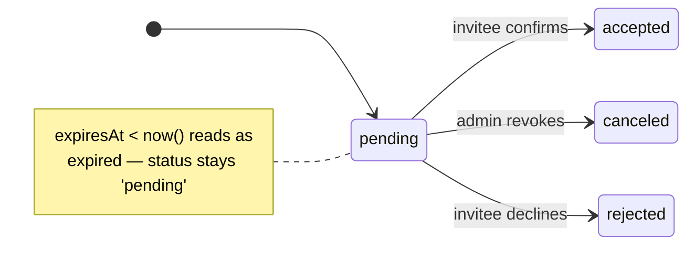

import { Aside, CardGrid } from '@astrojs/starlight/components';
import Figure from '../../../components/figures/Figure.astro';
import AnnotatedCode from '../../../components/code/annotated-code/AnnotatedCode.astro';
import AnnotatedStep from '../../../components/code/annotated-code/AnnotatedStep.astro';
import CodeVariants from '../../../components/code/code-variants/CodeVariants.astro';
import CodeVariant from '../../../components/code/code-variants/CodeVariant.astro';
import StateMachineWalker from '../../../components/figures/state-machine-walker/StateMachineWalker.astro';
import Question from '../../../components/figures/state-machine-walker/Question.astro';
import Branch from '../../../components/figures/state-machine-walker/Branch.astro';
import DrizzleSchemaCoding from '../../../components/live-coding/DrizzleSchemaCoding/DrizzleSchemaCoding.astro';
import ExternalResource from '../../../components/ui/ExternalResource.astro';
import Term from '../../../components/ui/Term.astro';
import CourseProgressBar from '../../../components/ui/CourseProgressBar.astro';
import TokenAtRest from '../../../components/lessons/058/1/TokenAtRest.astro';
import InvitationHandoff from '../../../components/lessons/058/1/InvitationHandoff.astro';
import VideoCallout from '../../../components/embeds/VideoCallout.astro';

<CourseProgressBar value={frontmatter['course-progress']} />

An admin opens your members page, types `bob@acme.com`, picks **Member**, and clicks invite. The catch: Bob does not exist yet. There is no `user` row with that email, no session, no record of him anywhere. He might accept in five minutes, in three days when the email surfaces, or never.

Everything else is in place: the organization plugin gives you `member` rows, `requireOrgUser()` hands you `{ user, orgId, role }`, and every mutation hits the audit log. What is missing is a row that survives that gap, holding the offer open across an unbounded stretch of time. It binds to an email address rather than a user who isn't there yet, and it carries the role the admin chose so the accept screen never has to ask. You will model that table, trace the states it moves through, and weigh its two security decisions: why the token is hashed before it touches the database, and why a single index stops Bob from collecting five duplicate invites.

## What an invitation row records

You already know what a `member` row means: this person is in this org, with this role, right now. An invitation row is a different kind of thing. It does not say Bob is in the org; it says you offered an email address a seat that nobody has claimed yet.

The everyday analogy is a restaurant reservation: it holds a table for a window of time, and the party might sit down, cancel, or never show. It resolves into a meal only if and when they act. An invitation has the same shape.

Three properties follow, and they shape the columns:

- It is bound to an **email address**, not a user. The invitee may have no account when the invite is created, so the email is the only handle you have on them.
- It carries the **role chosen at invite time**. The role is the inviter's decision, so capturing it on the row leaves Bob nothing to decide: the accept screen is a single button.
- It has a **lifetime**. A pending offer is not open forever; it expires.

## The shape Better Auth gives you, and the two columns you add

You do not author the `invitation` table from scratch. Better Auth's organization plugin already defines it, the same plugin that owns `organization` and `member`. Your job is to consume its columns and extend the table through the plugin's <Term definition="Better Auth's mechanism for adding your own columns to a table a plugin already owns. You declare the extra fields in the plugin config; the migration and the row type pick them up.">`additionalFields`</Term> mechanism. Reinventing the table would mean fighting the plugin's own queries; extending it keeps the plugin working and gives you your two extra columns.

The plugin owns eight columns:

- `id`: the primary key, a UUID.
- `organizationId`: which org the seat is in, a foreign key to `organization`.
- `email`: the invited address, the invitation's identity.
- `role`: the role to grant when the invite is accepted.
- `inviterId`: who sent it, a foreign key to `user.id`.
- `status`: where the row sits in its lifecycle.
- `createdAt`: when it was sent.
- `expiresAt`: when the offer lapses.

The plugin also defines a `teamId` column behind its teams feature, which this course doesn't enable, so you'll never see it populated.

To that you add two columns of your own:

- `tokenHash`: the <Term definition="The SHA-256 digest of the raw invitation token. The raw token lives only in the emailed URL; the database stores this hash, so a database read can't reconstruct a working accept link.">`tokenHash`</Term>, the SHA-256 of the secret token that goes in the invite link.
- `acceptedAt`: the moment the invite was accepted, nullable because a pending row has never been accepted.

The plugin owns identity, tenancy, and lifecycle state. It leaves two concerns to you, because they're application policy: how the token is stored at rest, and the instant of acceptance. Why the token hashing is non-negotiable comes later in this lesson.

<AnnotatedCode lang="ts" maxLines={18} code={`
export const invitation = pgTable(
  'invitation',
  {
    id: uuid('id').primaryKey().$defaultFn(() => uuidv7()),
    organizationId: uuid('organization_id')
      .notNull()
      .references(() => organization.id, { onDelete: 'cascade' }),
    email: text('email').notNull(),
    role: text('role').notNull(),
    inviterId: uuid('inviter_id')
      .notNull()
      .references(() => user.id, { onDelete: 'cascade' }),
    status: text('status').notNull().default('pending'),
    createdAt: timestamp('created_at', { withTimezone: true })
      .notNull()
      .defaultNow(),
    expiresAt: timestamp('expires_at', { withTimezone: true }).notNull(),
    tokenHash: text('token_hash').notNull(), // added
    acceptedAt: timestamp('accepted_at', { withTimezone: true }), // added
  },
  (t) => [
    uniqueIndex('invitation_org_email_pending_unique')
      .on(t.organizationId, lower(t.email))
      .where(sql\`\${t.status} = 'pending'\`),
  ],
);
`}>
  <AnnotatedStep meta="{4} {5-7} {10-12}" color="blue">
    Identity plus the two foreign keys: a UUIDv7 primary key, the `organizationId` the seat lives in, and the `inviterId` who sent it. `onDelete: 'cascade'` on `organizationId` means deleting an org takes its open invitations with it, the same cascade you used on the org skeleton. The "accept after the org was deleted" edge case later in the chapter relies on it.
  </AnnotatedStep>

  <AnnotatedStep meta="{8-9}" color="violet">
    The invitation's identity value and the captured role. `email` is the handle on a person who may have no account at all; `role` is the inviter's decision, frozen onto the row so the accept screen asks nothing.
  </AnnotatedStep>

  <AnnotatedStep meta="{13-17}" color="orange">
    The three lifecycle columns the plugin owns: `status` is where the row sits, `createdAt` is when it was created, `expiresAt` is when it lapses. The next two sections give the lifecycle and the expiry their full weight.
  </AnnotatedStep>

  <AnnotatedStep meta="{18-19}" color="green">
    Your two additions, marked `// added`. `tokenHash` stores the SHA-256 of the secret in the link, never the secret itself; `acceptedAt` is nullable because a pending row has never been accepted.
  </AnnotatedStep>

  <AnnotatedStep meta="{22-24}" color="blue">
    The duplicate-pending guard: at most one pending invite per `(org, email)`, declared as a partial unique index in the table's second-arg callback. It gets its own section near the end; for now, just note that it lives in the table definition.
  </AnnotatedStep>
</AnnotatedCode>

`role` and `status` are typed as plain `text`, but each holds a small, fixed set of legal values. The next two sections lock them down, because a typo in a status string is the kind of bug that fails silently in production.

:::note
`additionalFields` on a plugin-owned table has a rough edge. The columns work at the database layer: the migration adds them and your Drizzle table sees them. But as of early 2026, Better Auth's generated `auth.api.*` types don't always surface added fields cleanly, a known type-inference bug. It costs you nothing here, because the data-layer convention treats your Drizzle table as the source of truth: you read and write `tokenHash` through `typeof invitation.$inferSelect`, not through the plugin's inferred API types. Just don't expect the plugin's API surface to know about your columns.
:::

### Constrain status to its four values

The `status` column is one of exactly four strings: `pending`, `accepted`, `rejected`, or `canceled`. Leaving it as open `text` means a typo like `'penidng'` slips in and fails silently: the row never matches your `status = 'pending'` filters, and you spend an afternoon wondering why an invite vanished.

The fix is to make bad values fail loudly, at the database. The course bans TypeScript's `enum`, so you keep the legal set as a string-literal union on the TS side and enforce it with a `CHECK` constraint on the column. Both derive from one `as const` list:

```ts title="src/db/schema/invitation.ts"
export const INVITATION_STATUSES = [
  'pending',
  'accepted',
  'rejected',
  'canceled',
] as const;

export type InvitationStatus = (typeof INVITATION_STATUSES)[number];

// in the table's second-arg callback, alongside the unique index:
check(
  'invitation_status_check',
  sql`${t.status} IN ('pending', 'accepted', 'rejected', 'canceled')`,
)
```

The TypeScript side stays a clean string-literal union, and the database physically rejects any other value on insert or update. Of the four, `rejected` is the rare one, the invitee actively declining, which barely happens in B2B; this chapter hardly touches it. The other three carry the whole flow.

### The role is captured here, and `'owner'` is refused

The `role` column is a decision record. The role an invite carries is the inviter's privileged choice, captured at invite time so the accept screen stays trivial: the accept flow writes `member.role = invitation.role` and never re-prompts.

The legal domain for an invited role is narrower than the full member role set. `'owner'` is excluded: an organization has exactly one owner, and transferring ownership is its own deliberate flow, never something you grant by sending an invite. So at invite time, `role` is one of two values, `'admin'` or `'member'`.

This is defense in depth. The invite form disables the owner option in the dropdown, but the UI is not where you enforce a security boundary, because someone can always craft a request that skips the form. The real enforcement lands in the next lesson, where the send action's Zod schema validates `role` as `z.enum(['admin', 'member'])` and refuses anything else before the row is written.

## Pending, three terminal states, and no stored `expired`

An invitation row moves through a tiny state machine, and getting its shape right protects you from the most common mistake people make with this table.

A row is born `pending`: created, with the email about to go out. From there it transitions exactly once, into a terminal state, and it's done:

- `accepted`: the invitee clicked the link and confirmed. A `member` row now exists.
- `canceled`: an admin revoked the invite before anyone accepted.
- `rejected`: the invitee declined, which is rare in B2B.

One starting state, three terminal states, a single transition. The lesson is in the word you *expect* to see here and won't find.

**`expired` is not a stored status.** No row ever holds `status = 'expired'`. Expiry is computed at read time: a row is expired when `expiresAt < now()`, while its status column still says `pending`. The instinct is to reach for a cron job that scans for `pending` rows past their expiry and flips them to `'expired'`. Resist it. That job is a moving part that can fall behind or fail, and a second source of truth competing with the column. The real source of truth is the read path: every query that cares filters on `status = 'pending' AND expiresAt > now()`. Expired-but-still-`pending` rows accumulate harmlessly because they never match, and a retention job (at the end of this lesson) deletes the old ones in batch. The filter does the work; nothing marks a row expired.

Click through each state to see what it means and what the accept flow does when it lands on a row in that state.

<StateMachineWalker kind="machine" title="The invitation lifecycle">
  <Figure slot="diagram">



  </Figure>

  <Question id="pending" prompt="pending — the offer is open"
    description="The row was created and the email is going out. This is the only non-terminal state. A pending row past its expiresAt reads as expired everywhere it's queried, but the status column never changes, because expiry is computed, not stored.">
    <Branch label="Invitee clicks and confirms" to="accepted" rationale="The accept flow writes acceptedAt and inserts a member row." />
    <Branch label="Admin revokes it" to="canceled" rationale="A pending offer pulled before anyone acted on it." />
    <Branch label="Invitee declines" to="rejected" rationale="The invitee actively says no, which is rare in B2B." />
  </Question>

  <Question id="accepted" prompt="accepted — terminal"
    description="acceptedAt is stamped and a member row now exists. Reopening the accept page on this row sees the accepted status and renders a friendly 'you're already a member', with a link into the org. No further transitions.">
  </Question>

  <Question id="canceled" prompt="canceled — terminal"
    description="An admin revoked the invite before it was accepted. Opening the accept link now renders 'this invite was revoked'. No further transitions.">
  </Question>

  <Question id="rejected" prompt="rejected — terminal"
    description="The invitee declined. This is rare in B2B; it exists in the set but the chapter barely touches it. No further transitions.">
  </Question>
</StateMachineWalker>

The diagram makes the key point visible: expired sits outside the node set, as a note on `pending`, not a box of its own. Expired is a lens you look through at read time, never a transition the row takes.

## Set the invitation expiry to seven days

A pending invite stays valid for a fixed window. Start from the platform default and justify any move away from it.

Better Auth defaults invitation expiry to **48 hours**, set through the plugin's `invitationExpiresIn` option, in seconds. That is tight for a year-one SaaS: an invite sent Friday afternoon is dead by Sunday, before the recipient is back at their desk. Override it to **seven days**, long enough that "I'll deal with it Monday" survives the weekend, short enough that a forwarded or leaked invite email does not still open a live door into your org months later.

Expiry is not a UX knob you tune for conversion. It is a *security primitive* that bounds the blast radius of a leaked link in time. So the value does not sit as a bare literal in your plugin config; it lives in a named constant, with one place to change it and a name that states its purpose.

<div data-mark-color="green">

```ts title="src/lib/auth.ts" "INVITATION_TTL_SECONDS"
const INVITATION_TTL_SECONDS = 60 * 60 * 24 * 7; // 7 days

// in the organization() plugin config:
organization({ invitationExpiresIn: INVITATION_TTL_SECONDS });
```

</div>

Two consequences follow from treating expiry as a hard contract:

- **Resending an expired invite mints a new row**, with a new token and a fresh seven-day window; it never extends the old one. You replace an expired invite, you don't revive it. You build that rotation later in the chapter.
- **The accept path enforces `expiresAt > now()`** as a precondition on the lookup. The column is the contract; the read is where it's honored.

## Why the token is hashed at rest

This is the security heart of the lesson, so reason about it as a threat model.

**Start with what the token is.** Bob has no account, no password, no session. When he clicks the link in his inbox, the only thing that proves "this invite is mine, let me in" is the secret string in the URL, the token. That makes it a <Term definition="A credential where possession alone grants access — no separate identity check. Whoever holds a valid bearer token is treated as authorized, which is why the token must be unguessable and must not leak.">bearer token</Term>: possession *is* authorization. Two requirements follow: it must be impossible to guess, and it must not leak.

**Decision A: make it unguessable.** The token is 32 bytes from `crypto.getRandomValues(new Uint8Array(32))`, then <Term definition="URL-safe Base64. Replaces the standard alphabet's '+' and '/' with '-' and '_' and drops '=' padding, so the string is safe to drop straight into a URL.">base64url</Term>-encoded into a 43-character string. That is 256 bits of entropy, far past anything guessable. Why not `crypto.randomUUID()`, also unguessable at 122 bits? A UUID is an identifier format, so it *means* something, and a bearer token should be opaque, pure random bytes with no semantics to lean on. `Math.random()` is disqualified outright: it isn't cryptographically secure, so its output is guessable.

**Decision B: hash it before it touches the database.** The *raw* token goes to exactly one place, the URL in the email that reaches Bob; the database never sees it. What the database stores is `sha256(token)`, in the `tokenHash` column.

<Figure>
  <TokenAtRest />
  <Fragment slot="caption">
    One secret, two trust zones. The *raw* token travels only the amber path, into the emailed URL and Bob's inbox, the one live copy outside server memory. The green path stores **only** `sha256(token)` in `invitation.tokenHash`.
  </Fragment>
</Figure>

Now name the threat. Suppose an attacker gets **read access** to your `invitation` table, through a leaked backup, a SQL-injection bug on a read path, or an insider with a query console. They get only hashes, and because <Term definition="A fast, one-way cryptographic hash. Easy to compute token → digest; computationally infeasible to reverse digest → token.">SHA-256</Term> is one-way, a hash cannot be turned back into the token. They cannot forge a working accept URL, because that needs the raw token and the raw token isn't there. The blast radius of a database read shrinks from "every pending invite is compromised" to "nothing useful."

This is the same posture as password hashing, raw secret in, hash stored, with one deliberate difference. Passwords get a *slow* hash (bcrypt, argon2) on purpose: humans pick weak, low-entropy passwords, and a slow hash makes offline brute-force expensive. An invitation token is the opposite case: 256 bits of uniform randomness with no structure to brute-force, and throwaway, valid for seven days. There is nothing for a slow hash to defend, so SHA-256, a *fast* hash, is exactly right, and reaching for bcrypt would buy you nothing. Match the tool to the threat.

<VideoCallout videoId="zt8Cocdy15c" videoTitle="System Design: How to store passwords in the database?">
  ByteByteGo's 4-minute take on why secrets are hashed before they hit the database, and why the slow-vs-fast hash distinction this section just drew is the whole game.
</VideoCallout>

One more property follows from the design. The accept path looks invitations up *by* `tokenHash`: it hashes the incoming raw token and queries for the matching row. That lookup needs `tokenHash` to be **indexed**, or every accept click is a full table scan. A plain, non-unique index is enough, since two distinct 256-bit tokens colliding on one hash is too improbable to model, so the index is there for speed, not uniqueness.

Token generation and hashing happen in the send action, in the next lesson. This lesson establishes the *posture*, raw token in the URL and hash in the database, plus the column that holds the hash.

## One pending invite per address: the partial unique index

The business rule: at most one *pending* invitation per `(organization, email)` pair. Alice shouldn't be able to fire off five pending invites to Bob, because that's five emails, five live tokens, and one confused recipient.

The wrong way to enforce it lives in application code: `SELECT` to check for an existing pending invite, then `INSERT` if none. That has a race window. Two rapid submits, from a double-click or two tabs, both run the `SELECT`, both see nothing, and both `INSERT`. The duplicate lands anyway, because the check and the write aren't atomic, and the gap between them is exactly where the bug lives.

Encode the rule as a **database invariant** instead, a constraint the database enforces atomically, so the duplicate `INSERT` is rejected no matter how the requests interleave. The tool is a *partial* unique index:

```sql
CREATE UNIQUE INDEX invitation_org_email_pending_unique
  ON invitation (organization_id, lower(email))
  WHERE status = 'pending';
```

Two refinements are doing the work:

- **`lower(email)`** normalizes case. `Bob@Acme.com` and `bob@acme.com` are the *same address*, so the index keys on the lowercased form and they collide as they should. This is the same store-and-compare-lowercased discipline the send action's `.toLowerCase()` and the accept flow's mismatch check rely on.
- **`WHERE status = 'pending'`** is what makes the index *partial*: only pending rows participate in the uniqueness check, while accepted, canceled, and expired rows are invisible to it. So Bob can keep an accepted row from when he joined last year *and* a fresh pending row when you re-invite him after he left. A plain unique on `(org, email)` would block that legitimate re-invite; the partial unique allows it and blocks only a genuine duplicate pending.

<VideoCallout videoId="WL2NXQmUOC0" videoTitle="Partial Indexing | The Backend Engineering Show">
  Hussein Nasser spends 18 minutes on partial indexes, building to the exact `status`-filtered example this section uses. Watch it if you want the storage and write-cost reasons behind the technique.
</VideoCallout>

Now the part you have to get *exactly* right. Translating that index to Drizzle has two footguns, and the first produces an index that looks correct but silently emits broken DDL.

<CodeVariants>
  <CodeVariant label="Looks right — broken DDL">
    <div data-mark-color="red">

    ```ts {9}
    import { sql, eq } from 'drizzle-orm';
    import type { AnyPgColumn } from 'drizzle-orm/pg-core';

    const lower = (col: AnyPgColumn) => sql`lower(${col})`;

    // in the table's second-arg callback:
    uniqueIndex('invitation_org_email_pending_unique')
      .on(t.organizationId, lower(t.email))
      .where(eq(t.status, 'pending'));
    ```

    </div>
    **Compiles, ships broken DDL.** `eq()` emits a parameterized placeholder (`$1`) into the index's `WHERE`, and a partial index predicate can't be a bound parameter, so Postgres rejects or mis-builds it. The bug hides because the TypeScript is perfectly valid; it surfaces only at migration time, or worse, as an index that doesn't constrain what you think.
  </CodeVariant>

  <CodeVariant label="Correct">
    <div data-mark-color="green">

    ```ts {9}
    import { sql } from 'drizzle-orm';
    import type { AnyPgColumn } from 'drizzle-orm/pg-core';

    const lower = (col: AnyPgColumn) => sql`lower(${col})`;

    // in the table's second-arg callback:
    uniqueIndex('invitation_org_email_pending_unique')
      .on(t.organizationId, lower(t.email))
      .where(sql`${t.status} = 'pending'`);
    ```

    </div>
    **Emits the literal predicate.** A `sql` template literal writes `WHERE status = 'pending'` verbatim into the index DDL, with no placeholder. This is the form that produces a valid partial index. The second footgun is `lower()` itself: Drizzle has no built-in `lower`, so you hand-write the ``sql`lower(${col})` `` helper shown at the top of both tabs.
  </CodeVariant>
</CodeVariants>

The takeaway is narrow: in a partial index's `.where()`, use a `sql` template literal, never `eq()`. The `eq()` version type-checks and looks idiomatic, which is exactly why it's dangerous; it fails where you're not looking.

What does the constraint buy you downstream? When an admin re-invites an address that already has a pending invite, the `INSERT` fails, at the database, atomically, with no race. The send action catches that specific constraint error and turns it into a clean `'already-invited'` result, which the UI renders as a "Bob already has a pending invite, resend or revoke?" prompt. You'll build that catch-and-translate later in the chapter; the point now is that **this index *is* the source of that signal.** The "already invited" UX exists because the database refused a duplicate, not because some application code remembered to check.

Now make the constraint fire yourself. The exercise below gives you the `organization` and `invitation` tables with the partial unique index missing. Add it so the duplicate-pending insert is rejected while cross-org and post-cancel re-invites still go through.

<DrizzleSchemaCoding
  instructions="Add a partial unique index named invitation_org_email_pending_unique on (organization_id, lower(email)) where status = 'pending', so a second pending invite to the same email in the same org is rejected — while cross-org invites and re-invites after a cancel still go through. Two footguns: lower() has no Drizzle built-in, so hand-write the sql`lower(${col})` helper; and the .where() must be a sql template literal, never eq() (eq emits a bound placeholder that breaks the index DDL)."
  starter={`import { sql } from 'drizzle-orm';
import type { AnyPgColumn } from 'drizzle-orm/pg-core';

// Drizzle has no built-in lower() — write the helper:
const lower = (col: AnyPgColumn) => sql\`lower(\${col})\`;

export const organization = pgTable('organization', {
  id: integer('id').primaryKey(),
  name: text('name').notNull(),
});

export const invitation = pgTable(
  'invitation',
  {
    id: integer('id').primaryKey(),
    organizationId: integer('organization_id')
      .notNull()
      .references(() => organization.id),
    email: text('email').notNull(),
    status: text('status').notNull().default('pending'),
  },
  (t) => [
    // Add the partial unique index here.
  ],
);`}
  requirements={[
    {
      name: 'invitation',
      columns: [
        { name: 'id', type: 'integer', primaryKey: true },
        { name: 'organization_id', type: 'integer', notNull: true,
          references: { table: 'organization', column: 'id' } },
        { name: 'email', type: 'text', notNull: true },
        { name: 'status', type: 'text', notNull: true },
      ],
    },
  ]}
  seedSQL={`INSERT INTO organization (id, name) VALUES (1, 'Acme'), (2, 'Globex');`}
  probes={[
    {
      description: "The same email can have a pending invite in two different orgs",
      sql: `INSERT INTO invitation (id, organization_id, email, status) VALUES
        (1, 1, 'alice@acme.com', 'pending'),
        (2, 2, 'alice@acme.com', 'pending');`,
      mustSucceed: true,
    },
    {
      description: "A second pending invite to the same email in the same org is rejected",
      sql: `INSERT INTO invitation (id, organization_id, email, status) VALUES
        (10, 1, 'bob@acme.com', 'pending'),
        (11, 1, 'Bob@Acme.com', 'pending');`,
      mustSucceed: false,
    },
    {
      description: "A re-invite is allowed when an earlier invite to the same address was canceled",
      sql: `INSERT INTO invitation (id, organization_id, email, status) VALUES
        (20, 1, 'carol@acme.com', 'canceled'),
        (21, 1, 'carol@acme.com', 'pending');`,
      mustSucceed: true,
    },
  ]}
/>

If you got the third probe to pass, you've seen exactly why the index is partial: the canceled row is invisible to the constraint, so the re-invite slides through.

## Two writes on accept, with no foreign key between them

When Bob accepts, two writes happen. The `invitation` row flips to `accepted` and gets its `acceptedAt` stamp, and a new `member` row is inserted with `role = invitation.role`. Anyone who has learned database normalization will want to *connect* them with a `memberId` foreign key on `invitation` pointing at the member it produced. Don't.

These two tables are **sequential in time, not foreign-keyed to each other.** The invitation isn't a parent of the member, it's its predecessor: the invitation's job ends at acceptance, the member's begins. What links them historically is the audit log. The `'invitation.accepted'` event you write carries the new `memberId` in its payload, so if you ever need to answer "which invite produced this membership," the audit trail has it.

<Figure>
  <InvitationHandoff />
  <Fragment slot="caption">
    No foreign key joins the two rows. The audit log's `invitation.accepted` event, whose payload carries the new `memberId`, is what records which invite produced which membership.
  </Fragment>
</Figure>

Note what *doesn't* happen on accept: the invitation row is not deleted. The status flip is its only write. An admin will eventually ask "was Bob ever invited, and when did he accept?", and the answer is right there in the row. Rows are cheap, and the answer can't be reconstructed once it's gone.

Rows do accumulate, so there's a retention story. Accepted rows stay forever, since the audit log references them and they're the historical record. But `canceled` rows and `pending`-past-expiry rows pile up with no further use. A single retention job (background-jobs territory, much later in the course) batch-*deletes* those terminal and stale rows once they're older than roughly 90 days. No job ever *marks* a row expired, because the read filter handles that; a job only deletes the old dead rows.

## Why this schema doesn't track seat count

:::note
Some products gate invites on seat count: "you have 2 of 5 seats left; this invite uses one." This schema tracks no seat count, on purpose. Seat counting is entitlements territory, which the course reaches when it wires up Stripe. That check, `entitlements.canInviteMember(orgId)`, runs in the *action body before* the invite is written, never as a column here. The invitation table models the reservation; the entitlement check decides whether you're *allowed* to make one.
:::

## External resources

The references that ground this lesson, the plugin that owns the table, the index shape you hand-built, the case-insensitive email discipline, and the security posture behind the hashed token, are worth a bookmark rather than a full read.

<CardGrid>
  <ExternalResource
    title="Better Auth — Organization plugin"
    href="https://better-auth.com/docs/plugins/organization"
    icon="simple-icons:betterauth"
    description="Source of truth for the plugin-owned invitation columns and the invitationExpiresIn option."
  />
  <ExternalResource
    title="OWASP — Forgot Password Cheat Sheet"
    href="https://cheatsheetseries.owasp.org/cheatsheets/Forgot_Password_Cheat_Sheet.html"
    icon="simple-icons:owasp"
    iconColor="#1A2E48"
    description="The security spine behind the token: CSPRNG generation, entropy, hashing at rest, and expiry."
  />
  <ExternalResource
    title="Drizzle ORM — Indexes & constraints"
    href="https://orm.drizzle.team/docs/indexes-constraints"
    icon="simple-icons:drizzle"
    iconColor="#C5F74F"
    description="Partial unique indexes and the sql-template predicate shape this lesson's index needs."
  />
  <ExternalResource
    title="Drizzle ORM — Case-insensitive email"
    href="https://orm.drizzle.team/docs/guides/unique-case-insensitive-email"
    icon="simple-icons:drizzle"
    iconColor="#C5F74F"
    description="The exact lower(email) unique-index pattern behind the store-and-compare-lowercased discipline."
  />
</CardGrid>
