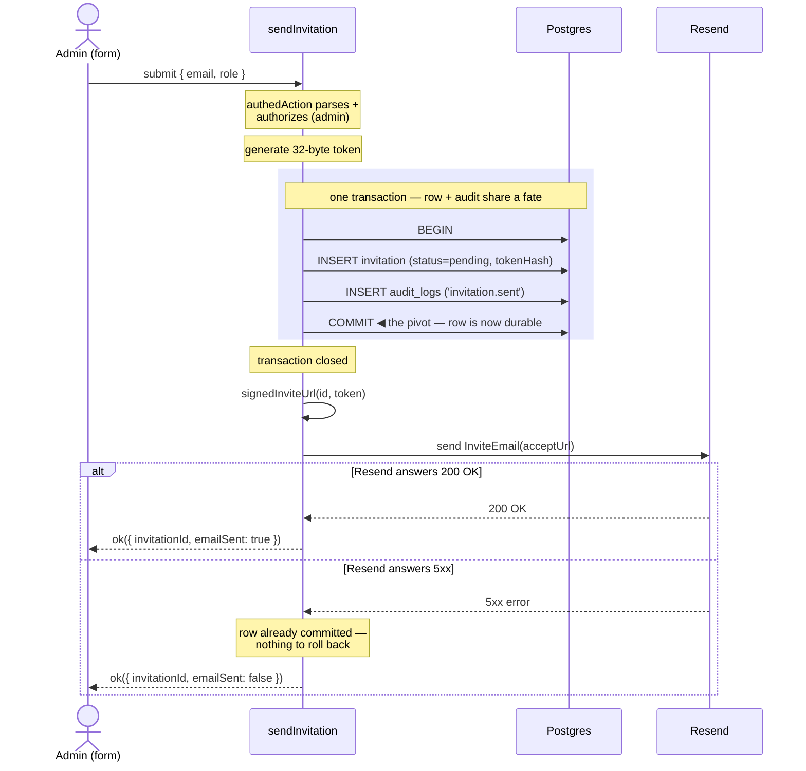

import { CardGrid } from '@astrojs/starlight/components';
import Figure from '../../../components/figures/Figure.astro';
import AnnotatedCode from '../../../components/code/annotated-code/AnnotatedCode.astro';
import AnnotatedStep from '../../../components/code/annotated-code/AnnotatedStep.astro';
import CodeVariants from '../../../components/code/code-variants/CodeVariants.astro';
import CodeVariant from '../../../components/code/code-variants/CodeVariant.astro';
import CodeTooltips from '../../../components/code/CodeTooltips.astro';
import ScriptCoding from '../../../components/live-coding/ScriptCoding/ScriptCoding.astro';
import ExternalResource from '../../../components/ui/ExternalResource.astro';
import Term from '../../../components/ui/Term.astro';
import CourseProgressBar from '../../../components/ui/CourseProgressBar.astro';
import TokenTrustBoundaries from '../../../components/lessons/058/2/TokenTrustBoundaries.astro';
import SignedUrlAnatomy from '../../../components/lessons/058/2/SignedUrlAnatomy.astro';

<CourseProgressBar value={frontmatter['course-progress']} />

Alice opens the members page, types `bob@acme.com`, picks **Member** from the role dropdown, and clicks **Send invite**.
The last lesson built the row this click creates: the `invitation` table, with its `tokenHash` column, pending status, and seven-day `expiresAt`.
What's missing is the code that fills that row in and gets a clickable link into Bob's mailbox.

That click owes a short chain of work.
Mint a random token, hash it, and write a pending row.
Build a URL Bob can click from his inbox, sign it so junk requests reject fast, and mail it.
Do all of that without leaking the raw token into your server logs, and without leaving a half-built mess behind if Resend hiccups mid-send.

You already have the pieces this assembles from.
`authedAction` lifts the session, the role check, and the schema parse out of the body.
`withTenant` opens a tenant-scoped transaction.
`logAudit` writes the audit row inside it.
`sendEmail` is the Resend wrapper from the email unit.
This lesson turns those four into a single send path: one Server Action, `sendInvitation`, built end to end, plus a small helper underneath it called `signedInviteUrl`.

A pending invitation is a bearer credential you are mailing to a stranger, so build it like one.
That idea frames every decision ahead.

## The accept link is a bearer credential

Whoever holds the accept URL can join the org.
Not "whoever is logged in as Bob," but whoever holds the link: the URL itself is the proof of identity.
That makes it a <Term definition="A credential where possession alone grants access — no further identity proof. Whoever holds it is treated as authorized.">bearer token</Term>.
For the seven days it lives, the raw token inside that URL is as sensitive as a password.

It differs from a password in one way you settled last lesson.
A password is long-lived and human-chosen, so it earns a deliberately slow hash.
This token is high-entropy and throwaway, 32 random bytes with a seven-day window, so a fast hash is correct, which is why the database stores `sha256(token)` rather than a bcrypt or argon digest.
Generating the token it hashes is this lesson's job.

If the raw token is that sensitive, the design comes down to one question: **where is it allowed to exist?**
Outside server memory there are exactly three places it could appear, each with a verdict.

<Figure caption="One secret, three trust boundaries. The database keeps only sha256(token); the logger redacts the token and sig params. The raw token leaves server memory exactly once, into the email.">
  <TokenTrustBoundaries />
</Figure>

The **database** never sees the raw token, only its hash, the posture you built last lesson.
**Server logs and Sentry breadcrumbs** never see it either: the `token` and `sig` query params get redacted at the logger before any line is written, the same way `password` and `authorization` already are.
That redaction rule lives in the logger config, not at your call sites, so state it here and leave the pino wiring for later.

The **email body** is the deliberate exception.
The inbox is the credential's destination: the whole point of the flow is to deliver this secret to the person who can use it.
So the raw token belongs there, in the URL, and nowhere else.
One secret, three boundaries, one legitimate exit.

### Why you're writing this yourself

Better Auth's organization plugin already owns the `invitation` table and ships `inviteMember` and `acceptInvitation` APIs.
So why hand-roll a send path?

Because the plugin's default credential is the invitation's id, a value the rest of your system treats as a non-secret database key, and its mail path isn't yours to instrument.
You can't slot in your audit row, sign the URL, or control where the secret appears.
The experienced move is to keep the plugin's table shape, which you did last lesson, and write the send by hand, so the random token, the hash at rest, the HMAC signature, and the audit row all live in code you own.

## Thirty-two random bytes, encoded for a URL

The credential starts as randomness.
Get the generation right and everything downstream is mechanical; get it subtly wrong and you've shipped a guessable token that no amount of hashing or signing can save.
It takes two lines: ask the platform's cryptographic random source for 32 bytes, then encode them into something safe to drop in a URL.

<div data-mark-color="blue">

<CodeTooltips tooltips={{
  getRandomValues: 'Fills a typed array with cryptographically-strong random values. The CSPRNG behind every token in this stack — unguessable, unlike Math.random().',
  base64url: 'URL-safe Base64: - and _ instead of + and /, and no = padding. 32 bytes become 43 characters you can drop straight into a query string, no escaping.',
}}>
```ts "getRandomValues" "base64url"
const rawBytes = crypto.getRandomValues(new Uint8Array(32));
const rawToken = Buffer.from(rawBytes).toString('base64url');
```
</CodeTooltips>

</div>

`crypto.getRandomValues(new Uint8Array(32))` fills a 32-byte array from the platform's <Term definition="Cryptographically-Secure Pseudo-Random Number Generator. Its output is unpredictable even to someone who has seen previous outputs — the property a credential needs and Math.random() lacks.">CSPRNG</Term>: 256 bits of entropy.
Thirty-two is the number to remember: comfortably more than any attacker could search, and a clean match for the 256-bit output of the SHA-256 you'll hash it with.

Raw bytes aren't URL-safe, so you encode them.
`Buffer.from(rawBytes).toString('base64url')` gives a 43-character string in the URL-safe Base64 alphabet: `-` and `_` instead of `+` and `/`, and no trailing `=` padding.
That's why you pick `base64url` over plain `base64` — nothing in it needs escaping inside a query string.
The result is one high-entropy string: it gets hashed into `tokenHash`, goes into the URL, and is discarded once the email is sent.

Two choices here are wrong, and an experienced engineer spots both on sight.
`Math.random()` is not cryptographically secure — its output is predictable to anyone who models it, which disqualifies it as the source of a credential. See it feeding a token and that's a finding.
`crypto.randomUUID()` is subtler: a v4 UUID carries 122 bits of entropy, plenty to be unguessable, so it isn't a security hole.
But a UUID is an identity-shaped value, and using one as a credential blurs two roles you want kept apart.
The 32-byte approach gives a uniform, purpose-built bearer string that composes cleanly with the hash and the URL.
Use `randomUUID` for an id, `getRandomValues(32)` for a secret.

## Why sign an already-unguessable token

The token is 32 random bytes, verified by hashing the incoming value and looking up the matching `tokenHash`.
Guessing a valid one is infeasible, so the token already authenticates on its own.
Why sign anything on top of it?

Because the token and the signature do two different jobs, and conflating them is the usual source of confusion.

**The token authenticates.**
The accept path hashes the incoming token, looks up the row by `tokenHash`, and either finds a pending invitation or doesn't.
Who gets in depends only on the token; remove the signature and a valid token is still a valid token.

**The signature is a cheap doorman.**
Picture the accept route without it.
A script points at `/accept-invite?token=garbage` and fires a thousand random values a second, and every one forces a database round-trip to hash the junk and run the lookup before failing.
The HMAC lets the server reject a tampered or fabricated URL with a single in-memory string comparison, *before* it touches the database.

It also closes a subtler gap.
Suppose an attacker reads your `invitation` table through a leaked backup or a misconfigured replica, so they hold every `tokenHash`.
Without the signature, that read would be the only barrier left.
With it, they're stuck: lacking the signing secret, they can't produce a valid `sig`, so no link they forge will pass.
The database becomes a pure key/value store with no forge-from-read power.
That is defense in depth: the signature isn't the lock, it's a second, independent door.

So the URL has a precise shape:

<Figure caption="The token (green) is the credential, verified by hash lookup; the sig (blue) is the doorman, an HMAC over id + token that the verify side recomputes and constant-time-compares before any database query.">
  <SignedUrlAnatomy />
</Figure>

The URL is `${NEXT_PUBLIC_APP_URL}/accept-invite?id=${invitationId}&token=${rawToken}&sig=${hmac}`, where `hmac = base64url(HMAC-SHA256(secret, invitationId + '.' + rawToken))`.
The string that gets signed, `invitationId + '.' + rawToken`, is the *canonical signing payload*, and it has one strict rule: it must be byte-for-byte identical on the signing and verifying sides.
A stray space or the wrong separator means the recomputed signature won't match and every legitimate link breaks.
Enforcing that in one place is the whole job of the helper you're about to write.

The HMAC gets its *own* secret: a separate env var, `INVITATION_SIGNING_SECRET`, holding 32 random bytes base64-encoded, declared in `env.ts` on the server with a generated value in your `.env.local`.

:::caution
Never reuse one secret across two cryptographic purposes.
The session secret and the invite-signing secret have different blast radii and rotation cadences, and the day you rotate one, a shared secret turns a clean key-roll into "what else breaks if I change this."
One secret, one job.
:::

Two terms are about to carry real weight.
An <Term definition="Hash-based Message Authentication Code: a keyed signature. Anyone with the secret can produce or verify it; without the secret you can't forge one, even knowing the message.">HMAC</Term> is a keyed signature, and a <Term definition="String comparison that always takes the same time regardless of where the first difference is, so an attacker can't learn the secret byte-by-byte from response timing.">constant-time compare</Term> is a string comparison whose timing never reveals where two values first differ.

## Build `signedInviteUrl` and its verify twin

You write the crypto by hand, once, as a pure function, and you write its mirror image alongside it.
Building both halves and watching them line up is what fixes the rule that signing and verifying must agree on the exact payload.

The helper is the single source of truth for what's in the URL.
`signedInviteUrl(invitationId, rawToken)` lives at `src/lib/invitations/url.ts`, and it's async because `crypto.subtle` is: every method on that surface returns a Promise.
One function, one place to read the URL shape and keep the signature in lockstep with the accept path that verifies it next lesson.

<AnnotatedCode lang="ts" maxLines={18} code={`
import 'server-only';
import { env } from '@/env';

const encoder = new TextEncoder();

async function signingKey() {
  const secret = Buffer.from(env.INVITATION_SIGNING_SECRET, 'base64');
  return crypto.subtle.importKey(
    'raw',
    secret,
    { name: 'HMAC', hash: 'SHA-256' },
    false,
    ['sign'],
  );
}

export async function signedInviteUrl(
  invitationId: string,
  rawToken: string,
): Promise<string> {
  const key = await signingKey();
  const payload = encoder.encode(\`\${invitationId}.\${rawToken}\`);
  const signature = await crypto.subtle.sign('HMAC', key, payload);
  const sig = Buffer.from(signature).toString('base64url');
  const url = new URL('/accept-invite', env.NEXT_PUBLIC_APP_URL);
  url.searchParams.set('id', invitationId);
  url.searchParams.set('token', rawToken);
  url.searchParams.set('sig', sig);
  return url.toString();
}
`}>
  <AnnotatedStep meta="{1-2}" color="violet">
    `import 'server-only'` makes it a build error for any client bundle to pull this module in, so the signing secret can never reach the browser. The secret is read from `env`, the build-time-validated env object, not from `process.env`.
  </AnnotatedStep>

  <AnnotatedStep meta={`{6-15} "importKey"`} color="blue">
    Import the secret as an HMAC `CryptoKey`. `Buffer.from(..., 'base64')` decodes the env string back to the raw 32 bytes, `importKey('raw', …)` hands those bytes to Web Crypto, `false` marks the key non-extractable so it can sign but can never be exported back out, and `['sign']` is the one capability it's allowed.
  </AnnotatedStep>

  <AnnotatedStep meta={`{22-23} "sign"`} color="green">
    Sign the canonical payload. `` `${invitationId}.${rawToken}` `` is the byte-exact string the verify side must reproduce, `encoder.encode` turns it into bytes, and `crypto.subtle.sign('HMAC', key, …)` returns the signature as an `ArrayBuffer`.
  </AnnotatedStep>

  <AnnotatedStep meta="{24}" color="green">
    Encode the signature for the URL. `Buffer.from(signature).toString('base64url')` renders the raw bytes into the same URL-safe alphabet as the token, so nothing needs escaping in the query string.
  </AnnotatedStep>

  <AnnotatedStep meta={`{25-29} "NEXT_PUBLIC_APP_URL"`} color="blue">
    Assemble the absolute URL from the named env var, never from a route handler's `request.url`. `env.NEXT_PUBLIC_APP_URL` keeps the link stable; the incoming request host breaks the moment the action runs behind a preview deployment or a proxy. The `URL` and `searchParams` API encodes each value for you.
  </AnnotatedStep>
</AnnotatedCode>

Now the twin.
To verify this URL, the accept path recomputes the signature and compares, and the correct comparison is not `===` but `crypto.subtle.verify`.
It checks a MAC in constant time, so it can't leak the secret through timing the way string equality would.
The takeaway you carry forward is the call itself: verify a signature with `crypto.subtle.verify`, never with `===`.

You'll write a small `verifyInviteUrl(invitationId, rawToken, sig)` to prove the round-trip closes.
It's a teaching stub, since the production verify gate is next lesson's job, but writing it now is what makes the signing-and-verifying-must-agree rule land in your hands.

The exercise below is where you build both halves.
The sandbox gives you `crypto.subtle` directly in the browser, with no imports and no setup, and your job is to fill in `signInvite` and `verifyInvite` so they agree on the exact payload string.
Watch what the tests check: not just that a round-trip works, but that flipping a single character of the token, or swapping the secret, makes verification fail.

<ScriptCoding
  runner="sandpack"
  maxHeight={520}
  instructions="The sandbox hands you the browser's crypto.subtle plus three helpers: importKey (the HMAC key), toBase64url, and fromBase64url. Fill in signInvite to return the base64url HMAC-SHA256 of the canonical payload `${id}.${token}` under the given secret, and verifyInvite to recompute the signature and constant-time-compare it against sig — use crypto.subtle.verify, never ===. Both are async. The whole point: sign and verify must agree on the exact payload string."
  starter={`// crypto.subtle, btoa/atob, and TextEncoder are all available in the browser.
// (Plain JS here so the sandbox runs it directly — the real helper in
// src/lib/invitations/url.ts is the typed version you just read.)

const encoder = new TextEncoder();

// Import the secret as an HMAC key. In the real helper the secret is 32
// base64-decoded bytes; here it's encoded as UTF-8 to keep things self-contained.
// The crypto discipline is identical.
async function importKey(secret, usage) {
  return crypto.subtle.importKey(
    'raw',
    encoder.encode(secret),
    { name: 'HMAC', hash: 'SHA-256' },
    false,
    [usage],
  );
}

// Bytes (ArrayBuffer | Uint8Array) -> URL-safe base64 string, no padding.
// Stands in for Buffer.from(bytes).toString('base64url'), which the real
// server helper uses; Buffer isn't available in this browser sandbox.
function toBase64url(bytes) {
  let binary = '';
  for (const b of new Uint8Array(bytes)) binary += String.fromCharCode(b);
  return btoa(binary).replace(/\\+/g, '-').replace(/\\//g, '_').replace(/=+$/, '');
}

// The inverse: URL-safe base64 string -> Uint8Array of signature bytes.
function fromBase64url(str) {
  const b64 = str.replace(/-/g, '+').replace(/_/g, '/');
  const binary = atob(b64);
  return Uint8Array.from(binary, (ch) => ch.charCodeAt(0));
}

export async function signInvite(id, token, secret) {
  // 1. Build the canonical payload \\\`\${id}.\${token}\\\` and encode it to bytes.
  // 2. crypto.subtle.sign('HMAC', key, payload) with a 'sign' key.
  // 3. Return toBase64url(...) of the signature.
  return '';
}

export async function verifyInvite(id, token, secret, sig) {
  // 1. Decode sig back to bytes with fromBase64url(sig).
  // 2. Recompute the same canonical payload bytes.
  // 3. Return crypto.subtle.verify('HMAC', key, sigBytes, payload) with a
  //    'verify' key. Never compare the strings with ===.
  return false;
}
`}
  tests={`
const id = '018f3a1c-7b2e-7c44-9f10-aa01bb02cc03';
const token = 'example-invite-token-0000000000000000000000';
const secret = 'test-signing-secret-value';

test('signInvite is deterministic — same inputs, same signature', async () => {
  const a = await signInvite(id, token, secret);
  const b = await signInvite(id, token, secret);
  expect(typeof a).toBe('string');
  expect(a).toBe(b);
});

test('round-trip — a freshly signed URL verifies true', async () => {
  const sig = await signInvite(id, token, secret);
  expect(await verifyInvite(id, token, secret, sig)).toBe(true);
});

test('tamper — flipping one character of the token fails verification', async () => {
  const sig = await signInvite(id, token, secret);
  const tampered = 'Z' + token.slice(1);
  expect(await verifyInvite(id, tampered, secret, sig)).toBe(false);
});

test('wrong secret — verifying with a different secret fails', async () => {
  const sig = await signInvite(id, token, secret);
  expect(await verifyInvite(id, token, 'a-different-secret', sig)).toBe(false);
});

test('empty token — signInvite resolves to a non-empty signature, no throw', async () => {
  const sig = await signInvite(id, '', secret);
  expect(typeof sig).toBe('string');
  expect(sig.length).toBeTruthy();
});
`}
/>

<details>
<summary>Reveal solution</summary>

```js
export async function signInvite(id, token, secret) {
  const key = await importKey(secret, 'sign');
  const payload = encoder.encode(`${id}.${token}`);
  const signature = await crypto.subtle.sign('HMAC', key, payload);
  return toBase64url(signature);
}

export async function verifyInvite(id, token, secret, sig) {
  const key = await importKey(secret, 'verify');
  const payload = encoder.encode(`${id}.${token}`);
  const sigBytes = fromBase64url(sig);
  return crypto.subtle.verify('HMAC', key, sigBytes, payload);
}
```

Both halves build the *same* canonical payload, `` `${id}.${token}` ``, and that string has to be byte-for-byte identical on each side, or `verify` returns `false` even when nothing was tampered with. `signInvite` HMACs that payload and base64url-encodes the bytes; `verifyInvite` decodes the incoming `sig` back to bytes and hands the recomputation to `crypto.subtle.verify`, which compares the MAC in constant time. It never uses `===` on the signature string, which would leak the secret one byte at a time through response timing. Flip a character of the token or swap the secret and the recomputed MAC no longer matches, so verification fails: exactly the two failures the tamper and wrong-secret tests prove.

</details>

## Assemble the `sendInvitation` body in execution order

You now hold every primitive: the token, the hash, and the signed URL.
This section assembles them.
`sendInvitation` has eight steps, but you've built or seen each one, so the walkthrough is about *order*.

Start with the declaration:

<div data-mark-color="green">

```ts title="src/app/(app)/settings/members/actions.ts" "z.email()" ".toLowerCase()" "z.enum(['admin', 'member'])"
const sendInvitationSchema = z.object({
  email: z.email().toLowerCase(),
  role: z.enum(['admin', 'member']),
});

export const sendInvitation = authedAction(
  'admin',
  sendInvitationSchema,
  async ({ email, role }, ctx) => {
    // walked step by step below
  },
);
```

</div>

`authedAction('admin', …)` gates everything: only an admin reaches the body, the session and tenant context arrive pre-loaded in `ctx`, and the `FormData` is already parsed against the schema.
Note the name, as with `removeMember` last chapter: it's `sendInvitation`, not `sendInvitationAction`.
Server Actions here are plain verb-plus-noun, and the `Action` suffix appears only to disambiguate from a same-named non-action, which this isn't.

The schema is small, but every line is a decision.
`.toLowerCase()` is load-bearing: last lesson's partial unique index keys on `lower(email)`, so without it `Bob@Acme.com` and `bob@acme.com` slip past duplicate detection as different people.
`z.enum(['admin', 'member'])` refuses `'owner'` at the type level.
The form already hides that option, so the schema refusing it too is defense in depth: two layers both have to fail before someone mints an owner invite.

Now the body, in execution order, since the order matters more than any single line.

<AnnotatedCode lang="tsx" maxLines={18} code={`
// 1. Entitlement check — seat count. TODO(chapter 064)
//    if (!(await canInviteMember(ctx.orgId))) return err('forbidden', …);

// 2. Collision check is handled by the partial unique index,
//    caught and translated to 'already-invited' in the resend flow.

// 3. Generate the token; read the org name for the email.
const rawBytes = crypto.getRandomValues(new Uint8Array(32));
const rawToken = Buffer.from(rawBytes).toString('base64url');
const expiresAt = new Date(Date.now() + INVITATION_TTL_SECONDS * 1000);
const orgName = await getOrgName(ctx.orgId);

// 4 + 5. Row and audit, inside one tenant transaction.
const invitationId = await withTenant(ctx.orgId, async (tx) => {
  const [row] = await tx
    .insert(invitation)
    .values({
      organizationId: ctx.orgId,
      email,
      role,
      inviterId: ctx.user.id,
      status: 'pending',
      tokenHash: await sha256(rawToken),
      expiresAt,
    })
    .returning({ id: invitation.id });

  await logAudit(tx, {
    action: 'invitation.sent',
    subjectType: 'invitation',
    subjectId: row.id,
    payload: { email, role },
  });

  return row.id;
});

// 6. Sign the URL — after COMMIT, the id now exists.
const acceptUrl = await signedInviteUrl(invitationId, rawToken);

// 7. Send the email — outside the transaction.
const sent = await sendEmail({
  to: email,
  subject: \`You're invited to \${orgName}\`,
  react: (
    <InviteEmail
      orgName={orgName}
      inviterName={ctx.user.name}
      acceptUrl={acceptUrl}
      expiresAt={expiresAt}
    />
  ),
  idempotencyKey: \`invite:\${invitationId}\`,
});

// 8. Revalidate and return.
revalidatePath('/settings/members');
return ok({ invitationId, emailSent: sent.ok });
`}>
  <AnnotatedStep meta="{1-2}" color="orange">
    Entitlement check, deferred. Before writing, a paid product asks whether the org has a free seat. That's billing territory (`canInviteMember`, chapter 064), so it's a `TODO` here, not built. It belongs *first*, because you refuse before you mint anything.
  </AnnotatedStep>

  <AnnotatedStep meta="{4-5}" color="orange">
    Collision check, deferred. "Does this address already have a pending invite?" isn't a pre-query, because a SELECT-then-INSERT has a race window where two clicks both pass the check. Instead you let the partial unique index reject the duplicate at the database, and translate that error in the resend flow.
  </AnnotatedStep>

  <AnnotatedStep meta={`{7-11} "getRandomValues"`} color="green">
    Generate the token. The two lines you know cold, plus `expiresAt` from `INVITATION_TTL_SECONDS` (last lesson's constant, seconds to milliseconds) and `getOrgName`, a tenant-scoped read for the email's recognition line. The raw-millisecond `new Date()` is deliberate: this value binds straight to Better Auth's plugin-owned `invitation` column, and the database is exactly the third-party seam where chapter 009 sanctions `Date` over `Temporal`. Nothing writes yet.
  </AnnotatedStep>

  <AnnotatedStep meta={`{13-26} "withTenant"`} color="blue">
    Write the row, inside the transaction. `withTenant(ctx.orgId, …)` opens a tenant-scoped transaction. The insert stores `tokenHash: await sha256(rawToken)` (never the raw token), `status: 'pending'`, the role and email, and `inviterId` from `ctx.user.id`. `.returning({ id })` hands back the generated id.
  </AnnotatedStep>

  <AnnotatedStep meta={`{28-33} "logAudit"`} color="violet">
    Write the audit row, *in the same transaction*. `logAudit(tx, …)` rides the same `tx` as the insert, so the invitation and its audit record share a fate: both commit or neither does. It records *intent* — Alice invited Bob as member, at this time. Whether the email later lands is a separate dimension, not an audit fact.
  </AnnotatedStep>

  <AnnotatedStep meta={`{38-39} "signedInviteUrl"`} color="green">
    Sign the URL, *after the transaction closes*. It needs the committed `invitationId` (which didn't exist until the insert returned) and the `rawToken`, still in memory. This is the helper you just built.
  </AnnotatedStep>

  <AnnotatedStep meta={`{41-54} "sendEmail"`} color="blue">
    Send the email, *outside the transaction*. `sendEmail` renders the `<InviteEmail>` template and dispatches through Resend. The `acceptUrl` is the one place the raw token leaves server memory. The `idempotencyKey` keyed on `invitationId` makes a double-submit harmless.
  </AnnotatedStep>

  <AnnotatedStep meta={`{56-58} "revalidatePath"`} color="violet">
    Revalidate and return. `revalidatePath('/settings/members')` refreshes the admin's pending list, then you return `ok`. The return carries `invitationId` and whether the send succeeded. If Resend failed, the row still committed, so the UI can offer a resend rather than report a dead end.
  </AnnotatedStep>
</AnnotatedCode>

Two orderings here are non-negotiable; pull them out of the code and carry them to every action like this.
**The audit write rides inside the transaction**, so the audit row and the thing it describes can never disagree: they commit together or not at all.
**The email send rides outside it**, the rule you met last chapter, now with real stakes the next section makes visual.
Everything else can shuffle; these two cannot.

One mechanical guardrail reinforces the first rule: `logAudit` takes the transaction `tx` as its first argument, so the call won't compile if you hand it the pooled client instead.
The signature makes the wrong shape impossible to write, which is what you want around an append-only audit trail.

## Why the email send waits for COMMIT

The previous section stated this as a rule; here is why it holds.
Trace what happens when Resend fails, and the ordering becomes the difference between a recoverable hiccup and a credential you can't take back.

<Figure caption="COMMIT is the dividing line. Everything database-side (BEGIN, the invitation insert, the audit insert, COMMIT) sits inside the shaded transaction, left of the line; the Resend call is always right of it, so the row is durable before a single packet reaches Resend. A 5xx then returns ok with emailSent: false — the row survives and the admin gets a resend affordance (Unit 9).">

</Figure>

Now imagine moving the Resend call left of the line, inside the transaction, and watch what breaks.

That **send-inside-the-transaction** version fails two ways, and the second is the serious one.
First, the Resend call is network IO: slow and unpredictable.
Holding it open inside a transaction pins a database connection to a third party's latency, straight back to the pool-starvation rule from last chapter.
Second, if the transaction rolls back *after* the send, on any later error or constraint trip, you've already mailed Bob a working link to a row that no longer exists.
That orphan credential is live in his inbox, pointing at nothing, and you can't take it back.

The **send-after-commit** version can't produce that.
The row is durable before Resend is ever called, so the worst case is an `ok` whose `emailSent` is `false`: the row exists, the admin sees a resend affordance, and resending is cheap because the source of truth already committed.
The email is a *delivery*; the fact is the row, and the row is safe.

:::note
Two extensions you'll recognize and deliberately skip here.
The year-two version pushes the send through a background queue (Trigger.dev) with automatic retries and a dead-letter queue; year one is the synchronous send plus the visible resend button.
And invites are an abuse vector — a compromised admin firing thousands can blocklist your domain — so a limiter (roughly 20 invites per admin per hour, plan-configurable) rides the same middleware that gates your other actions.
Both are built later.
:::

## The invite email template

The action's seventh step hands `sendEmail` a React component, `InviteEmail`.
This is where the raw token finally surfaces in rendered output.

The template reuses the `EmailLayout` and the pass-a-node-to-`sendEmail` pattern from the email unit, so only the props are new.

<CodeVariants>
  <CodeVariant label="Template">
    <div data-mark-color="green">

    ```tsx title="src/emails/invite.tsx" "acceptUrl"
    export default function InviteEmail({
      orgName,
      inviterName,
      acceptUrl,
      expiresAt,
    }: InviteEmailProps) {
      return (
        <EmailLayout preview={`${inviterName} invited you to ${orgName}`}>
          <Heading>{inviterName} invited you to {orgName}</Heading>
          <Text>You've been given a seat on {orgName}. Accept to join.</Text>
          <Button href={acceptUrl}>Accept invite</Button>
          <Text>This invite expires {formatExpiry(expiresAt)}.</Text>
        </EmailLayout>
      );
    }
    ```

    </div>
    **`acceptUrl` is the only place the raw token appears in the rendered email.** The heading and inviter name are there for recognition; the button is the credential.
  </CodeVariant>

  <CodeVariant label="Call site">
    <div data-mark-color="green">

    ```tsx "acceptUrl"
    const sent = await sendEmail({
      to: email,
      subject: `You're invited to ${orgName}`,
      react: (
        <InviteEmail
          orgName={orgName}
          inviterName={ctx.user.name}
          acceptUrl={acceptUrl}
          expiresAt={expiresAt}
        />
      ),
      idempotencyKey: `invite:${invitationId}`,
    });
    ```

    </div>
    **`react` takes a React node, so the template is just a component you instantiate.** `orgName` is the tenant-scoped read from step 3, `inviterName` comes from `ctx.user`, and `acceptUrl` is the signed URL from step 6.
  </CodeVariant>
</CodeVariants>

One distinction governs this template: `inviterName` and `orgName` are a recognition feature, so "Alice invited you to Acme" tells Bob in a fraction of a second that this is real, but the accept URL is a credential, not a marketing link. Treat it as one.

:::caution
Three ways a well-meaning developer burns a live invitation.
**Adding UTM or analytics tags** to the accept URL, where a tracker that fetches it consumes it before Bob clicks.
**Letting it be prefetched**, since some mail clients fetch links to build previews and hit the same problem.
And **surfacing the URL in the inviter's own production UI**, where after the send it is a credential the inviter has no business holding.
:::

In development, gate one convenience on `NODE_ENV !== 'production'`: print the accept URL beside the "invite sent" toast so you can click through the flow locally without opening an inbox.
In production, never.

## Next: the accept route

The raw token now lives in exactly one place outside your server, Bob's inbox, which is where the threat model said it should be.

The next lesson is the other side of that URL.
The accept route verifies the signature first, so junk rejects before any query, then looks up the row by `tokenHash`, then handles the four ways a human can arrive: signed in with the same email, signed in with a different email, signed out but already holding an account, or signed out with no account at all.
Routing those four correctly is where the invitation turns into a `member` row.

## External resources

<CardGrid>
  <ExternalResource
    href="https://developer.mozilla.org/en-US/docs/Web/API/Crypto/getRandomValues"
    title="Crypto.getRandomValues() — MDN"
    description="The CSPRNG behind the token: what it guarantees, the typed-array forms it fills, and why it's not Math.random()."
    icon="simple-icons:mdnwebdocs"
    iconColor="#000000"
  />
  <ExternalResource
    href="https://developer.mozilla.org/en-US/docs/Web/API/SubtleCrypto/sign"
    title="SubtleCrypto.sign() — MDN"
    description="The HMAC signing call used by signedInviteUrl, with the key-import and algorithm options spelled out."
    icon="simple-icons:mdnwebdocs"
    iconColor="#000000"
  />
  <ExternalResource
    href="https://www.better-auth.com/docs/plugins/organization"
    title="Better Auth — Organization plugin"
    description="The plugin whose invitation table you consume and whose default send path you replace with this hand-rolled one."
    icon="simple-icons:betterauth"
    iconColor="#3B82F6"
  />
  <ExternalResource
    href="https://cheatsheetseries.owasp.org/cheatsheets/Session_Management_Cheat_Sheet.html"
    title="OWASP — Session Management Cheat Sheet"
    description="The bearer-token discipline from a security authority: why a token needs a CSPRNG, the entropy floor, and why its value must stay meaningless."
    icon="simple-icons:owasp"
    iconColor="#607000"
  />
</CardGrid>
