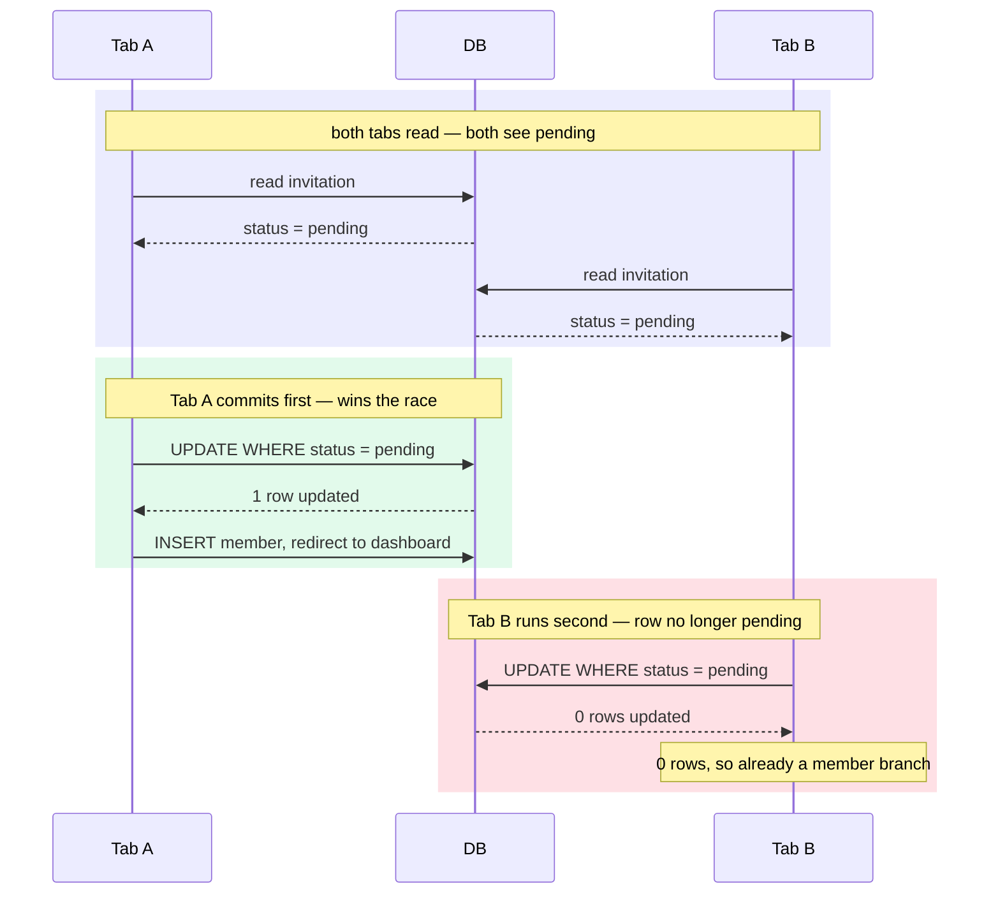

import Figure from '../../../components/figures/Figure.astro';
import Term from '../../../components/ui/Term.astro';
import CodeVariants from '../../../components/code/code-variants/CodeVariants.astro';
import CodeVariant from '../../../components/code/code-variants/CodeVariant.astro';
import StateMachineWalker from '../../../components/figures/state-machine-walker/StateMachineWalker.astro';
import Question from '../../../components/figures/state-machine-walker/Question.astro';
import Branch from '../../../components/figures/state-machine-walker/Branch.astro';
import Leaf from '../../../components/figures/state-machine-walker/Leaf.astro';
import Buckets from '../../../components/exercises/buckets/Buckets.astro';
import Bucket from '../../../components/exercises/buckets/Bucket.astro';
import Item from '../../../components/exercises/buckets/Item.astro';
import SeniorCallsTable from '../../../components/lessons/058/5/SeniorCallsTable.astro';
import ExternalResource from '../../../components/ui/ExternalResource.astro';
import { CardGrid } from '@astrojs/starlight/components';
import CourseProgressBar from '../../../components/ui/CourseProgressBar.astro';

<CourseProgressBar value={frontmatter['course-progress']} />

Alice invited Bob to Acme three weeks ago. Last week Alice left the company and her seat was removed. Today Bob finally clicks the link. Does it work?

A second one. The invite landed in Bob's personal Gmail, but Bob signs into Acme with his work account. He clicks the link while signed in as `bob.personal@gmail.com`. Should that accept the seat offered to `bob@acme.com`?

A third. The page is slow, so Bob opens the link in a second tab and clicks Accept in both within the same second. Two requests race for the same row. Does Bob end up a member once, twice, or with an error?

Over four lessons you built the invitation flow end to end. Every lesson walked the happy path: the right person, the right email, one click, one row. In production that path is the rare one. The three scenes above are the support tickets that arrive in month two, once real humans start forwarding emails, leaving companies, and double-clicking slow pages.

This lesson is judgment, not code: no new tables or actions, just a guard here, a comparison there, a precondition clause in flows you already have. For each odd arrival, what's the senior call, and which layer enforces it? You'll settle each case here, but the lasting payoff is three principles for the edge case production hasn't invented yet.

## An invitation is the org's decision, frozen at send time

When Alice invites `bob@acme.com` as `admin`, the row records a decision the organization made: "Acme offers this email a seat as `admin`, valid until `expiresAt`." Alice filed that decision; she doesn't own it. The offer belongs to Acme.

So the invite's authority doesn't depend on Alice still being a member, an admin, or around at all. The `role` is snapshotted onto the row at send time and never recomputed. When Bob accepts, the flow reads `invitation.role` off that row; it never asks "what can Alice grant today?" Everything after the write just executes the recorded decision.

This is why "the inviter is gone" and "the inviter lost power" are the same case in different clothes: neither touches a decision already frozen on the row.

:::note
Some products take the opposite posture: they treat an invite as the inviter's personal sponsorship and auto-revoke pending invites when the inviter leaves. That's a legitimate product choice with a different default. The next section works out why "the org's decision" is the better default in year one.
:::

## The inviter left before the invitee accepted

Alice invites Bob on day 1. Alice is removed from Acme on day 5. Bob clicks on day 6.

**The senior call: honor the invite.** Acme's offer outlives Alice's departure, so the accept flow runs unchanged. `acceptInvitation` never checks whether the inviter is still a member, and that's correct: the row says Acme offered Bob a seat, and Alice leaving doesn't un-offer it.

Honor it because the failure modes aren't symmetric. Block the invite and you turn away a legitimate hire: Bob hits a refusal screen, and someone has to notice, investigate, and re-issue. Honor it and the worst case is a stale sponsorship, the same thing that happens to any hire whose recruiter later changes teams. A blocked join is loud and expensive; a stale sponsor is a shrug. When the costs are this lopsided, choose the cheap failure.

The audit trail still tells the true story. The `'invitation.sent'` row names Alice, frozen at send time; the `'invitation.accepted'` row names Bob. Read side by side, they answer "who invited Bob, and were they still here when he joined?" The rows record what happened, not what is currently true.

The departure changes one thing, and it's cosmetic. The accept page can show "Invited by Alice" as a friendly touch, but only if she's still a member, a cheap existence read against `member`. If she's gone, omit the line. A missing inviter changes the **copy**, never the **decision**, so the guard is one conditional in the JSX, not a clause in the action.

<div data-mark-color="blue">

```tsx "inviterStillMember"
{inviterStillMember && <p>Invited by {inviterName}</p>}
```

</div>

:::caution
The alternative, auto-revoking pending invites when an inviter is removed, is defensible. The danger isn't picking it; it's picking it implicitly. Choose a posture and write it down, so the next engineer who reads "Bob's invite still worked after Alice left" knows it was a decision, not a bug.
:::

## The inviter's role can change; the snapshotted decision can't

Two more arrangements where state shifted under an open invite, each answered by the same principle.

**The inviter was demoted before accept.** Alice, an admin, invites Bob as `admin`, then is demoted to `member` before he accepts. Bob still becomes an `admin`. The invite carries `role`, not `inviterRole`: Acme's frozen decision was "Bob gets admin," and Alice's later loss of power can't rewrite a row that's already written.

**Cross-org independence.** Bob already owns "Bob Consulting," a separate org, when he accepts Acme's invite as `member`. The accept writes one `member` row in Acme's tenant and points his session's `activeOrganizationId` at Acme so the redirect lands him there. Bob Consulting lives in a different tenant and is untouched: the accept is a write in one tenant, not a multi-tenant operation, and the `tenantDb` scoping keeps the two orgs from bleeding together.

## The email mismatch: never bind an invite to the wrong account

The accept route's "signed in as a different email" branch rendered only a refusal stub. Here is the full posture behind it.

**The scene.** Alice invited `bob@acme.com`. Bob, signed in as `bob.personal@gmail.com`, forwarded the email and clicked the link there. The session belongs to one identity; the invitation names another. Does this accept?

**The senior call: strict refusal, no escape hatch.** It refuses on both layers. The page detects that `session.user.email` does not equal `invitation.email` and renders the mismatch screen, so Bob sees an explanation instead of a dead button. The action refuses too, because your contract already includes `user.email !== invitation.email → err('forbidden')`. The page is UX; the action is the real gate, since the write is what grants the seat.

Why so strict? The invitation's identity *is* the email address, and the friendly-sounding trap is to bind the invite to whatever account is signed in. Picture where that goes. Bob forwards the email to a colleague to ask "is this legit?" The colleague, signed into their own account, clicks the link, and auto-bind hands them an Acme seat that was never offered. That failure class has a name, <Term definition="A class of bug where an action runs under the wrong identity's authority — e.g. the wrong user accepting a forwarded credential and inheriting access that was never granted to them.">privilege confusion</Term>: the click is not consent from the right party, so the click must not grant the seat.

Email equality alone is not enough. Suppose an attacker pre-registers an account at `bob@acme.com` but never verifies it. A string-equality gate matches that session against the invitation and lets the attacker take Bob's seat. The real predicate isn't "the session email matches the invited address," it's "the session belongs to a *verified owner* of that address." Two facts must line up: the invite click proves the address is reachable, and email verification proves the session-holder owns it. So the accept path leans on both the unguessable 32-byte token from the send work and a verified-email check. The secret in the URL is the token, not the invitation `id`: a `uuidv7` is time-ordered and carries a timestamp, so it's an identifier, not a credential. Better Auth's organization plugin enforces this through a `requireEmailVerificationOnInvitation` switch that hardens the recipient endpoints against the pre-registered-unverified-account attack. Don't memorize the config; the predicate is verified ownership, never bare equality.

:::danger
Do not add an "accept anyway" button to the mismatch screen because it feels friendlier. That button **is** the vulnerability. There is no benign version of "bind this invite to whatever account is signed in," and the entire defense is that you never offer that path.
:::

What does the screen do instead? It tells Bob how to fix it out of band: "This invitation was sent to `bob@acme.com`. Sign out and sign in as `bob@acme.com` to accept, or ask Alice to re-invite your current email." Note where the second recovery lands: "re-invite my current email" is not an edit to the existing row. Changing the target address is a brand-new offer to a different identity, so it routes through the revoke-and-resend you built on the management surface. A new email is a new invite, by definition.

### Comparing emails: lowercase to compare, original to display

One nuance hides inside the equality check, and it causes real production bugs. `Bob@Acme.com` and `bob@acme.com` are the same address. The local part can be case-sensitive in theory, but no real mail provider treats it that way, and your invitation was stored lowercased back at the schema (the `lower(email)` index) and the send action (the `.toLowerCase()` on input). So at compare time you must lowercase the session side too, or a legitimate Bob whose account capitalizes his name gets bounced to the mismatch screen.

These two variants show the trap and the fix.

<CodeVariants>
  <CodeVariant label="Naive">
    ```ts del={1}
    session.user.email === invitation.email
    ```
    **Breaks the instant either side carries different casing.** The invite display elsewhere preserves the user's original casing, so this mismatches a real Bob whose account reads `Bob@Acme.com`.
  </CodeVariant>

  <CodeVariant label="Correct">
    ```ts ins={1}
    session.user.email.toLowerCase() === invitation.email
    ```
    **Only the session side needs `.toLowerCase()`.** `invitation.email` was already stored lowercased at rest, so the right side stays bare.
  </CodeVariant>
</CodeVariants>

The flip side: lowercase is an internal comparison key, never a presentation form. When you show the address back to Bob, on the mismatch screen, in the pending list, anywhere, display the original casing he or Alice typed. The lowercased form is plumbing, and plumbing stays behind the wall.

## Optimistic concurrency: two tabs accept at once

The third principle unpacks the `WHERE status = 'pending'` clause you've added on faith. Here is the full mechanism.

**The scene.** Bob clicks Accept in two tabs within the same second. Each click fires its own `acceptInvitation`: two requests, two transactions. Both read the same row and see `status = 'pending'`. From each read, the seat looks unclaimed.

If the read were the decision, both would insert a `member` row: Bob a member twice, a mess. But the write is the decision, and the write carries the precondition:

<div data-mark-color="green">

```ts "eq(invitation.status, 'pending')"
const [updated] = await tx
  .update(invitation)
  .set({ status: 'accepted', acceptedAt: new Date() })
  .where(and(eq(invitation.id, id), eq(invitation.status, 'pending')))
  .returning();

if (!updated) return ok({ alreadyMember: true });
```

</div>

The database serializes the two identical `UPDATE`s. The first to commit flips the status and matches its one row. The second now finds the row no longer `pending`, so its `WHERE` matches **zero** rows, `updated` comes back empty, and the action falls into the `alreadyMember` branch. One write lands; the loser routes Bob to "you're already a member."

<Figure>

  <Fragment slot="caption">
    Both reads return `pending`, yet only Tab A's `UPDATE` matches a row. Tab B runs second, matches zero rows, and lands in the idempotent "already a member" branch. (Unit 9)
  </Fragment>
</Figure>

This pattern is <Term definition="A concurrency strategy that takes no lock up front. The write assumes the row is unchanged and a WHERE precondition verifies that assumption at commit time. If the row moved, the write matches zero rows and the caller handles the conflict.">optimistic concurrency</Term>: no lock at page load, just a `WHERE` clause that checks at mutation time whether the row is still in the state the page saw. The `status` column plays the role a `version` number or `updated_at` timestamp plays in textbook optimistic locking. It generalizes to any exactly-once transition — accepting an invite, charging a card, claiming a job off a queue: read freely, but make the write assert the precondition it depends on.

The principle in one line: **never trust the state the page render saw.** That render is a snapshot from milliseconds ago, and another request may have moved the row since. The `WHERE` clause is the only source of truth at the instant of mutation.

## Already a member: the invite that should never have been written

The management-surface lesson handled a new invite colliding with a pending one. This is the other collision: a new invite against an existing membership.

**The scene.** Bob already belongs to Acme. Alice forgets and invites `bob@acme.com` again.

**The senior call: refuse in the `sendInvitation` body, before the INSERT.** If the email already belongs to a member of this org, don't write the invite. One wrinkle: `member` has no `email` column. A membership row points at a `userId`, with the email on the `user` row, so the check resolves through the user: find the user by email, then look for a `member` row in this org.

The `Result` union has no `'already-member'` code, so this maps to `err('conflict', …)`, just as the pending collision mapped its imagined `'already-invited'` down to `conflict`. You distinguish the two by the message ("Bob is already a member of this organization") and where the check fired, not by a new code. Carry the existing member's id or role in the message so the UI can deep-link Alice straight to Bob's row.

Why pre-check here, when the management surface said the opposite, let the index throw and catch the error? Because that case has a constraint to catch and this one doesn't. The pending collision is guarded by a real unique index on `invitation`: a SELECT-then-INSERT pre-check races, so you let the second INSERT hit the index and catch the `23505`. No unique constraint spans `member` and `invitation`, separate tables by design, so there is nothing to catch and a membership read in the action body is the only tool.

The rule: **prefer the constraint when one exists; fall back to a guarded read only when the invariant spans tables a single index can't cover.** The fallback has a residual race, a membership created between your read and your INSERT, but it's vanishingly rare and low-stakes: the worst case is a redundant pending invite that the accept flow's guards neutralize.

<CodeVariants>
  <CodeVariant label="Pending collision (recap)">
    ```ts {3-5}
    try {
      await tx.insert(invitation).values(values);
    } catch (e) {
      if (isUniqueViolation(e)) {
        return err('conflict', 'There is already a pending invite for this email.');
      }
      throw e;
    }
    ```
    **Layer: the DB unique index.** The constraint exists, so you let the INSERT hit it and translate the `23505`; pre-checking would only add a race. `isUniqueViolation` is the project's generic `23505` primitive.
  </CodeVariant>

  <CodeVariant label="Already a member (this lesson)">
    ```ts {1-6}
    const existingUser = await tx.query.user.findFirst({ where: eq(user.email, email) });
    const existing = existingUser
      ? await tx.query.member.findFirst({
          where: and(eq(member.organizationId, orgId), eq(member.userId, existingUser.id)),
        })
      : null;
    if (existing) return err('conflict', 'Bob is already a member of this organization.');
    ```
    **Layer: an action-body guard read.** No index spans `member` and `invitation`, and `member` keys on `userId` not email, so there's nothing to catch and the read resolves through `user`. A guarded read before the write is the only tool, residual race and all.
  </CodeVariant>
</CodeVariants>

## When the link can't resolve: expired, tampered, revoked, or deleted org

A handful of "unusable link" cases all end in a refusal. You derived most of them as the accept route's verify ladder, so the recaps are short. The last one, a deleted org, is the structural payoff.

**Expired click.** Bob clicks six weeks late, `expiresAt < now()`, and lands on the expired screen. Give that page no "request a new invite" button: recovery is out of band, Bob emails Alice, Alice hits Resend.

**Tampered or revoked link.** A forged signature, a missing row, and a token-hash mismatch all collapse to one generic refusal, so a prober learns nothing. A `canceled` status forks to its own "this invite was revoked" copy, because that distinction helps the honest user more than the attacker.

**The org was deleted before accept.** Acme is deleted on day 5, Bob clicks on day 6. `invitation.organizationId` was declared with `onDelete: 'cascade'`, so deleting Acme deleted the invitation row with it. `getInvitationById` now finds nothing, and Bob lands on the same generic refusal as any missing row. There is **no special branch to write**.

The lesson: when a constraint upstream already guarantees an invariant, don't write application code to re-check it. The cascade lives one layer down in the DDL, so "org deleted" never reaches your action as a case to branch on.

## What the accept route checks, in order

The walker below puts you in the accept route's seat, asking the questions a senior asks in order: validity, freshness, identity, then state. Pick a branch at each step and follow it to its verdict.

<StateMachineWalker title="An invite click arrives — what does the accept route do?">
  <Question
    id="link-valid"
    prompt="Is the link cryptographically valid?"
    description="HMAC signature checks out, the row is found by id, and the token hash matches.">
    <Branch label="No — bad signature, missing row, or hash mismatch" to="leaf-refuse" />
    <Branch label="Yes" to="fresh" />
  </Question>

  <Question
    id="fresh"
    prompt="Is the invitation still live?"
    description="expiresAt is in the future and status is still pending.">
    <Branch label="Expired — expiresAt is in the past" to="leaf-expired" />
    <Branch label="Revoked — status = canceled" to="leaf-revoked" />
    <Branch label="Already accepted — status = accepted" to="leaf-already" />
    <Branch label="Live and pending" to="signed-in" />
  </Question>

  <Question id="signed-in" prompt="Is a user signed in?">
    <Branch label="No — but an account exists on the invited email" to="leaf-signin" />
    <Branch label="No — and no account exists yet" to="leaf-signup" />
    <Branch label="Yes — someone is signed in" to="email-match" />
  </Question>

  <Question
    id="email-match"
    prompt="Does the session email match the invited email?"
    description="Compared lowercased on the session side; the invited email is already stored lowercase.">
    <Branch label="No — they differ" to="leaf-mismatch" />
    <Branch label="Yes — they match" to="leaf-accept" />
  </Question>

  <Leaf id="leaf-refuse" verdict="Generic refusal">
    One screen for tamper, a missing row, and a hash mismatch alike. Never name which one failed, or a prober learns from the difference.
  </Leaf>

  <Leaf id="leaf-expired" verdict="Expired screen">
    Recovery is out of band: Bob asks Alice to resend. No self-serve "request a new invite" button.
  </Leaf>

  <Leaf id="leaf-revoked" verdict="Revoked screen">
    An honest fork from the generic refusal: an admin canceled this invite, and saying so helps the honest user more than an attacker.
  </Leaf>

  <Leaf id="leaf-already" verdict="Already a member">
    An idempotent landing with a link to the dashboard. The losing tab of the double-click race ends here.
  </Leaf>

  <Leaf id="leaf-signin" verdict="Sign in, then return to accept">
    Prefill the invited email and carry `next` back to the accept URL so the click resumes after sign-in.
  </Leaf>

  <Leaf id="leaf-signup" verdict="Sign up, email locked, then return">
    The email is prefilled and read-only so Bob can't sign up under the wrong address, then `next` returns him to accept.
  </Leaf>

  <Leaf id="leaf-mismatch" verdict="Strict refusal — no &lsquo;accept anyway&rsquo;">
    The privilege-confusion defense: a session whose email doesn't match the invited address is turned away with no escape hatch.
  </Leaf>

  <Leaf id="leaf-accept" verdict="Render the Accept button — the only write path">
    The consent gate. The POST re-verifies every gate above, and the `WHERE status = 'pending'` precondition makes the write exactly-once.
  </Leaf>
</StateMachineWalker>

Validity, then freshness, then identity, then match: refusals stacked at the front, the single write at the back. Refuse early and cheaply; commit only once every prior gate passes.

## Every call and its enforcing layer

Read the third column twice — it names the layer enforcing each call. Put a check in the wrong layer and you get the classic beginner bugs: a `SELECT`-then-`if` where a `WHERE` clause belongs, a UI guard where the server must refuse.

<Figure>
  <SeniorCallsTable />
  <Fragment slot="caption">
    *Where the check lives* is the axis this lesson kept circling. Two of these refusals are enforced by the **database** (a `WHERE` precondition, a cascade), two by an **action-body guard** before any write, one by the **accept page** at render, and two by **no check at all**, honored by the org's decision. (Unit 9)
  </Fragment>
</Figure>

Forget the rows and keep the three principles; a novel edge case almost always resolves to one. An invitation is **the org's decision, frozen at send time**, so the inviter leaving, being demoted, or losing the org never rewrites it. Its identity is **the email address, never silently rebound**, so a mismatch is a strict refusal with no escape hatch. And at write time you **never trust the state the page render saw**, so the precondition rides on the `WHERE` clause, not a stale read.

## Where does the check live?

The hardest transferable idea isn't *what* each senior call is; it's *which layer* enforces it. Sort each case into the layer that does the enforcing.

<Buckets twoCol instructions="Sort each edge case into the layer that enforces the senior call — where the check actually lives.">
  <Bucket name="db" label="DB precondition / constraint" description="The database enforces it — a WHERE precondition, a unique index, or a cascade." />
  <Bucket name="action" label="Action-body guard" description="Code in the action checks it before writing." />
  <Bucket name="none" label="No check — structural or honored" description="Nothing checks it: it's honored by design or already guaranteed upstream." />

  <Item bucket="db">Two tabs accept the same invite at once</Item>
  <Item bucket="db">The org was deleted before the invitee clicked</Item>
  <Item bucket="db">Re-inviting an email that already has a pending invite</Item>
  <Item bucket="action">The session email differs from the invited email</Item>
  <Item bucket="action">Inviting an email that already belongs to a member</Item>
  <Item bucket="none">The inviter was removed from the org before the invitee accepted</Item>
  <Item bucket="none">The inviter was demoted before the invitee accepted</Item>
</Buckets>

The "no check" bucket trips up beginners, because the instinct is that every edge case needs a guard. Some don't: "honor it" and "already guaranteed upstream" are correct answers, and knowing when no check is right is as much the skill as writing one.

## External resources

<CardGrid>
  <ExternalResource
    title="Organization plugin — invitations"
    href="https://better-auth.com/docs/plugins/organization"
    icon="simple-icons:betterauth"
    iconColor="#000000"
    description="The real config behind the verified-ownership predicate, including requireEmailVerificationOnInvitation."
  />
  <ExternalResource
    title="Optimistic Offline Lock"
    href="https://martinfowler.com/eaaCatalog/optimisticOfflineLock.html"
    icon="lucide:book-marked"
    iconColor="#2E7D32"
    description="Martin Fowler's canonical write-up of the pattern your WHERE-precondition is an instance of."
  />
  <ExternalResource
    title="PostgreSQL — Explicit Locking"
    href="https://www.postgresql.org/docs/current/explicit-locking.html"
    icon="simple-icons:postgresql"
    iconColor="#4169E1"
    description="The DB-level mechanisms — row locks, SELECT FOR UPDATE — that serialize the racing writes."
  />
  <ExternalResource
    title="OWASP — Broken Access Control"
    href="https://owasp.org/Top10/2021/A01_2021-Broken_Access_Control/"
    icon="simple-icons:owasp"
    iconColor="#000000"
    description="The industry framing for the privilege-confusion edge: why the email-mismatch refusal must be server-side."
  />
</CardGrid>
