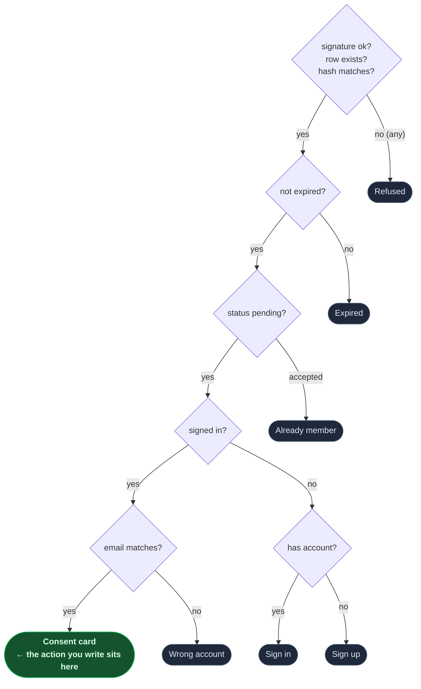

import Figure from '../../../components/figures/Figure.astro';
import Screenshot from '../../../components/figures/screenshot/Screenshot.astro';
import ExternalResource from '../../../components/ui/ExternalResource.astro';
import { CardGrid } from '@astrojs/starlight/components';
import CourseProgressBar from '../../../components/ui/CourseProgressBar.astro';
import Checklist from '../../../components/ui/checklist/Checklist.astro';
import ChecklistItem from '../../../components/ui/checklist/ChecklistItem.astro';
import AnnotatedCode from '../../../components/code/annotated-code/AnnotatedCode.astro';
import AnnotatedStep from '../../../components/code/annotated-code/AnnotatedStep.astro';

<CourseProgressBar value={frontmatter['course-progress']} />

A stranger who clicks the emailed invite link becomes a member of the org, with the exact role they were invited at.

You already shipped the half of the handshake that creates the invitation: last lesson's `sendInvitation` wrote the `pending` row, hashed the token at rest, and dropped a signed `/accept-invite?id=&token=&sig=` URL into a real inbox. The page on the other end of that URL is built too — open the link in a private window and it renders the right arrival surface depending on who you are: a generic refusal for a tampered link, an "expired" card for a stale one, "you're already in" for a redeemed one, a "wrong account" card if you are signed in as someone else, a prefilled sign-up or sign-in if you have no session, and finally — when everything lines up — a consent card with an **Accept** button. Click it today and nothing happens. The button posts to an action that doesn't exist yet.

This lesson writes that action. By the end, signing up through the prefilled flow and clicking **Accept** lands you on `/dashboard` with the invited org already active; the inspector shows the new member row carrying the invited role, an `invitation.accepted` row at the head of the audit tail, and `user.emailVerified` flipped to `true`. That closes every goal in this project: the invite handshake now works end to end across all six arrival surfaces.

<Figure caption="The consent arrival surface — the one branch of the verify ladder that mounts the form posting to the acceptInvitation action you write in this lesson. Every other branch is a dead end the action never sees.">
  <Screenshot viewport="desktop">
    
  </Screenshot>
</Figure>

## Your mission

Accepting an emailed invite turns the recipient into a member of the inviting org at the role they were invited to hold. The provided Server Component at `/accept-invite` does the gatekeeping: it runs a fixed-order verify ladder — signature, then row, then hash, then expiry, then status, then identity — and from that picks exactly one of the seven surfaces to render. You are writing only the *action* that sits behind the consent screen's **Accept** button, plus the one unscoped read the ladder leans on to load the invitation.

The reflex this lesson is built around is the line between verifying a *render* and verifying a *write*. The page already verified everything before it drew the consent card — so why re-check any of it in the action? Because the form POST is a brand-new request. It does not inherit the page's checks; it arrives with its own form body, against a database row that may have changed in the seconds since the page rendered. So the action re-fetches the row, re-hashes the token and compares it to the stored `tokenHash`, and re-checks expiry, status, and the signed-in email — independently. Note what is *not* in that list: `sig`. The signature is the page's pre-database doorman, the thing that decides whether to even look up the row; it is not an input to the action, and the action never receives it.

A few more decisions shape the code, and each one has a reason worth holding onto. This action is **not** wrapped in `authedAction` — the authority here is the signed invitation itself, not an org role the caller already holds; a stranger with no membership anywhere is exactly who is supposed to succeed. The read it depends on, `getInvitationById`, is the one deliberately *unscoped* query in the whole project: the invitee belongs to no org yet, so there is no tenant to scope to, and it goes through the unwrapped `db` rather than `tenantDb`. The seat-grant, the status flip, the email-verify flip, and the audit row all co-transact inside one `withTenant` transaction keyed on the invitation's org — write them all through the transaction handle directly, never through the plugin's own accept endpoint, whose post-commit hooks would split the audit row out of the transaction that grants the seat. That audit row is the single row in this project inserted **directly through `tx`** instead of through the shared `logAudit` helper, and the reason is structural: `logAudit` derives its org from the acting member's session, but the accepting user is not a member yet, so that derivation resolves to nothing and would redirect mid-transaction. Switching the active org happens **after** commit — the plugin refuses to activate an org the caller cannot yet see, and the membership only becomes visible once the transaction lands. When the accepting user is unverified, flip `emailVerified` to `true` in the same transaction: receiving the click on the invited address is itself proof they own it, so making them run a separate verify-your-email loop right after joining would be theatre.

The explicit **Accept** button matters too: it is a consent gate, not a formality. If accepting fired on a plain GET of the URL, a corporate link-rewriter or a URL-scanning crawler would silently consume the invite before the human ever saw it. Two humans racing the button resolve cleanly because the status flip is guarded on `status = 'pending'` — the second writer matches no row. Email comparison is case-insensitive on both ends: the invitation was lowercased when it was written, and you lowercase the session email at compare time.

Out of scope: the verify ladder and the six arrival-surface components are provided in full — you read them to understand the shape your action plugs into, you don't write them — and there is no revoke or resend affordance in this project.

<Checklist id="mission">
  <ChecklistItem chip="tested">Clicking Accept on a valid pending invite while signed in with the matching email writes a member row carrying the invited role (not a hard-coded default).</ChecklistItem>
  <ChecklistItem chip="tested">Accepting flips the invitation to `accepted`, stamps `acceptedAt`, and appends one `invitation.accepted` audit row — all in a single transaction, so a failure in any one write rolls the seat-grant back along with its audit row.</ChecklistItem>
  <ChecklistItem chip="tested">Submitting a token whose `sha256` does not match the stored hash is refused, with no row written — the action re-verifies the hash itself.</ChecklistItem>
  <ChecklistItem chip="tested">Submitting while signed in with an email other than the invited one is refused, and the message names the address the invite was actually sent to.</ChecklistItem>
  <ChecklistItem chip="tested">Submitting an expired or already-accepted invitation is refused.</ChecklistItem>
  <ChecklistItem chip="tested">After accepting, the active org is the invited org, switched only once the membership is committed.</ChecklistItem>
  <ChecklistItem chip="tested">A user who was unverified at accept time is verified afterward, with no separate verification email sent.</ChecklistItem>
  <ChecklistItem chip="tested">Two simultaneous Accept submissions resolve to one success and one no-op — exactly one membership, never a duplicate seat.</ChecklistItem>
  <ChecklistItem chip="untested">Opening a valid pending URL while signed in with the matching email renders the Accept button alongside the org name, inviter name, and role.</ChecklistItem>
  <ChecklistItem chip="untested">A mangled `sig`, a missing row, and a hash mismatch all collapse to the same generic refusal — the public is never told which check failed.</ChecklistItem>
  <ChecklistItem chip="untested">Signed out with no account renders a prefilled sign-up that, on success, returns to the accept URL and then the Accept button; signed out with an existing account renders the prefilled sign-in.</ChecklistItem>
  <ChecklistItem chip="untested">After accepting, the redirect lands on `/dashboard` in the invited org.</ChecklistItem>
</Checklist>

## Coding time

Implement against the brief and the lesson's tests, then read the reference walkthrough.

<details>
<summary>Reference solution and walkthrough</summary>

Two files. The unscoped read comes first because both the page and the action depend on it; then the action itself.

### The unscoped read

`getInvitationById` is the project's lone deliberately non-scoped query. Every other read in this codebase flows through `tenantDb(orgId)` so that forgetting the org filter doesn't compile — but here there is no org to scope to. The person loading this row is not a member of anything yet; the signed token in the URL is their authorization, and the org is *derived* from the row once it loads. So it goes through the unwrapped `db`, and it returns the full row so that both the page's verify ladder and your action can read `tokenHash`, `status`, `expiresAt`, `organizationId`, and `role` off it.

<div data-mark-color="blue">

```ts title="src/db/queries/invitations.ts" {7-10}
// getInvitationById is the deliberate non-scoped read: the invitee is not yet a
// member, so there is no tenant to scope to — the signed token is the authorization
// and the org is derived from the loaded row. Goes through the unwrapped db (never
// tenantDb), and returns the full row so the accept page's verify ladder and the
// accept action can read tokenHash / status / expiresAt / organizationId / role.
export const getInvitationById = async (id: string) =>
  (await db.query.invitation.findFirst({
    where: eq(invitation.id, id),
  })) ?? null;
```

</div>

The file already carries `import 'server-only'` at the top from the previous lesson, so this read can never be pulled into a client bundle.

### The accept action

The action reads top to bottom as: validate the form, re-verify the invitation independently of the page, check identity, then do every write in one transaction, and only after that switch the active org and redirect.

<AnnotatedCode lang="ts" maxLines={18} code={`
'use server';

import { and, eq } from 'drizzle-orm';
import type { Route } from 'next';
import { headers } from 'next/headers';
import { redirect } from 'next/navigation';
import { z } from 'zod';

import { auditLogs } from '@/db/audit';
import { getInvitationById } from '@/db/queries/invitations';
import { invitation, member, user } from '@/db/schema/auth';
import { withTenant } from '@/db/tenant';
import { auth, getCurrentUser } from '@/lib/auth';
import { sha256 } from '@/lib/invitations/url';
import type { Result } from '@/lib/result';
import { err } from '@/lib/result';

// Module-local, NOT exported: a "use server" module may export only async functions
// (Next 16.2.7 rejects a non-function export at runtime). id is the Better Auth
// invitation text id — z.string().min(1), never z.uuid().
const acceptInvitationSchema = z.strictObject({
  id: z.string().min(1),
  token: z.string(),
});

// Accept is NOT an authedAction: the signed invitation is the authority, not a role.
// The POST is a separate request from the page render, so the action re-verifies the
// token independently (hash / expiry / status) — sig is not an action input. The
// member insert, the invitation status flip (guarded on status='pending', the
// optimistic-concurrency / double-click guard), the emailVerified flip (the invite
// click IS the email-ownership proof, so no verify-your-email loop right after), and
// the 'invitation.accepted' audit row all co-transact in ONE withTenant tx, so a
// failure anywhere rolls the seat-grant back with its audit row. Direct tx writes
// throughout — never the plugin's own accept endpoint, whose after hooks run
// post-commit and would break the one-transaction audit contract.
//
// Deviation from the per-slice plan, forced by the installed surface: the audit row
// is inserted directly through tx rather than via the shared logAudit helper, because
// logAudit derives its org from the session's active org (requireOrgUser) — but the
// accepting user is not yet a member of any org, so that read resolves to nothing and
// redirects mid-transaction. The invitation row is the authority here, so org + actor
// come from it and the validated session user. setActiveOrganization is therefore the
// one auth.api write and runs AFTER commit: the installed plugin refuses to activate
// an org the caller is not yet a member of, and that membership is visible only once
// the tx commits.
export const acceptInvitation = async (
  _prev: Result<{ ok: true }> | null,
  formData: FormData,
): Promise<Result<{ ok: true }>> => {
  const parsed = acceptInvitationSchema.safeParse(Object.fromEntries(formData));
  if (!parsed.success) {
    return err('validation', 'This invitation link is malformed.');
  }
  const { id, token } = parsed.data;

  const currentUser = await getCurrentUser();
  const row = await getInvitationById(id);

  if (
    !row ||
    (await sha256(token)) !== row.tokenHash ||
    row.expiresAt < new Date() ||
    row.status !== 'pending'
  ) {
    return err('not_found', 'This invitation is no longer valid.');
  }

  if (!currentUser || currentUser.email.toLowerCase() !== row.email) {
    return err(
      'forbidden',
      \`This invitation was sent to \${row.email}. Sign in with that address to accept it.\`,
    );
  }

  const h = await headers();

  await withTenant(row.organizationId, async (tx) => {
    const [newMember] = await tx
      .insert(member)
      .values({
        id: crypto.randomUUID(),
        userId: currentUser.id,
        organizationId: row.organizationId,
        role: row.role ?? 'member',
        createdAt: new Date(),
      })
      .returning({ id: member.id });

    await tx
      .update(invitation)
      .set({ status: 'accepted', acceptedAt: new Date() })
      .where(and(eq(invitation.id, id), eq(invitation.status, 'pending')));

    if (!currentUser.emailVerified) {
      await tx
        .update(user)
        .set({ emailVerified: true })
        .where(eq(user.id, currentUser.id));
    }

    await tx.insert(auditLogs).values({
      organizationId: row.organizationId,
      actorUserId: currentUser.id,
      actorIp: h.get('x-forwarded-for'),
      actorUserAgent: h.get('user-agent')?.slice(0, 512),
      action: 'invitation.accepted',
      subjectType: 'invitation',
      subjectId: id,
      payload: { newMemberId: newMember?.id, role: row.role },
    });
  });

  await auth.api.setActiveOrganization({
    headers: h,
    body: { organizationId: row.organizationId },
  });

  redirect('/dashboard' as Route);
};
`}>
  <AnnotatedStep meta="{21-24}" color="blue">
    **The schema is module-local, not exported.** A `'use server'` module may export only async functions; Next.js 16 rejects a non-function export at runtime, so the Zod schema stays a private `const`. Note that `id` is the Better Auth invitation *text* id, validated `z.string().min(1)`, never `z.uuid()` — Better Auth ids are base62 text.
  </AnnotatedStep>

  <AnnotatedStep meta="{59-66}" color="orange">
    **The validity guard re-verifies, and collapses four failures into one refusal.** The POST is a separate request from the page render, so the action re-checks the invitation independently: missing row, wrong token, expired, or no-longer-pending all return the same generic message. Note `sig` is absent — it is the page's doorman, never an action input. Covers requirements 3 and 5.
  </AnnotatedStep>

  <AnnotatedStep meta="{68-73}" color="orange">
    **The identity guard names the invited address.** The invitation email was lowercased at write time, so only the session email needs lowercasing here. The message names `row.email` so a user signed in as the wrong account knows which one to switch to. Covers requirement 4.
  </AnnotatedStep>

  <AnnotatedStep meta="{77-111}" color="green">
    **One transaction, four writes.** In order: insert the `member` row with the invited `role: row.role ?? 'member'`, capturing the new id via `.returning`; flip the invitation to `accepted` guarded by `status = 'pending'` (the double-click guard, so a second concurrent accept matches no row); conditionally verify the email; and insert the audit row directly through `tx`. Covers requirements 1, 2, 7, and 8.
  </AnnotatedStep>

  <AnnotatedStep meta="{113-118}" color="violet">
    **Activate the org and redirect, after commit.** `setActiveOrganization` is the one sanctioned `auth.api` write here and runs only once the transaction has committed, because the plugin refuses to activate an org whose membership the caller cannot yet see. The `redirect()` throws to abort the action and send the new member to their dashboard. Covers requirements 6 and 12.
  </AnnotatedStep>
</AnnotatedCode>

A few of these calls look unusual at a glance, so they are worth naming. The writes are hand-rolled `tx` inserts and updates rather than a call to Better Auth's own `acceptInvitation` endpoint — deliberately, because that endpoint's `after` hooks run *post-commit*, which would split the audit row out of the transaction that grants the seat and break the one-transaction guarantee requirement 2 depends on. And the audit insert does not go through `logAudit`, the helper every other privileged write in this project uses. That is the project's single, deliberate exception. `logAudit` resolves the acting org and actor through `requireOrgUser`, which reads the caller's active membership — but the accepting user has no membership yet, so that read finds nothing and redirects mid-transaction. Here the invitation row is the authority, so org and actor come from the row and the validated session, written straight through `tx`. The `logAudit` transaction contract itself was covered when you built it — see "Append-only audit_logs with RLS" earlier in this chapter for why audit writes must share the work's transaction, and lesson 5 of the chapter on roles and the audit trail for the helper's design.

The signed-URL generation, the token, and the hash-at-rest were all built last lesson in "Send an invitation with a signed accept URL" — the action just re-runs `sha256` over the raw token and compares. And the email-mismatch refusal and the double-click race are derived in full in lesson 5 of the chapter on invitations and the seat-handoff lifecycle, where the `status='pending'` filter as an optimistic-concurrency guard is worked through.

### The provided surface your action plugs into

Before you run the tests, it's worth reading `src/app/(auth)/accept-invite/page.tsx` once. You don't write it, but seeing the ladder makes the action's re-verification obvious: the page checks the same things your action checks, in the same order, and picks a screen — the action then re-checks them against the write. The consent card is the one branch that mounts the form posting to your `acceptInvitation`; every other branch is a dead end the action never sees.

<Figure caption="The provided page's verify ladder runs in fixed order — integrity (signature, row, hash), then expiry, status, and identity — and each failing check picks exactly one arrival surface. The three integrity checks collapse to one generic Refused screen, so the public is never told which failed. Only the all-pass leaf mounts the consent card, the one surface your acceptInvitation action sits behind.">

</Figure>

</details>

<CardGrid>
  <ExternalResource
    title="Better Auth — Organization plugin"
    href="https://better-auth.com/docs/plugins/organization"
    icon="simple-icons:betterauth"
    description="Reference for acceptInvitation and setActiveOrganization — the plugin surface your action sits behind."
  />
  <ExternalResource
    title="Drizzle ORM — Transactions"
    href="https://orm.drizzle.team/docs/transactions"
    icon="simple-icons:drizzle"
    iconColor="#C5F74F"
    description="db.transaction(tx => …) and its roll-back-on-throw guarantee — the contract your four writes lean on."
  />
  <ExternalResource
    title="MDN — SubtleCrypto.digest()"
    href="https://developer.mozilla.org/en-US/docs/Web/API/SubtleCrypto/digest"
    icon="simple-icons:mdnwebdocs"
    description="The Web Crypto SHA-256 primitive your sha256 helper wraps to re-hash the token at compare time."
  />
  <ExternalResource
    title="Next.js — redirect()"
    href="https://nextjs.org/docs/app/api-reference/functions/redirect"
    icon="simple-icons:nextdotjs"
    description="Why redirect() throws to abort the action, and why it stays outside the transaction's try block."
  />
</CardGrid>

## Moment of truth

Run the lesson's test suite:

```bash frame="none"
pnpm test:lesson 6
```

You should see all suites pass:

```ansi frame="none"
[0;32m✓[0m tests/lessons/Lesson 6.test.ts [0;90m(9 tests)[0m
[0;32m Test Files [0m [0;32m1 passed[0m[0;90m (1)[0m
[0;32m      Tests [0m [0;32m9 passed[0m[0;90m (9)[0m
```

The suite drives your `acceptInvitation` action directly against the live Docker Postgres and the dev seed, standing up its own throwaway user and invitation rows for each case and tearing them down so the run stays repeatable. It asserts the writes that matter: a valid accept grants the seat with the *invited* role, flips the invitation to `accepted` with `acceptedAt` stamped, and appends exactly one `invitation.accepted` audit row — and that force-failing the audit write rolls all of it back, leaving no member, no status flip, no orphaned row. It checks the refusals: a token whose `sha256` doesn't match is refused with nothing written, a mismatched email is refused with the invited address in the message, and an expired or already-accepted invite is refused. It confirms the active-org switch fires only *after* the membership is committed, that an unverified accepter ends up verified with no separate verification email sent, and that two accepts in a row yield exactly one membership.

One prerequisite for confirming the full flow by hand: the accept-across-email-sessions check needs the **verified domain you set up in the welcome email send path project** — Resend's sandbox sender will not deliver an invite to a personal inbox, so without the verified domain you can't receive the link to click.

Continue from the pending invite you sent last lesson and confirm the rest by hand, ticking each off as you go.

<Checklist id="verify">
  <ChecklistItem chip="untested">Open the emailed URL in a private window: the prefilled sign-up surface renders. Sign up, get auto-redirected back to the accept URL, and the consent surface renders the Accept button.</ChecklistItem>
  <ChecklistItem chip="untested">Click Accept: you land on `/dashboard` with the invited org active. In the inspector, the new member row exists with the right role, the audit tail shows `invitation.accepted`, and `user.emailVerified` is `true`.</ChecklistItem>
  <ChecklistItem chip="untested">Flip one character of the `sig` query param in the URL: the generic refusal renders.</ChecklistItem>
  <ChecklistItem chip="untested">Re-open an already-accepted URL (use the seeded pending invite's Copy-accept-URL after accepting once, or hand-edit the row's `status`): the "you're already in" screen renders.</ChecklistItem>
  <ChecklistItem chip="untested">Sign in as Carol — a different email — and open the URL: the wrong-account refusal renders, naming the invited address.</ChecklistItem>
  <ChecklistItem chip="untested">Open the accept URL in two tabs and click Accept in both at once: one wins, the other is a no-op against the `status='pending'` filter, and exactly one membership exists.</ChecklistItem>
</Checklist>

That's the whole project. The invite handshake now runs end to end across all six arrival surfaces, and every goal under the project's framing is satisfied: organizations live on the session, the `authedAction` wrapper refuses under-privileged callers, the `audit_logs` table is protected by the database itself, role changes and invites both audit in-transaction, and a stranger can carry a signed link from their inbox to a seat in the org.

The shapes you built here keep coming back. The list view chapter later in the course layers `active()` and `archived()` lifecycle methods straight onto the `tenantDb` facade; the notifications chapter dispatches on the `invitation.sent` and `member.role-changed` events you've been writing to the audit log; the rate-limiting chapter wraps a limiter around `sendInvitation`; and the pre-launch security chapter hardens the audit table with retention. This project's data layer, action wrappers, and audit trail are the foundation the rest of the app is built on.
