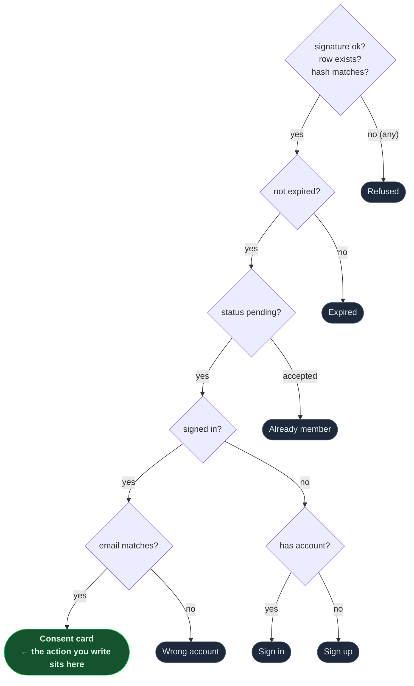

import Figure from '../../../components/figures/Figure.astro';
import Screenshot from '../../../components/figures/screenshot/Screenshot.astro';
import ExternalResource from '../../../components/ui/ExternalResource.astro';
import { CardGrid } from '@astrojs/starlight/components';
import CourseProgressBar from '../../../components/ui/CourseProgressBar.astro';
import Checklist from '../../../components/ui/checklist/Checklist.astro';
import ChecklistItem from '../../../components/ui/checklist/ChecklistItem.astro';
import AnnotatedCode from '../../../components/code/annotated-code/AnnotatedCode.astro';
import AnnotatedStep from '../../../components/code/annotated-code/AnnotatedStep.astro';

<CourseProgressBar value={frontmatter['course-progress']} />

A stranger who clicks the emailed invite link becomes a member of the org, at the exact role they were invited at.

Last lesson's `sendInvitation` built half the handshake: it wrote the `pending` row, hashed the token at rest, and mailed a signed `/accept-invite?id=&token=&sig=` URL.
The page on the other end is built too, and its arrival surfaces all render correctly: a refusal for a tampered link, an expired card for a stale one, "you're already in" for a redeemed one, a wrong-account card, a prefilled sign-up or sign-in when you have no session, and finally a consent card with an **Accept** button.
That button posts to an action that doesn't exist yet.

This lesson writes that action.
By the end, signing up through the prefilled flow and clicking **Accept** lands you on `/dashboard` with the invited org active, the new member row carrying the invited role, an `invitation.accepted` row at the head of the audit tail, and `user.emailVerified` flipped to `true`.

<Figure caption="The consent arrival surface: the one branch of the verify ladder that mounts the form posting to the acceptInvitation action you write in this lesson.">
  <Screenshot viewport="desktop">
    
  </Screenshot>
</Figure>

## Your mission

Accepting an emailed invite turns the recipient into a member of the inviting org at the role they were invited to hold.
The provided Server Component at `/accept-invite` does the gatekeeping: a fixed-order verify ladder — signature, row, hash, expiry, status, identity — picks exactly one of seven surfaces to render.
You write only the *action* behind the consent screen's **Accept** button, plus the one unscoped read the ladder uses to load the invitation.

The reflex this lesson turns on is the line between verifying a *render* and verifying a *write*.
The page checked everything before it drew the consent card, but the form POST is a new request: it carries its own body and hits a row that may have changed since the page rendered.
So the action re-fetches the row, re-hashes the token against the stored `tokenHash`, and re-checks expiry, status, and the signed-in email on its own.
The one thing it never checks is `sig`: the signature is the page's pre-database doorman, deciding whether to look up the row at all, and it is never passed to the action.

Several other decisions follow from that.
The action is **not** wrapped in `authedAction`, because the authority is the signed invitation, not a role the caller holds — a stranger with no membership anywhere is exactly who should succeed.
Its read, `getInvitationById`, is the project's one deliberately *unscoped* query, run through the unwrapped `db`: the invitee belongs to no org yet, so there is no tenant to scope to.
The seat-grant, status flip, email-verify flip, and audit row all co-transact inside one `withTenant` transaction keyed on the invitation's org.
Write them through the transaction handle directly: this is the only audit row inserted through `tx` rather than the shared `logAudit` helper, because `logAudit` derives its org from the acting member's session, and the accepter is not a member yet.
Switching the active org waits until **after** commit, since the plugin will not activate an org the caller cannot yet see.
And when the accepter is unverified, flip `emailVerified` in the same transaction: receiving the click on the invited address already proves they own it.

The **Accept** button is a consent gate, not a formality.
If accepting fired on a plain GET, a link-rewriter or URL crawler would consume the invite before the human saw it.
Two people racing the button resolve cleanly because the status flip is guarded on `status = 'pending'`, and email comparison is case-insensitive on both ends.

Out of scope: the verify ladder and the six other arrival surfaces are provided for you to read, not write, and there is no revoke or resend.

<Checklist id="mission">
  <ChecklistItem chip="tested">Clicking Accept on a valid pending invite while signed in with the matching email writes a member row carrying the invited role (not a hard-coded default).</ChecklistItem>
  <ChecklistItem chip="tested">Accepting flips the invitation to `accepted`, stamps `acceptedAt`, and appends one `invitation.accepted` audit row — all in a single transaction, so a failure in any one write rolls the seat-grant back along with its audit row.</ChecklistItem>
  <ChecklistItem chip="tested">Submitting a token whose `sha256` does not match the stored hash is refused, with no row written — the action re-verifies the hash itself.</ChecklistItem>
  <ChecklistItem chip="tested">Submitting while signed in with an email other than the invited one is refused, and the message names the address the invite was actually sent to.</ChecklistItem>
  <ChecklistItem chip="tested">Submitting an expired or already-accepted invitation is refused.</ChecklistItem>
  <ChecklistItem chip="tested">After accepting, the active org is the invited org, switched only once the membership is committed.</ChecklistItem>
  <ChecklistItem chip="tested">A user who was unverified at accept time is verified afterward, with no separate verification email sent.</ChecklistItem>
  <ChecklistItem chip="tested">Two simultaneous Accept submissions resolve to one success and one no-op — exactly one membership, never a duplicate seat.</ChecklistItem>
  <ChecklistItem chip="untested">Opening a valid pending URL while signed in with the matching email renders the Accept button alongside the org name, inviter name, and role.</ChecklistItem>
  <ChecklistItem chip="untested">A mangled `sig`, a missing row, and a hash mismatch all collapse to the same generic refusal — the public is never told which check failed.</ChecklistItem>
  <ChecklistItem chip="untested">Signed out with no account renders a prefilled sign-up that, on success, returns to the accept URL and then the Accept button; signed out with an existing account renders the prefilled sign-in.</ChecklistItem>
  <ChecklistItem chip="untested">After accepting, the redirect lands on `/dashboard` in the invited org.</ChecklistItem>
</Checklist>

## Coding time

Implement against the brief and the lesson's tests, then read the reference walkthrough.

<details>
<summary>Reference solution and walkthrough</summary>

Two files. The unscoped read comes first, since both the page and the action depend on it; then the action itself.

### The unscoped read

`getInvitationById` is the project's one deliberately unscoped query.
Every other read goes through `tenantDb(orgId)`, so forgetting the org filter fails to compile — but the invitee is not yet a member, so there is no org to scope to.
The signed token is the authorization, and the org is *derived* from the row once it loads.
So this read uses the unwrapped `db` and returns the full row for both the page's verify ladder and your action.

<div data-mark-color="blue">

```ts title="src/db/queries/invitations.ts" {7-10}
// getInvitationById is the deliberate non-scoped read: the invitee is not yet a
// member, so there is no tenant to scope to — the signed token is the authorization
// and the org is derived from the loaded row. Goes through the unwrapped db (never
// tenantDb), and returns the full row so the accept page's verify ladder and the
// accept action can read tokenHash / status / expiresAt / organizationId / role.
export const getInvitationById = async (id: string) =>
  (await db.query.invitation.findFirst({
    where: eq(invitation.id, id),
  })) ?? null;
```

</div>

The file's `import 'server-only'` from the previous lesson keeps this read out of any client bundle.

### The accept action

The action runs top to bottom: validate the form, re-verify the invitation independently of the page, check identity, do every write in one transaction, then switch the active org and redirect.

<AnnotatedCode lang="ts" maxLines={18} code={`
'use server';

import { and, eq } from 'drizzle-orm';
import type { Route } from 'next';
import { headers } from 'next/headers';
import { redirect } from 'next/navigation';
import { z } from 'zod';

import { auditLogs } from '@/db/audit';
import { getInvitationById } from '@/db/queries/invitations';
import { invitation, member, user } from '@/db/schema/auth';
import { withTenant } from '@/db/tenant';
import { auth, getCurrentUser } from '@/lib/auth';
import { sha256 } from '@/lib/invitations/url';
import type { Result } from '@/lib/result';
import { err } from '@/lib/result';

// Module-local, NOT exported: a "use server" module may export only async functions
// (Next 16.2.7 rejects a non-function export at runtime). id is the Better Auth
// invitation text id — z.string().min(1), never z.uuid().
const acceptInvitationSchema = z.strictObject({
  id: z.string().min(1),
  token: z.string(),
});

// Accept is NOT an authedAction: the signed invitation is the authority, not a role.
// The POST is a separate request from the page render, so the action re-verifies the
// token independently (hash / expiry / status) — sig is not an action input. The
// member insert, the invitation status flip (guarded on status='pending', the
// optimistic-concurrency / double-click guard), the emailVerified flip (the invite
// click IS the email-ownership proof, so no verify-your-email loop right after), and
// the 'invitation.accepted' audit row all co-transact in ONE withTenant tx, so a
// failure anywhere rolls the seat-grant back with its audit row. Direct tx writes
// throughout — never the plugin's own accept endpoint, whose after hooks run
// post-commit and would break the one-transaction audit contract.
//
// Deviation from the per-slice plan, forced by the installed surface: the audit row
// is inserted directly through tx rather than via the shared logAudit helper, because
// logAudit derives its org from the session's active org (requireOrgUser) — but the
// accepting user is not yet a member of any org, so that read resolves to nothing and
// redirects mid-transaction. The invitation row is the authority here, so org + actor
// come from it and the validated session user. setActiveOrganization is therefore the
// one auth.api write and runs AFTER commit: the installed plugin refuses to activate
// an org the caller is not yet a member of, and that membership is visible only once
// the tx commits.
export const acceptInvitation = async (
  _prev: Result<{ ok: true }> | null,
  formData: FormData,
): Promise<Result<{ ok: true }>> => {
  const parsed = acceptInvitationSchema.safeParse(Object.fromEntries(formData));
  if (!parsed.success) {
    return err('validation', 'This invitation link is malformed.');
  }
  const { id, token } = parsed.data;

  const currentUser = await getCurrentUser();
  const row = await getInvitationById(id);

  if (
    !row ||
    (await sha256(token)) !== row.tokenHash ||
    row.expiresAt < new Date() ||
    row.status !== 'pending'
  ) {
    return err('not_found', 'This invitation is no longer valid.');
  }

  if (!currentUser || currentUser.email.toLowerCase() !== row.email) {
    return err(
      'forbidden',
      \`This invitation was sent to \${row.email}. Sign in with that address to accept it.\`,
    );
  }

  const h = await headers();

  await withTenant(row.organizationId, async (tx) => {
    const [newMember] = await tx
      .insert(member)
      .values({
        id: crypto.randomUUID(),
        userId: currentUser.id,
        organizationId: row.organizationId,
        role: row.role ?? 'member',
        createdAt: new Date(),
      })
      .returning({ id: member.id });

    await tx
      .update(invitation)
      .set({ status: 'accepted', acceptedAt: new Date() })
      .where(and(eq(invitation.id, id), eq(invitation.status, 'pending')));

    if (!currentUser.emailVerified) {
      await tx
        .update(user)
        .set({ emailVerified: true })
        .where(eq(user.id, currentUser.id));
    }

    await tx.insert(auditLogs).values({
      organizationId: row.organizationId,
      actorUserId: currentUser.id,
      actorIp: h.get('x-forwarded-for'),
      actorUserAgent: h.get('user-agent')?.slice(0, 512),
      action: 'invitation.accepted',
      subjectType: 'invitation',
      subjectId: id,
      payload: { newMemberId: newMember?.id, role: row.role },
    });
  });

  await auth.api.setActiveOrganization({
    headers: h,
    body: { organizationId: row.organizationId },
  });

  redirect('/dashboard' as Route);
};
`}>
  <AnnotatedStep meta="{21-24}" color="blue">
    **The schema is module-local, not exported.** A `'use server'` module may export only async functions, so the Zod schema stays a private `const`. `id` is the Better Auth invitation text id (base62), validated `z.string().min(1)`, never `z.uuid()`.
  </AnnotatedStep>

  <AnnotatedStep meta="{59-66}" color="orange">
    **The validity guard re-verifies, collapsing four failures into one refusal.** The POST is a separate request from the page render, so the action re-checks the invitation independently: missing row, wrong token, expired, or no-longer-pending all return the same generic message. `sig` is absent here; it guards the page, never the action. Covers requirements 3 and 5.
  </AnnotatedStep>

  <AnnotatedStep meta="{68-73}" color="orange">
    **The identity guard names the invited address.** The invitation email was lowercased at write time, so only the session email needs lowercasing here. The message names `row.email` so a user on the wrong account knows which one to switch to. Covers requirement 4.
  </AnnotatedStep>

  <AnnotatedStep meta="{77-111}" color="green">
    **One transaction, four writes.** In order: insert the `member` row at the invited `role: row.role ?? 'member'`, capturing its id via `.returning`; flip the invitation to `accepted` guarded by `status = 'pending'` (so a second concurrent accept matches no row); verify the email if needed; and insert the audit row directly through `tx`. Covers requirements 1, 2, 7, and 8.
  </AnnotatedStep>

  <AnnotatedStep meta="{113-118}" color="violet">
    **Activate the org and redirect, after commit.** `setActiveOrganization` is the one `auth.api` write here and runs only after the transaction commits, because the plugin refuses to activate an org whose membership the caller cannot yet see. `redirect()` throws to end the action and send the new member to their dashboard. Covers requirements 6 and 12.
  </AnnotatedStep>
</AnnotatedCode>

Two writes break from the project's defaults, both forced by the same fact: the accepter is not yet a member.
The writes are hand-rolled `tx` inserts rather than Better Auth's own accept endpoint, whose `after` hooks would run post-commit and split the audit row out of the granting transaction.
And the audit row goes directly through `tx` instead of the shared `logAudit` helper, which resolves the acting org from the caller's membership and would find none mid-transaction; org and actor come from the invitation row and the session instead.
For why audit writes must share the work's transaction, see "Append-only audit_logs with RLS" earlier in this chapter.

The signed URL, token, and hash-at-rest were built last lesson; the action just re-runs `sha256` over the raw token and compares.

### The accept page and its verify ladder

Read `src/app/(auth)/accept-invite/page.tsx` once before running the tests.
You don't write it, but its ladder explains the action's re-verification: the page checks the same things in the same order and picks a surface, then your action re-checks them against the write.
Only the consent card branch mounts the form that posts to `acceptInvitation`; every other branch is a dead end the action never sees.

<Figure caption="The page's verify ladder runs in fixed order: integrity (signature, row, hash), then expiry, status, and identity, each failing check selecting one surface. The three integrity checks collapse to a single generic Refused surface, so the public never learns which failed. Only the all-pass leaf mounts the consent card, the surface your acceptInvitation action sits behind.">

</Figure>

</details>

<CardGrid>
  <ExternalResource
    title="Better Auth — Organization plugin"
    href="https://better-auth.com/docs/plugins/organization"
    icon="simple-icons:betterauth"
    description="Reference for acceptInvitation and setActiveOrganization — the plugin surface your action sits behind."
  />
  <ExternalResource
    title="Drizzle ORM — Transactions"
    href="https://orm.drizzle.team/docs/transactions"
    icon="simple-icons:drizzle"
    iconColor="#C5F74F"
    description="db.transaction(tx => …) and its roll-back-on-throw guarantee — the contract your four writes lean on."
  />
  <ExternalResource
    title="MDN — SubtleCrypto.digest()"
    href="https://developer.mozilla.org/en-US/docs/Web/API/SubtleCrypto/digest"
    icon="simple-icons:mdnwebdocs"
    description="The Web Crypto SHA-256 primitive your sha256 helper wraps to re-hash the token at compare time."
  />
  <ExternalResource
    title="Next.js — redirect()"
    href="https://nextjs.org/docs/app/api-reference/functions/redirect"
    icon="simple-icons:nextdotjs"
    description="Why redirect() throws to abort the action, and why it stays outside the transaction's try block."
  />
</CardGrid>

## Moment of truth

Run the lesson's test suite:

```bash frame="none"
pnpm test:lesson 6
```

You should see all suites pass:

```ansi frame="none"
[0;32m✓[0m tests/lessons/Lesson 6.test.ts [0;90m(9 tests)[0m
[0;32m Test Files [0m [0;32m1 passed[0m[0;90m (1)[0m
[0;32m      Tests [0m [0;32m9 passed[0m[0;90m (9)[0m
```

The suite drives your `acceptInvitation` action directly against the live Docker Postgres and the dev seed, creating and tearing down throwaway user and invitation rows for each case so the run stays repeatable.
It asserts the writes that matter.
A valid accept grants the seat at the *invited* role, flips the invitation to `accepted` with `acceptedAt` stamped, and appends exactly one `invitation.accepted` audit row; force-failing the audit write rolls all of that back, leaving no member, no status flip, no orphaned row.
The refusals write nothing: a token whose `sha256` doesn't match, an email that doesn't match (the message names the invited address), and an expired or already-accepted invite.
Finally, the active-org switch fires only *after* the membership commits, an unverified accepter ends up verified with no separate verification email, and two accepts in a row yield exactly one membership.

One prerequisite for the by-hand check: the accept-across-sessions step needs a **verified sending domain**, since Resend's sandbox sender won't deliver an invite to a personal inbox. Reuse the domain you verified earlier.

Continue from the pending invite you sent last lesson and confirm the rest by hand, ticking each off as you go.

<Checklist id="verify">
  <ChecklistItem chip="untested">Open the emailed URL in a private window: the prefilled sign-up surface renders. Sign up, get auto-redirected back to the accept URL, and the consent surface renders the Accept button.</ChecklistItem>
  <ChecklistItem chip="untested">Click Accept: you land on `/dashboard` with the invited org active. In the inspector, the new member row exists with the right role, the audit tail shows `invitation.accepted`, and `user.emailVerified` is `true`.</ChecklistItem>
  <ChecklistItem chip="untested">Flip one character of the `sig` query param in the URL: the generic refusal renders.</ChecklistItem>
  <ChecklistItem chip="untested">Re-open an already-accepted URL (use the seeded pending invite's Copy-accept-URL after accepting once, or hand-edit the row's `status`): the "you're already in" screen renders.</ChecklistItem>
  <ChecklistItem chip="untested">Sign in as Carol — a different email — and open the URL: the wrong-account refusal renders, naming the invited address.</ChecklistItem>
  <ChecklistItem chip="untested">Open the accept URL in two tabs and click Accept in both at once: one wins, the other is a no-op against the `status='pending'` filter, and exactly one membership exists.</ChecklistItem>
</Checklist>

That's the whole project: the invite handshake now runs end to end across all six arrival surfaces.
