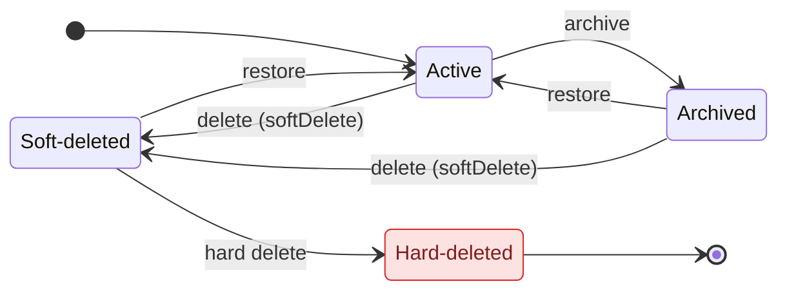

import CourseProgressBar from '../../../components/ui/CourseProgressBar.astro';
import Figure from '../../../components/figures/Figure.astro';
import LifecycleTabsMockup from '../../../components/lessons/061/1/LifecycleTabsMockup.astro';
import CodeVariants from '../../../components/code/code-variants/CodeVariants.astro';
import CodeVariant from '../../../components/code/code-variants/CodeVariant.astro';
import AnnotatedCode from '../../../components/code/annotated-code/AnnotatedCode.astro';
import AnnotatedStep from '../../../components/code/annotated-code/AnnotatedStep.astro';
import CodeTooltips from '../../../components/code/CodeTooltips.astro';
import Buckets from '../../../components/exercises/buckets/Buckets.astro';
import Bucket from '../../../components/exercises/buckets/Bucket.astro';
import Item from '../../../components/exercises/buckets/Item.astro';
import MultipleChoice from '../../../components/exercises/multiple-choice/MultipleChoice.astro';
import McqChoice from '../../../components/exercises/multiple-choice/McqChoice.astro';
import McqWhy from '../../../components/exercises/multiple-choice/McqWhy.astro';
import DrizzleSchemaCoding from '../../../components/live-coding/DrizzleSchemaCoding/DrizzleSchemaCoding.astro';
import Term from '../../../components/ui/Term.astro';
import ExternalResource from '../../../components/ui/ExternalResource.astro';
import { FileTree, CardGrid } from '@astrojs/starlight/components';

<CourseProgressBar value={frontmatter['course-progress']} />

A user clicks **Delete invoice**. Stop before you reach for `DELETE FROM` and ask the three questions an experienced engineer asks first: what vanishes from the screen, what survives in the database, and what — if anything — can come back. Now hold a second, separate scene next to it. A project is finished. The user wants it off their active list, out of the way, done — but emphatically *not* gone, because next quarter they might need to look at it. Same button? Same column? Same promise?

Those two scenes look identical in the UI and they are nothing alike underneath, and confusing them is how teams ship the bugs that surface the day after launch. Here are the two truths this lesson turns into code: most "deletes" a SaaS user clicks are *writes*, not row removals; and "archive" and "delete" are two different promises to the user even when they touch the same column. By the end you'll have a two-timestamp schema and three Server Actions — `softDelete`, `archive`, and `restore` — that drive the entire lifecycle of every row a user can touch.

## Soft delete versus hard delete

There are two completely separate decisions hiding inside the word "delete," and the whole lesson rests on keeping them apart. This is the first one: when the user removes something, does the row actually leave the table?

Start with the model you already have. A <Term definition="Removing the row from the table for good. Recovery is from backup only.">**hard delete**</Term> is the literal thing — `DELETE FROM invoices WHERE id = …`. The row is gone. Foreign keys either cascade the deletion to their children or block it, and your only path back is restoring from a backup, which in practice means it's not coming back. That's the right tool less often than you'd guess, but it's not exotic — hold onto it.

A <Term definition="Flagging a row as removed by setting a timestamp, instead of deleting it. The row stays in the table.">**soft delete**</Term> does something quieter. Instead of removing the row, you stamp it: `UPDATE invoices SET deleted_at = now() WHERE id = …`. The row is still sitting in the table, fully intact, with one new fact attached — *the moment it was deleted*. Restoring it is just clearing that stamp. The audit trail survives. Nothing referencing it broke, because nothing was removed.

There's a single sentence to carry out of this section, and it's the one that keeps paying off for the rest of the chapter: **soft delete is a write, not a delete.** Read it again. It sounds like wordplay; it's the most consequential property in this entire chapter. The instant a "delete" becomes an `UPDATE`, the row stays visible to anything that doesn't explicitly hide it — which means every read you've ever written is now a place this row can leak back into view. Park that thought. We'll come back to the bill it runs up.

The two operations look one keyword apart. The consequence is on a different planet.

<CodeVariants>
  <CodeVariant label="Hard delete">
    <div data-mark-color="red">

    ```ts ".delete(invoices)"
    await db
      .delete(invoices)
      .where(eq(invoices.id, invoiceId));
    ```

    </div>
    **The row is gone.** Recovery is from backup only — which is to say, not really.
  </CodeVariant>

  <CodeVariant label="Soft delete">
    <div data-mark-color="green">

    ```ts {3}
    await db
      .update(invoices)
      .set({ deletedAt: sql`now()` })
      .where(eq(invoices.id, invoiceId));
    ```

    </div>
    **The row stays.** Every read from now on has to remember to filter it out — that's the whole catch.
  </CodeVariant>
</CodeVariants>

So when do you reach for each? The trigger is about *re-reference and consequences*, not taste. Soft-delete anything a user might point at again or that casts a compliance shadow — invoices, projects, customers, the comment someone left on a thread. Hard-delete the ephemera no one ever re-references: session rows, password-reset tokens, draft autosaves the user never named, expired email-verification records. Treat it as a threshold rather than a rule: the more a record is woven into the rest of the system, the further it tilts toward soft delete.

Let's make that call a few times so it becomes reflex rather than recall.

<Buckets twoCol instructions="Drop each record into the deletion strategy you'd ship it with. Lean on the trigger, not the list: would a user (or an auditor) ever point at this row again?">
  <Bucket name="soft" label="Soft delete" description="Re-referenced or casts a compliance shadow — keep the row, stamp it" />
  <Bucket name="hard" label="Hard delete" description="Transient artifact no one re-references — drop the row" />

  <Item bucket="soft">A paid invoice</Item>
  <Item bucket="soft">A customer record</Item>
  <Item bucket="soft">A user's comment on a thread</Item>
  <Item bucket="hard">A password-reset token</Item>
  <Item bucket="hard">An expired email-verification row</Item>
  <Item bucket="hard">A draft autosave the user never named</Item>
</Buckets>

## Soft delete versus archive

Now the second decision, and it's the one that genuinely trips people. It has nothing to do with whether the row stays in the table — that question is already settled. This one is about what you *promise the user*.

A soft delete is **invisible**. The user clicks Delete, the row drops out of every list they can see, and from their point of view it's gone. The only way it ever resurfaces is through an admin, or a hidden "deleted items" view most products never even build. Restoring it is not something the user does in the normal course of their day; it's a recovery action, a safety net for "we removed that by mistake, can you get it back?"

An <Term definition="A visible lifecycle state the user moves a row into and can browse and restore from.">**archive**</Term> is **explicit**. The user clicks Archive, and the row moves somewhere they can still find it — an "Archived" tab they can open whenever they like. Restoring is a first-class thing they do themselves. The whole point of archiving is the user *expects* to see it again; you'd be breaking the contract if they couldn't.

Here's the part that makes this confusing, stated as plainly as I can: **these two often use the exact same column shape — `deletedAt` and `archivedAt` are both just nullable timestamps — but they are different promises to the user, surfaced through different parts of the UI.** Same storage primitive. Different product contract. If you remember one sentence from this section, that's the one. The database can't tell you which you meant; only the product decision can.

Because the storage is the same, the actual decision is a product one, and real apps land in one of three shapes. Naming all three is how you turn the course's pick from a habit into a reasoned choice:

- **Archive-only.** Every "remove" is really an archive — there's no separate user-facing delete at all. This is Notion pages, Linear projects: you archive, and that's the strongest "remove" the UI offers.
- **Soft-delete-only.** One "Delete" button, the row disappears, and restoring is admin-only. No archive concept exists in the product's vocabulary.
- **Both.** Archive means *"I'm done with this"*; soft delete is the recovery net under *"I deleted this by mistake."* Two different user intentions, two different surfaces.

This course commits to **both**, with a specific division of labor: **archive is the primary user surface, soft delete is the admin recovery surface.** The reasoning fits on one line — it hands users a self-service lifecycle they fully control (archive, browse, restore) while keeping a recovery net underneath that never clutters their view. The user lives in archive; soft delete is the floor that catches mistakes.

Now look at the whole lifecycle as one picture, because it's the map the rest of this lesson keeps pointing back to.

<Figure>

  <Fragment slot="caption">
    A row's state isn't a column you read — it's *derived* from two timestamps (`deletedAt`, `archivedAt`); the three actions are the edges that move it. An archived row can still be deleted (the `Archived → Soft-deleted` path — delete overrides archive). **Hard-deleted** is the one exit with no way back.
  </Fragment>
</Figure>

Read the diagram as the lesson's title made literal: **two timestamps, three actions.** A row's state isn't a field you look up — it's *derived* from whether `deletedAt` and `archivedAt` are set. `archive`, `softDelete`, and `restore` are the three edges that move the row between states. And notice the path from `Archived` straight to `Soft-deleted`: a row can be archived and *then* deleted, both timestamps set at once, with deleted winning as the effective state. The states aren't mutually exclusive flags; they're a small machine.

One quick check, because collapsing these two ideas back together is the single most common mistake on this topic.

<MultipleChoice>
  A user clicks **Archive** on a project, then goes looking for it again the next day. Pick the description that matches what actually happened in the database *and* what the user can do next.

  <McqChoice correct>The project's row never left the table — one timestamp column flipped from null to a time — and it now lives under an Archived tab the user can open and restore from on their own.</McqChoice>
  <McqChoice>The project vanishes from every list, the row is still in the table, but only an admin can bring it back — the user has no way to do it themselves.</McqChoice>
  <McqChoice>The row is gone from the table; getting the project back means restoring a database backup.</McqChoice>
  <McqChoice>Nothing was written — "Archived" is just a label the browser hides the row behind, so the state evaporates on the next request from another device.</McqChoice>

  <McqWhy>Archive is a *write that keeps the row* (`archivedAt` set, nothing removed) **and** a *visible lifecycle state the user controls* (an Archived tab with self-service restore). The second option describes soft delete's invisible, admin-only recovery; the third is a hard delete; the fourth would make the state non-persistent, but `archivedAt` is a real column on the row, so it survives across devices and requests.</McqWhy>
</MultipleChoice>

## The schema: two timestamps in a shared helper

The schema is the mechanical payoff of the decision you just made. You've committed to two lifecycle states a user can reach plus an admin recovery state, so the schema needs to encode three positions on the machine — and the cleanest encoding is two nullable timestamp columns.

It's worth naming the alternative so the pick is reasoned. You *could* model lifecycle as a single `status` enum — `active` | `archived` | `deleted` — and keep separate timestamps for the audit trail. It's a legitimate shape. But two nullable timestamps win on the things that matter here: the schema is simpler, the column names document themselves (`deletedAt` *is* the deletion timestamp, no enum-to-meaning lookup), the index story is identical either way, and — the deciding factor — a row can be archived *and* deleted at the same time, which an enum forces you to flatten into one value and lose. The senior instinct is to optimize the schema for the queries and the UI affordances it has to serve, not for the bragging rights of "look, one column."

You'll declare these columns on every entity table in the app — invoices, projects, customers, all of them get the same lifecycle. Repeating three column definitions across a dozen tables is exactly the kind of duplication that drifts out of sync the moment someone edits one copy. So you declare the shape once, in a small `lifecycleColumns` helper, and spread it into each table. Same convention everywhere, defined in one place.

<AnnotatedCode lang="ts" code={`
const lifecycleColumns = {
  deletedAt: timestamp({ withTimezone: true }),
  archivedAt: timestamp({ withTimezone: true }),
  updatedAt: timestamp({ withTimezone: true })
    .notNull()
    .defaultNow()
    .$onUpdate(() => new Date()),
};

export const invoices = pgTable('invoices', {
  id: uuid().primaryKey().$defaultFn(() => uuidv7()),
  organizationId: uuid().notNull(),
  amount: numeric({ precision: 12, scale: 2 }).notNull(),
  ...lifecycleColumns,
});
`}>
  <AnnotatedStep meta="{2-3}" color="blue">
    Both are nullable timestamps, and *nullable is the encoding*. A `null` timestamp means "this row is not in that state"; a set timestamp means "it entered that state, at this moment." No row is removed to express a lifecycle change — only a column flips from null to a time.
  </AnnotatedStep>

  <AnnotatedStep meta="{4-7}" color="blue">
    `updatedAt` carries the audit trail — when did this row last change. `$onUpdate` makes Drizzle stamp the column on *every* update it issues, so you never hand-set it. The caveat: `$onUpdate` is an application-layer value — it fires when drizzle-orm runs the UPDATE, not a database trigger — so a raw SQL UPDATE that bypasses Drizzle won't touch it. The `new Date()` here is the sanctioned exception to the "no `Date` in domain code" rule: this is the Drizzle storage seam, where `Date` is the boundary type. A later lesson leans on `updatedAt` to make concurrent edits honest.
  </AnnotatedStep>

  <AnnotatedStep meta="{14}" color="blue">
    One spread, and `invoices` has the full lifecycle shape. Every other entity table gets the same line. The shape is declared once; the tables consume it — change the lifecycle once and every table follows.
  </AnnotatedStep>
</AnnotatedCode>

A note on naming you'll see throughout the project's code. Columns are declared in camelCase (`deletedAt`) but stored in snake_case (`deleted_at`); that mapping is configured once on the Drizzle client (`casing: 'snake_case'`), so you write the TypeScript name and the SQL name follows automatically — you won't see an explicit `'deleted_at'` string on each column. And `timestamp({ withTimezone: true })` maps to Postgres `timestamptz`, which is the only timestamp type you should store an instant in.

Write the column shape once yourself — it sticks far better than reading it. The editor below runs a real Postgres in your browser, which can't use the client-level casing trick, so it spells column names out explicitly and uses a plain integer key; the lifecycle columns are what matter and they're identical to the project's.

<DrizzleSchemaCoding
  instructions="Add the three lifecycle columns to invoices: a nullable deleted_at, a nullable archived_at, and a non-null updated_at — each a withTimezone timestamp. deleted_at and archived_at stay nullable (a null means the row isn't in that state); updated_at is .notNull(). This editor has no client-level casing, so spell column names out in snake_case — the lifecycle shape is identical to the project's."
  starter={`export const invoices = pgTable('invoices', {
  id: integer('id').primaryKey().generatedAlwaysAsIdentity(),
  organizationId: integer('organization_id').notNull(),
  amount: numeric('amount', { precision: 12, scale: 2 }).notNull(),
  // add the three lifecycle columns below
});`}
  requirements={[
    {
      name: 'invoices',
      columns: [
        { name: 'id', type: 'integer', primaryKey: true },
        { name: 'organization_id', type: 'integer', notNull: true },
        { name: 'amount', type: 'numeric', notNull: true },
        { name: 'deleted_at', type: 'timestamp' },
        { name: 'archived_at', type: 'timestamp' },
        { name: 'updated_at', type: 'timestamp', notNull: true },
      ],
    },
  ]}
  probes={[
    {
      description: 'An invoice can be inserted with deleted_at and archived_at left unset — both are nullable, so an Active row needs neither',
      sql: `INSERT INTO invoices (id, organization_id, amount, updated_at)
        VALUES (1, 1, 100.00, now());`,
      mustSucceed: true,
    },
    {
      description: 'A soft-deleted invoice is just a row with deleted_at stamped — the same nullable column, now holding a time',
      sql: `INSERT INTO invoices (id, organization_id, amount, updated_at, deleted_at)
        VALUES (2, 1, 200.00, now(), now());`,
      mustSucceed: true,
    },
  ]}
/>

## The three actions: softDelete, archive, restore

The schema gives a row its possible states. The three Server Actions are the only sanctioned way to move it between them — the edges of that state machine, made executable.

All three return the same shape every Server Action in the course returns: `Result<T>`, the `{ ok: true, data } | { ok: false, error }` discriminated union you've been using since you first wrote an action. Nothing new there. And each one is genuinely tiny:

- `softDelete` sets `deletedAt = now()`.
- `archive` sets `archivedAt = now()`.
- `restore` clears whichever timestamp is set — back to `null`.

That brevity is the actual lesson here, so don't skim past it. Each action body is about three lines because two wrappers you already built do all the heavy lifting around it. The `authedAction(role, schema, fn)` wrapper lifts the session lookup, the role check, and the Zod parse out of the body, and hands the body a context whose `ctx.db` is *already* `tenantDb(orgId)` — the tenant-scoped client that pins every write to the active organization's rows. So the body neither parses, nor authorizes, nor re-derives the org: it just reaches for `ctx.db` and writes. The payoff of having built those wrappers is precisely this — the bespoke part of a lifecycle action shrinks to one `update`.

<CodeVariants>
  <CodeVariant label="softDelete">
    <div data-mark-color="green">

    ```ts {7}
    export const softDeleteInvoice = authedAction(
      'member',
      z.object({ id: z.uuid() }),
      async (input, ctx) => {
        await ctx.db
          .update(invoices)
          .set({ deletedAt: sql`now()` })
          .where(eq(invoices.id, input.id));
        revalidatePath('/invoices');
        return ok(null);
      },
    );
    ```

    </div>
    **Stamps `deletedAt` with the current time.** The row leaves every user-facing list; an admin can still recover it.
  </CodeVariant>

  <CodeVariant label="archive">
    <div data-mark-color="green">

    ```ts {7}
    export const archiveInvoice = authedAction(
      'member',
      z.object({ id: z.uuid() }),
      async (input, ctx) => {
        await ctx.db
          .update(invoices)
          .set({ archivedAt: sql`now()` })
          .where(eq(invoices.id, input.id));
        revalidatePath('/invoices');
        return ok(null);
      },
    );
    ```

    </div>
    **Stamps `archivedAt`.** The row moves to the Archived tab, where the user can find and restore it.
  </CodeVariant>

  <CodeVariant label="restore">
    <div data-mark-color="green">

    ```ts {7}
    export const restoreInvoice = authedAction(
      'member',
      z.object({ id: z.uuid() }),
      async (input, ctx) => {
        await ctx.db
          .update(invoices)
          .set({ deletedAt: null, archivedAt: null })
          .where(eq(invoices.id, input.id));
        revalidatePath('/invoices');
        return ok(null);
      },
    );
    ```

    </div>
    **Clears *both* timestamps, returning the row to Active** — and returns `ok` even when nothing actually changed.
  </CodeVariant>
</CodeVariants>

The `where` clause carries only the id predicate — `ctx.db` already folds in the org scope, so tenancy is never hand-typed here. (The lifecycle filter on these UPDATEs — only touching non-deleted rows — is the structural concern the next lesson generalizes.) The four shared identifiers, each a concept you already own, are worth a hover:

<CodeTooltips tooltips={{
  authedAction: 'The RBAC wrapper from an earlier chapter: lifts session, role check, and Zod parse out of the action body.',
  'ctx.db': 'Already tenantDb(orgId) — the wrapper built the tenant-scoped client and handed it down, so every write here is pinned to the active org\'s rows.',
  revalidatePath: 'Invalidates the cached list after the write so the soft-deleted row actually leaves the screen on the next render.',
  ok: 'Builds the { ok: true, data } half of the Result contract.',
}}>
```ts
export const softDeleteInvoice = authedAction(
  'member',
  z.object({ id: z.uuid() }),
  async (input, ctx) => {
    await ctx.db
      .update(invoices)
      .set({ deletedAt: sql`now()` })
      .where(eq(invoices.id, input.id));
    revalidatePath('/invoices');
    return ok(null);
  },
);
```
</CodeTooltips>

Look at what the structure bought you. Every Server Action in the course follows the same five seams — **parse, authorize, mutate, revalidate, return**. Here the wrappers own *parse* and *authorize*, the body owns *mutate*, and `revalidatePath` fires the *revalidate* before the *return*. Don't gloss over that revalidate step: skip it and the row you just soft-deleted stays sitting on the user's screen because nothing told the cached list to re-fetch. A delete that doesn't visibly delete is a real bug, and it's a one-line one.

`restore` hides the one genuinely non-obvious decision in the trio, so let's make sure it landed.

<MultipleChoice>
  A user double-clicks **Restore** on a row that was already active. The second call runs `set({ deletedAt: null, archivedAt: null })` against a row whose timestamps were already `null`, so the UPDATE touches no real state — and the action still returns `ok`. Why is `ok`, not an error, the right return for that second call?

  <McqChoice correct>`restore` is written to be idempotent: it declares a target state — "this row is active" — and that state already holds, so repeating the call is a safe no-op and reporting success is the honest answer.</McqChoice>
  <McqChoice>An error would describe the second call more precisely, but the `Result` union has no variant that can express "the row was already in the requested state."</McqChoice>
  <McqChoice>Overwriting a column with the value it already holds still counts as a real change, so the second call isn't actually a no-op and there's nothing to special-case.</McqChoice>
  <McqChoice>A Server Action that issues a syntactically valid UPDATE is required by the framework to resolve as `ok`, regardless of how many rows it changed.</McqChoice>

  <McqWhy>The first option is correct. `restore` is designed to be **idempotent** — it asserts a desired end state ("be active") rather than a one-time transition, so a retried or double-clicked call on an already-active row must not surface an error. The second option is wrong because `Result` could carry an "unchanged" signal trivially; choosing `ok` is a deliberate idempotency decision, not a type limitation. The third is wrong because writing `null` over an already-`null` column changes nothing — the no-op case is real, which is exactly why the question matters. The fourth invents a rule that doesn't exist: an UPDATE affecting zero rows is still a successful round-trip, and the action *chooses* to call that success.</McqWhy>
</MultipleChoice>

## The UI affordances and the visibility filter

The actions are the verbs. Now wire them to what the user actually sees and touches, which is also where the URL-state work from the previous chapter composes back in.

Each lifecycle state gets exactly one affordance, and getting the mapping right is most of the user-facing design:

- **Archive** is a button on every active row — and, because users archive in batches, a bulk action across selected rows too.
- **Restore** is a button on rows sitting in the **Archived** tab. That's where the user goes looking for "the thing I put away," so that's where the way back lives.
- **Hard delete** is a destructive button that lives *on the archive view*, behind a confirm dialog, often restricted by role. It is never the default row action. Permanent deletion is the deliberate, confirmed, gone-for-good path — you have to mean it.

Which list a user is looking at is itself URL state, and it's exactly the shape you built in the previous chapter. The list filter is **tri-state**: `active` is the default (archived and deleted rows both hidden), `archived` is the Archived tab, and `all` is an admin view that includes soft-deleted rows. That last one is gated — a normal user never sees soft-deleted rows by design. This rides directly on the URL-state vocabulary you already have: a `?status=archived` parameter read through the same `parseAsStringEnum(['active', 'archived', 'all']).withDefault('active')` parser you wrote for filters. Nothing new to learn — the mechanics are the previous chapter's; you're just pointing the same tool at the lifecycle.

<Figure>
  <LifecycleTabsMockup />
  <Fragment slot="caption">
    The tab the user is on is just URL state — `?status=archived` is the whole difference between the Active and Archived lists. The actions a row offers depend on the lifecycle state it's in, and the user sees the *label* "Archived" with a way back, never the raw `deletedAt`. **Delete** is the destructive, confirm-gated path, restricted by role — never the default row action.
  </Fragment>
</Figure>

A few usability watch-outs belong right here, attached to the affordances they qualify rather than dumped in a list somewhere. Archive *without* a visible Archived tab is a usability bug, full stop — you let the user put something away and then gave them no way to find it again. Hard delete *without* a confirm dialog is destructive UX waiting to ruin someone's afternoon. And never, ever expose the internal `deletedAt` to the user as "deleted." To the user a row is one of two things: *gone from the UI entirely* (that's soft delete) or *labeled "Archived" with a way back* (that's archive). It is never a raw timestamp and never the word "deleted" on a row they can still see. The internal column is your plumbing; the user gets a promise, not the plumbing.

## Restore semantics: what comes back

Restore is where students quietly assume magic happens, so let's make the absence of magic explicit.

When you clear the timestamp, the row returns to Active — and everything it was connected to comes back *with* it, automatically, because nothing was ever disconnected. Its foreign keys still point where they pointed. Its child rows are still its children. This falls straight out of the sentence from the start of the lesson: soft delete is a write, not a delete, so there was never anything to reconnect. The references survived the whole time.

That said, restore inherits whatever your delete did, and there are two traps worth seeing now.

```ts
await ctx.db
  .update(invoices)
  .set({ deletedAt: null, archivedAt: null })
  // line items were never deleted — they survived the soft delete and snap back with the parent
  .where(eq(invoices.id, input.id));
```

The first trap is about **cascading restore** — restoring an invoice and having its line items come back too. That's correct *only when* the delete cascaded in the first place. The rule is symmetry: **cascade the restore exactly when you cascaded the soft delete.** If deleting the parent stamped the children too, restoring the parent should clear them too; the two operations have to mirror each other or the data ends up half-restored.

The second trap is the orphan, and it comes in two flavors. If your children were *hard*-deleted when the parent was soft-deleted — a bad pattern, but it ships in real codebases — then restore simply cannot bring them back; they're gone, and you've restored a parent with missing pieces. That's the strongest argument for keeping soft-delete cascades together. The subtler flavor: restore a *child* whose *parent* is still soft-deleted, and you've produced a row that's visible in the UI while its parent isn't — a thing pointing at nothing the user can see. You guard it by checking the parent's state before restoring. Surfacing that conflict *cleanly* — telling the user "you can't, the parent is gone" instead of silently producing an orphan — is concurrency machinery a later lesson in this chapter builds; for now, just know the hazard is there and has a name.

## Soft delete is a write — the bill comes due

Time to pay the bill that sentence ran up. "Soft delete is a write, not a delete" has two structural consequences, and naming them honestly is the bridge into the rest of this chapter — because the relief from both arrives in later lessons, and you can't feel relief from a pain you never felt.

**Consequence one: every read is now a code path that can leak.** The soft-deleted row is still in the table, so anything that doesn't *explicitly* exclude it will pull it right back in. A `count` over invoices that forgets `deletedAt IS NULL` returns a number that's too high. A join from customers to invoices that forgets it drags deleted rows into the result set. The list, the detail page, the monthly report — each one is a *separate* place to remember the filter, and each one looks completely correct when you forget. This is the canonical SaaS data-leak failure mode, and in a multi-tenant app the truly bad version is a query that misses the lifecycle filter *and* the tenancy filter at once — now a deleted row from one customer is showing up to another. Here's the uncomfortable part: code review barely helps, because the broken query reads exactly like the correct one — the bug is in what *isn't* there. The structural fix — making the filtered shape the *only* shape that compiles, so forgetting it isn't an option — is the next lesson in this chapter. That's all I'll say about it; feel the problem first.

**Consequence two: `ON DELETE CASCADE` does not fire on a soft delete.** This one catches nearly everyone. You set up a foreign key with `onDelete: 'cascade'`, you ship the soft-delete action, and you assume the children are handled. They are not — because no `DELETE` happened. You ran an `UPDATE`. The cascade is wired to an event that never occurs, and it sits there doing nothing while lulling every reviewer who spots it into thinking deletes are covered. The senior move is to make the cascade explicit and atomic: soft-delete the parent and its children in the **same transaction**, threading `tx` through both updates. Skip the transaction and an error mid-way leaves you with a soft-deleted parent and live children — orphans, visible, half-deleted. That's not a hypothetical; that's the bug you write a test for.

<CodeVariants>
  <CodeVariant label="Looks handled, isn't">
    <div data-mark-color="red">

    ```ts "onDelete: 'cascade'"
    export const invoiceLines = pgTable('invoice_lines', {
      id: uuid().primaryKey().$defaultFn(() => uuidv7()),
      invoiceId: uuid()
        .notNull()
        .references(() => invoices.id, { onDelete: 'cascade' }),
    });

    // inside the action body — only the parent is touched:
    await ctx.db
      .update(invoices)
      .set({ deletedAt: sql`now()` })
      .where(eq(invoices.id, input.id));
    ```

    </div>
    **The FK cascade is wired to `DELETE`. The soft delete is an `UPDATE`.** The cascade never fires — the line items are now orphaned.
  </CodeVariant>

  <CodeVariant label="Cascade by hand, in one transaction">
    <div data-mark-color="green">

    ```ts "db.transaction"
    await db.transaction(async (tx) => {
      await tx
        .update(invoices)
        .set({ deletedAt: sql`now()` })
        .where(and(eq(invoices.id, input.id), eq(invoices.organizationId, ctx.orgId)));
      await tx
        .update(invoiceLines)
        .set({ deletedAt: sql`now()` })
        .where(eq(invoiceLines.invoiceId, input.id));
    });
    ```

    </div>
    **Soft-delete the parent and its children together, in one transaction — all or nothing.** This uses the raw `db` (not `ctx.db`) and threads `tx` through both updates, so the org predicate is written out by hand here — `ctx.orgId` is the org the wrapper already resolved.
  </CodeVariant>
</CodeVariants>

<MultipleChoice>
  A developer adds `onDelete: 'cascade'` to the `invoice_lines` foreign key, ships the `softDeleteInvoice` action, and reviews the PR confident the children are handled. An invoice is then soft-deleted. What is the actual state of its line items afterward?

  <McqChoice correct>They sit there untouched — still in the table, still pointing at a now-deleted parent — because the cascade is bound to a `DELETE` event that the soft delete's `UPDATE` never triggered.</McqChoice>
  <McqChoice>They get their own `deletedAt` stamped automatically, since the FK cascade carries the parent's column change down to every child row.</McqChoice>
  <McqChoice>They block the operation: the soft delete fails with a foreign-key violation because live children still reference the parent the developer is trying to remove.</McqChoice>
  <McqChoice>They are removed from the table for good, because a `cascade` foreign key deletes the children whenever the parent leaves the active set, however that happens.</McqChoice>

  <McqWhy>`ON DELETE CASCADE` fires on exactly one event — a real `DELETE` of the parent row. A soft delete issues an `UPDATE` (it sets `deletedAt`), so the cascade is wired to something that never happens and does nothing. The line items are left as orphaned, still-visible rows unless the action updates them itself, which is why the cascade has to be done by hand in the same transaction. The second option is wrong because cascade propagates row deletions, not arbitrary column writes. The third is wrong because the parent row is never removed, so no FK constraint is violated and the `UPDATE` succeeds. The fourth invents a behavior cascade doesn't have — it keys off `DELETE`, not "left the active set."</McqWhy>
</MultipleChoice>

## Uniqueness and the hot path: partial indexes

There's one more class of bug that soft delete introduces, and it's the one that distinguishes a toy implementation from a production one. Both fixes are the same Postgres feature — a <Term definition="An index that covers only the rows matching a WHERE predicate.">**partial index**</Term> — applied to two different problems.

**The correctness problem: uniqueness breaks after a soft delete.** Picture a plain unique constraint on `(organizationId, slug)` for projects. A user soft-deletes a project named "Acme," then tries to create a new "Acme" — and the database refuses, because the soft-deleted row *still holds that slug*. It's still in the table; the unique constraint can still see it. From the user's side this is baffling: they deleted it, why can't they reuse the name? The fix is to make the uniqueness rule ignore deleted rows — a *partial* unique index that only applies `WHERE deleted_at IS NULL`. Now uniqueness is enforced among the *live* rows, exactly where it should be, and the soft-deleted "Acme" is invisible to the constraint.

There are two footguns in expressing this in Drizzle, and both bite silently, so read carefully. First, Drizzle's `.unique()` shorthand cannot carry a `WHERE` clause at all — you have to reach for `uniqueIndex().on(...).where(...)`. Second, and nastier: the predicate inside that `.where()` **must** be a raw `` sql`` `` fragment. If you write it with a helper like `eq(t.deletedAt, null)`, Drizzle emits a broken parameterized clause into the generated migration and your partial index silently doesn't do what you think. Write it as `` sql`${t.deletedAt} is null` `` and nothing else. This is the most frequent soft-delete bug after forgetting the read filter — name it, and never write it the other way.

**The performance problem: the hot read path.** The "active rows" query runs constantly — it's the default list view, fired on basically every page load. A partial composite index on `(organization_id, created_at) WHERE deleted_at IS NULL` keeps that index small and the scan tight by indexing *only* the rows the active query ever returns. Why index the deleted rows at all if no hot query ever reads them? The senior reach is to pair a hot composite index with `WHERE deleted_at IS NULL` whenever the read path always filters deleted rows out. But — defaults before conditionals — skip the partial when the table is small or the deleted ratio is tiny; a plain composite index covers both cases without the extra moving part. As with every tenant-scoped index, lead the columns with `organizationId`.

<AnnotatedCode lang="ts" code={`
export const projects = pgTable(
  'projects',
  {
    id: uuid().primaryKey().$defaultFn(() => uuidv7()),
    organizationId: uuid().notNull(),
    slug: text().notNull(),
    createdAt: timestamp({ withTimezone: true }).notNull().defaultNow(),
    ...lifecycleColumns,
  },
  (t) => [
    uniqueIndex('projects_org_slug_unique')
      .on(t.organizationId, t.slug)
      .where(sql\`\${t.deletedAt} is null\`),
    index('idx_projects_org_created_partial')
      .on(t.organizationId, t.createdAt)
      .where(sql\`\${t.deletedAt} is null\`),
  ],
);
`}>
  <AnnotatedStep meta="{11-13}" color="green">
    This is the partial *unique* index. The `WHERE deleted_at IS NULL` is what lets the user re-create "Acme" after deleting the old one — uniqueness now applies only among live rows, so the soft-deleted "Acme" is invisible to the constraint.
  </AnnotatedStep>

  <AnnotatedStep meta="{13}" color="green">
    Two things to internalize. `.unique()` shorthand can't express a partial index, which is why this is `uniqueIndex().where()`. And the predicate must be a raw `` sql`` `` fragment — a helper like `eq(t.deletedAt, null)` emits a broken clause into the migration. This exact line is the correct form.
  </AnnotatedStep>

  <AnnotatedStep meta="{14-16}" color="green">
    The partial *composite* index on the hot active-rows path — small index, tight scan, because it only covers rows the active query returns. Carve-out: skip it when the table is small or few rows are ever deleted; a plain composite covers those without the complexity. Note the naming convention — explicit names, `_partial` suffix for partial indexes, `<table>_<cols>_unique` for uniques.
  </AnnotatedStep>
</AnnotatedCode>

This is the one place in the lesson where you can *feel* the bug and the fix fire against a real database, so it's worth doing rather than reading.

<DrizzleSchemaCoding
  instructions="Add a partial unique index to projects so (organization_id, slug) is unique among live rows only — a soft-deleted slug can be reused, but two live duplicates can't. Add it in the table-extension array at the bottom: uniqueIndex('projects_org_slug_unique').on(t.organizationId, t.slug).where(sql`...`), with the predicate written as a raw sql fragment that reads deleted_at is null. (This editor has no client-level casing, so column names are spelled out in snake_case and the PK is a plain integer — the index shape is identical to the project's.)"
  starter={`export const projects = pgTable(
  'projects',
  {
    id: integer('id').primaryKey().generatedAlwaysAsIdentity(),
    organizationId: integer('organization_id').notNull(),
    slug: text('slug').notNull(),
    deletedAt: timestamp('deleted_at', { withTimezone: true }),
  },
  (t) => [
    // add the partial unique index here
  ],
);`}
  requirements={[
    {
      name: 'projects',
      columns: [
        { name: 'id', type: 'integer', primaryKey: true },
        { name: 'organization_id', type: 'integer', notNull: true },
        { name: 'slug', type: 'text', notNull: true },
        { name: 'deleted_at', type: 'timestamp' },
      ],
    },
  ]}
  probes={[
    {
      description:
        'A soft-deleted "acme" (deleted_at stamped) and a fresh live "acme" in the same org can coexist — the partial index ignores the deleted row',
      sql: `INSERT INTO projects (id, organization_id, slug, deleted_at) VALUES (1, 1, 'acme', '2026-01-01T00:00:00Z');
        INSERT INTO projects (id, organization_id, slug, deleted_at) VALUES (2, 1, 'acme', NULL);`,
      mustSucceed: true,
    },
    {
      description:
        'Two live "globex" rows in the same org (both deleted_at NULL) are rejected — uniqueness still holds among live rows',
      sql: `INSERT INTO projects (id, organization_id, slug, deleted_at) VALUES (3, 2, 'globex', NULL);
        INSERT INTO projects (id, organization_id, slug, deleted_at) VALUES (4, 2, 'globex', NULL);`,
      mustSucceed: false,
    },
  ]}
/>

## Where the deeper concerns live

Two things sit right at the edge of this lesson's territory. The lesson has to name them — because getting their boundaries wrong is a costly mistake — but it doesn't own either, and conflating them with soft delete is exactly the junior error to head off.

:::caution
**Soft delete is not an audit log, and it is not GDPR compliance.** Two separate boundaries, both worth getting right.

Every soft-delete, archive, and restore *should* write a row to an audit log, in the same transaction as the action — but the lifecycle timestamp on the row and the audit log are different things. The row's state is the *current truth*; the audit log is the *history*. Restoring a row clears its `deletedAt`, but it does not — and must not — erase the deletion from the log. The audit-log table itself comes later in the course; here, just hold the distinction.

And soft delete satisfies *no* compliance deletion. A <Term definition="The EU's data-protection regulation; its erasure right requires personal data actually removed or anonymized on request.">**GDPR**</Term> erasure request requires the data actually gone or anonymized beyond recovery; soft delete leaves it fully intact in the table, which is the opposite of erased. These are two distinct flows: the everyday "Delete" button a user clicks is a soft delete; a GDPR pipeline is a separate path that nullifies personal data or hard-deletes the row. Same English word, completely different machinery — never let "we soft-delete" stand in for "we comply."
:::

## The reference shape, end to end

Pull it together into the one shape the rest of this chapter reuses. You haven't written much bespoke code — that was the point — but the pieces now form a complete lifecycle for the invoice:

- the `lifecycleColumns` helper, spread into `invoices`;
- the three actions — `softDeleteInvoice`, `archiveInvoice`, `restoreInvoice` — each three lines inside the `authedAction` + `tenantDb` composition;
- the migration carrying the partial unique index and the partial composite index;
- the Archived tab, filtered through `?status=archived` on the URL-state machinery from the previous chapter.

Here's where each piece lives in the codebase, which also quietly previews where the next lesson's work will go.

<Figure>
<FileTree>
- src/
  - db/
    - **schema.ts** the `lifecycleColumns` helper + the entity tables + the partial unique & composite indexes
    - queries/
      - **invoices.ts** *next lesson* — the home for the tenant-scoped read helpers that make the `deletedAt IS NULL` filter impossible to forget
  - app/
    - invoices/
      - **actions.ts** `softDeleteInvoice`, `archiveInvoice`, `restoreInvoice`
      - page.tsx the list view + the `Active | Archived | All` tabs, driven by `?status=`
</FileTree>
  <Fragment slot="caption">
    The reference shape, grounded in the canonical layout: the schema declares the two timestamps and their indexes, `actions.ts` holds the three edges, and the list page reads the tab from URL state. The one empty room is `db/queries/invoices.ts` — *next lesson* fills it with the read helpers that make forgetting the lifecycle filter impossible.
  </Fragment>
</Figure>

That's the reference shape. The next lesson makes the reads safe — so a hand-written query physically can't forget the lifecycle filter — and the lesson after that makes concurrent edits honest, so two tabs saving the same invoice can't silently clobber each other. You've laid the foundation both of them build on: a row whose state is two timestamps, moved by three actions.

## External resources

The lesson commits to soft delete and archive; a senior engineer also knows the case *against* the pattern and the exact Postgres and Drizzle primitives that make it safe.

<CardGrid>
  <ExternalResource
    title="PostgreSQL — Partial Indexes"
    href="https://www.postgresql.org/docs/current/indexes-partial.html"
    icon="simple-icons:postgresql"
    iconColor="#4169E1"
    description="The authoritative reference: enforcing uniqueness on a subset of rows and the WHERE predicate that powers the deleted_at IS NULL index."
  />
  <ExternalResource
    title="Drizzle ORM — Indexes & Constraints"
    href="https://orm.drizzle.team/docs/indexes-constraints"
    icon="simple-icons:drizzle"
    iconColor="#C5F74F"
    description="The exact API the lesson uses — uniqueIndex().on().where() and the raw sql predicate that the .unique() shorthand can't express."
  />
  <ExternalResource
    title="Soft Deletion Probably Isn't Worth It"
    href="https://brandur.org/soft-deletion"
    icon="simple-icons:ghost"
    iconColor="#212121"
    description="Brandur's well-known counterpoint: undeletion rarely happens, FKs break, and a deleted_record table may serve you better. Read it to weigh the trade-off yourself."
  />
  <ExternalResource
    title="Postgres FM — Soft delete"
    href="https://postgres.fm/episodes/soft-delete"
    icon="simple-icons:postgresql"
    iconColor="#336791"
    description="A 38-minute practitioner discussion of soft-delete use cases and implementation options, with a full transcript for skimmers."
  />
</CardGrid>
