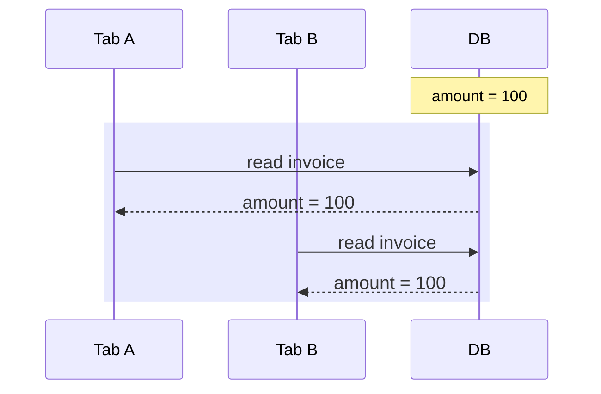
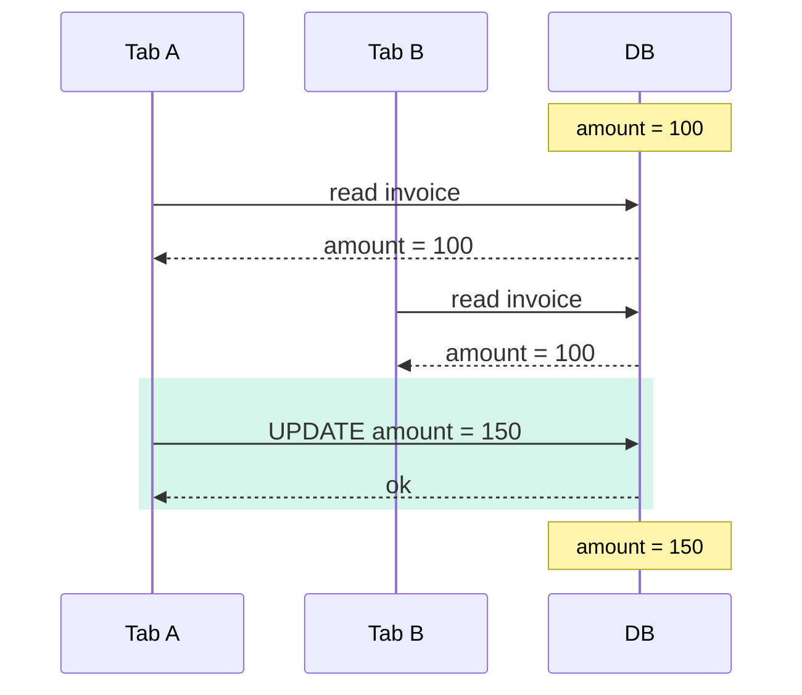
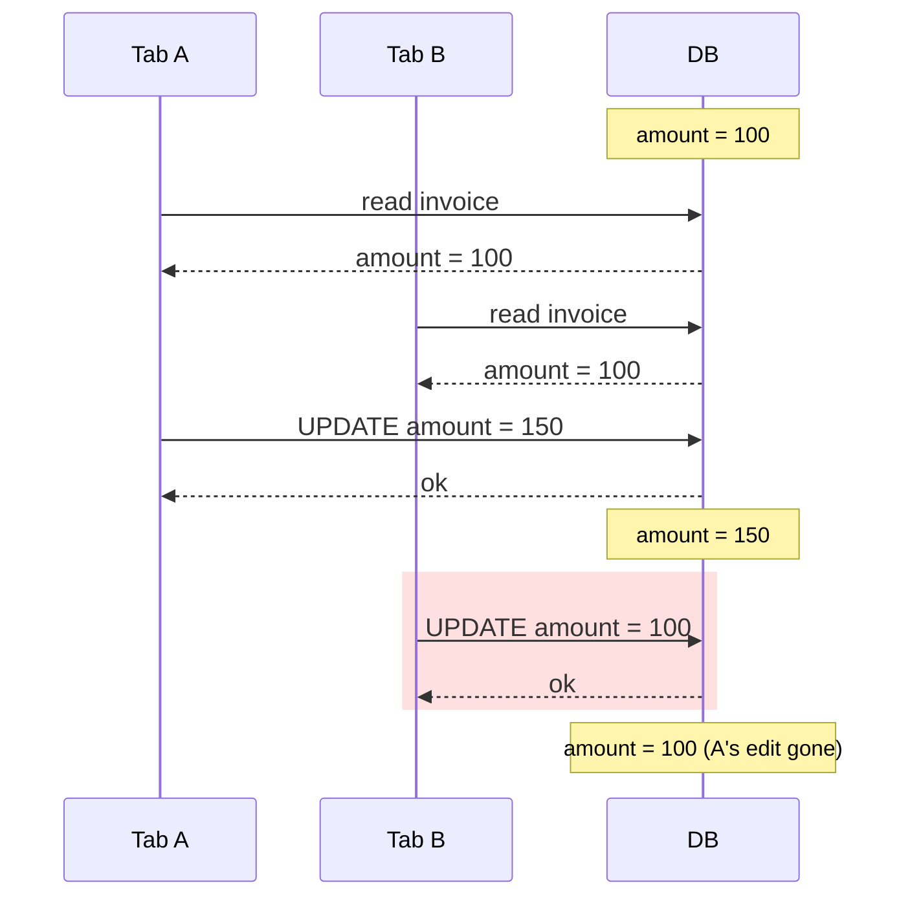
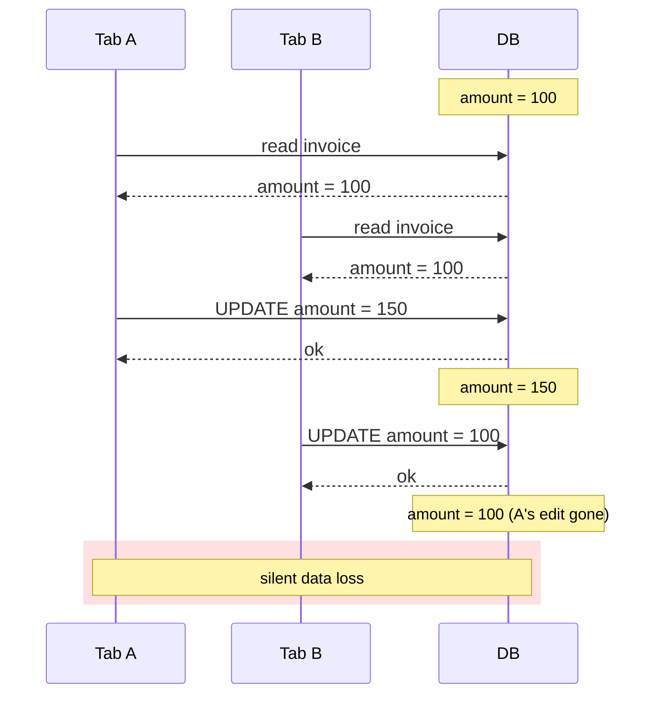

import AnnotatedCode from '../../../components/code/annotated-code/AnnotatedCode.astro';
import AnnotatedStep from '../../../components/code/annotated-code/AnnotatedStep.astro';
import CodeVariants from '../../../components/code/code-variants/CodeVariants.astro';
import CodeVariant from '../../../components/code/code-variants/CodeVariant.astro';
import CodeTooltips from '../../../components/code/CodeTooltips.astro';
import DiagramSequence from '../../../components/figures/diagram-sequence/DiagramSequence.astro';
import DiagramStep from '../../../components/figures/diagram-sequence/DiagramStep.astro';
import StateMachineWalker from '../../../components/figures/state-machine-walker/StateMachineWalker.astro';
import Question from '../../../components/figures/state-machine-walker/Question.astro';
import Branch from '../../../components/figures/state-machine-walker/Branch.astro';
import Leaf from '../../../components/figures/state-machine-walker/Leaf.astro';
import Figure from '../../../components/figures/Figure.astro';
import MutationStateMachineStrip from '../../../components/lessons/061/3/MutationStateMachineStrip.astro';
import ReactCoding from '../../../components/live-coding/ReactCoding/ReactCoding.astro';
import ExternalResource from '../../../components/ui/ExternalResource.astro';
import Term from '../../../components/ui/Term.astro';
import VideoCallout from '../../../components/embeds/VideoCallout.astro';
import { CardGrid } from '@astrojs/starlight/components';
import CourseProgressBar from '../../../components/ui/CourseProgressBar.astro';

<CourseProgressBar value={frontmatter['course-progress']} />

Two people on the same team open the same invoice. Alice and Bob both click "Edit," and both forms load with `amount: 100`. Alice bumps the amount to 150 and saves — done, the database now holds 150. A minute later Bob, still looking at his form that says 100, fixes a typo in the customer note and saves. His save writes the *whole* form back: the corrected note, and `amount: 100`, because that's still what his stale form held. Alice's 150 is gone. No error fired. Nothing logged. Alice finds out three days later when the invoice is short fifty dollars and nobody can explain why.

This is the kind of bug that never shows up in a demo, because a demo has one tab open. It shows up in production the first week real users edit the same records, and it is genuinely hard to diagnose after the fact — there's no exception, no stack trace, just a value that quietly reverted. By the end of this lesson you'll know exactly why it happens, how a single extra `WHERE` condition detects it, and — the part that actually matters — how to turn that detection into a moment where the user *sees* what changed and decides what to do, instead of silently clobbering a coworker's work.

You already have most of the machinery. In the previous lessons of this chapter your lifecycle actions put predicates in the UPDATE's `WHERE` — the tenant scope rides in `ctx.db`, the lifecycle filters keep you off deleted rows. This lesson adds *one more predicate to that same clause*, and the React surface that makes its failure honest. One `WHERE` condition, plus the UX around it. That's the whole lesson.

## Two tabs, one invoice, one lost edit

Let's slow the disaster down and watch it frame by frame. The thing that makes it dangerous is *timing* — the writes interleave in a way that's invisible from inside either tab. Each tab does something completely reasonable. The damage only exists in the gap between them.

Step through the sequence below. There are two browser tabs and one database. Watch what the database holds after each write, and watch the moment the loss happens.

<DiagramSequence>
  <DiagramStep caption="Both tabs open the invoice. Each reads amount = 100. Both forms now hold a value that was true at read time.">

  </DiagramStep>

  <DiagramStep caption="Tab A saves 150. The database now holds 150. From Tab A's point of view, everything is correct.">

  </DiagramStep>

  <DiagramStep caption="Tab B saves. Its form still holds the stale 100 it read in step 1, so its UPDATE writes amount = 100 — overwriting Tab A's 150. The database is back to 100.">

  </DiagramStep>

  <DiagramStep caption="Tab A's edit is gone. No error was raised, nothing was logged. Both writes 'succeeded'. This is last-write-wins, and it's the default behavior of every naive UPDATE.">

  </DiagramStep>
</DiagramSequence>

What you just watched has a name: <Term definition="The default outcome of concurrent writes to the same row — whichever UPDATE runs last overwrites the others, with no detection.">last-write-wins</Term>. It is the default behavior of any `UPDATE ... SET ... WHERE id = ?`. The database did exactly what it was told both times. The problem isn't the database — it's that Bob's UPDATE had no way to know his form was built from a value that had since moved on.

Notice what each tab experienced: success. Both saves returned `ok`. The loss lives entirely in the interleaving, in the gap between Bob's read and Bob's write, and that gap is exactly where a second writer can slip in. So we need three things, and the rest of this lesson is these three things in order:

1. A precondition that **detects** the second writer is working from a stale read.
2. A response that lets that writer **recover** — see the current value and decide — instead of losing their work or losing someone else's.
3. The judgment to know **when this is overkill**, because bolting this onto every write is its own kind of mistake.

## Optimistic concurrency: check before you write

Before any code, the decision. There are two classic strategies for stopping two writers from clobbering each other, and picking the right one is the senior call here — the implementation is almost an afterthought once you've chosen.

The first is **pessimistic locking**. When Bob reads the row to edit it, the database locks that row (`SELECT ... FOR UPDATE`) and holds the lock until Bob saves. Alice can't write while Bob holds it; she waits. No surprises — but look at *what* you're holding the lock across. It's human think-time. Bob opened the form, then went to get coffee, then took a call, then came back and typed. The row was locked that entire time, and every other editor was blocked behind him. A lock held across a request/response boundary, waiting on a human, is a recipe for a wedged row — and if the request that was supposed to release it dies, the lock can linger. This is the wrong tool for web traffic, where "the user is slowly typing into a form" is the normal case.

The second is **<Term definition="A concurrency strategy that takes no lock — the client reads a version, sends it back, and the server checks it still matches at write time; cheap when conflicts are rare, and the rare conflict is handled explicitly.">optimistic concurrency</Term>**. No lock at all. Bob reads the row *and its version*. He takes as long as he likes. When he saves, his UPDATE says, in effect, "write this — but only if the version is still what I read." If someone wrote in the meantime, the version moved, the condition fails, and Bob's write is rejected so he can deal with it. You're *betting* that collisions are rare — and in typical SaaS editing they are, two people rarely edit the same invoice in the same sixty seconds — so you pay nothing on the common path and pay a small price only on the rare miss.

:::note
**The SaaS default is optimistic.** For ordinary web request/response editing, optimistic concurrency is the right reflex — no held locks, no blocked editors, and the rare conflict becomes a recoverable moment instead of a silent loss. Pessimistic locking earns its weight only in narrow paths this course doesn't reach: tight batch-processing loops or financial-ledger writes where a conflict must *never* be retried by a human. If you're rendering a form and waiting on a person to type, you want optimistic.
:::

<VideoCallout videoId="eMotoFvgdUo" videoTitle="Optimistic Locking - What, When, Why, and How?">
  Arpit Bhayani's 17-minute systems-design walkthrough of optimistic locking — the compare-and-swap intuition ("write only if the value is still what I read") that the version precondition rests on.
</VideoCallout>

So: optimistic. Now the mechanism, in its simplest possible form — a single integer that counts how many times the row has been written.

You add one column:

<div data-mark-color="green">

<CodeTooltips tooltips={{
  version: 'A counter that increments on every successful UPDATE. The client reads it, sends it back on save, and the server checks it still matches.',
  '.notNull()': "Every row always has a version — there's no 'unversioned' state to special-case.",
  '.default(1)': 'New rows start at 1. The DEFAULT also backfills every existing row when you add the column.',
}}>
```ts {5}
export const invoices = pgTable('invoices', {
  id: uuid().primaryKey().$defaultFn(() => uuidv7()),
  orgId: uuid().notNull(),
  amount: numeric({ precision: 12, scale: 2 }).notNull(),
  version: integer().notNull().default(1),
  ...lifecycleColumns,
});
```
</CodeTooltips>

</div>

The protocol around that column is four steps, and it's worth saying them as plainly as possible because everything downstream is just this:

1. The client reads the row **and its `version`** — say, `version: 7`.
2. The client holds that `7` and sends it back when the user saves.
3. The UPDATE does two things in one atomic statement: it checks `WHERE version = 7`, and in its `SET` it does `version = version + 1`.
4. You read how many rows the UPDATE touched. **One row means the write landed** — nobody raced you, the version was still 7. **Zero rows means the version moved** — someone wrote between your read and your write, bumping it past 7, so your `WHERE` matched nothing. Zero rows is the conflict.

That fourth point is the whole trick, and it's easy to underrate: the *number of rows affected* is the signal. A successful precondition write touches one row. A failed one touches zero — not because the row is gone, but because no row matched `version = 7` anymore. You don't need a separate "did this conflict?" query. The UPDATE answers the question itself.

One note on the column type, because it's a real decision. Use an **integer**, not a UUID or a timestamp, for the version itself. It's small, it's ordered, and `version + 1` is an atomic increment the database does in place. (There's a separate, tempting idea — using the `updatedAt` timestamp you already have *as* the precondition instead of adding a column at all. That's a different question, and it's next.)

### The `updatedAt` precondition: when you can't add a column

Here's a fair objection: you already added an `updatedAt` column in this chapter's first lesson, and Drizzle's `$onUpdate` already stamps it on every write. So you already have a value that changes on every UPDATE. Why add a *second* one? Couldn't the precondition just be `WHERE updatedAt = :clientUpdatedAt`?

It can, and sometimes it should. But the two approaches make different trade-offs, and the difference is worth understanding so you can choose deliberately rather than by habit.

<CodeVariants>
  <CodeVariant label="version (default)">
    <div data-mark-color="blue">

    ```ts {5}
    .where(
      and(
        eq(invoices.id, input.id),
        isNull(invoices.deletedAt),
        eq(invoices.version, input.version),
      ),
    )
    ```

    </div>
    **The course default for structured editing.** An explicit, dedicated counter — one extra column, but immune to timestamp-precision games and unambiguous to read: `version = 7` means exactly one thing. Reach for this on any multi-field edit form.
  </CodeVariant>

  <CodeVariant label="updatedAt">
    <div data-mark-color="orange">

    ```ts {5}
    .where(
      and(
        eq(invoices.id, input.id),
        isNull(invoices.deletedAt),
        eq(invoices.updatedAt, input.updatedAt),
      ),
    )
    ```

    </div>
    **Use only when adding a column is off the table.** No new column, and the timestamp is useful for display anyway. The risk: at coarse precision, two writes in the same instant share a timestamp and a real conflict slips through (a false negative). Millisecond `timestamptz` mostly closes this; the realistic failure is serialization, **not** clock skew — both reads come from the *server's* clock.
  </CodeVariant>
</CodeVariants>

A point of confusion worth heading off directly: people hear "timestamp precondition" and immediately worry about clock skew between machines. That worry is misplaced here. The `updatedAt` value is written by the *database* and read back from the *database* — the browser's clock never touches it. There are no two clocks to disagree. The real risk with the timestamp approach is purely about *serialization*: a millisecond getting truncated, or a timezone offset getting mangled, as the value round-trips through your form and back. That's a bug you can have, but it's a different bug than the one people instinctively reach for.

The decision rule is simple. **Prefer `version` for structured editing** — multi-field forms, drafts, anything a user spends real time in. It's explicit and it can't be defeated by timestamp precision. **Reach for `updatedAt` only when you genuinely can't add a column** — a frozen schema, a legacy table you don't own — and only when its precision is high enough to trust. The course default, and what the rest of this lesson uses, is `version`.

## The UPDATE that detects the race

Now the action. This is where your existing UPDATE — the one whose `WHERE` already carries tenancy and lifecycle from this chapter's earlier lessons — gains its third predicate and its conflict branch. It's one statement, but it has four parts that each do a distinct job, so step through it one part at a time.

<AnnotatedCode lang="ts" code={`
export const updateInvoice = authedAction(
  'member',
  updateInvoiceSchema,
  async (input, ctx) => {
    const updated = await ctx.db
      .update(invoices)
      .set({
        amount: input.amount,
        version: sql\`\${invoices.version} + 1\`,
      })
      .where(
        and(
          eq(invoices.id, input.id),
          isNull(invoices.deletedAt),
          eq(invoices.version, input.version),
        ),
      )
      .returning();
    if (updated.length === 0) {
      return conflict(await currentInvoice(ctx, input.id));
    }
    revalidatePath('/invoices');
    return ok(updated[0]);
  },
);
`}>
  <AnnotatedStep meta="{1-4}" color="blue">
    Same five-seam shape as every action in this chapter. `authedAction` already parsed the input and checked the role; `ctx.db` is already tenant-scoped. We're at the *mutate* seam — everything here is the write and its aftermath. Nothing new about the wrapper; focus on the body.
  </AnnotatedStep>

  <AnnotatedStep meta="{7-10}" color="green">
    The `SET` clause does the increment: `version + 1`. This is what makes the *next* writer's precondition work — forget to bump it here and every save succeeds, the counter never moves, and no conflict is ever detected. The precondition in the `WHERE` and the increment in the `SET` are a pair; one is useless without the other. (`updatedAt` isn't set here — `$onUpdate` from Lesson 1 already stamps it on every UPDATE.)
  </AnnotatedStep>

  <AnnotatedStep meta="{11-17}" color="violet">
    The `WHERE` carries every precondition in one clause: the row id, the lifecycle filter (`isNull(deletedAt)` — don't edit a deleted row), and the version check. Tenancy rides in `ctx.db`, so it's already folded in. The invariant: every condition that decides whether this write is allowed lives right here. Miss one and you write the wrong row, or the wrong version.
  </AnnotatedStep>

  <AnnotatedStep meta="{18-21}" color="orange">
    `.returning()` hands back the rows the UPDATE actually touched. Zero rows is the heart of this lesson: it is **not** a no-op success. It means the version moved between read and write — a conflict — so we return `conflict(...)` carrying the fresh row. One row means we won the race; return it as the new state.
  </AnnotatedStep>
</AnnotatedCode>

The line to tattoo on your brain is the branch at the bottom. `updated.length === 0` is not "nothing needed changing." It's "someone wrote between your read and your write." Treating zero rows as a quiet success is exactly how you get back to silent data loss — the write didn't land, but you told the user it did. Zero rows is a 409.

A couple of things downstream of that, briefly. The ``sql`${invoices.version} + 1` `` fragment is raw SQL on purpose — the same sanctioned <Term definition="Drizzle's tagged template for raw SQL fragments; interpolated values are parameterized, not string-concatenated, so it's injection-safe.">`sql`</Term> tagged-template carve-out you saw with the partial-index predicate earlier in this chapter. Doing the `+ 1` in SQL keeps the increment atomic — the database reads and writes the counter in one step, with no chance for a second writer to slip between. And `.returning()` is the piece that makes the zero-rows check possible at all:

<CodeTooltips tooltips={{
  returning: 'Asks the database to return the rows the statement actually affected. After an UPDATE, the array length tells you how many rows matched the WHERE — zero means the precondition failed.',
}}>
```ts
const updated = await ctx.db.update(invoices).set({ /* … */ }).where(/* … */).returning();
// updated.length === 0  →  the version moved; this is a conflict, not a success
```
</CodeTooltips>

One more thing, so you don't reach for it later and get it wrong: don't try to enforce the increment with a database trigger (`BEFORE UPDATE ... SET version = version + 1`). It works, but it hides the most important line of the action — the bump — behind invisible database behavior. Keep the `version = version + 1` right there in the `SET` at the call site, where the next person reading the action can see that this write participates in the optimistic-concurrency protocol. Explicit beats clever here.

## Turning zero rows into an honest 409

Detecting the conflict is half the job. The other half is *what you hand back*, because a conflict the user can recover from is worth ten times a conflict that's just an error message.

Your action already returns the canonical `Result` you've used since you first wrote a Server Action: `{ ok: true, data }` or `{ ok: false, error }`, where `error` carries a `code` and a `userMessage`. The conflict case uses two pieces of that, plus one honest extension:

- `code: 'conflict'` — the discriminant the form branches on. This is **not** a new code; `'conflict'` is already in the course's `Result` error-code union. You're using an existing slot, not inventing one.
- A `current` field carrying the **fresh server row**. This *is* an extension of the base shape, and it's the senior detail in this whole section. When you reject Bob's write, you also hand him the current state of the row — what it is *now*, after Alice's edit. So his UI can show him "here's what changed" without making a second round-trip to fetch it.

Why ship `current` *in* the rejection instead of letting the client re-fetch? Because a re-fetch after a 409 is both wasteful and racy. It's a second request you didn't need, and worse, the value could change *again* between the rejection and the re-fetch — you'd be chasing a moving target. You already had to read a fresh row to build the error usefully; send it along.

Be honest with yourself about the shape here. The base `err(code, userMessage, fieldErrors?)` helper from the Result lesson does **not** carry a `current` field — its third argument is `fieldErrors`, for form-field messages, which is a different thing entirely. So this lesson is genuinely *extending* the Result for the conflict case, and the clean way to do that is a small dedicated helper that adds `current` as its own field alongside the standard error:

<div data-mark-color="green">

<CodeTooltips tooltips={{
  '...err': 'Builds the standard { ok: false, error: { code, userMessage } } half of the Result; the current field is spread in alongside it as the honest extension.',
}}>
```ts {4}
const conflict = <T>(current: T) =>
  ({
    ...err('conflict', 'This invoice was changed in another tab. Refresh to see the latest version.'),
    current,
  });
```
</CodeTooltips>

</div>

It spreads the standard `err(...)` result and adds `current` as a sibling field — so the type is "the normal failure Result, plus a `current` payload." That keeps the call site readable — `return conflict(currentRow)` — and quarantines the divergence from the base helper in one place. The point to hold onto: `current` is an honest add-on you're choosing to ship, not something the base `err()` quietly already gave you.

**One semantics, two transports.** Everything above is the in-app path: a Server Action returns the `Result` object directly to your React form — no HTTP status code ever reaches the client, because a Server Action isn't an HTTP call the client sees. But the same conflict can reach you through a *different* door. If an external integrator or a mobile client hits a route handler that wraps this same logic, you don't hand them a `Result` object — you return **<Term definition={"The HTTP status code for \"your request conflicts with the current state of the server\" — the standard signal for a failed optimistic-concurrency precondition over HTTP."}>409 Conflict</Term>** with an **<Term definition="Problem Details for HTTP APIs — the IETF standard JSON shape for HTTP error bodies: a type, title, status, and detail.">RFC 9457</Term>** Problem Details body. Same underlying meaning — "your write lost the race" — expressed in whichever vocabulary the caller speaks. The in-app form gets the typed `Result`; the external caller gets the standard status code. This is the canonical mapping, not an invention: the project's route-handler status table already pins 409 to "conflict." Building that route handler is a separate concern; here you just need to know the same conflict has two honest shapes.

## The refresh-and-retry conflict surface

Now the payoff — the React 19 form that turns the conflict `Result` into a moment where the user *sees* what happened and *chooses*, instead of losing work. This is where optimistic concurrency stops being a database technique and becomes a user experience.

You're building on hooks you already know, so just one sentence of reminder each. `useActionState` wires a form to a Server Action and hands you back `[state, formAction, isPending]`, where `state` is the latest `Result` the action returned. `useOptimistic` lets you show a provisional value immediately, before the server has confirmed it. The form's inputs stay uncontrolled (`defaultValue`, per the forms convention), and — the new piece — the `version` rides through as a **hidden input** so it travels with the form's `FormData` without ever being rendered.

The form branches on three outcomes of `state`:

- **`{ ok: true }`** — the write landed. Replace the local view with the returned row, show success, and update the hidden `version` to the new value the server returned. (You bumped it server-side; the form must catch up, or the *next* save will conflict against itself.)
- **`{ ok: false, error: { code: 'conflict' } }`** — the write lost the race. Render the conflict banner: "This was changed elsewhere," show the server's `current` values, and offer two choices (below).
- **`{ ok: false }`, any other code** — the ordinary error path you already handle.

The conflict banner offers two affordances, and the gap between them is a real product decision:

- **"Use latest and edit again"** — replaces the form's values (and the hidden `version`) with the server's `current`, so the user re-applies their change on top of fresh data. This is the safe, default path. It's the one you make obvious.
- **"Overwrite anyway"** — re-fires the action with a `force` flag that *bypasses* the precondition, stamping the user's values over whatever's there. This is a sharp edge. It deliberately throws away someone else's write. Gate it behind a role, or hide it entirely, depending on your product — and never present it as a casual convenience. It's a deliberate, destructive choice, and it should look like one.

### The `useOptimistic` interaction, precisely

The form above wires only `useActionState` — it doesn't add `useOptimistic` — so the note below applies the moment you layer optimistic UI on top of this same conflict flow. There's a subtlety here that's worth getting exactly right, because the loose way people describe it is wrong in a way that will bite you. You may have heard "`useOptimistic` rolls back on error." Hold that phrase at arm's length — it implies a mechanism that doesn't fire the way the course writes actions.

Here's the accurate model. The optimistic value is visible **only for the duration of the pending transition**. While the action is in flight, the UI shows the optimistic value. When the action *resolves*, the transition ends, and React re-renders against whatever the actual source-of-truth state is *right now*.

Now apply that to a conflict. On a conflict, your action **returns** `{ ok: false }` — it doesn't *throw*. (That's the course's return-don't-throw discipline: expected failures are return values, not exceptions.) Because it returned rather than threw, two things follow: the success-path state update never runs (you only advance the real state on `ok: true`), so the actual state is unchanged; and the transition ends normally, so the optimistic value simply *expires*. The UI falls back to the unchanged real value. There is no separate "rollback" step — the optimism just stops being shown, and the real state was never advanced.

This matters because automatic rollback in `useOptimistic` fires only when the action **throws**. The course returns `Result`s, so the revert you see is "the optimistic value expired and the real state never moved" — not "React caught an exception and undid something." Same visible outcome on screen, but a completely different mental model, and the wrong one will have you hunting for a rollback that isn't happening.

<VideoCallout videoId="QWVr7uDyBXE" videoTitle="React 19's useOptimistic: EVERYTHING you NEED to know">
  Jack Herrington builds `useOptimistic` from scratch with transitions, form actions, `useActionState`, and the error-handling gotcha — the same wiring this conflict form relies on.
</VideoCallout>

The *new* thing this lesson adds on top of that: once the optimism expires, the form renders the conflict banner — against the user's still-present (uncontrolled) input *plus* the server's `current`. The user never lost what they typed; they just learned the row moved underneath them, and now they choose.

You already carry the right mental model for this — the optimistic-mutation state machine from earlier in the course: `idle → submitting → {success | conflict | error}`. The `conflict` transition is the named state this entire lesson exists to add. Here it is, with the new arrival highlighted:

<Figure>
  <MutationStateMachineStrip />
  <Fragment slot="caption">
    The mutation state machine you already know. `conflict` is the state this lesson adds — the second tab's write was rejected, and the user is shown the current value to decide.
  </Fragment>
</Figure>

Now the form itself. Step through the wiring — the hidden `version` input, the `useActionState` hookup, and the three-way branch on `state`.

<AnnotatedCode lang="tsx" code={`
export function EditInvoiceForm({ invoice }: { invoice: Invoice }) {
  const [state, formAction] = useActionState(updateInvoice, null);
  const row = state?.ok ? state.data : invoice;

  return (
    <form action={formAction}>
      <input type="hidden" name="id" defaultValue={row.id} />
      <input type="hidden" name="version" defaultValue={row.version} />
      <input name="amount" defaultValue={row.amount} />

      {state?.ok === false && state.error.code === 'conflict' && (
        <ConflictBanner current={state.current} />
      )}

      <SubmitButton>Save</SubmitButton>
    </form>
  );
}
`}>
  <AnnotatedStep meta={`{2} "useActionState"`} color="blue">
    `useActionState` wires the form to the action and hands back the latest Result as `state`. Same hook you've used; `null` is the initial state, before any submit.
  </AnnotatedStep>

  <AnnotatedStep meta={`{8} "version"`} color="violet">
    The version travels as a hidden input — carried in `FormData`, never rendered. `defaultValue` keeps it uncontrolled, per the forms convention. This is how the client's read-time version reaches the action's precondition. On a successful save, `row` becomes the returned row, so this picks up the *new* version automatically.
  </AnnotatedStep>

  <AnnotatedStep meta={`{11-13} "current"`} color="orange">
    The conflict branch: when the Result is `ok: false` with `code: 'conflict'`, render the banner against the server's `current` (the sibling field the `conflict` helper added). Every other outcome — success, other errors — falls through to the paths you already handle. This one branch is the entire new surface.
  </AnnotatedStep>
</AnnotatedCode>

That three-way branch on the `Result` is the one genuinely new piece of code you write in this lesson. Everything else was a one-line schema change or two extra `WHERE` clauses. So let's make the branch muscle memory — wire it yourself.

Below is a starter form whose action is a stub you can control (it's React-only — no real Server Action, just a function that returns a mocked `Result` so you can simulate both outcomes). Your job: wire the branch so a `conflict` result renders the banner with the server's current value, and a success result updates the displayed value.

<ReactCoding
  hidePreview
  maxHeight={460}
  instructions="The save action returns a Result, and the two buttons below let you drive it to either outcome (no server needed). Wire the two branches in the marked spot: (1) when state is a conflict — state?.ok === false && state.error.code === 'conflict' — render a banner with role='alert' showing the server's current amount, state.current.amount; (2) when state is a success — state?.ok — show the saved amount, state.data.amount, in the element with data-testid='saved'. The hidden version input is already wired; leave it."
  starter={`import { useState } from 'react';

// MOCKED save outcomes standing in for what the Server Action returns. They
// match this lesson's Result shape: the conflict carries the fresh server row
// as a 'current' sibling of 'error'; success carries the saved row in 'data'.
// Leave these as-is — the buttons below feed them into state for you.
const conflictResult = {
  ok: false,
  error: {
    code: 'conflict',
    userMessage: 'This invoice was changed in another tab. Refresh to see the latest version.',
  },
  current: { amount: 150 },
};
const successResult = (amount) => ({ ok: true, data: { amount } });

export function App() {
  // state holds the latest Result the save returned (null before any save).
  const [state, setState] = useState(null);
  // The amount the user typed — read on save so success can echo it back.
  const [amount, setAmount] = useState(100);

  return (
    <form className="space-y-3" onSubmit={(e) => e.preventDefault()}>
      {/* The read-time version rides as a hidden input, exactly as in the form
          above. It's already wired — your job is the two branches below. */}
      <input type="hidden" name="version" defaultValue={7} />

      <label className="block">
        Amount
        <input
          name="amount"
          type="number"
          value={amount}
          onChange={(e) => setAmount(Number(e.target.value))}
          className="block border px-2 py-1"
        />
      </label>

      {/* TODO 1 — conflict branch: when state is a conflict Result, render a
          banner (role="alert") that shows the server's current amount.        */}

      {/* TODO 2 — success branch: when state is a success Result, show the
          saved amount inside this element.                                     */}
      <p data-testid="saved"></p>

      <div className="flex gap-2">
        <button
          type="button"
          onClick={() => setState(successResult(amount))}
          className="border px-3 py-1"
        >
          Save
        </button>
        <button
          type="button"
          onClick={() => setState(conflictResult)}
          className="border px-3 py-1"
        >
          Simulate a conflicting save
        </button>
      </div>
    </form>
  );
}`}
  tests={`
const getForm = () => document.querySelector('form');
const getSave = () =>
  [...document.querySelectorAll('button')].find((b) => b.textContent?.trim() === 'Save');
const getConflict = () =>
  [...document.querySelectorAll('button')].find((b) =>
    b.textContent?.includes('conflicting'),
  );
const alertText = () => document.querySelector('[role="alert"]')?.textContent ?? '';
const savedText = () => document.querySelector('[data-testid="saved"]')?.textContent ?? '';

test('the hidden version input is still present in the form', () => {
  const hidden = getForm()?.querySelector('input[name="version"]');
  expect(hidden?.getAttribute('type')).toBe('hidden');
});

test('before any save there is no conflict banner', () => {
  // Baseline: state is null, so neither branch should render anything yet.
  expect(document.querySelector('[role="alert"]')).toBeNull();
});

test('a conflict result renders an alert banner with the server current amount (150)', () => {
  // Click "Simulate a conflicting save" — state becomes the conflict Result,
  // whose current.amount is 150. The conflict branch must render a role="alert"
  // element containing that fresh server value so the user can see what changed.
  // The starter renders no banner, so this fails until TODO 1 is wired.
  getConflict()?.click();
  expect(alertText()).toContain('150');
});

test('a successful save shows the saved amount in the saved element', () => {
  // Click "Save" — state becomes a success Result whose data.amount echoes the
  // typed amount (100 by default). The success branch must show it in the
  // [data-testid="saved"] element. The starter leaves that element empty.
  getSave()?.click();
  expect(savedText()).toContain('100');
});
`}
/>

<details>
<summary>Reference solution</summary>

```tsx
import { useState } from 'react';

const conflictResult = {
  ok: false,
  error: {
    code: 'conflict',
    userMessage: 'This invoice was changed in another tab. Refresh to see the latest version.',
  },
  current: { amount: 150 },
};
const successResult = (amount) => ({ ok: true, data: { amount } });

export function App() {
  const [state, setState] = useState(null);
  const [amount, setAmount] = useState(100);

  return (
    <form className="space-y-3" onSubmit={(e) => e.preventDefault()}>
      <input type="hidden" name="version" defaultValue={7} />

      <label className="block">
        Amount
        <input
          name="amount"
          type="number"
          value={amount}
          onChange={(e) => setAmount(Number(e.target.value))}
          className="block border px-2 py-1"
        />
      </label>

      {state?.ok === false && state.error.code === 'conflict' && (
        <p role="alert" className="text-red-600">
          Changed elsewhere — it's now {state.current.amount}.
        </p>
      )}

      <p data-testid="saved">{state?.ok ? `Saved: ${state.data.amount}` : ''}</p>

      <div className="flex gap-2">
        <button type="button" onClick={() => setState(successResult(amount))} className="border px-3 py-1">
          Save
        </button>
        <button type="button" onClick={() => setState(conflictResult)} className="border px-3 py-1">
          Simulate a conflicting save
        </button>
      </div>
    </form>
  );
}
```

The two branches are the whole point. The conflict branch is gated on the discriminant — `state?.ok === false && state.error.code === 'conflict'` — and reads `state.current.amount`, the fresh server row the `conflict` helper shipped alongside the error, so the user sees what they'd be clobbering. The success branch is gated on `state?.ok` and reads `state.data.amount`. Every other outcome falls through to the paths a real form already handles.

</details>

## When last-write-wins is the right answer

Now the discipline that separates this from cargo-culting. You've just learned a powerful pattern, and the failure mode of learning a powerful pattern is applying it everywhere. A `version` column on every table, a 409 possible on every save — that's friction, not safety. Most writes don't need it, and adding it where it isn't needed makes your app worse.

Here's the reflex to internalize, and it's a single question: **is there a stale client read in the write loop?** Optimistic concurrency only earns its place when a *client read a value, sat on it, and then wrote based on it* — that's the only situation where a second writer can clobber a fresh value. If that read-modify-write-through-a-human loop isn't there, last-write-wins is correct, and a version column is dead weight. Three common cases where the loop genuinely isn't there:

- **Single-user toggles.** A personal preference, a per-user "show archived" flag like the tri-state filter from this chapter's first lesson. One human owns it. There's no second writer to lose a write to. Last-write-wins is not just acceptable — it's the *correct* semantics, because the user expects their toggle to win.
- **Append-only writes.** A comment, an audit note, a new status entry. Each write creates a *new* row; nothing existing gets overwritten, so there's nothing to clobber. Two people commenting at once both succeed, and that's exactly right.
- **SQL-side increments.** `SET count = count + 1`. The read and the write happen *inside the database*, in one atomic statement — there's no client holding a stale value across think-time. Two concurrent increments both land correctly because neither one read the count into a form first.

The senior call, stated plainly: **add the version column when there's a read-modify-write loop through a client; skip it otherwise.** Over-applying it is friction on every save. Under-applying it is silent data loss. The skill is the discrimination, not the mechanism.

To make that discrimination repeatable, walk the decision below. It forces the questions in the order an experienced engineer actually asks them — read loop first, then realistic concurrency, then whether a stale read can actually clobber a fresh write.

<StateMachineWalker kind="decision" title="Should this write carry a version column?">
  <Question id="q-read-loop" prompt="Does a client read this row, hold the value, then write based on it?"
    description="This is the only situation a stale read can exist in — a value read, sat on, then written back. Everything else follows from the answer.">
    <Branch label="No — the write is append-only or computed in SQL" to="q-sql-or-append" />
    <Branch label="Yes — a form loads the row, the user edits, then saves" to="q-multi-writer"
      rationale="A read-modify-write loop with a human in the middle." />
  </Question>

  <Question id="q-sql-or-append" prompt="Is the write an in-database increment, or a brand-new row?"
    description="No client read-modify-write loop here either way — but the two cases land on different reasons.">
    <Branch label="In-database increment (count = count + 1)" to="leaf-sql-increment" />
    <Branch label="A new, append-only row (a comment, an audit entry)" to="leaf-last-write-wins" />
  </Question>

  <Question id="q-multi-writer" prompt="Is it realistic that two people (or two tabs) edit this same row close together?">
    <Branch label="Yes — shared records: invoices, projects, customers" to="leaf-add-version"
      rationale="A second writer can realistically slip into the gap." />
    <Branch label="No — it's a single-user-owned record (a personal toggle, a draft only I see)" to="leaf-last-write-wins" />
  </Question>

  <Leaf id="leaf-add-version" verdict="Add a version column">
    A stale read can clobber a fresh write, and collisions are realistic. Put the precondition in the UPDATE's `WHERE`, bump the version in the `SET`, and return a recoverable 409 on zero rows.
  </Leaf>

  <Leaf id="leaf-last-write-wins" verdict="Last-write-wins is correct">
    No second writer can lose a write here (single owner), or there's nothing to overwrite. A version column would add friction — a possible 409 on every save — for zero safety. Don't add it.
  </Leaf>

  <Leaf id="leaf-sql-increment" verdict="Use an SQL-side increment — no version needed">
    `SET count = count + 1` reads and writes atomically in the database, with no client holding a stale value. Concurrent increments both land. No precondition required.
  </Leaf>
</StateMachineWalker>

One more distinction to file carefully, because you'll meet its neighbor soon and the two are easy to confuse. A **version precondition** is not the same thing as an **idempotency key**, and they protect against *different* bugs:

- An **idempotency key** stops the *same* write from landing *twice* — a double-click, or a network retry that re-sends an identical request. Same intent, fired twice, should happen once.
- A **version precondition** stops *two different* writes from *clobbering* each other — two tabs, two distinct edits, racing. Different intents, both should be acknowledged, but the loser must be told it lost.

They're orthogonal, and a single action can want both: the idempotency key dedupes Bob's accidental double-submit, while the version check catches that Bob and Alice were editing the same row. You'll go deep on idempotency keys later in the course, when you build webhook ingestion — for now, just keep the two filed in separate drawers. "Don't run my write twice" and "don't let my write erase someone else's" are different problems with different fixes.

And one boundary, named once so you don't go looking for it here: this is *not* collaborative real-time editing. Tools like Google Docs, where two cursors edit the same paragraph and both sets of keystrokes survive and merge, use a different family of techniques entirely (CRDTs, operational transforms). That's a much heavier problem, and it's out of scope for this course. Optimistic concurrency answers a narrower, far more common question — "did this whole-form save lose a race?" — and for the vast majority of SaaS editing, that's exactly the question you have.

## The invoice edit form, end to end

You've now seen every piece in isolation. Here they are assembled into the reference shape the rest of the course's edit surfaces mirror — same `invoices` table you've carried through this chapter, the same action home. The deep walkthroughs already happened above; these tabs are the consolidated artifact, so they're lightly annotated. Read them as "here's the whole thing, finally in one place."

<CodeVariants>
  <CodeVariant label="db/schema.ts" icon="seti:db">
    ```ts {5}
    export const invoices = pgTable('invoices', {
      id: uuid().primaryKey().$defaultFn(() => uuidv7()),
      orgId: uuid().notNull(),
      amount: numeric({ precision: 12, scale: 2 }).notNull(),
      version: integer().notNull().default(1),
      ...lifecycleColumns,
    });
    ```
    **The one schema change.** A single `version` column on the existing table; `DEFAULT 1` starts new rows at 1 and backfills every existing row.
  </CodeVariant>

  <CodeVariant label="migration" icon="database">
    ```sql
    ALTER TABLE invoices ADD COLUMN version integer NOT NULL DEFAULT 1;
    ```
    **One statement, no rolling update.** `DEFAULT 1` backfills every existing row in a single pass — the schema change is cheap. The actual cost is the discipline of including `version` in every future UPDATE. Generated via the chapter's `drizzle-kit generate --name` + review convention.
  </CodeVariant>

  <CodeVariant label="actions.ts" icon="seti:typescript">
    ```ts {9,15,19}
    export const updateInvoice = authedAction(
      'member',
      updateInvoiceSchema,
      async (input, ctx) => {
        const updated = await ctx.db
          .update(invoices)
          .set({
            amount: input.amount,
            version: sql`${invoices.version} + 1`,
          })
          .where(
            and(
              eq(invoices.id, input.id),
              isNull(invoices.deletedAt),
              eq(invoices.version, input.version),
            ),
          )
          .returning();
        if (updated.length === 0) {
          return conflict(await currentInvoice(ctx, input.id));
        }
        revalidatePath('/invoices');
        return ok(updated[0]);
      },
    );
    ```
    **The three-predicate WHERE.** Id + lifecycle + version (tenancy rides in `ctx.db`), the `version + 1` bump in `SET`, and the zero-rows branch returning `conflict(current)`.
  </CodeVariant>

  <CodeVariant label="EditInvoiceForm.tsx" icon="seti:react">
    ```tsx {8}
    export function EditInvoiceForm({ invoice }: { invoice: Invoice }) {
      const [state, formAction] = useActionState(updateInvoice, null);
      const row = state?.ok ? state.data : invoice;

      return (
        <form action={formAction}>
          <input type="hidden" name="id" defaultValue={row.id} />
          <input type="hidden" name="version" defaultValue={row.version} />
          <input name="amount" defaultValue={row.amount} />

          {state?.ok === false && state.error.code === 'conflict' && (
            <ConflictBanner current={state.current} />
          )}

          <SubmitButton>Save</SubmitButton>
        </form>
      );
    }
    ```
    **The Client Component.** `useActionState`, the hidden `version` input that carries the read-time version, and the three-way branch with the conflict banner.
  </CodeVariant>
</CodeVariants>

That's the model. A user-editable row that two tabs can realistically open gets a `version` column at schema-design time. The precondition rides in the same `WHERE` as tenancy and lifecycle. Zero rows affected is a 409, never a quiet success. And the user sees the current value and decides — refresh and reapply, the safe default, or overwrite, the deliberate sharp edge. The inverse reflex matters just as much: no client read in the write loop, no version column.

## External resources

The primary sources behind the two halves of this lesson — the concept, the React hooks, and the HTTP error standard — are worth keeping close:

<CardGrid>
  <ExternalResource
    title="React docs — useActionState"
    href="https://react.dev/reference/react/useActionState"
    icon="simple-icons:react"
    iconColor="#61DAFB"
    description="The hook the conflict form is built on, including its interplay with useOptimistic and form actions."
  />
  <ExternalResource
    title="RFC 9457 — Problem Details for HTTP APIs"
    href="https://www.rfc-editor.org/rfc/rfc9457.html"
    icon="lucide:file-text"
    iconColor="#0F2B46"
    description="The IETF standard JSON error-body shape behind the 409 transport for external callers."
  />
  <ExternalResource
    title="Optimistic concurrency control"
    href="https://en.wikipedia.org/wiki/Optimistic_concurrency_control"
    icon="simple-icons:wikipedia"
    iconColor="#000000"
    description="The neutral overview — read, validate, commit-or-rollback — and where the pattern shows up across real systems."
  />
  <ExternalResource
    title="MDN — 409 Conflict"
    href="https://developer.mozilla.org/en-US/docs/Web/HTTP/Reference/Status/409"
    icon="simple-icons:mdnwebdocs"
    iconColor="#000000"
    description="The status code itself — when to return it, with a concurrent-update example body."
  />
</CardGrid>
