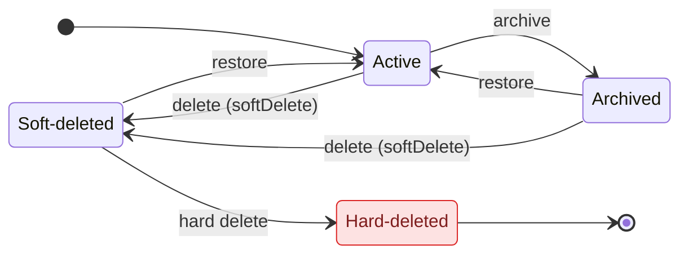

import CourseProgressBar from '../../../components/ui/CourseProgressBar.astro';
import Figure from '../../../components/figures/Figure.astro';
import LifecycleTabsMockup from '../../../components/lessons/061/1/LifecycleTabsMockup.astro';
import CodeVariants from '../../../components/code/code-variants/CodeVariants.astro';
import CodeVariant from '../../../components/code/code-variants/CodeVariant.astro';
import AnnotatedCode from '../../../components/code/annotated-code/AnnotatedCode.astro';
import AnnotatedStep from '../../../components/code/annotated-code/AnnotatedStep.astro';
import CodeTooltips from '../../../components/code/CodeTooltips.astro';
import Buckets from '../../../components/exercises/buckets/Buckets.astro';
import Bucket from '../../../components/exercises/buckets/Bucket.astro';
import Item from '../../../components/exercises/buckets/Item.astro';
import MultipleChoice from '../../../components/exercises/multiple-choice/MultipleChoice.astro';
import McqChoice from '../../../components/exercises/multiple-choice/McqChoice.astro';
import McqWhy from '../../../components/exercises/multiple-choice/McqWhy.astro';
import DrizzleSchemaCoding from '../../../components/live-coding/DrizzleSchemaCoding/DrizzleSchemaCoding.astro';
import Term from '../../../components/ui/Term.astro';
import ExternalResource from '../../../components/ui/ExternalResource.astro';
import { FileTree, CardGrid } from '@astrojs/starlight/components';

<CourseProgressBar value={frontmatter['course-progress']} />

A user clicks **Delete invoice**. Before you reach for `DELETE FROM`, ask three questions: what vanishes from the screen, what survives in the database, and what can come back. Now a second click: the user finishes a project and wants it off their active list but not gone, in case they need it next quarter. Same button? Same column? Same promise?

The two look identical in the UI and behave nothing alike underneath. This lesson rests on two facts: most "deletes" a user clicks are *writes*, not row removals; and "archive" and "delete" are different promises even when they touch the same column. By the end you'll have a two-timestamp schema and three Server Actions, `softDelete`, `archive`, and `restore`, that drive the lifecycle of every row a user can touch.

## Soft delete versus hard delete

Two decisions hide inside the word "delete." First: when the user removes something, does the row actually leave the table?

A <Term definition="Removing the row from the table for good. Recovery is from backup only.">**hard delete**</Term> is the literal thing: `DELETE FROM invoices WHERE id = …`. The row is gone, foreign keys cascade or block, and your only way back is a backup restore — which in practice means it isn't coming back.

A <Term definition="Flagging a row as removed by setting a timestamp, instead of deleting it. The row stays in the table.">**soft delete**</Term> is quieter: `UPDATE invoices SET deleted_at = now() WHERE id = …`. The row stays, fully intact, with one new fact attached — *the moment it was deleted*. Restoring it just clears the stamp. The audit trail survives, and nothing referencing the row broke, because nothing was removed.

One sentence carries the rest of the chapter: **soft delete is a write, not a delete.** The instant a "delete" becomes an `UPDATE`, the row stays visible to anything that doesn't explicitly hide it, so every read you've written is a place it can leak back into view.

<CodeVariants>
  <CodeVariant label="Hard delete">
    <div data-mark-color="red">

    ```ts ".delete(invoices)"
    await db
      .delete(invoices)
      .where(eq(invoices.id, invoiceId));
    ```

    </div>
    **The row is gone.** Recovery is from backup only, which is to say, not really.
  </CodeVariant>

  <CodeVariant label="Soft delete">
    <div data-mark-color="green">

    ```ts {3}
    await db
      .update(invoices)
      .set({ deletedAt: sql`now()` })
      .where(eq(invoices.id, invoiceId));
    ```

    </div>
    **The row stays.** Every read from now on has to remember to filter it out.
  </CodeVariant>
</CodeVariants>

Which to reach for? The trigger is re-reference and consequences, not taste. Soft-delete anything a user might point at again or that carries a compliance obligation: invoices, projects, customers, the comment on a thread. Hard-delete throwaway rows no one re-references: session rows, password-reset tokens, unnamed draft autosaves, expired email-verification records. Treat it as a threshold: the more a record is woven into the rest of the system, the further it tilts toward soft delete.

<Buckets twoCol instructions="Drop each record into the deletion strategy you'd ship it with. Lean on the trigger, not the list: would a user (or an auditor) ever point at this row again?">
  <Bucket name="soft" label="Soft delete" description="Re-referenced or casts a compliance shadow — keep the row, stamp it" />
  <Bucket name="hard" label="Hard delete" description="Transient artifact no one re-references — drop the row" />

  <Item bucket="soft">A paid invoice</Item>
  <Item bucket="soft">A customer record</Item>
  <Item bucket="soft">A user's comment on a thread</Item>
  <Item bucket="hard">A password-reset token</Item>
  <Item bucket="hard">An expired email-verification row</Item>
  <Item bucket="hard">A draft autosave the user never named</Item>
</Buckets>

## Soft delete versus archive

This second decision is the one people get wrong. Whether the row stays in the table is settled; this is about what you *promise the user*.

A soft delete is **invisible**. The user clicks Delete, the row drops out of every list they can see, and it's gone as far as they know. It resurfaces only through an admin or a hidden "deleted items" view most products never build. Restoring isn't part of the user's day; it's a recovery action for "we removed that by mistake, can you get it back?"

An <Term definition="A visible lifecycle state the user moves a row into and can browse and restore from.">**archive**</Term> is **explicit**. The user clicks Archive, and the row moves to an "Archived" tab they can open whenever they like. Restoring is a first-class action they take themselves; they *expect* to see it again, and you'd break that contract if they couldn't.

Both often share the same column shape: `deletedAt` and `archivedAt` are nullable timestamps. Same storage primitive, different product contract, surfaced through different parts of the UI. The database can't tell you which you meant — only the product decision can, and real apps land in one of three shapes:

- **Archive-only.** Every "remove" is an archive, with no user-facing delete. This is Notion pages and Linear projects: archive is the strongest "remove" the UI offers.
- **Soft-delete-only.** One "Delete" button, the row disappears, and restoring is admin-only. There's no archive concept.
- **Both.** Archive means *"I'm done with this"*; soft delete is the recovery net under *"I deleted this by mistake."* Two intentions, two surfaces.

This course commits to **both**: **archive is the primary user surface, soft delete is the admin recovery surface.** Users get a self-service lifecycle they control (archive, browse, restore); underneath sits a recovery net that never clutters their view.

<Figure>

  <Fragment slot="caption">
    A row's state is *derived* from two timestamps (`deletedAt`, `archivedAt`); the three actions are the edges that move it. The `Archived → Soft-deleted` path shows that an archived row can still be deleted, with delete overriding archive. **Hard-deleted** is the one exit with no way back.
  </Fragment>
</Figure>

This is the lesson title made literal: **two timestamps, three actions.** A row's state isn't a field you look up; `archive`, `softDelete`, and `restore` are the edges that move it. Follow `Archived` straight to `Soft-deleted`: a row can be archived and *then* deleted, both timestamps set at once, with deleted winning as the effective state. These aren't mutually exclusive flags — they're a small state machine.

<MultipleChoice>
  A user clicks **Archive** on a project, then goes looking for it again the next day. Pick the description that matches what actually happened in the database *and* what the user can do next.

  <McqChoice correct>The project's row never left the table — one timestamp column flipped from null to a time — and it now lives under an Archived tab the user can open and restore from on their own.</McqChoice>
  <McqChoice>The project vanishes from every list, the row is still in the table, but only an admin can bring it back — the user has no way to do it themselves.</McqChoice>
  <McqChoice>The row is gone from the table; getting the project back means restoring a database backup.</McqChoice>
  <McqChoice>Nothing was written — "Archived" is just a label the browser hides the row behind, so the state evaporates on the next request from another device.</McqChoice>

  <McqWhy>Archive is a *write that keeps the row* (`archivedAt` set, nothing removed) **and** a *visible lifecycle state the user controls* (an Archived tab with self-service restore). The second option describes soft delete's invisible, admin-only recovery; the third is a hard delete; the fourth would make the state non-persistent, but `archivedAt` is a real column on the row, so it survives across devices and requests.</McqWhy>
</MultipleChoice>

## Two nullable timestamps, spread into every table

Three lifecycle positions map to two nullable timestamps: a set timestamp marks when the row entered that state, and the absence of one is the third position.

The alternative is a single `status` enum (`active` | `archived` | `deleted`) plus separate audit timestamps. Two nullable timestamps win: the schema is simpler, the column names document themselves (`deletedAt` *is* the deletion timestamp), and the index story is identical either way. The deciding factor is that a row can be archived *and* deleted at once, which an enum forces you to flatten into one value and lose. Optimize the schema for the queries and UI it serves, not for one tidy column.

Every entity table gets this lifecycle: invoices, projects, customers. Repeating three column definitions across a dozen tables drifts out of sync the moment someone edits one copy, so declare the shape once in a `lifecycleColumns` helper and spread it into each table.

<AnnotatedCode lang="ts" code={`
const lifecycleColumns = {
  deletedAt: timestamp({ withTimezone: true }),
  archivedAt: timestamp({ withTimezone: true }),
  updatedAt: timestamp({ withTimezone: true })
    .notNull()
    .defaultNow()
    .$onUpdate(() => new Date()),
};

export const invoices = pgTable('invoices', {
  id: uuid().primaryKey().$defaultFn(() => uuidv7()),
  organizationId: uuid().notNull(),
  amount: numeric({ precision: 12, scale: 2 }).notNull(),
  ...lifecycleColumns,
});
`}>
  <AnnotatedStep meta="{2-3}" color="blue">
    Both are nullable, and the nullability *is* the encoding: `null` means the row is not in that state, a set timestamp means it entered that state at that moment. A lifecycle change just flips a column from null to a time; nothing is ever removed.
  </AnnotatedStep>

  <AnnotatedStep meta="{4-7}" color="blue">
    `updatedAt` records when the row last changed. `$onUpdate` stamps it on every UPDATE drizzle-orm issues, so you never set it by hand and a raw SQL UPDATE that bypasses Drizzle won't touch it. The `new Date()` is the sanctioned exception to the "no `Date` in domain code" rule: this is the Drizzle storage seam, where `Date` is the boundary type. A later lesson uses `updatedAt` to make concurrent edits honest.
  </AnnotatedStep>

  <AnnotatedStep meta="{14}" color="blue">
    One spread gives `invoices` the full lifecycle shape, and every other table gets the same line. Change the lifecycle once and every table follows.
  </AnnotatedStep>
</AnnotatedCode>

Columns are declared in camelCase (`deletedAt`) but stored in snake_case (`deleted_at`). The mapping is set once on the Drizzle client (`casing: 'snake_case'`), so you write the TypeScript name and the SQL name follows. And `timestamp({ withTimezone: true })` maps to Postgres `timestamptz`, the only timestamp type you should store an instant in.

The editor below runs a real Postgres in your browser. It has no client-level casing, so spell the column names out in snake_case and use a plain integer key; the lifecycle columns are identical to the project's.

<DrizzleSchemaCoding
  instructions="Add the three lifecycle columns to invoices: a nullable deleted_at, a nullable archived_at, and a non-null updated_at — each a withTimezone timestamp. deleted_at and archived_at stay nullable (a null means the row isn't in that state); updated_at is .notNull(). This editor has no client-level casing, so spell column names out in snake_case — the lifecycle shape is identical to the project's."
  starter={`export const invoices = pgTable('invoices', {
  id: integer('id').primaryKey().generatedAlwaysAsIdentity(),
  organizationId: integer('organization_id').notNull(),
  amount: numeric('amount', { precision: 12, scale: 2 }).notNull(),
  // add the three lifecycle columns below
});`}
  requirements={[
    {
      name: 'invoices',
      columns: [
        { name: 'id', type: 'integer', primaryKey: true },
        { name: 'organization_id', type: 'integer', notNull: true },
        { name: 'amount', type: 'numeric', notNull: true },
        { name: 'deleted_at', type: 'timestamp' },
        { name: 'archived_at', type: 'timestamp' },
        { name: 'updated_at', type: 'timestamp', notNull: true },
      ],
    },
  ]}
  probes={[
    {
      description: 'An invoice can be inserted with deleted_at and archived_at left unset — both are nullable, so an Active row needs neither',
      sql: `INSERT INTO invoices (id, organization_id, amount, updated_at)
        VALUES (1, 1, 100.00, now());`,
      mustSucceed: true,
    },
    {
      description: 'A soft-deleted invoice is just a row with deleted_at stamped — the same nullable column, now holding a time',
      sql: `INSERT INTO invoices (id, organization_id, amount, updated_at, deleted_at)
        VALUES (2, 1, 200.00, now(), now());`,
      mustSucceed: true,
    },
  ]}
/>

## The three actions: softDelete, archive, restore

The schema gives a row its possible states; these three Server Actions are the only sanctioned way to move between them.

All three return `Result<T>`, the `{ ok: true, data } | { ok: false, error }` union every action in the course returns, and each body is tiny:

- `softDelete` sets `deletedAt = now()`.
- `archive` sets `archivedAt = now()`.
- `restore` clears whichever timestamp is set, back to `null`.

Each body is about three lines because `authedAction(role, schema, fn)` does the surrounding work: it runs the session lookup, the role check, and the Zod parse, then hands the body a `ctx.db` that is already `tenantDb(orgId)`, scoped to the active org's rows. The body neither parses, authorizes, nor re-derives the org. It reaches for `ctx.db` and writes, so the bespoke part shrinks to one `update`.

<CodeVariants>
  <CodeVariant label="softDelete">
    <div data-mark-color="green">

    ```ts {7}
    export const softDeleteInvoice = authedAction(
      'member',
      z.object({ id: z.uuid() }),
      async (input, ctx) => {
        await ctx.db
          .update(invoices)
          .set({ deletedAt: sql`now()` })
          .where(eq(invoices.id, input.id));
        revalidatePath('/invoices');
        return ok(null);
      },
    );
    ```

    </div>
    **Stamps `deletedAt` with the current time.** The row leaves every user-facing list, and an admin can still recover it.
  </CodeVariant>

  <CodeVariant label="archive">
    <div data-mark-color="green">

    ```ts {7}
    export const archiveInvoice = authedAction(
      'member',
      z.object({ id: z.uuid() }),
      async (input, ctx) => {
        await ctx.db
          .update(invoices)
          .set({ archivedAt: sql`now()` })
          .where(eq(invoices.id, input.id));
        revalidatePath('/invoices');
        return ok(null);
      },
    );
    ```

    </div>
    **Stamps `archivedAt`.** The row moves to the Archived tab, where the user can find and restore it.
  </CodeVariant>

  <CodeVariant label="restore">
    <div data-mark-color="green">

    ```ts {7}
    export const restoreInvoice = authedAction(
      'member',
      z.object({ id: z.uuid() }),
      async (input, ctx) => {
        await ctx.db
          .update(invoices)
          .set({ deletedAt: null, archivedAt: null })
          .where(eq(invoices.id, input.id));
        revalidatePath('/invoices');
        return ok(null);
      },
    );
    ```

    </div>
    **Clears *both* timestamps, returning the row to Active,** and returns `ok` even when nothing actually changed.
  </CodeVariant>
</CodeVariants>

The `where` clause carries only the id; `ctx.db` folds in the org scope. Four shared identifiers each reward a hover:

<CodeTooltips tooltips={{
  authedAction: 'The RBAC wrapper from an earlier chapter: lifts session, role check, and Zod parse out of the action body.',
  'ctx.db': 'Already tenantDb(orgId) — the wrapper built the tenant-scoped client and handed it down, so every write here is pinned to the active org\'s rows.',
  revalidatePath: 'Invalidates the cached list after the write so the soft-deleted row actually leaves the screen on the next render.',
  ok: 'Builds the { ok: true, data } half of the Result contract.',
}}>
```ts
export const softDeleteInvoice = authedAction(
  'member',
  z.object({ id: z.uuid() }),
  async (input, ctx) => {
    await ctx.db
      .update(invoices)
      .set({ deletedAt: sql`now()` })
      .where(eq(invoices.id, input.id));
    revalidatePath('/invoices');
    return ok(null);
  },
);
```
</CodeTooltips>

Every Server Action in the course follows five seams: **parse, authorize, mutate, revalidate, return**. The wrappers own parse and authorize, the body owns mutate, and `revalidatePath` fires the revalidate before the return. Skip the revalidate and the row you just soft-deleted stays on screen, because nothing told the cached list to re-fetch: a delete that doesn't visibly delete, and a one-line bug.

`restore` holds the one non-obvious decision in the trio.

<MultipleChoice>
  A user double-clicks **Restore** on a row that was already active. The second call runs `set({ deletedAt: null, archivedAt: null })` against a row whose timestamps were already `null`, so the UPDATE touches no real state — and the action still returns `ok`. Why is `ok`, not an error, the right return for that second call?

  <McqChoice correct>`restore` is written to be idempotent: it declares a target state — "this row is active" — and that state already holds, so repeating the call is a safe no-op and reporting success is the honest answer.</McqChoice>
  <McqChoice>An error would describe the second call more precisely, but the `Result` union has no variant that can express "the row was already in the requested state."</McqChoice>
  <McqChoice>Overwriting a column with the value it already holds still counts as a real change, so the second call isn't actually a no-op and there's nothing to special-case.</McqChoice>
  <McqChoice>A Server Action that issues a syntactically valid UPDATE is required by the framework to resolve as `ok`, regardless of how many rows it changed.</McqChoice>

  <McqWhy>The first option is correct. `restore` is designed to be **idempotent** — it asserts a desired end state ("be active") rather than a one-time transition, so a retried or double-clicked call on an already-active row must not surface an error. The second option is wrong because `Result` could carry an "unchanged" signal trivially; choosing `ok` is a deliberate idempotency decision, not a type limitation. The third is wrong because writing `null` over an already-`null` column changes nothing — the no-op case is real, which is exactly why the question matters. The fourth invents a rule that doesn't exist: an UPDATE affecting zero rows is still a successful round-trip, and the action *chooses* to call that success.</McqWhy>
</MultipleChoice>

## From actions to affordances, and the status filter

Each lifecycle state gets exactly one affordance:

- **Archive**: a button on every active row, plus a bulk action across selected rows, since users archive in batches.
- **Restore**: a button on rows in the **Archived** tab, where users look for what they put away.
- **Hard delete**: a destructive button in the archive view, behind a confirm dialog and usually restricted by role. Never the default row action, since permanent deletion should take a deliberate, confirmed step.

Which list a user sees is URL state, the same shape you built in the previous chapter. The filter is **tri-state**: `active` is the default and hides archived and deleted rows, `archived` is the Archived tab, and `all` is a gated admin view that includes soft-deleted rows. You read `?status=archived` through the same `parseAsStringEnum(['active', 'archived', 'all']).withDefault('active')` parser you wrote for filters, now pointed at the lifecycle.

<Figure>
  <LifecycleTabsMockup />
  <Fragment slot="caption">
    The tab the user is on is just URL state: `?status=archived` is the whole difference between the Active and Archived lists. A row's actions depend on the lifecycle state it is in, and the user sees the *label* "Archived" with a way back, never the raw `deletedAt`. **Delete** is the destructive, confirm-gated path, restricted by role, never the default row action.
  </Fragment>
</Figure>

To the user, a row is one of two things: gone from the UI entirely (soft delete), or labeled "Archived" with a way back. Never a timestamp, and never the word "deleted" on a row they can still see.

## What a restore brings back

Clearing the timestamp returns the row to Active, and everything attached comes back with it, because nothing was ever disconnected. Foreign keys still point where they pointed; child rows are still children. Soft delete was a write, not a delete, so there is nothing to reconnect.

Restore inherits whatever your delete did, which raises two traps.

```ts
await ctx.db
  .update(invoices)
  .set({ deletedAt: null, archivedAt: null })
  // line items were never deleted — they survived the soft delete and snap back with the parent
  .where(eq(invoices.id, input.id));
```

The first is **cascading restore**: bringing an invoice's line items back with it. The rule is symmetry — **cascade the restore exactly when you cascaded the soft delete.** If deleting the parent stamped the children, restoring it must clear them, or the data ends up half-restored.

The second is the **orphan**, in two forms. Children hard-deleted alongside a soft-deleted parent cannot return, leaving a parent missing its pieces — the strongest argument for cascading soft deletes together. Subtler: restore a child whose parent is still soft-deleted and you get a row visible in the UI while its parent is not. Guard by checking the parent's state before restoring. Surfacing that conflict cleanly — telling the user the parent is gone rather than silently making an orphan — is concurrency machinery a later lesson builds.

## Soft delete is a write: the cost comes due

"Soft delete is a write, not a delete" has two structural consequences. The fix for each lands in a later lesson, once you've felt the problem.

**Consequence one: every read becomes a code path that can leak.** The row is still in the table, so any query that doesn't *explicitly* exclude it pulls it back. A `count` missing `deletedAt IS NULL` runs too high; a join from customers to invoices that forgets it drags deleted rows into the result. The list, the detail page, the monthly report each have to remember the filter, and each looks correct when it forgets, because the bug is in what *isn't* there and reads exactly like the right query. In a multi-tenant app the worst version misses the lifecycle filter *and* the tenancy filter at once, surfacing one customer's deleted row to another. The next lesson makes the filtered query the only shape that compiles.

**Consequence two: `ON DELETE CASCADE` does not fire on a soft delete.** You set a foreign key to `onDelete: 'cascade'`, ship the soft-delete action, and assume the children are handled. They aren't. No `DELETE` happened — you ran an `UPDATE` — so the cascade is wired to an event that never occurs, doing nothing while convincing every reviewer that deletes are covered. The fix is to make the cascade explicit and atomic: soft-delete the parent and its children in the **same transaction**, threading `tx` through both updates. Skip the transaction and a mid-way error leaves a soft-deleted parent with live children: visible, half-deleted orphans.

<CodeVariants>
  <CodeVariant label="Looks handled, isn't">
    <div data-mark-color="red">

    ```ts "onDelete: 'cascade'"
    export const invoiceLines = pgTable('invoice_lines', {
      id: uuid().primaryKey().$defaultFn(() => uuidv7()),
      invoiceId: uuid()
        .notNull()
        .references(() => invoices.id, { onDelete: 'cascade' }),
    });

    // inside the action body — only the parent is touched:
    await ctx.db
      .update(invoices)
      .set({ deletedAt: sql`now()` })
      .where(eq(invoices.id, input.id));
    ```

    </div>
    **The FK cascade is wired to `DELETE`. The soft delete is an `UPDATE`.** The cascade never fires, so the line items are now orphaned.
  </CodeVariant>

  <CodeVariant label="Cascade by hand, in one transaction">
    <div data-mark-color="green">

    ```ts "db.transaction"
    await db.transaction(async (tx) => {
      await tx
        .update(invoices)
        .set({ deletedAt: sql`now()` })
        .where(and(eq(invoices.id, input.id), eq(invoices.organizationId, ctx.orgId)));
      await tx
        .update(invoiceLines)
        .set({ deletedAt: sql`now()` })
        .where(eq(invoiceLines.invoiceId, input.id));
    });
    ```

    </div>
    **Soft-delete the parent and its children together, in one transaction, all or nothing.** This uses the raw `db` (not `ctx.db`) and threads `tx` through both updates, so the org predicate is written out by hand here, where `ctx.orgId` is the org the wrapper already resolved.
  </CodeVariant>
</CodeVariants>

<MultipleChoice>
  A developer adds `onDelete: 'cascade'` to the `invoice_lines` foreign key, ships the `softDeleteInvoice` action, and reviews the PR confident the children are handled. An invoice is then soft-deleted. What is the actual state of its line items afterward?

  <McqChoice correct>They sit there untouched — still in the table, still pointing at a now-deleted parent — because the cascade is bound to a `DELETE` event that the soft delete's `UPDATE` never triggered.</McqChoice>
  <McqChoice>They get their own `deletedAt` stamped automatically, since the FK cascade carries the parent's column change down to every child row.</McqChoice>
  <McqChoice>They block the operation: the soft delete fails with a foreign-key violation because live children still reference the parent the developer is trying to remove.</McqChoice>
  <McqChoice>They are removed from the table for good, because a `cascade` foreign key deletes the children whenever the parent leaves the active set, however that happens.</McqChoice>

  <McqWhy>`ON DELETE CASCADE` fires on exactly one event — a real `DELETE` of the parent row. A soft delete issues an `UPDATE` (it sets `deletedAt`), so the cascade is wired to something that never happens and does nothing. The line items are left as orphaned, still-visible rows unless the action updates them itself, which is why the cascade has to be done by hand in the same transaction. The second option is wrong because cascade propagates row deletions, not arbitrary column writes. The third is wrong because the parent row is never removed, so no FK constraint is violated and the `UPDATE` succeeds. The fourth invents a behavior cascade doesn't have — it keys off `DELETE`, not "left the active set."</McqWhy>
</MultipleChoice>

## Partial indexes: uniqueness and the hot path

Soft delete adds one more class of bug, and one Postgres feature fixes two faces of it: a <Term definition="An index that covers only the rows matching a WHERE predicate.">**partial index**</Term>.

**The correctness problem: uniqueness breaks after a soft delete.** Say projects have a plain unique constraint on `(organizationId, slug)`. A user soft-deletes a project named "Acme" and tries to create a new one, but the database refuses: the soft-deleted row still holds that slug, so the constraint still sees it. The fix is a *partial* unique index that applies only `WHERE deleted_at IS NULL`, enforcing uniqueness among live rows so the soft-deleted "Acme" is invisible to it.

Expressing this in Drizzle has two pitfalls, both of which fail silently. First, the `.unique()` shorthand cannot carry a `WHERE` clause, so you need `uniqueIndex().on(...).where(...)`. Second, the predicate inside `.where()` **must** be a raw `` sql`` `` fragment: a helper like `eq(t.deletedAt, null)` emits a broken parameterized clause into the migration, and the partial index silently fails. Write it as `` sql`${t.deletedAt} is null` `` and nothing else.

**The performance problem: the hot read path.** The "active rows" query is the default list view, fired on nearly every page load. A partial composite index on `(organization_id, created_at) WHERE deleted_at IS NULL` indexes only the rows that query returns, keeping the index small and the scan tight. Pair a hot composite index with `WHERE deleted_at IS NULL` whenever the read path always filters deleted rows out. Skip the partial when the table is small or few rows are ever deleted, since a plain composite index covers both cases without the extra moving part. As with every tenant-scoped index, lead with `organizationId`.

<AnnotatedCode lang="ts" code={`
export const projects = pgTable(
  'projects',
  {
    id: uuid().primaryKey().$defaultFn(() => uuidv7()),
    organizationId: uuid().notNull(),
    slug: text().notNull(),
    createdAt: timestamp({ withTimezone: true }).notNull().defaultNow(),
    ...lifecycleColumns,
  },
  (t) => [
    uniqueIndex('projects_org_slug_unique')
      .on(t.organizationId, t.slug)
      .where(sql\`\${t.deletedAt} is null\`),
    index('idx_projects_org_created_partial')
      .on(t.organizationId, t.createdAt)
      .where(sql\`\${t.deletedAt} is null\`),
  ],
);
`}>
  <AnnotatedStep meta="{11-13}" color="green">
    The partial *unique* index. `WHERE deleted_at IS NULL` enforces uniqueness only among live rows, so the soft-deleted "Acme" is invisible and the name can be reused.
  </AnnotatedStep>

  <AnnotatedStep meta="{13}" color="green">
    Both pitfalls in one line: `uniqueIndex().where()` because `.unique()` can't express a partial index, and a raw `` sql`` `` predicate because `eq(t.deletedAt, null)` emits a broken clause.
  </AnnotatedStep>

  <AnnotatedStep meta="{14-16}" color="green">
    The partial *composite* index on the hot active-rows path: a small index and tight scan, since it covers only the rows the active query returns. Skip it when the table is small or few rows are deleted. Naming convention: explicit names, a `_partial` suffix for partial indexes, `<table>_<cols>_unique` for uniques.
  </AnnotatedStep>
</AnnotatedCode>

<DrizzleSchemaCoding
  instructions="Add a partial unique index to projects so (organization_id, slug) is unique among live rows only — a soft-deleted slug can be reused, but two live duplicates can't. Add it in the table-extension array at the bottom: uniqueIndex('projects_org_slug_unique').on(t.organizationId, t.slug).where(sql`...`), with the predicate written as a raw sql fragment that reads deleted_at is null. (This editor has no client-level casing, so column names are spelled out in snake_case and the PK is a plain integer — the index shape is identical to the project's.)"
  starter={`export const projects = pgTable(
  'projects',
  {
    id: integer('id').primaryKey().generatedAlwaysAsIdentity(),
    organizationId: integer('organization_id').notNull(),
    slug: text('slug').notNull(),
    deletedAt: timestamp('deleted_at', { withTimezone: true }),
  },
  (t) => [
    // add the partial unique index here
  ],
);`}
  requirements={[
    {
      name: 'projects',
      columns: [
        { name: 'id', type: 'integer', primaryKey: true },
        { name: 'organization_id', type: 'integer', notNull: true },
        { name: 'slug', type: 'text', notNull: true },
        { name: 'deleted_at', type: 'timestamp' },
      ],
    },
  ]}
  probes={[
    {
      description:
        'A soft-deleted "acme" (deleted_at stamped) and a fresh live "acme" in the same org can coexist — the partial index ignores the deleted row',
      sql: `INSERT INTO projects (id, organization_id, slug, deleted_at) VALUES (1, 1, 'acme', '2026-01-01T00:00:00Z');
        INSERT INTO projects (id, organization_id, slug, deleted_at) VALUES (2, 1, 'acme', NULL);`,
      mustSucceed: true,
    },
    {
      description:
        'Two live "globex" rows in the same org (both deleted_at NULL) are rejected — uniqueness still holds among live rows',
      sql: `INSERT INTO projects (id, organization_id, slug, deleted_at) VALUES (3, 2, 'globex', NULL);
        INSERT INTO projects (id, organization_id, slug, deleted_at) VALUES (4, 2, 'globex', NULL);`,
      mustSucceed: false,
    },
  ]}
/>

## What soft delete is not

Two boundaries are easy to cross by accident, and crossing either is costly.

:::caution
**Soft delete is not an audit log, and it is not GDPR compliance.**

Every soft-delete, archive, and restore *should* write a row to an audit log in the same transaction, but the lifecycle timestamp and that log are different things: the timestamp is the *current truth*, the log is the *immutable history*. Restoring a row clears its `deletedAt`, but must not erase the deletion from the log. The audit-log table comes later in the course.

A <Term definition="The EU's data-protection regulation; its erasure right requires personal data actually removed or anonymized on request.">**GDPR**</Term> erasure request requires the data actually gone or anonymized beyond recovery; a soft-deleted row sits fully intact in the table, the opposite of erased. These are two flows: the "Delete" button a user clicks is a soft delete, while a GDPR pipeline is a separate path that nullifies personal data or hard-deletes the row. Same word, different machinery, so never let "we soft-delete" stand in for "we comply."
:::

## Where each piece lives

<Figure>
<FileTree>
- src/
  - db/
    - **schema.ts** the `lifecycleColumns` helper + the entity tables + the partial unique & composite indexes
    - queries/
      - **invoices.ts** *next lesson*: the home for the tenant-scoped read helpers that make the `deletedAt IS NULL` filter impossible to forget
  - app/
    - invoices/
      - **actions.ts** `softDeleteInvoice`, `archiveInvoice`, `restoreInvoice`
      - page.tsx the list view + the `Active | Archived | All` tabs, driven by `?status=`
</FileTree>
  <Fragment slot="caption">
    The schema declares the timestamps and indexes, `actions.ts` holds the three actions, and the list page reads its tab from URL state. The empty room is `db/queries/invoices.ts`, which the next lesson fills.
  </Fragment>
</Figure>

The next lesson makes reads safe, so a hand-written query can't forget the lifecycle filter; the lesson after makes concurrent edits honest, so two tabs saving the same invoice can't silently clobber each other.

## External resources

The case *against* soft delete is worth knowing too, alongside the exact Postgres and Drizzle primitives that make it safe.

<CardGrid>
  <ExternalResource
    title="PostgreSQL — Partial Indexes"
    href="https://www.postgresql.org/docs/current/indexes-partial.html"
    icon="simple-icons:postgresql"
    iconColor="#4169E1"
    description="The authoritative reference: enforcing uniqueness on a subset of rows and the WHERE predicate that powers the deleted_at IS NULL index."
  />
  <ExternalResource
    title="Drizzle ORM — Indexes & Constraints"
    href="https://orm.drizzle.team/docs/indexes-constraints"
    icon="simple-icons:drizzle"
    iconColor="#C5F74F"
    description="The exact API the lesson uses — uniqueIndex().on().where() and the raw sql predicate that the .unique() shorthand can't express."
  />
  <ExternalResource
    title="Soft Deletion Probably Isn't Worth It"
    href="https://brandur.org/soft-deletion"
    icon="simple-icons:ghost"
    iconColor="#212121"
    description="Brandur's well-known counterpoint: undeletion rarely happens, FKs break, and a deleted_record table may serve you better. Read it to weigh the trade-off yourself."
  />
  <ExternalResource
    title="Postgres FM — Soft delete"
    href="https://postgres.fm/episodes/soft-delete"
    icon="simple-icons:postgresql"
    iconColor="#336791"
    description="A 38-minute practitioner discussion of soft-delete use cases and implementation options, with a full transcript for skimmers."
  />
</CardGrid>
