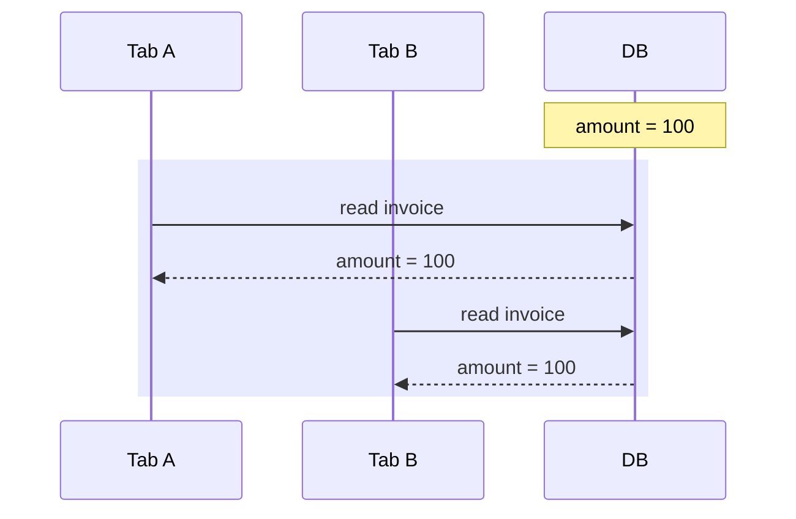
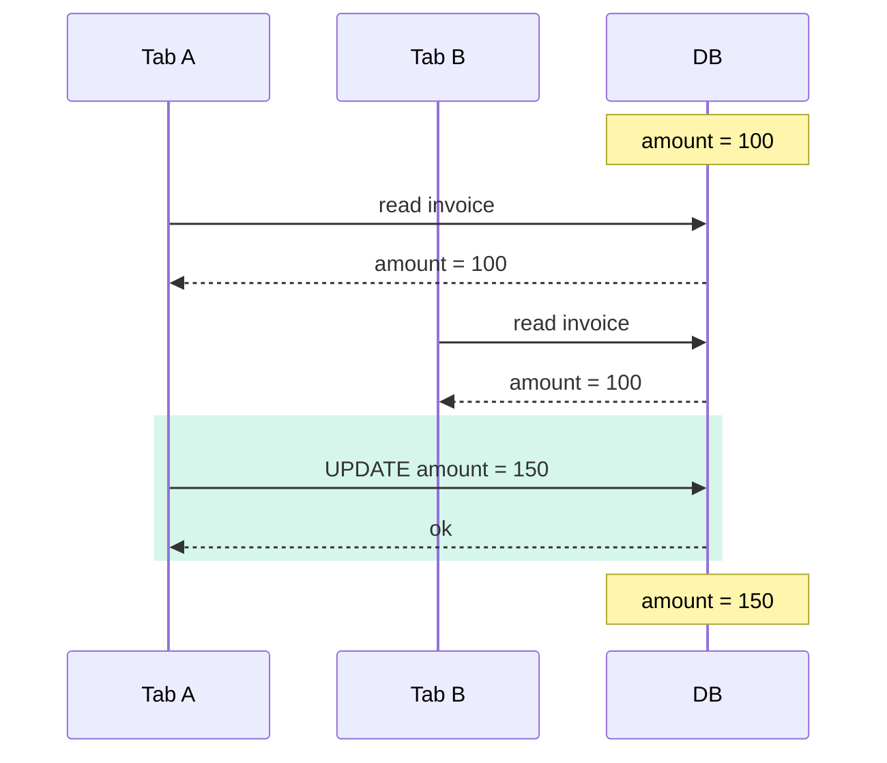
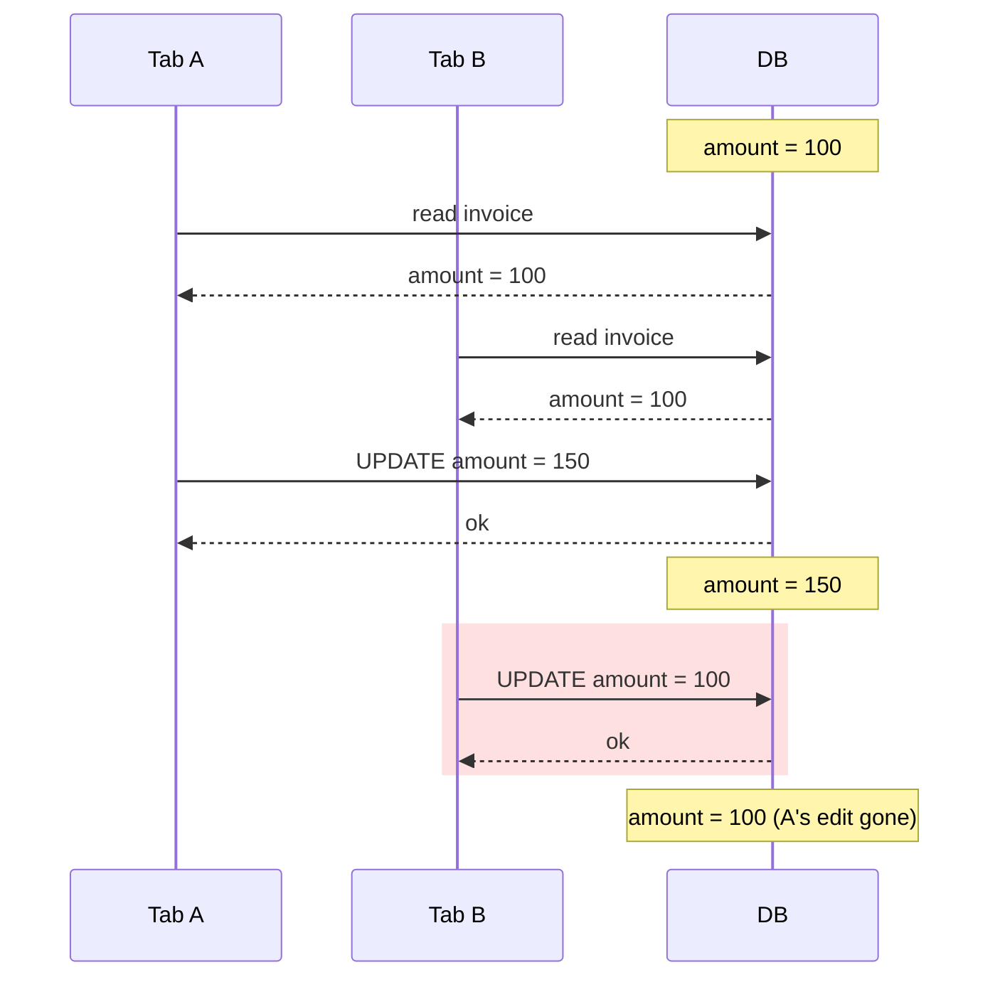
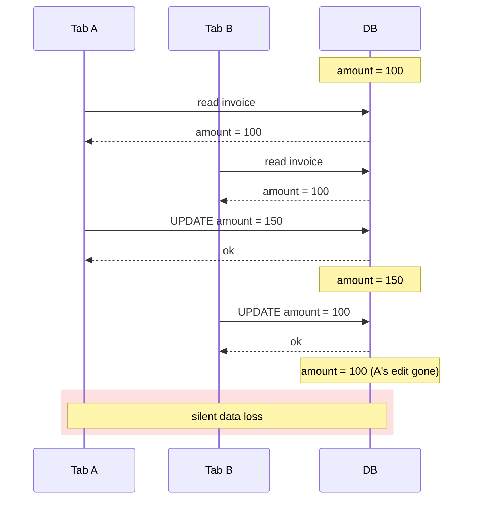

import AnnotatedCode from '../../../components/code/annotated-code/AnnotatedCode.astro';
import AnnotatedStep from '../../../components/code/annotated-code/AnnotatedStep.astro';
import CodeVariants from '../../../components/code/code-variants/CodeVariants.astro';
import CodeVariant from '../../../components/code/code-variants/CodeVariant.astro';
import CodeTooltips from '../../../components/code/CodeTooltips.astro';
import DiagramSequence from '../../../components/figures/diagram-sequence/DiagramSequence.astro';
import DiagramStep from '../../../components/figures/diagram-sequence/DiagramStep.astro';
import StateMachineWalker from '../../../components/figures/state-machine-walker/StateMachineWalker.astro';
import Question from '../../../components/figures/state-machine-walker/Question.astro';
import Branch from '../../../components/figures/state-machine-walker/Branch.astro';
import Leaf from '../../../components/figures/state-machine-walker/Leaf.astro';
import Figure from '../../../components/figures/Figure.astro';
import MutationStateMachineStrip from '../../../components/lessons/061/3/MutationStateMachineStrip.astro';
import ReactCoding from '../../../components/live-coding/ReactCoding/ReactCoding.astro';
import ExternalResource from '../../../components/ui/ExternalResource.astro';
import Term from '../../../components/ui/Term.astro';
import VideoCallout from '../../../components/embeds/VideoCallout.astro';
import { CardGrid } from '@astrojs/starlight/components';
import CourseProgressBar from '../../../components/ui/CourseProgressBar.astro';

<CourseProgressBar value={frontmatter['course-progress']} />

Picture two teammates editing the same invoice. Alice and Bob both click "Edit," and both forms load with `amount: 100`. Alice bumps the amount to 150 and saves; the database now holds 150. A minute later Bob, whose form still shows the old 100, fixes a typo in the customer note and saves. His save writes the *whole* form back: the corrected note, plus the stale `amount: 100`. Alice's 150 is gone. She finds out three days later, when the invoice is short fifty dollars and nobody can explain why.

This bug never shows up in a demo, where only one tab is open. It surfaces the first week real users edit the same records, and it resists diagnosis: no exception, no stack trace, just a value that quietly reverted. A single extra `WHERE` condition can detect the clobber, and the right React surface can turn that detection into a moment where the user *sees* what changed and decides what to do.

You already have most of the machinery. Earlier in this chapter, your lifecycle actions put predicates in the UPDATE's `WHERE`: the tenant scope rides in `ctx.db`, and the lifecycle filters keep you off deleted rows. This lesson adds one more predicate, plus the React surface that makes its failure honest.

## How last-write-wins loses an edit

The danger is timing: two writes interleave in a way neither tab can see. Each tab does something reasonable on its own; the damage exists only in the gap between them.

<DiagramSequence>
  <DiagramStep caption="Both tabs open the invoice and read amount = 100. Each form now holds a value that was true at read time.">

  </DiagramStep>

  <DiagramStep caption="Tab A saves 150. The database now holds 150, and from Tab A's point of view everything is correct.">

  </DiagramStep>

  <DiagramStep caption="Tab B saves. Its form still holds the stale 100 from step 1, so its UPDATE writes amount = 100 over Tab A's 150. The database is back to 100.">

  </DiagramStep>

  <DiagramStep caption="Tab A's edit is gone. No error, nothing logged, both writes 'succeeded'. This is last-write-wins, the default behavior of every naive UPDATE.">

  </DiagramStep>
</DiagramSequence>

That default has a name: <Term definition="The default outcome of concurrent writes to the same row: whichever UPDATE runs last overwrites the others, with no detection.">last-write-wins</Term>. The database did exactly what each `UPDATE ... WHERE id = ?` told it. The problem is that Bob's UPDATE had no way to know his form was built from a value that had since moved on.

Both saves returned `ok`; the loss lives in the gap between Bob's read and his write, which is exactly where a second writer slips in. So we need three things, and the rest of this lesson takes them in order:

1. A precondition that **detects** when the second writer is working from a stale read.
2. A response that lets that writer **recover** by seeing the current value and deciding what to do, instead of losing their work or someone else's.
3. The judgment to know **when this is overkill**, because adding it to every write is its own kind of mistake.

## Optimistic concurrency and the version column

Two strategies stop two writers from clobbering each other, and choosing between them is the real decision here.

The first is **pessimistic locking**. When Bob reads the row to edit it, the database locks that row (`SELECT ... FOR UPDATE`) and holds the lock until he saves; Alice has to wait. The trouble is what the lock spans: human think-time. Bob opens the form, gets coffee, takes a call, and the row stays locked the whole time, every other editor blocked behind him. If the request that should release the lock dies, the lock can linger. That makes it wrong for web traffic, where "a user slowly typing into a form" is the normal case.

The second is **<Term definition="A concurrency strategy that takes no lock: the client reads a version, sends it back, and the server checks it still matches at write time. It's cheap when conflicts are rare, and the rare conflict is handled explicitly.">optimistic concurrency</Term>**. There is no lock. Bob reads the row *and its version* and takes as long as he likes. His UPDATE then says, in effect, "write this, but only if the version is still what I read." If someone wrote in the meantime the version moved, the condition fails, and Bob's write is rejected so he can deal with it. You're betting collisions are rare, and in ordinary editing they are: two people rarely edit the same invoice within the same minute. You pay nothing on the common path and a small price only on the rare miss.

:::note
**The web default is optimistic.** When you render a form and wait on a person to type, optimistic concurrency wins: no held locks, no blocked editors, and the rare conflict becomes a recoverable moment instead of a silent loss.
:::

<VideoCallout videoId="eMotoFvgdUo" videoTitle="Optimistic Locking - What, When, Why, and How?">
  Arpit Bhayani's 17-minute systems-design walkthrough of optimistic locking, including the compare-and-swap intuition ("write only if the value is still what I read") the version precondition rests on.
</VideoCallout>

The mechanism is a single integer that counts how many times the row has been written. You add one column:

<div data-mark-color="green">

<CodeTooltips tooltips={{
  version: 'A counter that increments on every successful UPDATE. The client reads it, sends it back on save, and the server checks it still matches.',
  '.notNull()': "Every row always has a version, so there's no 'unversioned' state to special-case.",
  '.default(1)': 'New rows start at 1. The DEFAULT also backfills every existing row when you add the column.',
}}>
```ts {5}
export const invoices = pgTable('invoices', {
  id: uuid().primaryKey().$defaultFn(() => uuidv7()),
  orgId: uuid().notNull(),
  amount: numeric({ precision: 12, scale: 2 }).notNull(),
  version: integer().notNull().default(1),
  ...lifecycleColumns,
});
```
</CodeTooltips>

</div>

The protocol around that column is four steps:

1. The client reads the row **and its `version`**, say `version: 7`.
2. The client holds that `7` and sends it back when the user saves.
3. The UPDATE does two things in one atomic statement: it checks `WHERE version = 7`, and in its `SET` it does `version = version + 1`.
4. You read how many rows the UPDATE touched. **One row means the write landed**: nobody raced you, and the version was still 7. **Zero rows means the version moved**: someone wrote between your read and your write, bumping it past 7, so your `WHERE` matched nothing. Zero rows is the conflict.

The rows-affected count is the signal, so the UPDATE answers "did this conflict?" by itself, with no separate query.

Use an **integer** for the version, not a UUID or timestamp: it's small, ordered, and `version + 1` is an atomic increment the database does in place. One tempting alternative is to reuse the `updatedAt` timestamp you already have instead of adding a column. That's a different question, taken up next.

### Reusing `updatedAt` when you can't add a column

You already added `updatedAt` in this chapter's first lesson, and Drizzle's `$onUpdate` stamps it on every write, so you already have a value that changes on every UPDATE. Why add a *second* one? Couldn't the precondition just be `WHERE updatedAt = :clientUpdatedAt`?

It can, and sometimes it should. The two approaches trade off differently, worth understanding so you choose deliberately.

<CodeVariants>
  <CodeVariant label="version (default)">
    <div data-mark-color="blue">

    ```ts {5}
    .where(
      and(
        eq(invoices.id, input.id),
        isNull(invoices.deletedAt),
        eq(invoices.version, input.version),
      ),
    )
    ```

    </div>
    **The course default for structured editing.** A dedicated counter: one extra column, but immune to timestamp-precision problems and unambiguous, since `version = 7` means exactly one thing. Reach for this on any multi-field edit form.
  </CodeVariant>

  <CodeVariant label="updatedAt">
    <div data-mark-color="orange">

    ```ts {5}
    .where(
      and(
        eq(invoices.id, input.id),
        isNull(invoices.deletedAt),
        eq(invoices.updatedAt, input.updatedAt),
      ),
    )
    ```

    </div>
    **Use only when adding a column is off the table.** No new column, and the timestamp is useful for display anyway. The risk is serialization, **not** clock skew: the database writes and reads the value, so the browser's clock never touches it. The real failure is a millisecond truncated or a timezone offset mangled as the value round-trips through your form, letting two writes in the same instant share a timestamp. Millisecond `timestamptz` mostly closes this.
  </CodeVariant>
</CodeVariants>

**Prefer `version` for structured editing**: multi-field forms, drafts, anything a user spends real time in. It's explicit and can't be defeated by timestamp precision. **Reach for `updatedAt` only when you genuinely can't add a column**, such as a frozen schema or a legacy table you don't own, and only when its precision is high enough to trust. The rest of this lesson uses `version`.

## The UPDATE that detects the race

The action's UPDATE already filters by tenancy and lifecycle from this chapter's earlier lessons. Add a third predicate and a conflict branch and it becomes one statement with four distinct parts.

<AnnotatedCode lang="ts" code={`
export const updateInvoice = authedAction(
  'member',
  updateInvoiceSchema,
  async (input, ctx) => {
    const updated = await ctx.db
      .update(invoices)
      .set({
        amount: input.amount,
        version: sql\`\${invoices.version} + 1\`,
      })
      .where(
        and(
          eq(invoices.id, input.id),
          isNull(invoices.deletedAt),
          eq(invoices.version, input.version),
        ),
      )
      .returning();
    if (updated.length === 0) {
      return conflict(await currentInvoice(ctx, input.id));
    }
    revalidatePath('/invoices');
    return ok(updated[0]);
  },
);
`}>
  <AnnotatedStep meta="{1-4}" color="blue">
    The same five-seam shape as every action in this chapter. `authedAction` has parsed the input and checked the role, and `ctx.db` is already tenant-scoped. We're at the *mutate* seam.
  </AnnotatedStep>

  <AnnotatedStep meta="{7-10}" color="green">
    The `SET` bumps the version by one, arming the *next* writer's check. The check in the `WHERE` and this increment are a pair: forget the bump and every save succeeds, the counter never moves, and no conflict is ever detected. (`updatedAt` isn't set here; `$onUpdate` from Lesson 1 stamps it on every UPDATE.)
  </AnnotatedStep>

  <AnnotatedStep meta="{11-17}" color="violet">
    The `WHERE` carries every precondition: the row id, the lifecycle filter (`isNull(deletedAt)`, so you don't edit a deleted row), and the version check. Tenancy rides in `ctx.db`. Miss one and you write the wrong row, or the wrong version.
  </AnnotatedStep>

  <AnnotatedStep meta="{18-21}" color="orange">
    `.returning()` hands back the rows the UPDATE actually touched. Zero rows is **not** a no-op success: the version moved between read and write, so we return `conflict(...)` with the fresh row. One row means we won the race, so we return it as the new state.
  </AnnotatedStep>
</AnnotatedCode>

That zero-rows branch is the point. Treat it as a quiet success and you are back to silent data loss: the write never landed, but you told the user it did. Zero rows is a 409.

The ``sql`${invoices.version} + 1` `` fragment is the same sanctioned <Term definition="Drizzle's tagged template for raw SQL fragments. Interpolated values are parameterized, not string-concatenated, so it's injection-safe.">`sql`</Term> carve-out you saw with the partial-index predicate. Doing the `+ 1` in SQL keeps the increment atomic: the database reads and writes the counter in one step, with no chance for a second writer to slip in. And `.returning()` is what makes the zero-rows check possible:

<CodeTooltips tooltips={{
  returning: 'Asks the database to return the rows the statement actually affected. After an UPDATE, the array length tells you how many rows matched the WHERE; zero means the precondition failed.',
}}>
```ts
const updated = await ctx.db.update(invoices).set({ /* … */ }).where(/* … */).returning();
// updated.length === 0  →  the version moved; this is a conflict, not a success
```
</CodeTooltips>

Don't enforce the increment with a database trigger. It works, but it hides the most important line of the action behind invisible database behavior. Keep `version = version + 1` in the `SET` at the call site, where the next reader can see this write taking part in the optimistic-concurrency protocol.

## What to return on a conflict

Detecting the conflict is half the job; the other half is what you hand back. A recoverable conflict is worth far more than a bare error.

Your action already returns the canonical `Result`: `{ ok: true, data }` or `{ ok: false, error }`, where `error` carries a `code` and a `userMessage`. The conflict case reuses `code: 'conflict'`, the existing discriminant the form branches on, and adds one field: `current`, the fresh server row. When you reject Bob's write, you also hand him the row as it stands after Alice's edit, so his UI shows what changed without a second round-trip.

Ship `current` in the rejection rather than let the client re-fetch. You already read a fresh row to build the error, so send it along; a re-fetch is a request you didn't need, and the value could change again before it lands.

The `err(code, userMessage, fieldErrors?)` helper from the Result lesson has no `current`; its third argument is `fieldErrors`, for form-field messages, which is a different thing. So a small dedicated helper extends the shape:

<div data-mark-color="green">

<CodeTooltips tooltips={{
  '...err': 'Builds the standard { ok: false, error: { code, userMessage } } half of the Result; the current field is spread in alongside it as the honest extension.',
}}>
```ts {4}
const conflict = <T>(current: T) =>
  ({
    ...err('conflict', 'This invoice was changed in another tab. Refresh to see the latest version.'),
    current,
  });
```
</CodeTooltips>

</div>

It spreads the standard failure `Result` and adds `current` as a sibling, so the call site stays readable, `return conflict(currentRow)`, and the divergence from the base helper lives in one place.

**One meaning, two transports.** Everything above is the in-app path: a Server Action returns the `Result` directly to your React form, and no HTTP status reaches the client. The same conflict can arrive through another door. When an external integrator or mobile client hits a route handler wrapping this logic, you return **<Term definition={"The HTTP status code for \"your request conflicts with the current state of the server.\" It's the standard signal for a failed optimistic-concurrency precondition over HTTP."}>409 Conflict</Term>** with an **<Term definition="Problem Details for HTTP APIs: the IETF standard JSON shape for HTTP error bodies, carrying a type, title, status, and detail.">RFC 9457</Term>** Problem Details body instead. Same meaning, "your write lost the race," in whichever vocabulary the caller speaks. Building that route handler is a separate concern.

## Surfacing the conflict in the form

A conflict `Result` only helps if the form turns it into a choice the user can see and act on, instead of silently losing their work.

You already know the two hooks. `useActionState` wires a form to a Server Action and returns `[state, formAction, isPending]`, where `state` is the latest `Result` the action returned; `useOptimistic` shows a provisional value before the server confirms. The inputs stay uncontrolled with `defaultValue`. What's new: `version` rides through as a **hidden input**, so it travels in the form's `FormData` without being rendered.

The form branches on three outcomes of `state`:

- **`{ ok: true }`**: the write landed. Replace the local view with the returned row, show success, and update the hidden `version` to the value the server returned, or the next save conflicts against itself.
- **`{ ok: false, error: { code: 'conflict' } }`**: the write lost the race. Render the conflict banner with the server's `current` values, and offer the two choices below.
- **`{ ok: false }` with any other code**: the ordinary error path you already handle.

The two recovery choices are a real product decision:

- **"Use latest and edit again"** replaces the form's values and hidden `version` with the server's `current`, so the user re-applies their change on fresh data. This is the safe default, and the one you make obvious.
- **"Overwrite anyway"** re-fires the action with a `force` flag that bypasses the precondition, stamping the user's values over whatever's there. It deliberately discards someone else's write, so gate it behind a role or hide it; never present it as a casual convenience.

### How `useOptimistic` behaves on a returned conflict

The form above wires only `useActionState`. Layer `useOptimistic` on the same flow and you may expect the phrase "`useOptimistic` rolls back on error" to apply. It doesn't, not the way this course writes actions.

The optimistic value is visible only while the transition is pending. When the action resolves, the transition ends and React re-renders against the real state.

A conflict **returns** `{ ok: false }`; it doesn't throw. So two things happen. You only advance the real state on `ok: true`, so the success update never runs and the real state is unchanged. And the transition ends normally, so the optimistic value expires and the UI falls back to that unchanged value. There is no separate rollback step.

Automatic rollback fires only when the action **throws**. Because this course returns `Result`s, the revert you see is the optimistic value expiring over a state that never moved, not React catching an exception. Same outcome on screen, different mental model, and the wrong one sends you hunting for a rollback that isn't happening.

<VideoCallout videoId="QWVr7uDyBXE" videoTitle="React 19's useOptimistic: EVERYTHING you NEED to know">
  Jack Herrington builds `useOptimistic` from scratch with transitions, form actions, `useActionState`, and the error-handling gotcha, the same wiring this conflict form relies on.
</VideoCallout>

Once the optimism expires, the form renders the conflict banner against the user's still-present uncontrolled input plus the server's `current`. The user never lost what they typed; they learned the row moved underneath them, and now they choose.

This is the optimistic-mutation state machine from earlier, `idle → submitting → {success | conflict | error}`, with one new arrival: `conflict` is the named state this lesson adds.

<Figure>
  <MutationStateMachineStrip />
  <Fragment slot="caption">
    `conflict` is the state this lesson adds: the second tab's write was rejected, and the user sees the current value to decide.
  </Fragment>
</Figure>

Now the form. Step through the hidden `version` input, the `useActionState` hookup, and the three-way branch on `state`.

<AnnotatedCode lang="tsx" code={`
export function EditInvoiceForm({ invoice }: { invoice: Invoice }) {
  const [state, formAction] = useActionState(updateInvoice, null);
  const row = state?.ok ? state.data : invoice;

  return (
    <form action={formAction}>
      <input type="hidden" name="id" defaultValue={row.id} />
      <input type="hidden" name="version" defaultValue={row.version} />
      <input name="amount" defaultValue={row.amount} />

      {state?.ok === false && state.error.code === 'conflict' && (
        <ConflictBanner current={state.current} />
      )}

      <SubmitButton>Save</SubmitButton>
    </form>
  );
}
`}>
  <AnnotatedStep meta={`{2} "useActionState"`} color="blue">
    `useActionState` wires the form to the action and returns the latest Result as `state`. `null` is the initial state, before any submit.
  </AnnotatedStep>

  <AnnotatedStep meta={`{8} "version"`} color="violet">
    The version travels as a hidden input in `FormData`, never rendered; `defaultValue` keeps it uncontrolled. This carries the client's read-time version to the action's precondition. On a successful save, `row` becomes the returned row, so this picks up the new version automatically.
  </AnnotatedStep>

  <AnnotatedStep meta={`{11-13} "current"`} color="orange">
    The conflict branch: on `ok: false` with `code: 'conflict'`, render the banner against the server's `current`, the sibling field the `conflict` helper added. Every other outcome falls through to paths you already handle. This one branch is the entire new surface.
  </AnnotatedStep>
</AnnotatedCode>

This three-way branch is the only genuinely new code in the lesson; everything else was a one-line schema change or two extra `WHERE` clauses.

The starter form's action is a stub that returns a mocked `Result`, so you can simulate both outcomes. Wire the branch so a `conflict` result renders the banner with the server's current value, and a success result updates the displayed value.

<ReactCoding
  hidePreview
  maxHeight={460}
  instructions="The save action returns a Result, and the two buttons below let you drive it to either outcome (no server needed). Wire the two branches in the marked spot: (1) when state is a conflict — state?.ok === false && state.error.code === 'conflict' — render a banner with role='alert' showing the server's current amount, state.current.amount; (2) when state is a success — state?.ok — show the saved amount, state.data.amount, in the element with data-testid='saved'. The hidden version input is already wired; leave it."
  starter={`import { useState } from 'react';

// MOCKED save outcomes standing in for what the Server Action returns. They
// match this lesson's Result shape: the conflict carries the fresh server row
// as a 'current' sibling of 'error'; success carries the saved row in 'data'.
// Leave these as-is — the buttons below feed them into state for you.
const conflictResult = {
  ok: false,
  error: {
    code: 'conflict',
    userMessage: 'This invoice was changed in another tab. Refresh to see the latest version.',
  },
  current: { amount: 150 },
};
const successResult = (amount) => ({ ok: true, data: { amount } });

export function App() {
  // state holds the latest Result the save returned (null before any save).
  const [state, setState] = useState(null);
  // The amount the user typed — read on save so success can echo it back.
  const [amount, setAmount] = useState(100);

  return (
    <form className="space-y-3" onSubmit={(e) => e.preventDefault()}>
      {/* The read-time version rides as a hidden input, exactly as in the form
          above. It's already wired — your job is the two branches below. */}
      <input type="hidden" name="version" defaultValue={7} />

      <label className="block">
        Amount
        <input
          name="amount"
          type="number"
          value={amount}
          onChange={(e) => setAmount(Number(e.target.value))}
          className="block border px-2 py-1"
        />
      </label>

      {/* TODO 1 — conflict branch: when state is a conflict Result, render a
          banner (role="alert") that shows the server's current amount.        */}

      {/* TODO 2 — success branch: when state is a success Result, show the
          saved amount inside this element.                                     */}
      <p data-testid="saved"></p>

      <div className="flex gap-2">
        <button
          type="button"
          onClick={() => setState(successResult(amount))}
          className="border px-3 py-1"
        >
          Save
        </button>
        <button
          type="button"
          onClick={() => setState(conflictResult)}
          className="border px-3 py-1"
        >
          Simulate a conflicting save
        </button>
      </div>
    </form>
  );
}`}
  tests={`
const getForm = () => document.querySelector('form');
const getSave = () =>
  [...document.querySelectorAll('button')].find((b) => b.textContent?.trim() === 'Save');
const getConflict = () =>
  [...document.querySelectorAll('button')].find((b) =>
    b.textContent?.includes('conflicting'),
  );
const alertText = () => document.querySelector('[role="alert"]')?.textContent ?? '';
const savedText = () => document.querySelector('[data-testid="saved"]')?.textContent ?? '';

test('the hidden version input is still present in the form', () => {
  const hidden = getForm()?.querySelector('input[name="version"]');
  expect(hidden?.getAttribute('type')).toBe('hidden');
});

test('before any save there is no conflict banner', () => {
  // Baseline: state is null, so neither branch should render anything yet.
  expect(document.querySelector('[role="alert"]')).toBeNull();
});

test('a conflict result renders an alert banner with the server current amount (150)', () => {
  // Click "Simulate a conflicting save" — state becomes the conflict Result,
  // whose current.amount is 150. The conflict branch must render a role="alert"
  // element containing that fresh server value so the user can see what changed.
  // The starter renders no banner, so this fails until TODO 1 is wired.
  getConflict()?.click();
  expect(alertText()).toContain('150');
});

test('a successful save shows the saved amount in the saved element', () => {
  // Click "Save" — state becomes a success Result whose data.amount echoes the
  // typed amount (100 by default). The success branch must show it in the
  // [data-testid="saved"] element. The starter leaves that element empty.
  getSave()?.click();
  expect(savedText()).toContain('100');
});
`}
/>

<details>
<summary>Reference solution</summary>

```tsx
import { useState } from 'react';

const conflictResult = {
  ok: false,
  error: {
    code: 'conflict',
    userMessage: 'This invoice was changed in another tab. Refresh to see the latest version.',
  },
  current: { amount: 150 },
};
const successResult = (amount) => ({ ok: true, data: { amount } });

export function App() {
  const [state, setState] = useState(null);
  const [amount, setAmount] = useState(100);

  return (
    <form className="space-y-3" onSubmit={(e) => e.preventDefault()}>
      <input type="hidden" name="version" defaultValue={7} />

      <label className="block">
        Amount
        <input
          name="amount"
          type="number"
          value={amount}
          onChange={(e) => setAmount(Number(e.target.value))}
          className="block border px-2 py-1"
        />
      </label>

      {state?.ok === false && state.error.code === 'conflict' && (
        <p role="alert" className="text-red-600">
          Changed elsewhere — it's now {state.current.amount}.
        </p>
      )}

      <p data-testid="saved">{state?.ok ? `Saved: ${state.data.amount}` : ''}</p>

      <div className="flex gap-2">
        <button type="button" onClick={() => setState(successResult(amount))} className="border px-3 py-1">
          Save
        </button>
        <button type="button" onClick={() => setState(conflictResult)} className="border px-3 py-1">
          Simulate a conflicting save
        </button>
      </div>
    </form>
  );
}
```

The conflict branch is gated on `state?.ok === false && state.error.code === 'conflict'` and reads `state.current.amount`, the fresh server row the `conflict` helper shipped beside the error, so the user sees what they'd overwrite. The success branch is gated on `state?.ok` and reads `state.data.amount`. Every other outcome falls through to the paths a real form already handles.

</details>

## When to skip the version column

A `version` column on every table, with a 409 possible on every save, is friction, not safety. Most writes don't need it.

The question to ask: **did a client read a value, sit on it, then write based on it?** That read-modify-write loop through a human is the only way a second writer can overwrite a fresh value. Without it, last-write-wins is correct and a version column is dead weight. Three common cases have no loop:

- **Single-user toggles.** A personal preference, or a per-user "show archived" flag like the tri-state filter from this chapter's first lesson. One owner, no second writer to lose a write to.
- **Append-only writes.** A comment, an audit note, a new status entry. Each write creates a *new* row, so nothing existing is overwritten and two writers both succeed.
- **SQL-side increments.** `SET count = count + 1` reads and writes *inside the database* in one atomic statement, so no client holds a stale value. Two concurrent increments both land.

The senior call: **add the version column when a read-modify-write loop runs through a client, skip it otherwise.** Walk the decision below when you're unsure.

<StateMachineWalker kind="decision" title="Should this write carry a version column?">
  <Question id="q-read-loop" prompt="Does a client read this row, hold the value, then write based on it?"
    description="This is the only situation a stale read can exist in: a value read, sat on, then written back. Everything else follows from the answer.">
    <Branch label="No, the write is append-only or computed in SQL" to="q-sql-or-append" />
    <Branch label="Yes, a form loads the row, the user edits, then saves" to="q-multi-writer"
      rationale="A read-modify-write loop with a human in the middle." />
  </Question>

  <Question id="q-sql-or-append" prompt="Is the write an in-database increment, or a brand-new row?"
    description="There's no client read-modify-write loop here either way, but the two cases land on different reasons.">
    <Branch label="In-database increment (count = count + 1)" to="leaf-sql-increment" />
    <Branch label="A new, append-only row (a comment, an audit entry)" to="leaf-last-write-wins" />
  </Question>

  <Question id="q-multi-writer" prompt="Is it realistic that two people (or two tabs) edit this same row close together?">
    <Branch label="Yes, shared records: invoices, projects, customers" to="leaf-add-version"
      rationale="A second writer can realistically slip into the gap." />
    <Branch label="No, it's a single-user-owned record (a personal toggle, a draft only I see)" to="leaf-last-write-wins" />
  </Question>

  <Leaf id="leaf-add-version" verdict="Add a version column">
    A stale read can overwrite a fresh write, and collisions are realistic. Put the precondition in the UPDATE's `WHERE`, bump the version in the `SET`, and return a recoverable 409 on zero rows.
  </Leaf>

  <Leaf id="leaf-last-write-wins" verdict="Last-write-wins is correct">
    No second writer can lose a write here, because there's a single owner, or there's nothing to overwrite. A version column would add friction, a possible 409 on every save, for zero safety. Don't add it.
  </Leaf>

  <Leaf id="leaf-sql-increment" verdict="Use an SQL-side increment, no version needed">
    `SET count = count + 1` reads and writes atomically in the database, with no client holding a stale value. Concurrent increments both land. No precondition required.
  </Leaf>
</StateMachineWalker>

Keep one distinction straight, because you'll meet its neighbor soon. A **version precondition** is not an **idempotency key**; they catch different bugs:

- An **idempotency key** stops the *same* write from landing *twice*, like a double-click or a network retry resending an identical request. Same intent, fired twice, should happen once.
- A **version precondition** stops *two different* writes from overwriting each other: two tabs, two distinct edits, racing. Different intents, both acknowledged, but the loser must be told it lost.

They're orthogonal, and one action can want both: an idempotency key dedupes Bob's accidental double-submit, while the version check catches that Bob and Alice were editing the same row. You'll build idempotency keys later, with webhook ingestion.

One boundary: this is *not* collaborative real-time editing. Tools like Google Docs, where two cursors edit the same paragraph and both sets of keystrokes survive and merge, use a different family of techniques (<Term definition="Conflict-free replicated data types and operational transforms: algorithms that merge concurrent edits to the same data so every writer's changes survive, the basis of real-time collaborative editors.">CRDTs, operational transforms</Term>) and are out of scope. Optimistic concurrency answers a narrower, far more common question: did this whole-form save lose a race?

## The invoice edit form, end to end

The reference shape every later edit surface in the course mirrors.

<CodeVariants>
  <CodeVariant label="db/schema.ts" icon="seti:db">
    ```ts {5}
    export const invoices = pgTable('invoices', {
      id: uuid().primaryKey().$defaultFn(() => uuidv7()),
      orgId: uuid().notNull(),
      amount: numeric({ precision: 12, scale: 2 }).notNull(),
      version: integer().notNull().default(1),
      ...lifecycleColumns,
    });
    ```
    **The one schema change.** A `version` column; `DEFAULT 1` starts new rows at 1 and backfills existing ones.
  </CodeVariant>

  <CodeVariant label="migration" icon="database">
    ```sql
    ALTER TABLE invoices ADD COLUMN version integer NOT NULL DEFAULT 1;
    ```
    **One statement, no rolling update.** `DEFAULT 1` backfills every row at once; the real cost is the discipline of including `version` in every future UPDATE.
  </CodeVariant>

  <CodeVariant label="actions.ts" icon="seti:typescript">
    ```ts {9,15,19}
    export const updateInvoice = authedAction(
      'member',
      updateInvoiceSchema,
      async (input, ctx) => {
        const updated = await ctx.db
          .update(invoices)
          .set({
            amount: input.amount,
            version: sql`${invoices.version} + 1`,
          })
          .where(
            and(
              eq(invoices.id, input.id),
              isNull(invoices.deletedAt),
              eq(invoices.version, input.version),
            ),
          )
          .returning();
        if (updated.length === 0) {
          return conflict(await currentInvoice(ctx, input.id));
        }
        revalidatePath('/invoices');
        return ok(updated[0]);
      },
    );
    ```
    **The write.** Three-predicate WHERE (id, lifecycle, version), the `version + 1` bump in `SET`, and the zero-rows branch returning `conflict(current)`.
  </CodeVariant>

  <CodeVariant label="EditInvoiceForm.tsx" icon="seti:react">
    ```tsx {8}
    export function EditInvoiceForm({ invoice }: { invoice: Invoice }) {
      const [state, formAction] = useActionState(updateInvoice, null);
      const row = state?.ok ? state.data : invoice;

      return (
        <form action={formAction}>
          <input type="hidden" name="id" defaultValue={row.id} />
          <input type="hidden" name="version" defaultValue={row.version} />
          <input name="amount" defaultValue={row.amount} />

          {state?.ok === false && state.error.code === 'conflict' && (
            <ConflictBanner current={state.current} />
          )}

          <SubmitButton>Save</SubmitButton>
        </form>
      );
    }
    ```
    **The Client Component.** `useActionState`, the hidden `version` input carrying the read-time version, and the conflict-banner branch.
  </CodeVariant>
</CodeVariants>

A user-editable row two tabs can open gets a `version` column at design time; no client read in the write loop, no version column.

## External resources

The primary sources behind this lesson, covering the concept, the React hooks, and the HTTP error standard, are worth keeping close:

<CardGrid>
  <ExternalResource
    title="React docs — useActionState"
    href="https://react.dev/reference/react/useActionState"
    icon="simple-icons:react"
    iconColor="#61DAFB"
    description="The hook the conflict form is built on, including its interplay with useOptimistic and form actions."
  />
  <ExternalResource
    title="RFC 9457 — Problem Details for HTTP APIs"
    href="https://www.rfc-editor.org/rfc/rfc9457.html"
    icon="lucide:file-text"
    iconColor="#0F2B46"
    description="The IETF standard JSON error-body shape behind the 409 transport for external callers."
  />
  <ExternalResource
    title="Optimistic concurrency control"
    href="https://en.wikipedia.org/wiki/Optimistic_concurrency_control"
    icon="simple-icons:wikipedia"
    iconColor="#000000"
    description="The neutral overview of read, validate, commit-or-rollback, and where the pattern shows up across real systems."
  />
  <ExternalResource
    title="MDN — 409 Conflict"
    href="https://developer.mozilla.org/en-US/docs/Web/HTTP/Reference/Status/409"
    icon="simple-icons:mdnwebdocs"
    iconColor="#000000"
    description="The status code itself: when to return it, with a concurrent-update example body."
  />
</CardGrid>
