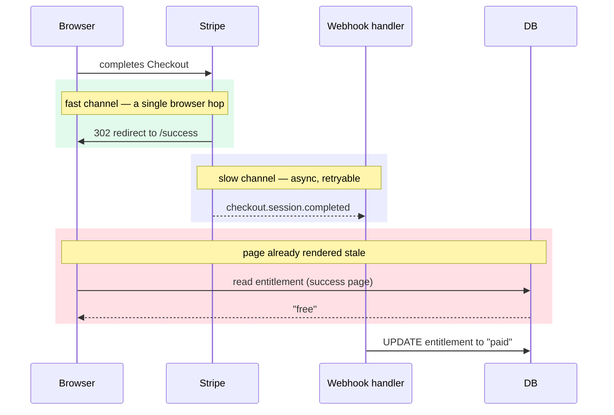

import CourseProgressBar from '../../../components/ui/CourseProgressBar.astro';
import Term from '../../../components/ui/Term.astro';
import AnnotatedCode from '../../../components/code/annotated-code/AnnotatedCode.astro';
import AnnotatedStep from '../../../components/code/annotated-code/AnnotatedStep.astro';
import CodeVariants from '../../../components/code/code-variants/CodeVariants.astro';
import CodeVariant from '../../../components/code/code-variants/CodeVariant.astro';
import EmittedVsArrived from '../../../components/lessons/063/3/EmittedVsArrived.astro';
import VideoCallout from '../../../components/embeds/VideoCallout.astro';
import Figure from '../../../components/figures/Figure.astro';
import Buckets from '../../../components/exercises/buckets/Buckets.astro';
import Bucket from '../../../components/exercises/buckets/Bucket.astro';
import Item from '../../../components/exercises/buckets/Item.astro';
import DrizzleCoding from '../../../components/live-coding/DrizzleCoding/DrizzleCoding.astro';
import ExternalResource from '../../../components/ui/ExternalResource.astro';
import { CardGrid } from '@astrojs/starlight/components';

<CourseProgressBar value={frontmatter['course-progress']} />

Last lesson closed on a deliberate gap. Deduplication stops the *same* event from landing twice, but it can't tell which of two *different* events for the same entity is newer. Each event now lands at most once, in whatever order it arrives.

That gap is where two of the worst billing bugs live. Both look fine in development, where events arrive one at a time in the order you sent them, and both corrupt state in production, where they don't.

The first race is server-to-server. Stripe emits two `customer.subscription.updated` events seconds apart: `active`, then `past_due` once a payment fails. The network reorders them, so `past_due` lands first and `active` lands second. A handler that applies events in *arrival* order writes `past_due`, then writes `active` over the top, parking a delinquent customer back at full access.

The second race is server-to-user. A customer finishes Checkout, Stripe redirects their browser to `/success?session_id=...`, and the page reads their plan while the `checkout.session.completed` webhook is still in flight. The row still says "free," so the page tells someone who *just paid you* that they're on the free plan.

Both races are against the same thing: an asynchronous webhook. The fix for both is one principle: one authoritative writer per entity, its writes time-ordered so stale data can never win. The webhook is that writer. Keep its writes ordered, and let nothing else write just to win a race.

## Stripe makes no ordering promise

Last lesson's contract was *at-least-once delivery*, which forced deduplication. This lesson's is the absence of a promise: Stripe sends events *roughly* in the order things happen, but **delivery order is not guaranteed.**

Treat that as the default, not an edge case. A handler that's only correct when events arrive in order is correct only in development, and you won't find out otherwise until a real customer keeps access they shouldn't have.

If delivery order is untrustworthy, you need a trustworthy source of order in the payload itself. Every event carries `event.created`, a Unix timestamp in seconds stamped the moment Stripe *emitted* it. Two events for the same subscription always have increasing `created` values in emission order, even when they arrive reversed. So `created` is the order Stripe intended, immune to whatever the network does in between.

<EmittedVsArrived />

The two `created` values are identical in both lanes: `100` and `160` don't change, only their positions do. Emission order put `active` first; arrival order put it last. The moment you compare `created` instead of trusting arrival, the reordering becomes recoverable.

## Why "update only if newer" still races

So you reach for the obvious fix: read the row, check whether the incoming event is newer than what's stored, and update only if it is.

<div data-mark-color="red">

```ts {1-4} {6}
const [row] = await tx
  .select()
  .from(planEntitlements)
  .where(eq(planEntitlements.orgId, orgId));

if (row.lastEventAt === null || row.lastEventAt < event.created) {
  await tx
    .update(planEntitlements)
    .set({ status: newStatus, lastEventAt: event.created })
    .where(eq(planEntitlements.orgId, orgId));
}
```

</div>

This is last lesson's race in an ordering disguise. You read `lastEventAt` at one moment and write at a later one, and concurrency lives in that gap. The `active` and `past_due` events, delivered close together onto different workers, both read the *same* stored `lastEventAt`, both decide "I'm newer," and both update. Whichever write lands second wins, decided by wall-clock arrival, the exact ordering you were trying to defeat.

It's TOCTOU again: the check ("am I newer?") and the act ("write") are separate steps, and two handlers can both pass the check before either acts. The fix is last lesson's: collapse check and act into one statement the database evaluates atomically.

:::note
Last lesson, two workers raced through read-read-write-write and the loser's write was silently lost. This is the same race with a timestamp as the contested value instead of a claim, so we go straight to the cure.
:::

## The predicate lives in the UPDATE WHERE

Move the "am I newer?" comparison *into* the UPDATE's `WHERE` clause, so the database evaluates it atomically under the row lock it already takes to write.

This relies on a column you add to every entity the webhook mutates: `last_event_at`, the <Term definition="A stored marker of the furthest-along value seen so far. Here, the created timestamp of the most recent event already applied to the row — any event with an older created is stale by definition.">high-water mark</Term>. It records the `created` of the most recent event applied to the row, so any older incoming event is stale: a newer one already won. The `WHERE` clause asks one question against it: is the incoming event strictly newer?

<AnnotatedCode lang="ts" code={`
const applied = await tx
  .update(planEntitlements)
  .set({ status: newStatus, lastEventAt: event.created })
  .where(
    and(
      eq(planEntitlements.orgId, orgId),
      or(
        isNull(planEntitlements.lastEventAt),
        lt(planEntitlements.lastEventAt, event.created),
      ),
    ),
  )
  .returning({ id: planEntitlements.id });

if (applied.length === 0) {
  // stale event — a newer one already won. log + fall through to 200.
}
`}>
  <AnnotatedStep meta="{3}" color="blue">
    The mark advances *in the same statement* as the state it guards: `status` and `lastEventAt` are written together, atomically, never as a separate follow-up UPDATE that would reopen the gap.
  </AnnotatedStep>

  <AnnotatedStep meta="{6}" color="blue">
    The tenant predicate decides which row this event may touch, the same scoping discipline used everywhere else in the app.
  </AnnotatedStep>

  <AnnotatedStep meta="{7-10}" color="green">
    The whole ordering guarantee: the row updates only if the incoming `created` is strictly newer than the stored mark, or nothing is stored yet. A stale event's `created` is not less than the mark, so it matches no rows.
  </AnnotatedStep>

  <AnnotatedStep meta="{13} {15-17}" color="orange">
    Zero rows back means the predicate didn't match: a newer event already won. Not an error, a correct, expected stale drop. Log it and fall through to a 200.
  </AnnotatedStep>
</AnnotatedCode>

The database does the ordering atomically, with no application-level read, lock, or compare-in-code. The predicate runs under the same row lock the UPDATE takes to write, so two concurrent handlers cannot both pass it: the second to arrive sees the mark the first already advanced. It's last lesson's instinct, lean on the database's atomicity instead of application cleverness, applied to *ordering* rather than *identity*.

Do **not** compare `event.created` against `now()`. The reference is the *row's* `last_event_at`, not the wall clock. Comparing against `now()` invites a clock-skew bug: a `created` slightly in the future, or a handler running a few seconds slow, makes every event look newer than now, and the predicate protects nothing.

:::note
A deliberate simplification: this course models time with Temporal and stores instants as `timestamptz`, confining raw `Date` to third-party seams. Stripe's `created` is a Unix-seconds integer at exactly such a seam, so the examples compare the integer directly. The full `plan_entitlements` schema, including the mark's final column type, is the next chapter's job; here you're learning the *predicate shape*, not shipping the billing table.
:::

## Two independent guards in one transaction

Two predicates now defend against different failures, and both can fire on a single delivery.

Deduplication, from last lesson, protects against the *same* event arriving twice; its tool is the `processed_events` claim. Ordering protects against *different* events for the same entity arriving out of order; its tool is the `last_event_at` predicate. A delivery can be both a duplicate and out of order, and then both guards run and both must pass.

<CodeVariants>
  <CodeVariant label="After last lesson (dedup only)">

    ```ts
    await db.transaction(async (tx) => {
      const claimed = await tx
        .insert(processedEvents)
        .values({ provider: 'stripe', eventId: event.id, eventType: event.type })
        .onConflictDoNothing({
          target: [processedEvents.provider, processedEvents.eventId],
        })
        .returning({ id: processedEvents.id });
      if (claimed.length === 0) return; // duplicate — already processed

      await tx
        .update(planEntitlements)
        .set({ status: newStatus })
        .where(eq(planEntitlements.orgId, orgId));
    });
    ```

    The claim processes this event at most once, but the UPDATE writes unconditionally, so a *stale* event still overwrites newer state. Dedup alone does not order.
  </CodeVariant>

  <CodeVariant label="After this lesson (dedup + ordering)">

    ```ts ins="lastEventAt: event.created" ins={17-19} ins={25-27}
    await db.transaction(async (tx) => {
      const claimed = await tx
        .insert(processedEvents)
        .values({ provider: 'stripe', eventId: event.id, eventType: event.type })
        .onConflictDoNothing({
          target: [processedEvents.provider, processedEvents.eventId],
        })
        .returning({ id: processedEvents.id });
      if (claimed.length === 0) return; // duplicate — already processed

      const applied = await tx
        .update(planEntitlements)
        .set({ status: newStatus, lastEventAt: event.created })
        .where(
          and(
            eq(planEntitlements.orgId, orgId),
            or(
              isNull(planEntitlements.lastEventAt),
              lt(planEntitlements.lastEventAt, event.created),
            ),
          ),
        )
        .returning({ id: planEntitlements.id });

      if (applied.length === 0) {
        // stale ordering — a newer event already won. log; fall through to 200.
      }
    });
    ```

    Same claim, same transaction; the UPDATE now also checks the high-water mark.
  </CodeVariant>
</CodeVariants>

Both guards sit inside the **same outer transaction** from last lesson, so the claim row and the ordered write commit or roll back together, and a crash between them heals on retry. The `mutate` step is just choosier about which writes it makes.

<VideoCallout videoId="u2O-QS-A7jo" videoTitle="Webhooks at scale: best practices and lessons learned">
  A conference talk by Hookdeck's CEO on the Stripe Developers channel (~31 min) on the failures this lesson addresses: out-of-order delivery, at-least-once duplicates, idempotency, and reconciliation.
</VideoCallout>

## Order state, not facts

The ordering predicate earns its place only on tables whose rows carry **mutable state that later events overwrite**, not on tables where each row is an **immutable fact you append**.

A subscription's `status` is state: `active` today, `past_due` tomorrow, each event overwriting the last, so a stale event must lose. A failed-payment attempt in a payments log is a fact: it happened, you record it, and a newer attempt is just another row, not a correction of the old one. A `last_event_at` predicate on an append-only log guards against a conflict that can't occur.

State-bearing rows need both guards, the claim *and* the high-water mark. Append-only logs need deduplication alone, so the same event isn't appended twice.

Try sorting a few scenarios.

<Buckets twoCol instructions="Each scenario is something a webhook handler does to a row. Which needs the ordering predicate, and which is fine with deduplication alone?">
  <Bucket name="state" label="Needs ordering predicate" description="Mutable state a newer event overwrites" />
  <Bucket name="fact" label="Deduplication is enough" description="An immutable fact you append" />

  <Item bucket="state">Set a subscription's status to `past_due`</Item>
  <Item bucket="state">Update the org's plan tier</Item>
  <Item bucket="state">Flip `cancel_at_period_end` on the subscription</Item>
  <Item bucket="fact">Append a failed-payment attempt to the payments log</Item>
  <Item bucket="fact">Record a `charge.refunded` audit row</Item>
  <Item bucket="fact">Log that a dunning email was sent</Item>
</Buckets>

## Observing what you drop

A handler that silently no-ops stale events is doing the right thing, but when something upstream breaks, that correct behavior is invisible: without a record of the drops, you can't tell healthy reordering apart from a fault throwing away events you needed.

So log every stale drop, through the same per-seam child logger from last lesson (`logger.child({ seam: 'webhook.stripe' })`). Record `event.id`, `event.type`, `event.created`, and the row's current `lastEventAt`, enough to reconstruct later which event lost to which mark.

Alert on the rate, not the count. One stale drop in ten thousand is the predicate doing its job; one in ten is an upstream problem like clock skew, a misconfigured retry, or a delivery backlog. The ratio is the signal.

## The success page renders before the webhook lands

The second race is the one your customer actually sees: the Checkout redirect racing the webhook.

1. The customer completes Stripe Checkout.
2. Stripe redirects their browser to `${app}/success?session_id=cs_...`.
3. The success page, a Server Component, renders and reads `plan_entitlements`.
4. `checkout.session.completed` is still in flight, so the row still says "free."
5. The paying customer reads "You're on the Free plan."

The redirect and the webhook are **two independent channels** from Stripe with no ordering between them. The redirect is a single fast hop straight back to the customer; the webhook is a server-to-server delivery routed through Stripe's queue, slower and retryable. The fast channel almost always wins, so the success page renders *before* the entitlement it's trying to show even exists.

<Figure>

  <Fragment slot="caption">
    The redirect beats the webhook, so the success page's first read returns `"free"`, *above* the line where the webhook finally writes `"paid"`.
  </Fragment>
</Figure>

The page rendered "free" not from a bug but because it read too early, and nothing orders the two channels to make it read late enough.

## The wrong fix: a second writer

The obvious fix is to make the success page write the entitlement itself. It has the `session_id`, so it could call Stripe, confirm the payment, and update the row before rendering. No waiting, no stale read.

It doesn't kill the race; it makes a worse one. The entitlement now has **two writers**, the success page and the webhook, writing near-simultaneously with no ordering between them. When the page writes `active` while a `past_due` webhook lands in the same instant, you've recreated the out-of-order corruption the ordering predicate just eliminated, plus a second copy of the write logic that drifts from the first the moment someone edits one and forgets the other.

This is the rule the lesson's title names:

> **The webhook is the only writer for the entity it owns. Everything else reads.**

So if the page can't write, what does it do instead?

## The right fix: read and poll

The page stays a **reader**. It reads the entitlement, and if the webhook hasn't landed yet, it renders a "finalizing your subscription…" state while a small Client Component **polls**: it re-runs the server read on an interval until the entitlement updates, with a hard time budget so it never spins forever.

<AnnotatedCode lang="tsx" code={`
'use client';

import { useRouter } from 'next/navigation';
import { useEffect } from 'react';

export const FinalizePoller = ({ isFinalized }: { isFinalized: boolean }) => {
  const router = useRouter();

  useEffect(() => {
    if (isFinalized) return;

    const startedAt = Date.now();
    const intervalId = setInterval(() => {
      if (Date.now() - startedAt > 30_000) {
        clearInterval(intervalId);
        return; // give up; the UI shows the "taking longer than usual" message
      }
      router.refresh();
    }, 1000);

    return () => clearInterval(intervalId);
  }, [isFinalized, router]);

  return null;
};
`}>
  <AnnotatedStep meta={`{1} "useRouter"`} color="blue">
    This must be a Client Component: it holds an interval and drives the router, and a Server Component can do neither.
  </AnnotatedStep>

  <AnnotatedStep meta="{10}" color="green">
    The parent Server Component passes `isFinalized`, true once the entitlement is updated. The poll's exit condition is server state, passed down as a prop.
  </AnnotatedStep>

  <AnnotatedStep meta="{13-14}" color="blue">
    Poll every second, but bail after ~30 seconds: long enough that the webhook lands even on a slow day, short enough that the customer isn't trapped watching a spinner.
  </AnnotatedStep>

  <AnnotatedStep meta={`{18} "router.refresh()"`} color="green">
    The primitive that drives the loop. It re-runs the Server Component, which re-reads the entitlement. Once the webhook has landed, the next refresh sees "paid," the parent flips `isFinalized` to true, and the poll stops on the following tick.
  </AnnotatedStep>

  <AnnotatedStep meta="{21}" color="blue">
    Clear the interval on unmount and whenever the effect re-runs, so you never leak a timer.
  </AnnotatedStep>
</AnnotatedCode>

The parent Server Component reads the entitlement, computes whether the subscription is finalized, and renders either the finished state or the finalizing state with the poller inside it.

```tsx title="app/success/page.tsx"
export default async function SuccessPage() {
  const entitlement = await getEntitlement(); // dynamic read — see the caution below
  const isFinalized = entitlement.status === 'active';

  if (isFinalized) {
    return <SubscriptionReady plan={entitlement.plan} />;
  }

  return (
    <>
      <FinalizingNotice />
      <FinalizePoller isFinalized={isFinalized} />
    </>
  );
}
```

Two details here are load-bearing, and getting either wrong produces a bug that's hard to diagnose because the code *looks* right.

:::caution
`router.refresh()` does **not** clear the server cache. Under Next.js 16's `cacheComponents`, it clears the client router cache and re-runs your Server Components, but does not invalidate a `'use cache'` server read. So the success page's entitlement read must be **dynamic (uncached)**. Cache it, and every refresh returns the same stale value: the poll spins for the full 30 seconds and gives up *even though the webhook landed perfectly.* If your poll never resolves, this is almost always why.
:::

The second detail is a naming trap. Next.js 16 ships *two* refresh primitives: a Server-Action-only `refresh()`, and the `router.refresh()` from `useRouter()` in a Client Component. The poller is a Client Component, so it uses `router.refresh()`. Grab the wrong one and it won't type-check.

The poll handles the one screen the customer is staring at. To update the rest of the app's cached reads, a billing page in another tab or a sidebar plan badge, the webhook itself should `revalidateTag` the entitlement when it applies the write. Tags and cache invalidation come in a later chapter; here it's enough that the webhook owns both the write and the revalidation.

## The retrieve fast path, and when it's safe

Read-and-poll is almost always right, but some products won't accept even a one-second finalize spinner on the highest-intent screen in the funnel.

The escape hatch: the success page calls `stripe.checkout.sessions.retrieve(sessionId)` directly, confirms `payment_status === 'paid'`, and provisions the entitlement itself, no wait for the webhook. Confirmation is instant.

This violates the single-writer principle on purpose: the success page becomes a second writer, and you take on the write-write reconciliation this lesson warned about. So reach for `retrieve`-and-write only when the product demands instant confirmation, and only if you make that write idempotent and order-safe with the same `last_event_at` predicate and `processed_events` claim the webhook uses. Then both writers run the same atomic, ordered claim and converge on the same answer: the older one harmlessly no-ops instead of corrupting state.

## Both guards in one handler

The full `customer.subscription.updated` handler. Verify and claim are the scaffold from the previous two lessons; the ordered write is new.

<AnnotatedCode lang="ts" maxLines={18} code={`
export const POST = async (request: NextRequest) => {
  const event = await verifyStripeEvent(request); // verify (lesson 1)

  try {
    await db.transaction(async (tx) => {
      // claim the event id in processed_events (lesson 2)
      const claimed = await tx
        .insert(processedEvents)
        .values({ provider: 'stripe', eventId: event.id, eventType: event.type })
        .onConflictDoNothing({
          target: [processedEvents.provider, processedEvents.eventId],
        })
        .returning({ id: processedEvents.id });
      if (claimed.length === 0) return; // duplicate — already processed

      if (event.type === 'customer.subscription.updated') {
        const subscription = event.data.object;
        const applied = await tx
          .update(planEntitlements)
          .set({ status: subscription.status, lastEventAt: event.created })
          .where(
            and(
              eq(planEntitlements.orgId, orgId),
              or(
                isNull(planEntitlements.lastEventAt),
                lt(planEntitlements.lastEventAt, event.created),
              ),
            ),
          )
          .returning({ id: planEntitlements.id });

        if (applied.length === 0) {
          // stale ordering — a newer event already applied. log; fall through.
        }
      }
    });
  } catch {
    return new Response(null, { status: 500 });
  }

  return new Response(null, { status: 200 });
};
`}>
  <AnnotatedStep meta="{2} {7-13}" color="blue">
    Verify proves the event is Stripe's; the claim guarantees at-most-once. Both built in the previous two lessons.
  </AnnotatedStep>

  <AnnotatedStep meta="{18-30}" color="green">
    The ordered write applies only when the incoming event is strictly newer than the stored mark, and advances the mark in the same statement.
  </AnnotatedStep>

  <AnnotatedStep meta="{32-34}" color="orange">
    The stale no-op. Zero rows means a newer event already won: expected, not an error.
  </AnnotatedStep>

  <AnnotatedStep meta="{41}" color="blue">
    One 200 covers all three good outcomes: processed, duplicate, stale no-op. Only a real crash hits the `catch` and returns 500, so Stripe retries that alone.
  </AnnotatedStep>
</AnnotatedCode>

Parts are sketched: `planEntitlements`, the `orgId` resolution, and the exact Stripe field access are placeholders. The `plan_entitlements` schema lands next chapter; resolving which org a subscription belongs to is project work. What's load-bearing is the predicate shape inside the scaffold. The handler around it is unchanged: verify, claim, mutate, 200.

Now write the predicate yourself. The setup seeds one entitlement row whose `last_event_at` is already a later timestamp, as if a newer event had applied. Apply a stale event with an older `created` and confirm the predicate refuses it.

<DrizzleCoding
  instructions="The stored row's last_event_at is already 160 — a newer past_due event already won. Now apply a stale active event whose created is 100. Finish the .where(...) with the ordering predicate — and(eq(orgId), or(isNull(lastEventAt), lt(lastEventAt, 100))) — then .returning({ id }). Because the stored mark is newer, the predicate matches no rows: the stale event is correctly ignored, and you should get zero rows back."
  schema={`export const planEntitlements = pgTable('plan_entitlements', {
  id: text('id').primaryKey(),
  orgId: text('org_id').notNull(),
  status: text('status').notNull(),
  lastEventAt: integer('last_event_at'),
});`}
  seed={`INSERT INTO plan_entitlements (id, org_id, status, last_event_at) VALUES
  ('ent_1', 'org_1', 'past_due', 160);`}
  starter={`// Stale event: status 'active', created 100. The stored mark (160) is newer.
return await db
  .update(planEntitlements)
  .set({ status: 'active', lastEventAt: 100 })
  .where(
    /* finish: tenant predicate AND (no mark yet OR stored mark older than 100) */
  )
  .returning({ id: planEntitlements.id });`}
  expectedRows={[]}
  ordered={false}
/>

Zero rows is the win: the stale `active` event tried to overwrite newer state and the database refused, atomically, with no application-level read. Now flip the outcome: change `created` from `100` to `200` (above the stored `160`) in both `.set({ lastEventAt: 200 })` and the predicate's `lt(lastEventAt, 200)`, then re-run. One row comes back and the mark advances. Newer wins with one row, stale loses with zero.

<details>
<summary>Reference solution</summary>

```ts
return await db
  .update(planEntitlements)
  .set({ status: 'active', lastEventAt: 100 })
  .where(
    and(
      eq(planEntitlements.orgId, 'org_1'),
      or(
        isNull(planEntitlements.lastEventAt),
        lt(planEntitlements.lastEventAt, 100),
      ),
    ),
  )
  .returning({ id: planEntitlements.id });
```

The empty result is correct: the predicate refused the write because the stored mark (`160`) is newer than the incoming `created` (`100`).

</details>

## Single writer, newer wins

One principle ran through the lesson: each entity has a single authoritative writer that writes in time order, so stale data never wins. The webhook owns subscription state, and its high-water-mark predicate lives *inside* the UPDATE, evaluated atomically; the UI only reads. The `plan_entitlements` schema arrives next chapter.

The next lesson, *One pattern, four surfaces*, generalizes this discipline across webhooks, Server Actions, background jobs, and public APIs.

## External resources

<CardGrid>
  <ExternalResource
    title="Stripe — Receive events at your webhook endpoint"
    href="https://docs.stripe.com/webhooks"
    icon="simple-icons:stripe"
    iconColor="#635BFF"
    description="The source for the no-ordering guarantee: its 'Event order' section says delivery order is not promised and tells you to retrieve missing objects from the API instead."
  />
  <ExternalResource
    title="Stripe — Fulfill orders after Checkout"
    href="https://docs.stripe.com/checkout/fulfillment"
    icon="simple-icons:stripe"
    iconColor="#635BFF"
    description="Stripe's own answer to the success-page race: fulfill from the webhook, perform fulfillment only once, and don't rely on the redirect landing page alone."
  />
  <ExternalResource
    title="Next.js — useRouter"
    href="https://nextjs.org/docs/app/api-reference/functions/use-router"
    icon="simple-icons:nextdotjs"
    iconColor="#000000"
    description="Reference for router.refresh(): it clears the client cache and re-runs Server Components but does not invalidate the server cache, which is why the success-page read must be dynamic."
  />
</CardGrid>
