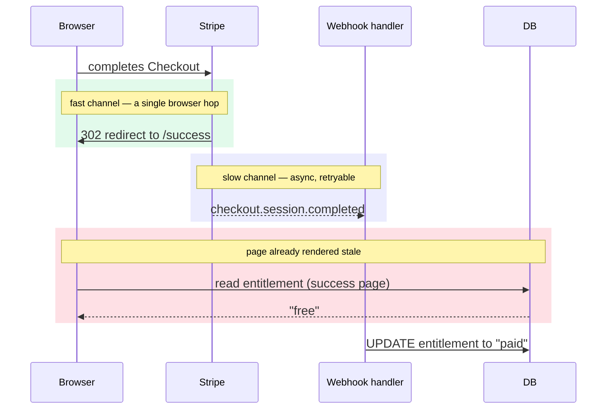

import CourseProgressBar from '../../../components/ui/CourseProgressBar.astro';
import Term from '../../../components/ui/Term.astro';
import AnnotatedCode from '../../../components/code/annotated-code/AnnotatedCode.astro';
import AnnotatedStep from '../../../components/code/annotated-code/AnnotatedStep.astro';
import CodeVariants from '../../../components/code/code-variants/CodeVariants.astro';
import CodeVariant from '../../../components/code/code-variants/CodeVariant.astro';
import EmittedVsArrived from '../../../components/lessons/063/3/EmittedVsArrived.astro';
import VideoCallout from '../../../components/embeds/VideoCallout.astro';
import Figure from '../../../components/figures/Figure.astro';
import Buckets from '../../../components/exercises/buckets/Buckets.astro';
import Bucket from '../../../components/exercises/buckets/Bucket.astro';
import Item from '../../../components/exercises/buckets/Item.astro';
import DrizzleCoding from '../../../components/live-coding/DrizzleCoding/DrizzleCoding.astro';
import ExternalResource from '../../../components/ui/ExternalResource.astro';
import { CardGrid } from '@astrojs/starlight/components';

<CourseProgressBar value={frontmatter['course-progress']} />

Last lesson closed on a deliberate gap. Deduplication protects you from the *same* event arriving twice, but it says nothing about *different* events for the same thing arriving in the wrong order. Your handler now lands each event at most once. It still has no way to tell which event is newer.

That gap is where two of the worst billing bugs live. Both look fine in development, where events arrive one at a time in the order you sent them, and both quietly corrupt state in production, where they don't. Here they are, side by side.

The first race is server-to-server. Stripe emits two `customer.subscription.updated` events seconds apart: first `active`, then `past_due` once a payment fails. The network reorders them, so `past_due` lands first and `active` lands second. A handler that simply applies events in *arrival* order writes `past_due`, then writes `active` over the top, which parks a delinquent customer back at `active` with full access. You're giving away the product, and nothing in your logs looks wrong.

The second race is server-to-user. A customer finishes Checkout, Stripe redirects their browser to `/success?session_id=...`, and the page renders and reads their plan while the `checkout.session.completed` webhook is still in flight. The row still says "free," so the page tells someone who *just paid you* that they're on the free plan, at the worst possible moment to look broken.

Two different surfaces share one enemy: an asynchronous webhook you're racing. The senior question is what the structural fix is for each, and what single principle sits underneath both. Here is the through-line, stated up front so you can hang everything on it: there is one authoritative writer per entity, and its writes are time-ordered so stale data can never win. The webhook is that single writer. The first half of the lesson keeps its writes ordered, and the second half keeps anything else from becoming a second writer just to win a race. By the end you'll have extended last lesson's handler so out-of-order events can't be misapplied, and built a success page that waits for the webhook instead of fighting it.

## Stripe makes no ordering promise

Start with the contract, because it is what makes the mechanism non-negotiable. Last lesson the contract was *at-least-once delivery*, and it forced deduplication. This lesson the contract is the absence of a promise: Stripe sends events *roughly* in the order things happen, but **delivery order is not guaranteed.** The docs say so plainly. Events can and do arrive reordered.

Read that as the default, not an edge case. This reframe separates code that survives production from code that only survives your laptop: out-of-order delivery isn't a rare glitch to handle defensively, it's the baseline assumption. A handler that's only correct when events arrive in order is correct only in development, and you won't find out otherwise until a real customer keeps access they shouldn't have.

If delivery order is untrustworthy, you need a trustworthy source of order somewhere in the payload. Stripe gives you one: every event carries `event.created`, a Unix timestamp in seconds stamped at the moment Stripe *emitted* the event. Two events for the same subscription always have increasing `created` values in emission order, even when they arrive reversed. So `created` is the order Stripe *intended*, frozen into the event and immune to whatever the network does in between. That single field is the ground truth the rest of this lesson is built on.

To keep emission and arrival separate in your head, picture the two tracks.

<EmittedVsArrived />

The two `created` values are identical in both lanes: `100` and `160` don't change. What changes is their position. Emission order put `active` first; arrival order put it last. The moment you compare `created` instead of trusting arrival, the reordering becomes recoverable.

## Why "if newer, then update" still races

So you reach for the obvious fix. Read the row, check whether the incoming event is newer than what's stored, and update only if it is. It reads like plain English.

<div data-mark-color="red">

```ts {1-4} {6}
const [row] = await tx
  .select()
  .from(planEntitlements)
  .where(eq(planEntitlements.orgId, orgId));

if (row.lastEventAt === null || row.lastEventAt < event.created) {
  await tx
    .update(planEntitlements)
    .set({ status: newStatus, lastEventAt: event.created })
    .where(eq(planEntitlements.orgId, orgId));
}
```

</div>

And it's exactly the race you learned to recognize last lesson. Look at where the time passes: you read `lastEventAt` at one moment, and you write at a later moment. There's a gap between the read and the write, and concurrency lives in that gap. The `active` event and the `past_due` event, delivered close together onto different workers, both run this code at once. Both read the *same* current `lastEventAt`. Both evaluate "yes, I'm newer than what's stored," because neither has written yet. Both update. Whichever write physically lands second wins, and that's decided by wall-clock arrival, the exact ordering you were trying to defeat. You wrote ordering-correcting code and got ordering by luck.

This is TOCTOU again, the same time-of-check-to-time-of-use race you fixed for deduplication, now in an ordering disguise. The check ("am I newer?") and the act ("write") are two separate steps, and two handlers can both pass the check before either acts. You already have the reflex for this. The fix follows last lesson's: stop splitting check from act, and collapse them into one statement the database evaluates atomically.

:::note
Last lesson you watched two workers race through read-read-write-write for deduplication, with the loser's write silently lost. This is the identical race, only the contested value is a timestamp instead of a claim. Same race, same cure, so this time we go straight to the cure.
:::

## The predicate lives in the UPDATE WHERE

Here is the fix in one sentence: move the "am I newer?" comparison *into* the UPDATE's `WHERE` clause, so the database evaluates it atomically under the row lock it already takes to write.

That works because of a column you add to every entity the webhook mutates: `last_event_at`, the <Term definition="A stored marker of the furthest-along value seen so far. Here, the created timestamp of the most recent event already applied to the row — any event with an older created is stale by definition.">high-water mark</Term>. It records the `created` of the most recent event that has actually been applied to the row. Any incoming event older than that mark is stale by definition, because a newer one already won. The mark is the reference point, and the `WHERE` clause asks one question against it: is the incoming event strictly newer?

Look at the conflict-resolving UPDATE on its own first, before it goes back into the handler. This is the core of the first half, so step through it.

<AnnotatedCode lang="ts" code={`
const applied = await tx
  .update(planEntitlements)
  .set({ status: newStatus, lastEventAt: event.created })
  .where(
    and(
      eq(planEntitlements.orgId, orgId),
      or(
        isNull(planEntitlements.lastEventAt),
        lt(planEntitlements.lastEventAt, event.created),
      ),
    ),
  )
  .returning({ id: planEntitlements.id });

if (applied.length === 0) {
  // stale event — a newer one already won. log + fall through to 200.
}
`}>
  <AnnotatedStep meta="{3}" color="blue">
    The high-water mark advances *in the same statement* as the state it guards. `status` and `lastEventAt` are written together, atomically, never as a separate follow-up UPDATE that would reopen the gap you're closing.
  </AnnotatedStep>

  <AnnotatedStep meta="{6}" color="blue">
    The tenant predicate decides which row this event is allowed to touch. Same scoping discipline as everywhere else in the app.
  </AnnotatedStep>

  <AnnotatedStep meta="{7-10}" color="green">
    This is the whole ordering guarantee. The row updates *only if* the incoming `created` is strictly newer than the stored mark, or nothing is stored yet. A stale event's `created` is not less than the mark, so it matches no rows.
  </AnnotatedStep>

  <AnnotatedStep meta="{13} {15-17}" color="orange">
    Zero rows back means the predicate didn't match: a newer event already won. That's not an error, it's a correct, expected stale drop. Log it and fall through to a 200.
  </AnnotatedStep>
</AnnotatedCode>

The point lands the same way it did last lesson: the database does the ordering for you, atomically, and you wrote no application-level read, no lock, and no compare-in-code to make it happen. The `WHERE` predicate is evaluated under the same row lock the UPDATE takes to write, so two concurrent handlers cannot both pass it for the same stale comparison. The second one to arrive sees the mark the first one already advanced. It's the same instinct behind last lesson's unique constraint: lean on the database's atomicity instead of application cleverness. Last time you applied it to *identity*; this time you applied it to *ordering*.

One misconception to clear up while it's in front of you: do **not** compare `event.created` against `now()`. The wall clock is not the reference; the *row's* `last_event_at` is. Comparing against `now()` invites a clock-skew bug. A `created` that's slightly in the future, or a handler that runs a few seconds slow, makes every event look newer than now, and the predicate stops protecting anything. Always compare the incoming event against the stored mark, never against the clock.

:::note
A deliberate simplification: this course models time with Temporal and stores instants as `timestamptz`, keeping raw `Date` confined to third-party seams. Stripe's `created` is a Unix-seconds integer at exactly such a seam, so the examples here compare the integer directly to keep the predicate readable. The full `plan_entitlements` schema, including the final column type for the high-water mark, is the next chapter's job. You're learning the *predicate shape*, not shipping the billing table.
:::

## Ordering and dedup are orthogonal guards

You now hold two predicates, and it's worth being precise about what each one defends, because they protect against genuinely different failures and they *compose*.

Deduplication, from last lesson, protects against the *same* event arriving twice. Its tool is the `processed_events` claim. Ordering, from this lesson, protects against *different* events for the same entity arriving out of order. Its tool is the `last_event_at` predicate. Neither replaces the other. A single delivery can be both a duplicate *and* out of order, and when it is, both guards run and both have to pass. Drop either guard and you reopen one class of corruption.

Here is the handler's business step before and after this lesson, framed as a diff so you can see exactly where the new predicate slots in.

<CodeVariants>
  <CodeVariant label="After last lesson (dedup only)">

    ```ts
    await db.transaction(async (tx) => {
      const claimed = await tx
        .insert(processedEvents)
        .values({ provider: 'stripe', eventId: event.id, eventType: event.type })
        .onConflictDoNothing({
          target: [processedEvents.provider, processedEvents.eventId],
        })
        .returning({ id: processedEvents.id });
      if (claimed.length === 0) return; // duplicate — already processed

      await tx
        .update(planEntitlements)
        .set({ status: newStatus })
        .where(eq(planEntitlements.orgId, orgId));
    });
    ```

    The claim guarantees this event is processed at most once, but the business UPDATE writes unconditionally, so a *stale* event still overwrites newer state. Dedup alone does not order.
  </CodeVariant>

  <CodeVariant label="After this lesson (dedup + ordering)">

    ```ts ins="lastEventAt: event.created" ins={17-19} ins={25-27}
    await db.transaction(async (tx) => {
      const claimed = await tx
        .insert(processedEvents)
        .values({ provider: 'stripe', eventId: event.id, eventType: event.type })
        .onConflictDoNothing({
          target: [processedEvents.provider, processedEvents.eventId],
        })
        .returning({ id: processedEvents.id });
      if (claimed.length === 0) return; // duplicate — already processed

      const applied = await tx
        .update(planEntitlements)
        .set({ status: newStatus, lastEventAt: event.created })
        .where(
          and(
            eq(planEntitlements.orgId, orgId),
            or(
              isNull(planEntitlements.lastEventAt),
              lt(planEntitlements.lastEventAt, event.created),
            ),
          ),
        )
        .returning({ id: planEntitlements.id });

      if (applied.length === 0) {
        // stale ordering — a newer event already won. log; fall through to 200.
      }
    });
    ```

    Same claim, same transaction, but now the business UPDATE *also* checks the high-water mark. Both guards live in one commit: the claim stops the same event from applying twice, and the predicate stops an older event from winning.
  </CodeVariant>
</CodeVariants>

Notice what didn't change: both guards still sit inside the **same outer transaction** from last lesson. The claim row and the ordered write commit together or roll back together. A crash between them heals on retry exactly as before. The guarantee you built last lesson is untouched. The `mutate` step just got smarter about which writes it's willing to make.

<VideoCallout videoId="u2O-QS-A7jo" videoTitle="Webhooks at scale: best practices and lessons learned">
  A conference talk by Hookdeck's CEO on the Stripe Developers channel (~31 min) walking through the same event-driven failures this lesson addresses: out-of-order delivery, at-least-once duplicates, idempotency, and reconciliation.
</VideoCallout>

## Order state, not facts

Once a tool works, it's tempting to bolt it onto everything. Resist that here, because the ordering predicate only earns its place on *some* of your tables, and adding it to the rest is over-engineering that hides the rule.

The distinction is whether the entity carries **mutable state that later events overwrite**, or whether each event is an **immutable fact you append**. A subscription's `status` is state: `active` today, `past_due` tomorrow, each event overwriting the last, so order matters and a stale event must lose. A failed-payment attempt written to a payments log is a fact: it happened, you record it, and a *newer* failed-payment attempt doesn't overwrite the old one, it's just another row. Facts aren't overwritten by newer facts; they accumulate. Putting a `last_event_at` predicate on an append-only log guards against a conflict that can't occur.

So the rule, stated cleanly: ordering protects state, and deduplication protects facts. State-bearing entities need both guards, the claim *and* the high-water mark. Append-only fact logs need deduplication alone, so the same event doesn't get appended twice. Knowing which is which is the whole skill; the syntax follows from it.

Try sorting a handful of scenarios.

<Buckets twoCol instructions="Each scenario is something a webhook handler does to a row. Which needs the ordering predicate, and which is fine with deduplication alone?">
  <Bucket name="state" label="Needs ordering predicate" description="Mutable state a newer event overwrites" />
  <Bucket name="fact" label="Deduplication is enough" description="An immutable fact you append" />

  <Item bucket="state">Set a subscription's status to `past_due`</Item>
  <Item bucket="state">Update the org's plan tier</Item>
  <Item bucket="state">Flip `cancel_at_period_end` on the subscription</Item>
  <Item bucket="fact">Append a failed-payment attempt to the payments log</Item>
  <Item bucket="fact">Record a `charge.refunded` audit row</Item>
  <Item bucket="fact">Log that a dunning email was sent</Item>
</Buckets>

## Observing what you drop

A handler that silently no-ops stale events is doing the right thing, but that correct behavior is invisible when something upstream goes wrong. If you never record the drops, you can't tell the difference between healthy, occasional reordering and something badly broken that is throwing away events you needed.

So log every stale drop. Record `event.id`, `event.type`, `event.created`, and the row's current `lastEventAt`, through the same per-seam child logger you set up last lesson (`logger.child({ seam: 'webhook.stripe' })`). That's enough to reconstruct, after the fact, exactly which event lost to which mark.

The judgment that matters here is to alert on the rate, not the count. Dropping one stale event in ten thousand is normal background noise: genuine reordering happens, and the predicate handling it is the system working. Dropping one in ten is an upstream problem, such as clock skew, a misconfigured retry, or a delivery backlog. The absolute number tells you nothing; the *ratio* is the signal. Wiring that alert is a later chapter's concern. Here it's enough to log the right fields and watch the rate.

## The success page renders before the webhook lands

That's the first half: server-to-server ordering, one webhook racing another. The second front is the same enemy on a different surface. This race is server-to-user, the Checkout redirect racing the webhook, and it's the one your customer actually sees.

Walk the timeline concretely:

1. The customer completes Stripe Checkout.
2. Stripe redirects their browser to `${app}/success?session_id=cs_...`.
3. The success page, a Server Component, renders and reads `plan_entitlements`.
4. But `checkout.session.completed` is still in flight. The webhook hasn't run yet, so the row still says "free."
5. The paying customer reads "You're on the Free plan."

The root cause has a name worth holding onto: the redirect and the webhook are **two independent channels** from Stripe, with no ordering between them. One is a browser redirect, a single fast hop straight back to the customer. The other is a server-to-server delivery routed through Stripe's webhook queue, which is slower and can retry. The fast channel almost always wins, so the success page reliably renders *before* the entitlement it's trying to show even exists.

<Figure>

  <Fragment slot="caption">
    Two channels, no ordering between them. The redirect beats the webhook, so the success page's first read returns `"free"`, *above* the line where the webhook finally writes `"paid"`.
  </Fragment>
</Figure>

The diagram makes the timing clear: the browser's read returns "free" *above* the line where the webhook writes "paid." The page didn't render the wrong thing because of a bug in the page. It rendered the wrong thing because it read too early, and there's no ordering between the two channels to make it read late enough.

## The wrong fix: a second writer

The fix that jumps to mind is to make the success page write the entitlement itself. It has the `session_id`, so it could call Stripe, confirm the payment, and update the row right there, before rendering. No waiting, no stale read. It feels like it kills the race outright.

It doesn't kill the race. It changes the race into a worse one. Now the entitlement has **two writers**: the success page *and* the webhook, both writing near-simultaneously, with no ordering between them. Which one wins? What happens when the page writes `active` while a `past_due` webhook is landing in the same instant? You've recreated the exact out-of-order corruption the first half of this lesson just eliminated, and added a second copy of the write logic that will drift from the first the moment someone edits one and forgets the other. The race didn't go away. You reintroduced it on a second surface and took on a maintenance liability on top.

This is the principle the lesson's title names, stated as a hard rule:

> **The webhook is the only writer for the entity it owns. Everything else reads.**

Both halves of the lesson are this one rule, defended on two fronts. The first half made the single writer *order-safe*, so a stale event can't overwrite newer state. The second half protects the single writer from being *joined by a second one* just to win a UI race. Same principle, both directions. So if the page can't write, and it can't, what does it do instead?

## The right fix: read and poll

The page stays a **reader**. It reads the entitlement, and if the webhook hasn't landed yet, it renders a "finalizing your subscription…" state while a small Client Component **polls**: it re-runs the server read on an interval until the entitlement updates, with a hard time budget so it never spins forever.

The poller is the new piece, so step through it.

<AnnotatedCode lang="tsx" code={`
'use client';

import { useRouter } from 'next/navigation';
import { useEffect } from 'react';

export const FinalizePoller = ({ isFinalized }: { isFinalized: boolean }) => {
  const router = useRouter();

  useEffect(() => {
    if (isFinalized) return;

    const startedAt = Date.now();
    const intervalId = setInterval(() => {
      if (Date.now() - startedAt > 30_000) {
        clearInterval(intervalId);
        return; // give up; the UI shows the "taking longer than usual" message
      }
      router.refresh();
    }, 1000);

    return () => clearInterval(intervalId);
  }, [isFinalized, router]);

  return null;
};
`}>
  <AnnotatedStep meta={`{1} "useRouter"`} color="blue">
    This has to be a Client Component: it holds an interval and drives the router, and a Server Component can do neither.
  </AnnotatedStep>

  <AnnotatedStep meta="{10}" color="green">
    The parent Server Component passes `isFinalized`, which is true once the entitlement is updated. When it's true, the poll stops. The poll's exit condition is server state, passed down as a prop.
  </AnnotatedStep>

  <AnnotatedStep meta="{13-14}" color="blue">
    Re-poll on a one-second cadence, but bail after ~30 seconds: long enough that the webhook lands even on a slow day, short enough that the customer isn't trapped watching a spinner.
  </AnnotatedStep>

  <AnnotatedStep meta={`{18} "router.refresh()"`} color="green">
    This is the primitive that drives the loop. It re-runs the Server Component, which re-reads the entitlement. When the webhook has landed, the next refresh sees "paid," the parent flips `isFinalized` to true, and the poll stops on the following tick.
  </AnnotatedStep>

  <AnnotatedStep meta="{21}" color="blue">
    Clear the interval on unmount and whenever the effect re-runs, so you never leak a timer.
  </AnnotatedStep>
</AnnotatedCode>

The parent is a Server Component success page. It reads the entitlement, computes whether the subscription is finalized, and renders either the finished state or the finalizing state with the poller inside it.

```tsx title="app/success/page.tsx"
export default async function SuccessPage() {
  const entitlement = await getEntitlement(); // dynamic read — see the caution below
  const isFinalized = entitlement.status === 'active';

  if (isFinalized) {
    return <SubscriptionReady plan={entitlement.plan} />;
  }

  return (
    <>
      <FinalizingNotice />
      <FinalizePoller isFinalized={isFinalized} />
    </>
  );
}
```

Two details here are load-bearing, and getting either wrong produces a bug that's hard to diagnose because the code *looks* right.

:::caution
`router.refresh()` does **not** clear the server cache. Under Next.js 16's `cacheComponents`, it clears the *client* router cache and re-runs your Server Components, but it does not invalidate a `'use cache'` server read. So the success page's entitlement read must be **dynamic (uncached)**. If you cache it, every refresh returns the same stale value, the poll spins for the full 30 seconds and then gives up, *even though the webhook landed perfectly.* If your poll never resolves, this is almost always why. The success page is a one-shot finalize screen, so caching its read buys you nothing and breaks the loop.
:::

The second detail is a naming trap. Next.js 16 ships *two* refresh primitives: a Server-Action-only `refresh()` function, and the Client-Component `router.refresh()` you get from `useRouter()`. The poller is a Client Component, so it uses `router.refresh()`. Grab the wrong one and it won't type-check where you've put it, so name the distinction once and you won't lose ten minutes to it.

The poll handles the immediate finalize screen, the one customer staring at one page. To update the *rest* of the app's cached reads, such as a billing page in another tab or a sidebar plan badge, the webhook itself should `revalidateTag` the entitlement when it applies the write, passing the cache-life profile that's now required as the second argument. The success-page poll wins the race the customer is watching, and the tag handles eventual consistency everywhere else. The mechanics of tags and cache invalidation are a later chapter's subject. Here it's enough to know the webhook owns both the write and the revalidation.

## When perceived speed wins: the retrieve fast path

Read-and-poll is the default, and it's right almost always. But some products won't accept even a one-second finalize spinner on the highest-intent screen in the funnel, so it's worth naming the escape hatch and its cost honestly rather than pretending it doesn't exist.

The alternative is for the success page to call `stripe.checkout.sessions.retrieve(sessionId)` directly, through the singleton Stripe client from the first lesson, confirm `payment_status === 'paid'`, and provision the entitlement *itself*, with no wait for the webhook. The confirmation is instant.

Be clear-eyed about the trade. This **violates the single-writer principle** on purpose: the success page becomes a second writer, and you take on exactly the write-write reconciliation this lesson warned you about. The course's stance is to default to read-and-poll, because correctness beats perceived latency, and to reach for `retrieve`-and-write only when the product genuinely demands instant confirmation, and *only if* you make that write idempotent and order-safe with the same `last_event_at` predicate and claim the webhook uses. Do that, and the two writers converge on the same answer instead of fighting.

This is the quiet payoff of the whole first half. The reason a second writer is even survivable is the ordering-and-dedup machinery you already built. Without it, two writers is chaos: the last write by luck wins and stale data corrupts state. With it, two writers is merely *redundant*, because both run the same atomic, ordered claim and the older one harmlessly no-ops. The discipline from the first half is precisely what makes the second half's escape hatch safe to take.

## Putting both guards on one handler

Now pull it together. Here is the `customer.subscription.updated` handler end to end. It isn't a fresh handler, it's the *grown* one from last lesson, with verify and claim shown as the already-built scaffold and the new ordered write expanded as the focus.

<AnnotatedCode lang="ts" maxLines={18} code={`
export const POST = async (request: NextRequest) => {
  const event = await verifyStripeEvent(request); // verify (lesson 1)

  try {
    await db.transaction(async (tx) => {
      // claim the event id in processed_events (lesson 2)
      const claimed = await tx
        .insert(processedEvents)
        .values({ provider: 'stripe', eventId: event.id, eventType: event.type })
        .onConflictDoNothing({
          target: [processedEvents.provider, processedEvents.eventId],
        })
        .returning({ id: processedEvents.id });
      if (claimed.length === 0) return; // duplicate — already processed

      if (event.type === 'customer.subscription.updated') {
        const subscription = event.data.object;
        const applied = await tx
          .update(planEntitlements)
          .set({ status: subscription.status, lastEventAt: event.created })
          .where(
            and(
              eq(planEntitlements.orgId, orgId),
              or(
                isNull(planEntitlements.lastEventAt),
                lt(planEntitlements.lastEventAt, event.created),
              ),
            ),
          )
          .returning({ id: planEntitlements.id });

        if (applied.length === 0) {
          // stale ordering — a newer event already applied. log; fall through.
        }
      }
    });
  } catch {
    return new Response(null, { status: 500 });
  }

  return new Response(null, { status: 200 });
};
`}>
  <AnnotatedStep meta="{2} {7-13}" color="blue">
    The trust boundary and the atomic claim, both built in the previous two lessons. Verify proves it's Stripe; the claim guarantees at-most-once. Shown here because you already own them.
  </AnnotatedStep>

  <AnnotatedStep meta="{18-30}" color="green">
    The new core: the ordered write. It only applies when the incoming event is strictly newer than the stored mark, and it advances the mark in the same statement.
  </AnnotatedStep>

  <AnnotatedStep meta="{32-34}" color="orange">
    The stale no-op. Zero rows means a newer event already won, which is expected, not an error.
  </AnnotatedStep>

  <AnnotatedStep meta="{41}" color="blue">
    One 200 covers all three good outcomes: freshly processed, duplicate, and stale no-op. Only a genuine crash hits the `catch` and returns 500, so Stripe retries that and only that.
  </AnnotatedStep>
</AnnotatedCode>

A note on what's real here, in the spirit of last lesson's honesty about its stubs: `planEntitlements`, the `orgId` resolution, and the exact Stripe field access are *sketches*. The `plan_entitlements` schema lands in the next chapter, and resolving which org a subscription belongs to is project work. What's load-bearing is the *predicate shape inside the existing scaffold*, the transferable skill. The handler around it stays exactly the one you've been growing: verify, claim, mutate, 200.

Now write the predicate yourself and watch the stale no-op happen. The setup seeds one entitlement row whose `last_event_at` is *already* set to a later timestamp, as if the newer event has already been applied. Your job is to apply a *stale* event, with an older `created`, and confirm the predicate correctly refuses it.

<DrizzleCoding
  instructions="The stored row's last_event_at is already 160 — a newer past_due event already won. Now apply a stale active event whose created is 100. Finish the .where(...) with the ordering predicate — and(eq(orgId), or(isNull(lastEventAt), lt(lastEventAt, 100))) — then .returning({ id }). Because the stored mark is newer, the predicate matches no rows: the stale event is correctly ignored, and you should get zero rows back."
  schema={`export const planEntitlements = pgTable('plan_entitlements', {
  id: text('id').primaryKey(),
  orgId: text('org_id').notNull(),
  status: text('status').notNull(),
  lastEventAt: integer('last_event_at'),
});`}
  seed={`INSERT INTO plan_entitlements (id, org_id, status, last_event_at) VALUES
  ('ent_1', 'org_1', 'past_due', 160);`}
  starter={`// Stale event: status 'active', created 100. The stored mark (160) is newer.
return await db
  .update(planEntitlements)
  .set({ status: 'active', lastEventAt: 100 })
  .where(
    /* finish: tenant predicate AND (no mark yet OR stored mark older than 100) */
  )
  .returning({ id: planEntitlements.id });`}
  expectedRows={[]}
  ordered={false}
/>

Zero rows back is the win condition. The stale `active` event tried to overwrite newer state and the database refused it, atomically, with no application-level read. Now flip the outcome yourself: change the `created` from `100` to a value *above* `160`, say `200`, in both `.set({ lastEventAt: 200 })` and the predicate's `lt(lastEventAt, 200)`, then re-run. This time one row comes back and the stored mark advances. Two outcomes, both in your hands: newer wins with one row, stale loses with zero rows.

<details>
<summary>Reference solution</summary>

```ts
return await db
  .update(planEntitlements)
  .set({ status: 'active', lastEventAt: 100 })
  .where(
    and(
      eq(planEntitlements.orgId, 'org_1'),
      or(
        isNull(planEntitlements.lastEventAt),
        lt(planEntitlements.lastEventAt, 100),
      ),
    ),
  )
  .returning({ id: planEntitlements.id });
```

The empty result is the correct, expected outcome for a stale event — the predicate refused the write because the stored mark (`160`) is already newer than the incoming `created` (`100`).

</details>

## Single writer, newer wins

Both halves of this lesson were one principle defended twice: there is a single authoritative writer for every entity, and it writes in time order so stale data never wins. The webhook is that writer for the subscription state it owns. An out-of-order event can't overwrite newer state, because the high-water-mark predicate lives *inside* the UPDATE and the database evaluates it atomically. And the UI never becomes a second writer just to win a race. It reads, and it waits.

The skeleton you carried in is unchanged: verify, claim, mutate, 200. The `mutate` step simply grew a second guard alongside the claim, and the success page is a reader that polls. You added power without adding a new shape to learn.

One reminder on scope, matching last lesson's honesty: `plan_entitlements` and the full Stripe subscription state model belong to the next chapter. This lesson taught the *conflict-resolution shape*, the predicate, the high-water mark, and the single-writer rule, and the next chapter ships the schema it lives on.

The next lesson, *One pattern, four surfaces*, takes the discipline you've now built three times over, in dedup, ordering, and single writer, and promotes it into one portable pattern across webhooks, Server Actions, background jobs, and public APIs. The same unique-on-key idea, in four places where it earns its keep.

## External resources

<CardGrid>
  <ExternalResource
    title="Stripe — Receive events at your webhook endpoint"
    href="https://docs.stripe.com/webhooks"
    icon="simple-icons:stripe"
    iconColor="#635BFF"
    description="The source for the no-ordering guarantee: its 'Event order' section says delivery order is not promised and tells you to retrieve missing objects from the API instead."
  />
  <ExternalResource
    title="Stripe — Fulfill orders after Checkout"
    href="https://docs.stripe.com/checkout/fulfillment"
    icon="simple-icons:stripe"
    iconColor="#635BFF"
    description="Stripe's own answer to the success-page race: fulfill from the webhook, perform fulfillment only once, and don't rely on the redirect landing page alone."
  />
  <ExternalResource
    title="Next.js — useRouter"
    href="https://nextjs.org/docs/app/api-reference/functions/use-router"
    icon="simple-icons:nextdotjs"
    iconColor="#000000"
    description="Reference for router.refresh(): it clears the client cache and re-runs Server Components but does not invalidate the server cache, which is why the success-page read must be dynamic."
  />
</CardGrid>
