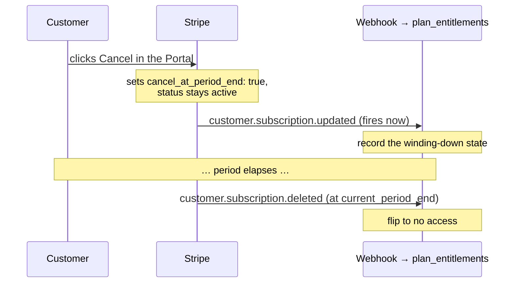
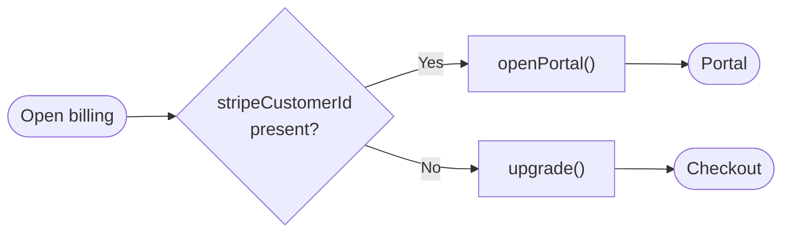

import AnnotatedCode from '../../../components/code/annotated-code/AnnotatedCode.astro';
import AnnotatedStep from '../../../components/code/annotated-code/AnnotatedStep.astro';
import Figure from '../../../components/figures/Figure.astro';
import TabbedContent from '../../../components/figures/tabbed-content/TabbedContent.astro';
import TabbedItem from '../../../components/figures/tabbed-content/TabbedItem.astro';
import StateMachineWalker from '../../../components/figures/state-machine-walker/StateMachineWalker.astro';
import Question from '../../../components/figures/state-machine-walker/Question.astro';
import Branch from '../../../components/figures/state-machine-walker/Branch.astro';
import Leaf from '../../../components/figures/state-machine-walker/Leaf.astro';
import Dropdowns from '../../../components/exercises/dropdowns/Dropdowns.astro';
import DropdownChoice from '../../../components/exercises/dropdowns/DropdownChoice.astro';
import { Code } from '@astrojs/starlight/components';
import PortalRoundtripStrip from '../../../components/lessons/064/3/PortalRoundtripStrip.astro';
import VideoCallout from '../../../components/embeds/VideoCallout.astro';
import ExternalResource from '../../../components/ui/ExternalResource.astro';
import Term from '../../../components/ui/Term.astro';
import { Card, CardGrid } from '@astrojs/starlight/components';
import CourseProgressBar from '../../../components/ui/CourseProgressBar.astro';

<CourseProgressBar value={frontmatter['course-progress']} />

Checkout turned a visitor into a paying customer. Now that customer keeps living in your product, and a few weeks in they want to *change* something. They're paying monthly and realize yearly is cheaper, so they want to switch. Their card got reissued by the bank and the next charge is going to bounce, so they need to update it. Their finance person needs last month's invoice for the books. Or they're leaving, and they want to cancel.

Stop and count what each of those is, as a thing you'd have to build. Switching plans is a screen with a plan picker, proration math, and a confirmation step. Updating a card is a PCI-sensitive form with tokenization and validation. Invoices are a list, a renderer, and a PDF. Cancellation is a flow with a confirmation, a "you'll keep access until…" message, and the billing change behind it. Each one has a happy path and a long tail of edge cases, and each one has to stay correct as tax rules and card networks and your own pricing change underneath it. Stripe has already built every one of these, keeps them current, and will hand them to you for the cost of a single redirect.

That's what this lesson is about: the screens your application *doesn't* build. You'll write one short Server Action — `billing.openPortal()` — that sends a customer into Stripe's hosted **Customer Portal** and brings them back. You'll see what the Portal can do, the configuration it reads, and three sharp rules that separate an integration that holds up from one that generates support tickets and corrupts your data: cancel at the period end, never compute proration, and never trust the return URL. And you'll finish with the one judgment call that matters here: when you're allowed to leave the Portal behind and build the screen yourself. Checkout got the money *in*; this lesson is how it's managed *after*.

## The Portal is a hosted billing screen you redirect to

Here is the whole integration. You create a portal session with the customer's id and a URL to come back to, and Stripe hands you a link:

```ts title="lib/billing/portal.ts"
const session = await stripe.billingPortal.sessions.create({
  customer: org.stripeCustomerId,
  return_url: absoluteUrl('/settings/billing'),
});
```

You redirect the customer to `session.url`. They land on a Stripe-hosted page where they can switch plans, fix their card, grab invoices, or cancel. When they're done, Stripe sends them back to your `return_url`. Your application wrote zero billing UI. No plan picker, no card form, no invoice renderer — none of it. The <Term definition="Stripe-hosted, prebuilt account-management UI scoped to a single Customer — plan changes, payment method, invoice history, and cancellation, all maintained by Stripe.">Customer Portal</Term> is the closest thing to a free, maintained, compliant settings screen in the entire SaaS toolchain, and defaulting to it is the correct engineering call, not a shortcut you'll have to apologize for later.

The shape is a round-trip, and it's worth fixing in your mind before any of the detail, because two of this lesson's three hard rules live at the two ends of it.

<Figure caption="Your app opens the Portal and receives the return; everything in between — the screens, the card, the cancel — is Stripe's.">
  <PortalRoundtripStrip />
</Figure>

What Stripe handed you is a <Term definition="A short-lived, single-use URL scoped to one Customer. It opens that Customer's billing screens and then expires — you mint a fresh one each time.">portal session</Term>: a one-shot URL, scoped to exactly one Customer, that opens the billing screens and then expires. You don't store it, you don't reuse it, you mint a new one every time someone clicks "Manage billing." Now let's see what those screens actually let a customer do.

## What the Portal lets a customer do

The Portal isn't all-or-nothing. You choose which capabilities it exposes, configured once per account in the Stripe dashboard (versioning that configuration in code is its own short topic at the end of this lesson; for the chapter we click it in once). Here is the set this course turns on:

<CardGrid>
  <Card title="Switch plan" icon="random">
    Move within the same product family — Pro monthly to Pro yearly, or Pro up to Team. Stripe handles the billing change.
  </Card>
  <Card title="Cancel" icon="close">
    End the subscription. Configured to take effect **at the end of the period** — the rule we drill next.
  </Card>
  <Card title="Update payment method" icon="setting">
    Replace an expired or declined card. PCI-sensitive form, hosted entirely by Stripe.
  </Card>
  <Card title="Invoice history" icon="document">
    View and download past invoices and receipts — the finance-person request, self-served.
  </Card>
</CardGrid>

Four screens you didn't build, didn't validate, and don't maintain. That's the trade the Portal offers, and for these four it's almost always the right one to take.

But notice where the line falls, because it matters for the rest of the chapter. The Portal shows **Stripe-side billing facts** — what plan you're on, what card is on file, what you've been invoiced. It will *not* show how many API calls you've made this month, that you're three seats over your plan limit, or anything else that lives inside *your* product. Those are your application's own screens, and they read from your own data, not from Stripe. Keep that seam clean: billing facts are the Portal's job; product state is yours. A later lesson builds the in-app surface that warns a customer their subscription is winding down — that's product state the Portal has no concept of.

## Opening the Portal: the `billing.openPortal` action

Now the code. This is the chapter's reference action for reaching the Portal, and it's the second method of the small `billing.*` interface you started with `billing.upgrade` last lesson. It's deliberately small. Read it once top to bottom, then we'll walk it.

<AnnotatedCode lang="ts" maxLines={18} code={`
'use server';

export const openPortal = async (
  returnPath = '/settings/billing',
): Promise<{ url: string }> => {
  const { orgId } = await requireOrgUser();
  const org = await getOrganization(orgId);

  if (!org.stripeCustomerId) {
    throw new BillingError('no_customer', 'Subscribe before managing billing.');
  }

  const session = await stripe.billingPortal.sessions.create({
    customer: org.stripeCustomerId,
    return_url: absoluteUrl(returnPath),
  });

  return { url: session.url };
};
`}>
  <AnnotatedStep meta={`{1,3-5}`} color="blue">
    The directive and the signature. File-level `'use server'` makes this a Server Action; the body runs only on the server, where the Stripe secret lives. Note what it returns: `{ url }`, *not* a `redirect()` call. That's the same shape as `billing.upgrade` from last lesson — the action mints the URL and hands it back, and the caller decides the navigation. `returnPath` is an optional parameter with a default, so most callers pass nothing.
  </AnnotatedStep>

  <AnnotatedStep meta={`{6-7} "requireOrgUser" "getOrganization"`} color="orange">
    Resolve and authorize the org. `requireOrgUser()` is the same server-side reflex from the organizations work — it returns the trusted `{ user, orgId, role }` from the session and throws to the framework boundary if there's no session or no org. `getOrganization(orgId)` (a helper the project ships) then loads the organization row, off which you read `stripeCustomerId`. A portal session is scoped to one Customer, so you authenticate and org-scope *before* you mint anything.
  </AnnotatedStep>

  <AnnotatedStep meta={`{9-11} "BillingError"`} color="red">
    The no-Customer branch, and it's the interesting one. Last lesson's `upgrade` created a Customer lazily if one was missing. This action does the opposite: if `stripeCustomerId` is null, it *throws*. The logic is airtight — no `stripeCustomerId` means no Customer, which means no subscription, which means there is nothing to manage. `BillingError` is a small custom `Error` subclass carrying a machine-readable code; a later lesson gives it its full definition.
  </AnnotatedStep>

  <AnnotatedStep meta={`{13-16} "billingPortal" "return_url"`} color="green">
    The actual Stripe call, and it's two fields. `customer` says whose billing this is; `return_url` says where to send the browser when they're done. That URL must be **absolute** — Stripe is going to redirect a real browser to it, so a relative path won't do. The `absoluteUrl` helper turns `/settings/billing` into the full `https://…` form.
  </AnnotatedStep>

  <AnnotatedStep meta={`{18}`} color="blue">
    Return `{ url }`. From here the client takes over and redirects with `window.location.assign(url)`. The customer leaves your app, manages their billing on Stripe's pages, and lands back at `return_url`.
  </AnnotatedStep>
</AnnotatedCode>

This lives at `lib/billing/portal.ts`, alongside last lesson's `upgrade`. Both files share one non-negotiable rule: the `stripe` client is only ever imported inside `/lib/billing/`. That directory is the single place Stripe shapes are allowed to touch your codebase, which is why the file starts with `import 'server-only'` (so a stray import becomes a build error instead of a leaked secret) and `import { stripe } from '@/lib/stripe'`. The why behind wrapping Stripe at all — the architecture of that `billing.*` interface — is a later lesson; for now it's enough that the import lives here and nowhere else.

One property of that returned URL deserves its own warning.

:::caution
The portal URL is <Term definition="Possession of the token alone grants access — there's no further identity check. Whoever holds the link can act, so the link must be treated like a password.">**bearer-style**</Term> — whoever holds the link can manage that Customer's billing until it expires, with no further identity check. The Portal does not re-authenticate; the URL *is* the credential. So treat it like any one-time secret link: never log it, never email it, never store it. Mint it, redirect to it, let it die. (This is the exit-side twin of last lesson's "the Checkout URL is single-use.")
:::

That `bearer-style` property is why you authorize *before* minting in step 2: the only access check the Portal ever gets is the one your action does up front. Get that wrong and you've handed one customer's billing to another.

<VideoCallout videoId="t2XJ7u-rTZ0" videoTitle="How to Add Stripe Subscriptions to Next.js Apps — Checkout, Webhooks, Portal">
  FullStacked builds the same flow end to end in Next.js (46 min) — jump to 35:51 to watch the billing-portal session minted and redirected to, exactly like `openPortal` above.
</VideoCallout>

## Cancellation defaults to the end of the period

Of everything a customer can do in the Portal, cancellation is the one most likely to bite you if it's misconfigured, so it gets its own section. The rule is short: **never cancel immediately by default — the customer paid for the month.**

When a customer clicks Cancel in the Portal, the configured behavior is *cancel at period end*. The subscription doesn't vanish. It stays `active`, gains a flag — `cancel_at_period_end: true` — and keeps a `current_period_end` date in the future. Access stays fully live until that date. When the period boundary arrives, Stripe ends the subscription. The customer keeps exactly what they already paid for, and not a day more or less.

Get this wrong — cancel immediately the moment someone clicks the button mid-cycle — and you've taken away access they paid for. That's a fair-billing problem and a reliable generator of angry support tickets. The Portal's *cancel at period end* mode exists precisely so you don't have to think about it; configure it once and the right thing happens.

Here's the part that shapes how the rest of the chapter models cancellation. A single cancel produces **two webhook events, separated in time** — one now, one later:

<Figure caption="The Portal triggers cancellation; the webhook records it. The winding-down banner and the actual access flip are built later — here we only note which events the Portal emits.">

</Figure>

Sit with that two-event shape, because it explains a modeling decision a later lesson makes. A single boolean — `is_canceled` — can't represent "canceled but still active until August 14th." It throws away the *when*. That's why the entitlement projection a later lesson builds keeps `cancel_at_period_end` and `current_period_end` as first-class columns rather than collapsing them into one flag. The two-event sequence is the reason the richer shape is necessary.

Now the scope fence, stated plainly so the seam stays clean. This section covers only the *Portal configuration* (cancel at period end) and the *events it emits*. The banner that tells a customer "your plan ends on Aug 14," the undo-and-reactivate link, the actual decision to cut off access — all of that is built later, and it consumes these events. And the rule from the previous chapter still holds without exception: the webhook is the only writer for the entitlement. The Portal triggers events; it does not reach into your database. The <Term definition="A subscription flag. When true, the subscription stays active and billed through the current period, then ends at current_period_end. Set it back to false to reactivate before the period closes.">`cancel_at_period_end`</Term> flag is the primitive that carries this; reactivation is just setting it back to `false`.

## Plan changes and proration are Stripe's math

The other thing customers do in the Portal is switch plans — Pro up to Team, or monthly across to yearly. When they do, Stripe generates a `customer.subscription.updated` event carrying the new Price, and it computes the money for you. Switch mid-cycle and Stripe issues a credit for the unused part of the old price and an immediate charge for the new one (for an upgrade; a downgrade typically credits forward to the next invoice). That calculation is <Term definition="Stripe's automatic credit-and-charge math when a subscription changes mid-cycle — a credit for the unused portion of the old price against the cost of the new one. Mid-cycle, tax-inclusive, multi-currency. The application never computes it.">proration</Term>, and the rule about it is one line: **trust Stripe's proration; never recompute it in your app.**

It's worth being blunt about why. Proration done correctly is mid-cycle, tax-inclusive, and multi-currency — a genuinely deep well of edge cases. Reimplementing it buys you nothing and exposes you to a class of bugs that show up as wrong charges on real customers' cards. Your application's job is not to predict the invoice. Its job is to read the *result* — the new plan — after the change lands.

:::note
Keep the two concerns separate in your head. The *new plan* is an entitlement change that arrives through the webhook and updates what your app lets the customer do. The *charge* is purely Stripe's concern — and the customer can already see the proration line items and the invoice inside the Portal. Your app surfaces neither.
:::

There's one thread from the first lesson of this chapter that pays off here. When the plan-change event arrives, the projection maps the new Stripe Price back to your app's plan slug — `pro`, `team` — through its `lookup_key`. Because that mapping is by stable key and not by a mode-specific Price id, a customer switching plans in the Portal needs *no* code change on your side, even after you re-seed the catalog. The mechanics of that mapping are a later lesson; the point now is that a Portal-driven plan change just works.

## Deep-linking to a specific Portal flow

By default, `openPortal()` drops the customer on the Portal's home screen, and from there they navigate to whatever they came for. That's the right baseline. But sometimes you know exactly where they're headed — a button that literally says "Cancel subscription" shouldn't dump them in the lobby to go hunting for the cancel option. For that, you add `flow_data` to the session and deep-link straight to one flow:

<Code
  lang="ts"
  title="lib/billing/portal.ts"
  mark={[{ range: '4-7' }]}
  code={`const session = await stripe.billingPortal.sessions.create({
  customer: org.stripeCustomerId,
  return_url: absoluteUrl(returnPath),
  flow_data: {
    type: 'subscription_cancel',
    subscription_cancel: { subscription: org.subscriptionId },
  },
});`}
/>

The course cares about three <Term definition="A portal-session parameter that deep-links the customer straight into one prebuilt flow — cancel, plan change, or card update — instead of the Portal home screen.">`flow_data`</Term> flows: `subscription_cancel`, `subscription_update`, and `payment_method_update`. The pattern is the same for all three — name the flow `type`, point it at the right object — so the cancel one above is enough to see the shape.

One rule comes attached to this, and it's about honesty, not code: **name the destination in the link text.** If a button deep-links to cancellation, it reads "Cancel subscription," full stop — not "Manage billing." Dropping a customer onto a cancel-confirmation screen they didn't ask for is a dark-pattern smell and a trust cost you don't want to pay. Deep-links are an enhancement layered on top of the plain `openPortal()`; the Portal-home default is the baseline this chapter ships, and it's a perfectly good one.

## When the Portal stays open after the subscription ends

Two situations trip people up, and they're worth grouping because they turn on the same fact: in Stripe, the **Customer outlives the subscription**.

The first is the **ex-subscriber**. Someone paid for months, then downgraded to your free plan. They have no active subscription anymore — but they still have invoices from when they did, and their finance person will eventually need them. Here's the thing: the Stripe Customer record persists even with no active subscription. So `openPortal()` still works for them, and the Portal still shows their full invoice history. The rule: the Customer outlives any individual subscription, and the Portal stays reachable for as long as the Customer exists.

The second is the **never-subscribed user** — the mirror image, and you already handled it. No `stripeCustomerId` means no Customer, which is exactly the `BillingError` branch in the action. For this person the right move is not the Portal at all; it's Checkout. Surface a "subscribe to manage billing" message and route them to the upgrade flow from last lesson. The Portal is for existing Customers; brand-new subscriptions start at Checkout.

That gives you a clean two-way split for any "open billing" button:

<Figure caption="One branch decides every billing entry point: an existing Customer manages in the Portal; a new one subscribes through Checkout.">

</Figure>

Let's make sure those rules stuck while they're fresh. Fill in each blank:

<Dropdowns instructions="Each blank pins one rule from this lesson — entry-point routing, period-end cancellation, and who writes the entitlement.">
1. A user who has never paid hits the billing page, so you route them to <DropdownChoice answer="Checkout" options={['Checkout', 'the Portal']} /> — not the surface for managing an existing subscription.

2. A customer mid-cycle clicks Cancel, so the subscription's `cancel_at_period_end` becomes <DropdownChoice answer="true" options={['true', 'false']} /> and access <DropdownChoice answer="stays live until period end" options={['stays live until period end', 'ends immediately']} />.

3. After the Portal redirects the customer back, the app updates `plan_entitlements` from <DropdownChoice answer="the webhook" options={['the webhook', 'the return URL']} /> — the only writer for that row.
</Dropdowns>

That last blank is the most important idea in the lesson, and it earns its own section.

## Don't trust the return URL as proof of change

When the customer finishes in the Portal, Stripe redirects them to your `return_url`. The trap is to read that redirect as *news* — to think "they're back, so something must have changed, let me refresh their entitlement." It hasn't necessarily changed at all. The `return_url` fires **regardless** of what the customer did. They might have switched plans. They might have browsed around and left without touching anything. They might have changed their mind halfway and closed the cancel flow. The redirect proves exactly one thing: the customer came *back*. It proves nothing about *state*.

Picture the developer who renders the billing page on return and, on render, calls something like `refreshEntitlementFromStripe(org.id)` to "sync." That code has two ways to hurt, and it'll hit one of them:

- It double-fires an update the webhook already owns. Now two writers are racing for the same `plan_entitlements` row — the exact single-writer violation the previous chapter spent a whole lesson teaching you to avoid.
- Or the webhook hasn't landed yet (redirects routinely beat webhooks), so it reads a not-yet-updated projection and confidently paints stale state — the old plan, dressed up as fresh truth.

The fix isn't a more careful refresh. It's structural: **do nothing stateful on return.** The webhook is the source of truth; let it be. If the return page genuinely needs to reflect a change the customer just made, it does the same thing last lesson's success page did — it *reads* the entitlement and, if the projection isn't finalized yet, mounts the poller from the previous chapter and waits for the webhook to catch up. It reads and polls. It never writes.

Put the wrong and right versions side by side:

<TabbedContent syncKey="return-page">
  <TabbedItem label="Wrong" icon="error" caption="Writes on every return — races the webhook for the same row, or paints a projection that hasn't updated yet.">
    ```tsx title="app/settings/billing/page.tsx" del={5}
    export default async function BillingReturn() {
      const { orgId } = await requireOrgUser();
      const org = await getOrganization(orgId);
      // fires on every return — even when nothing changed
      await refreshEntitlementFromStripe(org.id);
      return <BillingSettings />;
    }
    ```
  </TabbedItem>

  <TabbedItem label="Right" icon="approve-check" caption="Reads the entitlement; if the webhook hasn't landed, polls for it. Never writes — the webhook owns that.">
    ```tsx title="app/settings/billing/page.tsx" ins={4-6}
    export default async function BillingReturn() {
      const { orgId } = await requireOrgUser();
      const org = await getOrganization(orgId);
      const entitlement = await getEntitlement(org.id);
      const isFinalized = entitlement.status === 'active';
      if (!isFinalized) return <FinalizePoller isFinalized={isFinalized} />;
      return <BillingSettings entitlement={entitlement} />;
    }
    ```
  </TabbedItem>
</TabbedContent>

Now connect this to last lesson and lock the pair together as one idea, not two facts to memorize:

- **The Checkout success URL** is the *entry-side* redirect — it is not proof of payment. The webhook proves payment.
- **The Portal return URL** is the *exit-side* redirect — it is not proof of change. The webhook proves the change.

Both collapse to a single principle: **a redirect is a navigation event, never a transaction-completion signal.** This is the same redirect-versus-webhook race from the previous chapter, met again on the other side of the flow. The single-writer rule it taught is the same rule that governs the return page here. If you carry one thing out of this lesson, carry that: the redirect tells you *where the browser is*, never *what happened to your data*.

## Build the screen yourself only when product forces it

The whole lesson has been one argument — default to the Portal — so let's close by turning it from a rule into a decision you can defend, including the cases where the answer flips the other way. Because sometimes it does. Here are the conditions that earn an in-house build:

- **Regulated consent flows** the Portal can't host — explicit retention or cancellation disclosures, jurisdiction-specific copy a lawyer requires on the cancel screen.
- **Complex plan-change UX** — seat-count sliders with their own validation, usage-tier pickers, add-on bundling. The Portal does pick-a-plan; it doesn't do a configurator.
- **B2B contract motions** — an upgrade gated behind sales approval, a quote, or a purchase-order workflow.
- **Internationalization** beyond the languages Stripe's Portal supports.

But know exactly what you're signing up for when you carve one of these out, and price it honestly: **every screen you build is a Stripe-maintained, PCI-aware, localized, continuously-updated screen you now own forever.** The cancellation logic, the proration display, the card tokenization, the invoice rendering — and the long, boring tail of edge cases behind each — all become yours to keep correct as the world changes underneath them. The chapter default is the Portal. An in-house build is a deliberate, justified exception. It is never a default and never an aesthetic preference — "it'd feel more on-brand" is not a reason that survives contact with the maintenance bill.

So here's the order of operations an experienced engineer follows: ship the Portal first, instrument it, and let real product and retention data — not taste — earn the in-house screen. The same trigger-before-tool posture that runs through this whole chapter: you reach for the heavier tool only after the default has crossed a named threshold.

Walk the decision in that exact order. Each question is a gate; only a real product or legal blocker should send you down the build path.

<StateMachineWalker title="Build the billing screen, or use the Portal?">
  <Question id="legal" prompt="Does the flow need consent or disclosure copy the Portal can't host, or sales-approval gating on the change?" description="Regulated retention copy, jurisdiction-specific cancel disclosures, a quote or PO gate before an upgrade — anything legal or sales forces onto the screen.">
    <Branch label="Yes — a legal or sales blocker" to="build-full" />
    <Branch label="No" to="ux" />
  </Question>

  <Question id="ux" prompt="Does the plan-change UX need custom controls beyond pick-a-plan — seat sliders, usage tiers, add-on bundling?" description="The Portal does pick-a-plan; it doesn't do a configurator.">
    <Branch label="Yes — a real configurator" to="build-plan-change" />
    <Branch label="No — pick-a-plan is enough" to="i18n" />
  </Question>

  <Question id="i18n" prompt="Do you need Portal languages Stripe doesn't support?">
    <Branch label="Yes — a locale Stripe lacks" to="build-i18n" />
    <Branch label="No" to="use-portal" rationale="No legal blocker, no custom UX, no missing language" />
  </Question>

  <Leaf id="build-full" verdict="Build in-house">
    A legal or sales-gated flow is a real product requirement the Portal can't meet. This is the carve-out the default was waiting for. You still keep the Portal for invoices and the card form — you only own the screen product forces.
  </Leaf>

  <Leaf id="build-plan-change" verdict="Build the plan-change screen only">
    Hand-roll just the part that genuinely needs custom controls. Even here you keep the Portal for the boring screens — invoices and card update — and let Stripe keep maintaining those forever.
  </Leaf>

  <Leaf id="build-i18n" verdict="Build, or wait for Stripe">
    If the locale is on Stripe's roadmap, waiting is often cheaper than owning a localized billing surface forever. Build only if the language gap is blocking customers today.
  </Leaf>

  <Leaf id="use-portal" verdict="Use the Portal">
    No legal blocker, no custom UX, no missing language. There is no product reason to build. Ship the Portal and move on — and let real product and retention data, not taste, earn any future carve-out.
  </Leaf>
</StateMachineWalker>

Notice that even the build leaves keep the Portal for the screens nobody wants to own — invoices, the card form. An in-house carve-out is almost never "replace the Portal." It's "build the one screen product forces, and let Stripe keep the rest."

## Versioning the Portal config in code

One last awareness beat, kept short on purpose. Everything the Portal exposes — which capabilities are on, the cancel-at-period-end behavior — was configured by clicking around the Stripe dashboard. But Stripe also exposes those settings through the API, under `stripe.billingPortal.configurations.*`. That means you *can* version the Portal's configuration in code and apply it per mode, exactly the way the first lesson described versioning the price catalog with a seed script. The payoff is the same: reviewable diffs and automatic parity between your test and live worlds, instead of two dashboards a human has to keep in sync.

This chapter ships dashboard-configured, for simplicity. The config-as-code path is named here only so you know it exists and know when to reach for it — when "who changed the cancel behavior?" needs an answer in version control, code wins.

## External resources

The Portal moves fast, and the dashboard configuration changes more often than the API. When you wire this up for real, the source of truth is Stripe's own docs:

<CardGrid>
  <ExternalResource
    title="Stripe — Customer Portal"
    href="https://docs.stripe.com/customer-management"
    icon="simple-icons:stripe"
    iconColor="#635BFF"
    description="The integration guide and configuration reference for the hosted billing portal."
  />
  <ExternalResource
    title="Stripe — Portal deep links and flows"
    href="https://docs.stripe.com/customer-management/portal-deep-links"
    icon="simple-icons:stripe"
    iconColor="#635BFF"
    description="The flow_data parameter and the cancel, update, and payment-method flows."
  />
  <ExternalResource
    title="Stripe — Cancel subscriptions"
    href="https://docs.stripe.com/billing/subscriptions/cancel"
    icon="simple-icons:stripe"
    iconColor="#635BFF"
    description="Cancel at period end, reactivation, and which events each path emits — the reference behind this lesson's cancellation rule."
  />
  <ExternalResource
    title="Stripe — Prorations"
    href="https://docs.stripe.com/billing/subscriptions/prorations"
    icon="simple-icons:stripe"
    iconColor="#635BFF"
    description="How Stripe credits and charges across a mid-cycle plan change — the math your app reads but never recomputes."
  />
</CardGrid>
