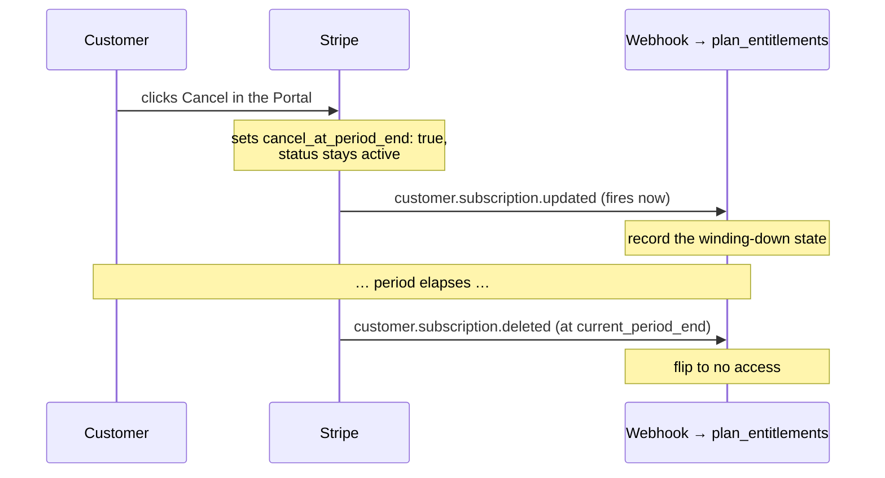
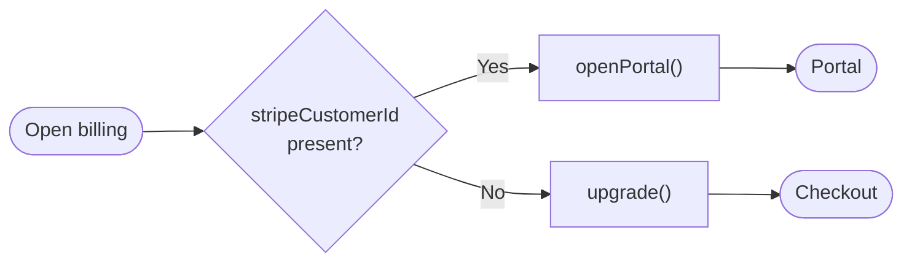

import AnnotatedCode from '../../../components/code/annotated-code/AnnotatedCode.astro';
import AnnotatedStep from '../../../components/code/annotated-code/AnnotatedStep.astro';
import Figure from '../../../components/figures/Figure.astro';
import TabbedContent from '../../../components/figures/tabbed-content/TabbedContent.astro';
import TabbedItem from '../../../components/figures/tabbed-content/TabbedItem.astro';
import StateMachineWalker from '../../../components/figures/state-machine-walker/StateMachineWalker.astro';
import Question from '../../../components/figures/state-machine-walker/Question.astro';
import Branch from '../../../components/figures/state-machine-walker/Branch.astro';
import Leaf from '../../../components/figures/state-machine-walker/Leaf.astro';
import Dropdowns from '../../../components/exercises/dropdowns/Dropdowns.astro';
import DropdownChoice from '../../../components/exercises/dropdowns/DropdownChoice.astro';
import { Code } from '@astrojs/starlight/components';
import PortalRoundtripStrip from '../../../components/lessons/064/3/PortalRoundtripStrip.astro';
import VideoCallout from '../../../components/embeds/VideoCallout.astro';
import ExternalResource from '../../../components/ui/ExternalResource.astro';
import Term from '../../../components/ui/Term.astro';
import { Card, CardGrid } from '@astrojs/starlight/components';
import CourseProgressBar from '../../../components/ui/CourseProgressBar.astro';

<CourseProgressBar value={frontmatter['course-progress']} />

Checkout turned a visitor into a paying customer, and that customer keeps living in your product.
A few weeks in, they want to switch their monthly plan to the cheaper yearly one, update a reissued card before the next charge bounces, pull last month's invoice for their accountant, or cancel.

Each of those is a screen you could build, and each carries a long tail: proration math, PCI-sensitive card forms, an invoice renderer and PDF, a cancellation flow that keeps access until the period ends.
Every one has to stay correct as tax rules, card networks, and your own pricing shift underneath it.
Stripe has built all of them, keeps them current, and hands them to you for the cost of one redirect.

This lesson covers the screens you don't build.
You'll write one short Server Action, `billing.openPortal()`, that sends a customer into Stripe's hosted **Customer Portal** and back.
You'll see what the Portal does, the configuration it reads, and three rules that keep the integration from generating support tickets and corrupting your data: cancel at the period end, never compute proration, never trust the return URL.
You'll finish with the one judgment call that matters: when to skip the Portal and build the screen yourself.

## Redirect to Stripe's hosted billing screen

You create a portal session with the customer's id and a URL to return to, and Stripe hands you a link:

```ts title="lib/billing/portal.ts"
const session = await stripe.billingPortal.sessions.create({
  customer: org.stripeCustomerId,
  return_url: absoluteUrl('/settings/billing'),
});
```

You redirect the customer to `session.url`.
They land on a Stripe-hosted page where they can switch plans, fix their card, download invoices, or cancel.
When they're done, Stripe sends them back to your `return_url`.
Your application wrote zero billing UI: no plan picker, no card form, no invoice renderer.
The <Term definition="Stripe-hosted, prebuilt account-management UI scoped to a single Customer: plan changes, payment method, invoice history, and cancellation, all maintained by Stripe.">Customer Portal</Term> is the closest thing to a free, maintained, compliant billing screen in the stack, so reach for it by default.

The shape is a round-trip, and two of this lesson's three hard rules live at its ends.

<Figure caption="Your app opens the Portal and receives the return; the screens in between are Stripe's.">
  <PortalRoundtripStrip />
</Figure>

What Stripe handed you is a <Term definition="A short-lived, single-use URL scoped to one Customer. It opens that Customer's billing screens and then expires; you mint a fresh one each time.">portal session</Term>.
You don't store it or reuse it: you mint a new one every time someone clicks "Manage billing."
Now let's see what those screens let a customer do.

## What the Portal handles, and what stays yours

The Portal isn't all-or-nothing: you pick which capabilities it exposes, configured once per account in the Stripe dashboard.
This course turns on four.

<CardGrid>
  <Card title="Switch plan" icon="random">
    Move within the same product family: Pro monthly to Pro yearly, or Pro up to Team. Stripe handles the billing change.
  </Card>
  <Card title="Cancel" icon="close">
    End the subscription. Configured to take effect **at the end of the period**, the rule we cover next.
  </Card>
  <Card title="Update payment method" icon="setting">
    Replace an expired or declined card, on a PCI-sensitive form hosted entirely by Stripe.
  </Card>
  <Card title="Invoice history" icon="document">
    View and download past invoices and receipts: the finance-person request, self-served.
  </Card>
</CardGrid>

Four screens you didn't build, validate, or maintain.
For these four, that trade is almost always worth taking.

Notice where the line falls, because it shapes the rest of the chapter.
The Portal shows **Stripe-side billing facts**: your plan, the card on file, what you've been invoiced.
It knows nothing about how many API calls you've made this month or that you're three seats over your limit, because that lives in your product.
Those screens read from your own data, not from Stripe.
Keep the seam clean: billing facts are the Portal's job, product state is yours, including the in-app warning that a subscription is winding down, which a later lesson builds.

## Opening the Portal: the `billing.openPortal` action

This is the second method of the small `billing.*` interface, paired with `billing.upgrade` from last lesson.

<AnnotatedCode lang="ts" maxLines={18} code={`
'use server';

export const openPortal = async (
  returnPath = '/settings/billing',
): Promise<{ url: string }> => {
  const { orgId } = await requireOrgUser();
  const org = await getOrganization(orgId);

  if (!org.stripeCustomerId) {
    throw new BillingError('no_customer', 'Subscribe before managing billing.');
  }

  const session = await stripe.billingPortal.sessions.create({
    customer: org.stripeCustomerId,
    return_url: absoluteUrl(returnPath),
  });

  return { url: session.url };
};
`}>
  <AnnotatedStep meta={`{1,3-5}`} color="blue">
    The directive and the signature. File-level `'use server'` makes this a Server Action, so the body runs only on the server, where the Stripe secret lives. It returns `{ url }`, not a `redirect()` call: the same shape as `billing.upgrade`, where the action mints the URL and the caller decides the navigation. `returnPath` has a default, so most callers pass nothing.
  </AnnotatedStep>

  <AnnotatedStep meta={`{6-7} "requireOrgUser" "getOrganization"`} color="orange">
    Resolve and authorize the org. `requireOrgUser()` returns the trusted `{ user, orgId, role }` from the session and throws to the framework boundary when there's no session or org. `getOrganization(orgId)` then loads the organization row, from which you read `stripeCustomerId`. A portal session is scoped to one Customer, so you authenticate and org-scope before minting anything.
  </AnnotatedStep>

  <AnnotatedStep meta={`{9-11} "BillingError"`} color="red">
    The no-Customer branch. Last lesson's `upgrade` created a Customer lazily when one was missing; this action does the opposite. No `stripeCustomerId` means no Customer, no subscription, and nothing to manage, so it throws. `BillingError` is a small `Error` subclass carrying a machine-readable code, defined fully in a later lesson.
  </AnnotatedStep>

  <AnnotatedStep meta={`{13-16} "billingPortal" "return_url"`} color="green">
    The Stripe call, two fields. `customer` says whose billing this is; `return_url` says where to send the browser when they're done. That URL must be **absolute**, because Stripe redirects a real browser to it. The `absoluteUrl` helper turns `/settings/billing` into the full `https://…` form.
  </AnnotatedStep>

  <AnnotatedStep meta={`{18}`} color="blue">
    Return `{ url }`. The client takes over and redirects with `window.location.assign(url)`. The customer leaves your app, manages billing on Stripe's pages, and lands back at `return_url`.
  </AnnotatedStep>
</AnnotatedCode>

This lives at `lib/billing/portal.ts`, beside last lesson's `upgrade`, under one non-negotiable rule: the `stripe` client is imported only inside `/lib/billing/`.
So the file opens with `import 'server-only'`, which turns a stray client import into a build error rather than a leaked secret, and `import { stripe } from '@/lib/stripe'`.
Why the project wraps Stripe at all is a later lesson; here, the import belongs in this directory and nowhere else.

:::caution
The portal URL is <Term definition="Possession of the token alone grants access — there's no further identity check. Whoever holds the link can act, so the link must be treated like a password.">**bearer-style**</Term>: whoever holds it can manage that Customer's billing until it expires, with no further identity check.
The Portal does not re-authenticate, so the URL is the credential.
Treat it like any one-time secret link: never log it, never email it, never store it.
Mint it, redirect to it, let it expire.
It's the exit-side twin of last lesson's single-use Checkout URL.
:::

Because the URL is bearer-style, the only access check the Portal ever gets is the one your action runs up front, in step 2.
Get that wrong and you've handed one customer's billing to another.

<VideoCallout videoId="t2XJ7u-rTZ0" videoTitle="How to Add Stripe Subscriptions to Next.js Apps — Checkout, Webhooks, Portal">
  FullStacked builds the same flow end to end in Next.js (46 min); jump to 35:51 for the billing-portal session minted and redirected to, exactly like `openPortal` above.
</VideoCallout>

## Cancel at period end, and the two events it emits

Cancellation is the one Portal action that causes real trouble when misconfigured, so configure it deliberately: **never cancel immediately, because the customer paid for the month.**

When a customer clicks Cancel in the Portal, the configured behavior is *cancel at period end*.
The subscription doesn't vanish.
It stays `active`, gains a `cancel_at_period_end: true` flag, and keeps its `current_period_end` date in the future.
Access stays live until that date, when Stripe ends the subscription.
The customer keeps exactly what they paid for, no more and no less.
Cancel mid-cycle instead and you've taken away access someone paid for, which is unfair billing and a steady source of angry tickets.

A single cancel produces **two webhook events, separated in time**, one now and one later:

<Figure caption="One cancel, two events: customer.subscription.updated fires now to record the winding-down state, and customer.subscription.deleted fires at current_period_end.">

```mermaid
%%{init: {'themeCSS': '.messageText, .messageText tspan { font-size: 20px !important; } .actor { font-size: 18px !important; } .noteText, .noteText tspan { font-size: 18px !important; }'} }%%
sequenceDiagram
  participant C as Customer
  participant S as Stripe
  participant W as Webhook → plan_entitlements
  C->>S: clicks Cancel in the Portal
  Note over S: sets cancel_at_period_end: true,<br/>status stays active
  S->>W: customer.subscription.updated (fires now)
  Note over W: record the winding-down state
  Note over C,W: … period elapses …
  S->>W: customer.subscription.deleted (at current_period_end)
  Note over W: flip to no access
```
</Figure>

That two-event shape forces a modeling decision.
A single `is_canceled` boolean can't represent "canceled but still active until August 14th": it throws away the *when*.
So the entitlement projection a later lesson builds keeps `cancel_at_period_end` and `current_period_end` as first-class columns rather than one flag.

This section covers only the Portal configuration and the events it emits; the winding-down banner, the undo-and-reactivate link, and the actual access flip come later and consume these events.
The <Term definition="A subscription flag. When true, the subscription stays active and billed through the current period, then ends at current_period_end. Set it back to false to reactivate before the period closes.">`cancel_at_period_end`</Term> flag carries all of this, and reactivation is just setting it back to `false`.

## Plan changes and proration

The other thing customers do in the Portal is switch plans: Pro up to Team, or monthly across to yearly.
Stripe fires a `customer.subscription.updated` event carrying the new Price and computes the money for you.
Switch mid-cycle and Stripe credits the unused part of the old price and charges immediately for the new one on an upgrade; a downgrade typically credits forward to the next invoice.
That calculation is <Term definition="Stripe's automatic credit-and-charge math when a subscription changes mid-cycle — a credit for the unused portion of the old price against the cost of the new one. Mid-cycle, tax-inclusive, multi-currency. The application never computes it.">proration</Term>, and the rule is one line: **trust Stripe's proration; never recompute it in your app.**

Correct proration is a deep well of edge cases, and reimplementing it buys you nothing while exposing you to wrong charges on real customers' cards.
Your app's job is not to predict the invoice but to read the result, the new plan, after the change lands.

:::note
Keep the two concerns separate. The *new plan* is an entitlement change: it arrives through the webhook and updates what your app lets the customer do. The *charge* is Stripe's concern, and the customer already sees the proration line items and the invoice inside the Portal. Your app surfaces neither.
:::

When the plan-change event arrives, the projection maps the new Stripe Price back to your plan slug (`pro`, `team`) through its `lookup_key`.
Because that mapping keys off a stable string rather than a mode-specific Price id, a Portal plan change needs no code on your side, even after you re-seed the catalog.

## Deep-linking to a specific Portal flow

By default, `openPortal()` drops the customer on the Portal's home screen to navigate from there, which is the right baseline.
But sometimes you know exactly where they're headed: a button that says "Cancel subscription" shouldn't strand them on the home screen hunting for the cancel option.
For that, add `flow_data` to the session and deep-link straight to one flow:

<Code
  lang="ts"
  title="lib/billing/portal.ts"
  mark={[{ range: '4-7' }]}
  code={`const session = await stripe.billingPortal.sessions.create({
  customer: org.stripeCustomerId,
  return_url: absoluteUrl(returnPath),
  flow_data: {
    type: 'subscription_cancel',
    subscription_cancel: { subscription: org.subscriptionId },
  },
});`}
/>

The course uses three <Term definition="A portal-session parameter that deep-links the customer straight into one prebuilt flow — cancel, plan change, or card update — instead of the Portal home screen.">`flow_data`</Term> flows: `subscription_cancel`, `subscription_update`, and `payment_method_update`.
The pattern is the same for each: name the flow `type`, then point it at the right object, as the cancel session above does.

One rule comes attached, and it is about honesty rather than code: **name the destination in the link text.**
A button that deep-links to cancellation reads "Cancel subscription," not "Manage billing."
Dropping a customer onto a cancel-confirmation screen they didn't ask for is a dark pattern and a trust cost you don't want to pay.

## Who gets the Portal, and who gets Checkout

Two cases turn on one fact: in Stripe, the **Customer outlives the subscription**.

The **ex-subscriber** paid for months, then downgraded to your free plan.
They have no active subscription, but they still have invoices their finance person will eventually need.
The Stripe Customer record persists with no active subscription, so `openPortal()` still works and the Portal still shows their full invoice history.

The **never-subscribed user** is the reverse: no `stripeCustomerId` means no Customer, the `BillingError` branch in the action.
The right move here is not the Portal but Checkout.
Surface a "subscribe to manage billing" message and route them to last lesson's upgrade flow.

That gives a clean two-way split for any "open billing" button:

<Figure caption="One branch routes every billing entry point: an existing Customer to the Portal, a new one to Checkout.">

```mermaid
%%{init: {'themeCSS': '.nodeLabel, .nodeLabel * { font-size: 18px !important; } .edgeLabel, .edgeLabel * { font-size: 16px !important; }'} }%%
flowchart LR
  A([Open billing]) --> B{stripeCustomerId<br/>present?}
  B -->|Yes| C["openPortal()"] --> D([Portal])
  C@{ shape: rect }
  B -->|No| E["upgrade()"] --> F([Checkout])
  E@{ shape: rect }
```
</Figure>

Check those three rules. Fill in each blank:

<Dropdowns instructions="Each blank pins one rule from this lesson: entry-point routing, period-end cancellation, and who writes the entitlement.">
1. A user who has never paid hits the billing page, so you route them to <DropdownChoice answer="Checkout" options={['Checkout', 'the Portal']} /> — not the surface for managing an existing subscription.

2. A customer mid-cycle clicks Cancel, so the subscription's `cancel_at_period_end` becomes <DropdownChoice answer="true" options={['true', 'false']} /> and access <DropdownChoice answer="stays live until period end" options={['stays live until period end', 'ends immediately']} />.

3. After the Portal redirects the customer back, the app updates `plan_entitlements` from <DropdownChoice answer="the webhook" options={['the webhook', 'the return URL']} /> — the only writer for that row.
</Dropdowns>

## The return URL is not proof of change

When the customer finishes in the Portal, Stripe redirects them to your `return_url`.
The trap is to read that redirect as news: "they're back, so something changed, let me refresh their entitlement."
But the `return_url` fires **regardless** of what the customer did.
They might have switched plans, or browsed and left without touching anything, or opened the cancel flow and backed out.
The redirect proves one thing only: the customer came back. It proves nothing about state.

Picture a billing page that, on return, calls `refreshEntitlementFromStripe(org.id)` to "sync."
That call has two ways to go wrong, and it will hit one of them:

- It double-fires an update the webhook already owns. Now two writers race for the same `plan_entitlements` row, the exact single-writer violation the previous chapter spent a lesson teaching you to avoid.
- The webhook hasn't landed yet, because redirects routinely beat webhooks. The page reads a not-yet-updated projection and paints stale state: the old plan, shown as current truth.

The fix isn't a more careful refresh, it's structural: **do nothing stateful on return.**
The webhook is the source of truth, so let it write.
If the return page needs to reflect a change the customer just made, it does what last lesson's success page did.
It *reads* the entitlement, and if the projection isn't finalized, mounts the poller from the previous chapter and waits for the webhook to catch up.
It reads and polls; it never writes.

<TabbedContent syncKey="return-page">
  <TabbedItem label="Wrong" icon="error" caption="Writes on every return, racing the webhook for the same row or painting a projection that hasn't updated yet.">
    ```tsx title="app/settings/billing/page.tsx" del={5}
    export default async function BillingReturn() {
      const { orgId } = await requireOrgUser();
      const org = await getOrganization(orgId);
      // fires on every return — even when nothing changed
      await refreshEntitlementFromStripe(org.id);
      return <BillingSettings />;
    }
    ```
  </TabbedItem>

  <TabbedItem label="Right" icon="approve-check" caption="Reads the entitlement; if the webhook hasn't landed, polls for it. Never writes, because the webhook owns that.">
    ```tsx title="app/settings/billing/page.tsx" ins={4-6}
    export default async function BillingReturn() {
      const { orgId } = await requireOrgUser();
      const org = await getOrganization(orgId);
      const entitlement = await getEntitlement(org.id);
      const isFinalized = entitlement.status === 'active';
      if (!isFinalized) return <FinalizePoller isFinalized={isFinalized} />;
      return <BillingSettings entitlement={entitlement} />;
    }
    ```
  </TabbedItem>
</TabbedContent>

Now hold this together with last lesson as one idea, not two facts to memorize:

- **The Checkout success URL** is the *entry-side* redirect, and it is not proof of payment. The webhook proves payment.
- **The Portal return URL** is the *exit-side* redirect, and it is not proof of change. The webhook proves the change.

Both collapse to one principle: **a redirect is a navigation event, never a transaction-completion signal.**
It tells you where the browser is, never what happened to your data.

## When to build instead of using the Portal

Default to the Portal, but some requirements earn an in-house build.
These are the conditions that justify one:

- **Regulated consent flows the Portal can't host:** explicit retention or cancellation disclosures, or jurisdiction-specific copy a lawyer requires on the cancel screen.
- **Complex plan-change UX:** seat-count sliders with their own validation, usage-tier pickers, add-on bundling. The Portal does pick-a-plan, not a configurator.
- **B2B contract motions:** an upgrade gated behind sales approval, a quote, or a purchase-order workflow.
- **Internationalization** beyond the languages Stripe's Portal supports.

Price each carve-out honestly: every screen you build is a Stripe-maintained, PCI-aware, localized, continuously-updated screen you now own forever.
Cancellation logic, proration display, card tokenization, invoice rendering, and the long tail of edge cases behind each all become yours to keep correct.
An in-house build is a justified exception, not an aesthetic preference.

Ship the Portal first, instrument it, and let real product and retention data earn the in-house screen.
Walk the decision in order, and let only a real product or legal blocker send you down the build path.

<StateMachineWalker title="Build the billing screen, or use the Portal?">
  <Question id="legal" prompt="Does the flow need consent or disclosure copy the Portal can't host, or sales-approval gating on the change?" description="Regulated retention copy, jurisdiction-specific cancel disclosures, a quote or PO gate before an upgrade: anything legal or sales forces onto the screen.">
    <Branch label="Yes, a legal or sales blocker" to="build-full" />
    <Branch label="No" to="ux" />
  </Question>

  <Question id="ux" prompt="Does the plan-change UX need custom controls beyond pick-a-plan, such as seat sliders, usage tiers, or add-on bundling?" description="The Portal does pick-a-plan; it doesn't do a configurator.">
    <Branch label="Yes, a real configurator" to="build-plan-change" />
    <Branch label="No, pick-a-plan is enough" to="i18n" />
  </Question>

  <Question id="i18n" prompt="Do you need Portal languages Stripe doesn't support?">
    <Branch label="Yes, a locale Stripe lacks" to="build-i18n" />
    <Branch label="No" to="use-portal" rationale="No legal blocker, no custom UX, no missing language" />
  </Question>

  <Leaf id="build-full" verdict="Build in-house">
    A legal or sales-gated flow is a real requirement the Portal can't meet. This is the carve-out the default was waiting for. Keep the Portal for invoices and the card form; own only the screen product forces.
  </Leaf>

  <Leaf id="build-plan-change" verdict="Build the plan-change screen only">
    Hand-roll just the part that needs custom controls. Keep the Portal for the routine screens, invoices and card update.
  </Leaf>

  <Leaf id="build-i18n" verdict="Build, or wait for Stripe">
    If the locale is on Stripe's roadmap, waiting is often cheaper than owning a localized billing surface forever. Build only if the language gap blocks customers today.
  </Leaf>

  <Leaf id="use-portal" verdict="Use the Portal">
    No legal blocker, no custom UX, no missing language, so no product reason to build. Ship the Portal and let future product and retention data earn any carve-out.
  </Leaf>
</StateMachineWalker>

Even the build outcomes keep the Portal for the screens nobody wants to own.
A carve-out is almost never "replace the Portal"; it's "build the one screen product forces, and let Stripe keep the rest."

## Configuring the Portal in code instead of the dashboard

The Portal settings you set by clicking through the dashboard, which capabilities are on and the cancel-at-period-end behavior, are also exposed through the API under `stripe.billingPortal.configurations.*`.
That lets you version the configuration in code and apply it per mode, the way the first lesson seeded the price catalog, so you get reviewable diffs and automatic test-and-live parity instead of two dashboards to keep in sync.

This chapter stays dashboard-configured for simplicity; reach for config-as-code once changes to Portal behavior need to be tracked in version control.

## External resources

The Portal moves fast, and the dashboard configuration changes more often than the API. When you wire this up for real, the source of truth is Stripe's own docs.

<CardGrid>
  <ExternalResource
    title="Stripe — Customer Portal"
    href="https://docs.stripe.com/customer-management"
    icon="simple-icons:stripe"
    iconColor="#635BFF"
    description="The integration guide and configuration reference for the hosted billing portal."
  />
  <ExternalResource
    title="Stripe — Portal deep links and flows"
    href="https://docs.stripe.com/customer-management/portal-deep-links"
    icon="simple-icons:stripe"
    iconColor="#635BFF"
    description="The flow_data parameter and the cancel, update, and payment-method flows."
  />
  <ExternalResource
    title="Stripe — Cancel subscriptions"
    href="https://docs.stripe.com/billing/subscriptions/cancel"
    icon="simple-icons:stripe"
    iconColor="#635BFF"
    description="Cancel at period end, reactivation, and which events each path emits: the reference behind this lesson's cancellation rule."
  />
  <ExternalResource
    title="Stripe — Prorations"
    href="https://docs.stripe.com/billing/subscriptions/prorations"
    icon="simple-icons:stripe"
    iconColor="#635BFF"
    description="How Stripe credits and charges across a mid-cycle plan change: the math your app reads but never recomputes."
  />
</CardGrid>
