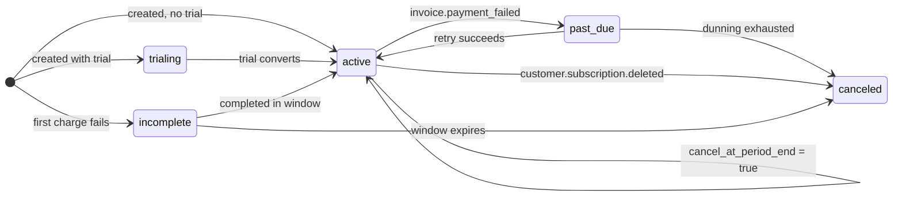

import StateMachineWalker from '../../../components/figures/state-machine-walker/StateMachineWalker.astro';
import Question from '../../../components/figures/state-machine-walker/Question.astro';
import Branch from '../../../components/figures/state-machine-walker/Branch.astro';
import AnnotatedCode from '../../../components/code/annotated-code/AnnotatedCode.astro';
import AnnotatedStep from '../../../components/code/annotated-code/AnnotatedStep.astro';
import Figure from '../../../components/figures/Figure.astro';
import ReactCoding from '../../../components/live-coding/ReactCoding/ReactCoding.astro';
import Buckets from '../../../components/exercises/buckets/Buckets.astro';
import Bucket from '../../../components/exercises/buckets/Bucket.astro';
import Item from '../../../components/exercises/buckets/Item.astro';
import MultipleChoice from '../../../components/exercises/multiple-choice/MultipleChoice.astro';
import McqChoice from '../../../components/exercises/multiple-choice/McqChoice.astro';
import McqWhy from '../../../components/exercises/multiple-choice/McqWhy.astro';
import Sequence from '../../../components/exercises/sequence/Sequence.astro';
import Step from '../../../components/exercises/sequence/Step.astro';
import { Code, CardGrid } from '@astrojs/starlight/components';
import ExternalResource from '../../../components/ui/ExternalResource.astro';
import Term from '../../../components/ui/Term.astro';
import AccessVsTier from '../../../components/lessons/064/5/AccessVsTier.astro';
import StatusBanners from '../../../components/lessons/064/5/StatusBanners.astro';
import CourseProgressBar from '../../../components/ui/CourseProgressBar.astro';

<CourseProgressBar value={frontmatter['course-progress']} />

A customer's renewal card expires overnight. The bank reissued it, but the new number never reached your billing provider. Saturday morning, they open the product they pay for and they're locked out: no warning email, no banner, no grace, just a paywall where their dashboard used to be. The worst support ticket your product can generate, from a one-line mistake: somewhere in your code, access is a boolean, and it just flipped to `false`.

The opposite failure has the same root cause. Someone clicks *Upgrade to Pro*, lands on Stripe Checkout, and their card is declined. A half-built subscription row gets created anyway, the first charge never clears, and to your boolean it looks active. They never paid a cent, and they're using Pro for free. One bug locks out a paying customer; the other gives the product away. Both come from collapsing a rich billing status into a yes/no.

In the [previous lesson](/064-stripe-billing-and-plan-entitlements/4-plan-entitlements-as-a-derived-view) you stored a `status` column on the `plan_entitlements` row, a label copied straight from Stripe with no behavior attached. Here you give it meaning. By the end you'll have one function, `hasActiveAccess`, that every gate calls to answer "can this org get in at all," plus a banner that warns a lapsing customer *before* it revokes anything. One idea carries the lesson: a subscription status is a string with semantics, decoded in exactly one place.

## Why a boolean throws away money

The tempting shape is a single column, `is_paid: boolean`. It reads beautifully at the call site, `if (org.isPaid)`, and it costs real revenue. A boolean has two states; the billing relationship has at least five, and the difference between them is money.

Three situations a boolean cannot represent, each one it gets expensively wrong:

- **A card that just failed.** The charge bounced, but Stripe isn't done: it's *retrying* on a schedule, and most failed renewals recover within days. Flip to `false` on the first failure and you lock out a customer Stripe was about to recover.
- **A cancellation that hasn't taken effect yet.** A customer cancels on the 2nd but has paid through the 14th. They bought the month, so they're owed access until the 14th. Cut them off on the 2nd and you've charged for a service you stopped providing, a chargeback waiting to happen.
- **A Checkout that never completed.** The subscription row exists, but the first payment never cleared. A row existing is not the customer paying. Treat "a row is here" as "they're a customer" and you hand out the product for free.

There is no smarter boolean. The fix is to stop throwing the information away. Stripe already tracks which situation a subscription is in, as a status string: `trialing`, `active`, `past_due`, `canceled`, `incomplete`. Each carries a precise meaning and a matching app behavior, so you store the string and decode it once, into the only question your features care about.

A boolean stored *next to* the status would be a second source of truth: a webhook updates `status`, some other path forgets to recompute `is_paid`, and now the row says `past_due` and `is_paid: true` at once, with no way to tell which to believe. Keep one stored fact, the status, and derive access at read time so the two can never disagree.

:::caution
Never store an `is_paid` (or `is_active`, `has_access`) boolean alongside the status. Store the status; compute access from it on read. One stored fact, derived answers.
:::

## The subscription lifecycle, state by state

A subscription moves through a sequence of states, and the transitions between them are where your app has work to do. A trial converts to paid. A card fails, so the subscription slides into a retry window and then recovers or gives up. A customer schedules a cancellation, and the subscription winds down to its paid-through date before it ends. That shape is a state machine, best learned one state at a time.

The walker below shows every state, every transition, and the Stripe event (like `invoice.payment_failed`) that triggers each move. Those events are the webhook signals you ingested in the [webhook ingestion chapter](/063-webhook-ingestion-and-idempotency/1-verify-before-parse); this is the other side of that pipe. For each state, read what it *means* and, more importantly, **what your app does** while a subscription sits there.

<StateMachineWalker kind="machine" title="Subscription lifecycle">
  <Figure slot="diagram">

  </Figure>

  <Question id="trialing" prompt="trialing — the trial clock is running"
    description="The trial is active, and it grants full access: the app treats a trial exactly like a paid plan, and surfaces 'X days left' from currentPeriodEnd. Nothing is gated, and nothing is owed yet.">
    <Branch label="Trial converts to paid" to="active" rationale="The trial ends and the first real charge succeeds." />
  </Question>

  <Question id="active" prompt="active — paid and healthy"
    description="Full access. This is also the state a subscription sits in while it winds down after a cancellation: cancelAtPeriodEnd is true, but the paid period hasn't ended yet, so the status is still active.">
    <Branch label="Renewal charge fails" to="past_due" rationale="invoice.payment_failed fires; Stripe starts retrying." />
    <Branch label="Customer cancels in the Portal" to="active" rationale="Status stays active; only cancelAtPeriodEnd flips to true." />
    <Branch label="Paid period ends after a cancel" to="canceled" rationale="customer.subscription.deleted fires; access is now genuinely over." />
  </Question>

  <Question id="past_due" prompt="past_due — an invoice failed, Stripe is retrying"
    description="A charge bounced, but Stripe is mid-dunning, retrying on a schedule. Keep access and show an 'update your card' banner, because most failed renewals recover on their own. Lock out only if dunning gives up.">
    <Branch label="A retry succeeds" to="active" rationale="The bank clears the charge, or the customer fixes the card." />
    <Branch label="Dunning exhausts" to="canceled" rationale="Stripe runs out of retries and gives up on the subscription." />
  </Question>

  <Question id="canceled" prompt="canceled — the relationship has ended"
    description="The paid period elapsed after a cancel, or dunning gave up. No access. The row stays for history. This state is terminal: nothing transitions out of it.">
    <Branch label="Re-subscribe via Checkout" to="active" rationale="A brand-new subscription, not a revival of this one." />
  </Question>

  <Question id="incomplete" prompt="incomplete — a Checkout that never cleared"
    description="A subscription row was created, but the first charge never cleared: it was declined, or 3-D Secure was not completed. Treat it as never subscribed, with no access. The entitlement stays on the free floor.">
    <Branch label="Payment completes in the window" to="active" rationale="The customer finishes paying (Stripe gives roughly 23 hours)." />
    <Branch label="The window expires" to="canceled" rationale="incomplete_expired collapses into the no-access bucket in your store." />
  </Question>
</StateMachineWalker>

Two states deserve a second look.

`past_due` surprises people. The instinct, "payment failed, cut them off," is backwards. When a renewal charge fails, Stripe starts a sequence of automatic retries, called <Term definition="A payment provider's automatic retry sequence for a failed recurring charge: repeated attempts over a window of days, plus emails nudging the customer to fix their card, before the subscription is finally given up on.">dunning</Term>: by default several attempts across about two weeks, and many renewals recover once the bank clears the charge or the customer updates the card. So during `past_due`, keep the customer working and show a banner asking them to fix their card. Lock out only when dunning runs out and the status moves to `canceled`.

Cancellation isn't an instant flip either. When a customer cancels in the Portal, the default is to cancel *at period end*: the status stays `active` and a separate flag, `cancelAtPeriodEnd`, becomes `true`. They keep full access through the date they've paid for. Only when that date arrives does Stripe fire `customer.subscription.deleted` and the status become `canceled`. "They cancelled" and "they lost access" are two different moments, sometimes weeks apart, and the access check has to account for that.

:::note
Stripe's wire enum is wider than the five labels your row stores. It also emits `incomplete_expired` (an `incomplete` that ran out its window) and `unpaid` (dunning's terminal state). You never see those: the projection function from the [previous lesson](/064-stripe-billing-and-plan-entitlements/4-plan-entitlements-as-a-derived-view) normalizes Stripe's set down to your five labels at write time. `incomplete_expired` collapses into `incomplete`, and `unpaid` joins `canceled`, so the access logic you're about to write only ever reasons about five labels.
:::

## The access decision, encoded once

Now flatten the states into a single answer: for each status, does the customer get in? The table is that decision written down, before any code.

| Status | Access? | Why |
| --- | --- | --- |
| `trialing` | **Grant** | A trial is full access. |
| `active` | **Grant** | Healthy, and also covers the wind-down, which stays `active`. |
| `past_due` | **Grant** | Dunning grace. Warn them; don't lock them out. |
| `canceled` | **Deny** | The relationship has ended. |
| `incomplete` | **Deny** | Never truly subscribed. |

The table never special-cases "cancelled but still in the paid period," and it doesn't have to. Stripe holds the status at `active` (with `cancelAtPeriodEnd: true`) for the whole wind-down and flips to `canceled` only once the paid period is over. So `active` already covers the customer who cancelled but has time left, and `canceled` always means *no access*. The grace is carried entirely by `active`.

The table is about to become one function. Drag each status into the bucket it assigns; the last chip states the wind-down case in words, so decide which status it really is first.

<Buckets twoCol instructions="Sort each subscription status by what `hasActiveAccess` should return for it. The last chip describes a situation in words — decide which status it really is first, then which bucket.">
  <Bucket name="grant" label="Grant access" description="hasActiveAccess returns true" />
  <Bucket name="deny" label="Deny access" description="hasActiveAccess returns false" />

  <Item bucket="grant">`trialing`</Item>
  <Item bucket="grant">`active`</Item>
  <Item bucket="grant">`past_due`</Item>
  <Item bucket="deny">`canceled`</Item>
  <Item bucket="deny">`incomplete`</Item>
  <Item bucket="grant">Cancelled last week, paid through the end of the month (status is still `active`)</Item>
</Buckets>

### `hasActiveAccess`

This is the single place that knows the access table. Every gate calls it; nobody hand-writes `status === 'active' || status === 'trialing'`. Scatter that check and someone eventually drops `trialing`, or forgets `past_due` should pass, and ships a lockout. One function, one switch, one place to be right.

<AnnotatedCode lang="ts" maxLines={18} code={`
import type { PlanEntitlement } from '@/db/queries/entitlements';

export const hasActiveAccess = (entitlement: PlanEntitlement): boolean => {
  switch (entitlement.status) {
    case 'trialing':
    case 'active':
    case 'past_due':
      return true;
    case 'canceled':
    case 'incomplete':
      return false;
    default: {
      const _exhaustive: never = entitlement.status;
      return _exhaustive;
    }
  }
};
`}>
  <AnnotatedStep meta="{1}" color="blue">
    Import `PlanEntitlement` from last lesson's entitlements module (`typeof planEntitlements.$inferSelect`) rather than redefine the row type here. That keeps the switch in lockstep with the stored status union.
  </AnnotatedStep>

  <AnnotatedStep meta="{3}" color="blue">
    A `PlanEntitlement` in, a `boolean` out. The input is the whole entitlement, so call sites read `hasActiveAccess(entitlement)`.
  </AnnotatedStep>

  <AnnotatedStep meta="{5-8}" color="green">
    The grant cases. `trialing`, `active`, and `past_due` fall through to one `return true`. `active` does double duty: it also covers the wind-down, which stays `active` until the paid period ends.
  </AnnotatedStep>

  <AnnotatedStep meta="{9-11}" color="red">
    The deny cases. `canceled` (a relationship that ended) and `incomplete` (a Checkout that never cleared) return `false`.
  </AnnotatedStep>

  <AnnotatedStep meta="{12-15}" color="violet">
    The switch covers all five labels, so by `default` `entitlement.status` has narrowed to `never`, and assigning it to a `never`-typed variable compiles. Add a sixth status and this line stops compiling: the build fails *here*, on the one function that must decide what the new status means.
  </AnnotatedStep>
</AnnotatedCode>

That `never` default is the difference between a comment and a guarantee: a comment saying "update this if you add a status" can't fail a build; the `never` assignment turns "handle the new case" into a compile error on this exact function. With the project's `noFallthroughCasesInSwitch` rule, the switch can only be wrong loudly, at build time.

Now write it yourself: fill in the switch so each status maps to the right decision. The tests check all five.

<ReactCoding
  hidePreview
  instructions="Implement hasActiveAccess: return true for the statuses that should keep access (trialing, active, past_due) and false for the rest (canceled, incomplete). It takes a bare Status string here so the sandbox stays self-contained — the canonical version above takes the whole entitlement, but the decision is the same. The App below just renders the result per status so the tests can read it; you only need to complete the function."
  starter={`type Status = 'trialing' | 'active' | 'past_due' | 'canceled' | 'incomplete';

const hasActiveAccess = (status: Status): boolean => {
  // status in, boolean out: return true for trialing, active, past_due;
  // false for canceled, incomplete
  return false;
};

const statuses: Status[] = [
  'trialing',
  'active',
  'past_due',
  'canceled',
  'incomplete',
];

export function App() {
  return (
    <ul>
      {statuses.map((status) => (
        <li key={status} data-status={status}>
          {status}: {String(hasActiveAccess(status))}
        </li>
      ))}
    </ul>
  );
}`}
  tests={`
test('trialing grants access', () => {
  expect(document.querySelector('[data-status="trialing"]')?.textContent).toContain('true');
});
test('active grants access', () => {
  expect(document.querySelector('[data-status="active"]')?.textContent).toContain('true');
});
test('past_due keeps access during dunning', () => {
  expect(document.querySelector('[data-status="past_due"]')?.textContent).toContain('true');
});
test('canceled denies access', () => {
  expect(document.querySelector('[data-status="canceled"]')?.textContent).toContain('false');
});
test('incomplete denies access', () => {
  expect(document.querySelector('[data-status="incomplete"]')?.textContent).toContain('false');
});
`}
/>

### Where it gets called

You call `hasActiveAccess` from the gates that protect access. The simplest gate is a Server Component that reads the org's entitlement and renders a paywall when access is denied:

<Code
  lang="tsx"
  code={`const entitlement = await getEntitlement(orgId);

if (!hasActiveAccess(entitlement)) {
  return <Paywall />;
}`}
/>

That's the shape, not the finished tool. You don't want every protected page repeating `getEntitlement`, `hasActiveAccess`, then a paywall by hand. You want one helper, `requirePlan('pro')`, that does the read, runs this check, and throws to the framework boundary when access is denied, the way `requireUser()` already guards authentication. That helper is the [next lesson](/064-stripe-billing-and-plan-entitlements/6-the-thin-billing-interface), where `hasActiveAccess` becomes the boolean core `requirePlan` is built on.

## Access and tier are different questions

Two questions hide here, and conflating them is a classic mistake: "Can this org get in at all?" and "Which tier are they on?" Different fields answer them. Access comes from `hasActiveAccess(entitlement)`, which reads `status`. Tier comes from `entitlement.plan`, one of `'free'`, `'pro'`, or `'team'`. The two are independent: every combination is possible.

The cell people get wrong is a `past_due` Pro org. Their card failed, so access is still `true` (dunning grace); they're still on Pro, so tier is still `pro`. They should keep seeing *Pro features* while Stripe retries the card. Downgrading them to free conflates an *access* signal (`past_due`) with a *tier* change. Tier changes only when the plan changes; a failed payment moves the access axis, not the tier axis.

<AccessVsTier />

At a call site you read the two axes independently. `hasActiveAccess(entitlement)` is the access gate: show the app or the paywall. `entitlement.plan` is the tier gate: show the Pro analytics panel or an upgrade nudge *to a customer who already has access*. A page may ask both: first "are you in?", then "is your tier high enough for this panel?" Two questions, two fields, never collapsed into one.

## Surfacing status with a banner

So far this has been about the gate, the silent yes/no that decides what renders. But the Saturday-morning lockout wasn't a gate failure, it was a *communication* failure: the card had been failing for days and nobody told the customer. Status is also something the customer has to *see* while there's still time to act.

So the UI rule mirrors the gate rule. Every authenticated page renders a status banner above the main content whenever the status is something the customer needs to act on: everything except the two quiet states, `active` and `trialing`, plus the one `active` sub-case that does need a banner, a subscription winding down. Each banner's copy is keyed by status and carries a call to action pointing at the exact place to fix the problem, never a vague "Manage billing."

This record maps status to message and CTA. It's illustrative, not a finished component:

<Code
  lang="ts"
  title="banner copy (illustrative)"
  code={`const bannerCopy = {
  past_due: {
    message: 'Your payment failed — update your card to keep Pro.',
    ctaLabel: 'Update payment method',
    destination: 'portal',
  },
  winding_down: {
    message: 'Your subscription ends on {date} — reactivate to keep your features.',
    ctaLabel: 'Keep my subscription',
    destination: 'portal',
  },
  canceled: {
    message: 'Your subscription was canceled — re-subscribe to restore access.',
    ctaLabel: 'Re-subscribe',
    destination: 'checkout',
  },
};`}
/>

The `destination` field encodes an asymmetry from the last two lessons. Two banners send the customer to the **Customer Portal**: `past_due` (to fix the failing card) and the winding-down case (to undo the scheduled cancellation, flipping `cancelAtPeriodEnd` back to `false`). Both have a live subscription to modify, which is what the [Portal](/064-stripe-billing-and-plan-entitlements/3-managing-subscriptions-with-the-portal) is for. The `canceled` banner sends them to **Checkout** instead: with no live subscription left, they're *starting a new one*, and that's [Checkout's](/064-stripe-billing-and-plan-entitlements/2-starting-subscriptions-with-checkout) job. Starting bills through Checkout, modifying through the Portal.

The tabs below show each banner in the product. The tone escalates from a gentle nudge (`past_due`, where the customer is probably fine) to a last call (`canceled`, where they've already lost access).

<StatusBanners />

These are non-urgent messages, so the banner container is a `role="status"` live region: a screen reader announces it politely when it appears, without interrupting the user, the right register for "your card needs attention."

## Two traps to avoid

Both traps come from respecting a boundary: one between your statuses and Stripe's, one between an automatic action and a human decision.

**Don't invent statuses Stripe doesn't ship.** Sooner or later you'll want a state Stripe has no label for. The classic is "the trial ended." Adding a synthetic `'trial_ended'` status is tempting, but resist. Stripe never emits it, so to know a trial *ended* you'd track that it *was* `trialing` and now isn't, a small state machine over event history that someone must maintain and that drifts out of sync with Stripe. Instead, keep your stored statuses a faithful mirror of Stripe's and express any *derived* question as a pure predicate over fields you already have. "Is this subscription winding down?" isn't a new status; two existing fields answer it:

<Code
  lang="ts"
  code={`const isWindingDown = (entitlement: PlanEntitlement): boolean =>
  entitlement.status === 'active' && entitlement.cancelAtPeriodEnd;`}
/>

No new stored field to keep in sync. "Is this org in its dunning grace window?" is `entitlement.status === 'past_due'`, wrapped in an `isInGracePeriod` predicate for readability. The discipline: exactly one switch over the raw status (`hasActiveAccess`), everything else a thin predicate over existing fields. Stored statuses come from Stripe; *meanings* are computed in your code.

**Seat overage is a human decision, not an automatic one.** A Team org bought 10 seats and filled all 10. The owner opens the Portal and downgrades to 5. Your `seats` column updates to 5 on the next webhook, and now the org has 10 members but 5 seats. The wrong answer, the one that feels "consistent," is to automatically remove 5 members. Never do that: the app can't know who's expendable, and silently removing people from an organization is the kind of destructive surprise that ends a customer relationship. Instead, surface the constraint and let the owner resolve it: show "10 members, 5 seats: remove 5 members or add seats," **block new invites** until they're back in balance, and leave existing members in place. The entitlement says how many seats they *bought*; the membership data, the source of truth from the [organizations chapter](/056-organizations-as-the-tenancy-model/1-organizations-and-the-active-org), says how many they *have*. The gate doesn't delete the difference; it blocks the *next* action that would cross the line.

## Check your understanding

Two checks on the ideas that carry the lesson: how to react to `past_due`, and why cancellation is a sequence over time, not a single switch.

<MultipleChoice>
  A customer's monthly renewal charge just bounced and their subscription is now `past_due`. Of the four reactions below, which one does your app take right now?

  <McqChoice correct>Let them keep working and raise a banner pointing them at the Customer Portal to fix their card.</McqChoice>
  <McqChoice>Pull access immediately and restore it only once a charge finally clears.</McqChoice>
  <McqChoice>Move them to the free plan so the paid features stop rendering until they pay.</McqChoice>
  <McqChoice>Tear down the subscription row and route them through Checkout to start over.</McqChoice>

  <McqWhy>`past_due` means Stripe is *mid-dunning*, still retrying the card on a schedule, and most failed renewals recover on their own. The right answer keeps access and warns. The other three act on a payment signal as if it were the end of the relationship: locking out, downgrading, or deleting all throw away a customer Stripe was about to recover. You revoke only once the status moves to `canceled`.</McqWhy>
</MultipleChoice>

A graceful cancellation is a sequence that plays out over days or weeks, and the status flips to `canceled` only at the very end. Put the steps in order.

<Sequence instructions="A customer on Pro cancels their subscription. Put the steps of the graceful cancellation in the order they actually happen — remember the status doesn't change until the paid period is over.">
  <Step>Customer clicks Cancel in the Customer Portal</Step>
  <Step>Stripe keeps the subscription `active` and sets `cancelAtPeriodEnd` to true</Step>
  <Step>Your app shows the "ends on `<date>`" banner with a reactivate CTA</Step>
  <Step>The paid period reaches its end date</Step>
  <Step>Stripe fires `customer.subscription.deleted`</Step>
  <Step>The webhook writes `status: 'canceled'` to the entitlement row</Step>
  <Step>`hasActiveAccess` now returns false and access ends</Step>
</Sequence>

## External resources

The Stripe references behind this lesson: the status lifecycle, the `status` enum your row mirrors, and how the automatic failed-payment retries (dunning) behave.

<CardGrid>
  <ExternalResource
    title="How subscriptions work"
    href="https://docs.stripe.com/billing/subscriptions/overview"
    icon="simple-icons:stripe"
    iconColor="#635BFF"
    description="Stripe's authoritative walkthrough of the subscription lifecycle — what each status means and the transitions between them."
  />
  <ExternalResource
    title="The Subscription object"
    href="https://docs.stripe.com/api/subscriptions/object"
    icon="simple-icons:stripe"
    iconColor="#635BFF"
    description="API reference for the status enum your row mirrors, including the wider set (incomplete_expired, unpaid, paused) you normalize away."
  />
  <ExternalResource
    title="Automate payment retries (Smart Retries)"
    href="https://docs.stripe.com/billing/revenue-recovery/smart-retries"
    icon="simple-icons:stripe"
    iconColor="#635BFF"
    description="How the past_due retry window actually behaves — the default 8 attempts over two weeks, and what's configurable."
  />
</CardGrid>
