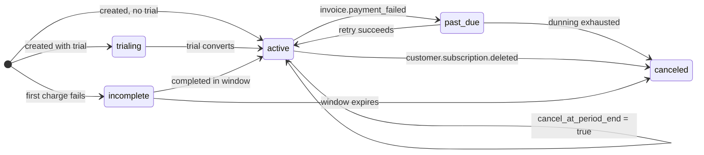

import StateMachineWalker from '../../../components/figures/state-machine-walker/StateMachineWalker.astro';
import Question from '../../../components/figures/state-machine-walker/Question.astro';
import Branch from '../../../components/figures/state-machine-walker/Branch.astro';
import AnnotatedCode from '../../../components/code/annotated-code/AnnotatedCode.astro';
import AnnotatedStep from '../../../components/code/annotated-code/AnnotatedStep.astro';
import Figure from '../../../components/figures/Figure.astro';
import ReactCoding from '../../../components/live-coding/ReactCoding/ReactCoding.astro';
import Buckets from '../../../components/exercises/buckets/Buckets.astro';
import Bucket from '../../../components/exercises/buckets/Bucket.astro';
import Item from '../../../components/exercises/buckets/Item.astro';
import MultipleChoice from '../../../components/exercises/multiple-choice/MultipleChoice.astro';
import McqChoice from '../../../components/exercises/multiple-choice/McqChoice.astro';
import McqWhy from '../../../components/exercises/multiple-choice/McqWhy.astro';
import Sequence from '../../../components/exercises/sequence/Sequence.astro';
import Step from '../../../components/exercises/sequence/Step.astro';
import { Code, CardGrid } from '@astrojs/starlight/components';
import ExternalResource from '../../../components/ui/ExternalResource.astro';
import Term from '../../../components/ui/Term.astro';
import AccessVsTier from '../../../components/lessons/064/5/AccessVsTier.astro';
import StatusBanners from '../../../components/lessons/064/5/StatusBanners.astro';
import CourseProgressBar from '../../../components/ui/CourseProgressBar.astro';

<CourseProgressBar value={frontmatter['course-progress']} />

A customer's renewal card expires overnight. The bank reissued it, and the new number never made it into your billing provider. It's Saturday morning. They open the product they thought they were paying for, and they're locked out. No warning email, no banner, no grace, just a paywall where their dashboard used to be. That is the single worst support ticket your product can generate, and a one-line mistake produces it: somewhere in your code, access is a boolean, and the boolean just flipped to `false`.

The opposite failure has the same root cause. Someone clicks *Upgrade to Pro*, lands on the Stripe Checkout page, and their card is declined. A subscription row gets created anyway, half-built, with the first charge never cleared, and to your boolean it looks active enough. They never paid a cent, and they're using Pro for free. One bug locks out a paying customer; the other gives the product away. Both come from the same place: collapsing a rich billing status into a yes/no.

This lesson fixes that. In the [previous lesson](/064-stripe-billing-and-plan-entitlements/4-plan-entitlements-as-a-derived-view) you stored a `status` column on the `plan_entitlements` row and deliberately left it meaningless: a faithful label you copied from Stripe with no behavior attached to it. Here you give it meaning. By the end you'll have one function, `hasActiveAccess`, that every gate in your app calls to answer "can this org get in at all," and a banner system that warns a lapsing customer *before* it ever revokes anything. One idea carries the whole lesson: a subscription status is a string with semantics, decoded in exactly one place.

## Why a boolean throws away money

It's worth sitting for a moment with the model that doesn't work, because every later decision is a reaction to it. The tempting shape is a single column, `is_paid: boolean`. It reads beautifully at the call site, `if (org.isPaid)`, and it is wrong in a way that costs real revenue. A boolean has two states. The billing relationship has at least five, and the difference between them is money.

Here are three situations a boolean cannot represent, each of which it gets expensively wrong:

- **A card that just failed.** The charge bounced, but Stripe isn't done: it's *retrying* on a schedule, and most failed renewals recover within days. If your boolean flips to `false` the instant the first charge fails, you lock out a customer Stripe is in the middle of recovering for you. You threw away a renewal that was about to succeed.
- **A cancellation that hasn't taken effect yet.** A customer cancels on the 2nd, but they've paid through the 14th. They are owed access until the 14th, because they bought the month. Cut them off on the 2nd and you've taken money for a service you stopped providing. Beyond being unfair, in many places that's a chargeback waiting to happen.
- **A Checkout that never completed.** The subscription row exists, but the first payment never cleared. A row *existing* is not the same as the customer *paying*. Treat "a row is here" as "they're a customer" and you hand out the product for free.

The fix isn't a smarter boolean, because there is no smarter boolean. The fix is to stop throwing the information away. Stripe already tracks which of these situations a subscription is in, as a status string: `trialing`, `active`, `past_due`, `canceled`, `incomplete`. Each one carries a precise meaning and a corresponding app behavior. So you store the string, and you decode it once, in one function, into the only question your features actually care about.

This is also why, back when you designed the entitlements row, you stored the raw status string and refused to add an `is_paid` column beside it. A boolean derived from the status and stored *next to* the status is two sources of truth for one fact. The two will drift apart: a webhook updates `status` but some other code path forgets to recompute `is_paid`, so now your row says `past_due` and `is_paid: true` at the same time, and no human can tell you which one to believe. You keep one stored fact, the status, and you derive the boolean *at read time* so the two can never disagree.

:::caution
Never store an `is_paid` (or `is_active`, `has_access`) boolean alongside the status. It's a second source of truth that drifts from the first. Store the status; compute access from it on read. One stored fact, derived answers.
:::

## The subscription lifecycle, state by state

A subscription isn't a single value, it's a sequence of states it moves through over its lifetime, and the transitions between those states are where the interesting behavior lives. A trial converts to paid. A paid subscription's card fails, so it slides into a retry window and then either recovers or gives up. A customer schedules a cancellation, and the subscription winds down to its paid-through date before it actually ends. That shape, a happy spine with a failure branch that loops while it retries and a graceful wind-down, is a state machine, and the cleanest way to learn it is to walk it one state at a time.

The diagram in the walker below shows the whole topology at once: every state, and every transition Stripe can fire between them, including the Stripe event (like `invoice.payment_failed`) that triggers each move. Those events are the webhook signals you learned to ingest in the [webhook ingestion chapter](/063-webhook-ingestion/1-verify-before-parse). This is the other side of that pipe: the state changes those events represent. Walk the states in the order they're laid out: the happy path first (`trialing` → `active`), then the failure arc, then cancellation, then the Checkout-failure dead end. For each state, read what it *means* and, more importantly, **what your app does** while a subscription sits there.

<StateMachineWalker kind="machine" title="Subscription lifecycle">
  <Figure slot="diagram">

  </Figure>

  <Question id="trialing" prompt="trialing — the trial clock is running"
    description="The trial is active, and it grants full access: the app treats a trial exactly like a paid plan, and surfaces 'X days left' from currentPeriodEnd. Nothing is gated, and nothing is owed yet.">
    <Branch label="Trial converts to paid" to="active" rationale="The trial ends and the first real charge succeeds." />
  </Question>

  <Question id="active" prompt="active — paid and healthy"
    description="Full access. This is also the state a subscription sits in while it winds down after a cancellation: cancelAtPeriodEnd is true, but the paid period hasn't ended yet, so the status is still active.">
    <Branch label="Renewal charge fails" to="past_due" rationale="invoice.payment_failed fires; Stripe starts retrying." />
    <Branch label="Customer cancels in the Portal" to="active" rationale="Status stays active; only cancelAtPeriodEnd flips to true." />
    <Branch label="Paid period ends after a cancel" to="canceled" rationale="customer.subscription.deleted fires; access is now genuinely over." />
  </Question>

  <Question id="past_due" prompt="past_due — an invoice failed, Stripe is retrying"
    description="A charge bounced, but Stripe is mid-dunning, retrying on a schedule. Keep access and show an 'update your card' banner, because most failed renewals recover on their own. Lock out only if dunning gives up.">
    <Branch label="A retry succeeds" to="active" rationale="The bank clears the charge, or the customer fixes the card." />
    <Branch label="Dunning exhausts" to="canceled" rationale="Stripe runs out of retries and gives up on the subscription." />
  </Question>

  <Question id="canceled" prompt="canceled — the relationship has ended"
    description="The paid period elapsed after a cancel, or dunning gave up. No access. The row stays for history. This state is terminal: nothing transitions out of it.">
    <Branch label="Re-subscribe via Checkout" to="active" rationale="A brand-new subscription, not a revival of this one." />
  </Question>

  <Question id="incomplete" prompt="incomplete — a Checkout that never cleared"
    description="A subscription row was created, but the first charge never cleared: it was declined, or 3-D Secure was not completed. Treat it as never subscribed, with no access. The entitlement stays on the free floor.">
    <Branch label="Payment completes in the window" to="active" rationale="The customer finishes paying (Stripe gives roughly 23 hours)." />
    <Branch label="The window expires" to="canceled" rationale="incomplete_expired collapses into the no-access bucket in your store." />
  </Question>
</StateMachineWalker>

A few things in that walk deserve to be pulled out and said plainly.

The state that surprises people is `past_due`. The instinct is "payment failed, cut them off," and that instinct is exactly backwards. When a renewal charge fails, Stripe doesn't give up; it starts a sequence of automatic retries, known as <Term term="A payment provider's automatic retry sequence for a failed recurring charge: repeated attempts over a window of days, plus the dunning emails that nudge the customer to fix their card, before the subscription is finally given up on.">dunning</Term>. The retries run over a window. Stripe's default spreads several attempts across roughly two weeks, though the merchant configures the exact schedule, and a large share of failed renewals recover on their own as the customer's bank clears the charge or they update the card. So the right behavior during `past_due` is to *keep the customer working* and show them a banner asking them to fix their payment method. You lock out only if dunning runs out and the status moves to `canceled`. Locking out at the first failed charge throws away the customers Stripe was about to save for you.

The other subtle one is cancellation, because it isn't an instant flip. When a customer cancels in the Portal, the default is to cancel *at period end*: the subscription's status stays `active`, and a separate flag, `cancelAtPeriodEnd`, becomes `true`. They keep full access through the date they've already paid for. Only when that date arrives does Stripe fire `customer.subscription.deleted` and the status finally become `canceled`. So "they cancelled" and "they lost access" are two different moments, sometimes weeks apart, and during that wind-down the status is still `active`. Hold onto that, because it changes how the access check is written.

:::note
Stripe's wire status enum is a little wider than the five labels your row stores. It also emits `incomplete_expired` (an `incomplete` that ran out its window) and `unpaid` (dunning's terminal cliff). You don't see those in your app, on purpose: the projection function from the [previous lesson](/064-stripe-billing-and-plan-entitlements/4-plan-entitlements-as-a-derived-view) normalizes the wider Stripe set down to your five stored labels at write time. `incomplete_expired` collapses into the same "treat as never subscribed" bucket as `incomplete`, and `unpaid` collapses into the terminal "no access" bucket alongside `canceled`. Five labels in your store summarize a wider set at the source, so the access logic you're about to write only ever has to reason about the five.
:::

## The access decision, encoded once

The walk gave you the journey. Now collapse it into the contract: the flat answer to "for each status, does the customer get in?" Here is that table. There's no logic in it yet; it's just the decision, written down, so you can see the whole rule at a glance before you encode it.

| Status | Access? | Why |
| --- | --- | --- |
| `trialing` | **Grant** | A trial is full access. |
| `active` | **Grant** | Healthy, and also covers the wind-down, which stays `active`. |
| `past_due` | **Grant** | Dunning grace. Warn them; don't lock them out. |
| `canceled` | **Deny** | The relationship has ended. |
| `incomplete` | **Deny** | Never truly subscribed. |

Notice what the table does *not* do: it never special-cases "cancelled but still in the paid period." It doesn't have to. Because Stripe holds the status at `active` (with `cancelAtPeriodEnd: true`) for the entire wind-down and only flips to `canceled` once the paid period is actually over, the "still has access after cancelling" case is already handled by the `active` row. By the time a status reads `canceled`, the paid period is genuinely finished and access is genuinely over. This is the precise version of a rule you'll sometimes hear stated loosely as "`canceled` still grants access while the period is in the future." With this projection it doesn't, and it shouldn't: `canceled` always means *no access*. The grace is carried entirely by `active`.

That table is small enough to hold in your head, which is the point, because it's about to become one function. Drag each status into the bucket the table assigns it, and pay attention to the last chip, which is the wind-down case stated in words.

<Buckets twoCol instructions="Sort each subscription status by what `hasActiveAccess` should return for it. The last chip describes a situation in words — decide which status it really is first, then which bucket.">
  <Bucket name="grant" label="Grant access" description="hasActiveAccess returns true" />
  <Bucket name="deny" label="Deny access" description="hasActiveAccess returns false" />

  <Item bucket="grant">`trialing`</Item>
  <Item bucket="grant">`active`</Item>
  <Item bucket="grant">`past_due`</Item>
  <Item bucket="deny">`canceled`</Item>
  <Item bucket="deny">`incomplete`</Item>
  <Item bucket="grant">Cancelled last week, paid through the end of the month (status is still `active`)</Item>
</Buckets>

### `hasActiveAccess`

Here is the function the whole lesson has been building toward. It is the single place that knows the access decision table: every gate in the app calls it, and nobody anywhere writes `status === 'active' || status === 'trialing'` by hand. The reason for that discipline is concrete. Scatter the check, and someone, somewhere, forgets to include `trialing`, or forgets that `past_due` should still pass, and ships a lockout. One function, one switch, one place to be right.

Walk it step by step.

<AnnotatedCode lang="ts" maxLines={18} code={`
import type { PlanEntitlement } from '@/db/queries/entitlements';

export const hasActiveAccess = (entitlement: PlanEntitlement): boolean => {
  switch (entitlement.status) {
    case 'trialing':
    case 'active':
    case 'past_due':
      return true;
    case 'canceled':
    case 'incomplete':
      return false;
    default: {
      const _exhaustive: never = entitlement.status;
      return _exhaustive;
    }
  }
};
`}>
  <AnnotatedStep meta="{1}" color="blue">
    We reuse `PlanEntitlement` from last lesson's entitlements module, where it's defined as `typeof planEntitlements.$inferSelect`. We never redefine the row type here: the switch has to stay in lockstep with the stored status union, and importing the type is how it stays true.
  </AnnotatedStep>

  <AnnotatedStep meta="{3}" color="blue">
    The signature: a `PlanEntitlement` goes in, a `boolean` comes out. It's an arrow bound to `const`, not a `function` declaration, because it's neither hoisted nor a type guard. The explicit `boolean` return is required for an exported function. The input is the whole entitlement, so call sites read `hasActiveAccess(entitlement)`.
  </AnnotatedStep>

  <AnnotatedStep meta="{5-8}" color="green">
    The three grant cases. `trialing`, `active`, and `past_due` all fall through to one `return true`, the decision table's left column encoded. The `active` case is quietly doing double duty: it also covers the wind-down, which stays `active` until the paid period ends.
  </AnnotatedStep>

  <AnnotatedStep meta="{9-11}" color="red">
    The two deny cases. `canceled` and `incomplete` return `false`, the right column of the table. A relationship that has ended, and a Checkout that never cleared, both mean no access.
  </AnnotatedStep>

  <AnnotatedStep meta="{12-15}" color="violet">
    The payoff. Because the switch covers all five stored labels, `entitlement.status` has narrowed to `never` by the time it reaches `default`, so assigning it to a `never`-typed variable compiles. Add a sixth status to the stored union and this line stops compiling: the build fails *here*, on the one function that must decide what the new status means.
  </AnnotatedStep>
</AnnotatedCode>

That `never` default is worth dwelling on, because it's the difference between a comment and a guarantee. You *could* write a comment saying "remember to update this if you add a status," but comments don't fail builds. The `never` assignment does: it turns "remember to handle the new case" into a compile error that lands on this exact function. Combined with the `noFallthroughCasesInSwitch` rule the project's TypeScript config already enforces, the switch can now only be wrong loudly, at build time, rather than quietly in production.

Try writing it yourself. The exercise below gives you the signature and the import; fill in the switch so each status maps to the right access decision. The tests check all five.

<ReactCoding
  hidePreview
  instructions="Implement hasActiveAccess: return true for the statuses that should keep access (trialing, active, past_due) and false for the rest (canceled, incomplete). It takes a bare Status string here so the sandbox stays self-contained — the canonical version above takes the whole entitlement, but the decision is the same. The App below just renders the result per status so the tests can read it; you only need to complete the function."
  starter={`type Status = 'trialing' | 'active' | 'past_due' | 'canceled' | 'incomplete';

const hasActiveAccess = (status: Status): boolean => {
  // status in, boolean out: return true for trialing, active, past_due;
  // false for canceled, incomplete
  return false;
};

const statuses: Status[] = [
  'trialing',
  'active',
  'past_due',
  'canceled',
  'incomplete',
];

export function App() {
  return (
    <ul>
      {statuses.map((status) => (
        <li key={status} data-status={status}>
          {status}: {String(hasActiveAccess(status))}
        </li>
      ))}
    </ul>
  );
}`}
  tests={`
test('trialing grants access', () => {
  expect(document.querySelector('[data-status="trialing"]')?.textContent).toContain('true');
});
test('active grants access', () => {
  expect(document.querySelector('[data-status="active"]')?.textContent).toContain('true');
});
test('past_due keeps access during dunning', () => {
  expect(document.querySelector('[data-status="past_due"]')?.textContent).toContain('true');
});
test('canceled denies access', () => {
  expect(document.querySelector('[data-status="canceled"]')?.textContent).toContain('false');
});
test('incomplete denies access', () => {
  expect(document.querySelector('[data-status="incomplete"]')?.textContent).toContain('false');
});
`}
/>

### Where it gets called

You don't call `hasActiveAccess` everywhere directly; you call it from the gates that protect access. The simplest gate is a Server Component that reads the org's entitlement and renders a paywall when access is denied:

<Code
  lang="tsx"
  code={`const entitlement = await getEntitlement(orgId);

if (!hasActiveAccess(entitlement)) {
  return <Paywall />;
}`}
/>

That's the shape, but it's not the finished tool. In a real app you don't want every protected page to repeat `getEntitlement`, then `hasActiveAccess`, then a returned paywall by hand. You want one helper, something like `requirePlan('pro')`, that does the read, runs this check, and throws to the framework boundary when access is denied, the same way `requireUser()` already guards authentication. That helper, and the error contract behind it, is the subject of the [next lesson](/064-stripe-billing-and-plan-entitlements/6-the-thin-billing-interface), where `hasActiveAccess` becomes the boolean core that `requirePlan` is built on top of. For now, hold the shape in your head: `hasActiveAccess` answers the question, and the next lesson wires it into the gate.

## Access and tier are different questions

There's a second axis hiding in all of this, and conflating it with the first is a classic mistake. "Can this org get in at all?" and "which tier are they on?" are different questions, answered by different fields. Access is decided by `hasActiveAccess(entitlement)`, which reads `status`. Tier is decided by `entitlement.plan`, one of `'free'`, `'pro'`, or `'team'`. The two are independent: every combination is reachable and meaningful.

The grid below lays out that two-dimensional space. The vertical axis is access (can they get in), and the horizontal axis is tier (what they're paying for). The cell that trips people up is the top-left: a `past_due` Pro org. Their card failed, so they're in the dunning grace window, which means access is still `true`. And they're still on Pro, so their tier is still `pro`. They should keep seeing *Pro features* while Stripe retries their card. The wrong move here is to downgrade them to free because their payment failed, which conflates an *access* signal (`past_due`) with a *tier* change. Tier only changes when the plan itself changes; a failed payment is the access axis talking, not the tier axis.

<AccessVsTier />

So at a call site you read the two axes independently. `hasActiveAccess(entitlement)` is the access gate: it decides whether to show the app or the paywall. `entitlement.plan` (and, next lesson, a `requirePlan('pro')` tier check built on it) is the tier gate: it decides whether to show the Pro analytics panel or the upgrade nudge *to a customer who already has access*. A page might check both: first "are you in?", then "is your tier high enough for this panel?" Two questions, two fields, two helpers, never collapsed into one.

## Surfacing status: the banner above the app

Everything so far has been about the gate, the silent yes/no that decides what renders. But the opening disaster, the Saturday-morning lockout, wasn't really a gate failure. It was a *communication* failure: the customer's card had been failing for days and nobody told them. Status awareness isn't only something the backend checks. It's something the customer has to *see*, while there's still time to act.

So the rule for the UI is the mirror of the rule for the gate. Every authenticated page renders a small status banner above the main content whenever the status is something the customer needs to know about. That's everything *except* the two quiet states, `active` and `trialing`, where there's genuinely nothing to say, plus the one `active` sub-case that does need a banner: a subscription winding down. The banner's copy is keyed by status, and every banner carries a call to action that takes the customer to the exact place they can fix the problem, never a vague "Manage billing" but always the specific destination.

Here's the shape of that mapping: a record from a status condition to the message and the CTA. This is illustrative, not a finished component. It's here so you can see how copy and destination are keyed off the same status the gate reads:

<Code
  lang="ts"
  title="banner copy (illustrative)"
  code={`const bannerCopy = {
  past_due: {
    message: 'Your payment failed — update your card to keep Pro.',
    ctaLabel: 'Update payment method',
    destination: 'portal',
  },
  winding_down: {
    message: 'Your subscription ends on {date} — reactivate to keep your features.',
    ctaLabel: 'Keep my subscription',
    destination: 'portal',
  },
  canceled: {
    message: 'Your subscription was canceled — re-subscribe to restore access.',
    ctaLabel: 'Re-subscribe',
    destination: 'checkout',
  },
};`}
/>

Look at the `destination` field, because it encodes a real asymmetry you met across the last two lessons. Two of these banners send the customer to the **Customer Portal**: `past_due` (to fix the failing card) and the winding-down case (to undo the scheduled cancellation, which flips `cancelAtPeriodEnd` back to `false`). That's because in both cases there's a *live subscription to modify*, and modifying an existing subscription is what the [Portal](/064-stripe-billing-and-plan-entitlements/3-managing-subscriptions-with-the-portal) is for. But the `canceled` banner sends them to **Checkout** instead, because there's no live subscription left to manage. A cancelled customer isn't editing a subscription, they're *starting a new one*, and starting a subscription is [Checkout's](/064-stripe-billing-and-plan-entitlements/2-starting-subscriptions-with-checkout) job. The shorthand: starting bills through Checkout, modifying bills through the Portal. So terminal states route to Checkout, and grace and wind-down states route to the Portal.

The three tabs below show what each banner actually looks like in the product. Click through them and read the copy against the status: the tone escalates from a gentle nudge (`past_due`, where the customer is probably fine) to a clear last call (`canceled`, where they've already lost access).

<StatusBanners />

One accessibility detail is worth naming: these banners are non-urgent status messages, so the banner container is a `role="status"` live region. That tells a screen reader to announce the message politely when it appears, without interrupting whatever the user is doing. That's the right register for "your card needs attention," which is important but not an emergency.

## Two traps experienced engineers still hit

Two failure modes here are subtle enough that they catch people who've shipped billing before. Both are about respecting a boundary: one between your statuses and Stripe's, one between an automatic action and a human decision.

**Don't invent statuses Stripe doesn't ship.** Sooner or later you'll want a state Stripe doesn't have a label for. The classic is "the trial ended." It's tempting to add a synthetic `'trial_ended'` status to your stored set, but resist it. Stripe never emits that, so to know a trial *ended* you'd have to track that it *was* `trialing` and now isn't, which means building a little state machine over event history that someone has to own and that quietly drifts out of sync with Stripe's view of the world. The right pattern is to keep your stored statuses as a faithful mirror of Stripe's, and to compose any *derived* semantic question as a pure predicate over the fields you already have. "Is this subscription winding down?" isn't a new status; it's a question you can answer from two existing fields:

<Code
  lang="ts"
  code={`const isWindingDown = (entitlement: PlanEntitlement): boolean =>
  entitlement.status === 'active' && entitlement.cancelAtPeriodEnd;`}
/>

That's a pure, intent-named helper: `status` and `cancelAtPeriodEnd` go in, a boolean comes out, with no new stored field and nothing to keep in sync. Need "is this org in its dunning grace window"? That's `entitlement.status === 'past_due'`, wrapped in an `isInGracePeriod` predicate for readability. The discipline holds: there is exactly one switch over the raw status (`hasActiveAccess`), and everything else is a thin predicate composed over fields that already exist. Stored statuses come from Stripe; *meanings* are computed in your code.

**Seat overage is a human decision, not an automatic one.** Picture a Team org that bought 10 seats and filled all 10. The owner goes into the Portal and downgrades to 5 seats. Your `seats` column updates to 5 on the next webhook, and now the org has 10 members but only 5 seats. What should the app do? The wrong answer, the one that feels "consistent," is to automatically kick 5 members to get back under the limit. Never do that. Which 5? The app can't know who's expendable, and silently removing people from an organization is exactly the kind of destructive surprise that ends a customer relationship. The right behavior is to *surface the constraint and let the owner resolve it*: show "10 members, 5 seats: remove 5 members or add seats," and **block new invites** until they're back in balance, but leave the existing members in place. The entitlement says how many seats they *bought*. The membership data, the source of truth from the [organizations chapter](/056-organizations-as-the-tenancy-model/1-organizations-and-the-active-org), says how many they *have*. The gate isn't a janitor that quietly deletes the difference; it's the thing that blocks the *next* action that would cross the line. This is a product decision, not a law: some products do auto-deactivate the most recently added members and notify them. The point is that it's a *decision* a human makes deliberately, not a side effect your code does silently.

## Check your understanding

Two quick checks on the load-bearing ideas. The first is the lesson's whole thesis in one scenario; the second makes sure you've internalized that cancellation is a sequence over time, not a single switch.

<MultipleChoice>
  A customer's monthly renewal charge just bounced and their subscription is now `past_due`. Of the four reactions below, which one does your app take right now?

  <McqChoice correct>Let them keep working and raise a banner pointing them at the Customer Portal to fix their card.</McqChoice>
  <McqChoice>Pull access immediately and restore it only once a charge finally clears.</McqChoice>
  <McqChoice>Move them to the free plan so the paid features stop rendering until they pay.</McqChoice>
  <McqChoice>Tear down the subscription row and route them through Checkout to start over.</McqChoice>

  <McqWhy>`past_due` means Stripe is *mid-dunning* — it is still retrying the card on a schedule, and most failed renewals recover on their own. The right answer keeps access and warns. Each of the other three acts on a payment signal as if it were the end of the relationship: locking out, downgrading, or deleting all throw away a customer Stripe was about to recover for you. You only revoke once the status actually moves to `canceled`.</McqWhy>
</MultipleChoice>

The cancellation question is really a question about *order*. A graceful cancellation isn't one event; it's a sequence that plays out over days or weeks, and the status only flips at the very end. Put the steps in the order they happen.

<Sequence instructions="A customer on Pro cancels their subscription. Put the steps of the graceful cancellation in the order they actually happen — remember the status doesn't change until the paid period is over.">
  <Step>Customer clicks Cancel in the Customer Portal</Step>
  <Step>Stripe keeps the subscription `active` and sets `cancelAtPeriodEnd` to true</Step>
  <Step>Your app shows the "ends on `<date>`" banner with a reactivate CTA</Step>
  <Step>The paid period reaches its end date</Step>
  <Step>Stripe fires `customer.subscription.deleted`</Step>
  <Step>The webhook writes `status: 'canceled'` to the entitlement row</Step>
  <Step>`hasActiveAccess` now returns false and access ends</Step>
</Sequence>

## External resources

The canonical Stripe references behind this lesson are worth a read when you wire this up for real: the full lifecycle of statuses, the exact `status` enum your row mirrors, and how the automatic failed-payment retries (dunning) actually behave.

<CardGrid>
  <ExternalResource
    title="How subscriptions work"
    href="https://docs.stripe.com/billing/subscriptions/overview"
    icon="simple-icons:stripe"
    iconColor="#635BFF"
    description="Stripe's authoritative walkthrough of the subscription lifecycle — what each status means and the transitions between them."
  />
  <ExternalResource
    title="The Subscription object"
    href="https://docs.stripe.com/api/subscriptions/object"
    icon="simple-icons:stripe"
    iconColor="#635BFF"
    description="API reference for the status enum your row mirrors, including the wider set (incomplete_expired, unpaid, paused) you normalize away."
  />
  <ExternalResource
    title="Automate payment retries (Smart Retries)"
    href="https://docs.stripe.com/billing/revenue-recovery/smart-retries"
    icon="simple-icons:stripe"
    iconColor="#635BFF"
    description="How the past_due retry window actually behaves — the default 8 attempts over two weeks, and what's configurable."
  />
</CardGrid>
