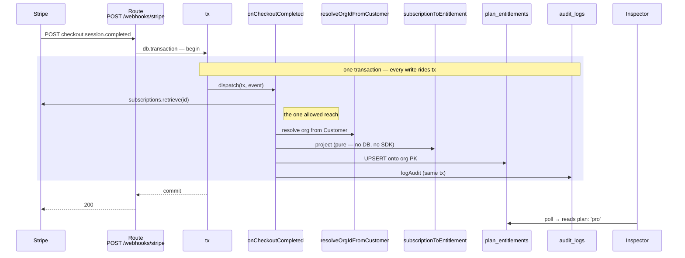

import { CardGrid } from '@astrojs/starlight/components';
import CourseProgressBar from '../../../components/ui/CourseProgressBar.astro';
import Checklist from '../../../components/ui/checklist/Checklist.astro';
import ChecklistItem from '../../../components/ui/checklist/ChecklistItem.astro';
import AnnotatedCode from '../../../components/code/annotated-code/AnnotatedCode.astro';
import AnnotatedStep from '../../../components/code/annotated-code/AnnotatedStep.astro';
import CodeVariants from '../../../components/code/code-variants/CodeVariants.astro';
import CodeVariant from '../../../components/code/code-variants/CodeVariant.astro';
import Figure from '../../../components/figures/Figure.astro';
import ExternalResource from '../../../components/ui/ExternalResource.astro';

<CourseProgressBar value={frontmatter['course-progress']} />

The inspector's entitlement panel comes alive: fire a checkout and it flips to `pro`, fire an update and the status and cancel flag refresh, fire a delete and it reverts to `free` — each move co-writing one audit row, and a replayed older event leaving the row exactly where it was.

The dispatch switch from the last lesson routes correctly, but every handler it reaches still throws `'not implemented'`, so a real `checkout.session.completed` `500`s and the `plan_entitlements` panel never leaves `free`. By the end of this lesson the three handlers have bodies. Firing `stripe trigger checkout.session.completed` walks the panel to `plan: 'pro'` with a populated `subscriptionId`, a `currentPeriodEnd`, and a `lastEventAt` stamped from the event; `customer.subscription.updated` refreshes `status` and the cancel flag on that same row; `customer.subscription.deleted` winds it back to `free`. The Audit tail gains one row on every transition — `billing.subscription.activated`, then `billing.subscription.updated`, then `billing.subscription.canceled` — and the inspector's "Force older event" button proves the ordering guard: an event dated sixty seconds in the past matches nothing and the row does not move. The Checkout button itself still returns `err`, because `upgrade` and `openPortal` are next lesson's work; this lesson you verify the whole projection with `stripe trigger` and the inspector's debug buttons, not by paying with a card.

## Your mission

This is the heart of the project: the **derived view**. The `plan_entitlements` row is not a thing the app decides — it is computed *from* Stripe's events and then read by every request that needs to know what a customer is allowed to do. That one fact decides the whole shape of the lesson. Because the row is derived, the webhook is its only writer, and the piece that turns a `Stripe.Subscription` into the columns of that row is a **pure function**: no database access, no SDK call, just a map from Stripe's shape to the app's. Keeping it pure is not tidiness for its own sake — it is the seam you will unit-test in the testing chapter without booting Postgres or hitting the network, and it is what keeps Stripe's sprawling object graph from leaking into the handlers. The projection reads the first subscription item (`sub.items.data[0]`) and its only path from a Stripe identifier to an app plan slug is the catalog's `planFromLookupKey(item.price.lookup_key)`. A subscription with no item, or a `lookup_key` the catalog has never heard of, is not a case to paper over with a default — it is a Stripe-side seed drift, and the projection **throws** so the handler `500`s and Stripe retries rather than silently provisioning the wrong tier. One detail that bites people: `currentPeriodEnd` is read off the item (`item.current_period_end`), not the subscription root — the root field is gone in recent Stripe API versions and lives on the item now.

The subtle constraint is ordering. Stripe delivers at-least-once and **out of order**, so a stale `subscription.updated` from a minute ago can land after a newer one and try to drag the row backwards. The guard is the `lastEventAt < eventAt` test, and *where* it lives is the entire lesson. It belongs in the UPDATE's `WHERE`, not in a value you read first and compare in TypeScript. A read-then-write reopens the race from [Newer wins, single writer](/063-webhook-ingestion/3-newer-wins-single-writer): two handlers both read the old `lastEventAt`, both decide theirs is newer, and both write. Push the comparison into the `WHERE` and Postgres evaluates it under the row lock — `UPDATE … WHERE subscriptionId = ? AND (lastEventAt IS NULL OR lastEventAt < ?)` — so only one wins and a stale event matches **zero rows**. That zero-row result is not an error to swallow; it is the honest no-op, and you detect it by asking the UPDATE for its `.returning()` rows and finding the array empty.

The three handlers do not have the same shape, and the difference is deliberate. `onCheckoutCompleted` runs the instant an order is paid, and the `plan_entitlements` row for that org might not exist yet — so it **UPSERTs** onto the org's primary key. The other two run against a subscription that already produced a checkout, so the row is guaranteed to exist and they **UPDATE** keyed by `subscriptionId`. The checkout handler is also the one place inside a handler where a single `stripe.subscriptions.retrieve` is allowed: the Checkout event carries only the subscription's id, not the expanded object, so you fetch it once — that is the carve-out from the no-network-in-the-transaction rule, and it is exactly one call. `onSubscriptionUpdated` must **not** re-fetch: its event payload *is* the full Subscription already, and reaching for `subscriptions.retrieve` there is the "I copied the checkout handler" bug — a wasted round-trip holding a database connection open for nothing. Org resolution mirrors the asymmetry: checkout resolves the org from the Customer through `resolveOrgIdFromCustomer`, which is authoritative because the app created that Customer and owns the Customer-to-org mapping; the update and delete handlers resolve the org from the matched row's own `subscriptionId`. And on every transition the audit write rides the **same transaction** as the entitlement write, so a logging failure rolls the change back — the same audit-in-transaction discipline a later security chapter formalizes, restated here, not re-taught.

Out of scope: the metadata cross-check that hardens checkout against a forged tenant is next lesson, so the checkout handler trusts the Customer-resolved org directly here. The `seats` column ships and the projection fills it, but nothing enforces it yet — the seat gate belongs to the membership work you already built around organizations, and the over-seat banner to a later notifications chapter.

<Checklist id="mission">
  <ChecklistItem chip="untested">Running `pnpm db:generate` then `pnpm db:migrate` adds the full `plan_entitlements` shape — the org `text` primary key plus `plan`, `status`, `subscriptionId`, `currentPeriodEnd`, `cancelAtPeriodEnd`, `seats`, `lastEventAt`, `updatedAt` — and the seeded orgs keep their `'free'` row.</ChecklistItem>
  <ChecklistItem chip="tested">A `checkout.session.completed` flips the row to `plan: 'pro'`, populates `subscriptionId` and `currentPeriodEnd`, and stamps `lastEventAt` from the event's `created` as a `Date`.</ChecklistItem>
  <ChecklistItem chip="tested">That same checkout transition writes exactly one `billing.subscription.activated` audit row.</ChecklistItem>
  <ChecklistItem chip="tested">A `customer.subscription.updated` refreshes `status`, `currentPeriodEnd`, and `cancelAtPeriodEnd` on the existing row and writes a `billing.subscription.updated` audit row.</ChecklistItem>
  <ChecklistItem chip="tested">A `customer.subscription.deleted` reverts to `plan: 'free'`, `status: 'canceled'`, and `subscriptionId: null`, and writes a `billing.subscription.canceled` audit row.</ChecklistItem>
  <ChecklistItem chip="tested">An out-of-order event — a `created` earlier than the row's `lastEventAt` — does not regress the row: the newer values stand and no audit row is written.</ChecklistItem>
  <ChecklistItem chip="tested">The projection throws on an unknown `lookup_key` or a subscription with no items, so the handler `500`s and Stripe retries instead of provisioning a wrong tier.</ChecklistItem>
  <ChecklistItem chip="tested">`getEntitlement(orgId)` returns the org's row (deduped per request) and throws when the row is missing; `hasActiveAccess(e)` grants for `trialing`, `active`, and `past_due` and denies the rest.</ChecklistItem>
  <ChecklistItem chip="untested">Firing the real triggers walks the inspector panel through `free → pro → free`, the Audit tail gains a row each step, and "Force older event" leaves the row untouched (logged `stale_ordering`).</ChecklistItem>
</Checklist>

## Coding time

Add the columns to the `plan_entitlements` table and run the migration, then implement `subscriptionToEntitlement`, the three handlers, and the two entitlement read helpers against the brief above and the lesson tests. Then read the walkthrough below.

<details>
<summary>Reference solution and walkthrough</summary>

Four files change, and they layer cleanly: the schema grows its columns, the projection turns a Subscription into those columns, the handlers write them inside the transaction, and the query helpers read them back. Here is the whole loop end to end — the event arrives, gets claimed, and the handler projects, writes, and audits, all inside the one transaction the route opened, before the inspector polls the new row.

<Figure caption="One checkout event, projected into one row and one audit entry, entirely inside the route's transaction.">

</Figure>

### The schema: give the row its columns

In the start codebase `plan_entitlements` is a primary key and nothing else — the seed provisions one free row per org against that key, the inspector reads it, but there are no columns to project into yet. Add them to `src/db/schema.ts`:

```ts
export const planEntitlements = pgTable('plan_entitlements', {
  organizationId: text()
    .primaryKey()
    .references(() => organization.id, { onDelete: 'cascade' }),
  plan: text({ enum: ['free', 'pro', 'team'] })
    .notNull()
    .default('free'),
  status: text({
    enum: ['trialing', 'active', 'past_due', 'canceled', 'incomplete'],
  })
    .notNull()
    .default('active'),
  subscriptionId: text(),
  currentPeriodEnd: timestamp({ withTimezone: true }),
  cancelAtPeriodEnd: boolean().notNull().default(false),
  seats: integer().notNull().default(1),
  lastEventAt: timestamp({ withTimezone: true }),
  updatedAt: timestamp({ withTimezone: true })
    .notNull()
    .defaultNow()
    .$onUpdate(() => new Date()),
});
```

A few of these are load-bearing. The primary key is `text`, not `uuid`, because Better Auth generates `organization.id` as a base62 text id — a `uuid` foreign key pointing at a `text` column emits DDL Postgres rejects. `plan` and `status` are closed enums so an impossible value can never reach the column. The Stripe-derived pointers, `subscriptionId` and `currentPeriodEnd`, are nullable because a free row has no subscription to point at. `lastEventAt` is the ordering high-water mark the predicate compares against, and it is a `timestamptz` — it takes a `Date` built from `event.created * 1000`, never the raw Unix seconds Stripe sends. And `updatedAt` advances itself through `$onUpdate(() => new Date())`, so the inspector's `updatedAt` field moves on every real write and does not move on a deduped replay — which is exactly the signal that proves idempotency held.

Then generate and apply the migration:

```bash
pnpm db:generate --name add_entitlement_columns
pnpm db:migrate
```

That writes `drizzle/0010_add_entitlement_columns.sql` — eight `ALTER TABLE … ADD COLUMN` statements — and applies it. Because every new column either is nullable or carries a default, the migration is safe to run against the rows the seed already inserted: the existing free rows keep their values, the new columns fill from their defaults, and `plan` stays `'free'` on every seeded org.

### The projection: a Subscription becomes columns, purely

`src/lib/billing/projection.ts` is where Stripe's shape stops and the app's begins. It is a pure function — it takes a `Stripe.Subscription` and the catalog, and returns the writable columns. No `tx`, no `stripe`, nothing to mock when you test it.

<AnnotatedCode lang="ts" maxLines={18} code={`
export type EntitlementPatch = Pick<
  PlanEntitlement,
  | 'plan'
  | 'status'
  | 'subscriptionId'
  | 'currentPeriodEnd'
  | 'cancelAtPeriodEnd'
  | 'seats'
>;

export const subscriptionToEntitlement = (
  sub: Stripe.Subscription,
  catalog: Catalog,
): EntitlementPatch => {
  const item = sub.items.data[0];
  if (!item) {
    throw new BillingError(
      'unknown_plan',
      \`subscription \${sub.id} has no items\`,
    );
  }
  const plan = catalog.planFromLookupKey(item.price.lookup_key);
  if (plan === null) {
    throw new BillingError('unknown_plan', item.price.lookup_key ?? 'null');
  }

  return {
    plan,
    status: toEntitlementStatus(sub.status),
    subscriptionId: sub.id,
    currentPeriodEnd: new Date(item.current_period_end * 1000),
    cancelAtPeriodEnd: sub.cancel_at_period_end,
    seats: item.quantity ?? 1,
  };
};
`}>
  <AnnotatedStep meta="{1-9}" color="violet">
    `EntitlementPatch` is `Pick`ed straight off the schema's `PlanEntitlement` type, so the patch is exactly the columns a projected subscription owns — and it tracks the schema automatically. `organizationId`, `lastEventAt`, and `updatedAt` are deliberately absent: the handler owns those (the org is resolved separately, the high-water mark comes from `event.created`, `updatedAt` from the column default), not the projection.
  </AnnotatedStep>

  <AnnotatedStep meta="{16-21}" color="blue">
    The guard that makes a Stripe-side seed drift loud. A subscription with no item has no plan to project, so it throws rather than reading `item.price` off `undefined` and crashing unhelpfully three lines later.
  </AnnotatedStep>

  <AnnotatedStep meta="{22-25}" color="green">
    The only path from a Stripe identifier to an app plan slug. An unrecognized `lookup_key` returns `null` from the catalog, and a `null` plan is a hard failure — `BillingError('unknown_plan')` so the handler `500`s and Stripe retries, never a silent fallback to a default tier.
  </AnnotatedStep>

  <AnnotatedStep meta="{31}" color="orange">
    `currentPeriodEnd` is read from the **item**, not the subscription root, and multiplied by 1000 because Stripe sends Unix **seconds** and the column takes a `Date` in milliseconds. The root `current_period_end` field was removed in recent Stripe API versions; it lives on the item now.
  </AnnotatedStep>
</AnnotatedCode>

One helper sits above it, folding Stripe's wider status set onto the column's closed one — the statuses the column does not model collapse to the nearest denying state, because the real access decision lives in `hasActiveAccess`, not here:

```ts
const toEntitlementStatus = (
  status: Stripe.Subscription.Status,
): EntitlementPatch['status'] => {
  switch (status) {
    case 'trialing':
      return 'trialing';
    case 'active':
      return 'active';
    case 'past_due':
      return 'past_due';
    case 'canceled':
    case 'unpaid':
      return 'canceled';
    case 'incomplete':
    case 'incomplete_expired':
    case 'paused':
      return 'incomplete';
  }
};
```

### The handlers: project, write, audit — all on `tx`

`src/lib/webhooks/stripe.ts` is where the projection meets the database. Before the handlers there are two small pieces. `resolveOrgIdFromCustomer` is the reverse lookup — given a Stripe Customer, which org owns it — and it is **authoritative** precisely because the app created that Customer and stored the mapping, so it cannot be forged through an event payload. An event for a Customer the app never created resolves to no org and throws, rolling the transaction back so the route `500`s rather than silently writing to nowhere. The tiny `asId` helper normalizes Stripe's "this field is either an id string or the expanded object" union down to a plain id.

```ts
export const resolveOrgIdFromCustomer = async (
  tx: Transaction,
  stripeCustomerId: string,
): Promise<string> => {
  const org = await tx.query.organization.findFirst({
    where: eq(organization.stripeCustomerId, stripeCustomerId),
  });
  if (!org) {
    throw new BillingError(
      'unknown_customer',
      `no org owns Stripe customer ${stripeCustomerId}`,
    );
  }
  return org.id;
};

const asId = (value: string | { id: string } | null): string | null => {
  if (value === null) {
    return null;
  }
  return typeof value === 'string' ? value : value.id;
};
```

The three handlers share a spine — project, write, audit — but the writes differ in a way worth comparing side by side. Read them as a set.

<CodeVariants maxLines={18}>
  <CodeVariant label="onCheckoutCompleted — UPSERT">
    ```ts
    export const onCheckoutCompleted = async (
      tx: Transaction,
      event: Stripe.Event,
    ): Promise<void> => {
      const session = event.data.object as Stripe.Checkout.Session;
      const customerId = asId(session.customer);
      const subscriptionId = asId(session.subscription);
      if (!customerId || !subscriptionId) {
        log.warn({ eventId: event.id }, 'checkout_missing_ids');
        return;
      }

      // The one allowed reach: retrieve the Subscription the Session points at.
      const sub = await stripe.subscriptions.retrieve(subscriptionId);

      // The Customer-owned org is authoritative: the app created the Customer and
      // stored the mapping, so this cannot be forged through the event payload.
      const orgId = await resolveOrgIdFromCustomer(tx, customerId);

      const patch = subscriptionToEntitlement(sub, loadCatalog());
      const eventAt = new Date(event.created * 1000);

      await tx
        .insert(planEntitlements)
        .values({ organizationId: orgId, ...patch, lastEventAt: eventAt })
        .onConflictDoUpdate({
          target: planEntitlements.organizationId,
          set: { ...patch, lastEventAt: eventAt },
        });

      await logAudit(tx, {
        organizationId: orgId,
        actorUserId: null,
        action: 'billing.subscription.activated',
        subjectType: 'subscription',
        subjectId: sub.id,
        payload: { plan: patch.plan },
      });
      log.info(
        { eventId: event.id, orgId, plan: patch.plan },
        'checkout_completed',
      );
    };
    ```
    **The order was just paid, and the row may not exist yet — so UPSERT onto the org PK.** The Checkout Session carries only ids, so the Subscription is fetched once (the single allowed `stripe.*` reach in a handler), the org is resolved from the Customer, and `onConflictDoUpdate` inserts the projected row or updates it if a free row was already there. The audit write rides the same `tx`.
  </CodeVariant>

  <CodeVariant label="onSubscriptionUpdated — UPDATE">
    ```ts
    export const onSubscriptionUpdated = async (
      tx: Transaction,
      event: Stripe.Event,
    ): Promise<void> => {
      const sub = event.data.object as Stripe.Subscription;
      const patch = subscriptionToEntitlement(sub, loadCatalog());
      const eventAt = new Date(event.created * 1000);

      const updated = await tx
        .update(planEntitlements)
        .set({ ...patch, lastEventAt: eventAt })
        .where(
          and(
            eq(planEntitlements.subscriptionId, sub.id),
            or(
              isNull(planEntitlements.lastEventAt),
              lt(planEntitlements.lastEventAt, eventAt),
            ),
          ),
        )
        .returning({ organizationId: planEntitlements.organizationId });

      const row = updated[0];
      if (!row) {
        log.info({ eventId: event.id, subscriptionId: sub.id }, 'stale_ordering');
        return;
      }

      await logAudit(tx, {
        organizationId: row.organizationId,
        actorUserId: null,
        action: 'billing.subscription.updated',
        subjectType: 'subscription',
        subjectId: sub.id,
        payload: { plan: patch.plan, status: patch.status },
      });
      log.info(
        { eventId: event.id, orgId: row.organizationId, plan: patch.plan },
        'subscription_updated',
      );
    };
    ```
    **The payload is already the full Subscription — no re-fetch.** The row exists by now, so this UPDATEs keyed by `subscriptionId`, carrying the ordering predicate in the `WHERE`. `.returning()` hands back the matched rows: a row means a live transition (audit it), an empty array means the predicate rejected a stale event (log `stale_ordering`, write nothing).
  </CodeVariant>

  <CodeVariant label="onSubscriptionDeleted — UPDATE to free">
    ```ts
    export const onSubscriptionDeleted = async (
      tx: Transaction,
      event: Stripe.Event,
    ): Promise<void> => {
      const sub = event.data.object as Stripe.Subscription;
      const eventAt = new Date(event.created * 1000);

      const updated = await tx
        .update(planEntitlements)
        .set({
          plan: 'free',
          status: 'canceled',
          subscriptionId: null,
          lastEventAt: eventAt,
        })
        .where(
          and(
            eq(planEntitlements.subscriptionId, sub.id),
            or(
              isNull(planEntitlements.lastEventAt),
              lt(planEntitlements.lastEventAt, eventAt),
            ),
          ),
        )
        .returning({ organizationId: planEntitlements.organizationId });

      const row = updated[0];
      if (!row) {
        log.info({ eventId: event.id, subscriptionId: sub.id }, 'stale_ordering');
        return;
      }

      await logAudit(tx, {
        organizationId: row.organizationId,
        actorUserId: null,
        action: 'billing.subscription.canceled',
        subjectType: 'subscription',
        subjectId: sub.id,
        payload: { plan: 'free' },
      });
      log.info(
        { eventId: event.id, orgId: row.organizationId },
        'subscription_deleted',
      );
    };
    ```
    **The subscription ended — wind the row back and null the pointer.** It does not project the (canceled) payload; it sets fixed terminal values: `plan: 'free'`, `status: 'canceled'`, `subscriptionId: null`. Same ordering predicate, same empty-`.returning()` no-op detection — a stale delete must not regress a row a newer event already advanced.
  </CodeVariant>
</CodeVariants>

### The reads: one row, one decision

`src/db/queries/entitlements.ts` is the other side of the seam — the path every request takes to read what the webhook wrote. There are two functions, and a deliberate placement decision behind them: they live in `db/queries/`, **not** `lib/billing/`, because the billing seam is the set of Stripe calls and the gate, while reading an entitlement row is a plain data-layer read.

```ts
export type EntitlementRow = PlanEntitlement;

export const getEntitlement = cache(
  async (orgId: string): Promise<PlanEntitlement> => {
    const row = await db.query.planEntitlements.findFirst({
      where: eq(planEntitlements.organizationId, orgId),
    });
    if (!row) {
      throw new Error(`plan_entitlements row missing for org: ${orgId}`);
    }
    return row;
  },
);

export const hasActiveAccess = (e: PlanEntitlement): boolean => {
  switch (e.status) {
    case 'trialing':
    case 'active':
    case 'past_due':
      return true;
    case 'canceled':
    case 'incomplete':
      return false;
    default: {
      const _exhaustive: never = e.status;
      return _exhaustive;
    }
  }
};
```

`getEntitlement` is wrapped in `React.cache` so the inspector's four Suspense-wrapped panels, each calling it in the same request, hit the database once. It reads through the global `db` keyed by the org primary key — not `tenantDb` — because the webhook that fills the row runs as the `BYPASSRLS` superuser, and the gate reads by primary key, so a direct query is the correct scoped read here. A missing row is the provisioning invariant violated: every org gets a free row at creation, so an absent one is a bug, and it **throws** rather than returning a `null` that a gate would silently misread as "no access."

`hasActiveAccess` encodes the decision table from [the subscription-status lesson](/064-stripe-billing-and-plan-entitlements/5-subscription-status-as-first-class-state): `trialing`, `active`, and `past_due` grant access; `canceled` and `incomplete` deny. The switch is exhaustive over the status enum, and the `never` default is the point — add a sixth status to the column and this stops compiling until you decide which side it falls on, instead of silently defaulting to deny. One subtlety worth holding: `canceled` **always** denies. The grace window after a user cancels but before their paid period ends is carried by `status: 'active'` plus `cancelAtPeriodEnd: true`, never by a `canceled` row — a canceled row means access is over.

### A few decisions worth making explicit

**The one `subscriptions.retrieve`, and why not wait.** The Checkout event hands you the subscription's id, not the object, so `onCheckoutCompleted` fetches it. The tempting alternative is to do nothing on checkout and wait for the `customer.subscription.created` event, which arrives carrying the full object — but that trades one synchronous fetch for a second event you must now also handle, order against the checkout, and reconcile. One retrieve inside the handler is the simpler, cheaper boundary.

**Why `onSubscriptionUpdated` does not re-fetch.** Its `event.data.object` *is* the full Subscription — Stripe already sent it. Calling `subscriptions.retrieve` there would burn a network round-trip, hold the database connection open across it, and return the same data you were handed. The asymmetry is intentional: checkout fetches because the Session is thin, update does not because the payload is already complete.

**Why the predicate lives in the `WHERE`.** Reading `lastEventAt`, comparing it in TypeScript, and then writing reopens the exact race [Newer wins, single writer](/063-webhook-ingestion/3-newer-wins-single-writer) closed — two concurrent handlers both read the old value, both decide they win, both write. Putting `lastEventAt < eventAt` in the `WHERE` lets Postgres evaluate it under the row lock, so the database arbitrates and a stale event matches zero rows. The empty `.returning()` array is how the handler learns it lost, and it answers by writing no audit row.

**UPSERT versus UPDATE.** Checkout might be the first time this org's row gets real values, so it UPSERTs onto the org primary key — insert-or-update in one atomic statement. Update and delete only ever run after a checkout already created the row, so they UPDATE keyed by `subscriptionId` and trust the row is there. Matching the write to the guarantee keeps each handler honest about what it knows.

**Audit in the same transaction.** `logAudit(tx, …)` takes the transaction handle, not the global `db`, so the audit row commits or rolls back with the entitlement change. If the audit write fails, the entitlement write unwinds with it — you never end up with a plan change nobody can see in the log. This is the same audit-in-transaction discipline a later security chapter formalizes, applied here.

</details>

<CardGrid>
  <ExternalResource
    title="Using webhooks with subscriptions"
    href="https://docs.stripe.com/billing/subscriptions/webhooks"
    icon="simple-icons:stripe"
    iconColor="#635BFF"
    description="Stripe's reference for the exact lifecycle events these three handlers react to."
  />
  <ExternalResource
    title="Item-level billing periods"
    href="https://docs.stripe.com/changelog/basil/2025-03-31/deprecate-subscription-current-period-start-and-end"
    icon="simple-icons:stripe"
    iconColor="#635BFF"
    description="The API change that moved currentPeriodEnd off the subscription root onto the item."
  />
  <ExternalResource
    title="The Subscription object"
    href="https://docs.stripe.com/api/subscriptions/object"
    icon="simple-icons:stripe"
    iconColor="#635BFF"
    description="Field reference for items.data[0] and price.lookup_key, the shape the projection reads."
  />
  <ExternalResource
    title="Drizzle ORM — Upsert"
    href="https://orm.drizzle.team/docs/guides/upsert"
    icon="simple-icons:drizzle"
    iconColor="#C5F74F"
    description="The onConflictDoUpdate pattern the checkout handler upserts onto the org primary key with."
  />
</CardGrid>

## Moment of truth

Run the lesson's test suite:

```bash
pnpm test:lesson 4
```

The suite calls the real handlers and the real pure functions and watches the side effects they leave on a recording transaction — the row values written, the audit `action` — plus what the pure functions return and throw. It stands in inert doubles for the Stripe SDK retrieve, the catalog, the org lookup, and the audit writer, so it needs no live Postgres and no network; the gate is the observable row and audit state after dispatch, never a call count. It checks that checkout UPSERTs `plan: 'pro'` with the subscription id, period, and a `Date`-typed `lastEventAt` and co-writes one activation audit row; that update refreshes status and the cancel flag and audits; that delete winds back to free and nulls the pointer and audits; that a zero-row match writes no audit row on both update and delete; that the projection throws on an unknown plan or an empty subscription; and that the two read helpers return, throw, and decide as the table says. You should see every check green.

The tests cover the projection, the handlers, and the read helpers, but not the migration or the live Stripe loop. With `pnpm stripe:listen` forwarding and `pnpm dev` running, confirm the rest by hand:

<Checklist id="verify">
  <ChecklistItem chip="untested">`pnpm db:generate` then `pnpm db:migrate` runs clean, `drizzle/0010_add_entitlement_columns.sql` exists, and the inspector still shows the seeded `free` row.</ChecklistItem>
  <ChecklistItem chip="untested">`stripe trigger checkout.session.completed` flips the panel to `pro`, populates `subscriptionId`, `currentPeriodEnd`, and `lastEventAt`, and the Audit tail gains a `billing.subscription.activated` row.</ChecklistItem>
  <ChecklistItem chip="untested">`stripe trigger customer.subscription.updated` refreshes `status`, the period, and the cancel flag, and the Audit tail gains a `billing.subscription.updated` row.</ChecklistItem>
  <ChecklistItem chip="untested">`stripe trigger customer.subscription.deleted` reverts the panel to `free` / `canceled` / null subscription, and the Audit tail gains a `billing.subscription.canceled` row.</ChecklistItem>
  <ChecklistItem chip="untested">The inspector's "Force older event" leaves the row unchanged and the log shows `stale_ordering`.</ChecklistItem>
</Checklist>

The panel now moves with every event and replays leave it alone — the derived view holds. What it cannot do yet is be reached from a button: clicking "Upgrade to Pro" still returns `err`, because the three-method billing interface that opens Stripe Checkout and the Portal is the next lesson's work. That is what closes the loop the user actually touches.
