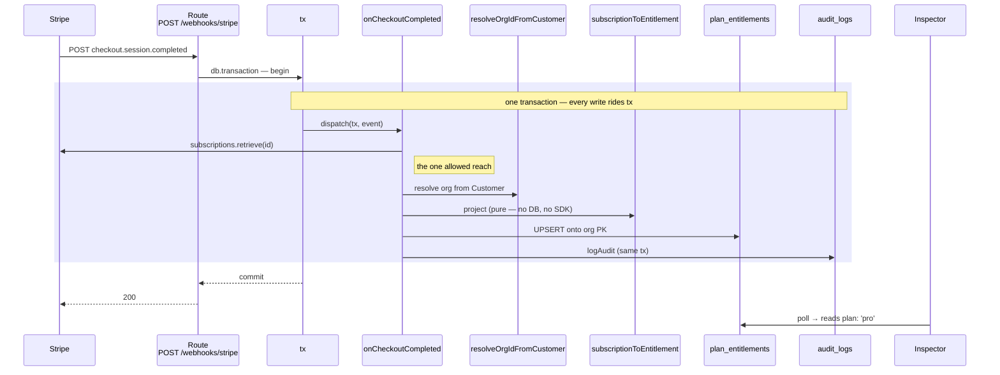

import { CardGrid } from '@astrojs/starlight/components';
import CourseProgressBar from '../../../components/ui/CourseProgressBar.astro';
import Checklist from '../../../components/ui/checklist/Checklist.astro';
import ChecklistItem from '../../../components/ui/checklist/ChecklistItem.astro';
import AnnotatedCode from '../../../components/code/annotated-code/AnnotatedCode.astro';
import AnnotatedStep from '../../../components/code/annotated-code/AnnotatedStep.astro';
import CodeVariants from '../../../components/code/code-variants/CodeVariants.astro';
import CodeVariant from '../../../components/code/code-variants/CodeVariant.astro';
import Figure from '../../../components/figures/Figure.astro';
import ExternalResource from '../../../components/ui/ExternalResource.astro';

<CourseProgressBar value={frontmatter['course-progress']} />

The dispatch switch from the last lesson routes events correctly, but every handler still throws `'not implemented'`, so a real `checkout.session.completed` returns a `500` and the `plan_entitlements` panel never leaves `free`.

This lesson gives the three handlers bodies.
Each projects its event into a single derived entitlement row and appends one audit row: `checkout.session.completed` flips the plan to `pro`, `customer.subscription.updated` refreshes the status and cancel flag on that same row, and `customer.subscription.deleted` winds it back to `free`.
You verify the projection with `stripe trigger` and the inspector's debug buttons, since the Checkout button stays wired to next lesson's work.

## Your mission

The `plan_entitlements` row is a **derived view**: the app never decides it, it is computed *from* Stripe's events and then read by every request that needs to know what a customer may do.
So the webhook is its only writer, and the piece that turns a `Stripe.Subscription` into the row's columns is a **pure function**: no database, no SDK, just a map from Stripe's shape to the app's, which the testing chapter can unit-test without Postgres or a network.
The projection reads the first subscription item (`sub.items.data[0]`), and its only path from a Stripe identifier to an app plan slug is the catalog's `planFromLookupKey(item.price.lookup_key)`.
A subscription with no item, or a `lookup_key` the catalog has never seen, is Stripe-side seed drift, not a case to default away: the projection **throws** so the handler `500`s and Stripe retries instead of provisioning the wrong tier.
One detail: `currentPeriodEnd` reads off the item (`item.current_period_end`), which recent Stripe API versions moved there from the subscription root.

Stripe delivers at-least-once and **out of order**, so a stale `subscription.updated` can land after a newer one and drag the row backwards.
The guard is the `lastEventAt < eventAt` test, and it must live in the UPDATE's `WHERE`, not in a value you read first and compare in TypeScript.
A read-then-write reopens the race from [Newer wins, single writer](/063-webhook-ingestion/3-newer-wins-single-writer): two handlers both read the old `lastEventAt`, both decide theirs is newer, both write.
Push the comparison into the `WHERE` and Postgres evaluates it under the row lock — `UPDATE … WHERE subscriptionId = ? AND (lastEventAt IS NULL OR lastEventAt < ?)` — so only one wins and a stale event matches **zero rows**.
That zero-row result is the honest no-op, not an error: detect it by reading the UPDATE's `.returning()` rows and finding the array empty.

The three handlers differ deliberately.
`onCheckoutCompleted` runs the instant an order is paid, when the org's `plan_entitlements` row may not exist yet, so it **UPSERTs** onto the org's primary key; the other two run after checkout created the row, so they **UPDATE** keyed by `subscriptionId`.
Checkout is also the one place a single `stripe.subscriptions.retrieve` is allowed: its event carries only the subscription's id, so you fetch the object once, the lone carve-out from the no-network-in-the-transaction rule.
`onSubscriptionUpdated` must **not** re-fetch, since its payload *is* the full Subscription already; calling `subscriptions.retrieve` there wastes a round-trip while holding a database connection open.
Org resolution mirrors the split: checkout resolves the org from the Customer through `resolveOrgIdFromCustomer`, authoritative because the app created that Customer and owns the mapping, while update and delete resolve from the matched row's own `subscriptionId`.
On every transition the audit write rides the **same transaction** as the entitlement write, so a logging failure rolls the change back.

Two things stay out of scope.
The metadata cross-check that hardens checkout against a forged tenant is next lesson, so checkout trusts the Customer-resolved org directly for now.
The `seats` column ships and the projection fills it, but nothing enforces it yet.

<Checklist id="mission">
  <ChecklistItem chip="untested">Running `pnpm db:generate` then `pnpm db:migrate` adds the full `plan_entitlements` shape — the org `text` primary key plus `plan`, `status`, `subscriptionId`, `currentPeriodEnd`, `cancelAtPeriodEnd`, `seats`, `lastEventAt`, `updatedAt` — and the seeded orgs keep their `'free'` row.</ChecklistItem>
  <ChecklistItem chip="tested">A `checkout.session.completed` flips the row to `plan: 'pro'`, populates `subscriptionId` and `currentPeriodEnd`, and stamps `lastEventAt` from the event's `created` as a `Date`.</ChecklistItem>
  <ChecklistItem chip="tested">That same checkout transition writes exactly one `billing.subscription.activated` audit row.</ChecklistItem>
  <ChecklistItem chip="tested">A `customer.subscription.updated` refreshes `status`, `currentPeriodEnd`, and `cancelAtPeriodEnd` on the existing row and writes a `billing.subscription.updated` audit row.</ChecklistItem>
  <ChecklistItem chip="tested">A `customer.subscription.deleted` reverts to `plan: 'free'`, `status: 'canceled'`, and `subscriptionId: null`, and writes a `billing.subscription.canceled` audit row.</ChecklistItem>
  <ChecklistItem chip="tested">An out-of-order event — a `created` earlier than the row's `lastEventAt` — does not regress the row: the newer values stand and no audit row is written.</ChecklistItem>
  <ChecklistItem chip="tested">The projection throws on an unknown `lookup_key` or a subscription with no items, so the handler `500`s and Stripe retries instead of provisioning a wrong tier.</ChecklistItem>
  <ChecklistItem chip="tested">`getEntitlement(orgId)` returns the org's row (deduped per request) and throws when the row is missing; `hasActiveAccess(e)` grants for `trialing`, `active`, and `past_due` and denies the rest.</ChecklistItem>
  <ChecklistItem chip="untested">Firing the real triggers walks the inspector panel through `free → pro → free`, the Audit tail gains a row each step, and "Force older event" leaves the row untouched (logged `stale_ordering`).</ChecklistItem>
</Checklist>

## Coding time

Add the columns to the `plan_entitlements` table, run the migration, then implement `subscriptionToEntitlement`, the three handlers, and the two read helpers against the brief above and the lesson tests.

<details>
<summary>Reference solution and walkthrough</summary>

Four files layer cleanly: the schema grows columns, the projection turns a Subscription into those columns, the handlers write them inside the transaction, and the query helpers read them back.

<Figure caption="One checkout event projected into one row and one audit entry, all inside the route's transaction.">

</Figure>

### The schema: add the entitlement columns

In the start codebase `plan_entitlements` is a primary key and nothing else: the seed provisions one free row per org and the inspector reads it, but there are no columns to project into yet.
Add them to `src/db/schema.ts`:

```ts
export const planEntitlements = pgTable('plan_entitlements', {
  organizationId: text()
    .primaryKey()
    .references(() => organization.id, { onDelete: 'cascade' }),
  plan: text({ enum: ['free', 'pro', 'team'] })
    .notNull()
    .default('free'),
  status: text({
    enum: ['trialing', 'active', 'past_due', 'canceled', 'incomplete'],
  })
    .notNull()
    .default('active'),
  subscriptionId: text(),
  currentPeriodEnd: timestamp({ withTimezone: true }),
  cancelAtPeriodEnd: boolean().notNull().default(false),
  seats: integer().notNull().default(1),
  lastEventAt: timestamp({ withTimezone: true }),
  updatedAt: timestamp({ withTimezone: true })
    .notNull()
    .defaultNow()
    .$onUpdate(() => new Date()),
});
```

The primary key is `text`, not `uuid`, because Better Auth generates `organization.id` as a base62 text id, and a `uuid` foreign key against a `text` column emits DDL Postgres rejects.
`plan` and `status` are closed enums, so an impossible value can never reach the column.
`subscriptionId` and `currentPeriodEnd` are nullable because a free row has no subscription.
`lastEventAt` is the ordering high-water mark the predicate compares against, a `timestamptz` holding a `Date` built from `event.created * 1000`, never the raw Unix seconds Stripe sends.
`updatedAt` advances itself through `$onUpdate(() => new Date())`, so it moves on every real write but not on a deduped replay, the signal that proves idempotency held.

Then generate and apply the migration:

```bash
pnpm db:generate --name add_entitlement_columns
pnpm db:migrate
```

That writes `drizzle/0010_add_entitlement_columns.sql`, eight `ALTER TABLE … ADD COLUMN` statements, and applies it.
Every new column is nullable or carries a default, so the migration is safe against rows the seed already inserted: existing free rows fill the new columns from defaults and keep `plan` at `'free'`.

### The projection: map a Subscription onto entitlement columns

`src/lib/billing/projection.ts` is where Stripe's shape ends and the app's begins.
`subscriptionToEntitlement` is pure: give it a `Stripe.Subscription` and the catalog, and it returns the writable columns, with no `tx` or `stripe` to mock when you test it.

<AnnotatedCode lang="ts" maxLines={18} code={`
export type EntitlementPatch = Pick<
  PlanEntitlement,
  | 'plan'
  | 'status'
  | 'subscriptionId'
  | 'currentPeriodEnd'
  | 'cancelAtPeriodEnd'
  | 'seats'
>;

export const subscriptionToEntitlement = (
  sub: Stripe.Subscription,
  catalog: Catalog,
): EntitlementPatch => {
  const item = sub.items.data[0];
  if (!item) {
    throw new BillingError(
      'unknown_plan',
      \`subscription \${sub.id} has no items\`,
    );
  }
  const plan = catalog.planFromLookupKey(item.price.lookup_key);
  if (plan === null) {
    throw new BillingError('unknown_plan', item.price.lookup_key ?? 'null');
  }

  return {
    plan,
    status: toEntitlementStatus(sub.status),
    subscriptionId: sub.id,
    currentPeriodEnd: new Date(item.current_period_end * 1000),
    cancelAtPeriodEnd: sub.cancel_at_period_end,
    seats: item.quantity ?? 1,
  };
};
`}>
  <AnnotatedStep meta="{1-9}" color="violet">
    `EntitlementPatch` is `Pick`ed off the schema's `PlanEntitlement` type, so it is exactly the columns a projection owns and tracks the schema automatically. `organizationId`, `lastEventAt`, and `updatedAt` are absent on purpose: the handler owns them, resolving the org separately, taking the high-water mark from `event.created`, and leaving `updatedAt` to its column default.
  </AnnotatedStep>

  <AnnotatedStep meta="{16-21}" color="blue">
    A subscription with no item has no plan to project, so this throws rather than reading `item.price` off `undefined` and crashing unhelpfully later.
  </AnnotatedStep>

  <AnnotatedStep meta="{22-25}" color="green">
    The only path from a Stripe identifier to an app plan slug. An unknown `lookup_key` returns `null`, a hard failure: `BillingError('unknown_plan')` makes the handler `500` so Stripe retries, rather than silently defaulting to a tier.
  </AnnotatedStep>

  <AnnotatedStep meta="{31}" color="orange">
    `currentPeriodEnd` comes from the **item**, not the subscription root, multiplied by 1000 because Stripe sends Unix **seconds** and the column takes a millisecond `Date`.
  </AnnotatedStep>
</AnnotatedCode>

One helper folds Stripe's wider status set onto the column's closed one; statuses the column does not model collapse to the nearest denying state, since the real access decision lives in `hasActiveAccess`:

```ts
const toEntitlementStatus = (
  status: Stripe.Subscription.Status,
): EntitlementPatch['status'] => {
  switch (status) {
    case 'trialing':
      return 'trialing';
    case 'active':
      return 'active';
    case 'past_due':
      return 'past_due';
    case 'canceled':
    case 'unpaid':
      return 'canceled';
    case 'incomplete':
    case 'incomplete_expired':
    case 'paused':
      return 'incomplete';
  }
};
```

### The handlers: project, write, audit — all on `tx`

`src/lib/webhooks/stripe.ts` is where the projection meets the database.
Two helpers come first.
`resolveOrgIdFromCustomer` looks up the org that owns a Stripe Customer; it is **authoritative** because the app created that Customer and stored the mapping, so an event payload cannot forge it.
A Customer the app never created resolves to no org and throws, rolling back the transaction so the route `500`s instead of writing to a nonexistent org.
`asId` normalizes Stripe's "id string or expanded object" union to a plain id.

```ts
export const resolveOrgIdFromCustomer = async (
  tx: Transaction,
  stripeCustomerId: string,
): Promise<string> => {
  const org = await tx.query.organization.findFirst({
    where: eq(organization.stripeCustomerId, stripeCustomerId),
  });
  if (!org) {
    throw new BillingError(
      'unknown_customer',
      `no org owns Stripe customer ${stripeCustomerId}`,
    );
  }
  return org.id;
};

const asId = (value: string | { id: string } | null): string | null => {
  if (value === null) {
    return null;
  }
  return typeof value === 'string' ? value : value.id;
};
```

The three handlers share a spine but their writes differ, so compare them side by side.

<CodeVariants maxLines={18}>
  <CodeVariant label="onCheckoutCompleted — UPSERT">
    ```ts
    export const onCheckoutCompleted = async (
      tx: Transaction,
      event: Stripe.Event,
    ): Promise<void> => {
      const session = event.data.object as Stripe.Checkout.Session;
      const customerId = asId(session.customer);
      const subscriptionId = asId(session.subscription);
      if (!customerId || !subscriptionId) {
        log.warn({ eventId: event.id }, 'checkout_missing_ids');
        return;
      }

      // The one allowed reach: retrieve the Subscription the Session points at.
      const sub = await stripe.subscriptions.retrieve(subscriptionId);

      // The Customer-owned org is authoritative: the app created the Customer and
      // stored the mapping, so this cannot be forged through the event payload.
      const orgId = await resolveOrgIdFromCustomer(tx, customerId);

      const patch = subscriptionToEntitlement(sub, loadCatalog());
      const eventAt = new Date(event.created * 1000);

      await tx
        .insert(planEntitlements)
        .values({ organizationId: orgId, ...patch, lastEventAt: eventAt })
        .onConflictDoUpdate({
          target: planEntitlements.organizationId,
          set: { ...patch, lastEventAt: eventAt },
        });

      await logAudit(tx, {
        organizationId: orgId,
        actorUserId: null,
        action: 'billing.subscription.activated',
        subjectType: 'subscription',
        subjectId: sub.id,
        payload: { plan: patch.plan },
      });
      log.info(
        { eventId: event.id, orgId, plan: patch.plan },
        'checkout_completed',
      );
    };
    ```
    **The row may not exist yet, so UPSERT onto the org PK.** The Session carries only ids, so the handler fetches the Subscription once (the single allowed `stripe.*` reach), resolves the org from the Customer, and `onConflictDoUpdate` inserts the projected row or updates an existing free one. The audit write rides the same `tx`.
  </CodeVariant>

  <CodeVariant label="onSubscriptionUpdated — UPDATE">
    ```ts
    export const onSubscriptionUpdated = async (
      tx: Transaction,
      event: Stripe.Event,
    ): Promise<void> => {
      const sub = event.data.object as Stripe.Subscription;
      const patch = subscriptionToEntitlement(sub, loadCatalog());
      const eventAt = new Date(event.created * 1000);

      const updated = await tx
        .update(planEntitlements)
        .set({ ...patch, lastEventAt: eventAt })
        .where(
          and(
            eq(planEntitlements.subscriptionId, sub.id),
            or(
              isNull(planEntitlements.lastEventAt),
              lt(planEntitlements.lastEventAt, eventAt),
            ),
          ),
        )
        .returning({ organizationId: planEntitlements.organizationId });

      const row = updated[0];
      if (!row) {
        log.info({ eventId: event.id, subscriptionId: sub.id }, 'stale_ordering');
        return;
      }

      await logAudit(tx, {
        organizationId: row.organizationId,
        actorUserId: null,
        action: 'billing.subscription.updated',
        subjectType: 'subscription',
        subjectId: sub.id,
        payload: { plan: patch.plan, status: patch.status },
      });
      log.info(
        { eventId: event.id, orgId: row.organizationId, plan: patch.plan },
        'subscription_updated',
      );
    };
    ```
    **The payload is the full Subscription, so no re-fetch.** The row exists by now, so this UPDATEs keyed by `subscriptionId` with the ordering predicate in the `WHERE`. `.returning()` hands back matched rows: a row is a live transition to audit, an empty array means the predicate rejected a stale event, so log `stale_ordering` and write nothing.
  </CodeVariant>

  <CodeVariant label="onSubscriptionDeleted — UPDATE to free">
    ```ts
    export const onSubscriptionDeleted = async (
      tx: Transaction,
      event: Stripe.Event,
    ): Promise<void> => {
      const sub = event.data.object as Stripe.Subscription;
      const eventAt = new Date(event.created * 1000);

      const updated = await tx
        .update(planEntitlements)
        .set({
          plan: 'free',
          status: 'canceled',
          subscriptionId: null,
          lastEventAt: eventAt,
        })
        .where(
          and(
            eq(planEntitlements.subscriptionId, sub.id),
            or(
              isNull(planEntitlements.lastEventAt),
              lt(planEntitlements.lastEventAt, eventAt),
            ),
          ),
        )
        .returning({ organizationId: planEntitlements.organizationId });

      const row = updated[0];
      if (!row) {
        log.info({ eventId: event.id, subscriptionId: sub.id }, 'stale_ordering');
        return;
      }

      await logAudit(tx, {
        organizationId: row.organizationId,
        actorUserId: null,
        action: 'billing.subscription.canceled',
        subjectType: 'subscription',
        subjectId: sub.id,
        payload: { plan: 'free' },
      });
      log.info(
        { eventId: event.id, orgId: row.organizationId },
        'subscription_deleted',
      );
    };
    ```
    **The subscription ended, so wind the row back to fixed terminal values: `plan: 'free'`, `status: 'canceled'`, `subscriptionId: null`.** Same ordering predicate and empty-`.returning()` no-op, so a stale delete cannot regress a row a newer event already advanced.
  </CodeVariant>
</CodeVariants>

### The reads: fetch the row, decide access

`src/db/queries/entitlements.ts` is the other side of the seam, the path every request takes to read what the webhook wrote.
Its two functions live in `db/queries/`, **not** `lib/billing/`, because the billing seam is the Stripe calls and the gate, while reading a row is a plain data-layer read.

```ts
export type EntitlementRow = PlanEntitlement;

export const getEntitlement = cache(
  async (orgId: string): Promise<PlanEntitlement> => {
    const row = await db.query.planEntitlements.findFirst({
      where: eq(planEntitlements.organizationId, orgId),
    });
    if (!row) {
      throw new Error(`plan_entitlements row missing for org: ${orgId}`);
    }
    return row;
  },
);

export const hasActiveAccess = (e: PlanEntitlement): boolean => {
  switch (e.status) {
    case 'trialing':
    case 'active':
    case 'past_due':
      return true;
    case 'canceled':
    case 'incomplete':
      return false;
    default: {
      const _exhaustive: never = e.status;
      return _exhaustive;
    }
  }
};
```

`getEntitlement` is wrapped in `React.cache` so the inspector's four Suspense panels, each calling it in one request, hit the database once.
It reads through the global `db` keyed by the org primary key, not `tenantDb`, because the webhook fills the row as the `BYPASSRLS` superuser and the gate reads by primary key.
A missing row violates the provisioning invariant, since every org gets a free row at creation, so it **throws** rather than return a `null` a gate would misread as "no access."

`hasActiveAccess` encodes the decision table from [the subscription-status lesson](/064-stripe-billing-and-plan-entitlements/5-subscription-status-as-first-class-state): `trialing`, `active`, and `past_due` grant; `canceled` and `incomplete` deny.
The `never` default is the point: add a sixth status and this stops compiling until you decide its side, instead of defaulting to deny.
`canceled` **always** denies; the grace window after a user cancels but before their period ends is carried by `status: 'active'` plus `cancelAtPeriodEnd: true`, never by a `canceled` row.

</details>

<CardGrid>
  <ExternalResource
    title="Using webhooks with subscriptions"
    href="https://docs.stripe.com/billing/subscriptions/webhooks"
    icon="simple-icons:stripe"
    iconColor="#635BFF"
    description="Stripe's reference for the exact lifecycle events these three handlers react to."
  />
  <ExternalResource
    title="Item-level billing periods"
    href="https://docs.stripe.com/changelog/basil/2025-03-31/deprecate-subscription-current-period-start-and-end"
    icon="simple-icons:stripe"
    iconColor="#635BFF"
    description="The API change that moved currentPeriodEnd off the subscription root onto the item."
  />
  <ExternalResource
    title="The Subscription object"
    href="https://docs.stripe.com/api/subscriptions/object"
    icon="simple-icons:stripe"
    iconColor="#635BFF"
    description="Field reference for items.data[0] and price.lookup_key, the shape the projection reads."
  />
  <ExternalResource
    title="Drizzle ORM — Upsert"
    href="https://orm.drizzle.team/docs/guides/upsert"
    icon="simple-icons:drizzle"
    iconColor="#C5F74F"
    description="The onConflictDoUpdate pattern the checkout handler upserts onto the org primary key with."
  />
</CardGrid>

## Moment of truth

Run the lesson's test suite:

```bash
pnpm test:lesson 4
```

Doubles stand in for the Stripe SDK retrieve, the catalog, the org lookup, and the audit writer, so no live Postgres or network is needed, and the gate is the row and audit state after dispatch, never a call count.

The suite covers the projection, the handlers, and the read helpers, but not the migration or the live Stripe loop.
With `pnpm stripe:listen` forwarding and `pnpm dev` running, confirm the rest by hand:

<Checklist id="verify">
  <ChecklistItem chip="untested">`pnpm db:generate` then `pnpm db:migrate` runs clean, `drizzle/0010_add_entitlement_columns.sql` exists, and the inspector still shows the seeded `free` row.</ChecklistItem>
  <ChecklistItem chip="untested">`stripe trigger checkout.session.completed` flips the panel to `pro`, populates `subscriptionId`, `currentPeriodEnd`, and `lastEventAt`, and the Audit tail gains a `billing.subscription.activated` row.</ChecklistItem>
  <ChecklistItem chip="untested">`stripe trigger customer.subscription.updated` refreshes `status`, the period, and the cancel flag, and the Audit tail gains a `billing.subscription.updated` row.</ChecklistItem>
  <ChecklistItem chip="untested">`stripe trigger customer.subscription.deleted` reverts the panel to `free` / `canceled` / null subscription, and the Audit tail gains a `billing.subscription.canceled` row.</ChecklistItem>
  <ChecklistItem chip="untested">The inspector's "Force older event" leaves the row unchanged and the log shows `stale_ordering`.</ChecklistItem>
</Checklist>

The buttons still cannot reach the panel: clicking "Upgrade to Pro" returns `err`, because the billing interface that opens Stripe Checkout and the Portal is the next lesson's work.
</content>
</invoke>
