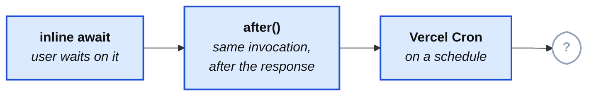

import Figure from '../../../components/figures/Figure.astro';
import DiagramSequence from '../../../components/figures/diagram-sequence/DiagramSequence.astro';
import DiagramStep from '../../../components/figures/diagram-sequence/DiagramStep.astro';
import StateMachineWalker from '../../../components/figures/state-machine-walker/StateMachineWalker.astro';
import Question from '../../../components/figures/state-machine-walker/Question.astro';
import Branch from '../../../components/figures/state-machine-walker/Branch.astro';
import Leaf from '../../../components/figures/state-machine-walker/Leaf.astro';
import CodeVariants from '../../../components/code/code-variants/CodeVariants.astro';
import CodeVariant from '../../../components/code/code-variants/CodeVariant.astro';
import Buckets from '../../../components/exercises/buckets/Buckets.astro';
import Bucket from '../../../components/exercises/buckets/Bucket.astro';
import Item from '../../../components/exercises/buckets/Item.astro';
import Matching from '../../../components/exercises/matching/Matching.astro';
import Pair from '../../../components/exercises/matching/Pair.astro';
import MultipleChoice from '../../../components/exercises/multiple-choice/MultipleChoice.astro';
import McqChoice from '../../../components/exercises/multiple-choice/McqChoice.astro';
import McqWhy from '../../../components/exercises/multiple-choice/McqWhy.astro';
import ExternalResource from '../../../components/ui/ExternalResource.astro';
import VideoCallout from '../../../components/embeds/VideoCallout.astro';
import { CardGrid, Aside } from '@astrojs/starlight/components';
import ConditionHeader from '../../../components/lessons/066/3/ConditionHeader.astro';
import Term from '../../../components/ui/Term.astro';
import CourseProgressBar from '../../../components/ui/CourseProgressBar.astro';

<CourseProgressBar value={frontmatter['course-progress']} />

You can already keep work off the request path three ways. Inline `await` for work the user is sitting there waiting on. `after()` for cleanup that has to run on the same invocation but the user doesn't need to see. Vercel Cron for anything on a schedule. And, just as importantly, you can defend *not* reaching for anything heavier — most of the work a SaaS does fits comfortably in those three tiers, and knowing that is what stops you from over-building.

This lesson draws the line those three tiers still can't cross. On the far side of it sits a durable background-job platform — in this course, Trigger.dev — and the next three lessons teach its SDK in detail. But before you learn how to write a task, you need to know whether you should be holding the SDK at all. That is the actual skill here. By the end you'll be able to stand at the fork and argue *both* directions: "no, Vercel Cron is enough, here's why" and "yes, Trigger.dev, because of this exact property." The answer, more often than you'd guess, is "no, you don't need it yet" — and being able to say *why* is the move that separates an experienced engineer from one who reaches for the heaviest tool first.

So this isn't an API lesson. There's almost no code in it. It's a decision lesson, and the thing you walk away with is a test you can run against any workload.

Here's the ladder you already own, drawn as one picture so we can see what we're adding to it.

<Figure caption="Three tiers cover same-invocation and scheduled work. This lesson is about what lives in the fourth.">

</Figure>

The whole lesson is about filling in that fourth slot. Notice we're *extending* a ladder you already climbed, not starting over — every tier below the question mark is still the right default until something specific forces you up.

## The senior question — what the cheap tiers still can't do

Inline `await` and `after()` between them cover same-invocation work: anything that can finish inside one function call. Vercel Cron covers schedules. Put those together and you've handled a large fraction of what a SaaS actually needs to do in the background.

So the question to sit with is precise: **what workloads do those tiers, combined, still fail at — and what specifically does a durable job platform provide that's worth the cost of running a second platform?**

That second clause matters as much as the first, because the cost is real and it's permanent. A job platform is not a library you add to `package.json` and forget. It's a second system. That means a second deploy step in CI. A second dashboard to check when something's wrong. A second secret to rotate. A second place a 3 a.m. page can come from. None of that is free, and none of it goes away once you've added it. So the capability you're buying has to be worth that standing cost — not nice to have, *worth a second platform.*

Which gives us the rule that governs the rest of this lesson, and it's the same rule that's run through this whole chapter: **you escalate only when a named, testable condition crosses — never on a hunch.** "This feels like it should be a background job" is not a reason. "This trips condition 3" is. Next we're going to name those conditions, and it turns out there are exactly five.

## Five conditions that justify a job platform

Each of these five is a property of a workload that the cheap tiers physically cannot provide. They're named so you can hold a real workload up against each one and get a yes-or-no answer — that's the whole point. If a workload trips even one of them, the cheap tiers are out, and you've earned the second platform. If it trips none, you stay cheap.

We're going to walk them in escalation order — roughly from the condition that breaks the cheap tiers most obviously to the one that's most subtle. Step through them one at a time. For each, hold onto two things: the concrete workload that trips it, and *how exactly* the cheap tier fails.

<DiagramSequence>
  <DiagramStep>
    <ConditionHeader step={1} icon="lucide:timer-off" title="Past the function time wall" />

    Work that needs more wall-clock time than a single function invocation gets — past the **13-minute cap on Pro, 5 minutes on Hobby**. The textbook case is a 50,000-row CSV export: reading, formatting, and writing that many rows simply can't finish before the wall.

    <Aside type="caution" title="How the cheap tier breaks">
      The function is killed mid-write the instant it hits the cap. You get a truncated file, no error the user can act on, and — worst of all — no way to resume where it stopped. This is the most *observable* condition: there's a hard number, and you either clear it or you don't.
    </Aside>
  </DiagramStep>

  <DiagramStep>
    <ConditionHeader step={2} icon="lucide:list-ordered" title="Multi-step orchestration with intermediate state" />

    Step A, then a pause or a wait for something external, then step B — where re-running step A on a failure in step B would be wrong or expensive. Think: charge a card, then provision the account, then send the welcome email. If provisioning fails, the retry must not charge the card a second time.

    <Aside type="caution" title="How the cheap tier breaks">
      A Server Action runs top to bottom once and returns. There is nowhere for "step B, after a pause, but don't redo step A" to live. The moment your work has a *middle* that has to survive independently of the start, the request model is out of room.
    </Aside>
  </DiagramStep>

  <DiagramStep>
    <ConditionHeader step={3} icon="lucide:refresh-cw" title="Automatic retries with backoff" />

    Work that must survive a transient downstream outage — on its *own* schedule, not the user's. A partner API or Resend returns a 503; the right behavior is to try again in 2 seconds, then 6, then 20, until it comes back.

    <Aside type="caution" title="How the cheap tier breaks">
      `after()` fires once and is gone. Vercel Cron logs the 5xx and waits for the next tick. Neither retries on its own. And a hand-rolled retry loop *inside* a request just burns the user's time budget — they're now waiting through your backoff.
    </Aside>
  </DiagramStep>

  <DiagramStep>
    <ConditionHeader step={4} icon="lucide:network" title="Fan-out with concurrency control" />

    One trigger that spawns many child runs — hundreds, thousands, tens of thousands — with a cap on how many run at once. This shape is called <Term definition="One trigger spawning many child runs, with a cap on how many run at once.">fan-out</Term>. A weekly digest that has to email 50,000 users without tripping Resend's rate limit is the canonical shape.

    <Aside type="caution" title="How the cheap tier breaks">
      One cron tick is one invocation. Emailing 50,000 users one-by-one inside it times out — that's condition 1 all over again. Firing all 50,000 at once, unbounded, melts the downstream service. You need something that can hold tens of thousands of pending units of work and meter them out.
    </Aside>
  </DiagramStep>

  <DiagramStep>
    <ConditionHeader step={5} icon="lucide:pause" title="Event-driven / human-in-the-loop pauses" />

    Work that blocks on something outside your system — a third-party callback, a human clicking "approve," or a wall-clock delay measured in hours or days. Kick off a partner video render and resume only when the partner calls back. Or hold a refund until an admin approves it.

    <Aside type="caution" title="How the cheap tier breaks">
      There is no way to pause a function invocation for six hours — you'd be paying for it the whole time, and it'd die at the cap anyway. The fallback is polling: wake up every few minutes and check. Polling burns compute on every wake and can still miss the moment the thing completes.
    </Aside>
  </DiagramStep>
</DiagramSequence>

Read those five back and notice what they have in common: each one is about *time* or *durability* in a way a single request can't honor. The request is short, it runs once, and when it's over it's over. The five conditions are all the shapes of work that outlive a single request — work that has to take longer than one, survive the failure of one, multiply into many, or wait across many.

Now practice the test, because being able to *run* it is the actual skill. The exercise below gives you a handful of real workloads. For each, decide which condition forces it off the cheap tiers — or drop it in the cheap-tier bucket if none of them do. Watch for the trap: some of these belong on the cheap tier, and reaching for a job platform anyway is the most common real-world mistake.

<Buckets twoCol instructions="Sort each workload into the condition that forces it off the cheap tiers — or into the cheap-tier bucket if none do.">
  <Bucket name="wall" label="Past the time wall" description="Exceeds the per-invocation cap" />
  <Bucket name="multistep" label="Multi-step with state" description="Steps that must not redo each other on retry" />
  <Bucket name="retries" label="Retries with backoff" description="Survives a transient outage on its own schedule" />
  <Bucket name="fanout" label="Fan-out" description="One trigger, many capped child runs" />
  <Bucket name="pause" label="Event / human pause" description="Blocks on a callback, approval, or long delay" />
  <Bucket name="cheap" label="Stays on the cheap tier" description="Inline, after(), or Vercel Cron" />

  <Item bucket="cheap">Send one invitation email (~200&nbsp;ms)</Item>
  <Item bucket="wall">Export 80,000 invoices to a CSV file</Item>
  <Item bucket="fanout">Email a weekly digest to every user without tripping the rate limit</Item>
  <Item bucket="pause">Wait for a partner's render webhook before saving the result</Item>
  <Item bucket="retries">Retry a flaky payment-provider call until it comes back</Item>
  <Item bucket="multistep">Charge the card, then provision, then email — no step repeats on retry</Item>
  <Item bucket="cheap">Nightly four-minute trial-expiry sweep</Item>
  <Item bucket="pause">Hold a refund until an admin approves it</Item>
</Buckets>

## Conditions that do not justify a job platform

The exercise had cheap-tier chips in it for a reason. The single most common mistake engineers make with background jobs isn't *missing* a real trigger — it's reaching for the platform when none of the five have actually crossed. So this beat gets equal billing with the last one.

Here are the non-triggers, each with the answer you should give instead.

**A slow API call that's still under the time wall.** Slowness on its own is not a trigger. If the user doesn't need the result, push it to `after()`. If they do need it, you're stuck with the latency — moving it to a job platform doesn't make it faster, it just adds a "where did my result go" problem on top. A 3-second call is annoying; it is not a reason to run a second platform.

**A nightly job that fits the function budget.** A four-minute sweep that runs once a day on a schedule is exactly what Vercel Cron is for. Having a *schedule* is not a trigger by itself — you only climb past Cron when the scheduled work *also* trips one of the five (it's too big for one invocation, it needs retries, it fans out). Schedule alone stays on Cron.

**"I want a separate worker for cleanliness."** No. This is the seductive one, because it sounds like good architecture. But a job platform is not an aesthetic choice. Pulling a Server Action's body out into a "clean" separate worker, when the work finishes fine inside the action, buys you a second deploy, a second dashboard, and a network hop — in exchange for a feeling. Separation you can't tie to one of the five conditions is cost with no return.

The line to keep in your head, the one you can quote in a code review when a teammate proposes a job for a workload that doesn't need one: **escalate on a condition, never on a vibe.**

<MultipleChoice>
  A teammate opens a pull request that moves the body of `inviteMember` — a DB insert plus a single ~200&nbsp;ms Resend call that already finishes well inside the function budget — out into a Trigger.dev task. Their PR description reads: *"Keeps the Server Action thin and puts the email logic in its own file."* You're the reviewer. What's the right call?

  <McqChoice correct>Request changes — nothing here trips one of the five, so the move pays a second platform's standing cost to buy a tidier file. If the action feels crowded, lift the email into a plain helper and keep the work inline.</McqChoice>
  <McqChoice>Approve — pushing side effects into background tasks is the cleaner long-term architecture, and a dedicated file makes the email logic easier to locate.</McqChoice>
  <McqChoice>Approve — a 200&nbsp;ms outbound call sitting on the request path is precisely the kind of latency a job platform is meant to take off the user's hands.</McqChoice>
  <McqChoice>Request changes, but only over the missing idempotency key — once the trigger is deduplicated, moving this to a task is the correct shape.</McqChoice>

  <McqWhy>**Request changes** is the senior call. Run the test: the work fits the time budget, runs once, fans out to nothing, and needs no retries or pauses — zero of the five conditions has crossed. "Thinner action" and "its own file" are organization preferences a plain helper function satisfies; they don't earn a second deploy, dashboard, and failure surface. The 200&nbsp;ms call *belongs* on the request path — the user is waiting to learn the invite actually sent, so moving it off only adds a "where did my result go" problem. And an idempotency key can't rescue a job that shouldn't exist in the first place. Escalate on a condition, never on a vibe.</McqWhy>
</MultipleChoice>

## The decision tree — from request to durable job

Now assemble the whole thing. The five conditions don't live in isolation — they sit at the bottom of a funnel that starts with much cheaper questions, and an experienced engineer runs that funnel top to bottom for every new piece of work. The decision is in the *order* the questions get asked, not in any single answer.

Walk the tree below. Each step is a question; pick the branch that matches your workload and it advances. The point isn't to memorize the leaves — it's to internalize the sequence, so that when you meet a workload this lesson never mentioned, you run the same funnel on it automatically. Notice that the schedule branch is the same one from the previous lesson; this tree wraps that decision inside the larger one.

<StateMachineWalker title="Where does this work run?">
  <Question id="user-visible" prompt="Does the user need to see this work finish before you respond?">
    <Branch label="Yes — they're waiting on the result" to="leaf-inline" />
    <Branch label="No — it can happen after the response" to="same-invocation" />
  </Question>

  <Question id="same-invocation" prompt="Can it finish inside this one invocation, with no retries and no pauses?" description="One short shot, same function call, lose-it-once-in-a-thousand is acceptable.">
    <Branch label="Yes — fire-and-forget on this invocation" to="leaf-after" />
    <Branch label="No — it needs to outlive this invocation" to="scheduled" />
  </Question>

  <Question id="scheduled" prompt="Is it a fixed schedule that fits inside one invocation?" description="Runs on a clock; the work itself finishes within the function budget.">
    <Branch label="Yes — a clock-driven job within budget" to="leaf-cron" />
    <Branch label="No — or the scheduled work is too big for one invocation" to="which-condition" />
  </Question>

  <Question id="which-condition" prompt="Which property forces it past the cheap tiers?" description="It tripped one of the five. Pick the one that fits.">
    <Branch label="It needs more time than the function cap" to="leaf-tt-wall" />
    <Branch label="It must retry a flaky downstream on its own schedule" to="leaf-tt-retry" />
    <Branch label="One trigger fans out to many runs" to="leaf-tt-fanout" />
    <Branch label="It pauses for a callback, approval, or long delay" to="leaf-tt-wait" />
  </Question>

  <Leaf id="leaf-inline" verdict="Inline await">
    The user is blocking on it, so it belongs on the request path. Keep it in the Server Action and return the `Result` when it's done. *Worked example: sending a single invitation email synchronously lands here.*
  </Leaf>

  <Leaf id="leaf-after" verdict="after()">
    Same invocation, runs after the response ships, no durability needed. *Worked example: logging analytics fields after a checkout completes lands here.*
  </Leaf>

  <Leaf id="leaf-cron" verdict="Vercel Cron">
    A schedule whose work fits one invocation. This is the previous lesson's branch, unchanged. *Worked example: a nightly five-minute job lands here.*
  </Leaf>

  <Leaf id="leaf-tt-wall" verdict="Trigger.dev — past the time wall">
    The work needs durable runs that survive past any single function's cap, resuming on a fresh worker. *Worked example: a multi-hour data export lands here.*
  </Leaf>

  <Leaf id="leaf-tt-retry" verdict="Trigger.dev — durable retries">
    The platform retries the failing step with exponential backoff on its own clock, not the user's. The request returned long ago.
  </Leaf>

  <Leaf id="leaf-tt-fanout" verdict="Trigger.dev fan-out (triggered by Vercel Cron)">
    The tiers compose. Vercel Cron does the *scheduling* — it fires on the clock — and its handler's only job is to enqueue a Trigger.dev fan-out that does the *work*, metered by a concurrency limit. *Worked example: sending 50,000 emails on a schedule lands here.*
  </Leaf>

  <Leaf id="leaf-tt-wait" verdict="Trigger.dev waitpoint">
    The run parks on a durable token, frees the worker, and resumes when the callback arrives or the human approves — no polling. *Worked example: waiting for a third-party webhook lands here.*
  </Leaf>
</StateMachineWalker>

The shape to take away is the funnel itself: *Is the user waiting? → Can it finish on this invocation? → Is it a schedule that fits? → Which of the five forced it up?* Four questions, asked in that order, and most workloads get an answer before they ever reach the fifth. The job platform only wins at the very bottom — which is exactly why it's the last tier, not the first reach.

## Why Trigger.dev, and what else is out there

You now know *when* to escalate. The remaining question is *which* tool, and that deserves an honest answer rather than a dogmatic one — the field has several good options in 2026, and the course picks one on purpose.

Here's the landscape, one line each, with the niche each one wins:

- **Inngest** — a serverless-native event system with step functions. Similar shape to Trigger.dev; particularly strong for teams whose architecture is already event-driven.
- **Vercel Queues** — Vercel-native durable pub/sub: you publish to topics, and consumer groups process in the background with retries and sharding. Lighter than a full orchestration runtime, which also makes it a weaker fit for multi-step jobs that carry intermediate state. As of early 2026 it's in public beta with at-least-once delivery — worth a flag, because architecting on a beta's delivery semantics is its own risk you'd want to take with eyes open.
- **BullMQ + Redis** — self-managed and fully under your control, but you run the Redis instance and the worker process yourself. Wins on hosts with persistent infrastructure, like Render or Railway.
- **AWS SQS + Lambda** — enterprise scale with a heavy operational surface. Wins when you're already deep inside an AWS footprint and the job system should live there too.

The course picks **Trigger.dev v4** — which went GA in 2026 on a rebuilt run engine — for one reason above the rest: it's the best developer experience for a small team in 2026. You get typed payloads, durable runs, visible run timelines you can scrub through, durable pauses, and a local-CLI loop that lets you kill a run mid-flight to *watch* it recover. For someone shipping a SaaS solo, that observability-for-free and typed surface lower the amount of hard-won judgment you have to supply yourself more than any alternative does. And if cost or data-residency ever forces your hand, there's an Apache-2.0 self-host off-ramp: the full platform runs on your own Docker and Postgres, with no run limits and no features held back behind a paywall. You're not locked in.

<VideoCallout videoId="vZRiSPNAAM0" videoTitle="Background jobs with Trigger.dev — the missing piece for your Next.js project">
  A 10-minute Trigger.dev tour by Elie Steinbock — long-running tasks past the function time wall, cron, durable waits, retries, and the run dashboard, all the capabilities this lesson maps onto the five conditions (filmed on v3; the concepts carry straight over to v4).
</VideoCallout>

<Matching instructions="Match each background-job tool to the situation where it's the strongest fit.">
  <Pair>
    <Fragment slot="left">`Trigger.dev v4`</Fragment>
    <Fragment slot="right">A small team that wants durable runs and a run dashboard with near-zero ops</Fragment>
  </Pair>
  <Pair>
    <Fragment slot="left">`Inngest`</Fragment>
    <Fragment slot="right">An architecture that's already built around events and step functions</Fragment>
  </Pair>
  <Pair>
    <Fragment slot="left">`Vercel Queues`</Fragment>
    <Fragment slot="right">Lightweight durable pub/sub that stays inside the Vercel platform</Fragment>
  </Pair>
  <Pair>
    <Fragment slot="left">`BullMQ + Redis`</Fragment>
    <Fragment slot="right">Full control on a host with persistent infrastructure you already run</Fragment>
  </Pair>
  <Pair>
    <Fragment slot="left">`AWS SQS + Lambda`</Fragment>
    <Fragment slot="right">A workload that should live inside an existing AWS footprint</Fragment>
  </Pair>
</Matching>

Now close the loop on the senior question from earlier — *what exactly does the platform buy that's worth a second system?* Map Trigger.dev's capabilities straight back onto the five conditions:

- **<Term definition={"A run that survives worker crashes, redeploys, and platform restarts by checkpointing between steps."}>Durable runs</Term>** that survive worker crashes and redeploys — these are what answer conditions 1 and 2 (past the time wall, multi-step with state). The run checkpoints between steps and resumes on a new worker.
- **Declared retries** with <Term definition={"Retry delays that grow geometrically, with jitter (randomization), so retries spread out instead of all stampeding at once."}>exponential backoff</Term> and jitter — condition 3. You configure the policy; the platform runs it.
- **Code-defined queues** with <Term definition={"The cap on how many runs of a queue execute at the same time — back-pressure."}>concurrency limits</Term> — condition 4. The queue holds the fan-out and meters how many run at once.
- **<Term definition={"A durable, resumable pause token: the run parks, the worker is freed, and an external signal resumes it."}>Waitpoints</Term>**, with `wait.for` and `wait.until` for durable pauses — condition 5. The run parks and the worker goes free.
- **Typed payloads and a run dashboard** sit across all five — every run, with its input and every step, is visible without you building any of it.

You'll notice I named those — waitpoints, queues, `wait.for` — as *capabilities*, not as code. That's deliberate: writing them is the job of the next three lessons. Right now you only need to know they exist and which condition each one answers.

## Where the run lives — Trigger.dev's architecture

I keep calling Trigger.dev a "second platform," so let's make that concrete instead of hand-wavy, because the topology has a direct consequence for the code you'll write.

Trigger.dev runs as a **separate service** — Trigger.dev's cloud, or your own self-hosted instance. Your app doesn't run the task. It *triggers* it: the app makes a call over HTTPS that says "run this task with this payload," and then the task executes on Trigger.dev's workers, not inside your Vercel function. This is the part to get right in your head: a task does not run "inside" the Server Action that triggered it. The action fires the trigger and returns; the work happens somewhere else.

The diagram below shows the three pieces and how they connect.

<Figure caption="The app triggers tasks over HTTPS; the work runs on Trigger.dev's workers. Both talk to the same Postgres — which is where the next section's catch lives.">
```d2
direction: right

**.style.font-size: 28

classes: {
  app: {
    style: {
      fill: "#dbeafe"
      stroke: "#2563eb"
      font-color: "#1e3a8a"
      border-radius: 12
    }
  }
  trigger: {
    style: {
      fill: "#ede9fe"
      stroke: "#7c3aed"
      font-color: "#4c1d95"
      border-radius: 12
    }
  }
  db: {
    style: {
      fill: "#fef3c7"
      stroke: "#d97706"
      font-color: "#78350f"
    }
  }
}

app: "App\n(Vercel function)" { class: app }
trigger: "Trigger.dev\nservice / workers" { class: trigger }
db: "Shared Postgres" {
  class: db
  shape: cylinder
}

app -> trigger: "triggers task\nover HTTPS" { style.stroke: "#7c3aed"; style.stroke-width: 2 }
app -> db: "reads / writes" { style.stroke: "#d97706" }
trigger -> db: "reads / writes" { style.stroke: "#d97706" }
```
</Figure>

Two practical facts fall out of that picture. First, **the tasks live in your codebase** — in a `src/trigger/` folder — and ship via the Trigger.dev CLI. So it's two deploys from one codebase: `vercel deploy` for the app, `trigger deploy` for the tasks, with types flowing between them through the shared SDK. (There's an ordering rule — deploy Trigger.dev first — but that's a detail for the wiring lesson at the end of this chapter; don't worry about it yet.) It is not a separate repo or a separate language; it's the same code, run by a second runtime.

Second, the **cost is billed on a different unit**, and this trips people up. Vercel bills you per invocation. Trigger.dev bills per run, per run-minute, and per concurrency seat. So the experienced reflex is to watch your per-task run count weekly — and to know that a sudden spike almost always means a missing <Term definition="A stable key that makes a retried trigger or side effect run exactly once instead of twice.">idempotency key</Term> or a retry storm, not real growth. The trap to avoid is comparing "Trigger.dev's cost per run" against "Vercel's cost per invocation" as if they were the same number. They aren't the same unit; that comparison is a category error.

## Tasks run outside your app's context

This is the one genuinely new mental model in the lesson, and it's the bridge to actually writing tasks in the next lesson. It follows directly from that diagram: if the task runs on Trigger.dev's workers and not in your Vercel function, then it does *not* have any of the request-scoped context your app code has leaned on since the auth and multi-tenancy units.

No Better Auth session. No `tenantDb` middleware deriving the current org for you. No cookies, no headers, no `requireOrgUser()`. A task is its own world — it boots cold, with nothing but the payload you handed it. Every helper you've written that quietly reads "the current user" or "the current org" from the request simply isn't available in there.

That gives you a rule you'll apply in every task you ever write: **every task payload carries the org context explicitly — `{ organizationId, ... }` — and every database call inside the task re-derives its tenant scope from that payload, via `tenantDb(organizationId)`.** The org id isn't ambient anymore; it's *cargo*, handed across the boundary in the payload and read back out on the other side.

The two panels below show the seam. This is the one code sketch in the lesson, and it's illustrative — the SDK shapes here (`tasks.trigger`, the task body) are taught properly in the next lesson. Read it for the *boundary*, not the syntax.

<CodeVariants>
  <CodeVariant label="From the app (has context)">
    <div data-mark-color="green">

    ```ts "{ organizationId: orgId, since }"
    export const exportInvoices = async (formData: FormData) => {
      const { orgId } = await requireOrgUser();
      const since = parseSince(formData);

      await tasks.trigger('export-csv', { organizationId: orgId, since });
    };
    ```

    </div>
    **The org id is handed across the boundary.** The action already has `orgId` from `requireOrgUser()`. It puts that id *into the payload* — the task can't reach back and ask who the user is, so the caller has to tell it.
  </CodeVariant>

  <CodeVariant label="Inside the task (no context)">
    <div data-mark-color="green">

    ```ts "tenantDb(organizationId)"
    run: async ({ organizationId, since }) => {
      // No session, no cookies, no requireOrgUser() — this runs on a worker.
      const db = tenantDb(organizationId);
      const invoices = await listInvoicesSince(db, since);
      // ...write the CSV
    };
    ```

    </div>
    **Scope is re-derived from the payload, never assumed.** `organizationId` comes straight out of the payload and goes into `tenantDb(...)`. The task never assumes a tenant — it reads the one it was handed.
  </CodeVariant>
</CodeVariants>

Two failure modes to inoculate against here, because both are common the first time someone writes a task. The first is assuming the task shares the caller's request context — it doesn't, so if you forget to pass the org id, the task has no way to scope its queries and you've got a tenancy bug or a crash. The second is subtler: the task hits the *same* Postgres as your request path (you saw that in the diagram), so a flood of concurrent tasks can contend for the same connection pool as live user traffic. The fix for that — connection pooling with PgBouncer — is something you've already met back when you set up Postgres; just keep in the back of your mind that "tasks and requests share a database" is a thing to size for, not a thing to ignore.

The reflex to leave with is short: **a task is its own world; org context is cargo, not ambient.**

## The course's jobs — and the ones that stay cheap

Let's make all of this concrete by applying the test to the actual app you're building — in both directions, because that's the skill.

**This one goes on Trigger.dev: the CSV export.** The export job you'll build in the next chapter's project is the cleanest possible "yes" — it trips *all five* conditions at once. It's multi-step. It's paginated past the time wall. It has to resume if a worker crashes mid-export. It fans out a unit of work per page. And it emails the finished file at the end. When a workload lights up every condition like that, the decision makes itself. This is the canonical target the rest of the chapter builds toward.

**These stay cheap, on purpose.** Look at the table below: the rest of the app's background work deliberately *doesn't* touch Trigger.dev, because none of it trips a condition.

| Workload | Where it runs (and why) |
| --- | --- |
| CSV export of an org's invoices | **Trigger.dev** — trips all five conditions |
| Single invitation email | **Inline `await`** — one ~200 ms call the user waits on |
| Direct file upload (the R2 upload flow a couple of chapters from now) | **Inline presigned PUT** — no task; the browser uploads straight to storage |
| Hourly trial-expiry sweep | **Vercel Cron** — a schedule that fits one invocation |
| Analytics event after checkout | **`after()`** — same invocation, fire-and-forget |

That's the whole point of the lesson in one table. The export earns the second platform because it has to; everything else stays on the tier that already does the job. **Not every job is a Trigger.dev job** — and you now have the test to tell which ones are.

Next, with the *whether* settled, you'll learn the *how*: the next lesson teaches the SDK — `task`, `schemaTask`, payload validation, queues, and triggering — so you can actually write that export task.

## External resources

<CardGrid>
  <ExternalResource
    title="Trigger.dev — Tasks: Overview"
    href="https://trigger.dev/docs/tasks/overview"
    icon="lucide:workflow"
    iconColor="#A653F4"
    description="The official starting point: what a task is and how runs work."
  />
  <ExternalResource
    title="Trigger.dev — How it works"
    href="https://trigger.dev/docs/how-it-works"
    icon="lucide:workflow"
    iconColor="#A653F4"
    description="The run engine, workers, and the trigger-from-your-app model from this lesson."
  />
  <ExternalResource
    title="Trigger.dev — Cloud Pricing"
    href="https://trigger.dev/pricing"
    icon="lucide:workflow"
    iconColor="#A653F4"
    description="The per-run, compute, and concurrency units — confirm current numbers yourself."
  />
</CardGrid>
