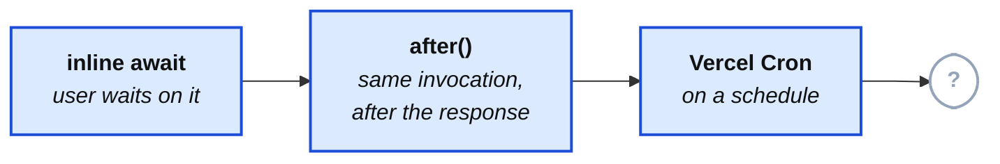

import Figure from '../../../components/figures/Figure.astro';
import DiagramSequence from '../../../components/figures/diagram-sequence/DiagramSequence.astro';
import DiagramStep from '../../../components/figures/diagram-sequence/DiagramStep.astro';
import StateMachineWalker from '../../../components/figures/state-machine-walker/StateMachineWalker.astro';
import Question from '../../../components/figures/state-machine-walker/Question.astro';
import Branch from '../../../components/figures/state-machine-walker/Branch.astro';
import Leaf from '../../../components/figures/state-machine-walker/Leaf.astro';
import CodeVariants from '../../../components/code/code-variants/CodeVariants.astro';
import CodeVariant from '../../../components/code/code-variants/CodeVariant.astro';
import Buckets from '../../../components/exercises/buckets/Buckets.astro';
import Bucket from '../../../components/exercises/buckets/Bucket.astro';
import Item from '../../../components/exercises/buckets/Item.astro';
import Matching from '../../../components/exercises/matching/Matching.astro';
import Pair from '../../../components/exercises/matching/Pair.astro';
import MultipleChoice from '../../../components/exercises/multiple-choice/MultipleChoice.astro';
import McqChoice from '../../../components/exercises/multiple-choice/McqChoice.astro';
import McqWhy from '../../../components/exercises/multiple-choice/McqWhy.astro';
import ExternalResource from '../../../components/ui/ExternalResource.astro';
import VideoCallout from '../../../components/embeds/VideoCallout.astro';
import { CardGrid, Aside } from '@astrojs/starlight/components';
import ConditionHeader from '../../../components/lessons/066/3/ConditionHeader.astro';
import Term from '../../../components/ui/Term.astro';
import CourseProgressBar from '../../../components/ui/CourseProgressBar.astro';

<CourseProgressBar value={frontmatter['course-progress']} />

You can already keep work off the request path three ways: inline `await` for work the user waits on, `after()` for cleanup that runs on the same invocation but never reaches the user, and Vercel Cron for anything on a schedule.
Most of what a web app does fits in these three tiers, and recognizing that is what keeps you from over-building.

Past them sits a durable background-job platform; in this course that platform is Trigger.dev, and the next three lessons teach its SDK.
Before reaching for it, you need to know whether the workload earns it.
This is a decision lesson with almost no code: you should leave able to argue either way at the fork, "Vercel Cron is enough, here's why" or "Trigger.dev, because of this exact property," and with a test you can run against any workload.

<Figure caption="Three tiers cover same-invocation and scheduled work. This lesson is about the fourth.">

</Figure>

Each tier stays the right default until something specific forces you up to the next one.
This lesson is about what that something is.

## Why a durable job platform must earn its cost

The cheap tiers already cover a large fraction of a web app's background work, so the question is sharp: what do they still fail at, and what does a durable job platform give you that's worth running a second platform?

That cost is real and permanent.
A job platform is not a library you add to `package.json` and forget; it's a second system, with its own deploy step in CI, its own dashboard to check, its own secret to rotate, and its own source of a 3 a.m. page.
The capability has to be worth that standing cost.

So escalate only when a named, testable condition crosses, never on a hunch.
"This feels like a background job" is not a reason; "this trips condition 3" is.
There are exactly five such conditions, and we name them next.

## Five conditions that justify a job platform

Each condition is a property of a workload the cheap tiers can't provide.
Trip even one and the cheap tiers are out; trip none and you stay cheap.
For each, hold onto two things: the workload that trips it, and how the cheap tier fails.

<DiagramSequence>
  <DiagramStep>
    <ConditionHeader step={1} icon="lucide:timer-off" title="Past the function time wall" />

    Work that needs more wall-clock time than one function invocation gets, past the **13-minute cap on Pro, 5 minutes on Hobby**. The textbook case is a 50,000-row CSV export: reading, formatting, and writing that many rows can't finish before the wall.

    <Aside type="caution" title="How the cheap tier breaks">
      The function is killed mid-write the instant it hits the cap. You get a truncated file, no actionable error, and no way to resume. There's a hard number, and you either clear it or you don't.
    </Aside>
  </DiagramStep>

  <DiagramStep>
    <ConditionHeader step={2} icon="lucide:list-ordered" title="Multi-step orchestration with intermediate state" />

    Step A, then a pause or a wait for something external, then step B, where re-running step A after a failure in step B would be wrong or expensive. Charge a card, then provision the account, then send the welcome email: if provisioning fails, the retry must not charge the card again.

    <Aside type="caution" title="How the cheap tier breaks">
      A Server Action runs top to bottom once and returns. There's nowhere for "step B, after a pause, but don't redo step A" to live. The moment your work has a middle that must survive independently of the start, the request model is out of room.
    </Aside>
  </DiagramStep>

  <DiagramStep>
    <ConditionHeader step={3} icon="lucide:refresh-cw" title="Automatic retries with backoff" />

    Work that must survive a transient downstream outage on its own schedule, not the user's. A partner API or Resend returns a 503, and the right behavior is to try again in 2 seconds, then 6, then 20, until it comes back.

    <Aside type="caution" title="How the cheap tier breaks">
      `after()` fires once and is gone. Vercel Cron logs the 5xx and waits for the next tick. Neither retries on its own, and a hand-rolled retry loop inside a request just burns the user's time budget, since they wait through your backoff.
    </Aside>
  </DiagramStep>

  <DiagramStep>
    <ConditionHeader step={4} icon="lucide:network" title="Fan-out with concurrency control" />

    One trigger that spawns many child runs, hundreds or thousands or tens of thousands, with a cap on how many run at once. This shape is called <Term definition="One trigger spawning many child runs, with a cap on how many run at once.">fan-out</Term>. The canonical case is a weekly digest that has to email 50,000 users without tripping Resend's rate limit.

    <Aside type="caution" title="How the cheap tier breaks">
      One cron tick is one invocation. Emailing 50,000 users one by one inside it times out, which is condition 1 again. Firing all 50,000 at once, unbounded, melts the downstream service. You need something that can hold tens of thousands of pending units of work and meter them out.
    </Aside>
  </DiagramStep>

  <DiagramStep>
    <ConditionHeader step={5} icon="lucide:pause" title="Event-driven / human-in-the-loop pauses" />

    Work that blocks on something outside your system: a third-party callback, a human clicking "approve," or a wall-clock delay of hours or days. Kick off a partner video render and resume only when the partner calls back, or hold a refund until an admin approves it.

    <Aside type="caution" title="How the cheap tier breaks">
      You can't pause a function invocation for six hours: you'd pay for it the whole time, and it would die at the cap anyway. The fallback is polling, waking every few minutes to check, which burns compute on every wake and can still miss the moment the work completes.
    </Aside>
  </DiagramStep>
</DiagramSequence>

The five share one shape: work that outlives a single request, which runs once and is over.
These conditions are work that takes longer than one request, survives the failure of one, multiplies into many, or waits across many.

Now run the test on real workloads.
Watch for the trap: some belong on the cheap tier, and reaching for a job platform anyway is the most common real-world mistake.

<Buckets twoCol instructions="Sort each workload into the condition that forces it off the cheap tiers — or into the cheap-tier bucket if none do.">
  <Bucket name="wall" label="Past the time wall" description="Exceeds the per-invocation cap" />
  <Bucket name="multistep" label="Multi-step with state" description="Steps that must not redo each other on retry" />
  <Bucket name="retries" label="Retries with backoff" description="Survives a transient outage on its own schedule" />
  <Bucket name="fanout" label="Fan-out" description="One trigger, many capped child runs" />
  <Bucket name="pause" label="Event / human pause" description="Blocks on a callback, approval, or long delay" />
  <Bucket name="cheap" label="Stays on the cheap tier" description="Inline, after(), or Vercel Cron" />

  <Item bucket="cheap">Send one invitation email (~200&nbsp;ms)</Item>
  <Item bucket="wall">Export 80,000 invoices to a CSV file</Item>
  <Item bucket="fanout">Email a weekly digest to every user without tripping the rate limit</Item>
  <Item bucket="pause">Wait for a partner's render webhook before saving the result</Item>
  <Item bucket="retries">Retry a flaky payment-provider call until it comes back</Item>
  <Item bucket="multistep">Charge the card, then provision, then email — no step repeats on retry</Item>
  <Item bucket="cheap">Nightly four-minute trial-expiry sweep</Item>
  <Item bucket="pause">Hold a refund until an admin approves it</Item>
</Buckets>

## Conditions that do not justify a job platform

The common mistake isn't missing a real trigger; it's reaching for a job platform when none of the five conditions has crossed.
Three cases fool people most often.

**A slow API call that's still under the time wall.**
Slowness alone is not a trigger.
If the user doesn't need the result, push it to `after()`; if they do, you're stuck with the latency either way, since a job platform doesn't make the call faster, it just adds a "where did my result go" problem on top.
A 3-second call is annoying, not a reason to run a second platform.

**A nightly job that fits the function budget.**
A four-minute sweep that runs once a day is exactly what Vercel Cron is for.
A schedule is not a trigger by itself; you climb past Cron only when the scheduled work also trips one of the five, by being too big for one invocation, needing retries, or fanning out.

**"I want a separate worker for cleanliness."**
A job platform is not an aesthetic choice.
Lifting a Server Action's body into a "clean" separate worker, when the work finishes fine inside the action, buys you a second deploy, a second dashboard, and a network hop in exchange for a feeling.
Separation you can't tie to one of the five conditions is pure cost.

Keep one line for code review: **escalate on a condition, never on a vibe.**

<MultipleChoice>
  A teammate opens a pull request that moves the body of `inviteMember` — a DB insert plus a single ~200&nbsp;ms Resend call that already finishes well inside the function budget — out into a Trigger.dev task. Their PR description reads: *"Keeps the Server Action thin and puts the email logic in its own file."* You're the reviewer. What's the right call?

  <McqChoice correct>Request changes — nothing here trips one of the five, so the move pays a second platform's standing cost to buy a tidier file. If the action feels crowded, lift the email into a plain helper and keep the work inline.</McqChoice>
  <McqChoice>Approve — pushing side effects into background tasks is the cleaner long-term architecture, and a dedicated file makes the email logic easier to locate.</McqChoice>
  <McqChoice>Approve — a 200&nbsp;ms outbound call sitting on the request path is precisely the kind of latency a job platform is meant to take off the user's hands.</McqChoice>
  <McqChoice>Request changes, but only over the missing idempotency key — once the trigger is deduplicated, moving this to a task is the correct shape.</McqChoice>

  <McqWhy>**Request changes** is the senior call. Run the test: the work fits the time budget, runs once, fans out to nothing, and needs no retries or pauses — zero of the five conditions has crossed. "Thinner action" and "its own file" are organization preferences a plain helper function satisfies; they don't earn a second deploy, dashboard, and failure surface. The 200&nbsp;ms call *belongs* on the request path: the user is waiting to learn the invite actually sent, so moving it off only adds a "where did my result go" problem. And an idempotency key can't rescue a job that shouldn't exist. Escalate on a condition, never on a vibe.</McqWhy>
</MultipleChoice>

## The decision tree, from request to durable job

The five conditions sit at the bottom of a funnel that opens with much cheaper questions.
Run it top to bottom for every new piece of work: the decision lives in the order you ask, not in any single answer.
Learn the sequence, not the leaves, and a workload this lesson never mentioned still lands in the right tier.
The schedule branch is the previous lesson's, now wrapped inside the larger decision.

<StateMachineWalker title="Where does this work run?">
  <Question id="user-visible" prompt="Does the user need to see this work finish before you respond?">
    <Branch label="Yes — they're waiting on the result" to="leaf-inline" />
    <Branch label="No — it can happen after the response" to="same-invocation" />
  </Question>

  <Question id="same-invocation" prompt="Can it finish inside this one invocation, with no retries and no pauses?" description="One short shot, same function call, lose-it-once-in-a-thousand is acceptable.">
    <Branch label="Yes — fire-and-forget on this invocation" to="leaf-after" />
    <Branch label="No — it needs to outlive this invocation" to="scheduled" />
  </Question>

  <Question id="scheduled" prompt="Is it a fixed schedule that fits inside one invocation?" description="Runs on a clock; the work itself finishes within the function budget.">
    <Branch label="Yes — a clock-driven job within budget" to="leaf-cron" />
    <Branch label="No — or the scheduled work is too big for one invocation" to="which-condition" />
  </Question>

  <Question id="which-condition" prompt="Which property forces it past the cheap tiers?" description="It tripped one of the five. Pick the one that fits.">
    <Branch label="It needs more time than the function cap" to="leaf-tt-wall" />
    <Branch label="It must retry a flaky downstream on its own schedule" to="leaf-tt-retry" />
    <Branch label="One trigger fans out to many runs" to="leaf-tt-fanout" />
    <Branch label="It pauses for a callback, approval, or long delay" to="leaf-tt-wait" />
  </Question>

  <Leaf id="leaf-inline" verdict="Inline await">
    The user is blocking on it, so it belongs on the request path. Keep it in the Server Action and return the `Result` when it's done. *Worked example: sending a single invitation email synchronously.*
  </Leaf>

  <Leaf id="leaf-after" verdict="after()">
    Same invocation, runs after the response ships, no durability needed. *Worked example: logging analytics fields after a checkout completes.*
  </Leaf>

  <Leaf id="leaf-cron" verdict="Vercel Cron">
    A schedule whose work fits one invocation. This is the previous lesson's branch, unchanged. *Worked example: a nightly five-minute job.*
  </Leaf>

  <Leaf id="leaf-tt-wall" verdict="Trigger.dev — past the time wall">
    The work needs durable runs that survive past any single function's cap, resuming on a fresh worker. *Worked example: a multi-hour data export.*
  </Leaf>

  <Leaf id="leaf-tt-retry" verdict="Trigger.dev — durable retries">
    The platform retries the failing step with exponential backoff on its own clock, not the user's. The request returned long ago.
  </Leaf>

  <Leaf id="leaf-tt-fanout" verdict="Trigger.dev fan-out (triggered by Vercel Cron)">
    The tiers compose. Vercel Cron fires on the clock, and its handler's only job is to enqueue a Trigger.dev fan-out that does the work, metered by a concurrency limit. *Worked example: sending 50,000 emails on a schedule.*
  </Leaf>

  <Leaf id="leaf-tt-wait" verdict="Trigger.dev waitpoint">
    The run parks on a durable token, frees the worker, and resumes when the callback arrives or the human approves, with no polling. *Worked example: waiting for a third-party webhook.*
  </Leaf>
</StateMachineWalker>

Take away the funnel itself: *Is the user waiting? → Can it finish on this invocation? → Is it a schedule that fits? → Which of the five forced it up?*
Most workloads get an answer before the last question, which is why the job platform is the last tier rather than the first reach.

## Why Trigger.dev, and what else is out there

You know when to escalate; the open question is which tool.
Several good options exist, and the course picks one on purpose.

The landscape, one line each:

- **Inngest:** a serverless-native event system with step functions, similar in shape to Trigger.dev. Strongest for teams already built around events.
- **Vercel Queues:** Vercel-native durable pub/sub — publish to topics, consumer groups process in the background with retries and sharding. Lighter than a full orchestration runtime, so a weaker fit for multi-step jobs that carry state. As of early 2026 it's a public beta with at-least-once delivery, so building on its delivery semantics is a risk you take with eyes open.
- **BullMQ + Redis:** full control, but you run the Redis instance and the worker yourself. Wins on hosts with persistent infrastructure, like Render or Railway.
- **AWS SQS + Lambda:** enterprise scale with a heavy operational surface. Wins when you're already deep in AWS and want the job system there too.

The course picks **Trigger.dev v4** for one reason: it's the best developer experience for a small team.
You get typed payloads, durable runs, run timelines you can scrub through, durable pauses, and a local-CLI loop where you kill a run mid-flight and watch it recover.
For someone shipping solo, that free observability and typed surface stands in for judgment you'd otherwise supply yourself.
If cost or data residency ever forces your hand, the full platform self-hosts under Apache-2.0 on your own Docker and Postgres, with no run limits.

<VideoCallout videoId="vZRiSPNAAM0" videoTitle="Background jobs with Trigger.dev — the missing piece for your Next.js project">
  A 10-minute Trigger.dev tour by Elie Steinbock: long-running tasks past the function time wall, cron, durable waits, retries, and the run dashboard — the same capabilities this lesson maps onto the five conditions (filmed on v3, but the concepts carry to v4).
</VideoCallout>

<Matching instructions="Match each background-job tool to the situation where it's the strongest fit.">
  <Pair>
    <Fragment slot="left">`Trigger.dev v4`</Fragment>
    <Fragment slot="right">A small team that wants durable runs and a run dashboard with near-zero ops</Fragment>
  </Pair>
  <Pair>
    <Fragment slot="left">`Inngest`</Fragment>
    <Fragment slot="right">An architecture that's already built around events and step functions</Fragment>
  </Pair>
  <Pair>
    <Fragment slot="left">`Vercel Queues`</Fragment>
    <Fragment slot="right">Lightweight durable pub/sub that stays inside the Vercel platform</Fragment>
  </Pair>
  <Pair>
    <Fragment slot="left">`BullMQ + Redis`</Fragment>
    <Fragment slot="right">Full control on a host with persistent infrastructure you already run</Fragment>
  </Pair>
  <Pair>
    <Fragment slot="left">`AWS SQS + Lambda`</Fragment>
    <Fragment slot="right">A workload that should live inside an existing AWS footprint</Fragment>
  </Pair>
</Matching>

Now map Trigger.dev's capabilities back onto the five conditions:

- **<Term definition={"A run that survives worker crashes, redeploys, and platform restarts by checkpointing between steps."}>Durable runs</Term>** answer conditions 1 and 2 (past the time wall, multi-step with state): the run checkpoints between steps and resumes on a new worker.
- **Declared retries** with <Term definition={"Retry delays that grow geometrically, with jitter (randomization), so retries spread out instead of all stampeding at once."}>exponential backoff</Term> and jitter answer condition 3: you set the policy, the platform runs it.
- **Code-defined queues** with <Term definition={"The cap on how many runs of a queue execute at the same time — back-pressure."}>concurrency limits</Term> answer condition 4: the queue holds the fan-out and meters how many run at once.
- **<Term definition={"A durable, resumable pause token: the run parks, the worker is freed, and an external signal resumes it."}>Waitpoints</Term>**, via `wait.for` and `wait.until`, answer condition 5: the run parks and the worker goes free.
- **Typed payloads and a run dashboard** sit across all five: every run, its input, and every step is visible without you building any of it.

Each is named as a capability, not code; the next three lessons write them.

## Trigger.dev runs as a separate service

Trigger.dev runs as a **separate service**, either its cloud or a self-hosted instance.
Your app doesn't run the task, it *triggers* it: an HTTPS call says "run this task with this payload," and the work then runs on Trigger.dev's workers, not inside the Vercel function or the Server Action that fired it.

<Figure caption="The app triggers tasks over HTTPS; the work runs on Trigger.dev's workers. Both read and write the same Postgres.">
```d2
direction: right

**.style.font-size: 28

classes: {
  app: {
    style: {
      fill: "#dbeafe"
      stroke: "#2563eb"
      font-color: "#1e3a8a"
      border-radius: 12
    }
  }
  trigger: {
    style: {
      fill: "#ede9fe"
      stroke: "#7c3aed"
      font-color: "#4c1d95"
      border-radius: 12
    }
  }
  db: {
    style: {
      fill: "#fef3c7"
      stroke: "#d97706"
      font-color: "#78350f"
    }
  }
}

app: "App\n(Vercel function)" { class: app }
trigger: "Trigger.dev\nservice / workers" { class: trigger }
db: "Shared Postgres" {
  class: db
  shape: cylinder
}

app -> trigger: "triggers task\nover HTTPS" { style.stroke: "#7c3aed"; style.stroke-width: 2 }
app -> db: "reads / writes" { style.stroke: "#d97706" }
trigger -> db: "reads / writes" { style.stroke: "#d97706" }
```
</Figure>

Two things follow from that picture.

First, **the tasks live in your codebase**, in a `trigger/` folder, and ship via the Trigger.dev CLI.
That makes it two deploys from one codebase, `vercel deploy` for the app and `trigger deploy` for the tasks, with types flowing between them through the shared SDK.
It's not a separate repo or language, just the same code run by a second runtime.

Second, **the cost is billed on a different unit**: Vercel bills per invocation, Trigger.dev per run, run-minute, and concurrency seat, so the two numbers aren't comparable.
Watch your per-task run count weekly: a sudden spike almost always means a missing <Term definition="A stable key that makes a retried trigger or side effect run exactly once instead of twice.">idempotency key</Term> or a retry storm, not real growth.

## Tasks run outside your app's request context

A task runs on Trigger.dev's workers, not in your Vercel function, so none of the request-scoped context your app code relies on is available.
A task boots cold with nothing but its payload: no Better Auth session, no `tenantDb` middleware to derive the current org, no cookies, headers, or `requireOrgUser()`.
Every helper that quietly reads "the current user" or "the current org" from the request is gone.

That leaves one rule for every task: **the payload carries org context explicitly, as `{ organizationId, ... }`, and every database call re-derives its tenant scope from that payload, via `tenantDb(organizationId)`.**
The org id isn't ambient; it's cargo, handed across the boundary in the payload and read back out on the other side.

The two panels show that boundary.
Read them for the seam, not the syntax; the SDK shapes are taught in the next lesson.

<CodeVariants>
  <CodeVariant label="From the app (has context)">
    <div data-mark-color="green">

    ```ts "{ organizationId: orgId, since }"
    export const exportInvoices = async (formData: FormData) => {
      const { orgId } = await requireOrgUser();
      const since = parseSince(formData);

      await tasks.trigger('export-csv', { organizationId: orgId, since });
    };
    ```

    </div>
    **The org id is handed across the boundary.** The action already has `orgId` from `requireOrgUser()`, so it puts that id into the payload. The task can't ask who the user is; the caller has to tell it.
  </CodeVariant>

  <CodeVariant label="Inside the task (no context)">
    <div data-mark-color="green">

    ```ts "tenantDb(organizationId)"
    run: async ({ organizationId, since }) => {
      // No session, no cookies, no requireOrgUser() — this runs on a worker.
      const db = tenantDb(organizationId);
      const invoices = await listInvoicesSince(db, since);
      // ...write the CSV
    };
    ```

    </div>
    **Scope is re-derived from the payload, never assumed.** `organizationId` comes straight from the payload into `tenantDb(...)`. The task reads the tenant it was handed instead of assuming one.
  </CodeVariant>
</CodeVariants>

Two failure modes are common at first.
One is assuming the task shares the caller's request context: forget to pass the org id and the task can't scope its queries, so you get a tenancy bug or a crash.
The other is subtler.
The task hits the same Postgres as your request path, so a flood of concurrent tasks can contend for the connection pool against live user traffic.
The fix is connection pooling with PgBouncer, set up alongside Postgres.

## Which of the app's jobs earn Trigger.dev

Now run the test against the app you're building.

**The CSV export earns Trigger.dev.**
The export you'll build next chapter is the cleanest possible "yes": it trips all five conditions.
It's multi-step, paginated past the time wall, has to resume if a worker crashes mid-export, fans out a unit of work per page, and emails the finished file at the end.

**Everything else stays cheap,** because none of it trips a condition.

| Workload | Where it runs (and why) |
| --- | --- |
| CSV export of an org's invoices | **Trigger.dev**, trips all five conditions |
| Single invitation email | **Inline `await`**, one ~200 ms call the user waits on |
| Direct file upload (the R2 upload flow a couple of chapters from now) | **Inline presigned PUT**, no task; the browser uploads straight to storage |
| Hourly trial-expiry sweep | **Vercel Cron**, a schedule that fits one invocation |
| Analytics event after checkout | **`after()`**, same invocation, fire-and-forget |

With the *whether* settled, the next lesson covers the *how*: the SDK, `task`, `schemaTask`, payload validation, queues, and triggering, so you can write that export task.

## External resources

<CardGrid>
  <ExternalResource
    title="Trigger.dev — Tasks: Overview"
    href="https://trigger.dev/docs/tasks/overview"
    icon="lucide:workflow"
    iconColor="#A653F4"
    description="The official starting point: what a task is and how runs work."
  />
  <ExternalResource
    title="Trigger.dev — How it works"
    href="https://trigger.dev/docs/how-it-works"
    icon="lucide:workflow"
    iconColor="#A653F4"
    description="The run engine, workers, and the trigger-from-your-app model from this lesson."
  />
  <ExternalResource
    title="Trigger.dev — Cloud Pricing"
    href="https://trigger.dev/pricing"
    icon="lucide:workflow"
    iconColor="#A653F4"
    description="The per-run, compute, and concurrency units — confirm current numbers yourself."
  />
</CardGrid>
