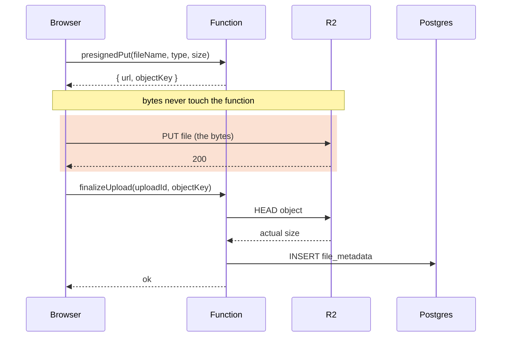

import Figure from '../../../components/figures/Figure.astro';
import AnnotatedCode from '../../../components/code/annotated-code/AnnotatedCode.astro';
import AnnotatedStep from '../../../components/code/annotated-code/AnnotatedStep.astro';
import Buckets from '../../../components/exercises/buckets/Buckets.astro';
import Bucket from '../../../components/exercises/buckets/Bucket.astro';
import Item from '../../../components/exercises/buckets/Item.astro';
import Sequence from '../../../components/exercises/sequence/Sequence.astro';
import Step from '../../../components/exercises/sequence/Step.astro';
import Term from '../../../components/ui/Term.astro';
import ExternalResource from '../../../components/ui/ExternalResource.astro';
import CourseProgressBar from '../../../components/ui/CourseProgressBar.astro';
import { CardGrid } from '@astrojs/starlight/components';
import VideoCallout from '../../../components/embeds/VideoCallout.astro';
import PresignedUrlAnatomy from '../../../components/lessons/068/3/PresignedUrlAnatomy.astro';

<CourseProgressBar value={frontmatter['course-progress']} />

Your `S3Client` in `lib/r2.ts` is wired up but idle: it can't yet move a single byte.
Picture a user choosing a 40 MB PDF in the browser.
How do those bytes reach R2 without passing through your Next.js function, and what stops a client from uploading a 2 GB file, or an executable to a key ending in `.png`?

A **presigned URL** answers both.
It is a temporary, narrowly scoped link that lets a browser with no R2 credentials write to or read from the bucket directly.
You'll mint one for uploads (a presigned PUT) and one for downloads (a presigned GET), scoping each to a single method, key, and content type with a fuse measured in minutes.
You'll defend the upload size against an R2 quirk that defeats the obvious check, and you'll wire the two-step *sign-then-finalize* flow that writes a Postgres row only after the bytes land in the bucket.
The browser code that fires the upload comes later; here you build the action signatures it calls.

## What a presigned URL is

A presigned URL is an ordinary R2 object URL, naming the bucket, the object key, and an HTTP method, with a few query parameters added.
Those parameters carry an <Term definition="Keyed hash. Proves the URL was minted by the holder of the secret key and that none of the signed fields were altered: change one and the hash no longer matches.">HMAC</Term> signature computed over the bucket, the key, the method, the expiry, and any headers the function chose to pin, all signed with your function's R2 credentials.
Whoever holds the URL can perform exactly that one operation, that key and that method, until it expires, with **no R2 credentials of their own**.
The function mints the URL; the client spends it.

This solves a problem you can already feel.
Your function holds the R2 secret, and the browser must never hold it: a `NEXT_PUBLIC_R2_SECRET_ACCESS_KEY` is a public write hole into your bucket, readable by anyone who opens DevTools.
So the function can't hand over the secret, yet the browser is the one with the bytes.
A presigned URL lets the function delegate one narrow action, "you may PUT this one object for the next five minutes," without surrendering the credential that authorizes it.

There are three flavors, and you'll build two of them.

- **Presigned PUT.** The browser uploads one object to the signed key. This is the course default for uploads under 100 MB, which covers almost every file a web app accepts.
- **Presigned GET.** Anyone holding the URL can read the object until it expires. This is the default for serving private files back to their owner.
- **Presigned POST (policy-based).** An upload form that carries a *policy document* the storage layer enforces, including server-side size and content-type limits. You won't build it: PUT covers the project, and you'll enforce size with a verification step later in this lesson instead.

<Figure caption="A presigned PUT URL. The base address says which object and operation; the query parameters say how long it lasts and what's sealed.">
  <PresignedUrlAnatomy />
</Figure>

The signature is a hash over those fields.
The expiry and the pinned headers sit in the URL in plaintext; what the signature adds is that it makes them tamper-proof.
Change any sealed field and the hash no longer matches what the function signed, so R2 rejects the request.
The rest of the lesson is deciding which fields to seal and how tightly.

## Signing a PUT URL for uploads

Minting the PUT URL is a thin layer over the SDK at the call site, the same stance you took with `lib/r2.ts` and `lib/email.ts`: the SDK stays in the open rather than hiding behind a homegrown wrapper.
The whole thing is two calls: describe the operation as a command, then sign it.

<AnnotatedCode lang="ts" maxLines={10} code={`
const command = new PutObjectCommand({
  Bucket: env.R2_BUCKET_NAME,
  Key: objectKey,
  ContentType: contentType,
  ContentLength: claimedSize,
});
const url = await getSignedUrl(r2, command, {
  expiresIn: 300,
  signableHeaders: new Set(['content-type']),
});
`}>
  <AnnotatedStep meta="{2-3}" color="blue">
    `PutObjectCommand` describes the operation and its target: a PUT to one object.
    `Bucket` reads from the typed `env`, never raw `process.env`.
    `Key` is the tenancy-scoped path the *server* built, `org/${orgId}/files/${id}.${ext}`, never a value the client sent.
  </AnnotatedStep>

  <AnnotatedStep meta="{4}" color="green">
    The content type is pinned into the command, and the signature will enforce it: when the browser uploads, it must send a matching `Content-Type` header or R2 rejects the request with `403 SignatureDoesNotMatch`.
  </AnnotatedStep>

  <AnnotatedStep meta="{5}" color="orange">
    The claimed size is signed too, and here is the trap: you'd expect R2 to reject an upload that exceeds it, but `ContentLength` rides along in the signature without R2 enforcing a maximum body size from it.
    Note it now; a later section resolves it.
  </AnnotatedStep>

  <AnnotatedStep meta="{7-8}" color="blue">
    `getSignedUrl` takes the `r2` singleton from `lib/r2.ts`, the command, and the options, and returns a plain string: the full URL with the signature appended.
    `expiresIn: 300` sets a five-minute fuse, long enough for a real upload but short enough that a leaked URL is stale almost immediately.
  </AnnotatedStep>

  <AnnotatedStep meta="{9}" color="violet">
    This forces `content-type` into the set of signed headers.
    Without it the v3 presigner won't reliably fold the content type into the signature, so the pin from step 2 wouldn't bind and the browser could send any type.
  </AnnotatedStep>
</AnnotatedCode>

On the browser side, which you'll write in the next chapter, spending that URL is a single `fetch`:

```ts
await fetch(url, {
  method: 'PUT',
  body: file,
  headers: { 'Content-Type': file.type },
});
```

Carry one rule out of this section: **the `Content-Type` the browser sends must equal the `ContentType` that was signed, exactly.**
Sign `image/png` and send `image/jpeg`, or sign `image/png` and send nothing, and R2 answers `403 SignatureDoesNotMatch` with no body uploaded.
This is the most common first-upload failure, and the error doesn't point at the cause, so name it now and you'll recognize it when it happens.

## Signing a GET URL for reads

Reading an object back is the same idea with less to scope.
There's no body and no content type to pin, so the GET is smaller:

```ts
const url = await getSignedUrl(
  r2,
  new GetObjectCommand({ Bucket: env.R2_BUCKET_NAME, Key: objectKey }),
  { expiresIn: 600 },
);
```

Ten minutes this time, because a read can sit unviewed a little longer than an upload takes to fire.
The returned string drops straight into an ``, an `<a href>`, or the body of an email, anywhere a browser will issue a GET.

One rule separates a leak-proof read path from a leaky one: **mint presigned GET URLs fresh, per render or per request, and never persist them.**
Not in a column, not in a cache that outlives the expiry.
The database row stores only the file's permanent parts, the object key, content type, size, and names; the URL is derived from those on demand, every time someone needs to view the file.

Email shows why.
Emailing a download link tempts you toward a long expiry, a 24-hour link "so it works all day."
But that URL then lives in the email provider's logs, the recipient's inbox, and every forward, and anyone who finds it can download the file for a full day.
A short expiry fails the other way: the recipient opens the email an hour later and the link is dead.
The fix is to email a link to an *app route* you control, and have that route mint a fresh short-lived GET when the recipient clicks.
The email never carries the raw presigned URL.

<VideoCallout videoId="V2arOZ72d6M" videoTitle="Amazon S3 Presigned URLs — Uploads and Downloads">
  Milan Jovanović walks the same PUT-and-GET signing flow on a whiteboard, then in code (15 min). The SDK here is .NET, but the request-then-sign shape and the bytes-bypass-the-server motivation are identical to ours.
</VideoCallout>

## Enforcing upload size and type limits

The PUT walkthrough flagged a trap: `ContentLength` is signed, but R2 doesn't enforce it.
Time to resolve that.

This is a real platform difference, not a bug: **S3's presigned-POST policy supports a `content-length-range` condition that the storage layer enforces, but R2's presigned PUT does not enforce a maximum body size from the signed `ContentLength`.**
A client holding a valid PUT URL can stream a terabyte to your bucket regardless of the size it claimed when it asked for the URL.
So signing `ContentLength` is not a size defense, and if it's your only one, you have none.

The fix is three checks in series, none of them the boundary on its own.
Think of it as defense in depth.

- **Client pre-check.** Before the browser requests a URL, it validates `file.size`. This is *UX, not security*: it gives the user instant feedback ("that file's too big") and saves a pointless round-trip. A script can bypass it trivially, so you never rely on it.
- **Server cap before signing.** The action checks `claimedSize` against a per-tenant or per-type maximum and refuses to mint a URL for an over-cap claim. This is *policy*: you don't issue a capability for an upload you'd reject. But it still trusts a number the client typed, so it's not the boundary either.
- **Post-upload HEAD verify.** After the PUT completes, the finalize step issues a `HeadObjectCommand`, a HEAD request, which asks R2 for an object's response headers without transferring its body. It reads the *actual* `ContentLength` R2 reports for the stored object and compares that real number against the cap, all before it writes any row. **This is the boundary.** If the stored object blows past the cap, no row is written, and a cleanup sweep deletes the oversized object later.

That reordering changes what the `file_metadata` row means: it is no longer a record that a URL was issued, but the function's assertion that it asked R2 how big the object actually is and accepted the answer.

The same policy-versus-enforcement split answers the other obvious attack, uploading an executable to a key that ends in `.png`.
The policy half is a content-type allow-list checked *before* signing, so the function never mints a URL for a type you don't accept:

```ts
if (!ALLOWED_TYPES.has(contentType)) {
  return err('validation', 'Unsupported file type');
}
```

The enforcement half is the signed `ContentType` from the PUT section: the `403` that fires if the browser's header doesn't match.
The function won't sign the executable's real type, and a forged key can't swap the sealed content type after the fact.
The allow-list is the policy; the signature is the runtime enforcement.

Now sort the defenses yourself.
Notice which check actually stops an oversize upload, and that the content-type pin and the expiry, real defenses both, do nothing for *size*.

<Buckets twoCol instructions="Sort each defense by whether it actually stops a client from uploading a file bigger than your limit.">
  <Bucket name="stops" label="Stops an oversize upload" description="Load-bearing for size" />
  <Bucket name="doesnt" label="Doesn't stop it / wrong tool" description="UX, trusts the claim, or defends something else" />

  <Item bucket="stops">Post-upload `HeadObjectCommand` size compare — reads the *real* stored size from R2 and rejects before the row is written</Item>
  <Item bucket="doesnt">Client-side `file.size` check — UX feedback only, trivially bypassed by a script</Item>
  <Item bucket="doesnt">Server cap on `claimedSize` before signing — policy, but it trusts a number the client typed</Item>
  <Item bucket="doesnt">Signed `ContentLength` — R2 won't enforce a max body size from it</Item>
  <Item bucket="doesnt">Signed `ContentType` — that's the type pin, not the size</Item>
  <Item bucket="doesnt">Short `expiresIn` — that's the leak window, not the size</Item>
</Buckets>

## The two-step write: sign, upload, finalize

A safe direct-to-R2 upload is not one request.
It's two round-trips to your function, with the byte transfer in between going straight to R2, bypassing the function entirely.

1. **Request and sign.** The client calls a `presignedPut` action with `{ fileName, contentType, claimedSize }`. The action authorizes the caller by role, checks the content-type allow-list and the size cap, builds the server-side `objectKey`, signs the PUT, and returns `{ url, objectKey, uploadId }`.
2. **Direct upload.** The client PUTs the file straight to R2 with the signed URL. **Your function is not in this path**, the bytes-never-touch-the-function rule made literal. Whether the file is 5 KB or 5 GB, your function's CPU and bandwidth are unchanged.
3. **Finalize.** On a successful PUT, the client calls a second action, `finalizeUpload`, with `{ uploadId, objectKey }`. The actual size is *not* in that payload: the server is about to read it from R2 rather than trust the client to report it.
4. **Verify and persist.** The finalize action HEADs the object, checks the real size against the cap, inserts the `file_metadata` row, and returns success.

The ordering rule is what to internalize: **the metadata row is written after the upload is confirmed, never before.**
The two ways the flow can fail are not equally bad.

Write the row *first* and let the upload fail, through a network drop or a closed tab, and you have an **orphan row**: the UI lists a file that doesn't exist, and every read 404s on the bytes.
The database is now lying.
Let the upload succeed but finalize never run, and you have **orphan bytes**: an object in R2 with no row pointing at it.
Both are messes, but they cost differently.
Orphan bytes are a cheap cleanup chore; a prefix-scoped <Term definition="A prefix-scoped rule on the bucket that auto-deletes objects older than N days. Configured once; no app code runs.">lifecycle rule</Term> or a daily list-and-delete sweep mops them up, and nothing in the app ever saw them.
Orphan rows are a correctness bug: the database asserts something false, and false database state is expensive to detect and worse to debug.
Writing the row *last* biases you toward the cheap failure.

The `presignedPut` action you're building toward has this signature:

```ts
presignedPut(input: {
  fileName: string;
  contentType: string;
  claimedSize: number;
}): Promise<Result<{ url: string; objectKey: string; uploadId: string }>>;
```

It's wrapped in `authedAction('member', schema, fn)`, the same five-seam shape (parse, authorize, mutate, revalidate, return) you've applied to every action, and it returns the same `Result<T>`.
The role and tenant boundary lives *at the action*, because R2 has no notion of who your user is or which org they belong to.
`finalizeUpload` is the twin action that runs the HEAD; here you only need to know it exists and that the HEAD happens inside it.

The sequence below makes the architecture visible.
Watch which arrow carries the bytes, and which message comes last.

<Figure caption="The two-step write. The only arrow carrying file bytes skips the function entirely, and the row write is the last message.">

</Figure>

Now reconstruct the ordering yourself.
The steps below are shuffled; the row insert is dead last, and the HEAD comes right before it.

<Sequence instructions="Order the steps of a safe direct-to-R2 upload, from the client picking a file to the row landing in Postgres.">
  <Step>The client validates the file's size locally</Step>
  <Step>The client calls `presignedPut` with the file's name, type, and size</Step>
  <Step>The server checks the type allow-list and the size cap, then signs a five-minute PUT URL</Step>
  <Step>The browser PUTs the file straight to R2 with the signed URL</Step>
  <Step>The client calls `finalizeUpload`</Step>
  <Step>The server HEADs the object and compares the real size against the cap</Step>
  <Step>The server inserts the `file_metadata` row</Step>
</Sequence>

## Reading the Network tab

The Network tab confirms the architecture is doing what the diagram promises and diagnoses the two failures everyone hits first.

A working upload shows two distinct requests.
The `presignedPut` call sends a tiny JSON body, `{ fileName, contentType, claimedSize }`, and gets a tiny JSON reply, `{ url, objectKey }`: kilobytes, not megabytes.
Then a separate `PUT` fires, and its destination is `…r2.cloudflarestorage.com`, **not your own domain**.
That is the byte-carrying request, and it must not touch your function.
If the 40 MB request hits your own server, the architecture is broken: you have built the byte pipe that presigned URLs exist to avoid.

Two failure signatures point at completely different fixes:

- **`OPTIONS 200` followed by `PUT 403`.** CORS allowed the <Term definition="The browser's automatic OPTIONS request, sent before certain cross-origin requests, asking the server whether the real request is allowed.">preflight</Term>, so your CORS rule works, but the request reached R2 and R2 rejected the PUT. This is almost always the content-type mismatch from the PUT section: the `Content-Type` the browser sent is not the one that was signed. Fix it at the sign/PUT pair, not in CORS.
- **The `PUT` is cancelled by the browser with a CORS error, no `403` and no response at all.** The request never left the browser, so the bucket's CORS rule does not list your origin, method, or header. Fix it in the bucket CORS configuration, not in your signing code.

## External resources

The official docs are the right deep-dive for a mechanics lesson, and the last two go past the SDK calls into the security framing and the end-to-end failure modes. All are worth a read when you wire the upload for real.

<CardGrid>
  <ExternalResource
    title="Cloudflare R2 — Presigned URLs"
    href="https://developers.cloudflare.com/r2/api/s3/presigned-urls/"
    icon="simple-icons:cloudflare"
    iconColor="#F38020"
    description="R2's own guide to presigning, including the S3-compatibility notes that matter for the signed-headers detail."
  />
  <ExternalResource
    title="@aws-sdk/s3-request-presigner"
    href="https://docs.aws.amazon.com/AWSJavaScriptSDK/v3/latest/Package/-aws-sdk-s3-request-presigner/"
    icon="simple-icons:amazonwebservices"
    iconColor="#FF9900"
    description="The getSignedUrl reference — options, signable headers, and expiry."
  />
  <ExternalResource
    title="AWS — Overview of presigned URLs"
    href="https://docs.aws.amazon.com/prescriptive-guidance/latest/presigned-url-best-practices/overview.html"
    icon="simple-icons:amazonwebservices"
    iconColor="#FF9900"
    description="The security-engineer's view — what a presigned request can and can't authorize, the expiry tradeoff, and PUT vs POST."
  />
  <ExternalResource
    title="Zuplo — S3 signed URL uploads"
    href="https://zuplo.com/docs/articles/s3-signed-url-uploads"
    icon="lucide:upload-cloud"
    iconColor="#FF00BD"
    description="End-to-end TypeScript walkthrough with the CORS, signature-mismatch, and size-limit failures spelled out."
  />
</CardGrid>
