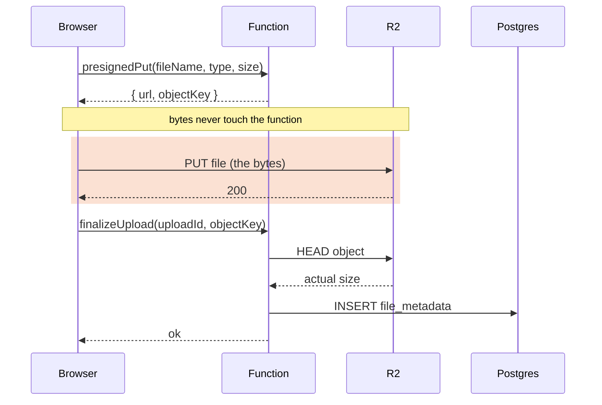

import Figure from '../../../components/figures/Figure.astro';
import AnnotatedCode from '../../../components/code/annotated-code/AnnotatedCode.astro';
import AnnotatedStep from '../../../components/code/annotated-code/AnnotatedStep.astro';
import Buckets from '../../../components/exercises/buckets/Buckets.astro';
import Bucket from '../../../components/exercises/buckets/Bucket.astro';
import Item from '../../../components/exercises/buckets/Item.astro';
import Sequence from '../../../components/exercises/sequence/Sequence.astro';
import Step from '../../../components/exercises/sequence/Step.astro';
import Term from '../../../components/ui/Term.astro';
import ExternalResource from '../../../components/ui/ExternalResource.astro';
import CourseProgressBar from '../../../components/ui/CourseProgressBar.astro';
import { CardGrid } from '@astrojs/starlight/components';
import VideoCallout from '../../../components/embeds/VideoCallout.astro';
import PresignedUrlAnatomy from '../../../components/lessons/068/3/PresignedUrlAnatomy.astro';

<CourseProgressBar value={frontmatter['course-progress']} />

The bucket exists, the token is scoped to it, and CORS allows your origin. You have an `S3Client` in `lib/r2.ts` that is fully wired but can't yet *do* anything useful, because one verb is still missing: the one that turns the split-storage architecture from a diagram into a running upload. Picture a user choosing a 40 MB PDF in the browser. How do those bytes get into R2 without ever passing through your Next.js function? And once they flow straight to the bucket, what stops a client from uploading a 2 GB file to a key you didn't authorize, or an executable to a path that ends in `.png`?

The answer to both questions is a **presigned URL**. By the end of this lesson you'll mint one for an upload (a presigned PUT) and one for a download (a presigned GET). You'll scope each one tightly to a single method, a single key, a single content type, and a short fuse measured in minutes, then hand it to a browser that has no R2 credentials of its own. You'll defend the upload size against a real R2 quirk that makes the obvious defense useless, and you'll read the two-step *sign-then-finalize* flow that writes a row to Postgres only *after* the bytes are confirmed in the bucket. The browser code that fires the upload, the `Files` gallery, and the full `file_metadata` schema all land later: the browser wiring in the next chapter, the schema in the next lesson. Here you install the mechanics and the action signatures everything else builds on.

## A presigned URL is a borrowed capability

Get this one idea straight before any SDK call, because everything else in the lesson is a variation on it. A presigned URL is an ordinary R2 object URL, naming the bucket, the object key, and an HTTP method, with a few extra query parameters bolted on. Those parameters carry an <Term definition="Keyed hash. Proves the URL was minted by the holder of the secret key and that none of the signed fields were altered: change one and the hash no longer matches.">HMAC</Term> signature computed over the bucket, the key, the method, the expiry, and any headers the function chose to pin, all signed with your function's R2 credentials. Whoever holds that URL can perform exactly that one operation, that key and that method, until it expires, with **no R2 credentials of their own**. The function mints the URL, and the client spends it.

That is the entire reason presigned URLs exist, and it solves a problem you can already feel. Your function holds the R2 secret, and the browser must never hold it: a `NEXT_PUBLIC_R2_SECRET_ACCESS_KEY` is a public write hole into your bucket, readable by anyone who opens DevTools. So the function can't hand over the secret, yet the browser is the one with the bytes. A presigned URL lets the function delegate one narrow action, "you may PUT this one object, for the next five minutes," without ever surrendering the credential that authorizes it. This is the upload-issue endpoint the course has been pointing at: the seam where the server's authority gets handed to a client as a single, expiring capability.

There are three flavors, and you'll build two of them.

- **Presigned PUT.** The browser uploads one object to the signed key. This is the course default for uploads under 100 MB, which covers almost every file a SaaS accepts.
- **Presigned GET.** Anyone holding the URL can read the object until it expires. This is the default for serving private files back to the user who owns them.
- **Presigned POST (policy-based).** An alternative upload form that carries a *policy document* the storage layer can enforce, including server-side size and content-type limits. It's worth recognizing by name, but you won't build it. PUT covers the project, and the size enforcement POST offers is something you'll replace with a verification step later in this lesson, which is why the course can skip POST.

Seeing the parameters in a real URL does more to demystify the signature than any prose. The figure below breaks one presigned PUT URL into its parts.

<Figure caption="A presigned PUT URL. The base address says which object and operation; the query parameters say how long and what's sealed.">
  <PresignedUrlAnatomy />
</Figure>

The signature isn't magic, then: it's a hash over those fields. The expiry and the pinned headers sit right there in the URL in plaintext, and what the signature adds is that it makes them *tamper-proof*. Change any sealed field and the hash no longer matches what the function signed, so R2 rejects the request. Everything that follows is just deciding which fields to seal and how tightly.

## Signing a PUT: the upload capability

Minting the PUT URL is a thin layer over the SDK at the call site. There's no clever wrapper around it, the same stance you took with `lib/r2.ts` and `lib/email.ts`, where the SDK shows in the open rather than hiding behind a homegrown abstraction. The whole thing is two calls: describe the operation as a command, then sign it.

The walkthrough below steps through the body of the signing helper. Read each step against the highlighted line.

<AnnotatedCode lang="ts" maxLines={10} code={`
const command = new PutObjectCommand({
  Bucket: env.R2_BUCKET_NAME,
  Key: objectKey,
  ContentType: contentType,
  ContentLength: claimedSize,
});
const url = await getSignedUrl(r2, command, {
  expiresIn: 300,
  signableHeaders: new Set(['content-type']),
});
`}>
  <AnnotatedStep meta="{2-3}" color="blue">
    `PutObjectCommand` describes the operation and its target: a PUT to one object.
    `Bucket` reads from the typed `env`, never raw `process.env`.
    `Key` is the tenancy-scoped path the *server* built, `org/${orgId}/files/${id}.${ext}`, never a value the client sent.
    The key is always constructed server-side, and the next lesson owns that construction.
  </AnnotatedStep>

  <AnnotatedStep meta="{4}" color="green">
    The content type is pinned into the command.
    This is the value the signature will enforce: when the browser uploads, it must send a matching `Content-Type` header or R2 rejects the request with `403 SignatureDoesNotMatch`.
    The signed type is the lock, and whatever the browser sends is the key that has to fit it.
  </AnnotatedStep>

  <AnnotatedStep meta="{5}" color="orange">
    The claimed size is signed too, and here is the trap.
    You'd reasonably expect R2 to reject an upload that exceeds it, but it won't.
    `ContentLength` rides along in the signature, yet R2 does not enforce a maximum body size from it.
    Note it now; the section after next is entirely about resolving it.
  </AnnotatedStep>

  <AnnotatedStep meta="{7-8}" color="blue">
    `getSignedUrl` takes the `r2` singleton from `lib/r2.ts`, the command, and the options, and returns a plain string: the full URL with the signature appended.
    `expiresIn: 300` is the five-minute fuse, long enough for a real upload but short enough that a leaked URL is stale almost immediately.
  </AnnotatedStep>

  <AnnotatedStep meta="{9}" color="violet">
    This forces `content-type` into the set of signed headers.
    Without it the v3 presigner won't reliably fold the content type into the signature, so the pin from step 2 wouldn't actually bind, and the browser could send any type.
    This line is what makes "the signature enforces the content type" a true statement rather than a hope.
  </AnnotatedStep>
</AnnotatedCode>

On the browser side, which you'll write in the next chapter rather than here, spending that URL is a single `fetch`:

```ts
await fetch(url, {
  method: 'PUT',
  body: file,
  headers: { 'Content-Type': file.type },
});
```

Carry one rule out of this section: **the `Content-Type` the browser sends must equal the `ContentType` that was signed, exactly.** Sign `image/png` and send `image/jpeg`, or sign `image/png` and send nothing, and R2 answers `403 SignatureDoesNotMatch`, with no body uploaded and no error you can read from the JSON. This is the most common first-upload failure, and the error message doesn't point at the cause, so name it to yourself now and you'll recognize it the moment it happens.

## Signing a GET: the read-back capability, fresh every time

Reading an object back is the same idea with less to scope. There's no body and no content type to pin, so the GET is smaller:

```ts
const url = await getSignedUrl(
  r2,
  new GetObjectCommand({ Bucket: env.R2_BUCKET_NAME, Key: objectKey }),
  { expiresIn: 600 },
);
```

Ten minutes this time, because a read can sit unviewed a little longer than an upload takes to fire. The returned string drops straight into an ``, an `<a href>`, or the body of an email, anywhere a browser will issue a GET.

One rule separates a leak-proof read path from a leaky one: **presigned GET URLs are minted fresh, per render or per request, and never persisted.** Not in a column, not in a cache that outlives the expiry, not anywhere. The row in your database stores the parts of the file that are permanent: the object key, the content type, the size, and the names. The URL is derived from those on demand, every time someone needs to look at the file. You'll meet this again in the next lesson as the rule that `getFileDownloadUrl` mints a URL per call and the `file_metadata` table has no `url` column; that's the same rule seen from the GET side.

The anti-pattern that breaks the rule feels helpful, which is why people reach for it. Picture emailing someone a download link for a file. The tempting move is a long expiry, a 24-hour link "so it works all day." Walk through the failure. That URL now lives in the email provider's logs, in the recipient's inbox history, and in every forward of the message, and for a full day anyone who comes across it can download the file with no further check. You've traded a real leak window for a small convenience. The opposite fix, a short fuse, fails just as plainly in the other direction: the recipient opens the email an hour later and the link is dead. The resolution an experienced engineer reaches for, which the CSV-export work in the next chapter builds, is to email a link to an *app route* you control, and have that route mint a fresh short-lived GET when the recipient clicks it. The email never carries the raw presigned URL. Recognize the pattern now, and you'll wire it later.

<VideoCallout videoId="V2arOZ72d6M" videoTitle="Amazon S3 Presigned URLs — Uploads and Downloads">
  Milan Jovanović walks the same PUT-and-GET signing flow on a whiteboard, then in code (15 min). The SDK here is .NET, but the request-then-sign shape and the bytes-bypass-the-server motivation are identical to ours.
</VideoCallout>

## The size defense: why the signed length isn't the boundary

This section separates following a tutorial from understanding the boundary, so slow down here. Back in the PUT walkthrough, the orange step flagged a trap: `ContentLength` is signed, but R2 doesn't enforce it. Now it's time to resolve that.

Here is the fact, stated plainly and as a real platform difference rather than a bug: **S3's presigned-POST policy supports a `content-length-range` condition that the storage layer enforces, but R2's presigned PUT does not enforce a maximum body size from the signed `ContentLength`.** A client holding a valid PUT URL can stream a terabyte to your bucket regardless of the size it claimed when it asked for the URL. So the belief "I signed `ContentLength`, therefore the upload size is safe" is simply **false on R2**. If that's your only defense, you have no defense.

The fix isn't a single better check. It's three checks in series, none of which is the boundary on its own. Think of it as defense in depth.

- **Client pre-check.** Before the browser even requests a URL, it validates `file.size`. This is *UX, not security*. It gives the user instant feedback ("that file's too big") and saves a pointless round-trip to your server. It's also trivial to bypass for anyone scripting the upload, so it is never the thing you rely on.
- **Server cap before signing.** The action checks `claimedSize` against a per-tenant or per-type maximum before it mints the URL, and refuses to issue a capability for an over-cap claim. This is *policy*: you don't hand out a URL for an upload you'd reject. But it still trusts a number the client typed, so it's not the boundary either.
- **Post-upload HEAD verify.** After the PUT completes, the finalize step issues a `HeadObjectCommand` for the key, reads the *actual* `ContentLength` R2 reports for the stored object, and compares that real number against the cap, all *before* it writes any row. **This is the boundary.** If the stored object blows past the cap, no row gets written, and the oversized object is left for a cleanup sweep to delete later.

Notice what that reordering does to the meaning of the row. The `file_metadata` row is no longer a record that a URL was issued. It is the function's **assertion that it HEAD-verified the object**, that it asked R2 how big the thing actually is and accepted the answer. That shift is the whole point, and it leads straight into the two-step write coming up next.

The same split, policy on one side and enforcement on the other, answers the other obvious attack: uploading an executable to a key that ends in `.png`. The policy half is a content-type allow-list checked *before* signing, so the function never even mints a URL for a type you don't accept:

```ts
if (!ALLOWED_TYPES.has(contentType)) {
  return err('validation', 'Unsupported file type');
}
```

The enforcement half is the signed `ContentType` from the PUT section: the `403` that fires if the browser's header doesn't match. Together they close the gap. The function won't sign the executable's real type, and even a forged key can't swap the sealed content type for something else after the fact. The allow-list is the policy, and the signature is the runtime enforcement.

Now sort the defenses yourself. The exercise below trains you to say, out loud, which check actually stops an oversize upload, and to notice that the content-type pin and the expiry, real defenses both, do nothing for *size*.

<Buckets twoCol instructions="Sort each defense by whether it actually stops a client from uploading a file bigger than your limit.">
  <Bucket name="stops" label="Stops an oversize upload" description="Load-bearing for size" />
  <Bucket name="doesnt" label="Doesn't stop it / wrong tool" description="UX, trusts the claim, or defends something else" />

  <Item bucket="stops">Post-upload `HeadObjectCommand` size compare — reads the *real* stored size from R2 and rejects before the row is written</Item>
  <Item bucket="doesnt">Client-side `file.size` check — UX feedback only, trivially bypassed by a script</Item>
  <Item bucket="doesnt">Server cap on `claimedSize` before signing — policy, but it trusts a number the client typed</Item>
  <Item bucket="doesnt">Signed `ContentLength` — R2 won't enforce a max body size from it</Item>
  <Item bucket="doesnt">Signed `ContentType` — that's the type pin, not the size</Item>
  <Item bucket="doesnt">Short `expiresIn` — that's the leak window, not the size</Item>
</Buckets>

## The two-step write: sign, upload, finalize

Now assemble the pieces. A safe direct-to-R2 upload is not one request. It's two round-trips to your function, with the actual byte transfer sandwiched between them, going straight to R2 and bypassing your function entirely.

1. **Request and sign.** The client calls a `presignedPut` action with `{ fileName, contentType, claimedSize }`. The action parses that input, authorizes the caller by role, checks the content-type allow-list and the size cap, builds the server-side `objectKey`, signs the PUT, and returns `{ url, objectKey, uploadId }`.
2. **Direct upload.** The client PUTs the file straight to R2 with the signed URL. **Your function is not in this path**, which is the bytes-never-touch-the-function rule made literal. Whether the file is 5 KB or 5 GB, your function's CPU and bandwidth are unchanged.
3. **Finalize.** On a successful PUT, the client calls a second action, `finalizeUpload`, with `{ uploadId, objectKey }`. Notice the actual size is *not* in that payload, because the server is about to read it from R2 itself rather than trust the client to report it.
4. **Verify and persist.** The finalize action HEADs the object, compares the real size against the cap, inserts the `file_metadata` row, and returns success.

The ordering rule is the thing to internalize: **the metadata row is written after the upload is confirmed, never before.** To see why, look at both ways the flow can fail and notice they are not equally bad.

If the row were written *first* and the upload then failed, through a network drop or the user closing the tab, you'd have an **orphan row**: the UI lists a file that doesn't exist, and every attempt to read it 404s on the bytes. Your database is now lying. If instead the upload succeeds but finalize never runs, you get **orphan bytes**: an object sitting in R2 with no row pointing at it. Both are messes, but they cost differently. Orphan bytes are a cheap cleanup chore, since a prefix-scoped lifecycle rule or a daily list-and-delete sweep mops them up and nothing in the app ever saw them. Orphan rows are a correctness bug, because the database asserts something false, and false database state is expensive to detect and worse to debug. That asymmetry is the point. You bias toward the cheap failure by writing the row *last*.

The action you're signing toward in the next chapter has this signature:

```ts
presignedPut(input: {
  fileName: string;
  contentType: string;
  claimedSize: number;
}): Promise<Result<{ url: string; objectKey: string; uploadId: string }>>;
```

It's wrapped in `authedAction('member', schema, fn)`, the same five-seam shape (parse, authorize, mutate, revalidate, return) you've applied to every action, and it returns the same `Result<T>`. The role and tenant boundary lives *at the action*, because R2 has no notion of who your user is or which org they belong to. `finalizeUpload` is the twin action that runs the HEAD. Its full shape is the next lesson's territory, and here you only need to know that it exists and that the HEAD happens inside it.

The sequence below makes the architecture visible. Watch two things: which arrow carries the bytes, and which message comes last.

<Figure caption="The two-step write. The only arrow carrying file bytes skips the function entirely, and the row write is the last message.">

</Figure>

To lock the ordering in, reconstruct it. The exercise below hands you the steps shuffled, and what you're proving is that the row insert is dead last and the HEAD comes right before it.

<Sequence instructions="Order the steps of a safe direct-to-R2 upload, from the client picking a file to the row landing in Postgres.">
  <Step>The client validates the file's size locally</Step>
  <Step>The client calls `presignedPut` with the file's name, type, and size</Step>
  <Step>The server checks the type allow-list and the size cap, then signs a five-minute PUT URL</Step>
  <Step>The browser PUTs the file straight to R2 with the signed URL</Step>
  <Step>The client calls `finalizeUpload`</Step>
  <Step>The server HEADs the object and compares the real size against the cap</Step>
  <Step>The server inserts the `file_metadata` row</Step>
</Sequence>

## Reading the failures in the Network tab

When you wire the browser side, the Network tab is where you'll confirm the architecture is actually doing what the diagram promises, and where you'll diagnose the two failures everyone hits first. Make checking it a reflex.

During an upload you should see two distinct requests. The `presignedPut` call carries a *tiny* JSON request, `{ fileName, contentType, claimedSize }`, and returns a *tiny* JSON response, `{ url, objectKey }`: kilobytes, not megabytes. Then a separate `PUT` fires, and its destination is `…r2.cloudflarestorage.com`, **not your own domain**. That's the byte-carrying request, and it must not touch your function. If you see the 40 MB request hitting your own server, the architecture is broken: you've built a byte pipe, exactly the thing presigned URLs exist to avoid.

Two failure signatures are worth recognizing on sight, because they point at completely different fixes:

- **`OPTIONS 200` followed by `PUT 403`.** CORS allowed the <Term definition="The browser's automatic OPTIONS request, sent before certain cross-origin requests, asking the server whether the real request is allowed.">preflight</Term>, so the rule you set up earlier is working, but R2 rejected the PUT itself. This is almost always the content-type mismatch from the PUT section: the `Content-Type` the browser sent isn't the one that was signed. Fix it at the sign/PUT pair, not in CORS.
- **The `PUT` is cancelled by the browser with a CORS error, with no `403` and no response at all.** The request never left the browser, which means the bucket's CORS rule doesn't list your origin, method, or header. Fix it in the bucket CORS configuration, not in your signing code.

That distinction is the diagnostic skill. A `403` means the request reached R2 and the signature or headers were wrong. A browser-cancelled request means CORS never let it leave the browser in the first place. The first you fix in your signing call, and the second you fix on the bucket.

## External resources

The official docs are the right deep-dive for a mechanics lesson, and the last two go past the SDK calls into the security framing and the end-to-end failure modes. All are worth a read when you wire the upload for real.

<CardGrid>
  <ExternalResource
    title="Cloudflare R2 — Presigned URLs"
    href="https://developers.cloudflare.com/r2/api/s3/presigned-urls/"
    icon="simple-icons:cloudflare"
    iconColor="#F38020"
    description="R2's own guide to presigning, including the S3-compatibility notes that matter for the signed-headers detail."
  />
  <ExternalResource
    title="@aws-sdk/s3-request-presigner"
    href="https://docs.aws.amazon.com/AWSJavaScriptSDK/v3/latest/Package/-aws-sdk-s3-request-presigner/"
    icon="simple-icons:amazonwebservices"
    iconColor="#FF9900"
    description="The getSignedUrl reference — options, signable headers, and expiry."
  />
  <ExternalResource
    title="AWS — Overview of presigned URLs"
    href="https://docs.aws.amazon.com/prescriptive-guidance/latest/presigned-url-best-practices/overview.html"
    icon="simple-icons:amazonwebservices"
    iconColor="#FF9900"
    description="The security-engineer's view — what a presigned request can and can't authorize, the expiry tradeoff, and PUT vs POST."
  />
  <ExternalResource
    title="Zuplo — S3 signed URL uploads"
    href="https://zuplo.com/docs/articles/s3-signed-url-uploads"
    icon="lucide:upload-cloud"
    iconColor="#FF00BD"
    description="End-to-end TypeScript walkthrough with the CORS, signature-mismatch, and size-limit failures spelled out."
  />
</CardGrid>
