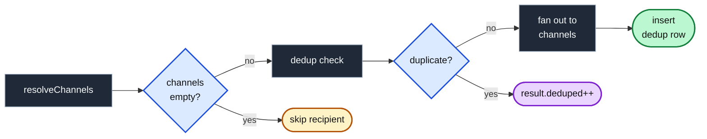

import CourseProgressBar from '../../../components/ui/CourseProgressBar.astro';
import AnnotatedCode from '../../../components/code/annotated-code/AnnotatedCode.astro';
import AnnotatedStep from '../../../components/code/annotated-code/AnnotatedStep.astro';
import DiagramSequence from '../../../components/figures/diagram-sequence/DiagramSequence.astro';
import DiagramStep from '../../../components/figures/diagram-sequence/DiagramStep.astro';
import BurstWalkthrough from '../../../components/lessons/070/4/BurstWalkthrough.astro';
import TwoLayersContrast from '../../../components/lessons/070/4/TwoLayersContrast.astro';
import Figure from '../../../components/figures/Figure.astro';
import StateMachineWalker from '../../../components/figures/state-machine-walker/StateMachineWalker.astro';
import Question from '../../../components/figures/state-machine-walker/Question.astro';
import Branch from '../../../components/figures/state-machine-walker/Branch.astro';
import Leaf from '../../../components/figures/state-machine-walker/Leaf.astro';
import MultipleChoice from '../../../components/exercises/multiple-choice/MultipleChoice.astro';
import McqChoice from '../../../components/exercises/multiple-choice/McqChoice.astro';
import McqWhy from '../../../components/exercises/multiple-choice/McqWhy.astro';
import Sequence from '../../../components/exercises/sequence/Sequence.astro';
import Step from '../../../components/exercises/sequence/Step.astro';
import DrizzleCoding from '../../../components/live-coding/DrizzleCoding/DrizzleCoding.astro';
import Term from '../../../components/ui/Term.astro';
import ExternalResource from '../../../components/ui/ExternalResource.astro';
import VideoCallout from '../../../components/embeds/VideoCallout.astro';
import { CardGrid } from '@astrojs/starlight/components';

<CourseProgressBar value={frontmatter['course-progress']} />

A user clicks "Resend invitation," nothing visibly happens for half a second, so they click it again. And again. Five clicks in two seconds. Or a payment webhook times out mid-process and the provider redelivers it three times. Or two admins, in the same Slack thread, both hit "Demote to member" on the same person at the same moment. Each of these is the dispatcher being asked to fire the *same notification* more than once in a very short span — and right now, it would. Five clicks become five emails and five inbox rows. The user is annoyed, their inbox is cluttered, and every redundant email is a small ding to your sender reputation that the mailbox providers are watching.

You have already built almost everything needed to stop this. The dispatcher resolves channels, respects each recipient's preferences, and fans out to email and the inbox. But it still fires once per call — it has no memory of what it just sent. Back when you defined the dispatcher's contract, you declared a result shape with three counters: `{ sent, deduped, suppressedByPrefs }`. Two of them are now real — the channel fan-out fills `sent`, the preference resolution fills `suppressedByPrefs`. The third, `deduped`, has been sitting at zero through two lessons, a promise the dispatcher makes but never keeps. This lesson makes it real, and it does so with one small mechanic: before firing for a recipient, ask whether you already sent this exact thing to this exact person in the last minute. Three moving parts carry the whole idea — a *window* (how long is "recently"), a *key* (what counts as "this exact thing"), and a *place* (where you record what you fired). That is the last brick in the dispatcher.

## A 60-second window catches the burst

The mechanic is a short-term memory. You keep a dedicated table — call it `notification_dedup` — and every time the dispatcher fires for a recipient, it records a row there: this event, this key, this person, fired at this instant. Before it fires the *next* time, it checks that table for a matching row stamped within the last 60 seconds. If one exists, the dispatcher skips the send and counts a <Term definition="Deduplication. Dropping a repeat so the same thing is not delivered to the same person twice.">dedup</Term>. If none exists, it fires and writes a fresh row. That is the entire loop: check, and either skip-and-count or send-and-record.

Why 60 seconds? Because that window comfortably covers the *tight* bursts and nothing wider. Rage-clicks land sub-second. A double form submit, two near-simultaneous admin actions, a fast in-process retry — all of these collapse into a span far shorter than a minute. Push the window out to ten minutes and you start dropping notifications the user genuinely wants: someone who re-invites a colleague after a real conversation half an hour later should get a fresh email, not silence. Pull it in to five seconds and slower bursts leak through. Sixty seconds is the default that handles the overwhelming majority of cases without swallowing legitimate repeats — so it is what a new event type gets unless you have a reason to change it.

It is tempting to reach for a bigger number to also catch provider webhook retries — but that is the wrong instinct, and seeing why sharpens the whole design. Real provider retries are spaced *much* wider than a minute. Stripe's first retry is around five minutes out, then thirty minutes, then two hours, escalating over three days. A 60-second window will never span those, and it is not supposed to. Widely-spaced redeliveries are caught one layer earlier — at the webhook handler, by the `processed_events` ledger you built for idempotency — so that a replayed event produces no second state change and therefore fires no second notification *from the database* at all. The dispatcher's window owns a different problem: tight bursts and concurrent firings that the handler never sees. We will come back to how these two layers compose; for now, the takeaway is that 60 seconds is sized for clicks and races, not for retries.

The window is not always 60 seconds, though — and the right place to vary it is the registry, not a global constant. High-frequency event types like comments or mentions (if and when they ship) want a longer window, because their bursts are noisier and slower. The registry already owns per-event configuration — channels, template, preference category — so the dedup window is just one more field on the entry. Here is the `dedup` block on the invitation event:

<div data-mark-color="green">

```ts title="src/lib/notifications/registry.ts" {5}
export const notifiableEvents = {
  'org.invitation.sent': {
    channels: ['email', 'inbox'],
    template: invitationEmail,
    dedup: { windowSeconds: 60, keyBy: ['subjectId'] },
    preferenceCategory: 'team',
    description: 'Someone was invited to your organization',
  },
  // …other events
} as const satisfies Record<string, NotifiableEvent>;
```

</div>

One watch-out before we move on, and it is a quiet one. Never size the window to *match* the cadence of whatever retries it must absorb. If a cron job retries every 60 seconds and your window is also 60 seconds, a retry lands right on the boundary — sometimes inside the window, sometimes a hair outside, depending on millisecond timing — and you get nondeterministic duplicates that are miserable to debug. The reflex is to pick a window comfortably *larger* than the longest interval it needs to swallow, never equal to it.

## The key decides what counts as the same thing

The window tells you *how recently*. The key tells you *what counts as the same notification* — and this is the single most failure-prone decision in the whole mechanic. Get the key wrong and the window is irrelevant: either nothing ever dedupes, or things that should stay separate get collapsed.

The dedup row is identified by a <Term definition="A database key spanning multiple columns. A row is considered the same on the combination of all of them, not on any single one.">composite key</Term> of three parts: `(eventType, dedupKey, recipientUserId)`. Walk each one, because each is there for a reason:

- **`eventType`** is the obvious first cut. A role change and an invitation are never duplicates of each other, even for the same person at the same instant.
- **`dedupKey`** is the per-event discriminator, and it is the interesting part. The registry's `dedup.keyBy` is an array of payload or subject field names, and the dispatcher reads those fields to build the key string. *What* fields go in `keyBy` encodes the business meaning of "duplicate" for that event — and that meaning is different from event to event, which is exactly why it lives in the registry instead of being hardcoded.
- **`recipientUserId`** makes dedup *per person*. The same event reaching two different people is not a duplicate — each recipient has their own independent window. A role change might notify the demoted member and, separately, surface to an admin; those two don't collide, because the recipient is part of the key.

Two examples make the `keyBy` choice concrete. For `'org.invitation.sent'`, the key is just `['subjectId']` — the invitation's id. Resending the *same* invitation five times dedupes to one, because all five share a subject id. For `'org.member.role_changed'`, the key is `['subjectId', 'newRole']` — the member's id *and* the role they were changed to. A frantic demote-then-promote-then-demote within a minute produces one notification *per distinct transition*, not one notification total, because each transition has a different `newRole`. The key captures the uniqueness the business cares about, no more and no less.

<AnnotatedCode lang="ts" code={`
const notifiableEvents = {
  'org.invitation.sent': {
    // …channels, template, preferenceCategory, description
    dedup: { windowSeconds: 60, keyBy: ['subjectId'] },
  },
  'org.member.role_changed': {
    // …channels, template, preferenceCategory, description
    dedup: { windowSeconds: 60, keyBy: ['subjectId', 'newRole'] },
  },
} as const satisfies Record<string, NotifiableEvent>;
`}>
  <AnnotatedStep meta="{4}" color="green">
    The invitation's `keyBy: ['subjectId']` — one field suffices, because the invitation id alone fully identifies the thing. Two sends of the *same* invitation share a subject id, so they dedupe; two different invitations carry different ids, so they stay separate.
  </AnnotatedStep>

  <AnnotatedStep meta="{8}" color="green">
    The role change's `keyBy: ['subjectId', 'newRole']`. The member id alone would collapse every role change for that member into one. Adding `newRole` makes each *distinct transition* its own notification — a demote and the following promote are not duplicates of each other.
  </AnnotatedStep>

  <AnnotatedStep meta={`{4,8} "['subjectId']" "['subjectId', 'newRole']"`} color="green">
    Both keys are missing a third, invisible dimension: `recipientUserId`. The dispatcher adds it at check time, not in the registry, because dedup is always per-recipient. The registry decides what makes an event the same; the dispatcher scopes that sameness to a single person.
  </AnnotatedStep>
</AnnotatedCode>

This is where beginners break dedup, and the two failure modes are mirror images of each other.

A key that is **too narrow** folds in something that changes on every firing — a timestamp, a request id, a random nonce. Now every event is unique, no two rows ever match, and dedup silently does nothing. The system looks fine; it just never fires. The diagnostic is a dedup rate that sits flat at zero even when you know bursts are happening.

A key that is **too broad** does the opposite. A key of only `eventType` collapses unrelated events that happen to share a type — two different invitations to two different colleagues dedupe into one, and one of them silently never arrives. The diagnostic here is legitimate, distinct notifications going missing. The fix is almost always the same: put the *subject* in the key, so different subjects stay different.

Closely related is what happens on a burst: "first one wins." On five rapid clicks, the first firing writes the inbox row and sends the email; the next four match that row and are dropped. The payload the user sees is the first event's payload. Usually the bursting events are identical, so this doesn't matter. But if they differ and the *wrong* one wins, that is not a bug to panic over — it is a signal that your dedup key is too broad. It should have distinguished those events into separate notifications in the first place. Read it as a diagnostic, and widen the key's *specificity* (add the discriminating field), not the window.

Try this to lock in the key intuition. An app fires a `'comment.created'` event and wants to drop rapid duplicate notifications when the same comment is delivered twice, while still notifying on genuinely new comments.

<MultipleChoice>
  Which `dedup.keyBy` drops the repeat delivery of the *same* comment yet still lets a genuinely new comment notify?

  <McqChoice>`['createdAt']`</McqChoice>
  <McqChoice>`['eventType']`</McqChoice>
  <McqChoice correct>`['subjectId']`</McqChoice>
  <McqChoice>`['subjectId', 'createdAt']`</McqChoice>

  <McqWhy>The comment id (`subjectId`) is stable across redeliveries of one comment and distinct between different comments, so it dedupes the repeat and keeps new comments separate. `['createdAt']` is too narrow — the timestamp shifts on every delivery, so no two firings ever match and nothing dedupes. `['eventType']` is too broad — every comment collapses into one, so real new comments go missing. `['subjectId', 'createdAt']` re-introduces the too-narrow trap: the id alone would have worked, but folding in the timestamp makes each firing unique again. The rule: specific enough to keep different subjects apart, but never including anything that varies between redeliveries of the same subject.</McqWhy>
</MultipleChoice>

## Where the check sits in the dispatcher

Knowing the window and the key, the only question left is *where* the check goes — and the answer is one precise slot in the per-recipient loop you already built. The dispatcher's flow, start to finish, is short: look the event up in the registry, batch-read every recipient's preferences, then for each recipient resolve their channels, run the dedup check, fan out to the channels, and record the dedup row. Two of those orderings are decisions worth defending.

**Preferences come before dedup.** A recipient who has muted this category resolves to an empty channel list — there is nothing to send them, so there is nothing to dedup. If you checked dedup *first* and wrote a row for them anyway, you would poison two things at once: the `deduped` count fills with phantom skips for people who never received anything, and a later, genuinely-wanted notification could match that phantom row and get wrongly dropped. So resolve channels first; if the list is empty, skip the recipient entirely before the dedup table is ever touched.

**Dedup comes before fan-out.** The entire point of the check is to *not send*. So you check, and on a hit you skip the inner channel loop and increment `result.deduped`. The dedup row insert goes *after* a successful fan-out — it records "this event, this key, this person was actually delivered," which is precisely what the next check is looking for.

This is also the continuity moment. When the dispatcher's contract was first declared, it promised a `DispatchResult` with three counters. The channel fan-out filled `sent`. The preference resolution filled `suppressedByPrefs`. This `result.deduped++` fills the third and last one. After this lesson, every counter the dispatcher promised is real — the contract is whole.

Walk the burst through the machine one click at a time:

<DiagramSequence>
  <DiagramStep caption="Click 1: the dedup check finds no matching row, so it fires — both channels fan out, and a row is written stamped T0. First one wins.">
    <BurstWalkthrough step={1} />
  </DiagramStep>

  <DiagramStep caption="Click 2, 0.3s later: a matching row already exists inside the 60-second window, so the fan-out is skipped and result.deduped ticks to 1.">
    <BurstWalkthrough step={2} />
  </DiagramStep>

  <DiagramStep caption="Clicks 3 and 4: same story. Each matches the same row and is dropped — the burst is being absorbed and deduped climbs to 3.">
    <BurstWalkthrough step={3} />
  </DiagramStep>

  <DiagramStep caption="Click 5: skipped like the rest. One delivery, four dedups — and the table still holds exactly the one row that absorbed them all.">
    <BurstWalkthrough step={4} />
  </DiagramStep>

  <DiagramStep>
    <BurstWalkthrough step={5} />
    <Fragment slot="caption">
      The result the contract promised, now real: one email queued, one inbox row, four duplicates dropped — `{ sent: 1, deduped: 4, suppressedByPrefs: 0 }`. The `deduped` counter L1 declared and L2–L3 left at zero is finally filled.
    </Fragment>
  </DiagramStep>
</DiagramSequence>

The sequence shows the burst over time; the next figure pins the *placement* statically — exactly where in the per-recipient loop each check sits, and which branch leads where.

<Figure caption="Inside the per-recipient loop: preferences gate first, then dedup, then the send — and the dedup row is written only after a real delivery.">

</Figure>

In code, the change is genuinely small — a check and a counter bump dropped into the loop you already own. Here is the per-recipient loop with the dedup lines inserted:

<AnnotatedCode lang="ts" code={`
for (const userId of recipientUserIds) {
  const channels = resolveChannels(event, prefsByUser.get(userId));
  result.suppressedByPrefs += event.channels.length - channels.length;
  if (channels.length === 0) continue;

  if (await isDuplicate({ event, userId, payload })) {
    result.deduped++;
    continue;
  }
  for (const channel of channels) {
    await runChannel(channel, { recipient: { userId }, event, payload, rendered });
  }
  result.sent++;
  await recordDedup({ event, userId, payload });
}
`}>
  <AnnotatedStep meta="{2-4}">
    Resolving this recipient's channels and tallying what their preferences suppressed is straight from last lesson. The empty-skip guard on line 4 is the new companion to the dedup ordering: skipping the recipient when nothing is left is exactly what keeps dedup rows from being written for people who receive nothing.
  </AnnotatedStep>

  <AnnotatedStep meta="{6-9}" color="green">
    The new dedup check. `isDuplicate` returns a plain boolean; on a hit, increment `result.deduped` and `continue` to the next recipient without sending. This is the line that finally fills the third counter.
  </AnnotatedStep>

  <AnnotatedStep meta="{10-13}">
    The fan-out, unchanged from last lesson: loop the resolved channels, run each through the `runChannel` wrapper, then count one `sent`.
  </AnnotatedStep>

  <AnnotatedStep meta="{14}" color="green">
    Record the dedup row *after* a successful fan-out, so the next firing inside the window can find it. Recording before sending would leave rows for sends that might still fail.
  </AnnotatedStep>
</AnnotatedCode>

The two helpers — `isDuplicate` and `recordDedup` — are thin wrappers in `lib/notifications/`. `isDuplicate` reads the registry entry to learn the window and `keyBy`, builds the key from the payload, and runs a single existence query against `notification_dedup`; `recordDedup` inserts one row. Each takes an options object (the event, the recipient, the payload) so it stays under the two-positional-argument line, and both start with `import 'server-only'`. Note `isDuplicate` returns a bare `boolean`, not a `Result<T>` — this is internal bookkeeping with one obvious answer, the same plain-result divergence the dispatcher itself follows, not a user-facing operation that can fail in meaningful ways.

Order matters enough to drill it. Put the per-recipient steps in the order the dispatcher runs them:

<Sequence instructions="Order the steps the dispatcher runs for a single recipient.">
  <Step>`resolveChannels` — read this recipient's enabled channels</Step>
  <Step>Skip the recipient if no channels are enabled</Step>
  <Step>Dedup check — has this exact thing fired for them in the window?</Step>
  <Step>Fan out to the enabled channels</Step>
  <Step>Insert the dedup row recording the delivery</Step>
</Sequence>

## The notification_dedup table

The mechanic leans entirely on one small table and one index. Both follow the same conventions as the tables you have already built in this chapter — a UUIDv7 primary key, snake-case columns mapped from the client, an explicit foreign key, an explicitly-named index — so there is nothing exotic here, only one detail worth flagging.

That detail: there is no `orgId` column. Dedup is keyed on the recipient and the event identity, not on the tenant — the same user-scoped reasoning the preferences table uses. The "lead composite indexes with the tenant column" rule applies to tenant-scoped *data*, the rows users query and admins audit. This table is internal bookkeeping that the dispatcher reads and a cleanup job prunes; no user ever queries it by org. So it stays user-scoped, and the index leads with the columns the check actually filters on.

<AnnotatedCode lang="ts" code={`
export const notificationDedup = pgTable(
  'notification_dedup',
  {
    id: uuid().primaryKey().$defaultFn(() => uuidv7()),
    eventType: text().notNull(),
    dedupKey: text().notNull(),
    recipientUserId: text()
      .notNull()
      .references(() => user.id, { onDelete: 'cascade' }),
    firedAt: timestamp({ withTimezone: true }).notNull().defaultNow(),
  },
  (t) => [
    index('idx_notification_dedup_lookup').on(
      t.eventType,
      t.dedupKey,
      t.recipientUserId,
      t.firedAt.desc(),
    ),
  ],
);
`}>
  <AnnotatedStep meta="{4-9}" color="blue">
    The three key columns plus the `recipientUserId` foreign key — together the composite key the check filters on. `recipientUserId` is `text`, not `uuid`, to match Better Auth's `user.id` (a FK always matches the type of the column it references), with a cascade delete so a removed user's bookkeeping rows go with them.
  </AnnotatedStep>

  <AnnotatedStep meta="{10}" color="blue">
    `firedAt` is a `timestamptz` defaulting to `now()` — the stamp the window compares against. This is the column the "within the last 60 seconds" predicate ranges over.
  </AnnotatedStep>

  <AnnotatedStep meta="{12-18}" color="blue">
    The index. Its column order matches the check exactly — equality on the three key columns, then `firedAt` descending for the range. The explicit name follows the index-naming convention. Shipping the index *with* the table turns the dedup check into one fast indexed read instead of a scan of a table that grows on every send.
  </AnnotatedStep>
</AnnotatedCode>

The index is not optional, and the reason is worth saying plainly: the dedup check runs on *every* dispatch, and the table grows by a row on every delivery. Without an index that matches the check's filter, each check degrades into a linear scan of an ever-larger table — you would be making the dispatcher slower the more it works. With the index, the check is the existence query below, which Postgres answers from the index in roughly constant time:

```sql
select 1 from notification_dedup
where event_type = $1 and dedup_key = $2 and recipient_user_id = $3
  and fired_at > now() - interval '60 seconds'
limit 1;
```

Existence is all that matters — `limit 1`, no columns to read back, just "is there a matching recent row, yes or no." In the Drizzle helper this is the one place a `sql\`\`` tagged-template fragment appears, for the `fired_at > now() - interval` range with the window value parameterized in; the rest of the query is ordinary Drizzle operators.

One thing the table needs that this chapter does not build: pruning. Left alone, `notification_dedup` grows one row per delivered notification, forever. The window only ever looks back 60 seconds (or whatever the longest configured window is), so any row older than that plus a small buffer is dead weight. A nightly background job — the kind you reach for with a tool like Trigger.dev — runs a single indexed `delete where fired_at < now() - (longest window + buffer)` and keeps the table small. Two rules around it: it runs on a schedule, not in the request path — never prune inline, because that bolts cleanup latency onto a user's action — and it is genuinely deferred here. You name it, you size the delete, you don't build it in this lesson.

Prove the window does its job. The exercise below seeds `notification_dedup` with two rows — one for the invitation `inv_123` to `user_a` fired about five seconds ago, and one for a *different* key fired about ten minutes ago. Finish the existence check so it returns the recent matching row and *excludes* the ten-minute-old one. Watch the time predicate do the work.

<DrizzleCoding
  instructions="Finish the dedup check: return whether a matching row exists for ('org.invitation.sent', 'inv_123', 'user_a') fired within the last 60 seconds. The recent row should survive; the ten-minute-old row must fall outside the window."
  schema={`export const notificationDedup = pgTable('notification_dedup', {
  id: text('id').primaryKey(),
  eventType: text('event_type').notNull(),
  dedupKey: text('dedup_key').notNull(),
  recipientUserId: text('recipient_user_id').notNull(),
  firedAt: timestamp('fired_at', { withTimezone: true }).notNull(),
}, (t) => [
  index('idx_notification_dedup_lookup').on(
    t.eventType, t.dedupKey, t.recipientUserId, t.firedAt.desc(),
  ),
]);`}
  seed={`INSERT INTO notification_dedup (id, event_type, dedup_key, recipient_user_id, fired_at) VALUES
  ('d1', 'org.invitation.sent', 'inv_123', 'user_a', now() - interval '5 seconds'),
  ('d2', 'org.invitation.sent', 'inv_999', 'user_a', now() - interval '10 minutes');`}
  starter={`return await db
  .select({ id: notificationDedup.id })
  .from(notificationDedup)
  .where(
    and(
      eq(notificationDedup.eventType, 'org.invitation.sent'),
      eq(notificationDedup.dedupKey, 'inv_123'),
      eq(notificationDedup.recipientUserId, 'user_a'),
      // finish: only rows fired within the last 60 seconds
    ),
  )
  .limit(1);`}
  expectedRows={[{ id: 'd1' }]}
  ordered={false}
/>

## Dedup is not coalesce

There is a neighbouring technique that is easy to confuse with dedup, and keeping them straight stops you from over-building. Dedup *drops* the duplicate outright — everything above. <Term definition="Collapsing several distinct-but-related events into a single summarized notification rather than dropping any.">Coalesce</Term> does something different: it *collapses a burst of distinct events into one summary*. "Jane commented 5 times on Invoice #42" is coalesce — five real, different comments, rolled into a single notification so the inbox isn't flooded. That is a different shape with a different data model (you collect the events into a pending bucket and flush it on a timer or a count threshold) and a different feel for the user.

The decision rule is about what the repeats *are*. Reach for dedup when the repeats are *the same event* the user should see exactly once — a resent invitation, a retried webhook, a double-clicked button. Reach for coalesce when the repeats are *distinct but noisy* — a flurry of separate comments, a burst of individual mentions — that the user would rather see summarized than one-by-one. Dedup says "you already know this." Coalesce says "here's the gist of a lot of small things."

This dispatcher ships dedup only. Coalesce earns its weight the day noisy event types like comments or mentions arrive and the inbox starts to feel like spam — and not a moment before. It is the canonical next step, the mechanism is a sentence (bucket the events, flush on a timer), and building it now would be solving a problem you don't yet have. Walk the decision once so the *order of the questions* sticks:

<StateMachineWalker kind="decision" title="Drop, send each, or summarize?">
  <Question
    id="sameness"
    prompt="Are the repeats the same logical event, or distinct events?"
    description="Start here. Sameness is the first cut — it decides whether you are looking at duplicates at all."
  >
    <Branch
      label="The same event"
      to="drop"
      rationale="A resent invitation, a retried webhook, a double-clicked button."
    />
    <Branch
      label="Distinct events"
      to="worth"
      rationale="Different things that happen to arrive close together."
    />
  </Question>

  <Question
    id="worth"
    prompt="Is each distinct event worth its own notification, or noise in aggregate?"
    description="They are not duplicates — so the question becomes how the user wants to receive them."
  >
    <Branch
      label="Each worth its own"
      to="send-each"
      rationale="Individually meaningful — the recipient wants every one."
    />
    <Branch
      label="Noise in aggregate"
      to="summarize"
      rationale="A flurry the user would rather see rolled up than one-by-one."
    />
  </Question>

  <Leaf id="drop" verdict="Drop them — dedup">
    The same logical event should reach the user exactly once. The 60-second window keyed on the subject does exactly this — first one wins, the rest are dropped and counted in `deduped`. **This is what the dispatcher ships in v1.**
  </Leaf>

  <Leaf id="send-each" verdict="Send each — no dedup">
    Genuinely distinct, individually meaningful events are not duplicates. Let them through untouched — the recipient wants every one, and dedup would silently swallow real notifications.
  </Leaf>

  <Leaf id="summarize" verdict="Summarize them — coalesce (deferred)">
    Distinct but noisy events belong in one rolled-up notification — "Jane commented 5 times on Invoice #42." Collect them into a pending bucket and flush on a timer or a count threshold. *Deferred* until noisy event types like comments or mentions ship.
  </Leaf>
</StateMachineWalker>

## Webhook idempotency and dispatcher dedup are different layers

It is natural to wonder whether the webhook idempotency you already built makes this dispatcher dedup redundant. It does not — and the cleanest way to hold both in your head is to see that they guard *different things* at *different boundaries*.

<Term definition="An operation that, repeated, has the same effect as running it once. Re-delivering the same request produces no additional change.">Idempotency</Term> at the webhook handler stops *state* churn. When a provider redelivers the same event — same `event.id`, replayed — the `processed_events` ledger recognizes it as already-handled and produces no second state transition. No second row is updated, no second status flips, and so no second event fires *from the database* at all. The ledger is keyed on the provider and the event id, and it lives at the edge.

But the ledger can only catch *re-deliveries of the same event id*. Two things slip past it. The same logical event might arrive under two *different* event ids — providers occasionally do this. Or the same real-world action might arrive by two paths at once — a webhook *and* a direct user action firing the same `dispatch()`. In both cases the ledger sees two distinct events and lets both through; what stops the *notification* from doubling is the dispatcher's dedup window, checking whether this exact notification already went to this exact person. That is a different layer, watching a different kind of duplicate.

So the two compose, and a thoughtful engineer reaches for both: webhook idempotency prevents redundant state writes at the edge, dispatcher dedup prevents redundant notifications at the seam. Neither makes the other unnecessary.

<VideoCallout videoId="m6DtqSb1BDM" videoTitle="Build a robust Payments service using Idempotency Keys">
  Arpit Bhayani walks the payment-retry case end to end (~16 min) — why a redelivered request double-charges and how an idempotency key, the edge-layer cousin of this lesson's dedup window, stops it.
</VideoCallout>

<Figure caption="Two layers, two duplicates: the ledger at the edge guards state, the dedup window at the dispatcher guards notifications.">
  <TwoLayersContrast />
</Figure>

## Watching the dedup rate

One last habit before the dispatcher is done: watch the counter you just filled. `DispatchResult` already reports `{ sent, deduped, suppressedByPrefs }` on every call, and a structured logger captures those counts per dispatch — one line you can query later.

```ts
logger.info({ seam: 'notifications.dispatch', ...result });
```

The signal is in the *shape* of the dedup rate, not its presence. A steady, low dedup rate is the system working exactly as designed — the occasional double-click absorbed, a stray retry caught. A sudden *spike* is the interesting one: it means a call site is firing duplicates that should not exist — a re-render firing the same action twice, or a loop calling `dispatch` once per row instead of once per batch. The trap is to see "dedup is happening" and conclude the system is healthy; the bug hides in the delta. Alert on the *change* in the rate, not on the floor. The dashboard that surfaces this belongs to the observability work later in the course; the point here is simply that the counter this lesson filled is also a health metric.

And with that, the dispatcher is complete. You named the seam and its contract, you built the two channels, you resolved preferences once in one place, and now you dedup the rapid duplicates — every counter the contract declared is real, the seam done across four lessons. Next, you wire this finished `dispatch()` into three real call sites and watch a single event fan out across email and the inbox for the first time.

## External resources

The two ideas under this lesson — dedup and idempotency — are the same insight at two layers, and the distributed-systems literature is where that insight is sharpest.

<CardGrid>
  <ExternalResource
    title="You Cannot Have Exactly-Once Delivery"
    href="https://bravenewgeek.com/you-cannot-have-exactly-once-delivery/"
    icon="lucide:infinity"
    iconColor="#6366F1"
    description="Tyler Treat's classic on why exactly-once is impossible — and why idempotency plus dedup is the real answer."
  />
  <ExternalResource
    title="Designing robust and predictable APIs with idempotency"
    href="https://stripe.com/blog/idempotency"
    icon="simple-icons:stripe"
    iconColor="#635BFF"
    description="Stripe's engineering write-up on idempotency keys, retries, and reaching effectively-once delivery."
  />
  <ExternalResource
    title="Stripe API — Idempotent requests"
    href="https://docs.stripe.com/api/idempotent_requests"
    icon="simple-icons:stripe"
    iconColor="#635BFF"
    description="The concrete contract: how a client-supplied key makes a POST safe to retry, and how long keys live."
  />
</CardGrid>
