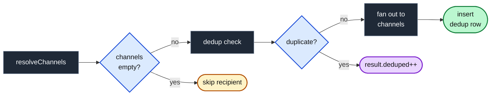

import CourseProgressBar from '../../../components/ui/CourseProgressBar.astro';
import AnnotatedCode from '../../../components/code/annotated-code/AnnotatedCode.astro';
import AnnotatedStep from '../../../components/code/annotated-code/AnnotatedStep.astro';
import DiagramSequence from '../../../components/figures/diagram-sequence/DiagramSequence.astro';
import DiagramStep from '../../../components/figures/diagram-sequence/DiagramStep.astro';
import BurstWalkthrough from '../../../components/lessons/070/4/BurstWalkthrough.astro';
import TwoLayersContrast from '../../../components/lessons/070/4/TwoLayersContrast.astro';
import Figure from '../../../components/figures/Figure.astro';
import StateMachineWalker from '../../../components/figures/state-machine-walker/StateMachineWalker.astro';
import Question from '../../../components/figures/state-machine-walker/Question.astro';
import Branch from '../../../components/figures/state-machine-walker/Branch.astro';
import Leaf from '../../../components/figures/state-machine-walker/Leaf.astro';
import MultipleChoice from '../../../components/exercises/multiple-choice/MultipleChoice.astro';
import McqChoice from '../../../components/exercises/multiple-choice/McqChoice.astro';
import McqWhy from '../../../components/exercises/multiple-choice/McqWhy.astro';
import Sequence from '../../../components/exercises/sequence/Sequence.astro';
import Step from '../../../components/exercises/sequence/Step.astro';
import DrizzleCoding from '../../../components/live-coding/DrizzleCoding/DrizzleCoding.astro';
import Term from '../../../components/ui/Term.astro';
import ExternalResource from '../../../components/ui/ExternalResource.astro';
import VideoCallout from '../../../components/embeds/VideoCallout.astro';
import { CardGrid } from '@astrojs/starlight/components';

<CourseProgressBar value={frontmatter['course-progress']} />

A user clicks "Resend invitation," sees nothing happen for half a second, and clicks again, and again: five clicks in two seconds.
A payment webhook times out mid-process and the provider redelivers it three times.
Two admins hit "Demote to member" on the same person at the same moment.
Each case asks the dispatcher to fire the *same notification* more than once in a short span, and right now it obliges, turning five clicks into five emails and five inbox rows.
Every redundant email also chips away at the sender reputation mailbox providers track.

The dispatcher resolves channels, respects preferences, and fans out to email and the inbox, but it fires once per call with no memory of what it just sent.
Its result shape declared three counters, `{ sent, deduped, suppressedByPrefs }`; the fan-out fills `sent` and preference resolution fills `suppressedByPrefs`, but `deduped` has stayed zero.
This lesson fills it: before firing for a recipient, ask whether you already sent this exact thing to this exact person in the last minute.
Three parts carry the idea, a *window* (how long counts as recent), a *key* (what counts as the same thing), and a *place* (where you record what fired).

## Sizing the dedup window

The mechanic is a short-term memory.
Keep a dedicated table, `notification_dedup`, and every time the dispatcher fires for a recipient, record a row: this event, this key, this person, this instant.
Before firing again, check for a matching row stamped within the last 60 seconds.
If one exists, skip the send and count a <Term definition="Deduplication. Dropping a repeat so the same thing is not delivered to the same person twice.">dedup</Term>; if none does, fire and write a fresh row.

Why 60 seconds?
It covers the tight bursts and nothing wider.
Rage-clicks land sub-second; a double form submit, two near-simultaneous admin actions, and a fast in-process retry all collapse into a span far shorter than a minute.
Widen the window to ten minutes and you drop notifications the user wants: someone who re-invites a colleague after a real conversation half an hour later should get a fresh email, not silence.
Narrow it to five seconds and slower bursts leak through.
Sixty seconds handles the overwhelming majority of cases without swallowing legitimate repeats, so a new event type gets it by default.

A bigger window will not catch provider webhook retries, and it should not try: those are spaced far wider than a minute.
Stripe's first retry is around five minutes out, then thirty, then two hours, escalating over three days.
Widely-spaced redeliveries are caught one layer earlier, at the webhook handler, by the `processed_events` ledger you built for idempotency: a replayed event produces no second state change, so it fires no second notification.
The dispatcher's window owns the other problem, the tight bursts and concurrent firings the handler never sees.

The window is configurable per event, and it belongs in the registry, not a global constant.
High-frequency event types like comments or mentions want a longer window, because their bursts are noisier and slower.
The registry already owns per-event configuration: channels, template, and preference category.
The dedup window is one more field on the entry, here on the invitation event:

<div data-mark-color="green">

```ts title="src/lib/notifications/registry.ts" {5}
export const notifiableEvents = {
  'org.invitation.sent': {
    channels: ['email', 'inbox'],
    template: invitationEmail,
    dedup: { windowSeconds: 60, keyBy: ['subjectId'] },
    preferenceCategory: 'team',
    description: 'Someone was invited to your organization',
  },
  // …other events
} as const satisfies Record<string, NotifiableEvent>;
```

</div>

One rule when you size it: never match the window to the cadence of the retries it must absorb.
If a cron job retries every 60 seconds and your window is also 60 seconds, a retry lands right on the boundary, sometimes inside and sometimes a hair outside depending on millisecond timing, and you get nondeterministic duplicates that are hard to debug.
Pick a window comfortably larger than the longest interval it needs to swallow.

## The key decides what counts as a duplicate

The window tells you *how recently*.
The key tells you *what counts as the same notification*, and it is where dedup most often goes wrong: either nothing ever dedupes, or things that should stay separate get collapsed.

The dedup row is identified by a <Term definition="A database key spanning several columns. Two rows count as the same only when they match on the whole combination, not on any one column.">composite key</Term> of three parts: `(eventType, dedupKey, recipientUserId)`.
Each earns its place:

- **`eventType`** is the obvious first cut. A role change and an invitation are never duplicates of each other, even for the same person at the same instant.
- **`dedupKey`** is the per-event discriminator. The registry's `dedup.keyBy` lists payload or subject field names, and the dispatcher reads those fields to build the key string. The fields you choose encode what "duplicate" means for that event, and that meaning differs from event to event, which is why it lives in the registry rather than being hardcoded.
- **`recipientUserId`** makes dedup *per person*: each recipient has an independent window. A role change might notify the demoted member and also surface to an admin, and those two don't collide because the recipient is part of the key.

The two examples below make the `keyBy` choice concrete: an invitation keyed on its id alone, and a role change keyed on the member *and* the new role.

<AnnotatedCode lang="ts" code={`
const notifiableEvents = {
  'org.invitation.sent': {
    // …channels, template, preferenceCategory, description
    dedup: { windowSeconds: 60, keyBy: ['subjectId'] },
  },
  'org.member.role_changed': {
    // …channels, template, preferenceCategory, description
    dedup: { windowSeconds: 60, keyBy: ['subjectId', 'newRole'] },
  },
} as const satisfies Record<string, NotifiableEvent>;
`}>
  <AnnotatedStep meta="{4}" color="green">
    The invitation's `keyBy: ['subjectId']`. The invitation id alone identifies the thing: two sends of the *same* invitation share a subject id and dedupe, while two different invitations carry different ids and stay separate.
  </AnnotatedStep>

  <AnnotatedStep meta="{8}" color="green">
    The role change's `keyBy: ['subjectId', 'newRole']`. The member id alone would collapse every role change for that member into one. Adding `newRole` makes each *distinct transition* its own notification, so a demote and the following promote are not duplicates.
  </AnnotatedStep>

  <AnnotatedStep meta={`{4,8} "['subjectId']" "['subjectId', 'newRole']"`} color="green">
    Both keys omit a third dimension: `recipientUserId`. The dispatcher adds it at check time, not in the registry, because dedup is always per-recipient. The registry decides what makes an event the same; the dispatcher scopes that sameness to one person.
  </AnnotatedStep>
</AnnotatedCode>

The two failure modes mirror each other.

A key that is **too narrow** folds in something that changes on every firing: a timestamp, a request id, a random nonce.
Now every event is unique, no two rows ever match, and dedup silently does nothing.
You spot it when the dedup rate sits flat at zero even though bursts are happening.

A key that is **too broad** does the opposite.
A key of only `eventType` collapses unrelated events that share a type: two different invitations to two different colleagues dedupe into one, and one of them silently never arrives.
You spot it when legitimate, distinct notifications go missing.
The fix is almost always to put the *subject* in the key, so different subjects stay different.

On a burst, first one wins.
On five rapid clicks, the first firing writes the inbox row and sends the email; the next four match that row and are dropped, so the user sees the first event's payload.
Usually the bursting events are identical and this doesn't matter.
But if they differ and the *wrong* one wins, your dedup key is too broad: add the discriminating field rather than widening the window.

An app fires a `'comment.created'` event and wants to drop rapid duplicate notifications when the same comment is delivered twice, while still notifying on genuinely new comments.

<MultipleChoice>
  Which `dedup.keyBy` drops the repeat delivery of the *same* comment yet still lets a genuinely new comment notify?

  <McqChoice>`['createdAt']`</McqChoice>
  <McqChoice>`['eventType']`</McqChoice>
  <McqChoice correct>`['subjectId']`</McqChoice>
  <McqChoice>`['subjectId', 'createdAt']`</McqChoice>

  <McqWhy>The comment id (`subjectId`) is stable across redeliveries of one comment and distinct between different comments, so it dedupes the repeat and keeps new comments separate. `['createdAt']` is too narrow — the timestamp shifts on every delivery, so no two firings ever match and nothing dedupes. `['eventType']` is too broad — every comment collapses into one, so real new comments go missing. `['subjectId', 'createdAt']` re-introduces the too-narrow trap: the id alone would have worked, but folding in the timestamp makes each firing unique again. The rule: specific enough to keep different subjects apart, but never including anything that varies between redeliveries of the same subject.</McqWhy>
</MultipleChoice>

## Where the check sits in the dispatcher

The window and key are settled; what's left is *where* the check goes, and that's one slot in the per-recipient loop you already built.
Two orderings in that loop are worth defending.

**Preferences come before dedup.**
A recipient who muted this category resolves to an empty channel list: nothing to send, so nothing to dedup.
Check dedup first and you write a row for someone who received nothing, which poisons two things: the `deduped` count fills with phantom skips, and a later, genuinely-wanted notification can match that phantom row and get wrongly dropped.
So resolve channels first, and skip the recipient on an empty list before the dedup table is ever touched.

**Dedup comes before fan-out.**
On a hit you skip the channel loop and increment `result.deduped`; you never send.
The row insert goes *after* a successful fan-out, recording that this event, key, and person were actually delivered, which is exactly what the next check looks for.

With `result.deduped++` in place, every counter the dispatcher's `DispatchResult` promised is now real.

Walk the burst through the machine one click at a time:

<DiagramSequence>
  <DiagramStep caption="Click 1: the dedup check finds no matching row, so it fires. Both channels fan out, and a row is written stamped T0. First one wins.">
    <BurstWalkthrough step={1} />
  </DiagramStep>

  <DiagramStep caption="Click 2, 0.3s later: a matching row already exists inside the 60-second window, so the fan-out is skipped and result.deduped ticks to 1.">
    <BurstWalkthrough step={2} />
  </DiagramStep>

  <DiagramStep caption="Clicks 3 and 4: same story. Each matches the same row and is dropped, so the burst is absorbed and deduped climbs to 3.">
    <BurstWalkthrough step={3} />
  </DiagramStep>

  <DiagramStep caption="Click 5: skipped like the rest. One delivery, four dedups, and the table still holds exactly the one row that absorbed them all.">
    <BurstWalkthrough step={4} />
  </DiagramStep>

  <DiagramStep>
    <BurstWalkthrough step={5} />
    <Fragment slot="caption">
      The result the contract promised, now real: one email queued, one inbox row, four duplicates dropped, `{ sent: 1, deduped: 4, suppressedByPrefs: 0 }`. The `deduped` counter, declared in lesson 1 and left at zero through lessons 2 and 3, is finally filled.
    </Fragment>
  </DiagramStep>
</DiagramSequence>

The sequence shows the burst over time; this figure pins the *placement* of each check in the per-recipient loop, and which branch leads where.

<Figure caption="Inside the per-recipient loop: preferences gate first, then dedup, then the send, and the dedup row is written only after a real delivery.">

```mermaid
%%{init: {'themeCSS': '.nodeLabel, .nodeLabel * { font-size: 15px !important; } .edgeLabel, .edgeLabel * { font-size: 14px !important; }'} }%%
flowchart LR
  resolve["resolveChannels"]
  empty{"channels<br/>empty?"}
  dedup["dedup check"]
  dup{"duplicate?"}
  fanout["fan out to<br/>channels"]

  skip(["skip recipient"])
  counted(["result.deduped++"])
  record(["insert<br/>dedup row"])

  resolve --> empty
  empty -- yes --> skip
  empty -- no --> dedup
  dedup --> dup
  dup -- yes --> counted
  dup -- no --> fanout
  fanout --> record

  class resolve,dedup,fanout step
  class empty,dup gate
  class skip skipped
  class counted deduped
  class record sent
  classDef step fill:#1f2937,stroke:#94a3b8,color:#f8fafc
  classDef gate fill:#dbeafe,stroke:#1d4ed8,color:#111,stroke-width:2px
  classDef skipped fill:#fef3c7,stroke:#b45309,color:#111,stroke-width:2px
  classDef deduped fill:#e9d5ff,stroke:#7e22ce,color:#111,stroke-width:2px
  classDef sent fill:#bbf7d0,stroke:#15803d,color:#111,stroke-width:2px
```
</Figure>

In code, the change is a check and a counter bump dropped into the loop you already own:

<AnnotatedCode lang="ts" code={`
for (const userId of recipientUserIds) {
  const channels = resolveChannels(event, prefsByUser.get(userId));
  result.suppressedByPrefs += event.channels.length - channels.length;
  if (channels.length === 0) continue;

  if (await isDuplicate({ event, userId, payload })) {
    result.deduped++;
    continue;
  }
  for (const channel of channels) {
    await runChannel(channel, { recipient: { userId }, event, payload, rendered });
  }
  result.sent++;
  await recordDedup({ event, userId, payload });
}
`}>
  <AnnotatedStep meta="{2-4}">
    Resolving channels and tallying suppressed preferences is straight from last lesson. The empty-skip guard on line 4 is the companion to the dedup ordering: skip when nothing is left, and no dedup row is written for someone who receives nothing.
  </AnnotatedStep>

  <AnnotatedStep meta="{6-9}" color="green">
    The new dedup check. `isDuplicate` returns a plain boolean; on a hit, increment `result.deduped` and `continue` without sending. This line finally fills the third counter.
  </AnnotatedStep>

  <AnnotatedStep meta="{10-13}">
    The fan-out, unchanged from last lesson: loop the resolved channels through `runChannel`, then count one `sent`.
  </AnnotatedStep>

  <AnnotatedStep meta="{14}" color="green">
    Record the dedup row *after* a successful fan-out, so the next firing inside the window can find it. Recording first would leave rows for sends that might still fail.
  </AnnotatedStep>
</AnnotatedCode>

`isDuplicate` and `recordDedup` are thin wrappers in `lib/notifications/`.
`isDuplicate` reads the registry entry for the window and `keyBy`, builds the key from the payload, and runs one existence query against `notification_dedup`; `recordDedup` inserts one row.
Each takes an options object to stay under two positional arguments, and both start with `import 'server-only'`.
`isDuplicate` returns a bare `boolean`, not a `Result<T>`: it is internal bookkeeping with one obvious answer, not a user-facing operation that can fail meaningfully, so it follows the same plain-result divergence the dispatcher does.

<Sequence instructions="Order the steps the dispatcher runs for a single recipient.">
  <Step>`resolveChannels` — read this recipient's enabled channels</Step>
  <Step>Skip the recipient if no channels are enabled</Step>
  <Step>Dedup check — has this exact thing fired for them in the window?</Step>
  <Step>Fan out to the enabled channels</Step>
  <Step>Insert the dedup row recording the delivery</Step>
</Sequence>

## The notification_dedup table

The mechanic leans on one small table and one index, both following this chapter's conventions: a UUIDv7 primary key, snake-case columns mapped from the client, an explicit foreign key, and an explicitly-named index.

The one departure is the missing `orgId` column.
Dedup is keyed on the recipient and the event, not the tenant, the same user-scoped reasoning behind the preferences table.
The "lead composite indexes with the tenant column" rule governs tenant-scoped *data*: the rows users query and admins audit.
This table is internal bookkeeping that the dispatcher reads and a cleanup job prunes, so it stays user-scoped and the index leads with the columns the check filters on.

<AnnotatedCode lang="ts" code={`
export const notificationDedup = pgTable(
  'notification_dedup',
  {
    id: uuid().primaryKey().$defaultFn(() => uuidv7()),
    eventType: text().notNull(),
    dedupKey: text().notNull(),
    recipientUserId: text()
      .notNull()
      .references(() => user.id, { onDelete: 'cascade' }),
    firedAt: timestamp({ withTimezone: true }).notNull().defaultNow(),
  },
  (t) => [
    index('idx_notification_dedup_lookup').on(
      t.eventType,
      t.dedupKey,
      t.recipientUserId,
      t.firedAt.desc(),
    ),
  ],
);
`}>
  <AnnotatedStep meta="{4-9}" color="blue">
    The three key columns plus the `recipientUserId` foreign key, the composite key the check filters on. `recipientUserId` is `text`, not `uuid`, to match Better Auth's `user.id`, since a foreign key always matches the type it references. The cascade delete clears a removed user's bookkeeping rows along with them.
  </AnnotatedStep>

  <AnnotatedStep meta="{10}" color="blue">
    `firedAt` is a `timestamptz` defaulting to `now()`, the stamp the "within the last 60 seconds" window ranges over.
  </AnnotatedStep>

  <AnnotatedStep meta="{12-18}" color="blue">
    The index. Its column order matches the check exactly: equality on the three key columns, then `firedAt` descending for the range. Shipping it *with* the table turns the dedup check into one fast indexed read instead of a scan of a table that grows on every send.
  </AnnotatedStep>
</AnnotatedCode>

The index is not optional.
The dedup check runs on *every* dispatch, and the table gains a row on every delivery.
Without an index matching the check's filter, each check degrades into a linear scan of an ever-larger table.
With it, the check is the existence query below, which Postgres answers from the index in roughly constant time:

```sql
select 1 from notification_dedup
where event_type = $1 and dedup_key = $2 and recipient_user_id = $3
  and fired_at > now() - interval '60 seconds'
limit 1;
```

Only existence matters: `limit 1`, no columns read back.
In the Drizzle helper this is the one place a `sql\`\`` tagged-template fragment appears, for the `fired_at > now() - interval` range with the window value parameterized in; the rest is ordinary Drizzle operators.

The table needs one thing this chapter does not build: pruning.
Left alone, `notification_dedup` grows one row per delivered notification, forever.
The window only looks back 60 seconds (or the longest configured window), so any row older than that plus a small buffer is dead weight.
A nightly scheduled job, the kind you reach for with a tool like Trigger.dev, runs a single indexed `delete where fired_at < now() - (longest window + buffer)` to keep the table small, on a schedule rather than in the request path, where pruning would bolt cleanup latency onto a user's action.
You name it and size the delete here, but you do not build it.

The exercise below seeds `notification_dedup` with two rows: the invitation `inv_123` to `user_a` fired about five seconds ago, and a *different* key fired about ten minutes ago.
Finish the existence check so it returns the recent matching row and *excludes* the ten-minute-old one; the time predicate does the work.

<DrizzleCoding
  instructions="Finish the dedup check: return whether a matching row exists for ('org.invitation.sent', 'inv_123', 'user_a') fired within the last 60 seconds. The recent row should survive; the ten-minute-old row must fall outside the window."
  schema={`export const notificationDedup = pgTable('notification_dedup', {
  id: text('id').primaryKey(),
  eventType: text('event_type').notNull(),
  dedupKey: text('dedup_key').notNull(),
  recipientUserId: text('recipient_user_id').notNull(),
  firedAt: timestamp('fired_at', { withTimezone: true }).notNull(),
}, (t) => [
  index('idx_notification_dedup_lookup').on(
    t.eventType, t.dedupKey, t.recipientUserId, t.firedAt.desc(),
  ),
]);`}
  seed={`INSERT INTO notification_dedup (id, event_type, dedup_key, recipient_user_id, fired_at) VALUES
  ('d1', 'org.invitation.sent', 'inv_123', 'user_a', now() - interval '5 seconds'),
  ('d2', 'org.invitation.sent', 'inv_999', 'user_a', now() - interval '10 minutes');`}
  starter={`return await db
  .select({ id: notificationDedup.id })
  .from(notificationDedup)
  .where(
    and(
      eq(notificationDedup.eventType, 'org.invitation.sent'),
      eq(notificationDedup.dedupKey, 'inv_123'),
      eq(notificationDedup.recipientUserId, 'user_a'),
      // finish: only rows fired within the last 60 seconds
    ),
  )
  .limit(1);`}
  expectedRows={[{ id: 'd1' }]}
  ordered={false}
/>

## Dedup versus coalesce

Dedup *drops* the duplicate.
A neighboring technique, <Term definition="Collapsing several distinct-but-related events into a single summarized notification rather than dropping any.">coalesce</Term>, instead *collapses a burst of distinct events into one summary*: "Jane commented 5 times on Invoice #42" rolls five real, different comments into one notification so the inbox isn't flooded.
It needs a different data model, collecting events into a pending bucket and flushing on a timer or count threshold.

The rule turns on what the repeats *are*.
Dedup when they are *the same event* seen once.
Coalesce when they are *distinct but noisy*, a flurry the user would rather see summarized.

This dispatcher ships dedup only; coalesce earns its weight the day noisy event types arrive, not before.
Walk the decision once so the *order of the questions* sticks.

<StateMachineWalker kind="decision" title="Drop, send each, or summarize?">
  <Question
    id="sameness"
    prompt="Are the repeats the same logical event, or distinct events?"
    description="Start here. Sameness is the first cut: it decides whether you are looking at duplicates at all."
  >
    <Branch
      label="The same event"
      to="drop"
      rationale="A resent invitation, a retried webhook, a double-clicked button."
    />
    <Branch
      label="Distinct events"
      to="worth"
      rationale="Different things that happen to arrive close together."
    />
  </Question>

  <Question
    id="worth"
    prompt="Is each distinct event worth its own notification, or noise in aggregate?"
    description="They are not duplicates, so the question becomes how the user wants to receive them."
  >
    <Branch
      label="Each worth its own"
      to="send-each"
      rationale="Individually meaningful, so the recipient wants every one."
    />
    <Branch
      label="Noise in aggregate"
      to="summarize"
      rationale="A flurry the user would rather see rolled up than one-by-one."
    />
  </Question>

  <Leaf id="drop" verdict="Drop them — dedup">
    The same logical event should reach the user exactly once. The 60-second window keyed on the subject does this: first one wins, the rest are dropped and counted in `deduped`. **This is what the dispatcher ships in v1.**
  </Leaf>

  <Leaf id="send-each" verdict="Send each — no dedup">
    Genuinely distinct, individually meaningful events are not duplicates. Let them through untouched: the recipient wants every one, and dedup would silently swallow real notifications.
  </Leaf>

  <Leaf id="summarize" verdict="Summarize them — coalesce (deferred)">
    Distinct but noisy events belong in one rolled-up notification, like "Jane commented 5 times on Invoice #42." Collect them into a pending bucket and flush on a timer or a count threshold. *Deferred* until noisy event types like comments or mentions ship.
  </Leaf>
</StateMachineWalker>

## Webhook idempotency and dispatcher dedup are different layers

The webhook idempotency you already built does not make this dispatcher dedup redundant; the two guard *different things* at *different boundaries*.

<Term definition="An operation that, repeated, has the same effect as running it once. Re-delivering the same request produces no additional change.">Idempotency</Term> at the webhook handler stops *state* churn.
When a provider redelivers an event, the same `event.id` replayed, the `processed_events` ledger recognizes it as already-handled and produces no second state transition, so no second event fires *from the database*.
The ledger is keyed on provider and event id, and lives at the edge.

But the ledger only catches *re-deliveries of the same event id*.
Two things slip past it: the same logical event arriving under two *different* event ids, or the same real-world action arriving by two paths at once, a webhook *and* a direct user action firing the same `dispatch()`.
The ledger sees two distinct events and lets both through.
What stops the *notification* from doubling is the dispatcher's dedup window, checking whether this exact notification already went to this exact person.

So the two compose: webhook idempotency prevents redundant state writes at the edge, dispatcher dedup prevents redundant notifications at the seam.

<VideoCallout videoId="m6DtqSb1BDM" videoTitle="Build a robust Payments service using Idempotency Keys">
  Arpit Bhayani walks the payment-retry case end to end (~16 min): why a redelivered request double-charges, and how an idempotency key, the edge-layer cousin of this lesson's dedup window, stops it.
</VideoCallout>

<Figure caption="Two layers, two duplicates: the ledger at the edge guards state, the dedup window at the dispatcher guards notifications.">
  <TwoLayersContrast />
</Figure>

## The dedup rate as a health metric

`DispatchResult` reports `{ sent, deduped, suppressedByPrefs }` on every call, so a structured logger can capture those counts per dispatch as one queryable line.

```ts
logger.info({ seam: 'notifications.dispatch', ...result });
```

The signal is in the *shape* of the dedup rate, not its presence.
A steady, low rate is the system working as designed: the occasional double-click absorbed, a stray retry caught.
A sudden *spike* is the one to watch: a call site is firing duplicates that should not exist, like a re-render dispatching the same action twice, or a loop calling `dispatch` once per row instead of once per batch.
The bug hides in the change, so alert on the *change* in the rate, not the floor.

Next, you wire this finished `dispatch()` into three real call sites and watch a single event fan out across email and the inbox.

## External resources

The two ideas under this lesson, dedup and idempotency, are the same insight at two layers, and the distributed-systems literature is where that insight is sharpest.

<CardGrid>
  <ExternalResource
    title="You Cannot Have Exactly-Once Delivery"
    href="https://bravenewgeek.com/you-cannot-have-exactly-once-delivery/"
    icon="lucide:infinity"
    iconColor="#6366F1"
    description="Tyler Treat's classic on why exactly-once is impossible — and why idempotency plus dedup is the real answer."
  />
  <ExternalResource
    title="Designing robust and predictable APIs with idempotency"
    href="https://stripe.com/blog/idempotency"
    icon="simple-icons:stripe"
    iconColor="#635BFF"
    description="Stripe's engineering write-up on idempotency keys, retries, and reaching effectively-once delivery."
  />
  <ExternalResource
    title="Stripe API — Idempotent requests"
    href="https://docs.stripe.com/api/idempotent_requests"
    icon="simple-icons:stripe"
    iconColor="#635BFF"
    description="The concrete contract: how a client-supplied key makes a POST safe to retry, and how long keys live."
  />
</CardGrid>
