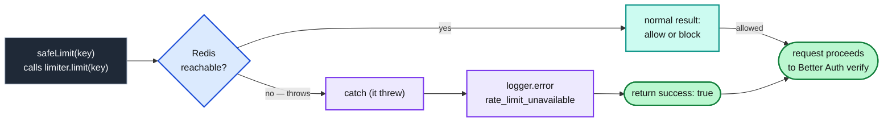

import Figure from '../../../components/figures/Figure.astro';
import ArrowDiagram from '../../../components/figures/ArrowDiagram.astro';
import TabbedContent from '../../../components/figures/tabbed-content/TabbedContent.astro';
import TabbedItem from '../../../components/figures/tabbed-content/TabbedItem.astro';
import Screenshot from '../../../components/figures/screenshot/Screenshot.astro';
import StateMachineWalker from '../../../components/figures/state-machine-walker/StateMachineWalker.astro';
import Question from '../../../components/figures/state-machine-walker/Question.astro';
import Branch from '../../../components/figures/state-machine-walker/Branch.astro';
import Leaf from '../../../components/figures/state-machine-walker/Leaf.astro';
import Buckets from '../../../components/exercises/buckets/Buckets.astro';
import Bucket from '../../../components/exercises/buckets/Bucket.astro';
import Item from '../../../components/exercises/buckets/Item.astro';
import TrueFalse from '../../../components/exercises/true-false/TrueFalse.astro';
import Statement from '../../../components/exercises/true-false/Statement.astro';
import TfWhy from '../../../components/exercises/true-false/TfWhy.astro';
import { Card, CardGrid } from '@astrojs/starlight/components';
import ExternalResource from '../../../components/ui/ExternalResource.astro';
import Term from '../../../components/ui/Term.astro';
import CourseProgressBar from '../../../components/ui/CourseProgressBar.astro';
import VideoCallout from '../../../components/embeds/VideoCallout.astro';
import TwoAttackContrast from '../../../components/lessons/074/1/TwoAttackContrast.astro';
import RequestPathStrip from '../../../components/lessons/074/1/RequestPathStrip.astro';
import WafRuleMock from '../../../components/lessons/074/1/WafRuleMock.astro';

<CourseProgressBar value={frontmatter['course-progress']} />

A demo of the app you've been building is live on a Vercel preview URL. It's behind a hard-to-guess link, you've shown it to a few design partners, and a public launch with the email-and-password sign-in flow you built with Better Auth is about a week out. This morning the logs show a crawler hammering the sign-up form, hundreds of requests a minute from one address. Nobody has provisioned Redis. Nobody has written a single line of rate-limiting code.

Three questions need answering, and an experienced engineer works through them in this order. Which controls run *today*, while there's no Redis and no public URL? What specific event flips application-level rate limiting from "nice to have" to "we cannot launch without it"? And what does each control catch that the other one structurally cannot see?

These decisions protect the auth flow you already shipped. By the end of this lesson you'll be able to name the two layers of rate limiting and where each one sits, name the precise trigger that makes the application limiter non-negotiable, justify why Upstash Redis is the default tool for that layer, and make the call every team eventually faces: what happens to sign-in when the rate limiter itself goes down. The next two lessons cover limiter configuration and wiring; this lesson covers the decisions that come first.

## One attacker, ten thousand IPs, one victim's email

Start with the problem, before any tool. One attack shape justifies this entire chapter, and once you understand it, every decision that follows has an obvious reason to exist.

An attacker has two things: a botnet of ten thousand machines, each with its own IP address, and a list of leaked passwords from some unrelated breach. They pick one target, a single victim's email address, say the CFO of a company that just signed up, and they start guessing. Password one from the first IP. Password two from the second IP. Password three from the third. Ten thousand guesses, ten thousand different source addresses, all aimed at the same email. This is <Term definition="An attack that replays leaked username/password pairs against a login form, betting that people reuse passwords across sites. Distributed across many IPs to dodge per-IP limits.">credential stuffing</Term>, and it is the single most common attack against a public sign-in form.

Now try to stop it with the obvious tool: a limit on how many requests one IP can make. It never trips. Each IP in the botnet sends *one* request and goes quiet. From the limiter's point of view, ten thousand polite visitors each knocked once. The attack passes straight through.

So tighten the per-IP limit. Make it so aggressive that even one extra request gets blocked. Now you've created a different disaster. Picture a customer's office: two hundred employees behind a single corporate router, all sharing one public IP through <Term definition="Network Address Translation — many devices on a private network share one public IP. To anything outside, hundreds of users look like a single address.">NAT</Term>. To your limiter they look like one address making two hundred requests, so your aggressive rule locks the entire office out of the product. The attack still gets through, because it's spread across ten thousand IPs, but now you've got a room full of paying customers who can't sign in and a support queue filling up. You tightened the wrong dimension.

The only limit that catches the real attack counts attempts against the *email being targeted*, regardless of where the request came from. Ten thousand guesses against one email is ten thousand attempts on that key, no matter how many IPs they're spread across. A **per-email** limit sees the attack for what it is and shuts it down after a handful of tries.

A naive per-email limit, though, is itself a weapon. If an attacker can lock an account by piling up failed attempts against its email, then they can lock you out of your own account just by spamming garbage passwords at your email address. They never needed to guess your real password; denying you access was the whole goal. This is a <Term definition="Denial of Service — making a system unavailable to its legitimate users. Here, locking a victim out of their own account by deliberately tripping a per-email limit against them.">denial-of-service</Term> lockout, and it's the mirror image of the first problem.

So neither limit alone is safe. Per-IP lets the botnet through, and per-email hands attackers a lockout button. The answer the rest of the chapter builds on is **both at once**: two independent limits on every sign-in request, one keyed on the IP and one keyed on the email, each catching exactly what the other misses. Wiring two limiters into one request is the third lesson's job; for now, hold onto the shape: per-IP *and* per-email, together.

The two tabs below capture the whole intuition in one picture. Flip between the crude attack and the distributed one and watch which gate trips.

<TwoAttackContrast />

One consequence of needing a per-email limit is the hinge the whole lesson turns on. To limit by email, you need the email, and you only have the email *after* the request has arrived and been parsed, inside your application code, in the Server Action or route handler that Better Auth runs. Anything sitting in front of your app, out at the network edge, sees the IP and the URL path but has no idea what's in the request body, so it cannot see the email. That means the per-email limit can only live inside the app, which forces a second layer of defense.

## The two layers: edge controls and application controls

That second layer doesn't replace the first; it joins it. Name both precisely, because the names and the boundary between them are the mental model you'll carry for the rest of the chapter.

The first layer is **edge controls**. On this stack that's <Term definition="Web Application Firewall — a filter sitting in front of your app that inspects each request by IP, path, and headers, and can block or log it before it ever reaches your code.">Vercel's WAF</Term> rate-limiting rules, and Cloudflare has the equivalent. They sit out at the <Term definition="The CDN / proxy tier that runs before your application function — geographically close to the user, in front of your code.">edge</Term>, in front of your application, and they run before your code does. They can see everything that's visible without parsing the request body: the source **IP**, the **path** being requested, the **headers**. They can't see anything inside the body or anything about identity: no email, no user, no org. Their job is to stop a single IP from crawling your entire site, throttle scrapers, and block crude single-source brute force, all before the request reaches your function. Because they reject at the edge, they're also the cheapest layer you have: a blocked request never wakes up a serverless function, so you're billed nothing for the compute it would have used.

The second layer is **application controls**. That's `@upstash/ratelimit` running inside your Server Actions and route handlers, after the request has been parsed and the user authenticated. By the time this code runs, you have the whole picture: the **email** on the form, the **authenticated user**, the **org** they belong to, the **request body**. This is the only place the per-email limit from the last section can live, and it's the layer that catches the distributed-stuffing and lockout patterns the edge structurally cannot.

The rule to internalize is short: **each layer catches what the other cannot, so a production SaaS runs both.** This isn't a migration where one replaces the other; it's the steady state. The edge is the outer ring, the application limiter is the inner ring, and you keep both permanently. Rate limiting is one row of a larger security baseline you'll audit near the end of the course, but that's a later concern; for now it's just these two rings.

If you want the underlying concept from the ground up, what rate limiting is, why services do it, and what the per-key idea buys you, this primer fills it in before we continue.

<VideoCallout videoId="9CIjoWPwAhU" videoTitle="What is Rate Limiting / API Throttling? — Be A Better Dev">
  Be A Better Dev's 16-minute primer on what rate limiting is, why applications do it, and the trade-offs from both the server and client side.
</VideoCallout>

Laid out along the path a request travels, the two rings look like this.

<RequestPathStrip />

Here is the same contrast, on the axes you'll weigh when deciding which layer owns a given protection:

<CardGrid>
  <Card title="Edge controls — Vercel WAF" icon="shield">
    - **Where it sits:** in front of the app, at the edge, before your code runs.
    - **What it sees:** IP, path, headers.
    - **What it catches:** single-IP crawling, scrapers, crude brute force.
    - **What it costs:** nothing on a blocked request, since no function compute is billed.
    - **Configured:** dashboard rules (or the Firewall SDK), no redeploy.
  </Card>
  <Card title="Application controls — @upstash/ratelimit" icon="approve-check-circle">
    - **Where it sits:** inside Server Actions and route handlers, after auth/parsing.
    - **What it sees:** email, user, org, request body (plus IP).
    - **What it catches:** distributed credential stuffing, per-email lockout, per-user and per-org quotas.
    - **What it costs:** one Redis round-trip per check (small, detailed in the next lessons).
    - **Configured:** code in `lib/rate-limit.ts`.
  </Card>
</CardGrid>

Reading a contrast and applying it are different skills, and this lesson is about the second one. Before moving on, sort each abuse shape into the layer that owns it. Ask the same question each time: can a filter that sees only IP, path, and headers catch this, or does it need something visible only after auth?

<Buckets instructions="For each abuse shape, decide which layer is the one that can actually catch it. Ask: can a filter that sees only IP, path, and headers stop this, or does it need the email/user/org — which only exist after auth?">
  <Bucket name="edge" label="Edge / WAF" description="Sees IP, path, headers — runs before your code" />
  <Bucket name="app" label="Application limiter" description="Sees email, user, org — runs after auth" />

  <Item bucket="edge">One IP scraping every product page</Item>
  <Item bucket="app">A botnet trying 10,000 passwords against one email</Item>
  <Item bucket="edge">A single IP flooding `/api/*` with requests</Item>
  <Item bucket="app">Locking a user out by spamming their password-reset email</Item>
  <Item bucket="app">Capping each org's CSV exports to 50 per month</Item>
  <Item bucket="edge">Hard-blocking a known-bad IP address outright</Item>
</Buckets>

## Before the public URL: the edge layer is enough

Back to the timeline and the morning's crawler. Today, before the public launch, what actually needs to run?

Right now the app lives behind a Vercel preview or a private link. The realistic threats are bots and the occasional curious probe, exactly like the crawler in the logs. There's no victim-email vector yet, because there's no public sign-in form being targeted by anyone who matters. The distributed-stuffing problem is real, but it isn't live until the door is public.

For this stage, Vercel's WAF rate-limiting rules cover the ground that needs covering: a per-IP request budget on `/api/*`, on the sign-in and sign-up paths, and on any route handler that does real work. You declare these in the Vercel dashboard. There's also a Firewall SDK for defining rules in code, but you won't need it here. Three properties make this the right move for a pre-launch app. A rule takes effect **without a redeploy**: you add it and it's live, which matters when you're reacting to an attack in progress. It costs **nothing** within the allotment included on the free and Pro tiers. And each rule can either **log** the matching traffic so you can watch a pattern before acting, or **deny** it outright.

So the call is simple: ship the WAF rule with your first preview. Don't wait for launch, and don't wait for the attack. It's the cheap outer ring, it's two clicks, and the crawler hammering your sign-up form this morning is exactly what it exists to stop.

A WAF rule is config, not code. It reads as a condition and an action, the shape below.

<WafRuleMock />

## The trigger: a public URL with email and password

This is the pivot of the whole lesson, and the answer to the second of our three opening questions.

The moment the app is reachable at a real domain with a working sign-in form, application-level rate limiting on the auth endpoints becomes non-negotiable. Not "when we scale," not "once we have real traffic," not "after we grow." The line is this specific event: a public URL plus an email-and-password form. Name it that precisely, because vague triggers like "scale" never actually fire; nobody can point at the day scale arrived. A public URL going live is a date on a calendar.

The reason is everything from the first section, now made concrete. Going public is the victim-email vector going live. The sign-in form is now reachable by the botnet, by the credential-stuffing scripts, by anyone with a leaked password list. And you already know the WAF can't see the email, so per-IP at the edge alone leaves both the distributed-stuffing pattern and the lockout pattern wide open. The only thing that closes them is the per-IP *and* per-email pair, applied inside the action where both are visible.

This is also where the most common mistake in this entire stack lives, so name it directly. A team ships the public URL, has a WAF rate-limit rule on `/api/auth/*`, and concludes they're protected. They are not. The per-email check that catches the real attack is invisible to the WAF: the WAF never sees the email, so no WAF rule can ever count against it. Shipping the public form with only the edge rule and no application limiter leaves the lockout-by-email vector completely open. Both layers ship together, or you haven't shipped the protection.

The decision below is the one to internalize, not the leaves so much as the *order* you ask the questions in. Walk it the way an experienced engineer does, and notice that the first question is never "how much traffic do we have," it's "is the door public yet."

<StateMachineWalker title="When does the application limiter become non-negotiable?">
  <Question id="public-url" prompt="Is the app reachable at a public URL with a working sign-in form?">
    <Branch label="No — preview or private link only" to="costly-routes" />
    <Branch label="Yes — public URL + email & password" to="app-limiter" rationale="The victim-email vector is now live." />
  </Question>

  <Question id="costly-routes" prompt="Any costly or crawlable public route handlers?" description="Even pre-launch, the edge layer is cheap insurance.">
    <Branch label="Yes — there are routes worth protecting" to="waf-now" />
    <Branch label="Not really — it's a private demo" to="waf-insurance" />
  </Question>

  <Leaf id="waf-now" verdict="Ship the edge WAF rule now">
    Per-IP budgets in the Vercel dashboard on `/api/*`, sign-in, sign-up, and any costly handler. No Redis needed yet, since the public-form trigger hasn't fired.
  </Leaf>

  <Leaf id="waf-insurance" verdict="Add the WAF rule anyway — it's free insurance">
    It's two clicks, costs nothing, and needs no redeploy. There's no reason to wait for the first crawler to show up in the logs.
  </Leaf>

  <Leaf id="app-limiter" verdict="Application limiter is non-negotiable">
    Per-IP **and** per-email at the action boundary, on top of the WAF, not instead of it. The edge ring stays as the outer ring, and the application ring catches the distributed-stuffing and lockout patterns the WAF can't see.
  </Leaf>
</StateMachineWalker>

## Why Upstash Redis is the 2026 default

You've decided the application layer is mandatory. So what tool runs it? The answer is Upstash Redis, and rather than hand it to you as a recommendation, let's derive it, because the way you get there is itself the lesson. Each requirement the limiter imposes eliminates an option until one survives.

Start from what the limiter actually needs. To rate-limit by key, it has to keep a **counter per key**, per IP and per email, with **sub-second precision** and an automatic expiry, a <Term definition="Time-to-live — an automatic expiry set on a stored key. When the TTL elapses the key vanishes, which is what makes a rate-limit counter reset at the end of its window.">TTL</Term>, so the counter resets when the window rolls over. The constraint that does all the work is the last one: that counter state has to be **shared across every invocation of your serverless function**. The natural home for fast, expiring, per-key counters is <Term definition="An in-memory key-value data store. Reads and writes are extremely fast, and keys can carry a TTL — here it holds the per-IP and per-email counters.">Redis</Term>; the question is only *which* Redis.

That single constraint rules out the obvious first idea. You might reach for a "lightweight" in-memory limiter, just a `Map` in your function holding counts. It works perfectly on your laptop and collapses the instant it hits real traffic, and the reason is worth understanding. In development, `next dev` is one long-lived process, so that `Map` persists across every request because it's all the same process. In production on a serverless platform, your function runs as many short-lived instances, each spun up to handle a burst and each with its own fresh, empty memory. Counter increments scatter across instances that never see each other's state, so the limit effectively never trips. This is the trap that catches the most people: in-memory limiters look like they work, right up until they're the thing standing between an attacker and your sign-in form, at which point they're doing nothing. The counter has to live in a store outside the function, reachable by all of them.

The next constraint is reach: that external store has to be reachable from **every runtime your app uses**, Node serverless functions, edge functions, and background workers on Trigger.dev. That's a real filter, because edge runtimes don't give you raw TCP sockets. A traditional Redis client like `ioredis` opens a TCP connection, and in an edge function that connection simply isn't available, so the client fails, sometimes silently. The store needs to be reachable over plain HTTP, not a persistent socket.

<Term definition="A serverless, HTTP-accessible managed Redis. You talk to it over REST instead of a TCP socket, so it works in edge runtimes; it scales to zero and bills per request.">Upstash</Term> Redis is what's left standing, and it clears every constraint cleanly. It speaks **HTTP/REST**, so it works in edge contexts where TCP clients fail. It <Term definition="No servers running and no cost when idle — you pay per request, not per hour of uptime.">scales to zero</Term>, so an idle app costs nothing. Its free tier is generous, on the order of half a million commands a month at the time of writing, roughly sixteen thousand a day, which covers a small SaaS without spending a cent. And it's the default in the Vercel ecosystem: `@upstash/ratelimit` is published and maintained by Upstash itself, and the Vercel Marketplace integration provisions the database and writes the connection env vars for you.

There are alternatives, and you should be able to name them and the one condition that points you to each. This is recognition, not depth. If your app already lives on Cloudflare's edge, Cloudflare KV or D1 is the natural reach. If you're running your own infrastructure, or your primary region is far from Vercel, a self-hosted Redis on Fly, Railway, or EC2 can make sense. You may also have heard of "Vercel KV"; that product was folded into Upstash Redis at the end of 2024, so on Vercel the key-value offering *is* Upstash now, reached through the Marketplace. For a new SaaS on this stack, Upstash is the default reach, and the others are exceptions you'd only take for a specific reason.

### Name each piece precisely

There are four names in play here, and they're easy to blur together. Keep them distinct, because the npm packages and the docs do, and getting the names right is how you read those docs without confusion.

<CardGrid>
  <Card title="Redis">
    The protocol and the data structures. The thing, in the abstract.
  </Card>
  <Card title="Upstash Redis">
    The managed service: a hosted Redis you provision and point your app at.
  </Card>
  <Card title="@upstash/redis">
    The HTTP/REST client library you call from your code.
  </Card>
  <Card title="@upstash/ratelimit">
    The rate-limiting library that uses `@upstash/redis` under the hood. The one you'll configure.
  </Card>
</CardGrid>

### What Upstash is not

Knowing what a tool *isn't* matters as much as knowing what it's for, because it's how you stop yourself reaching for it in the wrong place. So, plainly: Upstash Redis is **not a Postgres replacement**. It has no relational data, no transactions across keys, and no joins; your real data still lives in Postgres through Drizzle. It is **not a durable queue**, since Trigger.dev owns background work and its guarantees. And it is **not the Next.js data cache**: the tag-driven `cacheTag` world you built in the caching chapters owns cached page and read output.

The trap to avoid is reaching for Upstash to "speed up the database." That's the wrong trigger entirely. A slow query is an index problem or a cached-read problem, and you solve it with a query plan or with the cache layer you already have. Redis is for fast per-key counters and small shared values, not for papering over a missing index.

That said, once Upstash is in your stack for rate limiting, the same Redis cheaply earns its keep on a few other jobs, worth knowing about but not worth building now. It makes a fine **cross-process cache** for tiny, hot, eventually-consistent values. It's a natural home for **short-lived session-shaped data**: single-use password-reset and email-verification tokens, or the cooldown that stops someone re-sending the verification email ten times a minute. And it's a **foothold for pub/sub** if your notification dispatcher later needs to coalesce events. The trigger for this chapter is still the auth endpoints; the rest is upside you don't have to design for today.

### Provisioning: one shape

The course commits to one provisioning path so you're not choosing under uncertainty. Create the Upstash Redis database through the **Vercel Marketplace integration**. It writes two environment variables into your project, `UPSTASH_REDIS_REST_URL` and `UPSTASH_REDIS_REST_TOKEN`, across all three environments (production, preview, development) in one step. If you deploy somewhere other than Vercel, create the database in the Upstash dashboard instead and wire those same two variables by hand.

One choice matters enough to call out: **pick the database's region to match your primary Vercel region.** Co-located, a limiter check is a few milliseconds; a database in a distant region adds **30 to 80 milliseconds to every single `limit()` call**, and since you check on every sign-in attempt, that latency lands on your hottest path. Match the regions.

Those two variable names plug into the env validation the project set up earlier in the course with `@t3-oss/env-nextjs` and Zod. The starter assumes they're present and fails the build loudly if they're missing, which is exactly the behavior you want. The client code that reads them is the next lesson's concern.

:::note
Throughout the next lessons you'll see four pieces named separately: Redis the protocol, Upstash Redis the service, `@upstash/redis` the client, and `@upstash/ratelimit` the limiter. When a doc or an error message mentions one, it means that one specifically.
:::

## When the limiter can't reach Redis: fail open, log loud

One decision is left, and it's the one that most separates an experienced engineer from a beginner: what happens when the rate limiter itself breaks.

Your auth endpoint calls `limiter.limit(key)`. That call talks to Upstash over the network, and a network call can fail: Upstash could be down, the request could time out, the token could be momentarily rejected. When that call throws, your code has to decide right there what to do with the request it was about to gate. There are exactly two choices, and they have opposite risk profiles.

<Term definition="When a security control breaks, fail-open lets the request through; fail-closed blocks it. Opposite risk profiles — one risks abuse, the other risks locking out legitimate users.">Fail-open</Term> means the limiter couldn't run, so you allow the request, but you log loudly at error level and alert on the rate of these failures. The risk you're accepting is a brief window where abuse goes unthrottled while Redis is down. **Fail-closed** means the limiter couldn't run, so you reject the request as if it had been rate-limited. The risk there is that a Redis outage now **locks every single user out of their own account**, with nobody able to sign in until Redis comes back.

The course default is **fail-open on the auth path**, and the reasoning is a straight comparison of those two failure modes. A brief, bounded abuse window during a Redis incident is bad. Locking your entire user base out of the product during that same incident is worse, because it turns a backend hiccup into a total outage on the front door. And you're not actually defenseless during the window: the WAF outer ring is still up, still catching the crudest single-IP abuse. So you accept the smaller harm. There is one nuance worth knowing: a few high-value endpoints can flip this default, such as an admin-only privileged action or a billing webhook the customer literally cannot retry, where letting an unthrottled request through is worse than rejecting it. That's a per-endpoint decision, made once and deliberately. Sign-in is not one of those endpoints.

Two things make this policy hold up in practice. First, the decision lives in **one helper**, not scattered across every call site, so "fail-open on the auth path" is a single, auditable piece of code rather than a convention you hope everyone remembers. Here is the shape, in intent (the real helper lands next lesson; this is just the idea):

<div data-mark-color="blue">

```ts title="lib/rate-limit.ts" {6-7}
// Shape only — the real safeLimit lands next lesson.
export const safeLimit = async (key: string) => {
  try {
    return await limiter.limit(key);
  } catch (error) {
    logger.error({ event: 'rate_limit_unavailable', error });
    return { success: true };
  }
};
```

</div>

The intent is the whole point: when the limiter can't reach Redis, the `catch` runs, writes a structured error line, and returns `{ success: true }` so the request continues. The limiter degrades to a no-op rather than becoming a single point of failure for sign-in.

Second, the failure is never silent. That `logger.error` line writes through the same `pino` structured logging the app uses everywhere, at error level, with a named event so it's queryable. A one-off `rate_limit_unavailable` is noise. A sustained stream of them means Upstash is having an incident, and that's something a human needs to look at, not quiet drift that nobody notices until the abuse window has been open for an hour. Fail-open is a deliberate, logged, alertable choice, never a thing that quietly happens.

<Figure caption="Fail-open in one path: when `limit()` can't reach Redis it throws, the catch logs a `rate_limit_unavailable` error, and the request proceeds. The limiter degrades to a no-op instead of taking sign-in down with it.">

</Figure>

The policy is only useful if you can apply it to a *specific* endpoint under pressure, so test that. For each scenario below, decide whether the call is right.

<TrueFalse instructions="Redis is having an incident. For each call, decide whether it follows the course's rate-limit failure policy.">
  <Statement answer="true">
    Redis is down and a user tries to sign in. The right move is to allow the request and log the failure loudly.
    <TfWhy>Fail-open on the auth path. Locking the whole user base out during a Redis incident is worse than a brief abuse window — and the WAF outer ring still catches crude abuse.</TfWhy>
  </Statement>

  <Statement answer="true">
    A billing webhook the customer cannot retry hits while Redis is down. Flipping that endpoint to fail-closed can be the right call.
    <TfWhy>A few high-value endpoints may flip the default — admin-only privileged actions, or a non-retryable webhook — where letting an unthrottled request through is worse than rejecting it. It's a per-endpoint decision.</TfWhy>
  </Statement>

  <Statement answer="false">
    Fail-closed on sign-in during a Redis outage is the safe default.
    <TfWhy>Fail-closed on sign-in takes the entire user base offline the moment Redis hiccups. The course default is fail-open on the auth path for exactly this reason.</TfWhy>
  </Statement>

  <Statement answer="false">
    When `limit()` throws, the safest thing is to swallow the error quietly and move on.
    <TfWhy>It's never silent. The catch writes a structured `rate_limit_unavailable` error so a sustained stream of them surfaces as an Upstash incident, not invisible drift.</TfWhy>
  </Statement>
</TrueFalse>

That's the lesson: two layers rather than one, the public-URL-plus-auth trigger that makes the inner layer mandatory, Upstash as the survivor of a chain of constraints, and fail-open as the default when the limiter can't reach it. The next lesson opens up `@upstash/ratelimit` itself, the client, the algorithms, and what a `limit()` call actually returns, so you can configure the inner ring you just argued into existence.

## External resources

<CardGrid>
  <ExternalResource
    title="Vercel WAF — Rate Limiting"
    href="https://vercel.com/docs/vercel-firewall/vercel-waf/rate-limiting"
    icon="simple-icons:vercel"
    iconColor="#000000"
    description="The edge layer: how to configure per-IP rate-limit rules in the dashboard, with log/deny/challenge actions and no redeploy."
  />
  <ExternalResource
    title="Upstash Redis — Getting Started"
    href="https://upstash.com/docs/redis/overall/getstarted"
    icon="simple-icons:upstash"
    iconColor="#00E9A3"
    description="The managed, HTTP-accessible Redis behind the application layer — what it is and how to provision a database."
  />
  <ExternalResource
    title="@upstash/ratelimit — GitHub"
    href="https://github.com/upstash/ratelimit-js"
    icon="simple-icons:github"
    iconColor="#181717"
    description="The rate-limiting library you'll configure next lesson — README, algorithms, and connectionless serverless design."
  />
</CardGrid>
