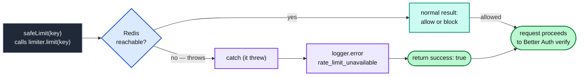

import Figure from '../../../components/figures/Figure.astro';
import ArrowDiagram from '../../../components/figures/ArrowDiagram.astro';
import TabbedContent from '../../../components/figures/tabbed-content/TabbedContent.astro';
import TabbedItem from '../../../components/figures/tabbed-content/TabbedItem.astro';
import Screenshot from '../../../components/figures/screenshot/Screenshot.astro';
import StateMachineWalker from '../../../components/figures/state-machine-walker/StateMachineWalker.astro';
import Question from '../../../components/figures/state-machine-walker/Question.astro';
import Branch from '../../../components/figures/state-machine-walker/Branch.astro';
import Leaf from '../../../components/figures/state-machine-walker/Leaf.astro';
import Buckets from '../../../components/exercises/buckets/Buckets.astro';
import Bucket from '../../../components/exercises/buckets/Bucket.astro';
import Item from '../../../components/exercises/buckets/Item.astro';
import TrueFalse from '../../../components/exercises/true-false/TrueFalse.astro';
import Statement from '../../../components/exercises/true-false/Statement.astro';
import TfWhy from '../../../components/exercises/true-false/TfWhy.astro';
import { Card, CardGrid } from '@astrojs/starlight/components';
import ExternalResource from '../../../components/ui/ExternalResource.astro';
import Term from '../../../components/ui/Term.astro';
import CourseProgressBar from '../../../components/ui/CourseProgressBar.astro';
import VideoCallout from '../../../components/embeds/VideoCallout.astro';
import TwoAttackContrast from '../../../components/lessons/074/1/TwoAttackContrast.astro';
import RequestPathStrip from '../../../components/lessons/074/1/RequestPathStrip.astro';
import WafRuleMock from '../../../components/lessons/074/1/WafRuleMock.astro';

<CourseProgressBar value={frontmatter['course-progress']} />

A demo of the app you've been building is live on a Vercel preview URL, behind a hard-to-guess link, a week before its public launch with the email-and-password sign-in you built using Better Auth.
This morning the logs show a crawler hammering the sign-up form, hundreds of requests a minute from one address.
There's no Redis and not a line of rate-limiting code.

Three questions decide what to do, in this order.
Which controls run *today*, with no Redis and no public URL?
What event flips application-level rate limiting from nice-to-have to non-negotiable?
And what does each control catch that the other structurally cannot see?
Answering them protects the auth flow you already shipped; the next two lessons cover configuring and wiring the limiter.

## Why credential stuffing needs both per-IP and per-email limits

Start with the attack, before any tool.
One attack shape justifies every decision in this chapter.

An attacker has two things: a botnet of ten thousand machines, each with its own IP address, and a list of leaked passwords from some unrelated breach.
They pick one target, a single victim's email, say the CFO of a company that just signed up, and start guessing: one password per IP, ten thousand guesses against the same email from ten thousand different addresses.
This is <Term definition="An attack that replays leaked username/password pairs against a login form, betting that people reuse passwords across sites. Distributed across many IPs to dodge per-IP limits.">credential stuffing</Term>, the most common attack against a public sign-in form.

Try to stop it with the obvious tool, a limit on requests per IP, and it never trips.
Each machine in the botnet sends one request and goes quiet, so the limiter sees ten thousand polite visitors who each knocked once.
The attack passes straight through.

So tighten the per-IP limit until even one extra request gets blocked, and you create a different disaster.
Picture a customer's office: two hundred employees behind one corporate router, all sharing a single public IP through <Term definition="Network Address Translation — many devices on a private network share one public IP. To anything outside, hundreds of users look like a single address.">NAT</Term>.
To your limiter they are one address making two hundred requests, so the rule locks the whole office out of the product.
The attack, spread across ten thousand IPs, still gets through.
You tightened the wrong dimension.

The only limit that catches the real attack counts attempts against the *email being targeted*, wherever the requests come from.
Ten thousand guesses at one email is ten thousand attempts on that key, however many IPs they span, so a **per-email** limit shuts the attack down after a handful of tries.

A naive per-email limit, though, is itself a weapon.
If failed attempts against an email can lock its account, an attacker locks you out of your own account just by spamming garbage passwords at your address.
Guessing your real password was never the point; denying you access was.
This is a <Term definition="Denial of Service — making a system unavailable to its legitimate users. Here, locking a victim out of their own account by deliberately tripping a per-email limit against them.">denial-of-service</Term> lockout, the mirror image of the first problem.

So neither limit alone is safe: per-IP lets the botnet through, per-email hands attackers a lockout button.
The answer is **both at once**, two independent limits on every sign-in request, one keyed on the IP and one on the email, each catching what the other misses.

Flip between the crude attack and the distributed one below, and watch which gate trips.

<TwoAttackContrast />

The per-email limit decides where this defense has to live.
To limit by email you need the email, and you only have it *after* the request arrives and is parsed, inside your application code, in the Server Action or route handler that Better Auth runs.
Anything in front of your app, out at the network edge, sees the IP and the URL path but not the request body, so it cannot see the email.
The per-email limit can only run inside the app, which forces a second layer of defense.

## The two layers: edge controls and application controls

The second layer doesn't replace the first; it joins it.
Name both precisely, because the boundary between them is the mental model for the rest of the chapter.

The first layer is **edge controls**: on this stack, <Term definition="Web Application Firewall — a filter sitting in front of your app that inspects each request by IP, path, and headers, and can block or log it before it ever reaches your code.">Vercel's WAF</Term> rate-limiting rules, with Cloudflare offering the equivalent.
They run at the <Term definition="The CDN / proxy tier that runs before your application function — geographically close to the user, in front of your code.">edge</Term>, before your code, and see only what's visible without parsing the body: the source **IP**, the **path**, the **headers**.
They can't see identity — no email, no user, no org.
Their job is to stop a single IP from crawling your site, throttle scrapers, and block crude single-source brute force before the request reaches your function.
Rejecting at the edge also makes them your cheapest layer: a blocked request never wakes a serverless function, so you're billed nothing for the compute it would have used.

The second layer is **application controls**: `@upstash/ratelimit` running inside your Server Actions and route handlers, after the request is parsed and the user authenticated.
By then you have the whole picture — the **email** on the form, the **authenticated user**, the **org** they belong to, the **request body**.
This is the only place the per-email limit from the last section can live, and the only layer that catches the distributed-stuffing and lockout patterns the edge structurally cannot.

The rule to internalize is short: **each layer catches what the other cannot, so a production SaaS runs both.**
This is the steady state, not a migration.
The edge is the outer ring, the application limiter the inner ring, and you keep both permanently.

For the concept from the ground up — what rate limiting is, why services do it, and what the per-key idea buys you — this primer fills it in.

<VideoCallout videoId="9CIjoWPwAhU" videoTitle="What is Rate Limiting / API Throttling? — Be A Better Dev">
  A 16-minute primer on what rate limiting is, why applications do it, and the trade-offs on both the server and client side.
</VideoCallout>

Laid out along the path a request travels, the two rings look like this.

<RequestPathStrip />

The same contrast, on the axes you'll weigh when deciding which layer owns a given protection:

<CardGrid>
  <Card title="Edge controls — Vercel WAF" icon="shield">
    - **Where it sits:** at the edge, in front of the app, before your code runs.
    - **What it sees:** IP, path, headers.
    - **What it catches:** single-IP crawling, scrapers, crude brute force.
    - **What it costs:** nothing on a blocked request — no function compute is billed.
    - **Configured:** dashboard rules (or the Firewall SDK), no redeploy.
  </Card>
  <Card title="Application controls — @upstash/ratelimit" icon="approve-check-circle">
    - **Where it sits:** inside Server Actions and route handlers, after auth and parsing.
    - **What it sees:** email, user, org, request body (plus IP).
    - **What it catches:** distributed credential stuffing, per-email lockout, per-user and per-org quotas.
    - **What it costs:** one Redis round-trip per check (small, detailed in the next lessons).
    - **Configured:** code in `lib/rate-limit.ts`.
  </Card>
</CardGrid>

Before moving on, sort each abuse shape into the layer that owns it.
Ask the same question each time: can a filter that sees only IP, path, and headers catch this, or does it need something visible only after auth?

<Buckets instructions="For each abuse shape, decide which layer is the one that can actually catch it. Ask: can a filter that sees only IP, path, and headers stop this, or does it need the email/user/org — which only exist after auth?">
  <Bucket name="edge" label="Edge / WAF" description="Sees IP, path, headers — runs before your code" />
  <Bucket name="app" label="Application limiter" description="Sees email, user, org — runs after auth" />

  <Item bucket="edge">One IP scraping every product page</Item>
  <Item bucket="app">A botnet trying 10,000 passwords against one email</Item>
  <Item bucket="edge">A single IP flooding `/api/*` with requests</Item>
  <Item bucket="app">Locking a user out by spamming their password-reset email</Item>
  <Item bucket="app">Capping each org's CSV exports to 50 per month</Item>
  <Item bucket="edge">Hard-blocking a known-bad IP address outright</Item>
</Buckets>

## Before the public URL: the edge layer is enough

Today, before launch, what actually needs to run?

Right now the app lives behind a Vercel preview or a private link.
The realistic threats are bots and the occasional curious probe, like the crawler in this morning's logs.
There's no victim-email vector yet, because no public sign-in form is reachable.
Distributed stuffing is a real problem, but it isn't live until the door is public.

At this stage, Vercel's WAF rate-limiting rules cover everything that needs covering: a per-IP request budget on `/api/*`, on the sign-in and sign-up paths, and on any route handler that does real work.
You declare them in the Vercel dashboard.
Three properties make this the right move pre-launch.
A rule takes effect **without a redeploy**, which matters when you're reacting to an attack in progress.
It costs **nothing** within the allotment on the free and Pro tiers.
And each rule can **log** matching traffic so you can watch a pattern before acting, or **deny** it outright.

So the call is simple: ship the WAF rule with your first preview.
Don't wait for launch, and don't wait for the attack.
It's the cheap outer ring, it's two clicks, and the crawler hammering your sign-up form this morning is exactly what it stops.

A WAF rule is config, not code: a condition and an action, in the shape below.

<WafRuleMock />

## The trigger: a public URL with email and password

The moment the app is reachable at a real domain with a working sign-in form, application-level rate limiting on the auth endpoints becomes non-negotiable.
Not "when we scale," not "once we have real traffic."
The line is one specific event: a public URL plus an email-and-password form.
Name it that precisely, because vague triggers like "scale" never fire; nobody can point at the day scale arrived.
A public URL going live is a date on a calendar.

Going public is the victim-email vector going live.
The sign-in form is now reachable by the botnet, the credential-stuffing scripts, anyone with a leaked password list.
And the WAF can't see the email, so per-IP at the edge alone leaves both the distributed-stuffing pattern and the lockout pattern open.
Only the per-IP *and* per-email pair closes them, applied inside the action where both are visible.

This is where the most common mistake in the whole stack lives.
A team ships the public URL with a WAF rate-limit rule on `/api/auth/*` and concludes they're protected.
They are not.
The per-email check that catches the real attack is invisible to the WAF, so no WAF rule can ever count against it, and the lockout-by-email vector stays wide open.
Both layers ship together, or you haven't shipped the protection.

What to internalize in the decision below is the *order* you ask the questions in.
The first question is never "how much traffic do we have," it's "is the door public yet."

<StateMachineWalker title="When does the application limiter become non-negotiable?">
  <Question id="public-url" prompt="Is the app reachable at a public URL with a working sign-in form?">
    <Branch label="No — preview or private link only" to="costly-routes" />
    <Branch label="Yes — public URL + email & password" to="app-limiter" rationale="The victim-email vector is now live." />
  </Question>

  <Question id="costly-routes" prompt="Any costly or crawlable public route handlers?" description="Even pre-launch, the edge layer is cheap insurance.">
    <Branch label="Yes — there are routes worth protecting" to="waf-now" />
    <Branch label="Not really — it's a private demo" to="waf-insurance" />
  </Question>

  <Leaf id="waf-now" verdict="Ship the edge WAF rule now">
    Per-IP budgets in the Vercel dashboard on `/api/*`, sign-in, sign-up, and any costly handler. No Redis needed yet, since the public-form trigger hasn't fired.
  </Leaf>

  <Leaf id="waf-insurance" verdict="Add the WAF rule anyway — it's free insurance">
    It's two clicks, costs nothing, and needs no redeploy. There's no reason to wait for the first crawler to show up in the logs.
  </Leaf>

  <Leaf id="app-limiter" verdict="Application limiter is non-negotiable">
    Per-IP **and** per-email at the action boundary, on top of the WAF, not instead of it. The edge ring stays as the outer ring, and the application ring catches the distributed-stuffing and lockout patterns the WAF can't see.
  </Leaf>
</StateMachineWalker>

## Why the application layer runs on Upstash Redis

The application layer is mandatory; now pick the tool that runs it.
Each requirement the limiter imposes eliminates an option until one survives.

Start from what the limiter needs.
To rate-limit by key it keeps a **counter per key**, per IP and per email, with **sub-second precision** and a <Term definition="Time-to-live — an automatic expiry set on a stored key. When the TTL elapses the key vanishes, which is what makes a rate-limit counter reset at the end of its window.">TTL</Term> so the counter resets when the window rolls over.
The constraint that does the real work is the last one: that counter state has to be **shared across every invocation of your serverless function**.
The natural home for fast, expiring, per-key counters is <Term definition="An in-memory key-value data store. Reads and writes are extremely fast, and keys can carry a TTL — here it holds the per-IP and per-email counters.">Redis</Term>; the only question is *which* Redis.

That shared-state constraint rules out the obvious first idea: a `Map` in your function holding counts.
It works on your laptop and collapses under real traffic.
In development, `next dev` is one long-lived process, so the `Map` persists across every request.
In production your function runs as many short-lived instances, each with its own fresh, empty memory, so counter increments scatter across instances that never see each other's state and the limit never trips.
In-memory limiters look like they work right up until they're the only thing between an attacker and your sign-in form.
The counter has to live in a store outside the function, reachable by all of them.

The next constraint is reach: the store has to be reachable from **every runtime your app uses**, Node serverless functions, edge functions, and background workers on Trigger.dev.
Edge runtimes don't give you raw TCP sockets, so a traditional client like `ioredis`, which opens a TCP connection, fails there, sometimes silently.
The store has to be reachable over plain HTTP.

<Term definition="A serverless, HTTP-accessible managed Redis. You talk to it over REST instead of a TCP socket, so it works in edge runtimes; it scales to zero and bills per request.">Upstash</Term> Redis is what survives.
It speaks **HTTP/REST**, so it works where TCP clients fail.
It <Term definition="No servers running and no cost when idle — you pay per request, not per hour of uptime.">scales to zero</Term>, so an idle app costs nothing.
Its free tier covers a small web app for free, around half a million commands a month.
And it's the Vercel default: `@upstash/ratelimit` is published by Upstash itself, and the Vercel Marketplace integration provisions the database and writes the connection env vars for you.

You should be able to name the alternatives and the one condition that points to each.
If your app already lives on Cloudflare's edge, Cloudflare KV or D1 is the natural reach.
If you run your own infrastructure, or your primary region is far from Vercel, a self-hosted Redis on Fly, Railway, or EC2 can make sense.
Vercel KV was folded into Upstash at the end of 2024, so on Vercel the key-value offering *is* Upstash now, reached through the Marketplace.
For a new web app on this stack, Upstash is the default; the others are exceptions you take for a specific reason.

### Name each piece precisely

Four names are in play and they blur together easily.
The npm packages and the docs keep them distinct, so to read those docs you have to as well.

<CardGrid>
  <Card title="Redis">
    The protocol and the data structures. The thing, in the abstract.
  </Card>
  <Card title="Upstash Redis">
    The managed service: a hosted Redis you provision and point your app at.
  </Card>
  <Card title="@upstash/redis">
    The HTTP/REST client library you call from your code.
  </Card>
  <Card title="@upstash/ratelimit">
    The rate-limiting library that uses `@upstash/redis` under the hood. The one you'll configure.
  </Card>
</CardGrid>

### What Upstash is not

Knowing what a tool isn't keeps you from reaching for it in the wrong place.
Upstash Redis is **not a Postgres replacement**: no relational data, no transactions across keys, no joins, and your real data still lives in Postgres through Drizzle.
It is **not a durable queue**, since Trigger.dev owns background work.
And it is **not the Next.js data cache**: the tag-driven `cacheTag` world from the caching chapters owns cached page and read output.

The trap is reaching for Upstash to "speed up the database."
A slow query is an index problem or a cached-read problem, and you solve it with a query plan or the cache layer you already have.
Redis is for fast per-key counters and small shared values, not for papering over a missing index.

Once Upstash is in your stack for rate limiting, the same database cheaply earns its keep on a few other jobs: a cross-process cache for tiny hot values, short-lived tokens like password-reset and email-verification codes, and pub/sub for a notification dispatcher later.
None of that is worth designing for today.

### Provisioning: one shape

Create the Upstash Redis database through the **Vercel Marketplace integration**.
It writes two environment variables, `UPSTASH_REDIS_REST_URL` and `UPSTASH_REDIS_REST_TOKEN`, into all three environments (production, preview, development) in one step.
Deploying somewhere other than Vercel? Create the database in the Upstash dashboard and wire those same two variables by hand.

One choice matters: **match the database's region to your primary Vercel region.**
Co-located, a limiter check is a few milliseconds; a distant region adds **30 to 80 milliseconds to every `limit()` call**, and since you check on every sign-in attempt, that latency lands on your hottest path.

Those two variable names plug into the env validation the project wired up earlier with `@t3-oss/env-nextjs` and Zod, which fails the build loudly if they're missing.
The client code that reads them is the next lesson's concern.

:::note
The next lessons name four pieces separately: Redis the protocol, Upstash Redis the service, `@upstash/redis` the client, and `@upstash/ratelimit` the limiter. When a doc or error message mentions one, it means that one specifically.
:::

## When the limiter can't reach Redis: fail open

One decision is left: what happens when the rate limiter itself breaks.

Your auth endpoint calls `limiter.limit(key)`, and that call talks to Upstash over the network.
A network call can fail: Upstash could be down, or the request could time out.
When the call throws, your code has to decide right there what to do with the request it was about to gate.
There are two choices, and they have opposite risk profiles.

<Term definition="When a security control breaks, fail-open lets the request through; fail-closed blocks it. Opposite risk profiles — one risks abuse, the other risks locking out legitimate users.">Fail-open</Term> allows the request, logs loudly at error level, and alerts on the rate of these failures.
The risk is a brief window where abuse goes unthrottled while Redis is down.
**Fail-closed** rejects the request as if it had been rate-limited.
The risk there is that a Redis outage **locks every user out of their own account** until Redis comes back.

The course default is **fail-open on the auth path**, and the reasoning is a direct comparison of those two failure modes.
A brief, bounded abuse window during a Redis incident is bad; locking your entire user base out of the product during that same incident is worse, because it turns a backend hiccup into a total outage on the front door.
You are not defenseless during the window either: the WAF outer ring is still up, still catching the crudest single-IP abuse.
So you accept the smaller harm.
A few high-value endpoints can flip this default, such as an admin-only privileged action or a billing webhook the customer cannot retry, where letting an unthrottled request through is worse than rejecting it.
That is a per-endpoint decision, made once and deliberately.
Sign-in is not one of them.

Two things make this policy hold up.
First, the decision lives in **one helper**, not scattered across every call site, so "fail-open on the auth path" is a single auditable piece of code rather than a convention you hope everyone remembers.
Here is the shape, in intent:

<div data-mark-color="blue">

```ts title="lib/rate-limit.ts" {6-7}
// Shape only — the real safeLimit lands next lesson.
export const safeLimit = async (key: string) => {
  try {
    return await limiter.limit(key);
  } catch (error) {
    logger.error({ event: 'rate_limit_unavailable', error });
    return { success: true };
  }
};
```

</div>

When the limiter can't reach Redis, the `catch` runs, writes a structured error line, and returns `{ success: true }` so the request continues.
The limiter degrades to a no-op rather than becoming a single point of failure for sign-in.

Second, the failure is never silent.
That `logger.error` line writes through the same `pino` structured logging the app uses everywhere, at error level, with a named event so it's queryable.
A one-off `rate_limit_unavailable` is noise; a sustained stream of them means Upstash is having an incident, something a human needs to look at rather than quiet drift nobody notices until the abuse window has been open for an hour.
Fail-open is a deliberate, logged, alertable choice, never something that quietly happens.

<Figure caption="Fail-open in one path: when `limit()` can't reach Redis it throws, the catch logs a `rate_limit_unavailable` error, and the request proceeds. The limiter degrades to a no-op instead of taking sign-in down with it.">

```mermaid
%%{init: {'themeCSS': '.nodeLabel, .nodeLabel * { font-size: 15px !important; } .edgeLabel, .edgeLabel * { font-size: 13px !important; }'} }%%
flowchart LR
  start["safeLimit(key)<br/>calls limiter.limit(key)"]
  reach{"Redis<br/>reachable?"}
  normal["normal result:<br/>allow or block"]
  caught["catch (it threw)"]
  logline["logger.error<br/>rate_limit_unavailable"]
  open(["return success: true"])
  proceed(["request proceeds<br/>to Better Auth verify"])

  start --> reach
  reach -- "yes" --> normal
  reach -- "no — throws" --> caught
  caught --> logline
  logline --> open
  normal -- allowed --> proceed
  open --> proceed

  class start step
  class reach gate
  class caught,logline failopen
  class normal allow
  class open,proceed proceed

  classDef step fill:#1f2937,stroke:#94a3b8,color:#f8fafc
  classDef gate fill:#dbeafe,stroke:#1d4ed8,color:#111,stroke-width:2px
  classDef failopen fill:#ede9fe,stroke:#7c3aed,color:#111,stroke-width:2px
  classDef allow fill:#ccfbf1,stroke:#0d9488,color:#111,stroke-width:2px
  classDef proceed fill:#bbf7d0,stroke:#15803d,color:#111,stroke-width:2px
```
</Figure>

The policy is only useful if you can apply it to a *specific* endpoint under pressure.
For each scenario below, decide whether the call is right.

<TrueFalse instructions="Redis is having an incident. For each call, decide whether it follows the course's rate-limit failure policy.">
  <Statement answer="true">
    Redis is down and a user tries to sign in. The right move is to allow the request and log the failure loudly.
    <TfWhy>Fail-open on the auth path. Locking the whole user base out during a Redis incident is worse than a brief abuse window — and the WAF outer ring still catches crude abuse.</TfWhy>
  </Statement>

  <Statement answer="true">
    A billing webhook the customer cannot retry hits while Redis is down. Flipping that endpoint to fail-closed can be the right call.
    <TfWhy>A few high-value endpoints may flip the default — admin-only privileged actions, or a non-retryable webhook — where letting an unthrottled request through is worse than rejecting it. It's a per-endpoint decision.</TfWhy>
  </Statement>

  <Statement answer="false">
    Fail-closed on sign-in during a Redis outage is the safe default.
    <TfWhy>Fail-closed on sign-in takes the entire user base offline the moment Redis hiccups. The course default is fail-open on the auth path for exactly this reason.</TfWhy>
  </Statement>

  <Statement answer="false">
    When `limit()` throws, the safest thing is to swallow the error quietly and move on.
    <TfWhy>It's never silent. The catch writes a structured `rate_limit_unavailable` error so a sustained stream of them surfaces as an Upstash incident, not invisible drift.</TfWhy>
  </Statement>
</TrueFalse>

The next lesson opens up `@upstash/ratelimit` itself: the client, the algorithms, and what a `limit()` call actually returns.

## External resources

<CardGrid>
  <ExternalResource
    title="Vercel WAF — Rate Limiting"
    href="https://vercel.com/docs/vercel-firewall/vercel-waf/rate-limiting"
    icon="simple-icons:vercel"
    iconColor="#000000"
    description="The edge layer: how to configure per-IP rate-limit rules in the dashboard, with log/deny/challenge actions and no redeploy."
  />
  <ExternalResource
    title="Upstash Redis — Getting Started"
    href="https://upstash.com/docs/redis/overall/getstarted"
    icon="simple-icons:upstash"
    iconColor="#00E9A3"
    description="The managed, HTTP-accessible Redis behind the application layer — what it is and how to provision a database."
  />
  <ExternalResource
    title="@upstash/ratelimit — GitHub"
    href="https://github.com/upstash/ratelimit-js"
    icon="simple-icons:github"
    iconColor="#181717"
    description="The rate-limiting library you'll configure next lesson — README, algorithms, and connectionless serverless design."
  />
</CardGrid>
