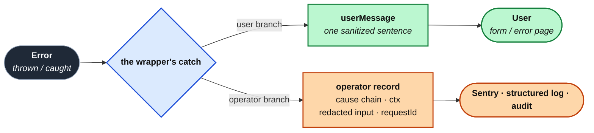

import Figure from '../../../components/figures/Figure.astro';
import AnnotatedCode from '../../../components/code/annotated-code/AnnotatedCode.astro';
import AnnotatedStep from '../../../components/code/annotated-code/AnnotatedStep.astro';
import CodeVariants from '../../../components/code/code-variants/CodeVariants.astro';
import CodeVariant from '../../../components/code/code-variants/CodeVariant.astro';
import Buckets from '../../../components/exercises/buckets/Buckets.astro';
import Bucket from '../../../components/exercises/buckets/Bucket.astro';
import Item from '../../../components/exercises/buckets/Item.astro';
import MultipleChoice from '../../../components/exercises/multiple-choice/MultipleChoice.astro';
import McqChoice from '../../../components/exercises/multiple-choice/McqChoice.astro';
import McqWhy from '../../../components/exercises/multiple-choice/McqWhy.astro';
import ExternalResource from '../../../components/ui/ExternalResource.astro';
import Term from '../../../components/ui/Term.astro';
import CourseProgressBar from '../../../components/ui/CourseProgressBar.astro';
import { CardGrid } from '@astrojs/starlight/components';

<CourseProgressBar value={frontmatter['course-progress']} />

A customer is filling in the form to create an invoice. They pick a slug that another team in their org already used, hit save, and the screen comes back with this:

```text frame="none"
duplicate key value violates unique constraint "invoices_org_id_slug_key"
```

Read that string the way the customer reads it. It gives them no idea what to do next, because there is no action in it. It names a table and a column that exist only inside your database. And it quietly admits that *someone else* already took that slug, which is a fact about another tenant that this customer was never supposed to learn. That is one leaked string carrying three separate problems.

The string itself was correct. It is exactly what Postgres raised, and somewhere an engineer will be glad to have it. The mistake was not the error, it was showing the error to the wrong reader. Every error you handle has two readers downstream. The **user** needs one sentence they can act on. The <Term definition="Anyone who reads the logs and monitoring rather than the UI: the on-call engineer, the support rep, the auditor.">operator</Term>, the on-call engineer reading Sentry at 3am, the support rep on the phone, the auditor reviewing an incident, needs everything. This lesson installs one rule that the whole chapter leans on: every error is two artifacts, and they diverge at the wrapper, never at the UI.

You have already been building toward this without naming it. The `err(code, userMessage)` helper from the `Result` work carved out "the human string" as its own field. The catch-and-rewrap pattern, where you attach the original failure as `cause` before throwing a new error, was quietly building the operator's record. Those primitives were serving a discipline. This lesson names the discipline and turns it into a rule that every seam in the codebase gets audited against. By the end you'll be able to look at any error string and answer one question, *is this safe to read aloud on a support call?* You'll also know exactly where in the code the split is supposed to happen.

## The user reads a sentence; the operator reads everything

Before any mechanism, get the two readers clear, because everything downstream points back to them. They are different people who want different things from the same failure.

**The user** is the human staring at the rendered string, in the form or on the error page. They want one plain sentence, in the words of your product, that tells them what happened and what to try. They cannot do anything with a constraint name, a stack frame, an internal ID, or `"an error occurred (code: 0x4a)"`. (Translating these strings into other languages comes much later, but the principle never changes: the string is authored for a human either way, and translation just hands that human their own language.)

**The operator** is the engineer reading Sentry, the structured log, and the audit trail, plus the support rep and the auditor. They want the original error and its stack. They want the <Term definition="The linked list of wrapped errors, walked operator-side by following Error.cause from the outer failure down to the root.">cause chain</Term>, the linked list of wrapped errors you walk by following `Error.cause` from the outer failure down to the root. They want the action's name; the `userId`, `orgId`, and `role` from the request context; the *parsed* input (the clean object Zod produced, never the raw `formData`); a <Term definition="A per-request id that joins what the user quotes (the digest) to the full operator record. Defined here, wired up in the observability chapter.">correlation ID</Term>, a per-request `requestId` that joins what the user quotes to the full operator record; and the timestamp. The operator's artifact is supposed to be fat, and that is the point of it.

The failure this rule prevents is **conflating the two readers**. Push the operator's artifact at the user and you get the leak you just saw. Push the user's artifact at the operator and you get the equally useless inverse: a log line that says `"Something went wrong"` with no context, so the engineer at 3am has nothing to chase.

Here's the picture to keep in mind for the rest of the chapter. Trace it left to right.

<Figure caption="One Error, two artifacts, forked at the wrapper's catch.">

</Figure>

The point the diagram makes is that the split is not something you remember to do when you write the UI. It happens once, at the wrapper, and the two branches were never carrying the same thing. Hold onto the short version, **one failure, two readers**, because the rest of the lesson is that one idea showing up at seam after seam.

## What the user message may say: the read-aloud test

Now make the user's side concrete. A good user message is a short, plain sentence in product terms. These four cover almost everything you'll write:

- *"That slug is already taken."*
- *"You don't have access to this organization."*
- *"This invoice is no longer in draft and can't be edited."*
- *"Something went wrong. Please try again or contact support."*

That last one is the fallback, the sentence you reach for when the failure is genuinely unexpected and the system honestly can't tell the user anything more specific. The first three name what happened and imply what to do next. None of them name a table, a code, or another tenant.

A single reflex decides whether a string belongs in front of the user, and experienced engineers run it automatically. Call it the **read-aloud test**: a user message is a string a support rep would read aloud, verbatim, on a call with the customer. If the rep would have to *translate* it ("well, the constraint name means…") or would *leak* something just by saying it out loud, it isn't user-shaped. That is the whole test.

Run the test against the things that leak. Each class below has one bad string and the safe sentence it should have been:

- **Internal IDs.** *"Invoice 7a9c-… could not be created"* leaks an opaque handle the user can't use. Say *"We couldn't create that invoice."*
- **Stack traces or any source reference.** Never, in any form.
- **Database error codes.** *"Error 23505"* or *"constraint invoices_org_id_slug_key"* means nothing to a human and exposes your schema. Say *"That value is already taken."*
- **Third-party error strings.** *"Stripe API: webhook signature invalid"* drags an internal integration into view. Say *"Payment couldn't be processed."*
- **Cross-tenant facts.** *"Another organization already owns this slug"* leaks the existence of another tenant. Drop the *who* and say *"That slug is already taken."*
- **Raw input echoed back.** *"'&lt;script&gt;…' is invalid"* reflects an attacker's payload straight back into the page. Name the field, not the value: *"That URL isn't valid."*
- **Environment names.** *"staging server returned 500"* leaks your infrastructure. Fall back to the generic sentence.
- **Secrets, tokens, session IDs.** Never. Obvious, but worth saying once.

Now do the sorting yourself, because reading the boundary and *drawing* the boundary are different skills. Below is a mix of real strings. Some are safe to render in the user's form; some would leak the moment they hit the screen. Drop each one where it belongs.

<Buckets twoCol instructions="Sort each string by whether it's safe to render in the user's form, or whether it leaks and belongs only in the operator's log.">
  <Bucket name="safe" label="Safe to show the user" description="Passes the read-aloud test" />
  <Bucket name="leak" label="Operator-only — leaks if shown" description="A rep couldn't read it aloud" />

  <Item bucket="safe">That slug is already taken.</Item>
  <Item bucket="safe">You don't have access to this organization.</Item>
  <Item bucket="safe">Something went wrong. Please try again.</Item>

  <Item bucket="leak">`duplicate key value violates unique constraint "invoices_org_id_slug_key"`</Item>
  <Item bucket="leak">`Stripe API: webhook signature invalid`</Item>
  <Item bucket="leak">`Error 23505`</Item>
  <Item bucket="leak">`Another organization already owns this slug`</Item>
  <Item bucket="leak">`User usr_3f… lacks role admin`</Item>
</Buckets>

The two strings most people hesitate on are the cross-tenant one and the role one. Both read like helpful, specific feedback, and both leak. *"Another organization already owns this slug"* tells the customer a competitor exists in your system, and *"User usr_3f… lacks role admin"* hands out an internal user ID and your role names. Specific is not the same as safe.

## What the operator record carries: captured once, in the catch

Now flip to the operator's side, and flip your instinct with it. The reflex that keeps the user message thin is exactly wrong here, because the operator's record is *supposed* to be rich. Richness is the goal, not a risk. The more context the structured event carries, the shorter the incident review.

So what goes in it? A structured event, from which the logger, Sentry, and the audit log each read the parts they care about:

- `error.name` and `error.message`, the raw failure.
- The **cause chain**, walked from the outer error down to the root with the cycle-guarded loop you wrote for the domain error classes.
- The stack.
- `action`, which Server Action or route was running.
- `userId`, `orgId`, and `role`, pulled from the request `ctx`.
- The **parsed** input, the object Zod produced after `safeParse`, never the raw `formData`.
- `requestId`, the correlation ID that ties this event to anything the user quotes.
- The timestamp, plus the route or referrer if the framework hands it over.

What matters most is *where* you capture this: once, in the wrapper's catch, before the user message ever diverges. The structured event then becomes the single source of truth the operator reads. If you instead capture at each call site, every action grows its own slightly different shape, with different field names and different amounts of context, and the operator can't trust any of them. Capture in the one place the fork lives, and every failure logs the same way.

Here's the subtle part of the operator side, and the only real discipline on it. The record should carry almost everything, but a short list it must **never** carry:

- **Passwords.** Watch for this trap: the wrapper logs the *parsed* input object, and for a sign-in or password-change action that parsed object still holds the password. So for those actions you log the action name and `userId` and nothing of the input, because the password is in the object you'd otherwise log wholesale.
- **Session cookies and tokens.**
- **The user's full PII** when the action had no reason to touch it.
- **A third party's API key.**

You don't enforce that list by remembering it at every log call, because that's how things slip through. You enforce it structurally, with a single <Term definition="The single config that strips known sensitive keys from every operator-side artifact before it is written.">redactor</Term>: one config that strips a known set of sensitive keys (`password`, `token`, `secret`, `apiKey`, `authorization`, `cookie`, `set-cookie`, plus your app's own like `paymentMethodId` and `webhookSecret`) from every operator-side artifact before it's written. The list lives in **one** place, your log library's redaction config and Sentry's `beforeSend` hook, never copy-pasted across call sites. You'll wire that up in a later chapter on observability. What lands *here* is the rule: redaction is one list, applied structurally, not a thing you do by hand each time you log.

:::note
This is also why the project's logging convention puts redaction in configuration, not at call sites. One list to audit, one list to update when a new sensitive field appears.
:::

Now put the two artifacts side by side: the same failure, the same moment, two completely different shapes. Here is the customer's slug collision again, showing what the operator gets and what the user gets.

<CodeVariants>
  <CodeVariant label="Operator log" icon="lucide:server">
    <div data-mark-color="orange">

    ```ts "duplicate key on invoices_org_id_slug_key"
    logger.error(
      {
        action: 'createInvoice',
        orgId,
        userId,
        slug: 'budget-2026',
        code: 'conflict',
        err,
      },
      'insert into invoices failed: duplicate key on invoices_org_id_slug_key',
    );
    ```

    </div>
    **Operator-honest.** Names the table, the tenant, the value, and the cause: everything the on-call engineer needs to reproduce it.
  </CodeVariant>

  <CodeVariant label="User sees" icon="lucide:user">
    <div data-mark-color="green">

    ```ts "That slug is already taken."
    err('conflict', 'That slug is already taken.');
    ```

    </div>
    **User-safe.** One sentence. No IDs, no tenant, no constraint name: the same failure, with everything internal stripped out.
  </CodeVariant>
</CodeVariants>

That's the operator's side in one phrase worth keeping: **operator-honest, user-opaque.** The log tells the truth, and the screen gives a sentence.

## Where the split lives: the wrapper, not the UI

You've seen *what* the two artifacts are. The structural question is *where the code actually splits them*. The answer is the payoff of this lesson, and it mirrors the fail-closed rule's "one place to lint": the split is a property of the **wrapper**, not a discipline you re-apply at every call site.

There are three seams where the fork lands: the catch block inside `authedAction`, the catch block inside `authedRoute`, and the page's `error.tsx`. Each one does the **same two moves**. First it captures the operator record (Sentry, the structured log, and an audit-log entry where the action's domain wants one), then it maps to the user-visible artifact (a `Result`'s `userMessage`, a route's Problem Details body, or the error page's generic copy). The artifact at the end differs per seam, but the shape of the move is identical, and it always lives in the wrapper.

Read the canonical `authedAction` catch through the two-message lens. This already exists in the codebase: `authedAction(role, schema, fn)` returns a `(formData) => Promise<Result<TOut>>` and hands your function a `ctx` of `{ user, orgId, role, db }`. The block below is paraphrased and trimmed to the shape that matters, not the literal source, but the structure is canonical. Step through it.

<AnnotatedCode lang="ts" maxLines={18} code={`
export function authedAction(role, schema, fn) {
  return async (formData) => {
    const input = schema.safeParse(Object.fromEntries(formData));
    if (!input.success) return mapError(input.error);

    const ctx = await requireOrgUser();

    try {
      return await fn(input.data, ctx);
    } catch (e) {
      const error = ensureError(e);
      logger.error(
        {
          action: fn.name,
          userId: ctx.user.id,
          orgId: ctx.orgId,
          role: ctx.role,
          input: redact(input.data),
          err: error,
        },
        'action failed',
      );
      Sentry.captureException(error);
      return mapError(error);
    }
  };
}
`}>
  <AnnotatedStep meta="{8-9}" color="blue">
    The `try` wraps your function. The happy path returns its `Result` straight through, and most of the time nothing below here runs at all.
  </AnnotatedStep>

  <AnnotatedStep meta={`{10-11} "catch (e)" "ensureError(e)"`} color="blue">
    When something throws, narrow the `unknown` exactly once. Use `catch (e)`, never `e: any`. `ensureError` turns whatever was thrown into a real `Error` you can read.
  </AnnotatedStep>

  <AnnotatedStep meta="{12-23}" color="orange">
    **The operator branch.** Capture the rich record once, right here: action, ctx, the redacted parsed input, and the error with its cause chain. This is the fat artifact from the diagram's lower branch.
  </AnnotatedStep>

  <AnnotatedStep meta="{24}" color="green">
    **The user branch.** Map the error to a sanitized `Result`. For an unmatched failure that's `err('internal', 'Something went wrong. Please try again.')`. This is the thin artifact, the upper branch.
  </AnnotatedStep>

  <AnnotatedStep meta="{10-25}" color="green">
    Notice what never happens across this whole block: `error.message` is read for the *log*, never for the returned `userMessage`. Nothing crosses from the operator branch into the user branch. That's the rule, enforced in one place.
  </AnnotatedStep>
</AnnotatedCode>

The orange step and the green steps are the two branches of the fork diagram, now made of code. The operator branch is rich and captured once, the user branch is sanitized, and `error.message`, the thing that leaked at the top of this lesson, reaches the log and never the screen.

The consequence is worth saying plainly: the body of a wrapped action is *just the work*. The split isn't your function's job, it's the wrapper's. That is one more reason an action that skips `authedAction` is a bug: it doesn't just skip fail-closed, it skips the message split too. Trust the wrapper, don't fork it.

## One mapping table, every error class

There's a gap in what you've seen so far. The wrapper calls `mapError`, but where does *that* decide a `ZodError` becomes `"Check the highlighted fields."` and a unique violation becomes `"That value is already taken."`? Without a single answer, every action invents its own user string for the same failure, and they drift: one action says "already taken," another says "duplicate," and a third leaks the constraint name because someone was in a hurry. The fix is one small dispatch in `lib/error-mapping.ts`, sitting right next to `lib/result.ts` and `lib/errors.ts`: error in, `{ code, userMessage, fieldErrors? }` out. This is the single place where the split is guaranteed.

Here's the heart of it.

```ts title="lib/error-mapping.ts"
export function mapError(error: unknown): Result<never> {
  if (error instanceof ZodError) {
    return err('validation', 'Check the highlighted fields.', z.flattenError(error).fieldErrors);
  }
  if (isUniqueViolation(error)) {
    return err('conflict', 'That value is already taken.');
  }
  if (isForeignKeyViolation(error)) {
    return err('conflict', 'A related record is missing.');
  }
  if (error instanceof InvoiceNotInDraftError) {
    return err('conflict', 'This invoice is no longer in draft and can’t be edited.');
  }
  return err('internal', 'Something went wrong. Please try again.');
}
```

Walk the rows. A `ZodError` becomes `err('validation', 'Check the highlighted fields.', z.flattenError(error).fieldErrors)`. Note `flattenError`, the project's canonical projection of Zod issues into a flat `Record<string, string[]>`, rather than `treeifyError`. A Postgres unique violation is detected with the `isUniqueViolation` helper that reads `.cause` (already written, so don't re-implement it) and becomes a generic `err('conflict', 'That value is already taken.')`; an individual action can override the copy per feature when it has more context (*"That slug is already taken."*). A foreign-key violation becomes `err('conflict', 'A related record is missing.')`. Your own domain error classes, like `InvoiceNotInDraftError`, the ones that `extend Error` with a `readonly name = '…' as const`, map to their own tailored user message and matching code, with no operator detail in the sentence. And anything unmatched falls through to `err('internal', 'Something went wrong. Please try again.')`, the safe default.

The rule this file enforces is short: **every new error class lands here once, and every wrapper calls into it.** Because the mapping is centralized, a leak cannot sneak in per-action, since there's no per-action user string to get wrong. Add an error class, add a row, and every seam in the app handles it the same safe way.

While you're here, lock in a separation that beginners blur constantly: `code` and `userMessage` are not the same field, and never should be.

- `code` is the stable **machine** identifier, one of the canonical seven, the same in every locale forever. Your analytics group on it. Your callers branch on it.
- `userMessage` is the **human** string: displayed, eventually translated, and free to be reworded by a content designer.

They're independent, and two anti-patterns come from forgetting that. First, never render the `code` as the message, because *"Error: conflict"* is not a sentence anyone wants to read. Second, never group your error analytics on the `userMessage`: the moment you translate it, "That slug is already taken." and "Ce slug est déjà pris." become two different rows for the same failure and your dashboard fractures.

Test that the separation actually landed.

<MultipleChoice>
  A teammate builds the error dashboard so it groups failures by `userMessage` instead of `code`. The dashboard looks fine in staging. What breaks the week you ship French?

  <McqChoice correct>A single failure now shows up as two unrelated rows — one per translated string — so the counts for that error split and the dashboard undercounts it.</McqChoice>
  <McqChoice>Nothing — `userMessage` and `code` carry the same information, so grouping on either is equivalent.</McqChoice>
  <McqChoice>The French strings throw at runtime because `code` expects one of the canonical seven values.</McqChoice>
  <McqChoice>Sentry stops receiving the operator record, because the dashboard owns the capture step.</McqChoice>

  <McqWhy>`code` is the stable machine identifier — one value per failure, in every locale. `userMessage` is the displayed human string, and translation makes one failure wear many strings. Group analytics on `code`; render `userMessage`.</McqWhy>
</MultipleChoice>

This mapping file is *named and shown*, not exhaustively built. As with the rest of the chapter, the work is to recognize the pattern and know where it lives, not to type the whole thing out.

## The same split at the other seams: routes, pages, webhooks

The fork you just read lives in `authedAction`, but the *idea*, one failure and two readers, is universal. It shows up at every boundary in the app. Only the user-facing **artifact** changes from seam to seam; the operator side barely changes at all. Here are three more seams, briefly, through the message-split lens.

### Route handlers: Problem Details

The route twin, `authedRoute`, writes a `Response` instead of a `Result`, so the split lands in a different shape: <Term definition="The IETF standard for a machine-readable error body in an HTTP API: type, title, status, detail.">RFC 9457</Term> Problem Details, the standard format for an error body in an HTTP API. The project's `problem()` helper (at `@/lib/http/problem`) produces `{ type, title, status, detail, fieldErrors? }`. Map it onto the two readers:

- `title` is operator-honest but still user-safe, a short label like *"Conflict"*.
- `detail` is the user-visible sentence, *"That slug is already taken."*
- `fieldErrors` carries the same flat `Record<string, string[]>` that `flattenError` produced for the action side.

(RFC 9457 also defines an `instance` member, a URI identifying the specific occurrence; the project's helper omits it, so align to the helper and just know the spec has one.) The operator log at this seam still captures the full record: the route and method, the headers *minus* anything in `authorization` or `cookie`, the parsed input, the `ctx`, and the cause chain.

The symmetry is the thing to remember: **actions return a `Result`, routes return Problem Details, and both are the same split wearing different clothes.** The helper `problemFrom(result.error)` maps a `Result` error to the matching HTTP status, so one business function can feed both doors and the fork lands correctly at each one.

### Pages: `error.tsx`, `global-error.tsx`, and the `digest`

The page error boundary is owned by the framework, and there's a correction here that experienced engineers internalize and beginners get backwards. You might assume `error.tsx` is *where you format the error for the user*. It is not. In a production build, Next.js has **already** stripped `error.message` before it reaches the client and handed you a `digest`, a stable hash of the original error, in its place. The boundary's job is to render product copy and **never read `error.message`** at all.

So what may the user actually see here?

- Generic copy: *"Something went wrong. We're looking into it."*
- A **retry** affordance. The prop is `unstable_retry`, not `reset`, and the name change matters. `unstable_retry()` runs `router.refresh()` plus `reset()` inside a `startTransition`, which re-fetches server data and can therefore recover an error that happened during the Server Component render. Bare `reset()` only clears client render state; it can't recover a data-fetch failure, because it never re-fetches. You want the one that actually retries the thing that failed.
- A recovery link: *"Go to dashboard."*
- At most, the framework's `digest` as a quotable reference: *"Reference: 4b1c2…"*.

What it may **not** show: the message, the stack, any internal ID, the action name, or the tenant.

That `digest` is special. It's the one piece of operator detail the user is *allowed* to see, because it's opaque, non-leaky, and joinable. The user reads it to support, and the operator looks it up in Sentry or the log and pulls the full event. It's the user-facing join key, the only internal reference that gets through the boundary.

The operator side here is a `useEffect` in the boundary: `error.tsx` is a `'use client'` component, and the effect reports to monitoring with `Sentry.captureException(error)`. (Sentry's React integration auto-captures, but the explicit call is the anchor to keep, and it's the canonical home in `global-error.tsx`.) And `global-error.tsx` wraps the entire shell. When it fires, assume nothing above you survived, so it carries its own `<html>`/`<body>` and reports the same way.

Here's the minimal shape of that boundary.

```tsx title="app/(app)/error.tsx" "error.digest"
'use client';

import { useEffect } from 'react';
import * as Sentry from '@sentry/nextjs';

export default function Error({
  error,
  unstable_retry,
}: {
  error: Error & { digest?: string };
  unstable_retry: () => void;
}) {
  useEffect(() => {
    Sentry.captureException(error);
  }, [error]);

  return (
    <section>
      <h1>Something went wrong</h1>
      <p>We’re looking into it. You can try again, or head back to your dashboard.</p>
      <button onClick={() => unstable_retry()}>Try again</button>
      {error.digest && <p>Reference: {error.digest}</p>}
    </section>
  );
}
```

Note that `error.message` is deliberately never read in the JSX, only `error.digest`. That absence is the point.

The anchor here, said once: author the boundary *as if* the framework didn't redact `error.message` for you. If you lean on the platform's stripping, the day you drop `{error.message}` into the JSX "just for dev" is the day it ships and leaks. The redaction is a backstop; the design is yours.

### Webhooks: the provider is the "user"

The same split holds even when there's no human at all. When your app receives a webhook from Stripe or Resend, the *provider* is the "user" of that seam, the external caller reading your response, and the on-call engineer is still the operator. So the response body to the provider is minimal Problem Details (`{ type, title, status }`), and the structured log carries the full event: the parsed `Stripe-Signature`, the timestamp delta, the event ID and type, the resolved tenant, and the cause chain on any throw.

The user-facing artifact at this seam is mostly the **status code**, chosen by failure class: 400 for a malformed body, 401 for a bad signature, 409 for a duplicate the dedup catches, 200 for processed, and 500 for anything unexpected (which makes the provider retry). The full webhook flow belongs to its own chapter. The point *here* is just that the pattern generalizes: **every seam has a "user" (some external caller) and an operator, and every seam splits.**

Rate-limit rejections are a clean instance of the same thing. The `rateLimited(result, gate, key)` helper returns `err('rate_limited', 'Too many attempts. Please try again later.')`, and crucially that's the **identical opaque message no matter which gate tripped**, the IP limiter or the per-email one. It never leaks *"your email is being limited,"* which would itself be a signal an attacker could use. Meanwhile the structured log (`rate_limit_rejected`, with the gate, key, remaining, and reset) carries the operator's full diagnosis. The route twin, `rateLimitedResponse(result)`, returns a real 429. Same split: opaque to the caller, honest to the operator.

## Two product rules the split forces

Two rules fall directly out of the two-message discipline, and getting them right is one of the clearest tells of an experienced engineer. They live here, next to the concept, because they only make sense as consequences of it.

**Return 404, not 403, on cross-tenant access.** A request hits `/invoices/[id]` for an invoice that genuinely exists but belongs to *another* tenant. The instinct is to return 403 Forbidden, but 403 *admits the resource exists*, and that admission is itself a leak: the attacker just learned the ID is valid. The split resolves it cleanly. On the **user side**, return a generic *"Not found."*, byte-for-byte identical to what a truly missing resource returns, so the attacker can't tell the difference between "doesn't exist" and "exists but isn't yours." On the **operator side**, log a structured event with a clear domain marker (`cross_tenant_attempt`), the user, the org, and the requested ID, which is real intelligence for a security review. The asymmetry is the whole point: **the user sees a generic 404, and the operator sees the truth.** (Fail-closed still applies underneath. This is the message-split rule adapting the *user* artifact so it can't leak existence.)

**Never put an inner exception in the user message.** When an action catches a downstream failure and rewraps it, `new InvoiceCreationError('…', { cause: dbError })`, the `userMessage` is authored at the **outer** layer and is never derived from the inner cause's message. The cause chain belongs to the operator; the user gets the outer class's user-shaped string. The rewrap pattern already enforces this *if you let it*: `cause` flows to the operator chain, the new error's mapped `userMessage` flows to the user, and the two never meet. The move that breaks it is pasting `cause.message` into the rendered string. Do that and you've undone the entire wrap and re-leaked whatever the inner error said, which is the leak from the top of this lesson with extra steps.

One thing that *looks* like an exception but isn't: **field errors are still user messages.** Zod's `fieldErrors`, like *"Email is invalid"* or *"Must be at least 8 characters"*, are user-visible strings, and they flow through the **same** `userMessage` channel rather than bypassing the split. So author them user-shaped at the schema, where Zod's `error` option lets you override the engineer-ish default (*"Expected string, received number"* becomes *"Must be a number"*). And render the field-error *strings* only: never dump Zod's raw issue tree into the DOM, which leaks the shape of your schema.

## Recap: one failure, two readers

Two rules now have names in this chapter. **Fail closed**: when a gate can't prove a request is allowed, it refuses. **Two messages**: every error is two artifacts, a sanitized sentence for the user and a rich record for the operator, forked at the wrapper, never at the UI. That pair is the chapter's whole vocabulary.

Together they give you one portable test to carry into the rest of the codebase. For any error you find, ask: *(1) does it fail closed, and (2) is what the user sees safe to read aloud on a support call?* Two questions, every seam.

Next, you'll walk all six seams in the app end-to-end, namely `authedAction`, `authedRoute`, the page checks, the webhook receiver, the rate limiter, and the `error.tsx` boundaries, and point at exactly where each of these two commitments lands and what to grep for to catch a path that bypassed them. That walk is the audit this chapter exists to make possible.

## External resources

<CardGrid>
  <ExternalResource
    title="Error-Message Guidelines"
    href="https://www.nngroup.com/articles/error-message-guidelines/"
    icon="lucide:message-square-warning"
    iconColor="#A4123F"
    description="Nielsen Norman Group's canonical rules for the user-facing sentence — the design behind the read-aloud test."
  />
  <ExternalResource
    title="OWASP Error Handling Cheat Sheet"
    href="https://cheatsheetseries.owasp.org/cheatsheets/Error_Handling_Cheat_Sheet.html"
    icon="simple-icons:owasp"
    iconColor="#000000"
    description="Why leaked internals and differential error messages help attackers — the security case for the operator/user split."
  />
  <ExternalResource
    title="RFC 9457 — Problem Details for HTTP APIs"
    href="https://www.rfc-editor.org/rfc/rfc9457.html"
    icon="lucide:scroll-text"
    iconColor="#0E0E0E"
    description="The IETF spec behind the project's problem() helper — type, title, status, and detail."
  />
  <ExternalResource
    title="Next.js — Error Handling"
    href="https://nextjs.org/docs/app/getting-started/error-handling"
    icon="simple-icons:nextdotjs"
    iconColor="#000000"
    description="The framework reference for the error.tsx boundary, the digest, and the unstable_retry prop."
  />
</CardGrid>
