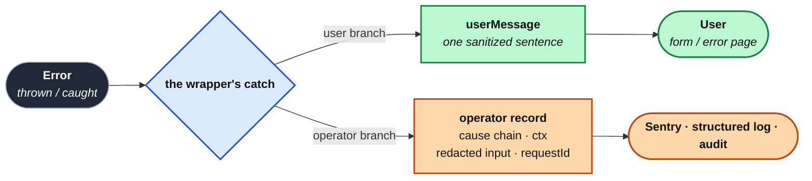

import Figure from '../../../components/figures/Figure.astro';
import AnnotatedCode from '../../../components/code/annotated-code/AnnotatedCode.astro';
import AnnotatedStep from '../../../components/code/annotated-code/AnnotatedStep.astro';
import CodeVariants from '../../../components/code/code-variants/CodeVariants.astro';
import CodeVariant from '../../../components/code/code-variants/CodeVariant.astro';
import Buckets from '../../../components/exercises/buckets/Buckets.astro';
import Bucket from '../../../components/exercises/buckets/Bucket.astro';
import Item from '../../../components/exercises/buckets/Item.astro';
import MultipleChoice from '../../../components/exercises/multiple-choice/MultipleChoice.astro';
import McqChoice from '../../../components/exercises/multiple-choice/McqChoice.astro';
import McqWhy from '../../../components/exercises/multiple-choice/McqWhy.astro';
import ExternalResource from '../../../components/ui/ExternalResource.astro';
import Term from '../../../components/ui/Term.astro';
import CourseProgressBar from '../../../components/ui/CourseProgressBar.astro';
import { CardGrid } from '@astrojs/starlight/components';

<CourseProgressBar value={frontmatter['course-progress']} />

A customer is filling in a form to create an invoice. They pick a slug that another team in their org already used, hit save, and the screen comes back with this:

```text frame="none"
duplicate key value violates unique constraint "invoices_org_id_slug_key"
```

Read that string the way the customer reads it. It tells them nothing to do. It names a table and a column that exist only inside your database. And it admits that *someone else* already took that slug, a fact about another tenant this customer was never meant to learn. One leaked string, three separate problems.

The string was correct: it is exactly what Postgres raised, and an engineer will be glad to have it. The mistake was showing it to the wrong reader. Every error has two readers. The **user** needs one sentence they can act on. The **operator** is anyone who reads the logs and monitoring rather than the UI, the on-call engineer, the support rep, the auditor, and they need everything. So every error is really two artifacts, and they have to diverge at the wrapper, never at the UI.

You have been building toward this without naming it: the primitives from earlier chapters were already splitting the human string from the operator's record. This lesson names that discipline and makes it a rule you audit every seam against. By the end you can look at any error string and answer one question, *is this safe to read aloud on a support call?*, and know exactly where in the code the split belongs.

## The user reads a sentence; the operator reads everything

Two different people read the same failure, and they want opposite things from it.

**The user** is the human staring at the rendered string, in the form or on the error page. They want one plain sentence, in the words of your product, telling them what happened and what to try. A constraint name, a stack frame, an internal ID, or `"an error occurred (code: 0x4a)"` gives them nothing to act on. (Localizing that sentence comes later; it is written for a human either way.)

**The operator** is the engineer reading Sentry, the structured log, and the audit trail, plus the support rep and the auditor. They want everything: the original error and its stack, the <Term definition="The linked list of wrapped errors, walked operator-side by following Error.cause from the outer failure down to the root.">cause chain</Term>, the request context (action name, user, the parsed input Zod produced), and a <Term definition="A per-request id that joins what the user quotes (the digest) to the full operator record. Defined here, wired up in the observability chapter.">correlation ID</Term> that joins what the user quotes back to this record. The operator's artifact is supposed to be fat.

The failure this rule prevents is **conflating the two readers**. Push the operator's artifact at the user and you get the leak. Push the user's artifact at the operator and you get the useless inverse: a log line that says `"Something went wrong"` with no context, so the engineer at 3am has nothing to chase.

<Figure caption="One Error, two artifacts, forked at the wrapper's catch.">

```mermaid
flowchart LR
  err(["<b>Error</b><br/><i>thrown / caught</i>"])
  fork{"<b>the wrapper's catch</b>"}

  msg["<b>userMessage</b><br/><i>one sanitized sentence</i>"]
  user(["<b>User</b><br/><i>form / error page</i>"])

  rec["<b>operator record</b><br/>cause chain · ctx<br/>redacted input · requestId"]
  sink(["<b>Sentry · structured log · audit</b>"])

  err --> fork
  fork -- "user branch" --> msg --> user
  fork -- "operator branch" --> rec --> sink

  class err source
  class fork fork
  class msg,user safe
  class rec,sink internal
  classDef source fill:#1f2937,stroke:#94a3b8,color:#f8fafc
  classDef fork fill:#dbeafe,stroke:#1d4ed8,color:#111,stroke-width:2px
  classDef safe fill:#bbf7d0,stroke:#15803d,color:#111,stroke-width:2px
  classDef internal fill:#fed7aa,stroke:#c2410c,color:#111,stroke-width:2px
```
</Figure>

The split is not something you remember to do when you write the UI. It happens once, at the wrapper, and the two branches never carried the same thing. Hold onto the short version, **one failure, two readers**: the rest of the lesson is that idea showing up at seam after seam.

## The read-aloud test for user messages

A good user message is a short, plain sentence in product terms. These four cover almost everything you'll write:

- *"That slug is already taken."*
- *"You don't have access to this organization."*
- *"This invoice is no longer in draft and can't be edited."*
- *"Something went wrong. Please try again or contact support."*

The last one is the fallback, for when the failure is genuinely unexpected and the system can't say anything more specific. The first three name what happened and imply what to do next. None name a table, a code, or another tenant.

One reflex decides whether a string belongs in front of the user. Call it the **read-aloud test**: a user message is a string a support rep could read aloud, verbatim, on a call with the customer. If the rep would have to *translate* it ("the constraint name means…") or would *leak* something just by saying it, it isn't user-shaped.

Run the test against the things that leak. Each class below pairs a bad string with the safe sentence it should have been:

- **Internal IDs.** *"Invoice 7a9c-… could not be created"* → *"We couldn't create that invoice."*
- **Stack traces or any source reference.** Never, in any form.
- **Database error codes.** *"Error 23505"*, *"constraint invoices_org_id_slug_key"* → *"That value is already taken."*
- **Third-party error strings.** *"Stripe API: webhook signature invalid"* → *"Payment couldn't be processed."*
- **Cross-tenant facts.** *"Another organization already owns this slug"* leaks another tenant's existence → drop the *who*: *"That slug is already taken."*
- **Raw input echoed back.** *"'&lt;script&gt;…' is invalid"* reflects an attacker's payload onto the page → name the field, not the value: *"That URL isn't valid."*
- **Environment names.** *"staging server returned 500"* → fall back to the generic sentence.
- **Secrets, tokens, session IDs.** Never.

Now draw the boundary yourself: drop each string where it belongs.

<Buckets twoCol instructions="Sort each string by whether it's safe to render in the user's form, or whether it leaks and belongs only in the operator's log.">
  <Bucket name="safe" label="Safe to show the user" description="Passes the read-aloud test" />
  <Bucket name="leak" label="Operator-only — leaks if shown" description="A rep couldn't read it aloud" />

  <Item bucket="safe">That slug is already taken.</Item>
  <Item bucket="safe">You don't have access to this organization.</Item>
  <Item bucket="safe">Something went wrong. Please try again.</Item>

  <Item bucket="leak">`duplicate key value violates unique constraint "invoices_org_id_slug_key"`</Item>
  <Item bucket="leak">`Stripe API: webhook signature invalid`</Item>
  <Item bucket="leak">`Error 23505`</Item>
  <Item bucket="leak">`Another organization already owns this slug`</Item>
  <Item bucket="leak">`User usr_3f… lacks role admin`</Item>
</Buckets>

Most people hesitate on the cross-tenant string and the role string. Both read like helpful, specific feedback, and both leak: *"Another organization already owns this slug"* tells the customer a competitor exists in your system, and *"User usr_3f… lacks role admin"* hands out an internal user ID and your role names. Specific is not the same as safe.

## What the operator record carries: captured once, in the catch

Now flip to the operator's side, and flip your instinct with it. The reflex that keeps the user message thin is wrong here: the operator's record is *supposed* to be rich. The more context the structured event carries, the shorter the incident review.

It's a structured event, from which the logger, Sentry, and the audit log each read the parts they care about:

- `error.name` and `error.message`, the raw failure.
- The **cause chain**, walked from the outer error down to the root with the cycle-guarded loop you wrote for the domain error classes.
- The stack.
- `action`, which Server Action or route was running.
- `userId`, `orgId`, and `role`, pulled from the request `ctx`.
- The **parsed** input, the object Zod produced after `safeParse`, never the raw `formData`.
- `requestId`, the correlation ID that ties this event to anything the user quotes.
- The timestamp, plus the route or referrer if the framework hands it over.

Capture all of this in one place: the wrapper's catch, before the user message ever diverges. That structured event is then the single source of truth the operator reads. Capture at each call site instead and every action grows its own shape, with different field names and different context, and the operator can't trust any of them. Capture where the fork lives, and every failure logs the same way.

The record should carry almost everything, with one short list it must **never** carry:

- **Passwords.** The wrapper logs the *parsed* input, and for a sign-in or password-change action that object still holds the password. For those actions, log the action name and `userId` and nothing of the input.
- **Session cookies and tokens.**
- **The user's full PII** when the action had no reason to touch it.
- **A third party's API key.**

You don't enforce that list by remembering it at every log call. You enforce it structurally, with a single <Term definition="The single config that strips known sensitive keys from every operator-side artifact before it is written.">redactor</Term>: one config that strips a known set of sensitive keys (`password`, `token`, `secret`, `apiKey`, `authorization`, `cookie`, `set-cookie`, plus your app's own like `paymentMethodId` and `webhookSecret`) from every operator-side artifact before it's written. The list lives in **one** place, your log library's redaction config and Sentry's `beforeSend` hook, never copy-pasted across call sites. You'll wire that up in a later chapter on observability.

:::note
This is why the project's logging convention puts redaction in configuration, not at call sites: one list to audit, one list to update when a new sensitive field appears.
:::

Now put the two artifacts side by side: the same failure, the same moment, two completely different shapes. Here is the customer's slug collision again, showing what the operator gets and what the user gets.

<CodeVariants>
  <CodeVariant label="Operator log" icon="lucide:server">
    <div data-mark-color="orange">

    ```ts "duplicate key on invoices_org_id_slug_key"
    logger.error(
      {
        action: 'createInvoice',
        orgId,
        userId,
        slug: 'budget-2026',
        code: 'conflict',
        err,
      },
      'insert into invoices failed: duplicate key on invoices_org_id_slug_key',
    );
    ```

    </div>
    **Operator-honest.** Names the table, the tenant, the value, and the cause: everything the on-call engineer needs to reproduce it.
  </CodeVariant>

  <CodeVariant label="User sees" icon="lucide:user">
    <div data-mark-color="green">

    ```ts "That slug is already taken."
    err('conflict', 'That slug is already taken.');
    ```

    </div>
    **User-safe.** One sentence, no IDs, no tenant, no constraint name: the same failure with everything internal stripped out.
  </CodeVariant>
</CodeVariants>

That's the operator's side in one phrase: **operator-honest, user-opaque.** The log tells the truth; the screen gives a sentence.

## Where the split lives: the wrapper, not the UI

You've seen *what* the two artifacts are. The structural question is *where the code splits them*, and the answer mirrors the fail-closed rule's "one place to lint": the split is a property of the **wrapper**, not a discipline you re-apply at every call site.

The fork lands at three seams: the catch block inside `authedAction`, the catch block inside `authedRoute`, and the page's `error.tsx`. Each does the **same two moves**. First it captures the operator record (Sentry, the structured log, and an audit-log entry where the action's domain wants one), then it maps to the user-visible artifact (a `Result`'s `userMessage`, a route's Problem Details body, or the error page's generic copy). The final artifact differs per seam; the shape of the move is identical, and it always lives in the wrapper.

Read the canonical `authedAction` catch through the two-message lens. The block below is paraphrased from the codebase and trimmed to the shape that matters, but the structure is canonical: `authedAction(role, schema, fn)` returns a `(formData) => Promise<Result<TOut>>` and hands your function a `ctx` of `{ user, orgId, role, db }`.

<AnnotatedCode lang="ts" maxLines={18} code={`
export function authedAction(role, schema, fn) {
  return async (formData) => {
    const input = schema.safeParse(Object.fromEntries(formData));
    if (!input.success) return mapError(input.error);

    const ctx = await requireOrgUser();

    try {
      return await fn(input.data, ctx);
    } catch (e) {
      const error = ensureError(e);
      logger.error(
        {
          action: fn.name,
          userId: ctx.user.id,
          orgId: ctx.orgId,
          role: ctx.role,
          input: redact(input.data),
          err: error,
        },
        'action failed',
      );
      Sentry.captureException(error);
      return mapError(error);
    }
  };
}
`}>
  <AnnotatedStep meta="{8-9}" color="blue">
    The `try` wraps your function. The happy path returns its `Result` straight through, and most of the time nothing below here runs.
  </AnnotatedStep>

  <AnnotatedStep meta={`{10-11} "catch (e)" "ensureError(e)"`} color="blue">
    When something throws, narrow the `unknown` exactly once: `catch (e)`, never `e: any`. `ensureError` turns whatever was thrown into a real `Error` you can read.
  </AnnotatedStep>

  <AnnotatedStep meta="{12-23}" color="orange">
    **The operator branch.** Capture the rich record once: action, ctx, the redacted parsed input, and the error with its cause chain. This is the fat artifact from the diagram's lower branch.
  </AnnotatedStep>

  <AnnotatedStep meta="{24}" color="green">
    **The user branch.** Map the error to a sanitized `Result`. For an unmatched failure that's `err('internal', 'Something went wrong. Please try again.')`, the thin artifact from the upper branch.
  </AnnotatedStep>

  <AnnotatedStep meta="{10-25}" color="green">
    Notice what never happens here: `error.message` is read for the *log*, never for the returned `userMessage`. Nothing crosses from the operator branch into the user branch. That's the rule, enforced in one place.
  </AnnotatedStep>
</AnnotatedCode>

The body of a wrapped action is *just the work*: the split is the wrapper's job, not your function's. That is one more reason an action that skips `authedAction` is a bug, it skips the message split along with fail-closed.

## One `mapError` for every error class

The wrapper calls `mapError`, but where does *that* decide a `ZodError` becomes `"Check the highlighted fields."` and a unique violation becomes `"That value is already taken."`? Without a single answer, every action invents its own string for the same failure, and they drift: one says "already taken," another says "duplicate," a third leaks the constraint name because someone was in a hurry. The fix is one small dispatch in `lib/error-mapping.ts`: error in, `{ code, userMessage, fieldErrors? }` out, the one place the split is guaranteed.

```ts title="lib/error-mapping.ts"
export function mapError(error: unknown): Result<never> {
  if (error instanceof ZodError) {
    return err('validation', 'Check the highlighted fields.', z.flattenError(error).fieldErrors);
  }
  if (isUniqueViolation(error)) {
    return err('conflict', 'That value is already taken.');
  }
  if (isForeignKeyViolation(error)) {
    return err('conflict', 'A related record is missing.');
  }
  if (error instanceof InvoiceNotInDraftError) {
    return err('conflict', 'This invoice is no longer in draft and can’t be edited.');
  }
  return err('internal', 'Something went wrong. Please try again.');
}
```

A few rows are worth a note. The `ZodError` branch uses `flattenError`, the project's canonical projection of Zod issues into a flat `Record<string, string[]>`, not `treeifyError`. `isUniqueViolation` reads `.cause` and is already written, so don't re-implement it; an action with more context can override the generic copy (*"That slug is already taken."*). Domain errors like `InvoiceNotInDraftError` map to their own message and code, with no operator detail in the sentence. Anything unmatched falls through to the safe `internal` default.

The rule this file enforces is short: **every new error class lands here once, and every wrapper calls into it.** With no per-action user string, there's nothing per-action to get wrong. Add an error class, add a row, and every seam handles it the same safe way.

While you're here, lock in a separation beginners blur constantly: `code` and `userMessage` are not the same field.

- `code` is the stable **machine** identifier, one of the canonical seven, the same in every locale forever. Analytics group on it; callers branch on it.
- `userMessage` is the **human** string: displayed, eventually translated, free to be reworded by a content designer.

Two anti-patterns come from forgetting this. Never render the `code` as the message, because *"Error: conflict"* is not a sentence anyone wants to read. And never group analytics on the `userMessage`: the moment you translate it, "That slug is already taken." and "Ce slug est déjà pris." become two rows for one failure and your dashboard fractures.

Test that the separation actually landed.

<MultipleChoice>
  A teammate builds the error dashboard so it groups failures by `userMessage` instead of `code`. The dashboard looks fine in staging. What breaks the week you ship French?

  <McqChoice correct>A single failure now shows up as two unrelated rows — one per translated string — so the counts for that error split and the dashboard undercounts it.</McqChoice>
  <McqChoice>Nothing — `userMessage` and `code` carry the same information, so grouping on either is equivalent.</McqChoice>
  <McqChoice>The French strings throw at runtime because `code` expects one of the canonical seven values.</McqChoice>
  <McqChoice>Sentry stops receiving the operator record, because the dashboard owns the capture step.</McqChoice>

  <McqWhy>`code` is the stable machine identifier — one value per failure, in every locale. `userMessage` is the displayed human string, and translation makes one failure wear many strings. Group analytics on `code`; render `userMessage`.</McqWhy>
</MultipleChoice>

This file is named and shown, not built out: recognize the pattern and know where it lives.

## The same split at other seams: routes, pages, webhooks

The fork lives in `authedAction`, but the idea, one failure and two readers, holds at every boundary in the app.
Only the user-facing **artifact** changes from seam to seam; the operator side stays the same.
Here are three more seams through that lens.

### Route handlers: Problem Details

The route twin, `authedRoute`, writes a `Response` instead of a `Result`, so the split lands as <Term definition="The IETF standard for a machine-readable error body in an HTTP API: type, title, status, detail.">RFC 9457</Term> Problem Details.
The project's `problem()` helper produces `{ type, title, status, detail, fieldErrors? }`, which maps straight onto the two readers: `title` is a short user-safe label like *"Conflict"*, `detail` is the user-visible sentence *"That slug is already taken."*, and `fieldErrors` carries the same flat `Record<string, string[]>` the action side uses.
The operator log still captures the full record: route, method, headers minus `authorization` and `cookie`, parsed input, `ctx`, and cause chain.

The symmetry is the point: **actions return a `Result`, routes return Problem Details, the same split wearing different clothes.**
`problemFrom(result.error)` maps a `Result` error to its HTTP status, so one business function feeds both doors.

### Pages: `error.tsx`, `global-error.tsx`, and the `digest`

The page error boundary is where beginners get the split backwards.
You might assume `error.tsx` is where you format the error for the user. It is not.
In a production build, Next.js has **already** stripped `error.message` before it reaches the client and handed you a `digest`, a stable hash of the original error, in its place.
The boundary renders product copy and **never reads `error.message`**.

So the user sees generic copy (*"Something went wrong."*), a recovery link, a retry button, and at most the `digest` as a quotable reference.
The retry prop is `unstable_retry`, not `reset`, and the name change matters: `unstable_retry()` runs `router.refresh()` plus `reset()` inside a `startTransition`, so it re-fetches server data and can recover an error from the Server Component render; bare `reset()` only clears client render state and never re-fetches.

That `digest` is the one piece of operator detail the user is allowed to see, because it is opaque, non-leaky, and joinable.
The user reads it to support, the operator looks it up in Sentry or the log and pulls the full event: it is the user-facing join key.
On the operator side, `error.tsx` is a `'use client'` component whose `useEffect` reports with `Sentry.captureException(error)`.

Here's the minimal shape of that boundary.

```tsx title="app/(app)/error.tsx" "error.digest"
'use client';

import { useEffect } from 'react';
import * as Sentry from '@sentry/nextjs';

export default function Error({
  error,
  unstable_retry,
}: {
  error: Error & { digest?: string };
  unstable_retry: () => void;
}) {
  useEffect(() => {
    Sentry.captureException(error);
  }, [error]);

  return (
    <section>
      <h1>Something went wrong</h1>
      <p>We’re looking into it. You can try again, or head back to your dashboard.</p>
      <button onClick={() => unstable_retry()}>Try again</button>
      {error.digest && <p>Reference: {error.digest}</p>}
    </section>
  );
}
```

`global-error.tsx` wraps the entire shell, so it carries its own `<html>`/`<body>` and reports the same way.
Author the boundary *as if* the framework didn't redact `error.message`: the platform's stripping is a backstop, the design is yours.

### Webhooks: the provider is the "user"

The split holds even with no human present.
When your app receives a webhook from Stripe or Resend, the provider is the "user" reading your response and the on-call engineer is still the operator.
So the response body is minimal Problem Details (`{ type, title, status }`), and the structured log carries the full event: parsed `Stripe-Signature`, timestamp delta, event ID and type, resolved tenant, and the cause chain.
The user-facing artifact is mostly the **status code**, by failure class: 400 for a malformed body, 401 for a bad signature, 409 for a deduped duplicate, 200 for processed, 500 for anything unexpected.
The full webhook flow is its own chapter; the point here is only that the pattern generalizes.

Rate-limit rejections are a clean instance.
`rateLimited(result, gate, key)` returns `err('rate_limited', 'Too many attempts. Please try again later.')`, the **identical opaque message whichever gate tripped**, the IP limiter or the per-email one.
It never leaks *"your email is being limited,"* which would itself be a signal an attacker could use, while the structured log (`rate_limit_rejected`, with gate, key, remaining, reset) carries the operator's full diagnosis.
The route twin, `rateLimitedResponse(result)`, returns a real 429: opaque to the caller, honest to the operator.

## Two product rules the split forces

Two rules fall directly out of the two-message discipline. They live next to the concept because they only make sense as consequences of it.

**Return 404, not 403, on cross-tenant access.** A request hits `/invoices/[id]` for an invoice that exists but belongs to *another* tenant. The instinct is 403 Forbidden, but 403 *admits the resource exists*, and that admission is the leak: the attacker just learned the ID is valid. The split resolves it. On the **user side**, return a generic *"Not found."*, byte-for-byte identical to what a truly missing resource returns, so the attacker can't distinguish "doesn't exist" from "exists but isn't yours." On the **operator side**, log a structured event with a domain marker (`cross_tenant_attempt`), the user, the org, and the requested ID, real intelligence for a security review. The asymmetry is the point: **the user sees a generic 404, the operator sees the truth.**

**Never put an inner exception in the user message.** When an action catches a downstream failure and rewraps it, `new InvoiceCreationError('…', { cause: dbError })`, the `userMessage` is authored at the **outer** layer, never derived from the inner cause. The cause chain belongs to the operator; the user gets the outer class's user-shaped string. The rewrap pattern enforces this *if you let it*: `cause` flows to the operator chain, the new error's mapped `userMessage` flows to the user, and the two never meet. The move that breaks it is pasting `cause.message` into the rendered string, which re-leaks whatever the inner error said, the exact leak from the top of this lesson.

One thing that *looks* like an exception but isn't: **field errors are still user messages.** Zod's `fieldErrors`, like *"Email is invalid"* or *"Must be at least 8 characters"*, are user-visible strings that flow through the same `userMessage` channel rather than bypassing the split. Author them user-shaped at the schema, where Zod's `error` option overrides the engineer-ish default (*"Expected string, received number"* becomes *"Must be a number"*). Render the field-error *strings* only: dumping Zod's raw issue tree into the DOM leaks the shape of your schema.

## Recap: one failure, two readers

Two rules now have names in this chapter. **Fail closed**: when a gate can't prove a request is allowed, it refuses. **Two messages**: every error is two artifacts, a sanitized sentence for the user and a rich record for the operator, forked at the wrapper, never at the UI. That pair is the chapter's whole vocabulary.

Together they give one portable test. For any error, ask: *(1) does it fail closed, and (2) is what the user sees safe to read aloud on a support call?* Two questions, every seam.

Next, you'll walk all six seams in the app end-to-end and point at where each commitment lands and what to grep for to catch a path that bypassed it.

## External resources

<CardGrid>
  <ExternalResource
    title="Error-Message Guidelines"
    href="https://www.nngroup.com/articles/error-message-guidelines/"
    icon="lucide:message-square-warning"
    iconColor="#A4123F"
    description="Nielsen Norman Group's canonical rules for the user-facing sentence — the design behind the read-aloud test."
  />
  <ExternalResource
    title="OWASP Error Handling Cheat Sheet"
    href="https://cheatsheetseries.owasp.org/cheatsheets/Error_Handling_Cheat_Sheet.html"
    icon="simple-icons:owasp"
    iconColor="#000000"
    description="Why leaked internals and differential error messages help attackers — the security case for the operator/user split."
  />
  <ExternalResource
    title="RFC 9457 — Problem Details for HTTP APIs"
    href="https://www.rfc-editor.org/rfc/rfc9457.html"
    icon="lucide:scroll-text"
    iconColor="#0E0E0E"
    description="The IETF spec behind the project's problem() helper — type, title, status, and detail."
  />
  <ExternalResource
    title="Next.js — Error Handling"
    href="https://nextjs.org/docs/app/getting-started/error-handling"
    icon="simple-icons:nextdotjs"
    iconColor="#000000"
    description="The framework reference for the error.tsx boundary, the digest, and the unstable_retry prop."
  />
</CardGrid>
