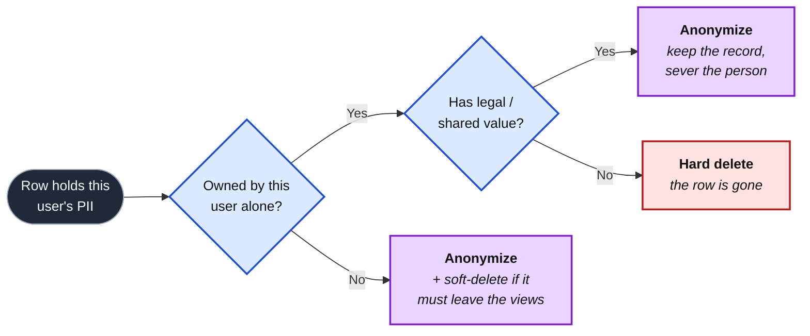

import AnnotatedCode from '../../../components/code/annotated-code/AnnotatedCode.astro';
import AnnotatedStep from '../../../components/code/annotated-code/AnnotatedStep.astro';
import Figure from '../../../components/figures/Figure.astro';
import DeletionJobWalk from '../../../components/lessons/081/4/DeletionJobWalk.astro';
import Buckets from '../../../components/exercises/buckets/Buckets.astro';
import Bucket from '../../../components/exercises/buckets/Bucket.astro';
import Item from '../../../components/exercises/buckets/Item.astro';
import Sequence from '../../../components/exercises/sequence/Sequence.astro';
import Step from '../../../components/exercises/sequence/Step.astro';
import Checklist from '../../../components/ui/checklist/Checklist.astro';
import ChecklistItem from '../../../components/ui/checklist/ChecklistItem.astro';
import ExternalResource from '../../../components/ui/ExternalResource.astro';
import Term from '../../../components/ui/Term.astro';
import CourseProgressBar from '../../../components/ui/CourseProgressBar.astro';
import { Steps, Card, CardGrid } from '@astrojs/starlight/components';

<CourseProgressBar value={frontmatter['course-progress']} />

Two emails land in your support inbox on the same morning. One is from a user: "Delete my account and everything you have on me." The other is from a regulator, or a customer's lawyer, or your own SOC 2 auditor: "How long do you keep data for accounts that have gone inactive?" They feel like different problems. One is a request and one is a question; one is about a single person and one is about a policy. But they are the same engineering problem asked from two directions. Both are legally enforceable, and both come down to one question you'll spend this lesson answering: what is the smallest implementation that removes the right data, never the wrong data, survives a half-failure, and keeps working as your schema grows?

The previous lesson pointed here. You saw that when a user is forgotten, their audit rows get *anonymized* rather than deleted: the record survives, but the identity is severed. That was the rule stated without the machinery to enforce it. This lesson builds the machinery, and the audit log turns out to be just one table in a long list that has to react when a person asks to disappear. By the end you'll be able to take any schema, classify every table by how its rows should be erased and how long they should live, and explain why deleting a single user is one of the most failure-prone jobs in the whole system. You'll also see how to shape that job so it can only ever complete or refuse, never leave a person half-deleted.

One note on framing before any code. This is an engineering lesson, not a law lecture. <Term definition="The EU's General Data Protection Regulation — the 2026 baseline most of the world's privacy regimes have converged toward. It governs how you store and erase personal data.">GDPR</Term>, along with its cousins CCPA in California and LGPD in Brazil, is *why* these requirements exist; it's named once here and then dropped. The legal text, meaning your Privacy Policy and your data-processing agreements, belongs to the legal team. What belongs to you is the catalog and the jobs that enforce it, plus the one document the legal team will copy from you: the list of which outside companies hold your users' data. That boundary is the spine of the lesson, and we'll come back to it at the end.

## Two rights, one shape

Underneath those two emails are two distinct legal obligations. It's worth naming them concretely, because the engineering falls straight out of what each one actually demands.

The first is the **<Term definition="The GDPR right (Article 17) that lets a person demand a company erase their personal data. Also called the right to be forgotten.">right to erasure</Term>**, also known as the right to be forgotten. On request, a person's <Term definition="Personally Identifiable Information — any data that identifies a natural person: name, email, IP address, and so on. It's the data class both of these rights govern.">PII</Term> must be *gone*: not flagged, not hidden, not soft-deleted with the email still sitting in the row, but gone, with a small set of named exceptions we'll get to. The legal clock is "without undue delay, and in any case within one month" of the request. A healthy system doesn't take a month; it takes hours. That one-month deadline is a ceiling you must never blow through, not a target to aim for.

The second is **<Term definition="The GDPR principle that you must not keep personal data longer than the purpose you collected it for requires. It's the legal basis for automated retention limits.">data minimization</Term>**, which shows up in practice as *retention*: every class of data has a maximum lifetime, and an automated process deletes anything past its cutoff. Think of inactive accounts, expired sessions, old email-delivery logs, and stale export files left in object storage. Nothing should live forever, and yet in a database everything *does* live forever unless something deletes it. Retention is the discipline of making that forgetting automatic.

One insight unifies them, and it's the spine of everything below: **both are solved by a declarative catalog that drives a job, never by hand-coded deletes scattered across the app.** Both also force the same per-table decision: *how* does this table's data disappear? There are exactly three answers, which we'll call the three shapes. Get the catalog and the shapes right and both rights are within reach; get them wrong and you'll satisfy neither while believing you've satisfied both.

We'll teach the simpler obligation first. Retention is one scheduled job sweeping a catalog, which makes it easy ground for installing the catalog-drives-job model. Then comes erasure, the harder one: multi-step, fanned out across a dozen tables and three outside vendors, and badly prone to half-failing. Erasure reuses the exact same two models, and that's the whole point: the two rights are one problem viewed twice.

:::note
The legal artifacts, meaning the Privacy Policy, the data-processing agreement, and the standard contractual clauses, are the legal team's deliverable, not yours. Your deliverable is the retention catalog, the deletion job, and the subprocessor list (the roster of outside companies that touch your users' data) that the legal team copies into those documents. Knowing where that line sits keeps you out of the law library and in the codebase.
:::

## The retention catalog and the daily sweep

Start with the question a senior engineer would ask. Data accumulates forever by default: every session row, every email-log entry, and every export file you generated for a one-time download sits in Postgres or object storage until *something* deletes it, and nothing will unless you build that something. What's the smallest implementation that expires each class of data on its own schedule? And, just as important, what keeps it working the day a teammate adds a new table full of PII without remembering this job exists?

The answer is to make the retention policy *data*, not code. It lives in one file, `lib/retention.ts`, as a typed array, the same single-source-of-truth shape you used for the rate-limit policy two lessons ago and the audit-event catalog one lesson ago. Each entry is a small record: the table it governs, the timestamp column the lifetime is measured from, the lifetime itself, and the shape of deletion to apply. Read it one field at a time.

<AnnotatedCode lang="ts" maxLines={16} code={`
type DeletionShape = 'hard' | 'soft' | 'anonymize';

type RetentionPolicy = {
  table: string;
  cutoffColumn: string;
  ttl: Temporal.Duration;
  shape: DeletionShape;
};

export const RETENTION_POLICIES = [
  { table: 'sessions', cutoffColumn: 'lastActivityAt', ttl: Temporal.Duration.from({ days: 90 }), shape: 'hard' },
  { table: 'emailLogs', cutoffColumn: 'createdAt', ttl: Temporal.Duration.from({ days: 30 }), shape: 'hard' },
  { table: 'exportArtifacts', cutoffColumn: 'createdAt', ttl: Temporal.Duration.from({ days: 7 }), shape: 'hard' }, // bytes expire via storage lifecycle
  { table: 'notifications', cutoffColumn: 'createdAt', ttl: Temporal.Duration.from({ days: 90 }), shape: 'hard' },
  { table: 'auditLogs:identity', cutoffColumn: 'createdAt', ttl: Temporal.Duration.from({ years: 2 }), shape: 'hard' },
  { table: 'auditLogs:billing', cutoffColumn: 'createdAt', ttl: Temporal.Duration.from({ years: 7 }), shape: 'hard' },
] as const satisfies readonly RetentionPolicy[];
`}>
  <AnnotatedStep meta="{3-8}" color="blue">
    Each policy is four fields, and this type is the contract every row obeys. A new table with PII means a new row here, never a code change in the job.
  </AnnotatedStep>

  <AnnotatedStep meta={`"cutoffColumn"`} color="blue">
    The column the lifetime is measured *from*. Sessions age from `lastActivityAt`, logs from `createdAt`. The job compares this column against `now − ttl` to decide what's expired.
  </AnnotatedStep>

  <AnnotatedStep meta={`/Temporal\\.Duration\\.from\\([^)]*\\)/`} color="blue">
    The lifetime, expressed as a `Temporal.Duration` rather than a raw millisecond number. Ninety days, seven days, two years: the policy reads like English.
  </AnnotatedStep>

  <AnnotatedStep meta="{16-17}" color="green">
    These two close last lesson's loop. The audit-log retention column was a promise: identity events for two years, billing for seven. Here that promise is kept, because they're rows in the same catalog, swept by the same job.
  </AnnotatedStep>

  <AnnotatedStep meta={`"shape: 'hard'"`} color="blue">
    For a retention sweep the value is almost always `'hard'`, meaning the row is simply removed. The field is shared with the deletion job, which is why the type admits all three shapes. The next section makes shape the decision that governs everything.
  </AnnotatedStep>
</AnnotatedCode>

That last `auditLogs` pair is worth pausing on. Last lesson, the audit-event catalog had a retention column with values like "2y" and "7y," and the lesson told you the timer that enforced them lived here. This is that timer. The audit log isn't special; it's just another set of rows with a lifetime, swept by the same machine as everything else. One catalog covers every class of expiring data, with no exceptions.

Now the job that reads it. It's a Trigger.dev scheduled task that runs once a day, walks the catalog, and for each entry deletes the rows whose cutoff column is older than the lifetime allows. The skeleton is short, so read it for the *shape* rather than to memorize the API you already know.

```ts title="lib/jobs/retention-sweep.ts" {7-11}
export const retentionSweep = schedules.task({
  id: 'retention-sweep',
  cron: '0 3 * * *', // daily, UTC — internal cadence is never a named zone
  run: async () => {
    const now = Temporal.Now.zonedDateTimeISO('UTC');
    for (const policy of RETENTION_POLICIES) {
      const cutoff = now.subtract(policy.ttl).toInstant();
      const deleted = await deleteExpired(policy, cutoff);
      logger.info('retention.swept', { table: policy.table, deleted });
    }
  },
});
```

Four properties make this job correct, and each one is a primitive you already hold from earlier chapters. The value here is seeing them snap together.

**It's catalog-driven, not table-hardcoded.** The body is a loop over `RETENTION_POLICIES`. Adding a table to the policy never edits the job, because the job doesn't know any table's name at author time. This is the spine again: the catalog is data, and the job is a walk over the data. A reviewer can see the whole retention surface in one file, and nobody ever has to remember to "also update the sweep."

**It's idempotent.** Run it twice in a row and the second run deletes nothing extra, because a row that was already past its cutoff is already gone. That idempotency is why a *missed* run is harmless: if the scheduler skips a day, the next day's run catches everything the missed run would have. The same discipline you learned for background jobs lets this one self-heal.

**It must respect tenant scope, and here a slip is worse than a leak.** Some classes are genuinely global (sessions, email logs), and a table-wide time predicate is correct for them. But any tenant-scoped class on a *shared* table must filter by tenant in the delete predicate. Forget that filter and you haven't leaked one tenant's data to another; you've *deleted* it. A retention sweep with a missing tenant filter is a cross-tenant data-loss bug, the inverse of the tenancy discipline you've drilled since the multi-tenancy chapter. A leak is bad, but silently destroying a paying customer's records is worse.

**It runs as a system actor, and it is deliberately not audited.** This one surprises people, so it's worth stating outright. Last lesson drew a hard line: untriggered background jobs that act on nobody's behalf don't write audit rows. The retention sweep is exactly that, because nobody clicked anything and there's no human to attribute the deletions to. So there is *no* `logAudit` call inside this job, on purpose. The per-class counts go to your operator logs, where job history belongs. The instinct to "audit the deletions" is the mistake here.

There's one more move that's pure judgment, and it's about *not* writing code. Look at the `exportArtifacts` row in the catalog. The Postgres row is just metadata: a filename, a size, a key. The actual *bytes* live in object storage, and object storage has native lifecycle rules. Tell the bucket once to expire objects seven days after they're created, and it does so forever, with no job of yours involved. So the retention sweep only deletes the Postgres metadata row, and the blob expiry is delegated to the storage layer that already does it declaratively. The principle generalizes:

:::tip
When retention can be pushed down to the storage layer, push it down. Don't write a job to do what the platform already does for free. Object storage expires blobs on a lifecycle rule; a managed queue drops dead messages on its own; a cache evicts on TTL. The smallest retention implementation is often the one where you configure the platform once and write no job at all.
:::

One class touches the user before it deletes them: an account that's been inactive for three years gets erased, but only after a warning email goes out sixty days ahead. That's the one retention class with a human in the loop, and the warning rides the notification dispatcher you built back in the notifications chapter. The sweep just flags the account, and the dispatcher does the sending.

We won't drill the sweep with an exercise. The real judgment doesn't live in the loop; it lives in the *contents* of the catalog, specifically that `shape` column we kept declaring without explaining. That's the next section, and it's the most reusable decision in the lesson.

## Three deletion shapes

Here's the question that breaks the naive mental model. "Delete this user's data" does not mean `DELETE FROM` everywhere their id appears. A shared invoice has legal value the moment it's issued, and you may be *required* to keep it for seven years. An audit row is the security record of something that happened and can't un-happen. A comment on a document the whole team shares is partly someone else's context, not solely the departing user's to erase. Deleting the row outright is sometimes exactly right, sometimes a compliance violation, and sometimes the destruction of data that isn't theirs to destroy. So which is it?

There are three shapes a row can take when a user's data must go, and the right one depends entirely on who owns the row and whether it carries value beyond that one person.

**Hard delete: the row is removed.** This is for PII the user owns *alone*, with no legal weight and no shared context: their profile row, their sessions, their personal API keys, their notification preferences. Nobody else has a claim on this data and no law requires you to keep it, so the cleanest answer is also the correct one. The row is gone. This is the default for self-owned PII.

**Soft delete: the row stays, but a `deletedAt` timestamp hides it everywhere.** You built this in the soft-delete chapter: the visibility helper filters out any row with `deletedAt` set, so the row vanishes from every list and detail view while staying physically present in the table. This is for rows with shared or legal value that must remain queryable *in context* but disappear from the user's view. Here's the trap that catches everyone: **soft delete alone does not satisfy erasure.** The PII is still sitting in the row, the email and the name and all of it. Soft delete is a *visibility* tool, not an *erasure* tool. It answers "should this still show up?", never "is the personal data gone?"

**Anonymize: the row stays, the PII columns are scrubbed, and the rest survives.** Set the personal fields to null or a stable hash, and keep the forensic and relational data intact. This is the shape for the audit log (last lesson's resolution: null the `actorUserId` through the foreign key, scrub any PII in the payload) and for shared artifacts where the *fact* must persist but the *person* must be severed. "A former member created this record": the record stays, but the member's identity is gone.

The relationship between the last two is the thing to get straight, because it's where the confusion lives. Soft delete answers a *visibility* question. Anonymize answers a *PII-removal* question. The two are independent, which means a shared row a user has asked to be erased from often needs **both**: soft-deleted so it leaves the active views, *and* anonymized so the row that remains holds no personal data. An invoice the user wants gone, but that you're legally required to retain, is soft-deleted from their view and anonymized of their PII. That's two shapes on one row, each answering its own question.

The decision is small enough to run as a flowchart in your head for any table you meet. Walk it left to right.

<Figure caption="A decision you can run for any table: if the user owns it alone with no legal weight, hard-delete; if it's shared or legally retained, anonymize, and soft-delete too when it must leave the views.">

</Figure>

Now tie the shape back to the catalog, because this is the move that makes both rights one problem. The deletion-shape decision is recorded *per table*, in the same catalog mental model as the retention TTLs. One source of truth answers "what happens to this table's rows," and two different jobs read it: the retention sweep reads the TTL column, and the deletion job (next section) reads the shape column. You decide each table's shape once, write it down once, and never improvise it at a call site scattered through the app. That's the whole reason the catalog exists, because improvised deletion logic is how the wrong shape silently violates a right.

Time to make the decision yourself, because this classification is the most transferable judgment in the lesson. Sort each table or row-type into its shape. A couple are deliberately tricky, and those are exactly where the soft-versus-anonymize confusion bites, so reason from "who owns it" and "does it have legal or shared value," not from instinct.

<Buckets instructions="For each table, run the two questions — does this user own it alone, and does it carry legal or shared value — then drop it into the deletion shape that fits.">
  <Bucket name="hard" label="Hard delete" description="Self-owned PII, no legal or shared value" />
  <Bucket name="anon" label="Anonymize" description="Shared or legally retained — keep the row, sever the person" />
  <Bucket name="soft" label="Soft-delete + anonymize" description="Must also vanish from active views" />

  <Item bucket="hard">The user's profile row</Item>
  <Item bucket="hard">The user's active sessions</Item>
  <Item bucket="hard">A personal API key the user created</Item>
  <Item bucket="hard">The user's notification preferences</Item>
  <Item bucket="hard">The user's saved dashboard layout</Item>
  <Item bucket="anon">An audit-log row the user was the actor on</Item>
  <Item bucket="anon">An org membership of a departing member</Item>
  <Item bucket="anon">A record in a shared table stamped "created by" the user</Item>
  <Item bucket="soft">An invoice issued to the user (legally retained ~7y)</Item>
  <Item bucket="soft">A comment the user left on a shared document</Item>
</Buckets>

The invoice and the audit row are the items worth dwelling on if you missed them. Both have legal value, so neither can be hard-deleted, and that's the instinct the exercise is fighting. The invoice additionally has to disappear from the user's active view, so it earns both shapes; the audit row stays visible in the org's history (anonymized), so it's anonymize-only. The shape isn't about how much you want the data gone. It's about what claims, legal and shared, exist on the row.

## The deletion-on-request job

Now the harder right. The user clicks "Delete my account." That single click has to cascade through a dozen Postgres tables, three outside vendors, and your object storage, and it must either finish *completely* or leave a clean, recoverable state. The one outcome you can never allow is a half-deletion: PII partly gone and partly not, with no record of which is which. How do you shape a single click into that guarantee?

The answer splits in two. The click itself is handled by a thin, synchronous Server Action that does almost nothing except hand the real work to a background job, and the job does that work. Keeping the two separate is the whole design.

### The request side: thin, synchronous, auditable

The action that handles the click is the canonical `authedAction` wrapper from the error-discipline chapter. It does four things and then returns, all in milliseconds. Read it as an ordered procedure.

<Steps>
1. **Re-authenticate and authorize.** Deleting your own account is a high-stakes mutation, so it demands a *fresh* session, the `freshAge` elevation rule from the conventions. If the session is older than ten minutes, the action returns a "please re-authenticate" result and the UI re-prompts for the password before trying again. An admin deleting *another* user's account passes the role check instead. Either way, any doubt is a denial: fail closed, the thread that runs through this whole chapter.

2. **Write the audit entry.** The request itself is a privileged, user-attributable action, and it passes last lesson's inclusion test cleanly, so it earns a row: `account.deletion-requested`, written with `logAudit(tx, event)` inside the transaction, attributed to the user who clicked. The request to be forgotten is, ironically, one of the most important events to record. (Its sibling, the `account.deletion-completed` entry the job writes at the end, is *not* user-attributed. The job runs on the user's behalf with no human at the keyboard, so it's the system-actor row last lesson promised: `actorUserId: null`, a `system.*` action.)

3. **Mark the user as deleting, and enqueue the job in the *same* transaction.** Set a status flag on the user row, `deletion_in_progress`, and trigger the background job with the user's id and a stable idempotency key, both inside the transaction the tenant wrapper opened. The flag is load-bearing: the sign-in ladder checks it and refuses to let the user authenticate while their deletion is running. The idempotency key makes a double-click harmless, since the second trigger is a no-op.

4. **Return a confirmation.** The action returns an `ok` result, and the UI shows "Your deletion is in progress; we'll email you when it's complete." It returns immediately, while the actual erasure happens asynchronously, out of the request's critical path.
</Steps>

Step three carries an invariant worth naming, because the bug it prevents is a classic. The flag-set and the enqueue share one transaction, so they commit together or roll back together, and you can *never* end up with the flag set but no job behind it. That failure mode, a user marked "deletion in progress" with nothing actually deleting them, is the silent worst case: the user thinks they've been forgotten, the UI agrees, and the work never happens. Co-committing the flag and the enqueue closes it, the same way `logAudit(tx, …)` co-commits the audit row with its mutation. The transaction is the guarantee.

### The job side: the data-graph walk

This is the centerpiece. The `delete-user` task is a Trigger.dev `schemaTask` with a small Zod payload: the user id and org id. Tasks inherit no auth context, so the identifiers travel in the payload. It walks the user's data graph, applying the shape from the catalog to each table it touches. Both the *order* and the *completeness* matter, so step through it one stage at a time rather than reading it as a flat list, because a flat list is exactly where a skipped step hides.

<DeletionJobWalk />

Three properties make that walk trustworthy, and again each is a primitive you already own.

**It's idempotent and checkpointed.** Every stage is safe to re-run, and the task retries *per step* on failure. A vendor call that fails mid-graph, say Stripe timing out at stage five, resumes from that step on retry. It doesn't restart the whole walk from scratch (which would re-issue the deletes that already succeeded), and it doesn't double-delete (the earlier stages are no-ops the second time through). Step boundaries plus idempotency turn a fragile multi-step job into one that survives partial failure.

**It fails closed on the user, not on the data.** The `deletion_in_progress` flag keeps the user locked out for the entire run. That's deliberate: while the graph is half-walked, the account is in an inconsistent state, and the *last* thing you want is the user signing back in to a half-deleted account. Locking them out for the duration means a partial run is never a *usable* partial run; it's just an in-progress one. Every doubt is a deny, applied this time to a session instead of a permission.

**It completes or it alerts, and it never lies.** If a step fails past all its retries (say Stripe is down for an hour), the job does *not* quietly flip the user to "deleted" and move on. It alerts an operator, and the user sees an honest status. This is the single most important property of the whole job, because the worst possible outcome isn't a failure: it's a *success report with PII still sitting at a vendor*. A job that says "done" when it isn't has converted a recoverable problem into a compliance breach nobody knows about. Honesty under failure is the design.

That fifth stage, the external vendors, deserves a sharp word, because it's where erasure most often quietly fails. Your database can be spotless and the right still unsatisfied, because the user's data is also sitting in Stripe's systems, in Resend's audience, and in PostHog's person store. Each of those is a discrete, retried step in the job. The SDK details are out of scope, so name the three calls, wire them as steps, and move on. But internalize the rule:

:::caution
Skipping a vendor call is the silent-leak failure mode. Your database reads clean, the audit log says "deletion completed," and yet the user's email is still in your Resend audience and their card is still on file at Stripe. Erasure is incomplete the moment *one* processor is missed, and because your own data looks done, nothing flags it. This is exactly why the subprocessor list (the roster of every outside company that holds your users' data) is an engineering deliverable: it's the checklist the deletion job must cover, end to end.
:::

Now order it yourself. The constraints below are the load-bearing ones: re-auth comes first, the request-side audit-and-enqueue happens before any data is touched, the vendor calls and anonymization happen before the final tombstone, and the completion entry comes dead last. Drag the steps into the order they must run.

<Sequence instructions="Order the deletion flow from the click to the confirmation email — the request side first, then the job's graph walk.">
  <Step>Re-authenticate and authorize the request (fresh session, or admin role check)</Step>
  <Step>Write the `account.deletion-requested` audit entry</Step>
  <Step>Mark the user `deletion_in_progress` and enqueue the job in the same transaction</Step>
  <Step>Hard-delete the user's self-owned rows (sessions, API keys, preferences)</Step>
  <Step>Soft-delete and anonymize the shared rows (memberships, invoices, comments)</Step>
  <Step>Anonymize the audit log (null the actor, scrub payload PII)</Step>
  <Step>Delete the user's object-storage blobs</Step>
  <Step>Call the external vendors (Stripe, Resend, PostHog), each retried</Step>
  <Step>Flip the user row to deleted and write `account.deletion-completed`</Step>
  <Step>Send the confirmation email</Step>
</Sequence>

## Don't satisfy half a right

You now have both mechanisms. This last section is about the ways teams ship something that *looks* compliant and isn't, the failure modes that don't belong to any single mechanism but to the obligation as a whole. Treat it as a recognition skill: here is how the wrong implementation looks from the outside, so you can spot it in a review.

Four common half-measures account for most of them. You've met each one in passing, but collected here they become a single recognizable set.

<CardGrid>
  <Card title="Soft-delete without scrubbing" icon="magnifier">
    The row is flagged `deletedAt` and vanishes from every view, yet the user's email, name, and address are all still sitting in it. It *looks* deleted, but it satisfies neither right because the PII never left. Soft delete is visibility, not erasure, so on a row that holds PII it must be paired with anonymize.
  </Card>
  <Card title="Synchronous deletion" icon="error">
    Deleting inline in the request handler. It touches a dozen tables and three vendors, so it blocks the user's request for minutes, and the first timeout leaves a half-wipe with no record of how far it got. Erasure is *always* an async job, for exactly this reason.
  </Card>
  <Card title="Un-scoped retention sweep" icon="warning">
    A retention delete on a shared table with the tenant filter missing. It deletes *another* tenant's rows along with the expired ones. This isn't a leak; it's cross-tenant data *loss*, the worst version of the tenancy mistake, and it runs silently every night until someone notices their data is gone.
  </Card>
  <Card title="Skipped vendor call" icon="random">
    The database is clean and the job reported success, yet the PII is still at Stripe, or Resend, or PostHog. Erasure is incomplete the instant one processor is missed, and because your own data looks done, nothing surfaces it. The subprocessor list is the cure: it's the checklist the job must satisfy.
  </Card>
</CardGrid>

There's a fifth mistake that isn't about the deletion code at all, and most teams get it wrong: **never let real PII into a non-production environment.** It's the cheapest control in this whole lesson and the most commonly violated.

Here's how it fails. Someone copies a production database dump into staging to debug a hard-to-reproduce issue, which looks like a completely normal thing to do. The moment they do, staging becomes an uncontrolled PII store that sits entirely *outside* your retention and erasure machinery. The daily sweep doesn't run there. A user's deletion request hits production and never reaches the staging copy of their data. You've just created a second, unmanaged home for every user's personal data, and you created it with a single `pg_dump`. A deletion request you faithfully honored in production is silently unsatisfied in staging.

The rule is simple and absolute: development and staging seed *synthetic* data only, with emails under a reserved domain that can never reach a real inbox. Use `@example.com` or `@example.test`, set aside by standard precisely so test data can't escape. And you don't trust discipline to hold the line; you enforce it in CI with a check that fails the build the moment a seed email isn't synthetic.

<div data-mark-color="red">

```ts title="scripts/check-seed-emails.ts" {5-8}
const RESERVED = ['@example.com', '@example.test'];

for (const email of seedEmails) {
  const isSynthetic = RESERVED.some((domain) => email.endsWith(domain));
  if (!isSynthetic) {
    console.error(`Non-synthetic seed email: ${email}`);
    process.exit(1); // fail the build
  }
}
```

</div>

The framing here is what makes it land: the cheapest GDPR control is never creating the liability in the first place. Every place real PII *isn't* is a place you never have to erase it from, secure it in, or explain it to an auditor.

One honest exception remains, and naming it closes the loop with last lesson. "Erasure means gone" has a genuine carve-out: data you're legally *required* to retain, such as financial and tax records for about seven years and certain regulated communications, is **anonymized and kept for the legal window** rather than deleted. This is the same resolution you applied to the audit log's seven-year billing class last lesson, now applied to invoices: the record persists, the link to the person is severed, and the completion email is honest about which categories were retained and why. The mechanism is one you already have, anonymize, so there's nothing new to build, only a boundary to state clearly: erasure is the default, legal retention is the named exception, and the user is told the truth about both.

One more reality is worth a sentence, because pretending otherwise would be dishonest: erasure eventually reaches your backups too. A deleted user's data may linger in a backup snapshot until that snapshot ages out of its rotation window. That's expected and acceptable under the law as long as the rotation is bounded and documented, because the backup catches up to the live system on its own schedule. The mechanics of backup rotation are infrastructure, out of scope here; the point is only that "gone" is eventually consistent rather than instantaneous, and that's fine.

This lesson's output is the same kind of artifact every lesson in this chapter produces: the **retention catalog plus the deletion-shape map**, one file that says, for every table, how long its rows live and how they disappear when a user is forgotten. It's grep-able, it's reviewable, and it's one of the deliverables the next chapter audits a seeded codebase against, alongside the security headers, the rate-limit matrix, and the audit-event catalog. Keep every line below tickable.

<Checklist id="retention-erasure">
  <ChecklistItem>Every class of PII-bearing or growing data has a row in `lib/retention.ts` with a cutoff column and a `Temporal.Duration` TTL.</ChecklistItem>
  <ChecklistItem>The retention sweep walks the catalog (never hard-codes a table) and filters by tenant on every shared table.</ChecklistItem>
  <ChecklistItem>Every table has a declared deletion shape — hard, soft-delete + anonymize, or anonymize — decided once in the catalog, never improvised.</ChecklistItem>
  <ChecklistItem>Deletion-on-request is an async, idempotent, checkpointed job that marks the user `deletion_in_progress` and either completes or alerts an operator.</ChecklistItem>
  <ChecklistItem>The deletion job covers every external processor on the subprocessor list — Stripe, Resend, PostHog — each as a discrete retried step.</ChecklistItem>
  <ChecklistItem>No soft-deleted row that holds PII is left unscrubbed; legally retained records are anonymized, not kept intact.</ChecklistItem>
  <ChecklistItem>A CI check fails the build if any seed email isn't under a reserved synthetic domain.</ChecklistItem>
</Checklist>

## External resources

<CardGrid>
  <ExternalResource
    title="GDPR Article 17 — Right to erasure"
    href="https://gdpr-info.eu/art-17-gdpr/"
    icon="lucide:scale"
    iconColor="#1d4ed8"
    description="The legal text behind the right to be forgotten — when erasure applies, and the carve-outs that let a record be retained."
  />
  <ExternalResource
    title="Trigger.dev — Scheduled tasks"
    href="https://trigger.dev/docs/tasks/scheduled"
    icon="lucide:calendar-clock"
    iconColor="#A78BFA"
    description="The schedules.task API behind the daily retention sweep — cron syntax, time zones, and run history."
  />
</CardGrid>
