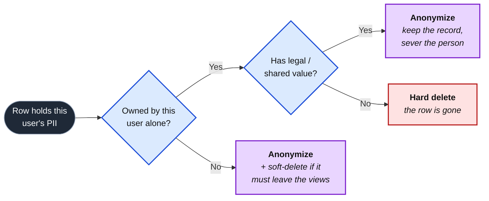

import AnnotatedCode from '../../../components/code/annotated-code/AnnotatedCode.astro';
import AnnotatedStep from '../../../components/code/annotated-code/AnnotatedStep.astro';
import Figure from '../../../components/figures/Figure.astro';
import DeletionJobWalk from '../../../components/lessons/081/4/DeletionJobWalk.astro';
import Buckets from '../../../components/exercises/buckets/Buckets.astro';
import Bucket from '../../../components/exercises/buckets/Bucket.astro';
import Item from '../../../components/exercises/buckets/Item.astro';
import Sequence from '../../../components/exercises/sequence/Sequence.astro';
import Step from '../../../components/exercises/sequence/Step.astro';
import Checklist from '../../../components/ui/checklist/Checklist.astro';
import ChecklistItem from '../../../components/ui/checklist/ChecklistItem.astro';
import ExternalResource from '../../../components/ui/ExternalResource.astro';
import Term from '../../../components/ui/Term.astro';
import CourseProgressBar from '../../../components/ui/CourseProgressBar.astro';
import { Steps, Card, CardGrid } from '@astrojs/starlight/components';

<CourseProgressBar value={frontmatter['course-progress']} />

Two emails land in your support inbox the same morning.
A user writes, "Delete my account and everything you have on me."
A regulator, a customer's lawyer, or your SOC 2 auditor asks, "How long do you keep data for accounts that have gone inactive?"
One is about a person, the other about a policy, but both are legally enforceable and both are the same engineering problem: erase the right data, never the wrong data, survive a half-failure, and keep working as your schema grows.

<Term definition="The EU's General Data Protection Regulation — the 2026 baseline most of the world's privacy regimes have converged toward. It governs how you store and erase personal data.">GDPR</Term> is why these requirements exist, but the legal text belongs to the legal team; what belongs to you is the catalog and the jobs that enforce it.

## Two obligations, one catalog-driven job

Underneath those two emails sit two distinct legal obligations, and the engineering falls straight out of what each one demands.

The first is the **<Term definition="The GDPR right (Article 17) that lets a person demand a company erase their personal data. Also called the right to be forgotten.">right to erasure</Term>**, also known as the right to be forgotten.
On request, a person's <Term definition="Personally Identifiable Information — any data that identifies a natural person: name, email, IP address, and so on. It's the data class both of these rights govern.">PII</Term> must be *gone*: not flagged, not hidden, not soft-deleted with the email still in the row, save for a few named exceptions we'll get to.
The legal clock is "without undue delay, and in any case within one month" of the request, a ceiling you must never blow through, not a target; a healthy system erases in hours.

The second is **<Term definition="The GDPR principle that you must not keep personal data longer than the purpose you collected it for requires. It's the legal basis for automated retention limits.">data minimization</Term>**, which shows up in practice as *retention*: every class of data has a maximum lifetime, and an automated process deletes anything past its cutoff.
In a database everything lives forever unless something deletes it; retention makes that forgetting automatic for inactive accounts, expired sessions, old delivery logs, and stale export files.

One insight unifies them: **both are solved by a declarative catalog that drives a job, never by hand-coded deletes scattered across the app.**
Both also force the same per-table decision: *how* does this table's data disappear?
There are exactly three answers, the three shapes, and getting them wrong satisfies neither right while you believe you've satisfied both.

Retention is the simpler one and comes first: a single scheduled job sweeping a catalog.
Erasure then reuses that model, fanned out across a dozen tables and three vendors and prone to half-failing.

## The retention catalog and the daily sweep

Data accumulates forever by default.
Every session row, email-log entry, and one-time export file sits in Postgres or object storage until something deletes it, and nothing will unless you build it.
So what's the smallest implementation that expires each class of data on its own schedule, and keeps working the day a teammate adds a new table full of PII without knowing this job exists?

Make the retention policy data, not code.
It lives in one file, `lib/retention.ts`, as a typed array, the single-source-of-truth shape you used for the rate-limit policy and the audit-event catalog.
Each entry records the table it governs, the timestamp column the lifetime is measured from, the lifetime, and the shape of deletion to apply.

<AnnotatedCode lang="ts" maxLines={16} code={`
type DeletionShape = 'hard' | 'soft' | 'anonymize';

type RetentionPolicy = {
  table: string;
  cutoffColumn: string;
  ttl: Temporal.Duration;
  shape: DeletionShape;
};

export const RETENTION_POLICIES = [
  { table: 'sessions', cutoffColumn: 'lastActivityAt', ttl: Temporal.Duration.from({ days: 90 }), shape: 'hard' },
  { table: 'emailLogs', cutoffColumn: 'createdAt', ttl: Temporal.Duration.from({ days: 30 }), shape: 'hard' },
  { table: 'exportArtifacts', cutoffColumn: 'createdAt', ttl: Temporal.Duration.from({ days: 7 }), shape: 'hard' }, // bytes expire via storage lifecycle
  { table: 'notifications', cutoffColumn: 'createdAt', ttl: Temporal.Duration.from({ days: 90 }), shape: 'hard' },
  { table: 'auditLogs:identity', cutoffColumn: 'createdAt', ttl: Temporal.Duration.from({ years: 2 }), shape: 'hard' },
  { table: 'auditLogs:billing', cutoffColumn: 'createdAt', ttl: Temporal.Duration.from({ years: 7 }), shape: 'hard' },
] as const satisfies readonly RetentionPolicy[];
`}>
  <AnnotatedStep meta="{3-8}" color="blue">
    Four fields, the contract every row obeys. A new table with PII means a new row here, never a code change in the job.
  </AnnotatedStep>

  <AnnotatedStep meta={`"cutoffColumn"`} color="blue">
    The column the lifetime is measured *from*. Sessions age from `lastActivityAt`, logs from `createdAt`; the job compares it against `now − ttl` to find expired rows.
  </AnnotatedStep>

  <AnnotatedStep meta={`/Temporal\\.Duration\\.from\\([^)]*\\)/`} color="blue">
    The lifetime as a `Temporal.Duration`, not a raw millisecond count, so the policy reads like English.
  </AnnotatedStep>

  <AnnotatedStep meta="{16-17}" color="green">
    These keep last lesson's promise: identity events held two years, billing seven, now rows in the same catalog swept by the same job.
  </AnnotatedStep>

  <AnnotatedStep meta={`"shape: 'hard'"`} color="blue">
    For a retention sweep the shape is almost always `'hard'`: the row is simply removed. The field is shared with the deletion job, which is why the type admits all three shapes. The next section makes shape the decision that governs everything.
  </AnnotatedStep>
</AnnotatedCode>

The `auditLogs` rows show one catalog covering everything.
Last lesson's audit-event catalog set retention values like "2y" and "7y"; this sweep is the timer that enforces them.
The audit log isn't special, just another set of rows with a lifetime, swept by the same machine as the rest.

The job that reads it is a Trigger.dev scheduled task that runs once a day, walks the catalog, and for each entry deletes the rows whose cutoff column is older than the lifetime allows.

```ts title="lib/jobs/retention-sweep.ts" {7-11}
export const retentionSweep = schedules.task({
  id: 'retention-sweep',
  cron: '0 3 * * *', // daily, UTC — internal cadence is never a named zone
  run: async () => {
    const now = Temporal.Now.zonedDateTimeISO('UTC');
    for (const policy of RETENTION_POLICIES) {
      const cutoff = now.subtract(policy.ttl).toInstant();
      const deleted = await deleteExpired(policy, cutoff);
      logger.info('retention.swept', { table: policy.table, deleted });
    }
  },
});
```

Four properties make this job correct, each a primitive you already hold.

**It's catalog-driven, not table-hardcoded.**
The body is a loop over `RETENTION_POLICIES`; the job knows no table name at author time.
Adding a table edits the policy, never the job, so a reviewer sees the whole retention surface in one file and nobody has to remember to also update the sweep.

**It's idempotent.**
Run it twice and the second run deletes nothing extra, because a row past its cutoff is already gone.
So a missed run is harmless: the next day's run catches everything the skipped one would have.

**It must respect tenant scope, where a slip is worse than a leak.**
Some classes are genuinely global, like sessions and email logs, and a table-wide time predicate is correct for them.
Any tenant-scoped class on a shared table must filter by tenant in the delete predicate.
Forget that filter and you haven't leaked one tenant's data to another, you've deleted it, and silently destroying a paying customer's records is worse than exposing them.

**It runs as a system actor, and is deliberately not audited.**
Background jobs that act on nobody's behalf don't write audit rows, and the sweep is exactly that: nobody clicked anything, so there's no human to attribute the deletions to.
The per-class counts go to your operator logs, where job history belongs.

The `exportArtifacts` Postgres row is just metadata: a filename, a size, a key.
The actual bytes live in object storage, which has native lifecycle rules.
Tell the bucket once to expire objects seven days after creation and it does so forever, so the sweep deletes only the Postgres row and delegates the blob expiry to the storage layer.

:::tip
When retention can be pushed down to the storage layer, push it down; don't write a job to do what the platform already does for free.
Object storage expires blobs on a lifecycle rule, a managed queue drops dead messages on its own, a cache evicts on TTL.
The smallest retention implementation is often the one where you configure the platform once and write no job at all.
:::

One class touches the user before deleting them: an account inactive for three years is erased, but only after a warning email sixty days ahead, sent through the notification dispatcher from the notifications chapter.
The sweep flags the account; the dispatcher sends.

The remaining judgment is the `shape` column, which we kept declaring without explaining: the next section, and the most reusable decision in the lesson.

## Three deletion shapes

"Delete this user's data" rarely means `DELETE FROM` everywhere their id appears.
A shared invoice has legal value the moment it's issued, and you may be required to keep it for seven years.
An audit row is the security record of something that happened and can't un-happen.
A comment on a shared document is partly someone else's context, not the departing user's to erase.
So deleting the row outright is sometimes correct, sometimes a compliance violation, and sometimes the destruction of data that isn't theirs to destroy.

A row a user wants gone can take one of three shapes, and the right one depends on who owns the row and whether it carries value beyond that person.

**Hard delete: the row is removed.**
This is for PII the user owns alone, with no legal weight and no shared context: their profile, sessions, personal API keys, notification preferences.
Nobody else has a claim and no law requires you to keep it, so the cleanest answer is the correct one.
Hard delete is the default for self-owned PII.

**Soft delete: the row stays, but a `deletedAt` timestamp hides it everywhere.**
You built this in the soft-delete chapter: the visibility helper filters out any row with `deletedAt` set, so the row vanishes from every list and detail view while staying physically present.
Use it for rows that must remain queryable in context but disappear from the user's view.
The trap: **soft delete alone does not satisfy erasure.** The email, the name, all of it is still in the row.
Soft delete answers "should this still show up?", never "is the personal data gone?"

**Anonymize: the row stays, the PII columns are scrubbed, the rest survives.**
Set the personal fields to null or a stable hash and keep the forensic and relational data intact.
This is the shape for the audit log (null the `actorUserId`, scrub any PII in the payload) and for shared artifacts where the fact must persist but the person must be severed: "a former member created this record" keeps the record and drops the identity.

These two answer independent questions: soft delete decides visibility, anonymize decides PII removal.
So a shared row a user asks to be erased from often needs **both** — soft-deleted to leave the active views, and anonymized so what remains holds no personal data.
An invoice you must legally retain is the case in point: soft-deleted from the user's view, anonymized of their PII, two shapes on one row.

Run this decision as a flowchart for any table you meet.

<Figure caption="Run this for any table: if the user owns it alone with no legal weight, hard-delete; otherwise anonymize, and soft-delete too when it must leave the views.">

```mermaid
%%{init: {'themeCSS': '.nodeLabel, .nodeLabel * { font-size: 15px !important; } .edgeLabel, .edgeLabel * { font-size: 14px !important; }'} }%%
flowchart LR
  pii(["Row holds this<br/>user's PII"])
  owned{"Owned by this<br/>user alone?"}
  legal{"Has legal /<br/>shared value?"}

  anonShared["<b>Anonymize</b><br/><i>+ soft-delete if it<br/>must leave the views</i>"]
  anonLegal["<b>Anonymize</b><br/><i>keep the record,<br/>sever the person</i>"]
  hard["<b>Hard delete</b><br/><i>the row is gone</i>"]

  pii --> owned
  owned -- No --> anonShared
  owned -- Yes --> legal
  legal -- Yes --> anonLegal
  legal -- No --> hard

  class pii start
  class owned,legal gate
  class anonShared,anonLegal anon
  class hard hard
  classDef start fill:#1f2937,stroke:#94a3b8,color:#f8fafc
  classDef gate fill:#dbeafe,stroke:#1d4ed8,color:#111,stroke-width:2px
  classDef anon fill:#e9d5ff,stroke:#7e22ce,color:#111,stroke-width:2px
  classDef hard fill:#fee2e2,stroke:#b91c1c,color:#111,stroke-width:2px
```
</Figure>

Record the shape per table, alongside the retention TTLs in the same catalog: the retention sweep reads the TTL column, the deletion job (next section) reads the shape column.
Deciding once and writing it down beats improvising the shape at call sites, where the wrong choice silently violates a right.

Now sort each table into its shape.
A couple are deliberately tricky, so reason from "who owns it" and "does it have legal or shared value."

<Buckets instructions="For each table, ask the two questions — does this user own it alone, and does it carry legal or shared value — then drop it into the shape that fits.">
  <Bucket name="hard" label="Hard delete" description="Self-owned PII, no legal or shared value" />
  <Bucket name="anon" label="Anonymize" description="Shared or legally retained — keep the row, sever the person" />
  <Bucket name="soft" label="Soft-delete + anonymize" description="Must also vanish from active views" />

  <Item bucket="hard">The user's profile row</Item>
  <Item bucket="hard">The user's active sessions</Item>
  <Item bucket="hard">A personal API key the user created</Item>
  <Item bucket="hard">The user's notification preferences</Item>
  <Item bucket="hard">The user's saved dashboard layout</Item>
  <Item bucket="anon">An audit-log row the user was the actor on</Item>
  <Item bucket="anon">An org membership of a departing member</Item>
  <Item bucket="anon">A record in a shared table stamped "created by" the user</Item>
  <Item bucket="soft">An invoice issued to the user (legally retained ~7y)</Item>
  <Item bucket="soft">A comment the user left on a shared document</Item>
</Buckets>

The invoice and the audit row are the trap.
Both have legal value, so neither can be hard-deleted, and the difference is what happens next: the invoice must also leave the user's active view, so it earns both shapes, while the anonymized audit row stays visible in the org's history, so it's anonymize-only.
The shape isn't how much you want the data gone; it's what legal and shared claims exist on the row.

## The deletion-on-request job

Now the harder right.
A user clicks "Delete my account," and that click has to cascade through a dozen Postgres tables, three outside vendors, and your object storage.
It must finish *completely* or leave a clean, recoverable state.
The outcome you can never allow is a half-deletion: PII partly gone, partly not, with no record of which is which.

Split the click in two: a thin, synchronous Server Action handles the click and hands the real work to a background job, which does the erasing.

### The request side: thin, synchronous, auditable

The action is the `authedAction` wrapper from the error-discipline chapter.
It does four things in milliseconds, in order, and returns.

<Steps>
1. **Re-authenticate and authorize.** Deleting your own account demands a *fresh* session under the `freshAge` rule: if the session is older than ten minutes, the action returns "please re-authenticate" and the UI re-prompts for the password. An admin deleting *another* user's account passes the role check instead. Either way, any doubt is a denial.

2. **Write the audit entry.** The request passes last lesson's inclusion test, so it earns an `account.deletion-requested` row, written with `logAudit(tx, event)` inside the transaction and attributed to the user who clicked.

3. **Mark the user as deleting, and enqueue the job in the *same* transaction.** Set the `deletion_in_progress` flag on the user row and trigger the job with the user's id and a stable idempotency key, both inside the tenant wrapper's transaction. The flag is load-bearing: the sign-in ladder checks it and refuses to authenticate a user mid-deletion. The idempotency key makes a double-click harmless, since the second trigger is a no-op.

4. **Return a confirmation.** The action returns `ok` and the UI shows "Your deletion is in progress; we'll email you when it's complete." The erasure runs asynchronously, off the request's critical path.
</Steps>

Because the flag-set and the enqueue share one transaction, they commit or roll back together, so you can never set the flag without a job behind it.
That closes the silent worst case: a user marked "deletion in progress" with nothing actually deleting them, where the UI agrees they've been forgotten and the work never happens.

### The job side: the data-graph walk

The `delete-user` task is a Trigger.dev `schemaTask` with a small Zod payload, the user id and org id; tasks inherit no auth context, so the identifiers travel in the payload.
It walks the user's data graph, applying each table's catalog shape, and both the *order* and the *completeness* matter.

<DeletionJobWalk />

Three properties make that walk trustworthy, each a primitive you already own.

**It's idempotent and checkpointed.**
Every stage is safe to re-run, and the task retries *per step*.
When Stripe times out at stage five, the retry resumes from that step rather than restarting the walk: earlier stages are no-ops the second time through, so nothing is re-issued or double-deleted.

**It fails closed on the user, not on the data.**
The `deletion_in_progress` flag keeps the user locked out for the entire run.
A half-walked graph is an inconsistent account, and the last thing you want is the user signing back in to it, so locking them out means a partial run is never a *usable* one.

**It completes or it alerts, and it never lies.**
If a step fails past all its retries, the job does *not* quietly flip the user to "deleted."
It alerts an operator, and the user sees an honest status.
This is the job's most important property: the worst outcome isn't a failure, it's a *success report with PII still sitting at a vendor*, which converts a recoverable problem into a compliance breach nobody knows about.

The fifth stage, the external vendors, is where erasure most often fails quietly, because the user's data also sits in Stripe, in Resend's audience, and in PostHog's person store.
The SDK details are out of scope, so name the three calls, wire them as retried steps, and internalize the rule.

:::caution
Skipping a vendor call is the silent-leak failure mode.
Your database reads clean and the audit log says "deletion completed," yet the user's email is still in your Resend audience and their card is still on file at Stripe.
Erasure is incomplete the moment *one* processor is missed, and because your own data looks done, nothing flags it.
This is why the <Term definition="The list of third-party vendors that process your users' personal data on your behalf — Stripe, Resend, PostHog, and the like. GDPR requires you to publish it, and erasure has to reach every name on it.">subprocessor list</Term> is an engineering deliverable: it's the checklist the deletion job must cover, end to end.
:::

Now order it yourself, from the click to the confirmation email.

<Sequence instructions="Order the deletion flow from the click to the confirmation email: the request side first, then the job's graph walk.">
  <Step>Re-authenticate and authorize the request (fresh session, or admin role check)</Step>
  <Step>Write the `account.deletion-requested` audit entry</Step>
  <Step>Mark the user `deletion_in_progress` and enqueue the job in the same transaction</Step>
  <Step>Hard-delete the user's self-owned rows (sessions, API keys, preferences)</Step>
  <Step>Soft-delete and anonymize the shared rows (memberships, invoices, comments)</Step>
  <Step>Anonymize the audit log (null the actor, scrub payload PII)</Step>
  <Step>Delete the user's object-storage blobs</Step>
  <Step>Call the external vendors (Stripe, Resend, PostHog), each retried</Step>
  <Step>Flip the user row to deleted and write `account.deletion-completed`</Step>
  <Step>Send the confirmation email</Step>
</Sequence>

## Compliance failures to catch in review

You have both mechanisms.
These failures belong to neither one but to the obligation as a whole: implementations that look compliant and aren't.

<CardGrid>
  <Card title="Soft-delete without scrubbing" icon="magnifier">
    The row is flagged `deletedAt` and gone from every view, but its email, name, and address remain. Soft delete is visibility, not erasure; on a row holding PII, pair it with anonymize.
  </Card>
  <Card title="Synchronous deletion" icon="error">
    Deleting inline in the request handler. It spans a dozen tables and three vendors, blocks the request for minutes, and the first timeout leaves a half-wipe with no record of how far it got. Erasure is always an async job.
  </Card>
  <Card title="Un-scoped retention sweep" icon="warning">
    A retention delete on a shared table with the tenant filter missing takes another tenant's rows along with the expired ones. That is silent cross-tenant data *loss*, running every night until someone notices their data is gone.
  </Card>
  <Card title="Skipped vendor call" icon="random">
    The database is clean and the job reported success, yet PII still sits at Stripe, Resend, or PostHog. One missed processor makes erasure incomplete, and your own data looks done, so nothing surfaces it. The subprocessor list is the checklist the job must satisfy.
  </Card>
</CardGrid>

A fifth mistake isn't in the deletion code at all, and most teams get it wrong: **never let real PII into a non-production environment.**
It's the cheapest control in the lesson and the most commonly violated.

Someone copies a production database dump into staging to debug a hard-to-reproduce issue, and with one `pg_dump` creates a second, unmanaged home for every user's data.
Staging sits outside your retention and erasure machinery: the daily sweep doesn't run there, and a deletion honored in production never reaches the copy.

The rule is absolute: development and staging seed *synthetic* data only, with emails under a reserved domain that can never reach a real inbox.
Use `@example.com` or `@example.test`, set aside by standard so test data can't escape.
Enforce it in CI with a check that fails the build the moment a seed email isn't synthetic.

<div data-mark-color="red">

```ts title="scripts/check-seed-emails.ts" {5-8}
const RESERVED = ['@example.com', '@example.test'];

for (const email of seedEmails) {
  const isSynthetic = RESERVED.some((domain) => email.endsWith(domain));
  if (!isSynthetic) {
    console.error(`Non-synthetic seed email: ${email}`);
    process.exit(1); // fail the build
  }
}
```

</div>

Every place real PII *isn't* is a place you never have to erase it from, secure it in, or explain it to an auditor.

One exception to "erasure means gone" remains: data you're legally *required* to retain, such as financial and tax records for about seven years, is **anonymized and kept for the legal window** rather than deleted.
The record persists, its link to the person is severed, and the completion email is honest about which categories were retained and why.

Erasure reaches your backups too, eventually.
A deleted user's data may linger in a backup snapshot until that snapshot ages out of its rotation window.
The law accepts this as long as the rotation is bounded and documented; "gone" is eventually consistent, not instantaneous.

This lesson's deliverable is the **retention catalog plus the deletion-shape map**: one file that says, for every table, how long its rows live and how they disappear when a user is forgotten.
Keep every line below tickable.

<Checklist id="retention-erasure">
  <ChecklistItem>Every class of PII-bearing or growing data has a row in `lib/retention.ts` with a cutoff column and a `Temporal.Duration` TTL.</ChecklistItem>
  <ChecklistItem>The retention sweep walks the catalog (never hard-codes a table) and filters by tenant on every shared table.</ChecklistItem>
  <ChecklistItem>Every table has a declared deletion shape — hard, soft-delete + anonymize, or anonymize — decided once in the catalog, never improvised.</ChecklistItem>
  <ChecklistItem>Deletion-on-request is an async, idempotent, checkpointed job that marks the user `deletion_in_progress` and either completes or alerts an operator.</ChecklistItem>
  <ChecklistItem>The deletion job covers every external processor on the subprocessor list — Stripe, Resend, PostHog — each as a discrete retried step.</ChecklistItem>
  <ChecklistItem>No soft-deleted row that holds PII is left unscrubbed; legally retained records are anonymized, not kept intact.</ChecklistItem>
  <ChecklistItem>A CI check fails the build if any seed email isn't under a reserved synthetic domain.</ChecklistItem>
</Checklist>

## External resources

<CardGrid>
  <ExternalResource
    title="GDPR Article 17 — Right to erasure"
    href="https://gdpr-info.eu/art-17-gdpr/"
    icon="lucide:scale"
    iconColor="#1d4ed8"
    description="The legal text behind the right to be forgotten — when erasure applies, and the carve-outs that let a record be retained."
  />
  <ExternalResource
    title="Trigger.dev — Scheduled tasks"
    href="https://trigger.dev/docs/tasks/scheduled"
    icon="lucide:calendar-clock"
    iconColor="#A78BFA"
    description="The schedules.task API behind the daily retention sweep — cron syntax, time zones, and run history."
  />
</CardGrid>
