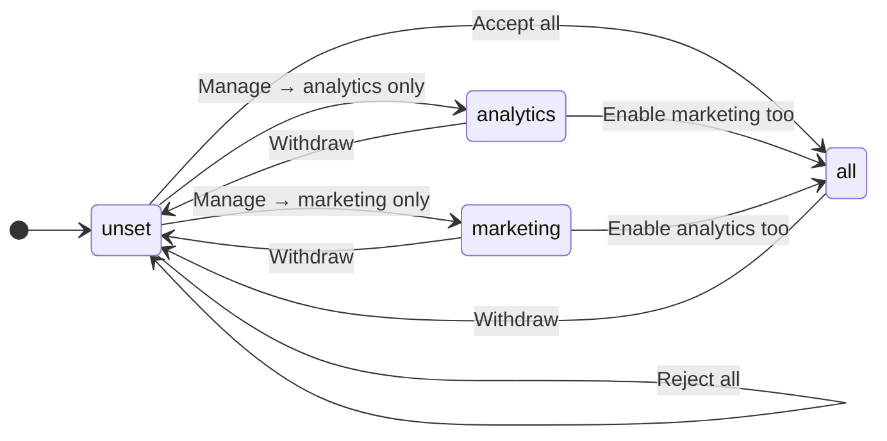

import AnnotatedCode from '../../../components/code/annotated-code/AnnotatedCode.astro';
import AnnotatedStep from '../../../components/code/annotated-code/AnnotatedStep.astro';
import CodeTooltips from '../../../components/code/CodeTooltips.astro';
import Figure from '../../../components/figures/Figure.astro';
import PreConsentTimeline from '../../../components/lessons/081/5/PreConsentTimeline.astro';
import BannerAnatomy from '../../../components/lessons/081/5/BannerAnatomy.astro';
import BannerGoodBad from '../../../components/lessons/081/5/BannerGoodBad.astro';
import StateMachineWalker from '../../../components/figures/state-machine-walker/StateMachineWalker.astro';
import Question from '../../../components/figures/state-machine-walker/Question.astro';
import Branch from '../../../components/figures/state-machine-walker/Branch.astro';
import Buckets from '../../../components/exercises/buckets/Buckets.astro';
import Bucket from '../../../components/exercises/buckets/Bucket.astro';
import Item from '../../../components/exercises/buckets/Item.astro';
import TrueFalse from '../../../components/exercises/true-false/TrueFalse.astro';
import Statement from '../../../components/exercises/true-false/Statement.astro';
import TfWhy from '../../../components/exercises/true-false/TfWhy.astro';
import MultipleChoice from '../../../components/exercises/multiple-choice/MultipleChoice.astro';
import McqChoice from '../../../components/exercises/multiple-choice/McqChoice.astro';
import McqWhy from '../../../components/exercises/multiple-choice/McqWhy.astro';
import Checklist from '../../../components/ui/checklist/Checklist.astro';
import ChecklistItem from '../../../components/ui/checklist/ChecklistItem.astro';
import ExternalResource from '../../../components/ui/ExternalResource.astro';
import VideoCallout from '../../../components/embeds/VideoCallout.astro';
import Term from '../../../components/ui/Term.astro';
import CourseProgressBar from '../../../components/ui/CourseProgressBar.astro';
import { CardGrid } from '@astrojs/starlight/components';

<CourseProgressBar value={frontmatter['course-progress']} />

Later in the course you'll wire up PostHog: product analytics and session replay, the tooling that tells you which features people actually use. That work is a way off, but the thing it depends on has to exist first, and it's the thing teams almost always build backwards.

The backwards version is everywhere. A cookie banner pops up, the user clicks "Accept," a boolean flips to `true`, and the analytics SDK boots. It feels correct, but it isn't, and the reason is a matter of milliseconds. By the time that banner rendered, the page had already loaded the analytics script, which had already opened a connection and very possibly already fired a pageview. The user hadn't chosen yet. That one event, the pageview that fired before the click, is the violation. <Term definition="The EU's General Data Protection Regulation, which governs how personal data is processed.">GDPR</Term> and the <Term definition="The EU's ePrivacy Directive — the 'cookie law.' It governs storage of and access to information on a user's device, which is why it, not GDPR, is what makes a cookie banner mandatory.">ePrivacy Directive</Term> don't ask for consent eventually. They ask for <Term definition="Consent must come before the processing, not after it. A tracker that fires and then asks has already broken the rule.">prior consent</Term>: the consent has to come *before* anything non-essential runs, not after.

So this lesson is not really about a banner. A banner is the easy part. It's about a rule, and the rule is unforgiving: **nothing non-essential fires before the user has chosen.** What makes the whole thing tractable is to stop thinking of the banner as a legal checkbox and start thinking of it as an engineering gate with one source of truth. Exactly one place knows whether tracking is allowed, every third party reads from that one place, and the gate is built so that "allowed" is impossible to observe before the user has said yes.

You already have the pieces. You have a root `<Providers>` Client Component from the TanStack Query chapter, and this gate is one more provider mounted inside it. You can read a cookie on the server with `await cookies()` and hand it to a Client Component, which is exactly how the banner avoids flashing on every page load. You write state changes through Server Actions that return a `Result`, and you have `logAudit(tx, event)` for recording trust-relevant decisions. Every tool this lesson needs, you've used before. What's new is the discipline that ties them together, plus a single hook, `useConsent()`, that becomes the only place in the app that knows the answer.

## Essential or not: the one test that decides everything

Before any code, one decision sits upstream of everything else, and getting it right makes the rest follow almost mechanically. You have to sort every cookie and every tracker your app sets into exactly two buckets: the ones that need consent, and the ones that don't. A single legal test draws the line, and it's worth memorizing word for word:

:::note
A cookie or tracker is **essential** only if it is **strictly necessary for the service the user explicitly asked for.** Everything else needs consent.
:::

The two phrases doing the heavy lifting are *strictly necessary* and *explicitly asked for*, and you should read them strictly. <Term definition="The exact phrase the ePrivacy Directive uses for cookies that are exempt from the consent requirement. The bar is high on purpose: the cookie must be indispensable to a service the user actively requested.">Strictly necessary</Term> means the service genuinely breaks without it: not "it's helpful," not "the business wants it," but the thing the user came to do does not work. And "the service the user explicitly asked for" means the user's request, not the business's interests. This is the trap, so it's worth stating plainly: analytics helps the business, never the user's requested service, so analytics is never essential, no matter how indispensable it feels to you. The user came to send an invoice. They did not come to be measured.

Apply the test to your own app and the buckets resolve cleanly. On the essential side sit the Better Auth session cookie (the `__Host-`-prefixed, `HttpOnly; Secure; SameSite=Lax` cookie that keeps the user logged in), the CSRF token, and the active-org cookie that remembers which organization the user is currently working in. Without those, the user cannot stay signed in or do their work, so they are strictly necessary for the service requested. There's also one essential cookie almost everyone misses, and it's worth its own beat:

:::tip
The cookie that *records the consent choice itself* is essential. You cannot ask for consent to store the record of consent: that would be circular. The banner has to remember "this user already chose," that memory is a cookie, and that cookie needs no banner of its own.
:::

On the consent-required side sit analytics (PostHog), session replay, marketing pixels, and support-chat widgets: anything that profiles the user across sessions or sites. None of these are necessary for the service, and all of them need a yes first.

When you genuinely can't decide, a tie-breaker settles it, and it points the way the law points: **if in doubt, treat it as non-essential.** The burden of proof is on you to justify calling something essential, not the other way around. A regulator does not accept "we assumed it was fine." Default a cookie to needing consent and you're never the one who guessed wrong.

This whole gate ships exactly two non-essential categories, `analytics` and `marketing`, and both default to off. Hold on to that number: it's small on purpose, and it's the shape of everything that follows.

Now apply the test yourself. Each of these is something your app might set. Sort them, and pay attention to the two that pull against instinct, because those are the ones that separate someone who's read the rule from someone who can run it.

<Buckets twoCol instructions="Run the one test — strictly necessary for the service the user explicitly asked for? — and sort each cookie or tracker.">
  <Bucket name="essential" label="Essential — no consent needed" description="Strictly necessary for the requested service" />
  <Bucket name="consent" label="Consent required" description="Anything that isn't strictly necessary" />

  <Item bucket="essential">The Better Auth session cookie</Item>
  <Item bucket="essential">The CSRF token</Item>
  <Item bucket="essential">The cookie that records the user's consent choice</Item>
  <Item bucket="essential">The active-org cookie</Item>
  <Item bucket="consent">PostHog product analytics</Item>
  <Item bucket="consent">Session replay</Item>
  <Item bucket="consent">A marketing/ad pixel</Item>
  <Item bucket="consent">An embedded support-chat widget</Item>
</Buckets>

If "the consent cookie is essential" surprised you, or you hesitated on analytics because it's so obviously useful, that hesitation is exactly the point. The test doesn't care how useful something is to you. It cares whether the user's requested service breaks without it. Run it that way and you'll never mis-sort.

## Consent is a state machine, not a boolean

The broken banner from the opening fails for a structural reason, and naming it fixes a whole class of bugs: it models consent as a single boolean, `accepted` true or false. That model can't represent the choices the law actually requires you to offer. The user is allowed to accept analytics but refuse marketing. They're allowed to change their mind later and withdraw. A boolean has no room for any of that, and the day you need the room, you end up bolting on flags and special cases until the logic is unreadable.

So model it the way it actually behaves: as <Term definition="Letting the user choose per category — accept analytics, refuse marketing — instead of a single all-or-nothing decision. Regulators require this option; one button that only accepts everything is not compliant.">granular consent</Term>, two independent boolean flags, `analytics` and `marketing`, each defaulting to off. Two independent flags give you four meaningful combinations, and it's worth seeing them as named states, because the transitions between them are where the real behavior lives:

- **`unset`**: no decision recorded. Both flags off. The banner is showing.
- **`analytics`**: analytics on, marketing off. The common "accept analytics, skip marketing" choice.
- **`marketing`**: marketing on, analytics off. Rare, but the model has to allow it, because granular means *any* combination.
- **`all`**: both on. The full "Accept all."

That's not a four-valued enum in disguise; it's genuinely two flags, and the difference matters. The moment you add a third category later, say a `support` flag, the two-flag model just grows one more boolean. A four-valued enum would have to be redesigned into eight values. Independent flags compose; a single enum doesn't.

Where do you keep this state? In a cookie named `consent_choice`, *not* in `localStorage`, and the reason is the no-flash problem you'll meet again in the next section. Your banner is server-rendered. For the server to decide whether to even render the banner, it has to read the choice *during the request*, with `await cookies()`. A cookie is sent with every request, so the server sees it. `localStorage` lives only in the browser, where the server can't read it, so a `localStorage`-based banner would render on the server with no idea whether the user already chose, show the banner, and then have JavaScript yank it away a beat later on every single page load. That flash is the tell of a banner storing its state in the wrong place. One more constraint comes from ePrivacy: cap the cookie's lifetime at **13 months**, then re-ask. Consent isn't forever.

Writing the choice is a Server Action, the same shape you've written a dozen times, so the cookie is set server-side and server reads stay authoritative.

Walk the machine one state at a time. Pay attention to two things at each stop: what `useConsent()` returns, and which SDKs are loaded. "Which SDKs are loaded" is the entire compliance question, and it changes as you move through the states.

<StateMachineWalker kind="machine" title="Walk the consent machine — watch the flags and which SDKs are live">
  <Figure slot="diagram" caption="Two independent flags, four states. Every Withdraw edge returns to unset and re-shows the banner: the revocation cycle most banners forget (Unit 16).">



  </Figure>

  <Question id="unset" prompt="unset — no decision yet"
    description="useConsent() returns { analytics: false, marketing: false }. No analytics or marketing SDK is loaded; the analytics module was never even imported. The banner is showing.">
    <Branch label="Accept all" to="all" rationale="Both flags flip on." />
    <Branch label="Manage → analytics only" to="analytics" rationale="From the 'Manage preferences' modal's per-category toggles." />
    <Branch label="Manage → marketing only" to="marketing" rationale="The other granular toggle in the same modal." />
    <Branch label="Reject all" to="unset" rationale="Reject records a decision and dismisses the banner, but loads nothing — both flags stay off, so this lands right back in unset." />
  </Question>

  <Question id="analytics" prompt="analytics — analytics on, marketing off"
    description="useConsent() returns { analytics: true, marketing: false }. The analytics SDK is now imported and capturing; no marketing pixel. Banner dismissed.">
    <Branch label="Enable marketing too" to="all" />
    <Branch label="Withdraw" to="unset" rationale="opt_out_capturing() + reset(); the gate tears the SDK down and the banner reappears." />
  </Question>

  <Question id="marketing" prompt="marketing — marketing on, analytics off"
    description="useConsent() returns { analytics: false, marketing: true }. Marketing pixel loaded; analytics not. The uncommon combination, but two independent flags mean the model has to represent it.">
    <Branch label="Enable analytics too" to="all" />
    <Branch label="Withdraw" to="unset" rationale="Same revocation cycle — flag off, SDK torn down, banner back." />
  </Question>

  <Question id="all" prompt="all — both categories on"
    description="useConsent() returns { analytics: true, marketing: true }. Both categories are live: analytics capturing and the marketing pixel loaded.">
    <Branch label="Withdraw" to="unset" rationale="Back to unset: the banner re-shows and every non-essential SDK must stop. A user who withdrew is in exactly the same tracking posture as one who never chose." />
  </Question>
</StateMachineWalker>

The state to leave with is the *start* state, `unset` with both flags off, and the *return* to it. A user who has never chosen is in exactly the same tracking posture as a user who has explicitly rejected: nothing fires. Default-off and reject converge on the same behavior, and that's not an accident. It's the rule restated: the absence of a "yes" is a "no."

## One hook every tracker reads: useConsent()

You've got the test and the state machine. The architecture is almost startlingly simple: **one** place in the entire app knows whether tracking is allowed, and it's a single <Term definition="React's mechanism for sharing a value through the component tree without passing it down as props at every level. Here, one provider holds the consent state and any component can read it with a hook.">React Context</Term>. Every third party that wants to fire reads from it. There is no second place to check. This is the single-source-of-truth principle made concrete, and it's deliberately rigid, because the rigidity is what you audit against.

The shape is this:

- A `ConsentProvider` mounts **inside** your existing root `<Providers>` Client Component, the same one that already holds your query client. You are not introducing a competing root provider; the rule across this whole codebase is one provider tree per app, and this slots into it.
- The provider reads the *initial* choice from the `consent_choice` cookie, passed down as a prop from a Server Component that read it with `await cookies()`. That handoff is the no-flash mechanism: the server already knows the choice when it renders, so the provider starts in the right state on the very first paint, with no flicker and no banner appearing and vanishing.
- It exposes `useConsent()`, which returns the two flags plus the actions to change them: `{ analytics, marketing, open(), accept(level), reject() }`.

Then comes the rule that makes it a *gate* and not just a context: **every third party imports `useConsent()` and short-circuits the moment its category flag is false.** If `analytics` is false, the analytics code does not run, full stop. There is no analytics init that checks some other flag, reads `localStorage`, or trusts a prop. If you ever find an analytics or marketing initialization that is *not* sitting behind `useConsent()`, you've found a bug, and that's the grep you run in the audit pass.

Read the provider. You will not write this from scratch: it ships complete in the next chapter's starter, the same way this chapter has treated every already-built piece of infrastructure. Your job here is to recognize the shape, so that when you see it you know what it guarantees. The one part worth slowing down on is the handoff highlighted in the second step. That's the no-flash trick, and it's the part that isn't obvious.

<AnnotatedCode lang="tsx" maxLines={18} code={`
'use client';

const ConsentContext = createContext<ConsentValue | null>(null);

export const ConsentProvider = ({ initial, children }: ConsentProviderProps) => {
  const [choice, setChoice] = useState(initial);
  const [, setBannerOpen] = useState(false);

  const open = () => setBannerOpen(true); // reopen the preferences banner
  const accept = async (level: ConsentLevel) => {
    const result = await saveConsent(level);
    if (result.ok) setChoice(result.data);
  };
  const reject = () => accept('none');

  return (
    <ConsentContext value={{ ...choice, accept, reject, open }}>
      {children}
    </ConsentContext>
  );
};

export const useConsent = () => {
  const value = use(ConsentContext);
  if (!value) throw new Error('useConsent must be used within ConsentProvider');
  return value;
};
`}>
  <AnnotatedStep meta={`{1} {3}`} color="blue">
    This is a Client Component, because consent state is interactive and read by client-side trackers. `createContext` holds the single value the whole app shares.
  </AnnotatedStep>

  <AnnotatedStep meta={`"initial" "useState(initial)"`} color="blue">
    **The no-flash handoff.** `initial` is the choice the *server* already read from the `consent_choice` cookie and passed down. Because the provider starts in the right state on first render, the banner never flashes, which is the whole reason the choice lives in a cookie and not `localStorage`.
  </AnnotatedStep>

  <AnnotatedStep meta={`{9-14} "saveConsent"`} color="blue">
    The three controls the hook exposes. `accept` and `reject` both route through one Server Action, `saveConsent`, which writes the cookie server-side and returns the new choice in a `Result`. Reject is just `accept('none')`, and because the write goes through the server, server reads stay authoritative. `open` reopens the preferences banner, the "reconsider" path a footer link calls.
  </AnnotatedStep>

  <AnnotatedStep meta={`{23-27}`} color="blue">
    `useConsent()` is the single accessor every tracker calls. The throw guarantees nobody reads consent from outside the provider tree.
  </AnnotatedStep>
</AnnotatedCode>

The contract that matters is the shape of what `useConsent()` hands back: two booleans plus the controls. Hover the return to see it spelled out, because that `{ analytics: boolean; marketing: boolean; ... }` is the thing every third party in your codebase depends on.

<CodeTooltips tooltips={{
  useConsent: 'Returns:\n{ analytics: boolean; marketing: boolean;\n  open: () => void;\n  accept: (level: ConsentLevel) => Promise<void>;\n  reject: () => Promise<void> }\n\nThe contract every tracker reads — two category flags plus the controls to open the banner, accept a level, or reject.',
}}>
```tsx
const { analytics, marketing } = useConsent();
```
</CodeTooltips>

## Nothing fires before the click: the two-belt rule

This is the section the whole lesson has been walking toward, and it's where production code goes wrong most often. The failure isn't a missing config, it's a misunderstanding about *time*. The pre-consent boundary is a **timing problem**. The question is never "is the SDK configured correctly," it's "could anything non-essential possibly run before the user clicked," and the honest answer requires two separate defenses, because either one alone leaves a gap.

PostHog makes the shape concrete, but one caveat: wiring PostHog for real is a later chapter's job. The two options below appear here only to show you the gate's shape, not to teach the SDK.

**Belt one: tell the SDK to do nothing until consent.** When you initialize PostHog, you pass `opt_out_capturing_by_default: true` so it captures nothing, `disable_session_recording: true` so replay is off, and, on PostHog's current surface, `cookieless_mode: 'on_reject'`, which keeps it from writing any cookie or storage until consent is granted. Then, and only when the `analytics` flag flips on, you call `posthog.opt_in_capturing()` and enable recording. This is real and necessary. It stops *capture* and *storage*.

Here's the catch that catches everyone: belt one configures the *behavior of a module that has already loaded.* For PostHog to be told "don't capture," PostHog's code has to be in the browser. The script has downloaded. It may have already opened a connection to the ingestion endpoint. You've told a guest who's already standing in your living room to please not take notes, but they're already inside. <Term definition="The SDK ships disabled and must be explicitly turned on. Necessary, but it only governs a module that has already loaded — which is why it's not sufficient on its own.">Opting out by default</Term> is genuinely not enough, and believing it is enough is the single most common compliance bug in this whole area.

**Belt two: gate the module load itself.** The consent provider <Term definition="An `import()` call that loads a module on demand and code-splits it into its own bundle, so the code only reaches the browser when you actually call it.">dynamically imports</Term> the analytics module *only after* the `analytics` flag turns on. Before consent, `import('./analytics')` is never called, so the SDK code never reaches the browser at all. No script, no connection, nothing to opt out of, because there's nothing there. This is the belt beginners skip, and it's the one that actually closes the boundary, because it operates on the one thing belt one can't: whether the code exists in the page in the first place.

So why use both, if belt two is the strong one? Because they protect different moments. Belt two keeps the SDK out of the page until consent. Belt one governs what the SDK does *after* it's loaded: the instant after consent before you've finished wiring up the user's granular choices, and any edge where the module ends up present for another reason. This is defense in depth. The import gate keeps it out, and the opt-out config means that even if it's in, it's silent until told otherwise.

Picture the network tab to make this concrete, because that's where the violation is visible. With *only* belt one, you open the page and immediately see the PostHog bundle download and probably an init request fire, all before the user has touched the banner. That's the breach, sitting right there in the waterfall. Add belt two and the network tab is clean on load: no analytics bundle, no requests, nothing, until the click. One aside you can file away: PostHog also takes a `defaults: '<date>'` option that pins its default config to a known snapshot, so an SDK update can't silently change behavior under you. Good practice, not load-bearing here.

Here is the entire timeline, scrubbable frame by frame. Watch the network state at each step, because that column is the lesson. Nothing analytics-shaped exists until after frame three.

<PreConsentTimeline />

That ordering, load then choose then import then fire, *is* the rule. Reading it left to right, the consent decision sits between "page loaded" and "anything analytics happened," and there is no arrangement of the frames where a tracker runs before the choice. That's what "nothing fires pre-consent" looks like as a sequence.

One question to make sure the boundary landed, because it's the exact misconception that ships to production.

<MultipleChoice>
  A team sets `opt_out_capturing_by_default: true` on PostHog, but loads the PostHog `<script>` in the root layout `<head>` so it's present on every page. Before the user clicks anything in the banner, is the app compliant?

  <McqChoice>Yes — capturing is opted out by default, so nothing is being recorded.</McqChoice>
  <McqChoice>Yes — it only becomes a violation once an actual event is captured.</McqChoice>
  <McqChoice correct>No — the SDK reached the browser before the choice, and the module load itself is the breach; the fix is to gate the import.</McqChoice>
  <McqChoice>No — but only because `disable_session_recording` wasn't set alongside the opt-out flag.</McqChoice>

  <McqWhy>The pre-consent boundary is about *timing*, not config. The opt-out flag (belt one) only governs a module that has **already** loaded — and putting the script in `<head>` means the SDK reached the browser and likely opened a connection before any choice was made. Adding `disable_session_recording` changes nothing about that load. Belt two — dynamically importing the module only after consent — is what keeps the network tab clean before the click.</McqWhy>
</MultipleChoice>

## Reject must mean reject

The accept side is the happy path, and it's the side teams polish. The reject side is where compliance is actually won or lost, and it has two halves that both have to be true: the button has to be *offered fairly*, and the rejection has to *actually do something*.

Start with fairness, because it's an engineering invariant you can verify, not a matter of taste. The banner has three buttons, "Accept all," "Reject all," and "Manage preferences," and the rule is blunt: **Reject must be exactly as easy and as visible as Accept.** Same prominence, same size, same one click, same visual weight. The instant "Accept all" is a big colorful button and "Reject all" is a faint grey link buried in a corner, you have built what regulators call a <Term definition="A UI deliberately designed to steer the user toward the choice the business prefers rather than the one they'd freely make. An Accept button that's bigger or brighter than Reject is the textbook case.">dark pattern</Term>, and this isn't hypothetical: the <Term definition="The CNIL (France's data-protection authority) and the EDPB (European Data Protection Board) — the regulators that set and enforce EU consent rules. Both have explicitly fined companies for asymmetric Accept/Reject banner designs.">CNIL and EDPB</Term> have levied real fines over exactly this asymmetry. Treat equal weight as a hard requirement, the same way you'd treat a passing test, not as a design preference someone can override for conversion.

"Manage preferences" is the third path: it opens a small modal with the two category toggles, `analytics` and `marketing`, both of course defaulting to off. And the banner itself is a modest, non-modal sticky footer, never a full-page wall that holds the content hostage until you click. The wall is its own kind of coercion.

Look at the anatomy. The callouts mark the parts that are compliance-critical, and the one that gets people fined is the equal weight of those first two buttons.

<BannerAnatomy />

If it helps to see the contrast directly, here are the two banners side by side: the asymmetric one regulators fine, and the symmetric one that passes.

<BannerGoodBad />

Now the second half, the one that's invisible until you check: **reject has to be functional.** A perfectly symmetric banner whose "Reject all" still lets PostHog phone home is worse than no banner, because now you're lying. After the user clicks "Reject all," there must be no PostHog request, no marketing pixel, and no replay socket, and you already have the machine that guarantees it. Reject lands the state in `unset` (both flags off), belt two never imports the analytics module, and belt one keeps it silent if it's there anyway. It's the exact two-belt model from the last section, viewed from the reject side. And it's verifiable in thirty seconds, which is the point of building it this way: open an incognito window, click "Reject all," and watch the network tab stay clean. If anything analytics-shaped appears, the gate is broken. That's a test you can run by hand and, later, in CI.

One more path completes the picture: the user has to be able to change their mind, in *both* directions. A persistent footer or settings link reopens the preferences modal, which is `open()` on the hook. Withdrawing is the interesting direction, because turning a tracker *off* takes more than flipping a flag. When `analytics` goes from true to false, you call `posthog.opt_out_capturing()` to stop further capture *and* `posthog.reset()` to discard events already queued. Skip the `reset()` and PostHog keeps draining its buffer for around thirty seconds after the user revoked, sending events from a user who just said stop. This is the only place PostHog's revocation calls appear in the course before the analytics chapter; you're seeing them now because the *gate* has to know how to tear down, not just how to start.

<VideoCallout videoId="JgfPWTCogOM" videoTitle="Cookie Banners: Understanding Consent Requirements & Avoiding Dark Patterns">
  TechGDPR's 13-minute walkthrough of why asymmetric "Accept/Reject" banners, pre-ticked boxes, and cookie walls are dark patterns regulators actually fine: the legal backing for the equal-weight rule above.
</VideoCallout>

## The consent record: auditable evidence

A clause in GDPR quietly turns consent from a UI concern into a data concern: the <Term definition="The party that decides why and how personal data is processed — your company, here. Under GDPR the controller carries the legal burden of being able to demonstrate that valid consent was obtained.">data controller</Term> must be able to *demonstrate* that consent was given. Not just collect it, but prove it after the fact, to a regulator who's asking. A flag in a cookie isn't proof; the user could clear it, and you'd have nothing. So every consent decision earns a permanent record, and you already have exactly the right place to put one.

Run it through the inclusion test from the audit-log lesson: a consent decision is attributable to a person, it's trust-relevant, and it's a state change rather than a read. Three for three, so it earns an audit row. The same Server Action that writes the `consent_choice` cookie also writes one audit entry, in the same transaction:

```ts title="src/app/actions/consent.ts" "consent.recorded"
await logAudit(tx, {
  action: 'consent.recorded',
  subjectType: 'user',
  subjectId: userId,
  payload: { analytics, marketing, policyVersion: CONSENT_POLICY_VERSION },
});
```

The action name is `consent.recorded`, and the precise wording is deliberate. It follows the `entity.verb-pasttense` convention the audit-log lesson locked in: one dot, a hyphenated past-tense verb. Past tense, because the row records something that already happened: a choice the user made at a moment in time. Resist writing it as `consent.updated`; "updated" describes a mutable thing being edited, and an audit row is neither.

The payload carries the choice itself, `{ analytics, marketing }`, and the policy version. Notice what it *doesn't* carry: the actor, the IP, the user agent, the timestamp. The caller hands `logAudit` only `{ action, subjectType, subjectId, payload }`, and the helper derives the actor, the IP, and the server timestamp itself, from the request and the clock. That's the contract from the audit-log lesson, and it's an integrity property, not a convenience: a caller can't forge who consented or when, because a caller never gets to supply those. One scope note, so you don't go looking for work that isn't here: the consent payload holds the user's *own* choice about their *own* tracking, so there's no third-party PII in it to worry about. This is the user recording a fact about themselves.

The policy version is the small mechanism that handles a real problem: your privacy policy will change. When it does, when you add a tracker or change what you collect, the consent the user gave under the *old* policy no longer covers the new reality. Storing `policyVersion` on the record lets you handle this cleanly: bump the version, and any consent recorded under a lower version is treated as stale, which re-shows the banner and asks again. Consent is to a specific policy at a specific time, and the version is how you pin it.

## Cookie consent is not email consent

There's a boundary here that students conflate so reliably it's worth a section of its own, because mixing the two up produces both compliance bugs and confused code. Everything above (the gate, the banner, the two belts) is about *cookies and trackers*. It has nothing to do with whether you can send someone a marketing email. Those are two separate, unrelated opt-ins, governed by different mechanisms, and the only thing they share is a principle.

Marketing-email consent lives on your sign-up form, as the "send me product updates" checkbox. That checkbox has one non-negotiable property: it is **default-unchecked.** A pre-checked consent box fails GDPR outright, because consent has to be an *affirmative act*: the user does something, rather than failing to undo a default you set for them. Pre-ticked is not consent; it's assumption. The checkbox flips a `marketingEmailConsent` column on the `users` table (defaulting to `false`, naturally), and that column is set by exactly two things: that checkbox at sign-up, or a later toggle in account settings. Nothing else writes it.

Now the carve-out that keeps the rule sane: **<Term definition="Email triggered by and necessary to something the user did — a password reset, a receipt, a security alert. It's part of the requested service, so it never needs marketing consent. The opposite of a marketing broadcast.">transactional email</Term> needs no consent at all.** The password-reset email, the invoice receipt, a security alert, an invitation to join an org: these *are* the service the user asked for. That should sound familiar; it's the same "strictly necessary for the requested service" test from the start of the lesson, applied to email instead of cookies. Only marketing *broadcasts*, the "here's what's new this month" blast, gate on the `marketingEmailConsent` flag. A user with the flag off still gets their password reset, because they asked for it by clicking "forgot password."

So the parallel is clean even though the mechanism differs. Same principle as cookies (affirmative opt-in, default-off, the service-versus-marketing line) but a different lever: a database column you check before a marketing send, not a cookie-and-SDK gate. Recognizing that they rhyme is what keeps you from accidentally wiring one to the other.

Run the boundary through a quick round. Each statement is one of the confusions, and the false ones are false for reasons worth saying out loud.

<TrueFalse instructions="Each claim is about marketing-email consent versus cookie consent versus transactional email.">
  <Statement answer="false">
    A password-reset email can only be sent if the user gave marketing-email consent.
    <TfWhy>A password reset is transactional — it's the service the user asked for by clicking "forgot password." Transactional email needs no consent. Only marketing broadcasts gate on the `marketingEmailConsent` flag.</TfWhy>
  </Statement>

  <Statement answer="false">
    The "send me product updates" checkbox may be pre-checked as long as there's an unsubscribe link.
    <TfWhy>Consent must be an affirmative act, so the box must be default-unchecked. A pre-ticked box fails GDPR no matter what unsubscribe options exist later — and an unsubscribe link doesn't retroactively make pre-checking valid.</TfWhy>
  </Statement>

  <Statement answer="true">
    An invoice receipt is transactional and can be sent without any marketing consent.
    <TfWhy>A receipt is part of the service the user requested. It's transactional, so the `marketingEmailConsent` flag doesn't apply.</TfWhy>
  </Statement>

  <Statement answer="false">
    Accepting analytics cookies in the banner also opts the user into marketing emails.
    <TfWhy>They're two separate, unrelated opt-ins. The cookie banner governs trackers; the `marketingEmailConsent` column governs email. Accepting one says nothing about the other.</TfWhy>
  </Statement>
</TrueFalse>

## A few boundaries worth naming

This gate is the app-side, EU-shaped core of consent, and it's the load-bearing piece. A handful of related things sit just outside it, and knowing they exist, and that they're *separate*, keeps you from either over-building or missing them later.

- **The marketing site is a different surface.** Your `example.com` marketing pages are a separate app from `app.example.com`, and they often run cookieless analytics (Plausible) or a consent-mode-aware setup that needs no banner. That's its own decision. The app-side gate you built here is the load-bearing one, because the app is where the personal data and the logged-in profiling live.
- **The CCPA "Do Not Sell or Share" link is a different right.** US-California law adds a footer link with that specific wording. It's a separate control from the EU consent gate, not a rename of it. Name it, but know it's not this gate.
- **Off-the-shelf consent platforms exist.** OneTrust, Cookiebot, and Osano are the build-versus-buy alternative when a team outgrows a hand-rolled gate. The hand-rolled gate is the right call while the surface is small and you want to *understand* the boundary; a platform is what you reach for when the cookie inventory sprawls.

And one distinction sharp enough to stand on its own, because it's the most common conflation of all: **revoking consent is not the same as deleting data.** Withdrawing consent stops *future* processing, so the trackers go quiet from here on. Erasing the data already collected is the right to be forgotten, and that's the retention-and-erasure lesson's job, a different machine entirely. Don't let a "withdraw" button quietly imply a deletion it doesn't perform.

## The deliverable: the consent-gate audit

Like every pass in this chapter, this one ends in something you can run against a real codebase. The consent gate either holds or it doesn't, and "holds" is checkable line by line. Here's the pass: tick it on the seeded app, and every unticked box is a finding.

<Checklist id="consent-gate">
  <ChecklistItem chip="untested">Every cookie and tracker is sorted into essential vs. consent-required by the "strictly necessary for the requested service" test; in doubt defaults to consent-required.</ChecklistItem>
  <ChecklistItem chip="untested">The two non-essential categories (`analytics`, `marketing`) both default to off; `unset` behaves identically to a full reject.</ChecklistItem>
  <ChecklistItem chip="untested">The consent choice lives in the `consent_choice` cookie (≤ 13 months), read server-side so the banner never flashes — not in `localStorage`.</ChecklistItem>
  <ChecklistItem chip="untested">Every tracker reads `useConsent()` and short-circuits when its flag is false; no analytics/marketing init sits outside the hook.</ChecklistItem>
  <ChecklistItem chip="untested">Non-essential SDKs are dynamically imported only after their flag flips on (belt two), and initialized opted-out by default (belt one).</ChecklistItem>
  <ChecklistItem chip="untested">The banner offers Accept / Reject / Manage at equal weight; Reject is one click and as prominent as Accept.</ChecklistItem>
  <ChecklistItem chip="untested">Clicking Reject in incognito leaves the network tab clean — no analytics request, no pixel, no replay socket.</ChecklistItem>
  <ChecklistItem chip="untested">Withdrawing consent calls `opt_out_capturing()` and `reset()` so queued events stop, not just future ones.</ChecklistItem>
  <ChecklistItem chip="untested">Every consent decision writes a `consent.recorded` audit row carrying `{ analytics, marketing }` and the policy version.</ChecklistItem>
  <ChecklistItem chip="untested">Marketing-email consent is a separate default-unchecked checkbox writing `marketingEmailConsent`; transactional email never gates on it.</ChecklistItem>
</Checklist>

The line to carry out of this lesson is the one it opened with, now earned: a cookie banner is not a legal checkbox, it's an engineering gate with one source of truth, and the gate is built so that "allowed" cannot be observed before the user has said yes. Get the essential/non-essential split right, route every tracker through one hook, and gate the module load rather than just its config, and the rule takes care of itself. **Nothing fires pre-consent**, because there's nothing there to fire.

## External resources

<CardGrid>
  <ExternalResource
    title="EDPB Guidelines 05/2020 on consent"
    href="https://www.edpb.europa.eu/our-work-tools/our-documents/guidelines/guidelines-052020-consent-under-regulation-2016679_en"
    icon="lucide:scale"
    iconColor="#003399"
    description="The regulator's own definition of valid consent — freely given, specific, informed, and unambiguous."
  />
  <ExternalResource
    title="ePrivacy & the cookie-consent rule"
    href="https://gdpr.eu/cookies/"
    icon="lucide:cookie"
    iconColor="#0F9D58"
    description="A plain-language summary of the cookie law: which cookies are exempt and what 'strictly necessary' actually means."
  />
  <ExternalResource
    title="PostHog — controlling data collection"
    href="https://posthog.com/docs/privacy/data-collection"
    icon="simple-icons:posthog"
    iconColor="#F54E00"
    description="Belt one in the SDK itself — opt_out_capturing_by_default, opt_in_capturing(), and the opt-out call, ahead of the analytics chapter."
  />
  <ExternalResource
    title="noyb — 226 complaints over deceptive banners"
    href="https://noyb.eu/en/226-complaints-lodged-against-deceptive-cookie-banners"
    icon="lucide:gavel"
    iconColor="#E5004B"
    description="Real enforcement against asymmetric Accept/Reject designs — the dark pattern the equal-weight rule exists to prevent."
  />
</CardGrid>
