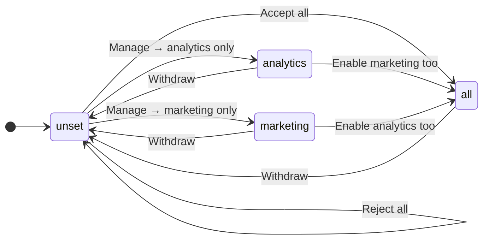

import AnnotatedCode from '../../../components/code/annotated-code/AnnotatedCode.astro';
import AnnotatedStep from '../../../components/code/annotated-code/AnnotatedStep.astro';
import CodeTooltips from '../../../components/code/CodeTooltips.astro';
import Figure from '../../../components/figures/Figure.astro';
import PreConsentTimeline from '../../../components/lessons/081/5/PreConsentTimeline.astro';
import BannerAnatomy from '../../../components/lessons/081/5/BannerAnatomy.astro';
import BannerGoodBad from '../../../components/lessons/081/5/BannerGoodBad.astro';
import StateMachineWalker from '../../../components/figures/state-machine-walker/StateMachineWalker.astro';
import Question from '../../../components/figures/state-machine-walker/Question.astro';
import Branch from '../../../components/figures/state-machine-walker/Branch.astro';
import Buckets from '../../../components/exercises/buckets/Buckets.astro';
import Bucket from '../../../components/exercises/buckets/Bucket.astro';
import Item from '../../../components/exercises/buckets/Item.astro';
import TrueFalse from '../../../components/exercises/true-false/TrueFalse.astro';
import Statement from '../../../components/exercises/true-false/Statement.astro';
import TfWhy from '../../../components/exercises/true-false/TfWhy.astro';
import MultipleChoice from '../../../components/exercises/multiple-choice/MultipleChoice.astro';
import McqChoice from '../../../components/exercises/multiple-choice/McqChoice.astro';
import McqWhy from '../../../components/exercises/multiple-choice/McqWhy.astro';
import Checklist from '../../../components/ui/checklist/Checklist.astro';
import ChecklistItem from '../../../components/ui/checklist/ChecklistItem.astro';
import ExternalResource from '../../../components/ui/ExternalResource.astro';
import VideoCallout from '../../../components/embeds/VideoCallout.astro';
import Term from '../../../components/ui/Term.astro';
import CourseProgressBar from '../../../components/ui/CourseProgressBar.astro';
import { CardGrid } from '@astrojs/starlight/components';

<CourseProgressBar value={frontmatter['course-progress']} />

Later you'll wire up PostHog for analytics and session replay. That tooling can't run until one piece exists first, the piece most teams build backwards.

The backwards version: a cookie banner appears, the user clicks "Accept," a boolean flips to `true`, and the analytics SDK boots. But by the time the banner rendered, the page had already loaded the analytics script, opened a connection, and likely fired a pageview. That early pageview is the violation. <Term definition="The EU's General Data Protection Regulation, which governs how personal data is processed.">GDPR</Term> and the <Term definition="The EU's ePrivacy Directive — the 'cookie law.' It governs storage of and access to information on a user's device, which is why it, not GDPR, is what makes a cookie banner mandatory.">ePrivacy Directive</Term> require <Term definition="Consent must come before the processing, not after it. A tracker that fires and then asks has already broken the rule.">prior consent</Term>: it has to come *before* anything non-essential runs.

The banner is the easy part. The rule behind it is the hard part: **nothing non-essential fires before the user has chosen.** Treat the banner as an engineering gate with one source of truth. Exactly one place knows whether tracking is allowed, every third party reads from it, and "allowed" cannot be observed until the user says yes.

You already have the pieces. The root `<Providers>` Client Component from the TanStack Query chapter holds one more provider for this gate. `await cookies()` reads consent on the server and hands it to a Client Component, so the banner never flashes on load. State changes go through Server Actions that return a `Result`, and `logAudit(tx, event)` records the decision. The new piece is one hook, `useConsent()`, the single place that knows the answer.

## Essential or consent-required: the legal test

One decision sits upstream of all the code: sort every cookie and tracker your app sets into two buckets, the ones that need consent and the ones that don't. A single legal test draws the line:

:::note
A cookie or tracker is **essential** only if it is **strictly necessary for the service the user explicitly asked for.** Everything else needs consent.
:::

Two phrases carry the weight. <Term definition="The exact phrase the ePrivacy Directive uses for cookies that are exempt from the consent requirement. The bar is high on purpose: the cookie must be indispensable to a service the user actively requested.">Strictly necessary</Term> means the service breaks without it, not that it's helpful or that the business wants it. *The service the user explicitly asked for* means the user's request, not the business's interests. That second phrase is the trap: analytics serves the business, not the service the user requested, so analytics is never essential.

Apply the test and your app's cookies sort cleanly. Essential: the Better Auth session cookie that keeps the user logged in, the CSRF token, and the active-org cookie that tracks which organization they're working in. Without these the user can't stay signed in or do their work. One essential cookie almost everyone misses:

:::tip
The cookie that *records the consent choice itself* is essential. You can't ask consent to store the record of consent, that would be circular. The banner has to remember "this user already chose," and that memory is a cookie that needs no banner of its own.
:::

Consent-required: analytics (PostHog), <Term definition="A tracker that records and replays a user's actual session — clicks, scrolls, keystrokes — as a watchable video. Deeply invasive, so always consent-required.">session replay</Term>, <Term definition="A tiny invisible image or script an ad network loads to track a user across sites, usually to attribute conversions or build an ad profile. Always consent-required.">marketing pixels</Term>, and support-chat widgets, anything that profiles the user across sessions or sites. None are necessary for the service, so all need a yes first.

When you genuinely can't decide, the law sets the default: **if in doubt, treat it as non-essential.** The burden is on you to justify calling something essential; a regulator does not accept "we assumed it was fine."

The gate ships exactly two non-essential categories, `analytics` and `marketing`, both off by default.

<Buckets twoCol instructions="Run the one test — strictly necessary for the service the user explicitly asked for? — and sort each cookie or tracker.">
  <Bucket name="essential" label="Essential — no consent needed" description="Strictly necessary for the requested service" />
  <Bucket name="consent" label="Consent required" description="Anything that isn't strictly necessary" />

  <Item bucket="essential">The Better Auth session cookie</Item>
  <Item bucket="essential">The CSRF token</Item>
  <Item bucket="essential">The cookie that records the user's consent choice</Item>
  <Item bucket="essential">The active-org cookie</Item>
  <Item bucket="consent">PostHog product analytics</Item>
  <Item bucket="consent">Session replay</Item>
  <Item bucket="consent">A marketing/ad pixel</Item>
  <Item bucket="consent">An embedded support-chat widget</Item>
</Buckets>

## Consent is a state machine, not a boolean

The broken banner from the opening models consent as one boolean, `accepted` true or false, which can't represent the choices the law requires you to offer. A user may accept analytics but refuse marketing, then later withdraw. A boolean has no room for that, so you end up bolting on flags and special cases until the logic is unreadable.

Model it the way it behaves: as <Term definition="Letting the user choose per category — accept analytics, refuse marketing — instead of a single all-or-nothing decision. Regulators require this option; one button that only accepts everything is not compliant.">granular consent</Term>, two independent boolean flags, `analytics` and `marketing`, each defaulting to off. The two flags give four combinations worth naming as states, because the transitions between them are where the behavior lives:

- **`unset`**: no decision recorded, both flags off, banner showing.
- **`analytics`**: analytics on, marketing off. The common "accept analytics, skip marketing" choice.
- **`marketing`**: marketing on, analytics off. Rare, but granular means *any* combination, so the model must allow it.
- **`all`**: both on. The full "Accept all."

This is two flags, not a four-valued enum, and the difference compounds. Add a `support` category later and the two-flag model grows one boolean; a four-valued enum would have to be redesigned into eight values.

Keep this state in a cookie named `consent_choice`, not in `localStorage`. The banner is server-rendered, so the server must read the choice during the request, with `await cookies()`, to decide whether to render it. A cookie rides every request; `localStorage` lives only in the browser, so a `localStorage`-based banner renders blind on the server, shows the banner, then has JavaScript yank it away a beat later on every page load. One more constraint from ePrivacy: cap the cookie's lifetime at **13 months**, then re-ask.

Writing the choice is a Server Action, so the cookie is set server-side and server reads stay authoritative.

Walk the machine one state at a time, watching two things at each stop: what `useConsent()` returns, and which SDKs are loaded. Which SDKs are loaded is the whole compliance question.

<StateMachineWalker kind="machine" title="Walk the consent machine — watch the flags and which SDKs are live">
  <Figure slot="diagram" caption="Two independent flags, four states. Every Withdraw edge returns to unset and re-shows the banner: the revocation cycle most banners forget (Unit 16).">


```mermaid
stateDiagram-v2
  direction LR
  [*] --> unset
  unset --> all : Accept all
  unset --> analytics : Manage → analytics only
  unset --> marketing : Manage → marketing only
  unset --> unset : Reject all
  analytics --> all : Enable marketing too
  analytics --> unset : Withdraw
  marketing --> all : Enable analytics too
  marketing --> unset : Withdraw
  all --> unset : Withdraw
```

  </Figure>

  <Question id="unset" prompt="unset — no decision yet"
    description="useConsent() returns { analytics: false, marketing: false }. No analytics or marketing SDK is loaded; the analytics module was never even imported. The banner is showing.">
    <Branch label="Accept all" to="all" rationale="Both flags flip on." />
    <Branch label="Manage → analytics only" to="analytics" rationale="From the 'Manage preferences' modal's per-category toggles." />
    <Branch label="Manage → marketing only" to="marketing" rationale="The other granular toggle in the same modal." />
    <Branch label="Reject all" to="unset" rationale="Reject records a decision and dismisses the banner but loads nothing — both flags stay off, landing right back in unset." />
  </Question>

  <Question id="analytics" prompt="analytics — analytics on, marketing off"
    description="useConsent() returns { analytics: true, marketing: false }. The analytics SDK is now imported and capturing; no marketing pixel. Banner dismissed.">
    <Branch label="Enable marketing too" to="all" />
    <Branch label="Withdraw" to="unset" rationale="opt_out_capturing() + reset(); the gate tears the SDK down and the banner reappears." />
  </Question>

  <Question id="marketing" prompt="marketing — marketing on, analytics off"
    description="useConsent() returns { analytics: false, marketing: true }. Marketing pixel loaded, analytics not. The uncommon combination, but two independent flags mean the model must represent it.">
    <Branch label="Enable analytics too" to="all" />
    <Branch label="Withdraw" to="unset" rationale="Same revocation cycle — flag off, SDK torn down, banner back." />
  </Question>

  <Question id="all" prompt="all — both categories on"
    description="useConsent() returns { analytics: true, marketing: true }. Both categories are live: analytics capturing and the marketing pixel loaded.">
    <Branch label="Withdraw" to="unset" rationale="Back to unset: the banner re-shows and every non-essential SDK must stop." />
  </Question>
</StateMachineWalker>

The state to leave with is `unset`, the start state and the one every Withdraw returns to. A user who never chose is in the same tracking posture as one who explicitly rejected: nothing fires. Default-off and reject converge by design, because the absence of a "yes" is a "no."

## One hook every tracker reads: `useConsent()`

One place in the app knows whether tracking is allowed: a single <Term definition="React's mechanism for sharing a value through the component tree without passing it down as props at every level. Here, one provider holds the consent state and any component can read it with a hook.">React Context</Term> that every third party reads from. That rigidity is what you audit against.

The shape:

- A `ConsentProvider` mounts **inside** your existing root `<Providers>` Client Component, the same one that holds your query client. One provider tree per app, and this slots into it.
- The provider takes the *initial* choice as a prop from a Server Component that read the `consent_choice` cookie with `await cookies()`. Because the server already knows the choice at render time, the provider starts in the right state on the first paint, with no flash.
- It exposes `useConsent()`, which returns the two flags plus the actions to change them: `{ analytics, marketing, open(), accept(level), reject() }`.

The rule that makes this a *gate* and not just a context: **every third party imports `useConsent()` and short-circuits the moment its category flag is false.** If `analytics` is false, the analytics code does not run, full stop. An analytics or marketing init not behind `useConsent()` is a bug, and that grep is your audit pass.

You won't write the provider; it ships complete in the next chapter's starter. Read it to recognize the shape and what it guarantees. Slow down on the handoff in the second step.

<AnnotatedCode lang="tsx" maxLines={18} code={`
'use client';

const ConsentContext = createContext<ConsentValue | null>(null);

export const ConsentProvider = ({ initial, children }: ConsentProviderProps) => {
  const [choice, setChoice] = useState(initial);
  const [, setBannerOpen] = useState(false);

  const open = () => setBannerOpen(true); // reopen the preferences banner
  const accept = async (level: ConsentLevel) => {
    const result = await saveConsent(level);
    if (result.ok) setChoice(result.data);
  };
  const reject = () => accept('none');

  return (
    <ConsentContext value={{ ...choice, accept, reject, open }}>
      {children}
    </ConsentContext>
  );
};

export const useConsent = () => {
  const value = use(ConsentContext);
  if (!value) throw new Error('useConsent must be used within ConsentProvider');
  return value;
};
`}>
  <AnnotatedStep meta={`{1} {3}`} color="blue">
    A Client Component, because consent state is interactive and read by client-side trackers. `createContext` holds the single value the whole app shares.
  </AnnotatedStep>

  <AnnotatedStep meta={`"initial" "useState(initial)"`} color="blue">
    **The no-flash handoff.** `initial` is the choice the *server* read from the `consent_choice` cookie and passed down, so the provider renders in the right state from the first frame. That is why the choice lives in a cookie, not `localStorage`.
  </AnnotatedStep>

  <AnnotatedStep meta={`{9-14} "saveConsent"`} color="blue">
    The three controls. `accept` and `reject` both route through one Server Action, `saveConsent`, which writes the cookie server-side and returns the new choice in a `Result`; `reject` is just `accept('none')`. Routing the write through the server keeps server reads authoritative. `open` reopens the preferences banner, the "reconsider" path a footer link calls.
  </AnnotatedStep>

  <AnnotatedStep meta={`{23-27}`} color="blue">
    `useConsent()` is the single accessor every tracker calls. The throw guarantees nobody reads consent from outside the provider tree.
  </AnnotatedStep>
</AnnotatedCode>

What `useConsent()` hands back is two booleans plus the controls. Hover the return to see the full `{ analytics: boolean; marketing: boolean; ... }` contract that every third party depends on.

<CodeTooltips tooltips={{
  useConsent: 'Returns:\n{ analytics: boolean; marketing: boolean;\n  open: () => void;\n  accept: (level: ConsentLevel) => Promise<void>;\n  reject: () => Promise<void> }\n\nThe contract every tracker reads — two category flags plus the controls to open the banner, accept a level, or reject.',
}}>
```tsx
const { analytics, marketing } = useConsent();
```
</CodeTooltips>

## Stopping analytics before consent: two defenses

The pre-consent boundary is a **timing problem**. The question is never "is the SDK configured correctly," it's "could anything non-essential run before the user clicked," and answering it takes two separate defenses, because either alone leaves a gap. PostHog shows their shape below; wiring it up for real is a later chapter.

**Belt one: tell the SDK to do nothing until consent.** Initialize PostHog with `opt_out_capturing_by_default: true` so it captures nothing, `disable_session_recording: true` so replay is off, and `cookieless_mode: 'on_reject'` so it writes no cookie or storage. Only when the `analytics` flag flips on do you call `posthog.opt_in_capturing()` and enable recording. This stops capture and storage, and it's necessary.

The catch: belt one configures a module that has already loaded. For PostHog to be told "don't capture," its code is already in the browser, downloaded and perhaps already connected to the ingestion endpoint. You've told a guest who is already in your living room not to take notes. <Term definition="The SDK ships disabled and must be explicitly turned on. Necessary, but it only governs a module that has already loaded — which is why it's not sufficient on its own.">Opting out by default</Term> is not enough.

**Belt two: gate the module load itself.** The consent provider <Term definition="An `import()` call that loads a module on demand and code-splits it into its own bundle, so the code only reaches the browser when you actually call it.">dynamically imports</Term> the analytics module only after the `analytics` flag turns on. Before consent, `import('./analytics')` is never called, so the SDK never reaches the browser: no script, no connection, nothing to opt out of. This is the belt beginners skip and the one that actually closes the boundary, because it controls whether the code exists in the page at all.

Why both, if belt two is the strong one? They protect different moments. Belt two keeps the SDK out of the page until consent; belt one governs what it does once loaded, both in the instant after consent before you've wired up the user's granular choices, and in any edge where the module ends up present for another reason.

The network tab shows the violation. With only belt one, loading the page downloads the PostHog bundle and fires an init request before the user touches the banner. Add belt two and the network tab stays clean until the click.

<PreConsentTimeline />

The consent decision sits between "page loaded" and "anything analytics happened": load, choose, import, fire. No arrangement of the frames lets a tracker run before the choice.

<MultipleChoice>
  A team sets `opt_out_capturing_by_default: true` on PostHog, but loads the PostHog `<script>` in the root layout `<head>` so it's present on every page. Before the user clicks anything in the banner, is the app compliant?

  <McqChoice>Yes — capturing is opted out by default, so nothing is being recorded.</McqChoice>
  <McqChoice>Yes — it only becomes a violation once an actual event is captured.</McqChoice>
  <McqChoice correct>No — the SDK reached the browser before the choice, and the module load itself is the breach; the fix is to gate the import.</McqChoice>
  <McqChoice>No — but only because `disable_session_recording` wasn't set alongside the opt-out flag.</McqChoice>

  <McqWhy>The pre-consent boundary is about *timing*, not config. The opt-out flag (belt one) only governs a module that has **already** loaded — and putting the script in `<head>` means the SDK reached the browser and likely opened a connection before any choice was made. Adding `disable_session_recording` changes nothing about that load. Belt two — dynamically importing the module only after consent — is what keeps the network tab clean before the click.</McqWhy>
</MultipleChoice>

## Reject must mean reject

Accept is the happy path. Reject is where compliance is won or lost, and it has two halves that both have to hold: the button must be *offered fairly*, and the rejection must *actually do something*.

Fairness is an invariant you can verify, not a matter of taste. The banner carries three buttons, "Accept all," "Reject all," and "Manage preferences," and the rule is blunt: **Reject must be exactly as easy and as visible as Accept** — same size, same prominence, same one click. The instant "Accept all" is a big colorful button and "Reject all" is a faint grey link in a corner, you have built a <Term definition="A UI deliberately designed to steer the user toward the choice the business prefers rather than the one they'd freely make. An Accept button that's bigger or brighter than Reject is the textbook case.">dark pattern</Term>, and the <Term definition="The CNIL (France's data-protection authority) and the EDPB (European Data Protection Board) — the regulators that set and enforce EU consent rules. Both have explicitly fined companies for asymmetric Accept/Reject banner designs.">CNIL and EDPB</Term> have levied real fines over exactly this asymmetry. Treat equal weight as a hard requirement, like a passing test, not something conversion can override.

"Manage preferences" opens a small modal with two category toggles, `analytics` and `marketing`, both default-off. The banner itself is a modest, non-modal sticky footer, never a full-page wall that holds the content hostage; the wall is its own kind of coercion.

<BannerAnatomy />

Here are the two banners side by side, the asymmetric one regulators fine and the symmetric one that passes.

<BannerGoodBad />

Now the second half, invisible until you check: **reject has to be functional.** A perfectly symmetric banner whose "Reject all" still lets PostHog phone home is worse than no banner, because now you're lying. After "Reject all," there must be no PostHog request, no marketing pixel, and no replay socket — and the two-belt model from the last section already guarantees it: reject lands the state in `unset` with both flags off, belt two never imports the analytics module, and belt one keeps it silent if it is imported anyway. Verify it in thirty seconds: open an incognito window, click "Reject all," and watch the network tab stay clean. Anything analytics-shaped means the gate is broken — a check you can run by hand now and in CI later.

One path remains: the user must be able to change their mind in *both* directions. A persistent footer or settings link reopens the preferences modal, which is `open()` on the hook. Withdrawing is the interesting direction, because turning a tracker *off* takes more than flipping a flag. When `analytics` goes from true to false, call `posthog.opt_out_capturing()` to stop further capture *and* `posthog.reset()` to discard events already queued. Skip the `reset()` and PostHog keeps draining its buffer for about thirty seconds after the user revoked, sending events from someone who just said stop.

<VideoCallout videoId="JgfPWTCogOM" videoTitle="Cookie Banners: Understanding Consent Requirements & Avoiding Dark Patterns">
  TechGDPR's 13-minute walkthrough of why asymmetric "Accept/Reject" banners, pre-ticked boxes, and cookie walls are dark patterns regulators fine: the legal backing for the equal-weight rule above.
</VideoCallout>

## The consent record: auditable evidence

GDPR makes consent a data concern, not just a UI one: the <Term definition="The party that decides why and how personal data is processed — your company, here. Under GDPR the controller carries the legal burden of being able to demonstrate that valid consent was obtained.">data controller</Term> must be able to *demonstrate* that consent was given. A flag in a cookie isn't proof; the user could clear it. So every consent decision earns a permanent record, and you already have the right place to put one.

Run it through the inclusion test from the audit-log lesson: a consent decision is attributable to a person, trust-relevant, and a state change rather than a read. Three for three, so it earns an audit row, written by the same Server Action that sets the `consent_choice` cookie, in the same transaction:

```ts title="src/app/actions/consent.ts" "consent.recorded"
await logAudit(tx, {
  action: 'consent.recorded',
  subjectType: 'user',
  subjectId: userId,
  payload: { analytics, marketing, policyVersion: CONSENT_POLICY_VERSION },
});
```

The action name follows the `entity.verb-pasttense` convention from the audit-log lesson: one dot, a hyphenated past-tense verb. Past tense, because the row records a choice the user made at a moment in time. Not `consent.updated`: "updated" describes a mutable thing being edited, and an audit row is neither.

The payload carries the choice, `{ analytics, marketing }`, and the policy version. Notice what it *doesn't* carry: the actor, IP, user agent, and timestamp. The caller hands `logAudit` only `{ action, subjectType, subjectId, payload }`; the helper derives the actor, IP, and server timestamp itself. That's an integrity property: a caller can't forge who consented or when, because a caller never supplies it. The choice is the user's own, so there's no third-party PII to worry about.

`policyVersion` handles a problem you will hit: your privacy policy will change. When you add a tracker or change what you collect, consent given under the *old* policy no longer covers the new reality. Storing the version lets you treat any consent recorded under a lower version as stale, which re-shows the banner and asks again. Consent is to a specific policy at a specific time, and the version is how you pin it.

## Cookie consent is not email consent

Everything above is about *cookies and trackers*, not whether you can email someone. These are two separate opt-ins, governed by different mechanisms.

Marketing-email consent lives on your sign-up form, as a "send me product updates" checkbox that must be **default-unchecked.** A pre-checked box fails GDPR, because consent must be an *affirmative act*: the user opts in, rather than failing to undo a default. The checkbox flips a `marketingEmailConsent` column on the `users` table (defaulting to `false`), set only here or by a later toggle in account settings.

The carve-out: **<Term definition="Email triggered by and necessary to something the user did — a password reset, a receipt, a security alert. It's part of the requested service, so it never needs marketing consent. The opposite of a marketing broadcast.">transactional email</Term> needs no consent at all.** A password reset, a receipt, a security alert: these *are* the service the user asked for. It's the same "strictly necessary for the requested service" test, applied to email instead of cookies. Only marketing *broadcasts* gate on the `marketingEmailConsent` flag; a user with it off still gets the password reset they requested by clicking "forgot password."

Run the boundary through a round.

<TrueFalse instructions="Each claim is about marketing-email consent versus cookie consent versus transactional email.">
  <Statement answer="false">
    A password-reset email can only be sent if the user gave marketing-email consent.
    <TfWhy>A password reset is transactional — it's the service the user asked for by clicking "forgot password." Transactional email needs no consent. Only marketing broadcasts gate on the `marketingEmailConsent` flag.</TfWhy>
  </Statement>

  <Statement answer="false">
    The "send me product updates" checkbox may be pre-checked as long as there's an unsubscribe link.
    <TfWhy>Consent must be an affirmative act, so the box must be default-unchecked. A pre-ticked box fails GDPR no matter what unsubscribe options exist later — and an unsubscribe link doesn't retroactively make pre-checking valid.</TfWhy>
  </Statement>

  <Statement answer="true">
    An invoice receipt is transactional and can be sent without any marketing consent.
    <TfWhy>A receipt is part of the service the user requested. It's transactional, so the `marketingEmailConsent` flag doesn't apply.</TfWhy>
  </Statement>

  <Statement answer="false">
    Accepting analytics cookies in the banner also opts the user into marketing emails.
    <TfWhy>They're two separate, unrelated opt-ins. The cookie banner governs trackers; the `marketingEmailConsent` column governs email. Accepting one says nothing about the other.</TfWhy>
  </Statement>
</TrueFalse>

## What sits just outside this gate

The gate you built is the app-side, EU-shaped core of consent. A few related concerns sit just outside it; knowing they exist, and that they're separate, keeps you from over-building or missing them later.

- **The marketing site is a different surface.** Your `example.com` pages are a separate app from `app.example.com`, often running cookieless analytics like Plausible that need no banner. The app-side gate is load-bearing because the app holds the personal data and the logged-in profiling.
- **CCPA "Do Not Sell or Share" is a different right.** US-California law adds a footer link with that specific wording: a separate control, not a rename of the EU gate.
- **Off-the-shelf consent platforms are the build-versus-buy option.** OneTrust, Cookiebot, and Osano are what you reach for once the cookie inventory sprawls past a hand-rolled gate.

One conflation deserves its own line: **revoking consent is not deleting data.** Withdrawing consent stops *future* processing, so the trackers go quiet from here on; erasing data already collected is the separate right to be forgotten. Don't let a "withdraw" button imply a deletion it doesn't perform.

## The consent-gate audit checklist

Run this against the seeded app. Every unticked box is a finding.

<Checklist id="consent-gate">
  <ChecklistItem chip="untested">Every cookie and tracker is sorted into essential vs. consent-required by the "strictly necessary for the requested service" test; in doubt defaults to consent-required.</ChecklistItem>
  <ChecklistItem chip="untested">The two non-essential categories (`analytics`, `marketing`) both default to off; `unset` behaves identically to a full reject.</ChecklistItem>
  <ChecklistItem chip="untested">The consent choice lives in the `consent_choice` cookie (≤ 13 months), read server-side so the banner never flashes — not in `localStorage`.</ChecklistItem>
  <ChecklistItem chip="untested">Every tracker reads `useConsent()` and short-circuits when its flag is false; no analytics/marketing init sits outside the hook.</ChecklistItem>
  <ChecklistItem chip="untested">Non-essential SDKs are dynamically imported only after their flag flips on (belt two), and initialized opted-out by default (belt one).</ChecklistItem>
  <ChecklistItem chip="untested">The banner offers Accept / Reject / Manage at equal weight; Reject is one click and as prominent as Accept.</ChecklistItem>
  <ChecklistItem chip="untested">Clicking Reject in incognito leaves the network tab clean — no analytics request, no pixel, no replay socket.</ChecklistItem>
  <ChecklistItem chip="untested">Withdrawing consent calls `opt_out_capturing()` and `reset()` so queued events stop, not just future ones.</ChecklistItem>
  <ChecklistItem chip="untested">Every consent decision writes a `consent.recorded` audit row carrying `{ analytics, marketing }` and the policy version.</ChecklistItem>
  <ChecklistItem chip="untested">Marketing-email consent is a separate default-unchecked checkbox writing `marketingEmailConsent`; transactional email never gates on it.</ChecklistItem>
</Checklist>

A cookie banner is not a legal checkbox; it's an engineering gate built so that **nothing fires pre-consent, because there's nothing there to fire.**

## External resources

<CardGrid>
  <ExternalResource
    title="EDPB Guidelines 05/2020 on consent"
    href="https://www.edpb.europa.eu/our-work-tools/our-documents/guidelines/guidelines-052020-consent-under-regulation-2016679_en"
    icon="lucide:scale"
    iconColor="#003399"
    description="The regulator's own definition of valid consent — freely given, specific, informed, and unambiguous."
  />
  <ExternalResource
    title="ePrivacy & the cookie-consent rule"
    href="https://gdpr.eu/cookies/"
    icon="lucide:cookie"
    iconColor="#0F9D58"
    description="A plain-language summary of the cookie law: which cookies are exempt and what 'strictly necessary' actually means."
  />
  <ExternalResource
    title="PostHog — controlling data collection"
    href="https://posthog.com/docs/privacy/data-collection"
    icon="simple-icons:posthog"
    iconColor="#F54E00"
    description="Belt one in the SDK itself — opt_out_capturing_by_default, opt_in_capturing(), and the opt-out call, ahead of the analytics chapter."
  />
  <ExternalResource
    title="noyb — 226 complaints over deceptive banners"
    href="https://noyb.eu/en/226-complaints-lodged-against-deceptive-cookie-banners"
    icon="lucide:gavel"
    iconColor="#E5004B"
    description="Real enforcement against asymmetric Accept/Reject designs — the dark pattern the equal-weight rule exists to prevent."
  />
</CardGrid>
