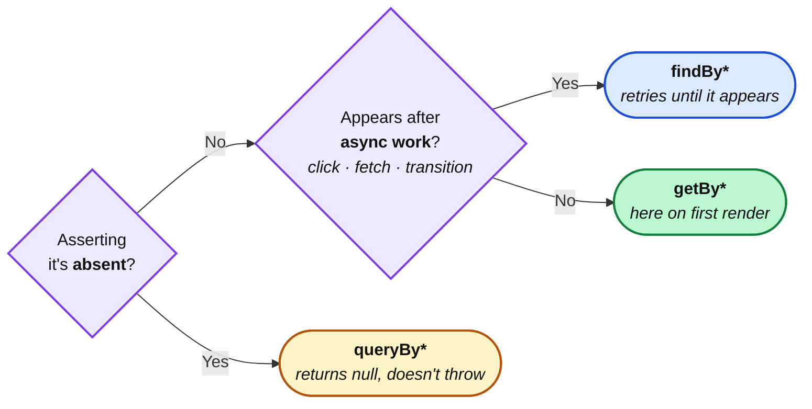

import Figure from '../../../components/figures/Figure.astro';
import AnnotatedCode from '../../../components/code/annotated-code/AnnotatedCode.astro';
import AnnotatedStep from '../../../components/code/annotated-code/AnnotatedStep.astro';
import CodeVariants from '../../../components/code/code-variants/CodeVariants.astro';
import CodeVariant from '../../../components/code/code-variants/CodeVariant.astro';
import ReactTestingCallout from '../../../components/embeds/ReactTestingCallout.astro';
import Buckets from '../../../components/exercises/buckets/Buckets.astro';
import Bucket from '../../../components/exercises/buckets/Bucket.astro';
import Item from '../../../components/exercises/buckets/Item.astro';
import MultipleChoice from '../../../components/exercises/multiple-choice/MultipleChoice.astro';
import McqChoice from '../../../components/exercises/multiple-choice/McqChoice.astro';
import McqWhy from '../../../components/exercises/multiple-choice/McqWhy.astro';
import ExternalResource from '../../../components/ui/ExternalResource.astro';
import Term from '../../../components/ui/Term.astro';
import { CardGrid } from '@astrojs/starlight/components';
import QueryLadder from '../../../components/lessons/089/3/QueryLadder.astro';
import CourseProgressBar from '../../../components/ui/CourseProgressBar.astro';

<CourseProgressBar value={frontmatter['course-progress']} />

You can boot a component test now. The rig from the previous lesson renders your component into a fake browser and hands you a simulated user. What it doesn't tell you is the thing that separates a test an experienced engineer would sign off on from one that quietly rots: *how to find the element you're asserting about*.

Picture a single Confirm button on a checkout screen. In the DOM it carries a CSS class `btn-primary`, an `id` of `submit`, the visible text `Confirm`, an `aria-label` of `Confirm purchase`, an implicit `role` of `button`, and — because some past tutorial said so — a `data-testid="submit-btn"`. That is six different handles you could grab it by. Which one do you write?

The instinct most people carry in from older tutorials is `getByTestId('submit-btn')`. It always works. It never makes you think about the markup. And it ages your suite badly — a test that finds elements by test id proves nothing about whether a human being can actually reach that button. The experienced answer follows a *priority ladder*, and the ladder turns out to be the same axis as accessibility. That is the one idea this whole lesson hangs off: **the way you find an element is a verdict on its accessibility.** The query is the audit.

To say that precisely you need two terms. The <Term definition="The semantic tree assistive technology navigates — roles, names, and states. It's derived from the DOM, but it is not the DOM itself.">accessibility tree</Term> is the semantic tree assistive technology navigates — roles, names, and states, computed *from* your DOM but distinct from it. And an element's <Term definition={"The label a screen reader announces for an element.\nComputed from its text content, aria-label, aria-labelledby, or an associated <label>."}>accessible name</Term> is the label a screen reader announces for it, computed from its text content, an `aria-label`, an `aria-labelledby`, or an associated `<label>`. Hold those two; the lesson keeps returning to them.

Three things live here, and they build in order. First, the **query priority ladder** — the ordered list of how to find an element, role first, test id last. Second, the **`getBy` / `queryBy` / `findBy` split** — three different things you can assert about an element's existence *in time*. Third, **what "behavior" even means** at the DOM layer — what an assertion should target and what it must never touch. The last one reframes the first two: they stop being rules to memorize and become consequences of a single principle.

## The priority ladder: how to find an element

Testing Library ships an ordered list of queries, and the order is a recommendation with teeth: **prefer the query highest on the ladder that the element supports.** Dropping a rung is allowed, but it should feel like a compromise you can justify out loud — never the default.

Here is the whole ladder at a glance. Don't memorize it; the shape is what matters. The top is where a real user — including one using a screen reader — actually interacts with your UI. The bottom is an escape hatch with no user-facing meaning at all.

<QueryLadder />

The top three rungs cover something like nine out of ten real assertions, so they get the depth. The tail gets a sentence each.

### `getByRole(role, { name })` — the highest-value query

This is the one you reach for first, almost always. It finds an element by its semantic <Term definition="The semantic category of an element in the accessibility tree — button, link, textbox — that tells assistive tech how to present and operate it.">role</Term> — its category in the accessibility tree, the thing that tells assistive tech *how to present and operate it* — plus its accessible name.

```ts
screen.getByRole('button', { name: /confirm purchase/i });
```

The `name` option is what makes this precise. A checkout page has a dozen buttons; `getByRole('button')` alone would find all of them and throw because the match is ambiguous. Adding `{ name: /confirm purchase/i }` picks exactly the one a user would recognize as "the confirm-purchase button." Role narrows to a category; name narrows to the element.

A SaaS UI exercises a small, recurring set of roles. You'll write these constantly: `button`, `link`, `textbox` (a text input), `combobox` (a select or autocomplete), `checkbox`, `radio`, `heading` (with `{ level: 2 }` to target an `<h2>`), `dialog` (a modal), `alert` and `status` (announcements — more on those shortly), `region`, `listitem`, `row`, and `grid` (a data table).

Most roles are *implicit* — the element gets them for free from its tag, and you should let it. A `<button>` is a `button`. An `<input type="checkbox">` is a `checkbox`. An `<a href="...">` is a `link`. You almost never write `role="button"` by hand on a real `<button>`.

But the gaps are where the audit earns its keep. An `<a>` *without* an `href` has **no role at all** — it's not a link to a screen reader, just decorated text. And a `<div role="button">` only *looks* reachable: it needs a `tabIndex={0}` and a key handler before a keyboard user can actually focus and activate it. Here's the sharp part — RTL's role query will happily find that `<div role="button">` whether or not it has `tabIndex`. Real assistive technology won't operate it without the tabindex and handler. That gap, between "the test passes" and "the user can't use it," is precisely the thing a good test is meant to surface, and we'll close the loop on it in the last section.

:::note
Roles come from the DOM your component renders, not from React. `getByRole('button', { name })` is asking the same question a screen reader asks: "is there a button here, and what is it called?"
:::

### `getByLabelText(text)` — form controls by their label

For an input, the *top* preference isn't role — it's the label, because a labelled input is exactly how a real person fills out a form. They read "Email," they type in the box next to it.

```tsx
<label htmlFor="email">Email</label>
<input id="email" type="email" />
```

```ts
screen.getByLabelText(/email/i);
```

The `htmlFor` on the label, matched to the `id` on the input, is what wires them together in the accessibility tree — and it's what lets a screen reader announce "Email, edit text" when focus lands on the field. `getByLabelText` finds the input *through* that association. If this query can't find your input, a screen-reader user can't tell what the input is for. Same fact, two symptoms.

### `getByText(text)` — non-interactive content

For content a user reads but doesn't operate — a paragraph, a static status line, a help hint — `getByText` matches on the rendered text.

```ts
screen.getByText(/your trial ends in 5 days/i);
```

One watch-out, and it's a common trip: `getByText('Confirm')` will match *anything* containing that text, including a tooltip and the button at the same time, and then throw on the ambiguity. The rule: if the element is interactive, find it by role, not by text. `getByText` is for the stuff that has no better handle.

### The tail

The remaining rungs exist, and occasionally you need them, but each one is a small step away from "what the user perceives":

- **`getByPlaceholderText`** — only when an input has no `<label>`. Reaching for it is usually a quiet signal the form is inaccessible (placeholder text is not a label; it vanishes the moment the user types).
- **`getByDisplayValue`** — the current value of a filled-in input, handy for asserting a form is pre-populated.
- **`getByAltText`** — images, by their `alt` text.
- **`getByTitle`** — the `title` attribute. Watch out: `title` is *not* an accessible name. It only appears on hover, so keyboard and screen-reader users never see it. If you find yourself reaching here, the fix is almost always an `aria-label` plus `getByRole(..., { name })`.

And then the bottom rung.

### `getByTestId` — the deliberate carve-out

`data-testid` is an attribute that exists *only* for tests. It has zero meaning to a user, a browser, or a screen reader. That's exactly why it's last: a test that finds an element this way has stepped entirely outside the accessibility tree and is asserting against markup that no human will ever experience.

There are a few genuine reasons to use it, and we'll name them precisely in the last section. For now, hold this: when `getByTestId` is the *only* way you can find an element, that is rarely a fact about your test. It's usually a fact about your component — it has no role, no name, no label, nothing semantic to grab. The honest response is to fix the component, not to drop the rung.

### Why role-first, mechanically

It's worth being exact about *why* the top of the ladder is privileged, because "best practice" is not a reason and you'll need to defend this in a code review.

Role plus name is *literally what assistive tech sees*. When a test passes `screen.getByRole('button', { name: /confirm purchase/i })`, it has proven three things at once: the element exists, it is exposed to the accessibility tree as a button (so it's keyboard-reachable and operable), and it is announced as "Confirm purchase" (so a screen-reader user knows what it does). That's a free accessibility assertion riding inside an ordinary test.

A test that passes `screen.getByTestId('submit-btn')` has proven *none* of that. The element behind that test id could be a `<div>` with an `onClick` handler — renders fine, clicks fine with a mouse, and is completely invisible to a keyboard or a screen reader. The test is green; the button is unusable for a real subset of your users. This is the mechanism behind "the query is the audit": the query you can write *is* a measurement of how accessible the element is.

The playground below makes this concrete on an accessible form. The component embeds [Testing Playground](https://testing-playground.com), the canonical tool for this exact job — you paste markup, and it ranks the best query for every element using the *same ladder* you just learned. Paste or read the login form, then notice which queries it puts at the top.

<ReactTestingCallout
  title="Accessible login form"
  label="Open: the playground on an accessible form"
  html={`<form>
    <label for="email">Email</label>
    <input id="email" type="email" />
    <label for="password">Password</label>
    <input id="password" type="password" />
    <button type="submit">Sign in</button>
  </form>`}
  query={`screen.getByRole('button', { name: /sign in/i })`}
  height={640}
>
  The playground ranks every element by the same ladder we just walked — notice it recommends `getByRole` and `getByLabelText`, the top rungs, with no test id in sight.
</ReactTestingCallout>

### The ladder applied in one test

One-liners are easy; the ladder really clicks when you see it carry a whole test. Here is a single `it` block that drives a sign-in form end to end, climbing the ladder rung by rung as the test needs each one. Read it once, then step through the annotations.

<AnnotatedCode lang="tsx" maxLines={18} code={`
it('confirms the sign-in when the credentials are valid', async () => {
  const { user } = render(<SignInForm />);

  expect(
    screen.getByRole('heading', { level: 1, name: /sign in/i }),
  ).toBeInTheDocument();

  await user.type(screen.getByLabelText(/email/i), 'ada@acme.com');
  await user.type(screen.getByLabelText(/password/i), 'hunter2hunter2');
  await user.click(screen.getByRole('button', { name: /sign in/i }));

  expect(
    await screen.findByRole('status', { name: /signed in as ada/i }),
  ).toBeInTheDocument();
});
`}>
  <AnnotatedStep meta="{2}" color="violet">
    Render the component. `render` hands back the simulated `user` from the harness — no per-test setup needed.
  </AnnotatedStep>

  <AnnotatedStep meta="{4-6}" color="violet">
    Find the page heading by role *and* level. `getByRole('heading', { level: 1 })` asserts there's exactly one `<h1>` and it says "Sign in" — a structural accessibility check riding inside the test.
  </AnnotatedStep>

  <AnnotatedStep meta="{8-9}" color="violet">
    Fill the inputs through their labels. `getByLabelText` is the top rung for form controls; if it can't find the field, a real user can't tell what it's for either.
  </AnnotatedStep>

  <AnnotatedStep meta="{10}" color="violet">
    Click the submit button by role and name — the same query a screen reader would use to locate it.
  </AnnotatedStep>

  <AnnotatedStep meta="{12-14}" color="violet">
    Read the result from a live `status` region with `findBy`, because the confirmation appears *after* the async sign-in settles. (The `getBy`/`findBy` choice is the next section — for now, note the result is announced, not just rendered.)
  </AnnotatedStep>
</AnnotatedCode>

Notice the `status` role in that last step. A <Term definition={"An element — like role=\"alert\" or role=\"status\" — whose content changes are announced to screen readers automatically, without the user having to go looking for them."}>live region</Term> — `role="status"` or `role="alert"` — is an element whose *content changes* get announced to a screen reader automatically, without the user having to go looking. A toast, a "Saved" confirmation, a "Payment failed" banner: if a sighted user is meant to notice it appear, a screen-reader user needs it announced, which means it needs a live-region role. Asserting on `role="status"` checks both at once. One catch worth holding onto: unlike `button`, `link`, and `heading` — which take their accessible name from the text inside them — `status`, `alert`, `region`, and `dialog` get a name *only* from an explicit `aria-label` or `aria-labelledby`, never from their content. So when a `findByRole('status', { name: ... })` can't match, the fix is to give the live region a label, not to assume the visible text will supply one.

### Should this string be allowed to change?

One more piece of judgment on `getByRole`, because the `name` option takes more than a plain string. It accepts:

- an **exact string** — `{ name: 'Confirm purchase' }` — which matches only that text, character for character;
- a **regex** — `{ name: /confirm/i }` — which matches any name containing "confirm," case-insensitive;
- a **predicate** — `{ name: (name) => name.startsWith('Confirm') }` — for the rare case where you need custom logic.

Reach for **regex by default.** Copy changes constantly — "Confirm purchase" becomes "Confirm payment" next sprint — and a `/confirm/i` test stays green because the part it anchors on didn't move. You're testing "there's a confirm button," not "the marketing team never touched this string."

Reach for an **exact string** when the copy is *load-bearing* and you *want* the test to break if it changes silently — a legally-required disclosure, a privacy notice, a specific consent label. There the test is doing a second job: standing guard over a string that isn't allowed to drift without someone noticing. The question to ask yourself, every time, is one sentence: *is this string allowed to change without breaking the test?* The answer picks your matcher.

## Three intentions: getBy, queryBy, findBy

The ladder answered *which* element. This next axis is completely separate, and keeping them separate is half the battle: it answers *what you're asserting about that element's existence in time.* Is it here right now? Should it be absent? Will it show up after some async work finishes?

These two axes are orthogonal. Every rung on the ladder comes in all three forms — `getByRole`, `queryByRole`, `findByRole`; `getByLabelText`, `queryByLabelText`, `findByLabelText`; and so on down. You pick a rung *and* an intention, independently. Don't let "role query" fuse in your head with "synchronous query"; they're different choices.

Learn the three by what you *mean*, not by their return types:

- **`getBy*`** — **"it is here, now."** Throws immediately if the element is missing (which gives you a clear, specific failure message), and returns exactly one element. This is your default for anything that should be present synchronously, the moment the component renders.

- **`queryBy*`** — **"it is *not* here."** Returns `null` instead of throwing when nothing matches. This is the *only* correct query for a negative assertion:

  ```ts
  expect(screen.queryByRole('alert')).not.toBeInTheDocument();
  ```

  Here is the bug everyone writes once: using `getBy` to check that something is *absent*. `getBy` throws the instant it doesn't find a match — which means it throws *before* your `expect` ever runs. The test fails, but for the wrong reason, with a "could not find an element" message instead of a clean "expected no alert, found one." When you mean "should not be here," reach for `queryBy`.

- **`findBy*`** — **"it will be here after async work."** Returns a *promise* that retries the query repeatedly until the element appears or a default timeout (about 1000 ms) elapses. This is the default reach for any assertion that comes *after* a `user.click` which kicks off state, a fetch through your mock network, or a transition:

  ```ts
  await screen.findByRole('alert', { name: /payment failed/i });
  ```

  You already met `findBy` in the previous lesson as the wiring example for post-interaction reads — this is *why* it exists. Click, the component does async work, the alert appears a few milliseconds later, and `findBy` waits for exactly that.

Run this disambiguator in your head before every assertion. It's only three questions.

<Figure caption="Pick the intention before the rung: absence, async, or here-and-now.">

</Figure>

### When the thing you're waiting on isn't an element

`findBy` waits for the *DOM*. But sometimes the async result you care about isn't an element at all — it's that a mock function eventually got called. For that, there's a lower-level escape hatch, `waitFor`:

```ts
await waitFor(() => expect(navigateMock).toHaveBeenCalledWith('/dashboard'));
```

`waitFor` retries the callback until its assertion passes or the timeout hits. The rule of thumb: **`findBy` for DOM, `waitFor` only when the thing you're waiting on isn't an element.** And a watch-out worth internalizing — wrapping a *synchronous* assertion in `waitFor` does nothing but slow your suite down; it'll pass on the first tick, but you've paid for a retry loop you never needed.

### Many elements, and addressing one

When you genuinely have a list, the `*AllBy` variants return an array:

```ts
expect(screen.getAllByRole('listitem')).toHaveLength(3);
```

That's fine for "there are three items." But resist the urge to then index into that array — `getAllByRole('button')[2]` is fragile (reorder the list and the test points at the wrong thing) and it reads like nothing. The durable move is to address the *specific* element by its content:

```ts
screen.getByRole('button', { name: /delete invoice INV-001/i });
```

That reads like intent and survives reordering. And when several elements share a name — a "Delete" button in every row of a table — scope the query to the row first with `within`:

```ts
const row = screen.getByRole('row', { name: /INV-001/i });
within(row).getByRole('button', { name: /delete/i });
```

`within(element)` runs the same ladder, scoped to a subtree. It's the clean answer to "the delete button *in this row*," no test id required.

Now drill the axis that trips people most — the intention. Each card below is an assertion phrased in plain English. Drop it in the bucket for the query family you'd reach for.

<Buckets instructions="Each card is an assertion phrased in plain English. Sort it under the query family you'd reach for.">
  <Bucket name="get" label="getBy" description="It's here on first render" />
  <Bucket name="query" label="queryBy" description="Assert it's absent" />
  <Bucket name="find" label="findBy" description="Appears after async work" />

  <Item bucket="get">The page heading is present on first paint</Item>
  <Item bucket="get">The email input is rendered when the form mounts</Item>
  <Item bucket="query">No validation error is in the document before the user submits</Item>
  <Item bucket="query">On first render, no "Saved" confirmation is present yet</Item>
  <Item bucket="find">The success toast appears after clicking Save</Item>
  <Item bucket="find">The search results list shows up after the fetch resolves</Item>
</Buckets>

## Behavior is what the user observes

Here's where the first two topics stop being separate rules and collapse into one idea.

**Behavior, at the component layer, is what a user — sighted or not — observes from outside the component.** Rendered text. Accessible names. Element states the user can perceive: disabled, checked, pressed. Image alt text. The values in form fields. Where focus lands. And what gets *announced* after they interact.

Behavior is *not*: which hook ran, what prop a child component received, the shape of internal state, the order your `useEffect`s fired in, or which CSS classes got applied. None of that is observable from outside. None of it is what your user experiences.

This is the same "test behavior, not implementation" principle from "The shape of a test suite" — specialized to the DOM. The general rule said: assert on what a function returns, not how it computes it. At this layer it says: assert on what the user perceives, not how the component is built. Refactor the internals freely; the test only breaks when the *user-facing behavior* breaks. That's the whole point — a test that breaks on a refactor that changed nothing the user can see is a test working against you.

### The "user sees" reflex

This is the single most useful habit in component testing, so give it room. **Before you write an assertion, say it out loud as a sentence about the user** — "the user sees a payment-failed alert," "the user can submit the form," "the user sees the seat-count field" — and then let the query and the matcher *fall out of that sentence.*

Watch it work. Here are three checks written two ways — once reaching into the markup, once written as sentences about the user. Line for line, each pair verifies the same user-facing fact: the confirm button is there, the dialog is open, the payment-failed alert appeared.

<CodeVariants syncKey="brittle-vs-durable">
  <CodeVariant label="Brittle">
    <div data-mark-color="red">

    ```ts {1-3}
    expect(container.querySelector('.btn-primary')).toBeInTheDocument();
    expect(component.state.isOpen).toBe(true);
    expect(screen.getByRole('alert')).toHaveClass('error');
    ```

    </div>
    **Every line couples to something the user can't see.** `.btn-primary` is a Tailwind class that gets renamed in the next redesign; `component.state.isOpen` reaches into internal state that's nobody's business outside the component; `toHaveClass('error')` asserts on markup detail, not on whether the user was actually warned. All three pass today and break on a refactor that changed nothing a user would notice.
  </CodeVariant>

  <CodeVariant label="Durable">
    <div data-mark-color="green">

    ```ts {1-5}
    expect(screen.getByRole('button', { name: /confirm/i })).toBeVisible();
    expect(screen.getByRole('dialog', { name: /edit invoice/i })).toBeVisible();
    expect(
      await screen.findByRole('alert', { name: /payment failed/i }),
    ).toBeInTheDocument();
    ```

    </div>
    **Every line reads as a sentence about the user** — "the confirm button is visible," "the edit-invoice dialog is open," "the payment-failed alert appeared." They survive a class rename, a state refactor, a re-architecture of the component's internals, and they break for exactly one reason: the user-facing behavior actually changed. That's the test you want.
  </CodeVariant>
</CodeVariants>

The brittle version on the left has a second, quieter problem. An assertion like `expect(mockOnSubmit).toHaveBeenCalledWith(...)` reads as "my mock got called" — that's the component's *internal wiring*, not anything the user observes, and it breaks the day someone renames the callback. There's a deeper reason to avoid it at this layer too: *whether the action did the right thing* is the job of the action's own integration test at the seam, which you saw in the previous chapter. The component test's job is the component's behavior — what renders, what's announced, what the user can do — not the action's contract. Test each thing once, at the layer that owns it.

### The matchers worth knowing

The matchers come from `@testing-library/jest-dom`, registered in the setup file from the previous lesson. There are a lot of them; you need a curated handful, and the way to remember which is to *read the matcher's name and ask whether it describes something a user could perceive.*

Matchers that read as an observation — **prefer these:**

- `toBeVisible` — the user can actually see it (not `display: none`, not behind `hidden`)
- `toHaveAccessibleName` — it's announced with the right name
- `toHaveAccessibleDescription` — it has the right supporting description
- `toBeDisabled` / `toBeEnabled` — the user can or can't interact with it
- `toBeChecked` — the checkbox/radio state the user sees
- `toHaveValue` — what's in the field
- `toHaveFocus` — where the keyboard is
- `toHaveTextContent` — the text the user reads

Matchers that read as DOM detail — **avoid these** at this layer, because they couple to implementation:

- `toHaveClass` — which CSS class applied (a user perceives the *effect* of a class, never the class)
- `toHaveAttribute` — a raw markup attribute

The heuristic is exactly the same one as the queries: if the matcher name describes something a person could perceive, it's a good assertion; if it describes markup internals, you're testing how the component is wired, not what it does.

### The failing query is a bug report on your component

Now the idea that ties the whole lesson together, and the one to hold longest. Start from the "user sees" sentence and let the query fall out — "the user sees the success toast that says 'Invoice sent'":

```ts
await screen.findByRole('status', { name: /invoice sent/i });
```

Sometimes you'll write that line and the query *can't be made to pass role-first.* There's no element with `role="status"`. The toast renders, but it has no accessible name. The input you're trying to reach has no `<label>`. Here's the reframe, and it's the heart of the lesson: **that failing query is not a problem with your test. It's a bug report on your component.** The query failed for the same reason a screen-reader user would be stranded — the semantic structure isn't there.

So the correct response is *not* to drop down the ladder to `getByTestId` until the test goes green. That just hides the accessibility bug behind a passing test. The correct response is to **fix the component to expose the structure** — add `role="status"`, give the toast a name, label the input — and *then* the role query passes. Writing the test made the component accessible. That is the loop, and it's the whole reason "the query is the audit" is more than a slogan.

Make it concrete with a modal. A team ships an "Edit invoice" dialog that *renders perfectly* and *looks* right, but in the markup it's a plain `<div>` with no `role="dialog"`, its title has no `aria-labelledby` pointing at it, and its close button is an icon-only `<button>` with no accessible name. Now try to test it the way you'd write the sentences:

- "the user sees the edit-invoice dialog" → `screen.getByRole('dialog', { name: /edit invoice/i })` → **fails**, there's no dialog role.
- "the user can close it" → `screen.getByRole('button', { name: /close/i })` → **fails**, the close button has no name.

Both failures are real accessibility defects. A screen-reader user can't tell a modal opened, and can't find the button to dismiss it. Adding `role="dialog"` + `aria-labelledby`, and an `aria-label="Close"` on the button, fixes the user's experience *and* turns both queries green. You didn't write tests *for* an accessible component; writing the tests is *how it became* accessible.

The playground below is the strongest single demonstration of this. It's an inaccessible "button" — a bare `<div onClick>` with no role, no tabindex, no name. Watch what the tool recommends.

<ReactTestingCallout
  title="An inaccessible click target"
  label="Open: the playground on a div-as-button"
  html={`<div class="btn" onclick="submit()">Confirm purchase</div>`}
  query={`screen.getByText(/confirm purchase/i)`}
  height={600}
>
  When the playground *can't* suggest a role query and falls back to text or a test id, that's the accessibility bug talking — turn the `<div>` into a `<button>` (or add `role="button" tabindex="0"`) and re-paste to watch the role suggestion appear.
</ReactTestingCallout>

### When `data-testid` is actually the right call

All of this could read as "test ids are forbidden," and they're not — so here's the carve-out, drawn precisely. There are three honest cases for `getByTestId`:

1. **An element with no semantic role to begin with** — a <Term definition={"React rendering a subtree into a different DOM node — e.g. a toast or modal mounted at document.body — so it escapes the parent's overflow and stacking context."}>portal</Term> mount node (React rendering a subtree into a different DOM node, like a toast root attached to `document.body`), or a pure styling wrapper that exists only for layout. There's nothing for a user to perceive, so there's nothing to query semantically.
2. **A third-party widget your team doesn't own** — a charting library's container, say. You assert it's *present*, not on its internals (the library owns those), and a test id on the wrapper you control is a reasonable handle.
3. **Two semantically-identical regions during a transition**, where role plus name is genuinely ambiguous — two `<main>` elements briefly coexisting during a view transition. Try `within` first; reach for a test id only if scoping can't disambiguate.

Outside those three, `getByTestId` is a smell, and its remediation is always the same sentence: *fix the component, write the role query.*

Now bring it all back to where we started. The Confirm button from the opening — class `btn-primary`, id `submit`, text `Confirm`, `aria-label="Confirm purchase"`, role `button`, `data-testid="submit-btn"`. You have the ladder, the intentions, and the principle. Which query do you write?

<MultipleChoice>
  The Confirm button carries a CSS class `btn-primary`, an `id` of `submit`, the visible text `Confirm`, an `aria-label` of `Confirm purchase`, the role `button`, and a `data-testid="submit-btn"`. You're writing the test that proves a user can click it. Which query earns its place at the top of the ladder?

  <McqChoice>
    ```ts
    screen.getByTestId('submit-btn');
    ```
  </McqChoice>
  <McqChoice>
    ```ts
    container.querySelector('.btn-primary');
    ```
  </McqChoice>
  <McqChoice correct>
    ```ts
    screen.getByRole('button', { name: /confirm purchase/i });
    ```
  </McqChoice>
  <McqChoice>
    ```ts
    screen.getByText('Confirm');
    ```
  </McqChoice>

  <McqWhy>The query to write is `screen.getByRole('button', { name: /confirm purchase/i })`. Role plus accessible name is exactly what assistive tech sees, so a green test proves the button is exposed to the accessibility tree and announced as "Confirm purchase" — a keyboard or screen-reader user can actually reach it. The test id and the CSS class are invisible to users and rot the day someone renames them; they'd stay green even if the element were an unreachable `<div>`. `getByText('Confirm')` ignores the role entirely and would also match a tooltip or label carrying the same word, throwing on the ambiguity.</McqWhy>
</MultipleChoice>

If you want one sentence to carry out of this lesson, it's this: *write the assertion as a sentence about the user first, and let the query fall out — and when it won't, you've found a bug in the component, not a reason to drop down the ladder.*

## Where to go deeper

The ladder you learned is Testing Library's own published guidance, and the matcher list is a curated slice of a larger catalog — both are worth bookmarking for the day you hit an element that doesn't fit the common cases.

<CardGrid>
  <ExternalResource
    title="Testing Library — About Queries (Priority)"
    href="https://testing-library.com/docs/queries/about/#priority"
    icon="simple-icons:testinglibrary"
    iconColor="#E33332"
    description="The canonical, ordered priority ladder — the source this lesson teaches."
  />
  <ExternalResource
    title="jest-dom — matcher reference"
    href="https://github.com/testing-library/jest-dom"
    icon="simple-icons:testinglibrary"
    iconColor="#E33332"
    description="The full set of DOM matchers, including the niche ones this lesson left out."
  />
  <ExternalResource
    title="Kent C. Dodds — Common mistakes with React Testing Library"
    href="https://kentcdodds.com/blog/common-mistakes-with-react-testing-library"
    icon="simple-icons:react"
    iconColor="#61DAFB"
    description="The essay from RTL's creator that the role-first, no-test-id philosophy in this lesson comes from."
  />
  <ExternalResource
    title="ARIA APG — Providing Accessible Names and Descriptions"
    href="https://www.w3.org/WAI/ARIA/apg/practices/names-and-descriptions/"
    icon="simple-icons:w3c"
    iconColor="#005A9C"
    description="The spec behind 'accessible name' — exactly what getByRole's name option is matching against."
  />
</CardGrid>

If automated accessibility coverage becomes a priority for the team later, `axe-core` is the next step beyond what the role-query ladder incidentally checks — but that's a separate tool for a separate day. For now, you have the durable move: every component test you write to the top of the ladder is an accessibility regression test you got for free.
