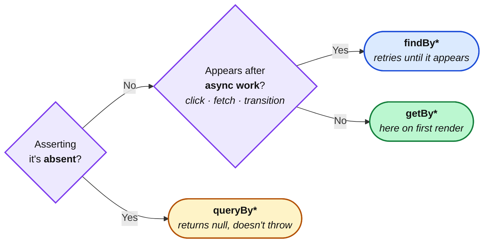

import Figure from '../../../components/figures/Figure.astro';
import AnnotatedCode from '../../../components/code/annotated-code/AnnotatedCode.astro';
import AnnotatedStep from '../../../components/code/annotated-code/AnnotatedStep.astro';
import CodeVariants from '../../../components/code/code-variants/CodeVariants.astro';
import CodeVariant from '../../../components/code/code-variants/CodeVariant.astro';
import ReactTestingCallout from '../../../components/embeds/ReactTestingCallout.astro';
import Buckets from '../../../components/exercises/buckets/Buckets.astro';
import Bucket from '../../../components/exercises/buckets/Bucket.astro';
import Item from '../../../components/exercises/buckets/Item.astro';
import MultipleChoice from '../../../components/exercises/multiple-choice/MultipleChoice.astro';
import McqChoice from '../../../components/exercises/multiple-choice/McqChoice.astro';
import McqWhy from '../../../components/exercises/multiple-choice/McqWhy.astro';
import ExternalResource from '../../../components/ui/ExternalResource.astro';
import Term from '../../../components/ui/Term.astro';
import { CardGrid } from '@astrojs/starlight/components';
import QueryLadder from '../../../components/lessons/089/3/QueryLadder.astro';
import CourseProgressBar from '../../../components/ui/CourseProgressBar.astro';

<CourseProgressBar value={frontmatter['course-progress']} />

The rig from the previous lesson renders your component into a fake browser and hands you a simulated user. The skill it doesn't give you is how to find the element you assert on.

Picture a Confirm button on a checkout screen. In the DOM it carries a CSS class `btn-primary`, an `id` of `submit`, the visible text `Confirm`, an `aria-label` of `Confirm purchase`, an implicit `role` of `button`, and a `data-testid="submit-btn"`. Six handles to grab it by. Which do you write?

The tempting answer is `getByTestId('submit-btn')`: it always works and never makes you think about the markup. But it proves nothing about whether a human can reach that button. The better answer follows a *priority ladder* that runs along the same axis as accessibility. That is the idea the whole lesson hangs off: **the way you find an element is a verdict on its accessibility.** The query is the audit.

Two terms make that precise. The <Term definition="The semantic tree assistive technology navigates — roles, names, and states. It's derived from the DOM, but it is not the DOM itself.">accessibility tree</Term> is the semantic tree assistive technology navigates, computed *from* your DOM but distinct from it. An element's <Term definition={"The label a screen reader announces for an element.\nComputed from its text content, aria-label, aria-labelledby, or an associated <label>."}>accessible name</Term> is the label a screen reader announces for it, from its text content, an `aria-label`, an `aria-labelledby`, or an associated `<label>`.

Three ideas build on each other: the **query priority ladder** (how to find an element, role first, test id last), the **`getBy` / `queryBy` / `findBy` split** (three ways to assert whether an element exists *in time*), and **what "behavior" means** at the DOM layer. The third reframes the first two as consequences of one principle.

## The query ladder: how to find an element

Testing Library ships an ordered list of queries, and the order is the rule: **prefer the highest query on the ladder that the element supports.** Dropping a rung should feel like a compromise you can justify, never the default.

Focus on the ladder's shape. The top is where a real user, including one on a screen reader, interacts with your UI; the bottom is an escape hatch with no user-facing meaning.

<QueryLadder />

### `getByRole(role, { name })`, the highest-value query

Reach for this one first. It finds an element by its semantic <Term definition="The semantic category of an element in the accessibility tree — button, link, textbox — that tells assistive tech how to present and operate it.">role</Term> plus its accessible name.

```ts
screen.getByRole('button', { name: /confirm purchase/i });
```

The `name` option makes the query precise. A checkout page has a dozen buttons, so `getByRole('button')` alone matches all of them and throws; `{ name: /confirm purchase/i }` picks the one a user would recognize. Role narrows to a category, name to the element.

A web app exercises a small, recurring set of roles: `button`, `link`, `textbox` (a text input), `combobox` (a select or autocomplete), `checkbox`, `radio`, `heading` (with `{ level: 2 }` for an `<h2>`), `dialog` (a modal), `alert` and `status` (announcements, covered shortly), `region`, `listitem`, `row`, and `grid` (a data table).

Most roles are *implicit*: the element gets them from its tag. A `<button>` is a `button`, an `<input type="checkbox">` is a `checkbox`, an `<a href="...">` is a `link`. You almost never write `role="button"` by hand on a real `<button>`. The gaps are where the audit earns its keep.

An `<a>` *without* an `href` has **no role at all**: to a screen reader it's decorated text, not a link. A `<div role="button">` only looks reachable; it needs `tabIndex={0}` and a key handler before a keyboard user can focus and activate it. The role query finds that `<div>` either way, but assistive technology won't operate it without them. That gap between "the test passes" and "the user can't use it" is what a good test surfaces, and the last section closes the loop on it.

:::note
Roles come from the DOM your component renders, not from React. `getByRole('button', { name })` asks what a screen reader asks: is there a button here, and what is it called?
:::

### `getByLabelText(text)`, form controls by their label

For an input, the *top* preference is the label, not the role, because a labelled input is how a real person fills out a form: they read "Email," then type next to it.

```tsx
<label htmlFor="email">Email</label>
<input id="email" type="email" />
```

```ts
screen.getByLabelText(/email/i);
```

The `htmlFor` matched to the input's `id` wires the two together in the accessibility tree, so a screen reader announces "Email, edit text" when focus lands there. `getByLabelText` finds the input *through* that association. If it can't, a screen-reader user can't tell what the input is for: the same fact, two symptoms.

### `getByText(text)`, non-interactive content

For content a user reads but doesn't operate, like a paragraph or a help hint, `getByText` matches on the rendered text.

```ts
screen.getByText(/your trial ends in 5 days/i);
```

One trip-up: `getByText('Confirm')` matches *anything* containing that text, so it can hit a tooltip and the button at once and throw. If the element is interactive, find it by role.

### The lower rungs

Each remaining rung sits a step further from what the user perceives:

- **`getByPlaceholderText`**: only when an input has no `<label>`. Reaching for it usually signals an inaccessible form, since placeholder text is not a label and vanishes the moment the user types.
- **`getByDisplayValue`**: the current value of a filled-in input, for asserting a form is pre-populated.
- **`getByAltText`**: images, by their `alt` text.
- **`getByTitle`**: the `title` attribute, which is *not* an accessible name. It shows only on hover, so keyboard and screen-reader users never see it; the fix is usually an `aria-label`.

### `getByTestId`, the last rung

`data-testid` exists *only* for tests. It means nothing to a user, a browser, or a screen reader, which is why it's last: a test that finds an element this way has stepped outside the accessibility tree, asserting against markup no human will experience.

A few genuine uses exist, drawn in the last section. For now, hold this: when `getByTestId` is the *only* way to find an element, that's rarely a fact about your test. It's a fact about your component, which has no role, name, or label to grab. Fix the component.

### Why a role query is an accessibility assertion

The top of the ladder is privileged for a concrete reason, not because it's "best practice." Role plus name is *literally what assistive tech sees*. When `screen.getByRole('button', { name: /confirm purchase/i })` passes, it has proven three things at once: the element exists, it's exposed to the accessibility tree as a button (keyboard-reachable and operable), and it's announced as "Confirm purchase". A free accessibility assertion inside an ordinary test.

`screen.getByTestId('submit-btn')` proves *none* of that. The element behind that test id could be a `<div>` with an `onClick`: it renders and clicks fine with a mouse, yet is invisible to a keyboard or screen reader. The test is green, but the button is unusable for a real subset of your users. That is the mechanism behind "the query is the audit": the query you can write *is* a measure of how accessible the element is.

The playground below embeds [Testing Playground](https://testing-playground.com): you paste markup, and it ranks the best query for every element using the *same ladder*. Read the login form and notice which queries it puts at the top.

<ReactTestingCallout
  title="Accessible login form"
  label="Open: the playground on an accessible form"
  html={`<form>
    <label for="email">Email</label>
    <input id="email" type="email" />
    <label for="password">Password</label>
    <input id="password" type="password" />
    <button type="submit">Sign in</button>
  </form>`}
  query={`screen.getByRole('button', { name: /sign in/i })`}
  height={640}
>
  The playground ranks every element by the same ladder, recommending `getByRole` and `getByLabelText`, the top rungs, with no test id in sight.
</ReactTestingCallout>

### The ladder applied in one test

The ladder shows its shape when it carries a whole test. This `it` block drives a sign-in form end to end, climbing rung by rung.

<AnnotatedCode lang="tsx" maxLines={18} code={`
it('confirms the sign-in when the credentials are valid', async () => {
  const { user } = render(<SignInForm />);

  expect(
    screen.getByRole('heading', { level: 1, name: /sign in/i }),
  ).toBeInTheDocument();

  await user.type(screen.getByLabelText(/email/i), 'ada@acme.com');
  await user.type(screen.getByLabelText(/password/i), 'hunter2hunter2');
  await user.click(screen.getByRole('button', { name: /sign in/i }));

  expect(
    await screen.findByRole('status', { name: /signed in as ada/i }),
  ).toBeInTheDocument();
});
`}>
  <AnnotatedStep meta="{2}" color="violet">
    Render the component. `render` hands back the simulated `user` from the harness, so there's no per-test setup.
  </AnnotatedStep>

  <AnnotatedStep meta="{4-6}" color="violet">
    Find the page heading by role *and* level. `getByRole('heading', { level: 1 })` asserts there's exactly one `<h1>` saying "Sign in", a structural accessibility check inside the test.
  </AnnotatedStep>

  <AnnotatedStep meta="{8-9}" color="violet">
    Fill the inputs through their labels, the top rung for form controls. If `getByLabelText` can't find the field, a real user can't tell what it's for either.
  </AnnotatedStep>

  <AnnotatedStep meta="{10}" color="violet">
    Click the submit button by role and name, the same query a screen reader would use.
  </AnnotatedStep>

  <AnnotatedStep meta="{12-14}" color="violet">
    Read the result from a live `status` region with `findBy`, because the confirmation appears *after* the async sign-in settles. The `getBy`/`findBy` choice is the next section; note that the result is announced, not just rendered.
  </AnnotatedStep>
</AnnotatedCode>

That last step asserts on a <Term definition={"An element — like role=\"alert\" or role=\"status\" — whose content changes are announced to screen readers automatically, without the user having to go looking for them."}>live region</Term>. Any time a sighted user is meant to notice something appear, a toast, a "Saved" confirmation, a "Payment failed" banner, a screen-reader user needs it announced, which `role="status"` or `role="alert"` does. Asserting on the `status` role checks both at once.

One catch: `button`, `link`, and `heading` take their accessible name from their text content, but `status`, `alert`, `region`, and `dialog` get a name *only* from an explicit `aria-label` or `aria-labelledby`. So when `findByRole('status', { name: ... })` can't match, label the live region rather than expecting its visible text to supply the name.

### Choosing a name matcher

The `name` option accepts more than a plain string:

- an **exact string**, `{ name: 'Confirm purchase' }`, matching that text character for character;
- a **regex**, `{ name: /confirm/i }`, matching any name containing "confirm", case-insensitive;
- a **predicate**, `{ name: (name) => name.startsWith('Confirm') }`, for custom logic.

Reach for **regex by default.** Copy changes constantly: "Confirm purchase" becomes "Confirm payment" next sprint, and a `/confirm/i` test stays green because the part it anchors on didn't move. You're testing that there's a confirm button, not that the marketing team never touched the string.

Reach for an **exact string** when the copy is *load-bearing* and you *want* the test to break if it changes silently, like a legal disclosure or a consent label: there the test guards a string that isn't allowed to drift unnoticed. Ask every time: is this string allowed to change without breaking the test? The answer picks your matcher.

## Three intentions: getBy, queryBy, findBy

The ladder answered *which* element. This second axis answers the element's existence in time: is it here now, should it be absent, or will it appear after async work?

The two axes are independent. Every rung comes in all three forms, `getByRole`/`queryByRole`/`findByRole`, and so on, so you pick a rung *and* an intention separately. Learn the three by what you *mean*, not by their return types:

- **`getBy*`** means **"it is here, now."** It throws immediately if the element is missing, giving a specific failure message, and returns exactly one element. The default for anything present the moment the component renders.

- **`queryBy*`** means **"it is *not* here."** It returns `null` instead of throwing when nothing matches, the *only* correct query for a negative assertion:

  ```ts
  expect(screen.queryByRole('alert')).not.toBeInTheDocument();
  ```

  The bug everyone writes once: using `getBy` to check that something is *absent*. It throws the instant it finds no match, *before* your `expect` runs, so the test fails with "could not find an element" instead of a clean "expected no alert, found one." When you mean "should not be here," reach for `queryBy`.

- **`findBy*`** means **"it will be here after async work."** It returns a *promise* that retries until the element appears or a default timeout (about 1000 ms) elapses. The default after a `user.click` that kicks off state, a fetch through your mock network, or a transition:

  ```ts
  await screen.findByRole('alert', { name: /payment failed/i });
  ```

<Figure caption="Pick the intention before the rung: absence, async, or here-and-now.">

```mermaid
flowchart LR
  absent{"Asserting<br/>it's <b>absent</b>?"}
  async{"Appears after<br/><b>async work</b>?<br/><i>click · fetch · transition</i>"}

  query(["<b>queryBy*</b><br/><i>returns null, doesn't throw</i>"])
  find(["<b>findBy*</b><br/><i>retries until it appears</i>"])
  get(["<b>getBy*</b><br/><i>here on first render</i>"])

  absent -- Yes --> query
  absent -- No --> async
  async -- Yes --> find
  async -- No --> get

  class absent,async gate
  class query absent_o
  class find async_o
  class get now_o
  classDef gate fill:#ede9fe,stroke:#7c3aed,color:#111,stroke-width:2px
  classDef absent_o fill:#fef3c7,stroke:#b45309,color:#111,stroke-width:2px
  classDef async_o fill:#dbeafe,stroke:#1d4ed8,color:#111,stroke-width:2px
  classDef now_o fill:#bbf7d0,stroke:#15803d,color:#111,stroke-width:2px
```
</Figure>

### When the thing you're waiting on isn't an element

`findBy` waits for the *DOM*. Sometimes the async result isn't an element but that a mock function eventually got called. For that, use the lower-level `waitFor`:

```ts
await waitFor(() => expect(navigateMock).toHaveBeenCalledWith('/dashboard'));
```

`waitFor` retries the callback until its assertion passes or the timeout hits. The rule: **`findBy` for DOM, `waitFor` only when the thing you're waiting on isn't an element.** Don't wrap a *synchronous* assertion in `waitFor`; it passes on the first tick, so you've paid for a retry loop you never needed.

### Many elements, and addressing one

For a list, the `*AllBy` variants return an array:

```ts
expect(screen.getAllByRole('listitem')).toHaveLength(3);
```

That's fine for "there are three items," but resist indexing into it. `getAllByRole('button')[2]` is fragile (reordering the list points the test at the wrong thing) and reads like nothing. Address the *specific* element by its content:

```ts
screen.getByRole('button', { name: /delete invoice INV-001/i });
```

That reads like intent and survives reordering. When several elements share a name, like a "Delete" button in every table row, scope to the row first with `within`:

```ts
const row = screen.getByRole('row', { name: /INV-001/i });
within(row).getByRole('button', { name: /delete/i });
```

`within(element)` runs the same ladder scoped to a subtree, the clean answer to "the delete button *in this row*" with no test id.

Now drill the intention. Drop each card in the bucket for the query family you'd reach for.

<Buckets instructions="Sort each plain-English assertion under the query family you'd reach for.">
  <Bucket name="get" label="getBy" description="It's here on first render" />
  <Bucket name="query" label="queryBy" description="Assert it's absent" />
  <Bucket name="find" label="findBy" description="Appears after async work" />

  <Item bucket="get">The page heading is present on first paint</Item>
  <Item bucket="get">The email input is rendered when the form mounts</Item>
  <Item bucket="query">No validation error is in the document before the user submits</Item>
  <Item bucket="query">On first render, no "Saved" confirmation is present yet</Item>
  <Item bucket="find">The success toast appears after clicking Save</Item>
  <Item bucket="find">The search results list shows up after the fetch resolves</Item>
</Buckets>

## Behavior is what the user observes

**Behavior, at the component layer, is what a user observes from outside the component, sighted or not.** That includes rendered text, accessible names, perceivable element states (disabled, checked, pressed), image alt text, form-field values, where focus lands, and what gets *announced* after they interact.

Behavior is *not* which hook ran, what prop a child received, the shape of internal state, the order your `useEffect`s fired in, or which CSS classes applied. None of that is observable from outside.

This is the "test behavior, not implementation" principle from "The shape of a test suite," specialized to the DOM: assert on what the user perceives, not how the component is built. Refactor the internals freely, and the test breaks only when user-facing behavior does.

### Write assertions as sentences about the user

**Before you write an assertion, say it as a sentence about the user**, such as "the user sees a payment-failed alert," then let the query and matcher *fall out of that sentence.* Here are three checks written two ways, once reaching into the markup, once as user sentences; each pair verifies the same fact.

<CodeVariants syncKey="brittle-vs-durable">
  <CodeVariant label="Brittle">
    <div data-mark-color="red">

    ```ts {1-3}
    expect(container.querySelector('.btn-primary')).toBeInTheDocument();
    expect(component.state.isOpen).toBe(true);
    expect(screen.getByRole('alert')).toHaveClass('error');
    ```

    </div>
    **Every line couples to something the user can't see.** `.btn-primary` is a Tailwind class renamed in the next redesign. `component.state.isOpen` reaches into internal state. `toHaveClass('error')` asserts on markup, not on whether the user was warned. All three pass today and break on a refactor a user wouldn't notice.
  </CodeVariant>

  <CodeVariant label="Durable">
    <div data-mark-color="green">

    ```ts {1-5}
    expect(screen.getByRole('button', { name: /confirm/i })).toBeVisible();
    expect(screen.getByRole('dialog', { name: /edit invoice/i })).toBeVisible();
    expect(
      await screen.findByRole('alert', { name: /payment failed/i }),
    ).toBeInTheDocument();
    ```

    </div>
    **Every line reads as a sentence about the user:** "the confirm button is visible," "the edit-invoice dialog is open," "the payment-failed alert appeared." They survive a class rename, a state refactor, and an internals re-architecture, breaking for one reason: the user-facing behavior changed.
  </CodeVariant>
</CodeVariants>

A related smell: `expect(mockOnSubmit).toHaveBeenCalledWith(...)` reads as "my mock got called," which is internal wiring, not anything the user observes. Whether the action did the right thing is the job of its own integration test at the seam, from the previous chapter. The component test owns the component's behavior, not the action's contract. Test each thing once, at the layer that owns it.

### The matchers worth knowing

The matchers come from `@testing-library/jest-dom`, registered in the previous lesson's setup file. You need only a handful, picked by the same heuristic as the queries: does the name describe something a user could perceive?

**Prefer** matchers that read as an observation:

- `toBeVisible`: the user can actually see it (not `display: none`, not behind `hidden`)
- `toHaveAccessibleName`: it's announced with the right name
- `toHaveAccessibleDescription`: it has the right supporting description
- `toBeDisabled` / `toBeEnabled`: the user can or can't interact with it
- `toBeChecked`: the checkbox or radio state the user sees
- `toHaveValue`: what's in the field
- `toHaveFocus`: where the keyboard is
- `toHaveTextContent`: the text the user reads

**Avoid** matchers that read as DOM detail, because they couple to implementation:

- `toHaveClass`: which CSS class applied (a user perceives the *effect* of a class, never the class)
- `toHaveAttribute`: a raw markup attribute

### The failing query is a bug report on your component

This idea ties the lesson together. Start from the "user sees" sentence and let the query fall out, as in "the user sees the success toast that says 'Invoice sent'":

```ts
await screen.findByRole('status', { name: /invoice sent/i });
```

Sometimes that query *can't be made to pass role-first.* There's no element with `role="status"`. The toast renders but has no accessible name. The input has no `<label>`. **That failing query is not a problem with your test; it's a bug report on your component.** It failed for the same reason a screen-reader user would be stranded: the semantic structure isn't there.

So the response is *not* to drop to `getByTestId` until the test goes green, which only hides the accessibility bug behind a passing test. It's to **fix the component to expose the structure**: add `role="status"`, give the toast a name, label the input, and *then* the role query passes. That is the loop.

Make it concrete with a modal. A team ships an "Edit invoice" dialog that *renders perfectly*, but in the markup it's a plain `<div>` with no `role="dialog"`, a title with no `aria-labelledby`, and an icon-only close `<button>` with no accessible name. Both sentences fail:

- "the user sees the edit-invoice dialog" → `screen.getByRole('dialog', { name: /edit invoice/i })` → **fails**, there's no dialog role.
- "the user can close it" → `screen.getByRole('button', { name: /close/i })` → **fails**, the close button has no name.

Both are real accessibility defects: a screen-reader user can't tell the modal opened or find the button to dismiss it. Adding `role="dialog"` plus `aria-labelledby`, and `aria-label="Close"` on the button, fixes the experience *and* turns both queries green. Writing the tests is *how it became* accessible.

The playground below shows this on a bare `<div onClick>` with no role, tabindex, or name. Watch what the tool recommends.

<ReactTestingCallout
  title="An inaccessible click target"
  label="Open: the playground on a div-as-button"
  html={`<div class="btn" onclick="submit()">Confirm purchase</div>`}
  query={`screen.getByText(/confirm purchase/i)`}
  height={600}
>
  When the playground *can't* suggest a role query and falls back to text or a test id, that's the accessibility bug talking. Turn the `<div>` into a `<button>` and re-paste to watch the role suggestion appear.
</ReactTestingCallout>

### When `data-testid` is actually the right call

Test ids aren't forbidden. There are three honest cases for `getByTestId`:

1. **An element with no semantic role**: a <Term definition={"React rendering a subtree into a different DOM node — e.g. a toast or modal mounted at document.body — so it escapes the parent's overflow and stacking context."}>portal</Term> mount node, or a layout-only wrapper. Nothing for a user to perceive, so nothing to query semantically.
2. **A third-party widget your team doesn't own**, such as a charting library's container. You assert it's *present*, not on its internals, and a test id on the wrapper you control is a reasonable handle.
3. **Two semantically-identical regions during a transition**, where role plus name is ambiguous, such as two `<main>` elements briefly coexisting. Try `within` first; reach for a test id only if scoping can't disambiguate.

Outside those three, `getByTestId` is a smell, and the fix is always the same: fix the component, write the role query.

Back to where we started. You have the ladder, the intentions, and the principle; which query do you write for the Confirm button?

<MultipleChoice>
  The Confirm button carries a CSS class `btn-primary`, an `id` of `submit`, the visible text `Confirm`, an `aria-label` of `Confirm purchase`, the role `button`, and a `data-testid="submit-btn"`. You're writing the test that proves a user can click it. Which query earns its place at the top of the ladder?

  <McqChoice>
    ```ts
    screen.getByTestId('submit-btn');
    ```
  </McqChoice>
  <McqChoice>
    ```ts
    container.querySelector('.btn-primary');
    ```
  </McqChoice>
  <McqChoice correct>
    ```ts
    screen.getByRole('button', { name: /confirm purchase/i });
    ```
  </McqChoice>
  <McqChoice>
    ```ts
    screen.getByText('Confirm');
    ```
  </McqChoice>

  <McqWhy>The query to write is `screen.getByRole('button', { name: /confirm purchase/i })`. Role plus accessible name is exactly what assistive tech sees, so a green test proves the button is exposed to the accessibility tree and announced as "Confirm purchase" — a keyboard or screen-reader user can actually reach it. The test id and the CSS class are invisible to users and rot the day someone renames them; they'd stay green even if the element were an unreachable `<div>`. `getByText('Confirm')` ignores the role entirely and would also match a tooltip or label carrying the same word, throwing on the ambiguity.</McqWhy>
</MultipleChoice>

The one sentence to carry out of this lesson: write the assertion as a sentence about the user and let the query fall out; when it won't, you've found a bug in the component, not a reason to drop down the ladder.

## Where to go deeper

The ladder is Testing Library's published guidance, and the matcher list is a slice of a larger catalog. Bookmark both for the day you hit an element that doesn't fit the common cases.

<CardGrid>
  <ExternalResource
    title="Testing Library — About Queries (Priority)"
    href="https://testing-library.com/docs/queries/about/#priority"
    icon="simple-icons:testinglibrary"
    iconColor="#E33332"
    description="The canonical, ordered priority ladder — the source this lesson teaches."
  />
  <ExternalResource
    title="jest-dom — matcher reference"
    href="https://github.com/testing-library/jest-dom"
    icon="simple-icons:testinglibrary"
    iconColor="#E33332"
    description="The full set of DOM matchers, including the niche ones this lesson left out."
  />
  <ExternalResource
    title="Kent C. Dodds — Common mistakes with React Testing Library"
    href="https://kentcdodds.com/blog/common-mistakes-with-react-testing-library"
    icon="simple-icons:react"
    iconColor="#61DAFB"
    description="The essay from RTL's creator that the role-first, no-test-id philosophy in this lesson comes from."
  />
  <ExternalResource
    title="ARIA APG — Providing Accessible Names and Descriptions"
    href="https://www.w3.org/WAI/ARIA/apg/practices/names-and-descriptions/"
    icon="simple-icons:w3c"
    iconColor="#005A9C"
    description="The spec behind 'accessible name' — exactly what getByRole's name option is matching against."
  />
</CardGrid>

If automated accessibility coverage becomes a team priority later, `axe-core` is the next step beyond what the role-query ladder incidentally checks. For now, the durable move holds: every component test you write to the top of the ladder is a free accessibility regression test.
