import Figure from '../../../components/figures/Figure.astro';
import AnnotatedCode from '../../../components/code/annotated-code/AnnotatedCode.astro';
import AnnotatedStep from '../../../components/code/annotated-code/AnnotatedStep.astro';
import CodeVariants from '../../../components/code/code-variants/CodeVariants.astro';
import CodeVariant from '../../../components/code/code-variants/CodeVariant.astro';
import Buckets from '../../../components/exercises/buckets/Buckets.astro';
import Bucket from '../../../components/exercises/buckets/Bucket.astro';
import Item from '../../../components/exercises/buckets/Item.astro';
import MultipleChoice from '../../../components/exercises/multiple-choice/MultipleChoice.astro';
import McqChoice from '../../../components/exercises/multiple-choice/McqChoice.astro';
import McqWhy from '../../../components/exercises/multiple-choice/McqWhy.astro';
import Checklist from '../../../components/ui/checklist/Checklist.astro';
import ChecklistItem from '../../../components/ui/checklist/ChecklistItem.astro';
import ExternalResource from '../../../components/ui/ExternalResource.astro';
import { CardGrid } from '@astrojs/starlight/components';
import VideoCallout from '../../../components/embeds/VideoCallout.astro';
import CatalogMap from '../../../components/lessons/089/4/CatalogMap.astro';
import Term from '../../../components/ui/Term.astro';
import CourseProgressBar from '../../../components/ui/CourseProgressBar.astro';

<CourseProgressBar value={frontmatter['course-progress']} />

You now hold three things and have applied none of them. You know *when* a component earns a test: the three triggers, off by default. You have the rig, a `render` helper that mounts a component into a fake browser and hands you a simulated user. And you have the ladder: find elements the way a real user reaches them, role first, and treat a failing query as a bug report on your component.

Now consider the situation that actually happens. A teammate opens a pull request that adds a component test. How do you review it? The question is not "is the syntax right", because the syntax is the easy part. The questions that matter are whether this component earned a test at all, whether it asserts the right things, and where it should have stopped. The trigger answers the first, the ladder helps with the second, and nothing you've seen so far answers the third. That third question is what this lesson covers.

We'll answer it by walking through the real thing: a short catalog of components from the app you've been building, with the same three decisions made out loud for each one. **Which trigger it meets. What behaviors to assert. What to deliberately leave to the seam or to end-to-end.** That triad is the reusable part. The five components are just five worked instances of it. By the third one, you'll be predicting the shape before you read it, and that prediction is the skill this lesson aims to build.

Only two pieces of genuinely new code show up along the way. The first is how a component test stands in for a Server Action it can't really run. The second is the discipline that pattern enforces: the line between what the component test owns and what the action's own test owns. Everything else, you already know how to write.

One honest expectation before we start, carried straight from the "off by default" stance. This catalog has five entries because five lets us show five distinct shapes of decision. A real codebase in its first year might have one or two. The catalog teaches the shape of the reasoning, not a quota to hit. Five well-chosen tests beat fifty box-ticking ones, and "zero, so far" is a perfectly experienced answer.

Here's the map before we walk it.

<Figure caption="Five components that earn a test, each with exactly one trigger and a clear line on what someone else covers.">
  <CatalogMap />
</Figure>

Notice the third column. Every component on this list has a part of its story that someone else tells. That isn't an accident of these five; it's the whole point. A component test that doesn't know where it stops is the most common way these tests go wrong, so before we walk the catalog, we need to settle where they stop.

## Reach for the import mock, not the database

Here is the problem every form-shaped entry in the catalog runs into. A client component imports a Server Action and calls it, either through <Term definition="React 19 hook that holds a form's action result and its pending flag at the form's root.">useActionState</Term> or directly. Your component test mounts that component in a fake browser, where there is no server and no database. So what happens when the form submits?

The naive answer is to let the real action run and check the database afterward. Don't. That's exactly the over-reach the first lesson named <Term definition="A component test that reaches past its own layer to assert on a Server Action's database effect.">"mocking too deep"</Term>: your component test reaches all the way down to the database, re-testing work the seam test already owns, at higher cost, and welding two layers together so that a change in either one breaks both. The component test should never know whether a row got written.

The right answer is to replace the action at the import. Vitest lets you hand-roll a fake module that stands in for the real one, and then decide per test what that fake returns.

<div data-mark-color="blue">

```ts title="SubscribeForm.test.tsx" frame="code" "'@/server/actions/createSubscription'" "vi.mocked(createSubscription).mockResolvedValue"
import { vi } from 'vitest';
import { createSubscription } from '@/server/actions/createSubscription';
import { Result } from '@/lib/result';

// Hoisted: replaces the whole module before any test runs.
vi.mock('@/server/actions/createSubscription', () => ({
  createSubscription: vi.fn(),
}));

// Per test, pick the branch — approved | declined:
vi.mocked(createSubscription).mockResolvedValue(Result.ok({ subscriptionId: 'sub_123' }));
vi.mocked(createSubscription).mockResolvedValue(Result.err({ code: 'CARD_DECLINED' }));
```

</div>

<Term definition="The project's typed success-or-error return introduced at the seam — ok(data) for success, err({ code }) for a known failure.">`Result`</Term> is the contract the form and the action agree on. The `vi.mock` call at the top replaces the whole module before any test runs, and `vi.mocked(...).mockResolvedValue(...)` inside each test decides which branch of the contract this particular test exercises. The mocked action's only job is to drive a branch: to make the form behave as if the card was approved, or as if it was declined. It is not the thing under test.

That last point is the whole discipline, so let me state it as a clean division of ownership.

The **form test owns the form's contract with the action**: that submitting valid data calls the action, that an `ok` result shows the success state, that an `err` result shows the right error. The **action test owns the action's body**: that it writes the row, logs the audit entry, calls Stripe, and holds the tenant boundary. Those are the integration tests you built at the seam in the previous chapter. The two suites compose rather than overlap: the form test trusts the action's `Result` contract and never looks past it, while the action test trusts no client and verifies its own effects. The rule to internalize is to **test each thing once, at the layer that owns it.**

:::note
The action's body is the seam test's job: the row it writes, the audit it logs, the Stripe call it makes. That was the line drawn in the previous chapter. This lesson stands on the other side of that line and mocks the action. It never re-tests the action's effect.
:::

<VideoCallout videoId="0vXPEqHCrao" videoTitle="How to mock an npm package with Vitest/Jest">
  Lazar Nikolov walks through the exact `vi.mock` plus `vi.mocked(...).mockReturnValue` pattern this section uses, including the hoisting gotcha and per-test branch control. 10 min.
</VideoCallout>

This also pays off a debt the previous lesson left open on purpose. It flagged one assertion as a smell and promised this lesson would show the fix. Here it is.

<CodeVariants maxLines={8}>
  <CodeVariant label="Brittle: assert the call">
    <div data-mark-color="red">

    ```ts "toHaveBeenCalledWith"
    await user.click(screen.getByRole('button', { name: /subscribe/i }));

    expect(createSubscription).toHaveBeenCalledWith(
      expect.objectContaining({ plan: 'pro', seats: 5 }),
    );
    ```

    </div>
    **Asserts the mock got called** with certain arguments, which is internal wiring. It breaks the moment you rename a field, and, worse, it says nothing about what the user saw: a green test here is compatible with a form that submits and then renders a blank screen.
  </CodeVariant>

  <CodeVariant label="Durable: assert the result">
    <div data-mark-color="green">

    ```ts "findByRole('status'"
    await user.click(screen.getByRole('button', { name: /subscribe/i }));

    expect(
      await screen.findByRole('status', { name: /subscription active/i }),
    ).toBeVisible();
    ```

    </div>
    **Asserts the user-observable consequence** of the action resolving: the success state appeared. It survives a rename of the action's arguments and fails for the right reason, which is that the user didn't get their confirmation. The mocked action's job is to drive a branch, not to be the thing under test, so assert the branch's visible result.
  </CodeVariant>
</CodeVariants>

The brittle version reads as "my mock got called." The durable version reads as "the user saw their subscription go active." One of those is a sentence about your test's plumbing; the other is a sentence about your product. That's the difference, and it holds for every entry that follows.

With the boundary settled, the catalog is just the same three decisions, five times.

## Component 1 — the cookie consent gate

The consent gate from the security baseline is the cleanest place to establish the rhythm, so watch the three beats land here and then expect them every time afterward.

**The trigger it meets: a critical UX path with legal weight.** <Term definition="The project's consent provider hook — the single source of truth for whether non-essential scripts are allowed to run.">`useConsent()`</Term> gates your analytics on the visitor's choice. Get it wrong by a single line and you're firing tracking before consent, which is a real privacy exposure rather than a cosmetic bug. It's too consequential to leave to manual review and too fiddly for the end-to-end happy path to cover every branch. That's squarely a critical UX trigger.

**The behaviors to assert.** Phrase each one as a sentence about the user first, and the query falls out of the sentence, exactly as the ladder lesson drilled.

- A first-time visitor with no stored consent *sees the banner*: `findByRole('dialog', { name: /cookie/i })`. (If your banner is a non-modal strip rather than a modal, its role is `region`, not `dialog`. The role you query is the role the component actually exposes, and if that query fails, that's the prompt to fix the component's semantics.)
- Clicking **Accept** *dismisses the banner and records consent*: click the Accept button, then assert the banner is gone with `queryByRole(...)` and `not.toBeInTheDocument()`, using `queryBy` because you're asserting absence, plus an assertion that the consent setter was called with the granted value.
- Clicking **Reject** *records the rejected value and dismisses*: the same shape with a different stored value.
- A visitor whose consent is already stored *never sees the banner* on mount, again with the negative query.
- The gate reads `false` before consent and `true` after, checked by rendering a tiny consumer of `useConsent()` or by asserting on the provider's exposed state.

Here is the canonical case, the render-interact-assert walkthrough this component is built around.

<AnnotatedCode lang="tsx" maxLines={16} code={`
it('records consent and dismisses when the visitor accepts', async () => {
  vi.mocked(setConsent).mockResolvedValue(undefined);

  const { user } = render(<CookieConsent />);

  expect(
    await screen.findByRole('dialog', { name: /cookie/i }),
  ).toBeVisible();

  await user.click(screen.getByRole('button', { name: /accept/i }));

  expect(setConsent).toHaveBeenCalledWith('granted');
  expect(screen.queryByRole('dialog', { name: /cookie/i })).not.toBeInTheDocument();
});
`}>
  <AnnotatedStep meta="{2}" color="violet">
    The cookie write is mocked at the import, the same pattern as the spine, just on a *client* cookie helper rather than `next/headers`. We only say "the write succeeds"; we are not testing the write itself.
  </AnnotatedStep>

  <AnnotatedStep meta="{4}" color="violet">
    Mount the component with no stored consent, so the banner has a reason to appear.
  </AnnotatedStep>

  <AnnotatedStep meta="{6-8}" color="violet">
    The user sees the banner. Use `findBy` rather than `getBy` because the banner may settle in asynchronously.
  </AnnotatedStep>

  <AnnotatedStep meta="{10}" color="violet">
    The user accepts.
  </AnnotatedStep>

  <AnnotatedStep meta="{12-13}" color="violet">
    The two consequences: the setter recorded `'granted'`, and the banner is now gone. Note `queryByRole` for the absence assertion, since you use `queryBy` when you are asserting something is *not* there.
  </AnnotatedStep>
</AnnotatedCode>

Notice the one place this test asserts on a mock call: `setConsent` was called with `'granted'`. Isn't that the same smell we just spent a section killing? It isn't, and the difference is worth holding onto. With the form, the action's effect belongs to another test, so asserting the call would duplicate that other test's job. Here, recording consent *is* this component's job, and it produces no separate rendered proof, so the call to `setConsent` is the observable consequence. Assert the user-visible result when there is one, and assert the call only when the call itself is the behavior the component owns.

One thing trips people up here specifically. Consent is stored in `document.cookie` (or in the mocked store standing in for it), and that store survives between tests in the same file. A test that accepts consent leaves it accepted for the next test, which then mysteriously never sees its banner. Reset it in `afterEach`, the same hygiene reflex as the `cleanup` and `vi.resetAllMocks()` already running in your setup. State that leaks across tests is a flake waiting to happen.

**Left to end-to-end.** The component test proves the gate's input flips: `useConsent()` reads `true` after the visitor accepts. Whether PostHog actually stops sending events before consent and starts after is the browser's job to verify, in the end-to-end suite. This is the same shape as the action/seam split: prove the input here, prove the wire fires there.

## Component 2 — the multi-step subscribe form

This is the entry the spine was built for, so it's the longest of the five and the place the action-mock pattern finally earns its keep.

**The trigger it meets: a complex stateful interactive component.** The subscribe form has conditional branches and a state graph with more than three nodes: plan selection reveals or hides fields, validation gates the submit button, and the action resolves into one of two outcomes. State transitions *are* the lesson here, and the seam test for the action never sees any of them. The branch logic lives entirely in the component.

**The behaviors to assert.**

- The initial step *renders only plan selection*, so the seat-count field is absent: `queryByRole(...)` and `not.toBeInTheDocument()`.
- Selecting **Pro** *reveals the seat-count field*, and selecting **Free** *hides it again*. This is the conditional branch that lives only in the component: the thing the component test catches that the integration test structurally cannot.
- Submit is *disabled until required fields are filled*, so `toBeDisabled` flips to `toBeEnabled`.
- Submitting valid data drives the mocked action, but you assert the consequence, not the call. On `Result.ok`, the success state appears; on `Result.err({ code: 'CARD_DECLINED' })`, the error alert renders with the right accessible name: `findByRole('alert', { name: /card was declined/i })`.
- The submit button's accessible name *reflects the form's state*, something like "Subscribe to Pro, 5 seats". That's an accessibility assertion that lives in the component: `toHaveAccessibleName(...)`, the audit query applied here.

The form is wired with `useActionState`, and its pending state flows through `useFormStatus` into the submit button. Your test never reaches for those hooks; it asserts on what they cause to render. Here is the conditional branch first, because it shows most clearly that the state transitions are the whole point.

<AnnotatedCode lang="tsx" maxLines={12} code={`
it('reveals the seat-count field only for the Pro plan', async () => {
  const { user } = render(<SubscribeForm />);

  expect(screen.queryByRole('spinbutton', { name: /seats/i })).not.toBeInTheDocument();

  await user.click(screen.getByRole('radio', { name: /pro/i }));
  expect(await screen.findByRole('spinbutton', { name: /seats/i })).toBeVisible();

  await user.click(screen.getByRole('radio', { name: /free/i }));
  expect(screen.queryByRole('spinbutton', { name: /seats/i })).not.toBeInTheDocument();
});
`}>
  <AnnotatedStep meta="{4}" color="violet">
    Before any choice, the seat-count field isn't in the document. The negative `queryByRole` establishes the baseline: this is the start node of the state graph, and there's nothing to set seats with yet.
  </AnnotatedStep>

  <AnnotatedStep meta="{6-7}" color="violet">
    Choosing **Pro** reveals the field, with `findByRole` because it settles in after the click. This reveal is one edge in the graph, and an edge the seam test never traverses, because the action never sees the plan toggle.
  </AnnotatedStep>

  <AnnotatedStep meta="{9-10}" color="violet">
    Switching to **Free** hides it again, back to the negative query. The branch closes, and the round trip from Pro to Free proves the transition runs in both directions.
  </AnnotatedStep>
</AnnotatedCode>

Now the two outcomes of submitting, side by side. This is the durable counterpart to the brittle "assert the call" we replaced earlier: the same form, two different action contracts, two different things the user sees.

<CodeVariants maxLines={8}>
  <CodeVariant label="Approved">

    ```tsx "mockResolvedValue" "findByRole('status'"
    vi.mocked(createSubscription).mockResolvedValue(Result.ok({ subscriptionId: 'sub_123' }));

    const { user } = render(<SubscribeForm />);
    await fillValidSubscription(user);
    await user.click(screen.getByRole('button', { name: /subscribe to pro/i }));

    expect(await screen.findByRole('status', { name: /subscription active/i })).toBeVisible();
    ```

    **The action resolves `ok`**, so the form shows its success state: a live `status` region announcing the subscription is active. The test trusts the action's `Result` contract and asserts only what the user ends up seeing.
  </CodeVariant>

  <CodeVariant label="Declined">

    ```tsx "mockResolvedValue" "findByRole('alert'"
    vi.mocked(createSubscription).mockResolvedValue(Result.err({ code: 'CARD_DECLINED' }));

    const { user } = render(<SubscribeForm />);
    await fillValidSubscription(user);
    await user.click(screen.getByRole('button', { name: /subscribe to pro/i }));

    expect(await screen.findByRole('alert', { name: /card was declined/i })).toBeVisible();
    ```

    **The action resolves `err`**, so the same form renders an `alert` the user can read. We never assert the action's arguments, only that a declined card produces a visible, announced error. We test the branch and assert its visible result.
  </CodeVariant>
</CodeVariants>

Read those two tests as a pair and the discipline becomes obvious. The form has one job in both: take the action's `Result` and turn it into something the user sees. That job lives in the component, so it's tested in the component. What the action does to produce `ok` versus `err`, whether that's charging the card, writing the row, or logging the audit entry, is never in frame here.

Here's the form's state graph, so the "more than three nodes" trigger is concrete rather than abstract.

```mermaid
%%{init: {'themeCSS': '.nodeLabel, .nodeLabel * { font-size: 15px !important; } .edgeLabel, .edgeLabel * { font-size: 12.5px !important; }'} }%%
flowchart LR
  start(["Form mounts"])
  plan{"Plan?"}
  pro["Pro: seat field shown"]
  free["Free: no seat field"]
  ready["Submit enabled"]
  submit{"Action resolves"}
  okState(["Success status"])
  errState(["Error alert"])

  start --> plan
  plan -- "Pro — findByRole('spinbutton')" --> pro
  plan -- "Free — queryByRole … not in document" --> free
  pro -- "fields valid — toBeEnabled" --> ready
  free --> ready
  ready -- click --> submit
  submit -- "ok — findByRole('status', …)" --> okState
  submit -- "err — findByRole('alert', …)" --> errState

  class start,ready entry
  class plan,submit gate
  class pro,free reveal
  class okState ok
  class errState err

  classDef entry fill:#1f2937,stroke:#94a3b8,color:#f8fafc
  classDef gate fill:#dbeafe,stroke:#1d4ed8,color:#111,stroke-width:2px
  classDef reveal fill:#ede9fe,stroke:#7c3aed,color:#111,stroke-width:2px
  classDef ok fill:#bbf7d0,stroke:#15803d,color:#111,stroke-width:2px
  classDef err fill:#fecaca,stroke:#b91c1c,color:#111,stroke-width:2px
```

<Figure caption="Every edge is a behavior the component test owns, and a branch the seam test never traverses.">

</Figure>

**Left to the seam** (the previous chapter): the action's database write, the audit log entry, and the Stripe call. **Left to end-to-end** (the next chapter): the full Stripe Checkout redirect the user is sent to after the form succeeds. The component test stops at the edge of the graph; everything past `Submit` is someone else's test.

## Component 3 — the date-range picker

**The trigger it meets: a shared component library.** This picker is consumed across Reports, Invoices, and Filters. One bug in it ships as three regressions, in three different features, found by three different users. That's the cost-per-test math flipping in favor of the test: a single test that prevents one regression in a shared primitive pays for itself many times over. The picker also leans on the swappable clock from the testing chapters, which ties it to the rest of the suite.

**The behaviors to assert.**

- It *renders its default range in the user's locale*, the same i18n thread the `render` helper carries. Render with a locale and assert on the formatted date text the user actually reads.
- Selecting a new start date past the current end date *snaps the end date forward*, a state-coordination behavior between the two ends of the range.
- Keyboard navigation *moves the focused day*: `await user.keyboard('{ArrowRight}')`, then assert with `toHaveFocus()`. Focus management lives in the component.
- `Esc` *closes the popover and returns focus to the trigger*: assert `toHaveFocus()` on the trigger after close. Returning focus after close is a critical accessibility behavior, the kind manual testing skips.
- Selecting a range *updates the displayed range*: assert the user-visible result.

A date picker that reads the real clock is flaky by construction, because "this month" is a different month depending on when CI runs. So you pin time with `vi.setSystemTime(new Date('2026-05-14'))`, the <Term definition={`The swappable time source from the testing chapters, so "today" is deterministic in a test.`}>clock seam</Term>, and now "today" is the same date every run.

The focus walk is the richest example in the whole chapter, so it's the centerpiece here.

<AnnotatedCode lang="tsx" maxLines={16} code={`
it('moves focus by keyboard and returns it to the trigger on close', async () => {
  vi.setSystemTime(new Date('2026-05-14'));
  const { user } = render(<DateRangePicker />);

  const trigger = screen.getByRole('button', { name: /select dates/i });
  await user.click(trigger);

  await user.keyboard('{ArrowRight}');
  expect(screen.getByRole('button', { name: /15 may/i })).toHaveFocus();

  await user.keyboard('{Escape}');
  expect(trigger).toHaveFocus();
});
`}>
  <AnnotatedStep meta={`{2} "vi.setSystemTime"`} color="violet">
    Pin "today" so the grid is deterministic. "15 May" is only a stable target if "today" is fixed. The clock seam from the testing chapters makes this one line enough.
  </AnnotatedStep>

  <AnnotatedStep meta={`{5-6} "/select dates/i"`} color="violet">
    Grab the trigger by its role and accessible name, then open the popover the way a user would, with a click.
  </AnnotatedStep>

  <AnnotatedStep meta={`{8-9} "{ArrowRight}" "toHaveFocus"`} color="violet">
    The arrow key moves focus one day forward, so assert that the right day, "15 May", now holds focus. Focus management lives in the component, so this is its test to own.
  </AnnotatedStep>

  <AnnotatedStep meta={`{11-12} "{Escape}" "toHaveFocus"`} color="violet">
    Escape closes the popover and, in the behavior that matters for accessibility, sends focus *back to the trigger* rather than off into the void. A keyboard user feels this the instant it breaks.
  </AnnotatedStep>
</AnnotatedCode>

That last assertion, focus returning to the trigger, is the kind of thing nobody catches by clicking around manually, and the kind of thing a keyboard user feels immediately when it breaks. It lives in the component, and the component test is the only layer that can hold it.

And here's the locale-aware render, the `render` helper's locale option doing real work.

<div data-mark-color="blue">

```tsx title="DateRangePicker.test.tsx" frame="code" "{ locale: 'es-ES', messages: esMessages }"
import esMessages from '@/messages/es-ES.json';

vi.setSystemTime(new Date('2026-05-14'));

render(<DateRangePicker />, { locale: 'es-ES', messages: esMessages });

// The Spanish month, lowercased, no comma — the locale read all the way through:
expect(screen.getByText('14 may 2026')).toBeVisible();
```

</div>

**Left out entirely.** The calendar's internal cell layout, meaning which library element wraps which day and what the grid markup looks like, is the library's business. Assert that the picker is present and behaves, and never assert on its internals. This is the same carve-out the ladder lesson drew around third-party widgets.

## Component 4 — the data table with selection

**The trigger it meets: a shared component library.** A `<DataTable>` is consumed across every list surface in the app: invoices, customers, exports. Its interesting behavior is the selection state and the toolbar that reacts to it, and that behavior is the same wherever the table is used, so one test for it protects every one of those surfaces at once.

**The behaviors to assert.**

- Rows *render with the expected accessible names*: `getAllByRole('row')` for the count, plus per-row content. Address a row by what it contains, not by indexing the array, which is the durable habit from the ladder lesson.
- Clicking a row's checkbox *selects it and updates the toolbar count* to "1 selected": scope the checkbox with `within(row).getByRole('checkbox')`, then assert the toolbar text.
- The header checkbox *toggles all rows*, both select-all and deselect-all.
- Selecting rows *enables the Delete button*, so `toBeDisabled` flips to `toBeEnabled`.
- Clicking **Delete** with two rows selected *opens a confirm dialog whose name carries the count*: `getByRole('dialog', { name: /delete 2 invoices/i })`. That count is computed from selection state, a dynamic accessible name, which is the audit-as-assertion idea again.

This is the showcase for `within` scoping and the dynamic dialog name, so that's the walkthrough.

<AnnotatedCode lang="tsx" maxLines={16} code={`
it('confirms deletion with the selected count in the dialog name', async () => {
  vi.mocked(deleteInvoices).mockResolvedValue(Result.ok({ deleted: 2 }));
  const { user } = render(<InvoicesTable rows={twoInvoices} />);

  for (const row of screen.getAllByRole('row').slice(1, 3)) {
    await user.click(within(row).getByRole('checkbox'));
  }

  expect(screen.getByText('2 selected')).toBeVisible();

  const remove = screen.getByRole('button', { name: /delete/i });
  expect(remove).toBeEnabled();
  await user.click(remove);

  expect(screen.getByRole('dialog', { name: /delete 2 invoices/i })).toBeVisible();
});
`}>
  <AnnotatedStep meta={`{2} "vi.mocked(deleteInvoices)"`} color="violet">
    The delete action is mocked at the import, the same pattern as the spine. We say only "the delete succeeds" and assert the UI's reaction; the deletion's database effect is never in frame here.
  </AnnotatedStep>

  <AnnotatedStep meta={`{5-7} "within(row)"`} color="violet">
    Select two rows. `within(row)` scopes the checkbox query to *that* row, so each click ticks the right box rather than the first checkbox on the page. The `slice(1, 3)` skips the header row.
  </AnnotatedStep>

  <AnnotatedStep meta={`{9} "'2 selected'"`} color="violet">
    The toolbar reflects the selection count, the user-observable proof that two rows are now selected.
  </AnnotatedStep>

  <AnnotatedStep meta={`{12-13} "toBeEnabled" "user.click(remove)"`} color="violet">
    Selecting rows enabled the Delete button, so `toBeDisabled` has flipped to `toBeEnabled`, and the user clicks it.
  </AnnotatedStep>

  <AnnotatedStep meta={`{15} /delete 2 invoices/i`} color="violet">
    The confirm dialog's accessible name carries the count, "Delete 2 invoices", computed live from the selection. That dynamic name is the proof the dialog is wired to selection state.
  </AnnotatedStep>
</AnnotatedCode>

Keep the header-checkbox and row-render assertions as one-liners in your file, since the flow above already carries the shape. The two ideas to take from this entry are `within` for addressing the right row and the dynamic accessible name that proves the dialog is wired to selection state. Both come straight from the ladder lesson, now on a real surface.

**Left out.** Pagination is URL-state, driven by query params, so it's integration territory rather than a component concern, and it has its own test elsewhere. The table's virtualization internals belong to the library. Assert the visible rows and the selection behavior, never the virtualizer.

## Component 5 — the checkout summary line

We close on the purest Testing Library surface in the catalog, because it shows component tests at their cleanest: no interactions, no action mocks, no async. Just props in, rendered content out.

**The trigger it meets: a critical UX path on the money surface.** Before a user commits money, they read the total, the tax, the discount, and the trial-end date. That's too consequential to leave to manual review, and its content variants (coupon or no coupon, trial or no trial, this locale or that one) are too granular for the end-to-end happy path, which exercises exactly one of them. Each variant is a sentence the user reads before spending money, and each one deserves an assertion.

**The behaviors to assert**, a small matrix of prop variants mapped to rendered content, one `it` per variant:

- `plan: 'pro', seats: 5, couponCode: undefined` → the total line *reads the expected amount*.
- A coupon applied → the *discount line appears* and the total updates. This is the variant the happy-path end-to-end test never exercises.
- The trial-end date *renders in the user's locale and timezone*: the i18n thread again, with the `render` helper's locale option and the project's date formatter doing their work.
- "Subtotal", "Tax", and "Total" *labels are present and announced*.

Here are two contrasting variants so the shape of the matrix is concrete: the plain case, and the coupon case that the end-to-end test will never reach.

<AnnotatedCode lang="tsx" maxLines={16} code={`
it('shows the plan total with no discount line when there is no coupon', () => {
  render(<CheckoutSummary plan="pro" seats={5} couponCode={undefined} />);

  expect(screen.getByText('Total')).toBeVisible();
  expect(screen.getByText('$250.00')).toBeVisible();
  expect(screen.queryByText(/discount/i)).not.toBeInTheDocument();
});

it('shows the discount line and an updated total when a coupon applies', () => {
  render(<CheckoutSummary plan="pro" seats={5} couponCode="LAUNCH20" />);

  expect(screen.getByText(/discount/i)).toBeVisible();
  expect(screen.getByText('$200.00')).toBeVisible();
});
`}>
  <AnnotatedStep meta="{1-7}" color="violet">
    With no coupon, the total reads the full `$250.00` and there is *no* discount line. The negative `queryByText` proves the absence, which is itself a behavior worth pinning, since a leaked discount row on a money surface is a real bug.
  </AnnotatedStep>

  <AnnotatedStep meta="{9-14}" color="violet">
    Change one prop, `couponCode="LAUNCH20"`, and now a discount line appears and the total drops to `$200.00`. Same component, a different sentence for the user to read. That's the prop-variant matrix: one `it` per variant, each asserting the content it produces.
  </AnnotatedStep>
</AnnotatedCode>

This test needs no mocks beyond the locale provider the `render` helper already supplies. There is one boundary worth naming precisely, because it's the same compose discipline at a different layer. The summary test asserts that the line *renders* the right value for the props it's given. The tax math, meaning how the number itself is computed, is a pure unit test in `/lib`, owned by the unit layer. Same rule as the form and the seam: test each thing once, at the layer that owns it.

This is also the best place in the lesson to settle a tempting shortcut: the snapshot. The reflex on a presentational component like this is to reach for `toMatchSnapshot()` and call it covered. Resist it.

<CodeVariants maxLines={8}>
  <CodeVariant label="Snapshot (churns)">
    <div data-mark-color="red">

    ```tsx "toMatchSnapshot"
    it('renders the checkout summary', () => {
      const { container } = render(<CheckoutSummary plan="pro" seats={5} />);
      expect(container).toMatchSnapshot();
    });
    ```

    </div>
    **Re-asserts the whole rendered tree byte-for-byte.** It fails on *every* copy tweak, spacing change, and class rename, so the team learns to update it on reflex, and a test you update on reflex catches nothing. It never tells you *which* number mattered. That's churn without signal.
  </CodeVariant>

  <CodeVariant label="Explicit (durable)">
    <div data-mark-color="green">

    ```tsx "getByText('$250.00')"
    it('shows the right total for a 5-seat Pro plan', () => {
      render(<CheckoutSummary plan="pro" seats={5} />);
      expect(screen.getByText('Total')).toBeVisible();
      expect(screen.getByText('$250.00')).toBeVisible();
    });
    ```

    </div>
    **Names the thing that matters**, the total of `$250.00`, and survives every change that doesn't touch it. It fails for exactly one reason: the amount the user reads is wrong. That's a test with signal.
  </CodeVariant>
</CodeVariants>

The snapshot fails on every copy change and tells you nothing about which number was wrong, while the explicit assertion fails only when the total the user reads is wrong. On a money surface, "the amount is right" is the entire point, so assert the amount, by name.

## When it's not on the list

The catalog has five entries, but most of its value is in what it leaves out, because the negative space is where the "off by default" stance actually lives. So here, on the same app, are the components that don't make the list and why.

- Every `<Card>`, `<Section>`, and `<PageHeader>` meets no trigger. They have no state and no branching content. Testing them is the coverage theatre the first lesson warned about: green checkmarks that catch nothing.
- The Stripe-redirect button on the pricing page is covered end-to-end in the next chapter. A component test here would duplicate that coverage at higher cost and lower fidelity.
- The page-level Server Components that render each surface are framework-orchestrated, and never a Testing Library surface. This is the spine running through the whole chapter: Server Components are tested at the seam and on the money path, not with the `render` helper.
- The Server Actions themselves are covered at the seam in the previous chapter. You mock them here; you don't test them here.

Now the practical part, the thing the team can actually run on the next pull request: five quick reflexes for reviewing a new component test.

<Checklist id="component-test-review">
  <ChecklistItem>Which trigger does this meet? Name it in the pull request: "shared library", "complex state", or "critical UX". If no trigger fits, that's a request to delete the test.</ChecklistItem>
  <ChecklistItem>Are the queries role-first? A `data-testid` needs a one-line justification, or it's a smell.</ChecklistItem>
  <ChecklistItem>Does it assert what the user observes (rendered content, accessible names, focus) rather than internal state, props, or class names?</ChecklistItem>
  <ChecklistItem>Is every Server Action mocked at the import, and does its real test exist at the seam?</ChecklistItem>
  <ChecklistItem>Does it pass under `vitest --project component --sequence.shuffle.files`? A test that depends on order is a leaked-state bug.</ChecklistItem>
</Checklist>

And the stance one more time, because it's the easiest one to lose under pressure to "increase coverage": this catalog teaches the shape of the decision, not a target. The count in a real codebase is whatever earns its weight, sometimes one, sometimes none in year one. A few tests that each catch a real bug are worth more than a wall of green that catches nothing.

## Decide the boundary

The single most transferable skill in this chapter is the one nothing so far has made you actually *do*: given a behavior, name the layer that owns it. Component test? Seam test? End-to-end? Unit test? Or, the answer people forget, no test at all. Sort each behavior below into the layer that owns it.

<MultipleChoice>
  A subscribe-form component test mounts the form, fills it in, clicks **Subscribe**, and its only assertion is:

  ```ts
  expect(createSubscription).toHaveBeenCalledWith({ plan: 'pro', seats: 5 });
  ```

  The test passes. What's the problem with it?

  <McqChoice correct>
    It checks that the mocked action was *called*, but never checks what the form did with the result — so it stays green even if the form then renders nothing and the user is left staring at a dead screen.
  </McqChoice>
  <McqChoice>
    Calling a real Server Action from jsdom hits the database, so this assertion can never pass in a component test.
  </McqChoice>
  <McqChoice>
    It stops too early — it should go on to read back the subscription row to confirm the write actually landed.
  </McqChoice>
  <McqChoice>
    Nothing — pinning the exact arguments passed to the action is the tightest possible test of a form.
  </McqChoice>

  <McqWhy>
    The mocked action's only job is to *drive a branch*; the form's job is to turn that branch into something the user can see. Assert the visible consequence of the action resolving — the success `status` region, or the declined-card `alert` — not the call. That assertion survives a field rename and fails for the right reason: the user got no feedback.

    The other options miss the point. Server Actions mock cleanly at the import (`vi.mock`) — that's the pattern this lesson is built on, no real database involved. Reading back the row would be *mocking too deep*: the action's database effect belongs to the seam test, not here. And "exact arguments" is precise about plumbing while saying nothing about what the user experienced.
  </McqWhy>
</MultipleChoice>

Now the main drill.

<Buckets twoCol instructions="Sort each behavior into the test layer that owns it — or into 'don't test' if no trigger is met.">
  <Bucket name="component" label="Component test" description="Observable client behavior" />
  <Bucket name="seam" label="Seam / integration test" description="Server Action effect" />
  <Bucket name="e2e" label="End-to-end" description="Money path in a real browser" />
  <Bucket name="none" label="Don't test / delete" description="No trigger met, or wrong surface" />

  <Item bucket="component">The seat-count field appears when Pro is selected</Item>
  <Item bucket="component">The confirm dialog's name shows the count of selected rows</Item>
  <Item bucket="component">Esc closes the date picker and returns focus to the trigger</Item>
  <Item bucket="component">The checkout summary shows a discount line when a coupon is applied</Item>
  <Item bucket="seam">`createSubscription` writes the subscription row and revalidates the path</Item>
  <Item bucket="seam">`deleteInvoice` refuses a member who lacks the admin role</Item>
  <Item bucket="e2e">The full Stripe Checkout redirect completes after **Subscribe**</Item>
  <Item bucket="e2e">PostHog actually stops firing events before the visitor consents</Item>
  <Item bucket="none">The `<Card>` component renders its children</Item>
  <Item bucket="none">The page-level Server Component fetches and lists invoices</Item>
</Buckets>

Get that four-way split into your hands and the whole chapter has paid off. The triggers told you whether to test, the ladder told you how, and this drill tells you where. That last question, where a behavior gets tested, is the one an experienced engineer answers in a second and a junior re-litigates every time.

## Keep going

One external read is worth your time here: Testing Library's own guidance on what to test and the mistakes that age a suite. It reinforces the same boundary and the same query discipline, straight from the source.

<CardGrid>
  <ExternalResource
    title="Common mistakes with React Testing Library"
    href="https://kentcdodds.com/blog/common-mistakes-with-react-testing-library"
    icon="simple-icons:testinglibrary"
    iconColor="#E33332"
    description="Kent C. Dodds, the library's author, on testing what the user observes, role-first queries, and using query* only for absence: the same discipline as this lesson, from the source."
  />
</CardGrid>

## External resources

The catalog gave you the decisions; these go deeper on the two reflexes underneath them: querying the way a user reaches the screen, and replacing a module at its import so the component test stops at its own layer.

<CardGrid>
  <ExternalResource
    title="About Queries — query priority"
    href="https://testing-library.com/docs/queries/about/"
    icon="simple-icons:testinglibrary"
    iconColor="#E33332"
    description="The canonical ladder: getByRole first, getByTestId only as a last resort, and when to reach for getBy / findBy / queryBy."
  />
  <ExternalResource
    title="Guiding Principles"
    href="https://testing-library.com/docs/guiding-principles/"
    icon="simple-icons:testinglibrary"
    iconColor="#E33332"
    description="The one sentence the whole library hangs on: the more your tests resemble how the software is used, the more confidence they give."
  />
  <ExternalResource
    title="Vitest — vi.mock & vi.mocked"
    href="https://vitest.dev/api/vi.html"
    icon="simple-icons:vitest"
    iconColor="#6E9F18"
    description="The reference behind the import-mock pattern: how vi.mock hoists, what vi.mocked types for you, and the mock lifecycle helpers."
  />
  <ExternalResource
    title="React Testing for Beginners (Mosh)"
    href="https://www.youtube.com/watch?v=8Xwq35cPwYg"
    icon="simple-icons:youtube"
    iconColor="#FF0000"
    description="A 77-minute hands-on tour of React Testing Library with Vitest, covering render, queries, and user interactions, if you want the whole arc end to end."
  />
</CardGrid>
