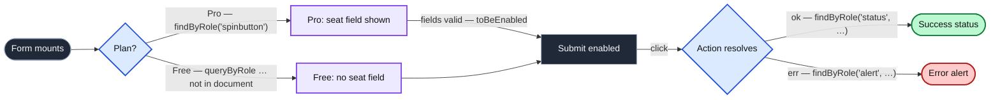

import Figure from '../../../components/figures/Figure.astro';
import AnnotatedCode from '../../../components/code/annotated-code/AnnotatedCode.astro';
import AnnotatedStep from '../../../components/code/annotated-code/AnnotatedStep.astro';
import CodeVariants from '../../../components/code/code-variants/CodeVariants.astro';
import CodeVariant from '../../../components/code/code-variants/CodeVariant.astro';
import Buckets from '../../../components/exercises/buckets/Buckets.astro';
import Bucket from '../../../components/exercises/buckets/Bucket.astro';
import Item from '../../../components/exercises/buckets/Item.astro';
import MultipleChoice from '../../../components/exercises/multiple-choice/MultipleChoice.astro';
import McqChoice from '../../../components/exercises/multiple-choice/McqChoice.astro';
import McqWhy from '../../../components/exercises/multiple-choice/McqWhy.astro';
import Checklist from '../../../components/ui/checklist/Checklist.astro';
import ChecklistItem from '../../../components/ui/checklist/ChecklistItem.astro';
import ExternalResource from '../../../components/ui/ExternalResource.astro';
import { CardGrid } from '@astrojs/starlight/components';
import CatalogMap from '../../../components/lessons/089/4/CatalogMap.astro';
import Term from '../../../components/ui/Term.astro';
import CourseProgressBar from '../../../components/ui/CourseProgressBar.astro';

<CourseProgressBar value={frontmatter['course-progress']} />

You have three pieces in place: the triggers that tell you *when* a component earns a test, off by default; a `render` helper that mounts a component and hands you a simulated user; and the query ladder, which finds elements the way a real user reaches them, role first.

What you don't yet have is a sense of where a component test *stops*. The triggers say whether to test and the ladder says how, but neither says which behaviors to hand off to the seam test or to end-to-end. Drawing that line is this lesson's skill, built through five real components from the app you've been building, each decided with the same three questions: which trigger it meets, what behaviors to assert, what to leave to another layer. The one new pattern along the way is mocking a Server Action at its import.

There are five entries because five distinct shapes of decision are worth seeing, not because a first-year codebase needs five tests. It might have one or two, and "zero, so far" is a sound answer.

<Figure caption="Five components that earn a test, each with exactly one trigger and a clear line on what someone else covers.">
  <CatalogMap />
</Figure>

Notice the third column: every component here has part of its story told by another layer. A component test that doesn't know where it stops is the most common way these tests go wrong, so we settle that line first.

## Mock the action at its import, not the database

Every form-shaped entry in the catalog hits the same wall. A client component imports a Server Action and calls it, through <Term definition="React 19 hook that holds a form's action result and its pending flag at the form's root.">useActionState</Term> or directly. Your test mounts it in a fake browser, where there is no server and no database. So what runs when the form submits?

Not the real action. Running it and checking the database afterward is the over-reach the first lesson named <Term definition="A component test that reaches past its own layer to assert on a Server Action's database effect.">"mocking too deep"</Term>: the test re-tests work the seam test already owns, costs more, and welds two layers together so a change in either breaks both. A component test should never know whether a row got written.

Replace the action at the import instead. Vitest hands a fake module to the import; you decide per test what that fake returns.

<div data-mark-color="blue">

```ts title="SubscribeForm.test.tsx" frame="code" "'@/server/actions/createSubscription'" "vi.mocked(createSubscription).mockResolvedValue"
import { vi } from 'vitest';
import { createSubscription } from '@/server/actions/createSubscription';
import { Result } from '@/lib/result';

// Hoisted: replaces the whole module before any test runs.
vi.mock('@/server/actions/createSubscription', () => ({
  createSubscription: vi.fn(),
}));

// Per test, pick the branch — approved | declined:
vi.mocked(createSubscription).mockResolvedValue(Result.ok({ subscriptionId: 'sub_123' }));
vi.mocked(createSubscription).mockResolvedValue(Result.err({ code: 'CARD_DECLINED' }));
```

</div>

<Term definition="The project's typed success-or-error return introduced at the seam — ok(data) for success, err({ code }) for a known failure.">`Result`</Term> is the contract the form and the action agree on. `vi.mock` replaces the whole module before any test runs, and `vi.mocked(...).mockResolvedValue(...)` picks which branch a test exercises. The mocked action exists only to drive a branch, making the form behave as if the card was approved or declined. It is not the thing under test.

That is the whole discipline. The **form test owns the form's contract with the action**: that valid data calls the action, that an `ok` result shows the success state, that an `err` result shows the right error. The **action test owns the action's body**: that it writes the row, logs the audit, calls Stripe, and holds the tenant boundary — the seam tests from last chapter. The two compose instead of overlapping: the form test trusts the `Result` contract and never looks past it; the action test verifies its own effects. **Test each thing once, at the layer that owns it.**

<CodeVariants maxLines={8}>
  <CodeVariant label="Brittle: assert the call">
    <div data-mark-color="red">

    ```ts "toHaveBeenCalledWith"
    await user.click(screen.getByRole('button', { name: /subscribe/i }));

    expect(createSubscription).toHaveBeenCalledWith(
      expect.objectContaining({ plan: 'pro', seats: 5 }),
    );
    ```

    </div>
    **Asserts the mock got called** with certain arguments, which is internal wiring. It breaks the moment you rename a field, and says nothing about what the user saw: a green test here is compatible with a form that submits and renders a blank screen.
  </CodeVariant>

  <CodeVariant label="Durable: assert the result">
    <div data-mark-color="green">

    ```ts "findByRole('status'"
    await user.click(screen.getByRole('button', { name: /subscribe/i }));

    expect(
      await screen.findByRole('status', { name: /subscription active/i }),
    ).toBeVisible();
    ```

    </div>
    **Asserts the user-observable consequence**: the success state appeared. It survives a rename of the action's arguments and fails for the right reason, that the user got no confirmation.
  </CodeVariant>
</CodeVariants>

The brittle version reads as "my mock got called"; the durable version, as "the user saw their subscription go active." One is a sentence about your plumbing, the other about your product. That difference holds for every entry below.

## Component 1 — the cookie consent gate

The consent gate is the cleanest first example, and its three beats recur in every component after it.

**The trigger it meets: a critical UX path with legal weight.** <Term definition="The project's consent provider hook — the single source of truth for whether non-essential scripts are allowed to run.">`useConsent()`</Term> gates your analytics on the visitor's choice. One wrong line fires tracking before consent: a real privacy exposure, not a cosmetic bug. Too consequential for manual review, too fiddly for the end-to-end happy path to cover every branch.

**The behaviors to assert.** Phrase each as a sentence about the user, and the query falls out of it.

- A first-time visitor with no stored consent *sees the banner*: `findByRole('dialog', { name: /cookie/i })`. (A non-modal strip has role `region`, not `dialog`. Query the role the component exposes; a failing query is the prompt to fix its semantics.)
- Clicking **Accept** *dismisses the banner and records consent*: assert the banner is gone with `queryByRole(...)` and `not.toBeInTheDocument()`, plus that the consent setter was called with the granted value.
- Clicking **Reject** *records the rejected value and dismisses*: the same shape with a different stored value.
- A visitor whose consent is already stored *never sees the banner* on mount, again with the negative query.
- The gate reads `false` before consent and `true` after, checked by rendering a tiny consumer of `useConsent()`.

The render-interact-assert case this component is built around:

<AnnotatedCode lang="tsx" maxLines={16} code={`
it('records consent and dismisses when the visitor accepts', async () => {
  vi.mocked(setConsent).mockResolvedValue(undefined);

  const { user } = render(<CookieConsent />);

  expect(
    await screen.findByRole('dialog', { name: /cookie/i }),
  ).toBeVisible();

  await user.click(screen.getByRole('button', { name: /accept/i }));

  expect(setConsent).toHaveBeenCalledWith('granted');
  expect(screen.queryByRole('dialog', { name: /cookie/i })).not.toBeInTheDocument();
});
`}>
  <AnnotatedStep meta="{2}" color="violet">
    The cookie write is mocked at the import, the same pattern from the last section, just on a *client* cookie helper rather than `next/headers`. We say the write succeeds; we don't test it.
  </AnnotatedStep>

  <AnnotatedStep meta="{4}" color="violet">
    Mount with no stored consent, so the banner has a reason to appear.
  </AnnotatedStep>

  <AnnotatedStep meta="{6-8}" color="violet">
    The user sees the banner. Use `findBy`, not `getBy`, because it may settle in asynchronously.
  </AnnotatedStep>

  <AnnotatedStep meta="{10}" color="violet">
    The user accepts.
  </AnnotatedStep>

  <AnnotatedStep meta="{12-13}" color="violet">
    The two consequences: the setter recorded `'granted'`, and the banner is gone. Use `queryByRole` for the absence assertion.
  </AnnotatedStep>
</AnnotatedCode>

This test asserts on one mock call: `setConsent` was called with `'granted'`. That looks like the smell the last section killed, but it isn't. Recording consent *is* this component's job and produces no separate rendered proof, so the call is the observable consequence. Assert the visible result when there is one; assert the call only when the call is the behavior the component owns.

Watch one trap. Consent lives in `document.cookie` (or the mocked store standing in for it), which survives between tests in the same file: a test that accepts consent leaves it accepted for the next, which then never sees its banner. Reset it in `afterEach`, the same reflex as the `cleanup` and `vi.resetAllMocks()` already in your setup.

**Left to end-to-end.** The component test proves the input flips: `useConsent()` reads `true` after the visitor accepts. Whether PostHog actually stops sending events before consent is the browser's job. Same shape as the action/seam split: prove the input here, prove the wire fires there.

## Component 2 — the multi-step subscribe form

This is the component the action-mock pattern was built for.

**The trigger it meets: a complex stateful interactive component.** The subscribe form runs a state graph with more than three nodes: plan selection reveals or hides fields, validation gates the submit button, and the action resolves into one of two outcomes. Those transitions live entirely in the component, so the seam test never sees them.

**The behaviors to assert.**

- The initial step *renders only plan selection*, so the seat-count field is absent: `queryByRole(...)` and `not.toBeInTheDocument()`.
- Selecting **Pro** *reveals the seat-count field*, and selecting **Free** *hides it again*: the branch the component test catches and the integration test structurally cannot.
- Submit is *disabled until required fields are filled*, so `toBeDisabled` flips to `toBeEnabled`.
- Submitting valid data drives the mocked action; assert the consequence, not the call. On `Result.ok`, the success state appears; on `Result.err({ code: 'CARD_DECLINED' })`, the error alert renders: `findByRole('alert', { name: /card was declined/i })`.
- The submit button's accessible name *reflects the form's state*, like "Subscribe to Pro, 5 seats": `toHaveAccessibleName(...)`.

The form is wired with `useActionState`, its pending state flowing through `useFormStatus` into the submit button. Your test never reaches for those hooks; it asserts on what they render. Take the conditional branch first.

<AnnotatedCode lang="tsx" maxLines={12} code={`
it('reveals the seat-count field only for the Pro plan', async () => {
  const { user } = render(<SubscribeForm />);

  expect(screen.queryByRole('spinbutton', { name: /seats/i })).not.toBeInTheDocument();

  await user.click(screen.getByRole('radio', { name: /pro/i }));
  expect(await screen.findByRole('spinbutton', { name: /seats/i })).toBeVisible();

  await user.click(screen.getByRole('radio', { name: /free/i }));
  expect(screen.queryByRole('spinbutton', { name: /seats/i })).not.toBeInTheDocument();
});
`}>
  <AnnotatedStep meta="{4}" color="violet">
    Before any choice, the seat-count field isn't in the document. The negative `queryByRole` pins the start node.
  </AnnotatedStep>

  <AnnotatedStep meta="{6-7}" color="violet">
    Choosing **Pro** reveals the field, with `findByRole` because it settles in after the click. The seam test never traverses this edge, because the action never sees the plan toggle.
  </AnnotatedStep>

  <AnnotatedStep meta="{9-10}" color="violet">
    Switching to **Free** hides it again, proving the transition runs both ways.
  </AnnotatedStep>
</AnnotatedCode>

Now the two outcomes of submitting, side by side: same form, two action contracts, two things the user sees.

<CodeVariants maxLines={8}>
  <CodeVariant label="Approved">

    ```tsx "mockResolvedValue" "findByRole('status'"
    vi.mocked(createSubscription).mockResolvedValue(Result.ok({ subscriptionId: 'sub_123' }));

    const { user } = render(<SubscribeForm />);
    await fillValidSubscription(user);
    await user.click(screen.getByRole('button', { name: /subscribe to pro/i }));

    expect(await screen.findByRole('status', { name: /subscription active/i })).toBeVisible();
    ```

    **The action resolves `ok`**, so the form shows its success state: a live `status` region announcing the subscription is active. Assert only what the user sees.
  </CodeVariant>

  <CodeVariant label="Declined">

    ```tsx "mockResolvedValue" "findByRole('alert'"
    vi.mocked(createSubscription).mockResolvedValue(Result.err({ code: 'CARD_DECLINED' }));

    const { user } = render(<SubscribeForm />);
    await fillValidSubscription(user);
    await user.click(screen.getByRole('button', { name: /subscribe to pro/i }));

    expect(await screen.findByRole('alert', { name: /card was declined/i })).toBeVisible();
    ```

    **The action resolves `err`**, so the same form renders an `alert` the user can read. Assert the branch's visible result, never the action's arguments.
  </CodeVariant>
</CodeVariants>

The form has one job in both cases: take the action's `Result` and turn it into something the user sees. That job lives in the component, so it's tested there. What the action does to produce `ok` versus `err`, charging the card, writing the row, logging the audit, is never in frame.

The form's state graph:

<Figure caption="Every edge is a behavior the component test owns and a branch the seam test never traverses.">

```mermaid
%%{init: {'themeCSS': '.nodeLabel, .nodeLabel * { font-size: 15px !important; } .edgeLabel, .edgeLabel * { font-size: 12.5px !important; }'} }%%
flowchart LR
  start(["Form mounts"])
  plan{"Plan?"}
  pro["Pro: seat field shown"]
  free["Free: no seat field"]
  ready["Submit enabled"]
  submit{"Action resolves"}
  okState(["Success status"])
  errState(["Error alert"])

  start --> plan
  plan -- "Pro — findByRole('spinbutton')" --> pro
  plan -- "Free — queryByRole … not in document" --> free
  pro -- "fields valid — toBeEnabled" --> ready
  free --> ready
  ready -- click --> submit
  submit -- "ok — findByRole('status', …)" --> okState
  submit -- "err — findByRole('alert', …)" --> errState

  class start,ready entry
  class plan,submit gate
  class pro,free reveal
  class okState ok
  class errState err

  classDef entry fill:#1f2937,stroke:#94a3b8,color:#f8fafc
  classDef gate fill:#dbeafe,stroke:#1d4ed8,color:#111,stroke-width:2px
  classDef reveal fill:#ede9fe,stroke:#7c3aed,color:#111,stroke-width:2px
  classDef ok fill:#bbf7d0,stroke:#15803d,color:#111,stroke-width:2px
  classDef err fill:#fecaca,stroke:#b91c1c,color:#111,stroke-width:2px
```
</Figure>

**Left to the seam** (last chapter): the database write, the audit entry, the Stripe call. **Left to end-to-end** (next chapter): the full Stripe Checkout redirect after the form succeeds. The component test stops at the edge of the graph; everything past `Submit` is someone else's test.

## Component 3 — the date-range picker

**The trigger it meets: a shared component library.** This picker is consumed across Reports, Invoices, and Filters, so one bug ships as three regressions in three features. A single test on a shared primitive pays for itself many times over.

**The behaviors to assert.**

- It *renders its default range in the user's locale*: render with a locale and assert on the formatted date text the user reads.
- Selecting a start date past the current end date *snaps the end date forward*, coordinating the two ends of the range.
- Keyboard navigation *moves the focused day*: `await user.keyboard('{ArrowRight}')`, then assert with `toHaveFocus()`.
- `Esc` *closes the popover and returns focus to the trigger*: assert `toHaveFocus()` on the trigger after close, an accessibility behavior manual testing skips.
- Selecting a range *updates the displayed range*: assert the user-visible result.

A picker that reads the real clock is flaky by construction: "this month" changes with the day CI runs. Pin time with `vi.setSystemTime(new Date('2026-05-14'))`, the <Term definition={`The swappable time source from the testing chapters, so "today" is deterministic in a test.`}>clock seam</Term>, and "today" is the same date every run.

The focus walk in full:

<AnnotatedCode lang="tsx" maxLines={16} code={`
it('moves focus by keyboard and returns it to the trigger on close', async () => {
  vi.setSystemTime(new Date('2026-05-14'));
  const { user } = render(<DateRangePicker />);

  const trigger = screen.getByRole('button', { name: /select dates/i });
  await user.click(trigger);

  await user.keyboard('{ArrowRight}');
  expect(screen.getByRole('button', { name: /15 may/i })).toHaveFocus();

  await user.keyboard('{Escape}');
  expect(trigger).toHaveFocus();
});
`}>
  <AnnotatedStep meta={`{2} "vi.setSystemTime"`} color="violet">
    Pin "today" so the grid is deterministic: "15 May" is a stable target only when today is fixed.
  </AnnotatedStep>

  <AnnotatedStep meta={`{5-6} "/select dates/i"`} color="violet">
    Grab the trigger by role and accessible name, then click to open the popover.
  </AnnotatedStep>

  <AnnotatedStep meta={`{8-9} "{ArrowRight}" "toHaveFocus"`} color="violet">
    The arrow key moves focus one day forward, so assert "15 May" now holds focus. Focus management lives in the component, so this test owns it.
  </AnnotatedStep>

  <AnnotatedStep meta={`{11-12} "{Escape}" "toHaveFocus"`} color="violet">
    Escape closes the popover and sends focus *back to the trigger* rather than off into the void, the behavior a keyboard user feels the instant it breaks.
  </AnnotatedStep>
</AnnotatedCode>

Only the component test can hold this: no other layer sees focus move. The locale-aware render puts the `render` helper's locale option to work:

<div data-mark-color="blue">

```tsx title="DateRangePicker.test.tsx" frame="code" "{ locale: 'es-ES', messages: esMessages }"
import esMessages from '@/messages/es-ES.json';

vi.setSystemTime(new Date('2026-05-14'));

render(<DateRangePicker />, { locale: 'es-ES', messages: esMessages });

// The Spanish month, lowercased, no comma — the locale read all the way through:
expect(screen.getByText('14 may 2026')).toBeVisible();
```

</div>

**Left out entirely.** The calendar's internal cell layout, which element wraps which day, is the library's business. Assert that the picker behaves; never assert on its internals, the same carve-out the ladder lesson drew around third-party widgets.

## Component 4 — the data table with row selection

**The trigger it meets: a shared component library.** A `<DataTable>` backs every list surface in the app: invoices, customers, exports. Its selection state and the toolbar that reacts to it behave the same wherever the table appears, so one test protects all those surfaces at once.

**The behaviors to assert.**

- Rows *render with the expected accessible names*: `getAllByRole('row')` for the count, plus per-row content. Address a row by what it contains, not by its array index.
- Clicking a row's checkbox *selects it and updates the toolbar count* to "1 selected": scope the checkbox with `within(row).getByRole('checkbox')`, then assert the toolbar text.
- The header checkbox *toggles all rows*, select-all and deselect-all.
- Selecting rows *enables the Delete button*, so `toBeDisabled` flips to `toBeEnabled`.
- Clicking **Delete** with two rows selected *opens a confirm dialog whose name carries the count*: `getByRole('dialog', { name: /delete 2 invoices/i })`. The count is computed from selection state, a dynamic accessible name.

The walkthrough below is where `within` scoping and that dynamic dialog name do their work.

<AnnotatedCode lang="tsx" maxLines={16} code={`
it('confirms deletion with the selected count in the dialog name', async () => {
  vi.mocked(deleteInvoices).mockResolvedValue(Result.ok({ deleted: 2 }));
  const { user } = render(<InvoicesTable rows={twoInvoices} />);

  for (const row of screen.getAllByRole('row').slice(1, 3)) {
    await user.click(within(row).getByRole('checkbox'));
  }

  expect(screen.getByText('2 selected')).toBeVisible();

  const remove = screen.getByRole('button', { name: /delete/i });
  expect(remove).toBeEnabled();
  await user.click(remove);

  expect(screen.getByRole('dialog', { name: /delete 2 invoices/i })).toBeVisible();
});
`}>
  <AnnotatedStep meta={`{2} "vi.mocked(deleteInvoices)"`} color="violet">
    The delete action is mocked at the import, the same pattern as the subscribe form. We say only "the delete succeeds"; the database effect is never in frame.
  </AnnotatedStep>

  <AnnotatedStep meta={`{5-7} "within(row)"`} color="violet">
    `within(row)` scopes the checkbox query to *that* row, so each click ticks the right box rather than the first on the page. The `slice(1, 3)` skips the header row.
  </AnnotatedStep>

  <AnnotatedStep meta={`{9} "'2 selected'"`} color="violet">
    The toolbar count is the user-observable proof that two rows are selected.
  </AnnotatedStep>

  <AnnotatedStep meta={`{12-13} "toBeEnabled" "user.click(remove)"`} color="violet">
    Selecting rows enabled the Delete button, so `toBeDisabled` has flipped to `toBeEnabled`, and the user clicks it.
  </AnnotatedStep>

  <AnnotatedStep meta={`{15} /delete 2 invoices/i`} color="violet">
    The dialog's accessible name carries the live count, "Delete 2 invoices", proving it is wired to selection state.
  </AnnotatedStep>
</AnnotatedCode>

Leave the header-checkbox and row-render assertions as one-liners; the flow above already carries their shape.

**Left out.** Pagination is URL-state, so it's integration territory with its own test elsewhere. The table's <Term definition="Rendering only the rows currently in view and recycling DOM nodes as the user scrolls, so a long list stays cheap.">virtualization</Term> belongs to the library. Assert the visible rows and the selection behavior, never the virtualizer.

## Component 5 — the checkout summary line

This is the purest component test in the catalog: props in, rendered content out, no interactions, mocks, or async.

**The trigger it meets: a critical UX path on the money surface.** Before a user commits money, they read the total, the tax, the discount, and the trial-end date, each a sentence that deserves an assertion. Too consequential for manual review, and its content variants (coupon or not, trial or not, one locale or another) are too granular for the end-to-end happy path, which exercises exactly one.

**The behaviors to assert**, a matrix of prop variants mapped to rendered content, one `it` per variant:

- `plan: 'pro', seats: 5, couponCode: undefined` → the total line *reads the expected amount*.
- A coupon applied → the *discount line appears* and the total updates. The happy-path end-to-end test never exercises this variant.
- The trial-end date *renders in the user's locale and timezone*: the `render` helper's locale option and the project's date formatter at work.
- "Subtotal", "Tax", and "Total" *labels are present and announced*.

Two contrasting variants make the matrix concrete: the plain case, and the coupon case end-to-end never reaches.

<AnnotatedCode lang="tsx" maxLines={16} code={`
it('shows the plan total with no discount line when there is no coupon', () => {
  render(<CheckoutSummary plan="pro" seats={5} couponCode={undefined} />);

  expect(screen.getByText('Total')).toBeVisible();
  expect(screen.getByText('$250.00')).toBeVisible();
  expect(screen.queryByText(/discount/i)).not.toBeInTheDocument();
});

it('shows the discount line and an updated total when a coupon applies', () => {
  render(<CheckoutSummary plan="pro" seats={5} couponCode="LAUNCH20" />);

  expect(screen.getByText(/discount/i)).toBeVisible();
  expect(screen.getByText('$200.00')).toBeVisible();
});
`}>
  <AnnotatedStep meta="{1-7}" color="violet">
    With no coupon, the total reads the full `$250.00` and no discount line shows. The negative `queryByText` pins that absence, since a leaked discount row on a money surface is a real bug.
  </AnnotatedStep>

  <AnnotatedStep meta="{9-14}" color="violet">
    Change one prop, `couponCode="LAUNCH20"`, and a discount line appears as the total drops to `$200.00`. That's the matrix: one `it` per variant, each asserting the content it produces.
  </AnnotatedStep>
</AnnotatedCode>

This test needs no mocks beyond the locale provider the `render` helper supplies. One boundary is worth naming: the summary test asserts that the line *renders* the right value for its props, but how that number is computed is a pure unit test in `/lib`. Same rule as the form and the seam: test each thing once, at the layer that owns it.

On a presentational component like this, the reflex is to reach for `toMatchSnapshot()` and call it covered. Resist it.

<CodeVariants maxLines={8}>
  <CodeVariant label="Snapshot (churns)">
    <div data-mark-color="red">

    ```tsx "toMatchSnapshot"
    it('renders the checkout summary', () => {
      const { container } = render(<CheckoutSummary plan="pro" seats={5} />);
      expect(container).toMatchSnapshot();
    });
    ```

    </div>
    **Re-asserts the whole rendered tree byte-for-byte.** It fails on *every* copy tweak, spacing change, and class rename, so the team updates it on reflex, and a test you update on reflex catches nothing. It never tells you *which* number mattered. Churn without signal.
  </CodeVariant>

  <CodeVariant label="Explicit (durable)">
    <div data-mark-color="green">

    ```tsx "getByText('$250.00')"
    it('shows the right total for a 5-seat Pro plan', () => {
      render(<CheckoutSummary plan="pro" seats={5} />);
      expect(screen.getByText('Total')).toBeVisible();
      expect(screen.getByText('$250.00')).toBeVisible();
    });
    ```

    </div>
    **Names the thing that matters**, the total of `$250.00`, and survives every change that doesn't touch it. It fails for exactly one reason: the amount the user reads is wrong. A test with signal.
  </CodeVariant>
</CodeVariants>

On a money surface, "the amount is right" is the whole point, so assert the amount, by name.

## What doesn't earn a test

The catalog's real value is in what it leaves out. On the same app, the components that don't make the list and why:

- Every `<Card>`, `<Section>`, and `<PageHeader>` meets no trigger. With no state and no branching content, testing them is the coverage theatre the first lesson warned about: green checkmarks that catch nothing.
- The Stripe-redirect button on the pricing page is covered end-to-end next chapter. A component test here would duplicate that at higher cost and lower fidelity.
- The page-level Server Components are framework-orchestrated, never a Testing Library surface. Test them at the seam and on the money path, not with `render`.
- The Server Actions themselves are covered at the seam last chapter. You mock them here; you don't test them here.

Five reflexes for reviewing a new component test on the next pull request:

<Checklist id="component-test-review">
  <ChecklistItem>Which trigger does this meet? Name it in the pull request: "shared library", "complex state", or "critical UX". If no trigger fits, that's a request to delete the test.</ChecklistItem>
  <ChecklistItem>Are the queries role-first? A `data-testid` needs a one-line justification, or it's a smell.</ChecklistItem>
  <ChecklistItem>Does it assert what the user observes (rendered content, accessible names, focus) rather than internal state, props, or class names?</ChecklistItem>
  <ChecklistItem>Is every Server Action mocked at the import, and does its real test exist at the seam?</ChecklistItem>
  <ChecklistItem>Does it pass under `vitest --project component --sequence.shuffle.files`? A test that depends on order is a leaked-state bug.</ChecklistItem>
</Checklist>

## Decide the boundary

The most transferable skill in this chapter: given a behavior, name the layer that owns it. Component test? Seam test? End-to-end? Unit test? Or no test at all.

<MultipleChoice>
  A subscribe-form component test mounts the form, fills it in, clicks **Subscribe**, and its only assertion is:

  ```ts
  expect(createSubscription).toHaveBeenCalledWith({ plan: 'pro', seats: 5 });
  ```

  The test passes. What's the problem with it?

  <McqChoice correct>
    It checks that the mocked action was *called*, but never checks what the form did with the result — so it stays green even if the form then renders nothing and the user is left staring at a dead screen.
  </McqChoice>
  <McqChoice>
    Calling a real Server Action from jsdom hits the database, so this assertion can never pass in a component test.
  </McqChoice>
  <McqChoice>
    It stops too early — it should go on to read back the subscription row to confirm the write actually landed.
  </McqChoice>
  <McqChoice>
    Nothing — pinning the exact arguments passed to the action is the tightest possible test of a form.
  </McqChoice>

  <McqWhy>
    The mocked action's only job is to *drive a branch*; the form's job is to turn that branch into something the user can see. Assert the visible consequence of the action resolving — the success `status` region, or the declined-card `alert` — not the call. That assertion survives a field rename and fails for the right reason: the user got no feedback.

    The other options miss the point. Server Actions mock cleanly at the import (`vi.mock`) — that's the pattern this lesson is built on, no real database involved. Reading back the row would be *mocking too deep*: the action's database effect belongs to the seam test, not here. And "exact arguments" is precise about plumbing while saying nothing about what the user experienced.
  </McqWhy>
</MultipleChoice>

Now the main drill.

<Buckets twoCol instructions="Sort each behavior into the test layer that owns it — or into 'don't test' if no trigger is met.">
  <Bucket name="component" label="Component test" description="Observable client behavior" />
  <Bucket name="seam" label="Seam / integration test" description="Server Action effect" />
  <Bucket name="e2e" label="End-to-end" description="Money path in a real browser" />
  <Bucket name="none" label="Don't test / delete" description="No trigger met, or wrong surface" />

  <Item bucket="component">The seat-count field appears when Pro is selected</Item>
  <Item bucket="component">The confirm dialog's name shows the count of selected rows</Item>
  <Item bucket="component">Esc closes the date picker and returns focus to the trigger</Item>
  <Item bucket="component">The checkout summary shows a discount line when a coupon is applied</Item>
  <Item bucket="seam">`createSubscription` writes the subscription row and revalidates the path</Item>
  <Item bucket="seam">`deleteInvoice` refuses a member who lacks the admin role</Item>
  <Item bucket="e2e">The full Stripe Checkout redirect completes after **Subscribe**</Item>
  <Item bucket="e2e">PostHog actually stops firing events before the visitor consents</Item>
  <Item bucket="none">The `<Card>` component renders its children</Item>
  <Item bucket="none">The page-level Server Component fetches and lists invoices</Item>
</Buckets>

Where a behavior gets tested is the question an experienced engineer answers in a second and a junior re-litigates every time.

## External resources

Two reflexes underneath the catalog go deeper here: querying the way a user reaches the screen, and replacing a module at its import so a component test stops at its own layer.

<CardGrid>
  <ExternalResource
    title="Common mistakes with React Testing Library"
    href="https://kentcdodds.com/blog/common-mistakes-with-react-testing-library"
    icon="simple-icons:testinglibrary"
    iconColor="#E33332"
    description="Kent C. Dodds, the library's author, on testing what the user observes, role-first queries, and using query* only for absence: the same discipline as this lesson, from the source."
  />
  <ExternalResource
    title="About Queries — query priority"
    href="https://testing-library.com/docs/queries/about/"
    icon="simple-icons:testinglibrary"
    iconColor="#E33332"
    description="The canonical ladder: getByRole first, getByTestId only as a last resort, and when to reach for getBy / findBy / queryBy."
  />
  <ExternalResource
    title="Guiding Principles"
    href="https://testing-library.com/docs/guiding-principles/"
    icon="simple-icons:testinglibrary"
    iconColor="#E33332"
    description="The one sentence the whole library hangs on: the more your tests resemble how the software is used, the more confidence they give."
  />
  <ExternalResource
    title="Vitest — vi.mock & vi.mocked"
    href="https://vitest.dev/api/vi.html"
    icon="simple-icons:vitest"
    iconColor="#6E9F18"
    description="The reference behind the import-mock pattern: how vi.mock hoists, what vi.mocked types for you, and the mock lifecycle helpers."
  />
  <ExternalResource
    title="React Testing for Beginners (Mosh)"
    href="https://www.youtube.com/watch?v=8Xwq35cPwYg"
    icon="simple-icons:youtube"
    iconColor="#FF0000"
    description="A 77-minute hands-on tour of React Testing Library with Vitest, covering render, queries, and user interactions, if you want the whole arc end to end."
  />
</CardGrid>
