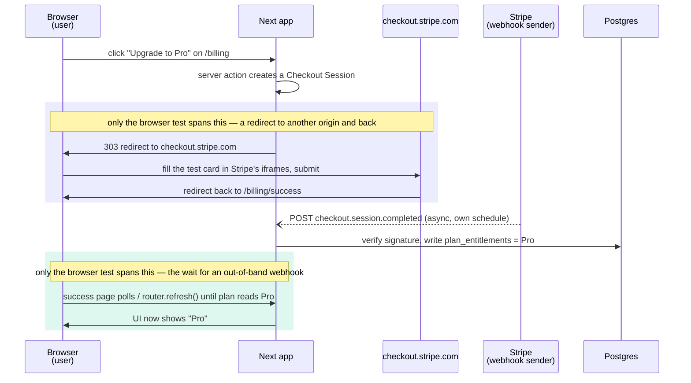

import AnnotatedCode from '../../../components/code/annotated-code/AnnotatedCode.astro';
import AnnotatedStep from '../../../components/code/annotated-code/AnnotatedStep.astro';
import Figure from '../../../components/figures/Figure.astro';
import Buckets from '../../../components/exercises/buckets/Buckets.astro';
import Bucket from '../../../components/exercises/buckets/Bucket.astro';
import Item from '../../../components/exercises/buckets/Item.astro';
import CodeReview from '../../../components/exercises/code-review/CodeReview.astro';
import ReviewFile from '../../../components/exercises/code-review/ReviewFile.astro';
import ReviewIssue from '../../../components/exercises/code-review/ReviewIssue.astro';
import ReviewWhy from '../../../components/exercises/code-review/ReviewWhy.astro';
import Term from '../../../components/ui/Term.astro';
import ExternalResource from '../../../components/ui/ExternalResource.astro';
import VideoCallout from '../../../components/embeds/VideoCallout.astro';
import InviteArrivalShapes from '../../../components/lessons/090/3/InviteArrivalShapes.astro';
import CourseProgressBar from '../../../components/ui/CourseProgressBar.astro';
import { Code } from '@astrojs/starlight/components';
import { CardGrid } from '@astrojs/starlight/components';

<CourseProgressBar value={frontmatter['course-progress']} />

Lesson 1 gave you the filter — money, identity, unrecoverable data — and the discipline to keep E2E off by default. Lesson 2 gave you the kit — the config against a production build, `storageState` so you sign in once, role-first locators, auto-waiting assertions, fixtures, the `saas_e2e` database, and the trace viewer. This lesson spends both. We point the kit at the four paths in our invoice app that actually clear the filter and write the spec for each.

There are exactly four, and we'll take them in this order: **sign-in** to the paid surface, the **Stripe Checkout** round-trip, **invitation acceptance** with a seat grant, and the **invoice value loop** — create, send, get paid, see it flip to paid. The order is not arbitrary. It's the order a real team adopts them: the first three are universal to every SaaS, the last is the one path that depends on what your product actually does. Think of these four as a destination, not a day-one checklist. A team reaches first for sign-in and checkout, and adds the other two only when manually verifying every release stops scaling. Once they're in place, the catalog is the canon — you extend it the same way, without re-litigating the trigger every time.

Each spec below is one you could paste into `tests/e2e/` and adapt. To keep your attention on the one thing each path teaches, the specs are shown as focused excerpts — one or two behaviors apiece, not the full multi-assertion file you'd actually commit. Lead with what failure costs, then what to assert, then the spec, then the single new mechanic the path introduces.

## Money path 1 — sign-in to the paid surface

This is the first money path of every SaaS, and the filter is easy to apply out loud: if sign-in breaks on production, **identity breaks** — paying users can't reach the product they pay for. Nothing downstream matters if the front door is jammed.

Here's the twist that makes this path worth leading with. The entire `storageState` machinery from Lesson 2 exists so that *every other test* skips the login screen. This is the one test that doesn't get to use it — because the thing under test *is* the login. It drives a fresh browser context with no saved session and actually types credentials into the form, the same way a real user does on a cold visit.

The app's sign-in is the Better Auth email-and-password flow from earlier, the one whose server result is a discriminated union — a success branch or a tagged failure like `'invalid-credentials'`. Four behaviors are worth asserting, and they map straight onto those branches:

1. `/sign-in` renders with email and password fields you can find by their labels.
2. Valid credentials redirect to `/dashboard`, with the signed-in user's name visible.
3. Invalid credentials surface an error alert and leave you on `/sign-in` — the `'invalid-credentials'` branch, seen from the browser.
4. The dual-key rate limiter blocks the sixth bad attempt and shows the lockout copy — the `'too-many-attempts'` branch.

The spec below covers the happy redirect and the invalid-credentials branch in one file. Notice the import: `test` and `expect` come from `./fixtures`, the local re-export from Lesson 2, never from `@playwright/test` directly.

<AnnotatedCode lang="ts" maxLines={18} code={`
import { test, expect } from './fixtures';

test('signs in and lands on the dashboard', async ({ page }) => {
  await page.goto('/sign-in');
  await page.getByLabel(/email/i).fill('owner@e2e.test');
  await page.getByLabel(/password/i).fill('correct-horse-battery');
  await page.getByRole('button', { name: /sign in/i }).click();

  await expect(page).toHaveURL(/\\/dashboard/);
  await expect(page.getByText(/welcome, ada/i)).toBeVisible();
});

test('rejects a wrong password', async ({ page }) => {
  await page.goto('/sign-in');
  await page.getByLabel(/email/i).fill('owner@e2e.test');
  await page.getByLabel(/password/i).fill('wrong-password');
  await page.getByRole('button', { name: /sign in/i }).click();

  await expect(page.getByRole('alert')).toHaveText(/invalid email or password/i);
  await expect(page).toHaveURL(/\\/sign-in/);
});
`}>
  <AnnotatedStep meta={`{1} "./fixtures"`} color="blue">
    The import is from `./fixtures`, never `@playwright/test` directly. The `{ page }` fixture you get here is a fresh context with **no** `storageState` — this is the one test in the whole suite that logs in for real, because the thing under test *is* the login.
  </AnnotatedStep>

  <AnnotatedStep meta="{5-7}" color="blue">
    Drive the form with the same role-first + label ladder from Lesson 2: `getByLabel` for the fields, `getByRole('button', …)` to submit. `owner@e2e.test` is the seeded owner credential, consistent with Lesson 2's seed.
  </AnnotatedStep>

  <AnnotatedStep meta={`{9-10} "toHaveURL"`} color="orange">
    The happy assertion — the payload of this test. Auto-waiting `toHaveURL` waits out the post-login redirect to `/dashboard`, then the signed-in user's name confirms the session actually landed in the browser.
  </AnnotatedStep>

  <AnnotatedStep meta={`{19-20} "getByRole"`} color="green">
    The negative branch: assert the error alert by its accessible role, and that we're still on `/sign-in`. This is the server's `'invalid-credentials'` discriminant — observed from the browser instead of read off the return value.
  </AnnotatedStep>
</AnnotatedCode>

Two wrinkles belong to this path specifically. First, **cross-browser**. Sign-in is one of only two paths (checkout is the other) that also runs in WebKit and Firefox, via the opt-in `PLAYWRIGHT_PROJECTS=all` projects from Lesson 2. Auth breakage is browser-specific often enough — a cookie attribute one engine honors and another drops, a redirect one handles differently — to pay for the extra runtime here and nowhere casual.

Second, the lockout assertion only means something from a known starting count. If a previous run already burned five attempts, the sixth-attempt test is testing nothing.

:::note
The seed handles this. `pnpm db:e2e:reset` clears the Upstash rate-limit counters for `*@e2e.test` emails, so every run starts the sign-in tests from attempt zero. The reset owns the precondition; the test just asserts the outcome.
:::

## Money path 2 — the Stripe Checkout round-trip

This is the canonical money path and the centerpiece of the chapter. The filter is blunt here: if this breaks, **money moves wrong**. A user pays and doesn't get the plan, or gets the plan without paying. Either way you have an angry customer and a refund to process.

What makes this *the* path that justifies the entire E2E layer is where the bug lives. It doesn't live in any one component — it lives in the **composition**. The session has to survive a redirect out to a third-party origin (`checkout.stripe.com`) and back. And the plan the user sees on return was written not by the page they're looking at, but by a webhook — a different process, arriving on its own schedule, that the success page has to wait for.

You've already seen the webhook tested in isolation at the integration layer. That test proves *given this Stripe event, Postgres flips the plan*. Worth having, and cheaper. But it can't tell you whether a real user clicking **Pay** completes the round-trip and ends up looking at "Pro." That's a different bug class entirely, and only the browser, driving the whole flow, can catch it. Hold onto that distinction — it's the reason this test exists and the reason it can't be replaced by something faster.

The diagram below is the composition, drawn out. Scrub your eye across it and watch where the flow leaves your app and comes back, and where the webhook arrives on its own track. Two of these arrows are spanned by *nothing but the browser test* — the redirect round-trip, and the wait for the webhook before the UI shows the new plan. Those two arrows are why this is E2E-only.

<Figure caption="The composition is the justification — two processes and a third-party origin in one flow the user perceives as a single click. (Unit 18)">

</Figure>

Now the spec. A signed-in owner — this time *with* `storageState`, since the login isn't what we're testing — starts on `/billing`, clicks **Upgrade to Pro**, pays with Stripe's universal test card, and returns to see the plan badge read "Pro."

<AnnotatedCode lang="ts" maxLines={18} code={`
import { test, expect } from './fixtures';

test('upgrades to Pro through Stripe Checkout', async ({ page }) => {
  await page.goto('/billing');
  await page.getByRole('button', { name: /upgrade to pro/i }).click();
  await expect(page).toHaveURL(/checkout\\.stripe\\.com/);

  const card = page.frameLocator('iframe[name^="__privateStripeFrame"]');
  await card.getByLabel(/card number/i).fill('4242 4242 4242 4242');
  await card.getByLabel(/expiration/i).fill('12 / 34');
  await card.getByLabel(/cvc/i).fill('123');
  await page.getByRole('button', { name: /pay/i }).click();

  await expect(page).toHaveURL(/\\/billing\\/success/);
  await expect(page.getByRole('status')).toHaveText(/pro/i);
});
`}>
  <AnnotatedStep meta={`{1} {4-5}`} color="blue">
    The owner arrives already authenticated — `storageState` is wired per-project in Lesson 2, so this test skips the login screen entirely. It lands on `/billing` and clicks **Upgrade to Pro** with the same role-first locator ladder.
  </AnnotatedStep>

  <AnnotatedStep meta="{6}" color="blue">
    Assert we actually left for Stripe's origin. Auto-waiting `toHaveURL` waits out the 303 redirect to `checkout.stripe.com` — the first arrow only the browser test spans.
  </AnnotatedStep>

  <AnnotatedStep meta={`{8-11} "frameLocator"`} color="orange">
    The new mechanic. Stripe nests its card fields in iframes; `frameLocator` is the handle that reaches inside them. Inside the frame you still pin to role and label — never CSS. `4242 4242 4242 4242` is Stripe's documented universal test card.
  </AnnotatedStep>

  <AnnotatedStep meta={`{12} {14}`} color="blue">
    Submit the payment, then assert the redirect back to `/billing/success`. The session survived the round-trip out to a third-party origin and home again.
  </AnnotatedStep>

  <AnnotatedStep meta="{15}" color="green">
    The payload: the plan badge reads "Pro", read straight from the DOM. This is what the success page's poll-until-the-webhook-lands produces — the user's view of truth, never an internal table read.
  </AnnotatedStep>
</AnnotatedCode>

The one genuinely new API here is <Term definition="Playwright's handle for locating elements inside an iframe — e.g. Stripe's hosted card fields, which live in a frame your page doesn't own.">`frameLocator`</Term>. Stripe's hosted checkout page nests the card entry in iframes, and a normal locator can't see across that boundary. `page.frameLocator('iframe[name="..."]')` gives you a scoped locator for the frame's contents; from there you pin to role and name *inside* the frame — `getByLabel(/card number/i)` — exactly the ladder you already use, never CSS. (Newer Playwright also offers `locator.contentFrame()` as an equivalent idiom; `frameLocator` stays our default because it's the most direct shape for a hosted page.)

<VideoCallout videoId="JPD4qYBt-g8" videoTitle="Working with Iframes in Playwright">
  CommitQuality's six-minute walkthrough of `frameLocator` — creating a frame-scoped locator and interacting inside it, the exact mechanic the Stripe card-fill relies on.
</VideoCallout>

There's a tension worth naming, because Lesson 2 deliberately left it for here. Playwright's own best-practices guidance warns you against testing third parties you don't control — and that's correct, as a default. Driving <Term definition="Stripe's parallel sandbox: test API keys and test cards like 4242 4242 4242 4242. No real money moves; the behavior is a stable, documented contract.">Stripe test mode</Term> is the course's deliberate exception. The reasoning is simple: in a money path, Stripe *is* part of the system under test. You're not validating Stripe's UI — you're validating that *your* session, *your* redirect, and *your* webhook handling compose correctly around it. And test mode plus the `4242` card is a documented, stable contract, not the flaky live dependency the warning is about. Drive it, and don't feel guilty.

Two scope guards, named once each so you don't over-build. First, single-browser is fine for checkout's *own* coverage — it's a cross-browser path only because sign-in is, and the next chapter revisits how deep to go. Second, Stripe Test Clocks — fast-forwarding a billing *cycle* to test renewals and dunning — are integration territory, not E2E. Driving a full billing cycle inside one browser test would blow the runtime budget for no composition payoff.

This spec is the template the project chapter builds on. When you get there, you'll harden exactly this flow into a real, graded suite — so it's worth getting comfortable with its shape now.

## Money path 3 — invitation acceptance with seat grant

This path moves no money directly, yet it has the highest correctness stakes of the four. The filter still applies, through its third clause: a botched invitation is an **unrecoverable data-boundary breach** with multi-tenant blast radius. Grant a new member access to the wrong organization and you've leaked one tenant's data to another — the kind of bug that ends up in an incident report.

The detail that makes this path interesting to test is that the invitee is a **brand-new user on every run**. So, like sign-in, this test runs *without* `storageState` — it creates a fresh user, walks them through acceptance, and lets the next database reset clean up. Recall the app's invitation model from earlier: a signed token rides on the accept URL, four different arrival situations all funnel through one accept route, invite-sourced signups get their email auto-verified, and accepting switches the user's active organization.

Four behaviors carry the weight here — the seat-grant happy path, capped by the boundary guard:

1. A fresh user receives an invitation. The token arrives via a seed-inserted row; *sending the email itself* is the integration test's job from earlier, not this one's. Name that boundary and step over it.
2. Opening the accept URL with the signed token lands on a sign-up form, with the invited email pre-filled.
3. Submitting credentials lands on the organization's dashboard, with the assigned role visible.
4. **The boundary assertion:** the new member tries to reach another organization's resource and gets a 404. The seat grant *and* its scoping, proven in one flow.

Before the spec, one thing to settle in your head: this test drives exactly *one* of the four arrival situations. The diagram below lays out all four — then narrows to the one the spec exercises — so you don't mistake a single spec for coverage of the whole feature. Scrub through it.

<InviteArrivalShapes />

Now the spec for that one shape — a signed-out user with no account yet.

<AnnotatedCode lang="ts" maxLines={18} code={`
import { test, expect } from './fixtures';

test('accepts an invite and is scoped to the org', async ({ page, invite }) => {
  await page.goto(\`/accept-invitation/\${invite.token}\`);
  await expect(page.getByLabel(/email/i)).toHaveValue(invite.email);

  await page.getByLabel(/password/i).fill('correct-horse-battery');
  await page.getByRole('button', { name: /accept invitation/i }).click();

  await expect(page).toHaveURL(/\\/dashboard/);
  await expect(page.getByText(/member/i)).toBeVisible();

  await page.goto(\`/orgs/\${invite.otherOrgId}/invoices\`);
  await expect(page.getByText(/not found/i)).toBeVisible();
});
`}>
  <AnnotatedStep meta={`{3} "invite"`} color="blue">
    A fresh user, **no** `storageState`. The `invite` fixture seed-inserts the token (the Lesson-2 fixtures pattern) and yields the token, the invited email, and a second org id to probe the boundary with.
  </AnnotatedStep>

  <AnnotatedStep meta="{4-5}" color="blue">
    Open the signed accept URL and assert the email arrives pre-filled — the token carried the identity, so the sign-up form knows who you are before you type a thing.
  </AnnotatedStep>

  <AnnotatedStep meta={`{7-8} {10-11}`} color="blue">
    Submit the sign-up and assert we land on the org's dashboard with the assigned role visible — the seat grant, observed from the browser.
  </AnnotatedStep>

  <AnnotatedStep meta="{13-14}" color="green">
    The load-bearing check: the new member reaches for **another** org's invoices and gets a 404. The seat was granted *and* scoped. This assertion is the whole reason the test earns its place.
  </AnnotatedStep>
</AnnotatedCode>

That 404 is the <Term definition="The per-org scoping that returns 404 when a user reaches another org's resource. Same blast radius the invitation guards: a member must see their org and no other.">multi-tenant guard</Term> doing its job, observed end to end. A smaller sibling test, worth a sentence and not a full spec, covers the expired-token case: open an accept URL whose seven-day token has lapsed and assert the rejection alert renders — the expiry as a security primitive, surfaced to the user.

## Money path 4 — the invoice value loop

The first three paths are universal — every SaaS signs people in, charges them, and grants access. This fourth one is where *your* product enters the picture. It's the one end-to-end loop where every layer has to align for the customer to actually receive the value they pay for. For our invoice app, that loop is: **create an invoice → send it → the recipient pays via Stripe → the invoice flips to paid in the UI.**

Lead with the generalizable lesson, because the specifics here are ours, not yours: **find the one or two loops where your product's core promise is delivered, and put those in the catalog.** In a project-management tool it might be "create a task, assign it, mark it done, see it move." In a file host it's "upload, share a link, the recipient downloads." The slot is always there; what fills it is the judgment call about your own product that paths 1 through 3 don't ask of you.

And here's the reassuring part: the pattern is one you already wrote. It's path 2's skeleton, applied to your own object — sign in as the right role with `storageState`, exercise the create surface, walk the third-party round-trip if there is one, return, and assert on the user-visible outcome. Same shape, different object. You don't need a fresh mental model; you need to recognize the loop.

Because this path reuses path 2's structure, the spec below doesn't get a full re-walk. It focuses on the one new thing this path introduces: data hygiene on a shared database.

<AnnotatedCode lang="ts" maxLines={18} code={`
import { test, expect } from './fixtures';

test('creates and lists an invoice without colliding', async ({ page }) => {
  const ref = \`invoice-\${test.info().title}-\${Date.now()}\`;

  await page.goto('/invoices/new');
  await page.getByLabel(/reference/i).fill(ref);
  await page.getByLabel(/amount/i).fill('250.00');
  await page.getByRole('button', { name: /create invoice/i }).click();

  await expect(page.getByRole('row', { name: ref })).toBeVisible();
});
`}>
  <AnnotatedStep meta="{4}" color="orange">
    The new bit. Value-loop tests write to the **shared** seeded org — parallel workers, one `saas_e2e` — so each test names its records with a unique id: the test title plus a timestamp. Two workers writing at once never collide on the same row.
  </AnnotatedStep>

  <AnnotatedStep meta="{6-9}" color="blue">
    The create surface, driven role-first with the same locator ladder — the same skeleton as path 2, pointed at your own object.
  </AnnotatedStep>

  <AnnotatedStep meta={`{11} "ref"`} color="green">
    The payload: assert on **your own** row, addressed by its unique `ref` — never "the first row" or a row count. That's what keeps the assertion stable while other workers write to the same table.
  </AnnotatedStep>
</AnnotatedCode>

The owner's org is shared across workers; the records inside it are addressed by name, never by position. And notice there's no per-test cleanup — no `afterEach` deleting rows. Cleanup is deferred: the next `pnpm db:e2e:reset` is the canonical clean, the run-level isolation seam Lesson 2 set up. Each test adds its own uniquely-named records and trusts the reset to wipe the slate between runs.

:::tip
The takeaway that travels to any codebase: find your product's value loop. It's the only entry in the catalog that's specific to *you* — the other three you can copy almost verbatim from one SaaS to the next.
:::

## What belongs in the catalog — and what has a cheaper home

This is the disciplinary heart of the lesson, so let's make it concrete. The rule, one more time: every candidate that *isn't* a money-path composition has a cheaper, more reliable home. The skill that matters most from this whole chapter is routing a candidate to the right layer instead of reaching for Playwright by reflex. Here are the false candidates that come up constantly, and where each actually belongs:

- **Form validation branches** — does the form reject a blank amount, a negative number, a too-long string? A component test. The browser adds nothing.
- **Search, filter combinations, pagination cursors** — these are URL-state behaviors, covered by integration tests against the route.
- **Settings page, docs page, marketing landing** — no money flow. Off the menu entirely.
- **A Server Action's behavior in isolation** — an integration test against the action, not a browser driving the form.
- **A component rendering correctly in a specific locale** — a component test.
- **"Smoke" tests that only check a page returns 200** — a curl-based health check in CI, not a Playwright run.
- **Visual snapshots** — a dedicated tool like Chromatic if you can afford it, otherwise off the menu.

Now drill it. Sort each candidate below into the catalog or its cheaper home. This is the filter applied to concrete cases — the single most transferable thing you'll take from this chapter.

<Buckets twoCol instructions="Each of these is a real test someone wanted to write. Sort each one into the E2E money-path catalog, or its cheaper, more reliable home.">
  <Bucket name="e2e" label="E2E money path" description="Composition across the whole stack — worth the seconds" />
  <Bucket name="cheaper" label="Cheaper home" description="Integration, component, or a health check" />

  <Item bucket="e2e">Sign-in redirects to the dashboard</Item>
  <Item bucket="e2e">Stripe Checkout returns and the UI shows Pro</Item>
  <Item bucket="e2e">An accepted invite grants the right org and 404s on others</Item>
  <Item bucket="cheaper">The invoice form rejects a blank amount</Item>
  <Item bucket="cheaper">The invoice list pagination cursor advances</Item>
  <Item bucket="cheaper">A webhook with a bad signature is rejected</Item>
  <Item bucket="cheaper">The marketing landing page renders</Item>
  <Item bucket="cheaper">A dashboard string shows in the right locale</Item>
</Buckets>

## OAuth sign-in — the conditional reach

A wrinkle worth a focused look, because for many real apps the *primary* sign-in isn't email and password at all — it's "Sign in with Google." So how do you E2E-test an <Term definition="Open standard for delegated sign-in: the user authenticates with a provider (Google, GitHub) and your app receives a token, never the password.">OAuth</Term> flow?

Honestly, you have two options and neither is clean. Option (a): drive a real Google test account through the consent screen. It's slow, brittle, and runs against many providers' automation terms of service — a fragile foundation for a per-PR gate. Option (b): drive the flow up to the **redirect to the provider**, and assert that the redirect URL your app constructed is correct — right client ID, right scopes, right callback. Lower fidelity, but fast and stable, and it tests the part you actually own.

For the per-PR suite, reach for option (b). Save the full round-trip for a quarterly manual-QA pass, if you do it at all. This is the same principle as the gate from Lesson 1: don't let a third party you can't reliably drive turn a money path into a flaky test. Assert the seam you *do* control — the URL you build — and stop there.

In practice the assertion is small: click the provider button, then check you landed on the provider with the right parameters.

<div data-mark-color="green">

<Code
  lang="ts"
  mark={[2]}
  code={`await page.getByRole('button', { name: /continue with google/i }).click();
await expect(page).toHaveURL(/accounts\\.google\\.com.*client_id=/);`}
/>

</div>

## Wiring the catalog into CI

The wiring is short, because Lesson 2 already owns the config — this section just states the workflow shape and the runtime budget for the catalog specifically. The four-path suite runs in CI after the build job, depends on the database being reset first, and on failure uploads the HTML report and trace artifacts. Remember from Lesson 2: the trace travels with the failure as a GitHub Actions artifact, so the reviewer downloads it and opens the trace viewer instead of guessing.

The runtime budget is worth internalizing. On Chromium only, the four paths run in roughly three to six minutes. Adding WebKit and Firefox for sign-in and checkout brings it to eight to ten. Past about fifteen minutes you'd reach for sharding — the seam Lesson 2 named but didn't set up, because a four-path suite is nowhere near needing it.

<div data-mark-color="green">

```yaml title=".github/workflows/playwright.yml" {2,8,11}
e2e:
  needs: build
  runs-on: ubuntu-latest
  steps:
    - uses: actions/checkout@v4
    - run: pnpm install --frozen-lockfile
    - run: pnpm exec playwright install --with-deps chromium
    - run: pnpm db:e2e:reset
    - run: pnpm exec playwright test
    - uses: actions/upload-artifact@v4
      if: failure()
      with:
        name: playwright-report
        path: playwright-report/
```

</div>

Three lines carry the weight. `needs: build` makes the suite run against the same artifact the build job produced, never a stale tree. `pnpm db:e2e:reset` runs *before* the test so every run starts from the seed — counters cleared, fixtures fresh — exactly the precondition the sign-in lockout and value-loop hygiene depend on. And `if: failure()` uploads the HTML report only when something broke, so the reviewer downloads the trace and opens it in the viewer instead of guessing.

## The reviewer's checklist for a new Playwright PR

Everything in this chapter compresses into one gate: the questions you ask when a teammate opens a PR adding a Playwright test. Six fast checks:

1. **Which money path does this cover?** Name it in the PR description. If you can't name one, it doesn't pass the filter — that's the first and most important question.
2. **Role-first locators throughout?** Any `data-testid` or CSS selector needs a justification.
3. **`storageState`, not a UI login** — except the sign-in path itself, which earns the exception?
4. **Passes ten times locally with `--retries=0`?** Flake is structural; a retry hides it.
5. **Does it touch a third party?** If Stripe, is the test-mode key in use? If something else, why is this E2E and not a seam test?
6. **Has a `trace.zip` been generated and reviewed against the assertions?**

Apply it now. The PR below adds a checkout test that looks plausible on a quick read. Leave inline comments on what an experienced reviewer would flag against the checklist.

<CodeReview instructions="Review this PR adding a checkout E2E test. Leave a comment on every line an experienced reviewer would flag against the six-point checklist.">
  <ReviewFile name="tests/e2e/checkout.spec.ts">
    ```ts
    import { test, expect } from '@playwright/test';

    test('checkout works', async ({ page }) => {
      await page.goto('/sign-in');
      await page.getByLabel(/email/i).fill('owner@e2e.test');
      await page.getByLabel(/password/i).fill('correct-horse-battery');
      await page.getByRole('button', { name: /sign in/i }).click();

      await page.goto('/billing');
      await page.locator('.upgrade-btn').click();
      await page.waitForTimeout(3000);
      await expect(page).toHaveURL(/checkout\.stripe\.com/);
    });
    ```
  </ReviewFile>

  <ReviewIssue file="tests/e2e/checkout.spec.ts" line={4} kernel="logs in through the UI instead of inheriting the saved session via `storageState` — this isn't the sign-in test">
    The whole preamble on lines 4–7 drives the login screen by hand, but the thing under test here is **checkout**, not sign-in. Every test that *isn't* the sign-in path should arrive already authenticated through the per-project `storageState` from Lesson 2 — that's checklist item 3. Replaying a full UI login inside every spec multiplies its cost across the suite for no coverage: it re-tests sign-in on every run instead of once. Delete the four login lines and let the project's saved session carry the owner in; the test should open straight onto `/billing`.
  </ReviewIssue>

  <ReviewIssue file="tests/e2e/checkout.spec.ts" line={10} kernel="CSS-class locator is brittle — use a role+name locator">
    `page.locator('.upgrade-btn')` pins the test to an implementation detail. A class rename during unrelated CSS work — or a refactor to a utility-class framework — silently breaks this test even though the button still works perfectly for users. That's checklist item 2: role-first locators throughout, and any CSS selector needs a justification this line doesn't have. `page.getByRole('button', { name: /upgrade to pro/i })` survives the rename and asserts the thing the user actually sees.
  </ReviewIssue>

  <ReviewIssue file="tests/e2e/checkout.spec.ts" line={11} kernel="`waitForTimeout` is a fixed sleep — replace with the auto-waiting `expect`">
    `waitForTimeout(3000)` is a hardcoded sleep, and a sleep is the structural source of flake the checklist (item 4) refuses to tolerate. It's wrong in both directions: too short on a slow CI runner and the redirect hasn't landed yet (flake), too long on a fast one and you've burned three seconds per run for nothing. The very next line's `toHaveURL` **already auto-waits** for the URL to match, so this sleep is both redundant and harmful — delete it.
  </ReviewIssue>

  <ReviewWhy>
    Notice what a strong Playwright PR is really about: what it *doesn't* do. The three flags here all trace straight to the reviewer's checklist — role-first locators (no CSS), `storageState` instead of a UI login on every non-sign-in path, and never a fixed sleep where an auto-waiting matcher already does the waiting. One minor extra: the import is from `@playwright/test` rather than the local `./fixtures` re-export, so this spec skips the fixtures and the `storageState` wiring entirely — the course convention is always `./fixtures`. Apply the checklist and most of the review writes itself.
  </ReviewWhy>
</CodeReview>

Step back and look at the shape of where you've landed. A team starting fresh in 2026 ships year one with **zero** Playwright tests — the integration suite catches the seam bugs, production observability catches the unknowns, and someone clicks through the money paths by hand before each release. Year two, when that manual pass stops scaling, they reach first for sign-in and checkout, then invitation and the value loop. Zero to four. That's the whole trajectory.

So the four-path catalog isn't a target you race toward — it's the destination a disciplined team converges on. And here's the instinct this entire chapter has been building toward: when you review someone's first Playwright PR, you push for *fewer, better-chosen tests, not more.* A good Playwright PR removes a test as often as it adds one.

## External resources

The two new mechanics this lesson introduced each have a canonical doc worth bookmarking, plus the official discipline guide behind the reviewer's checklist and a deeper talk from the Playwright team.

<CardGrid>
  <ExternalResource
    title="Playwright — Frame locators"
    href="https://playwright.dev/docs/frames"
    icon="simple-icons:playwright"
    iconColor="#2EAD33"
    description="The frameLocator API behind the Stripe iframe card-fill in the checkout spec."
  />
  <ExternalResource
    title="Stripe — Testing & test cards"
    href="https://docs.stripe.com/testing"
    icon="simple-icons:stripe"
    iconColor="#635BFF"
    description="Test mode, the 4242 card, and the other documented cards for simulating outcomes."
  />
  <ExternalResource
    title="Playwright — Best Practices"
    href="https://playwright.dev/docs/best-practices"
    icon="simple-icons:playwright"
    iconColor="#2EAD33"
    description="The official source for the reviewer's checklist: role-first locators, web-first assertions, and no hardcoded waits."
  />
  <ExternalResource
    title="Advanced Playwright Techniques (Debbie O'Brien)"
    href="https://www.youtube.com/watch?v=ybYK9jM0lco"
    icon="simple-icons:youtube"
    iconColor="#FF0000"
    description="A 50-minute NDC talk from the Playwright team's developer advocate on the capabilities you reach for once the catalog grows."
  />
</CardGrid>
