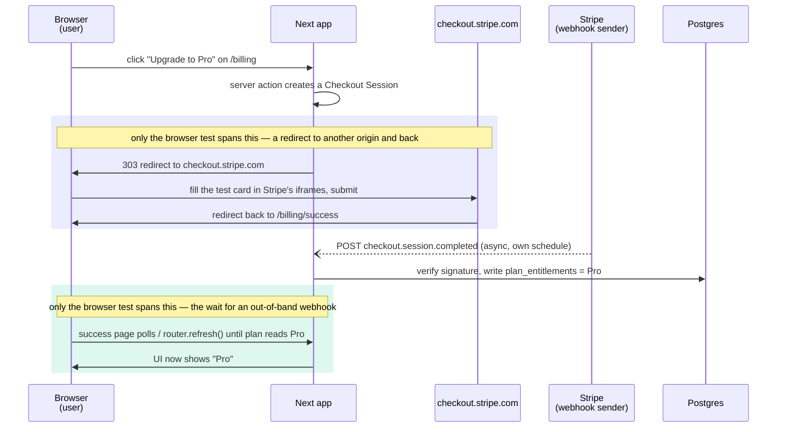

import AnnotatedCode from '../../../components/code/annotated-code/AnnotatedCode.astro';
import AnnotatedStep from '../../../components/code/annotated-code/AnnotatedStep.astro';
import Figure from '../../../components/figures/Figure.astro';
import CodeReview from '../../../components/exercises/code-review/CodeReview.astro';
import ReviewFile from '../../../components/exercises/code-review/ReviewFile.astro';
import ReviewIssue from '../../../components/exercises/code-review/ReviewIssue.astro';
import ReviewWhy from '../../../components/exercises/code-review/ReviewWhy.astro';
import Term from '../../../components/ui/Term.astro';
import ExternalResource from '../../../components/ui/ExternalResource.astro';
import VideoCallout from '../../../components/embeds/VideoCallout.astro';
import InviteArrivalShapes from '../../../components/lessons/090/3/InviteArrivalShapes.astro';
import CourseProgressBar from '../../../components/ui/CourseProgressBar.astro';
import { Code } from '@astrojs/starlight/components';
import { CardGrid } from '@astrojs/starlight/components';

<CourseProgressBar value={frontmatter['course-progress']} />

Lesson 1 gave you the filter (money, identity, unrecoverable data); Lesson 2 gave you the Playwright kit. Now you'll point the kit at the four paths in our invoice app that clear the filter and write a spec for each.

In the order a real team adopts them: **sign-in** to the paid surface, the **Stripe Checkout** round-trip, **invitation acceptance** with a seat grant, and the **invoice value loop** (create, send, get paid, watch it flip to paid). The first three are universal to every SaaS; the last depends on what your product does. Treat the four as a destination, not a day-one checklist: a team reaches first for sign-in and checkout, then adds the rest once verifying each release by hand stops scaling.

Each spec appears as a focused excerpt of a behavior or two, not the full multi-assertion file you'd commit, and leads with what failure costs, then what to assert, then the spec, then the one new mechanic it introduces.

## Money path 1: sign-in to the paid surface

This is the first money path of every web app: if sign-in breaks in production, paying users can't reach the product they pay for, and nothing downstream matters.

It also leads for a structural reason. Lesson 2's `storageState` exists so *every other test* skips the login screen; this is the one test that can't use it, because the thing under test *is* the login. It drives a fresh browser context with no saved session and types credentials, the way a real user does.

The app's sign-in is the Better Auth email-and-password flow, whose server result is a discriminated union: a success branch or a tagged failure like `'invalid-credentials'`. Four behaviors map onto those branches:

1. `/sign-in` renders with email and password fields findable by their labels.
2. Valid credentials redirect to `/dashboard`, with the signed-in user's name visible.
3. Invalid credentials surface an error alert and leave you on `/sign-in`: the `'invalid-credentials'` branch.
4. The dual-key rate limiter blocks the sixth bad attempt and shows the lockout copy: the `'too-many-attempts'` branch.

The spec covers the happy redirect and the invalid-credentials branch.

<AnnotatedCode lang="ts" maxLines={18} code={`
import { test, expect } from './fixtures';

test('signs in and lands on the dashboard', async ({ page }) => {
  await page.goto('/sign-in');
  await page.getByLabel(/email/i).fill('owner@e2e.test');
  await page.getByLabel(/password/i).fill('correct-horse-battery');
  await page.getByRole('button', { name: /sign in/i }).click();

  await expect(page).toHaveURL(/\\/dashboard/);
  await expect(page.getByText(/welcome, ada/i)).toBeVisible();
});

test('rejects a wrong password', async ({ page }) => {
  await page.goto('/sign-in');
  await page.getByLabel(/email/i).fill('owner@e2e.test');
  await page.getByLabel(/password/i).fill('wrong-password');
  await page.getByRole('button', { name: /sign in/i }).click();

  await expect(page.getByRole('alert')).toHaveText(/invalid email or password/i);
  await expect(page).toHaveURL(/\\/sign-in/);
});
`}>
  <AnnotatedStep meta={`{1} "./fixtures"`} color="blue">
    Import from `./fixtures`, never `@playwright/test` directly. The `{ page }` fixture here is a fresh context with **no** `storageState`, so this is the one test in the suite that logs in for real.
  </AnnotatedStep>

  <AnnotatedStep meta="{5-7}" color="blue">
    Drive the form with Lesson 2's role-first label ladder: `getByLabel` for the fields, `getByRole('button', …)` to submit. `owner@e2e.test` is the seeded owner credential from Lesson 2.
  </AnnotatedStep>

  <AnnotatedStep meta={`{9-10} "toHaveURL"`} color="orange">
    The payload. Auto-waiting `toHaveURL` waits out the post-login redirect to `/dashboard`, then the user's name confirms the session landed in the browser.
  </AnnotatedStep>

  <AnnotatedStep meta={`{19-20} "getByRole"`} color="green">
    The negative branch asserts the error alert by its accessible role and that we're still on `/sign-in`: the server's `'invalid-credentials'` discriminant, observed from the browser instead of read off a return value.
  </AnnotatedStep>
</AnnotatedCode>

Two details belong to this path. First, cross-browser coverage: sign-in and checkout are the only paths that also run in WebKit and Firefox, via Lesson 2's opt-in `PLAYWRIGHT_PROJECTS=all`. Auth breaks in browser-specific ways often enough to justify the runtime, such as a cookie attribute one engine honors and another drops.

Second, the lockout assertion only means something from a known starting count: if a previous run burned five attempts, the sixth-attempt test proves nothing.

:::note
The seed handles this. `pnpm db:e2e:reset` clears the Upstash rate-limit counters for `*@e2e.test` emails, so every run starts the sign-in tests from attempt zero.
:::

## Money path 2: the Stripe Checkout round-trip

This is the canonical money path and the centerpiece of the chapter. The filter is blunt: if this breaks, money moves wrong. A user pays and doesn't get the plan, or gets the plan without paying, and either way you have an angry customer and a refund to process.

This path justifies the whole E2E layer because of where the bug lives: not in any one component, but in the **composition**. The session has to survive a redirect out to a third-party origin (`checkout.stripe.com`) and back, and the plan the user sees on return is written not by the page they're looking at but by a webhook, a separate process that arrives on its own schedule and that the success page must wait for.

You've seen the webhook tested in isolation at the integration layer: given this Stripe event, Postgres flips the plan. That test is cheaper and worth having, but it can't tell you whether a real user clicking **Pay** completes the round-trip and ends up looking at "Pro." Only the browser, driving the whole flow, catches that class of bug.

In the diagram, the two highlighted arrows, the redirect out and back and the wait for the webhook, are why this path is E2E-only.

<Figure caption="The composition is the justification: two processes and a third-party origin in one flow the user perceives as a single click.">

```mermaid
%%{init: {'themeCSS': '.messageText, .messageText tspan, .noteText, .noteText tspan, .actor tspan { font-size: 17px !important; }'} }%%
sequenceDiagram
  participant B as Browser<br/>(user)
  participant App as Next app
  participant Stripe as checkout.stripe.com
  participant Hook as Stripe<br/>(webhook sender)
  participant PG as Postgres

  B->>App: click "Upgrade to Pro" on /billing
  App->>App: server action creates a Checkout Session

  rect rgba(129, 140, 248, 0.16)
    Note over B,Stripe: only the browser test spans this — a redirect to another origin and back
    App->>B: 303 redirect to checkout.stripe.com
    B->>Stripe: fill the test card in Stripe's iframes, submit
    Stripe->>B: redirect back to /billing/success
  end

  Hook--)App: POST checkout.session.completed (async, own schedule)
  App->>PG: verify signature, write plan_entitlements = Pro

  rect rgba(52, 211, 153, 0.16)
    Note over B,App: only the browser test spans this — the wait for an out-of-band webhook
    B->>App: success page polls / router.refresh() until plan reads Pro
    App->>B: UI now shows "Pro"
  end
```
</Figure>

The spec: a signed-in owner, this time *with* `storageState` since login isn't what we're testing, starts on `/billing`, clicks **Upgrade to Pro**, pays with Stripe's test card, and returns to see the plan badge read "Pro."

<AnnotatedCode lang="ts" maxLines={18} code={`
import { test, expect } from './fixtures';

test('upgrades to Pro through Stripe Checkout', async ({ page }) => {
  await page.goto('/billing');
  await page.getByRole('button', { name: /upgrade to pro/i }).click();
  await expect(page).toHaveURL(/checkout\\.stripe\\.com/);

  const card = page.frameLocator('iframe[name^="__privateStripeFrame"]');
  await card.getByLabel(/card number/i).fill('4242 4242 4242 4242');
  await card.getByLabel(/expiration/i).fill('12 / 34');
  await card.getByLabel(/cvc/i).fill('123');
  await page.getByRole('button', { name: /pay/i }).click();

  await expect(page).toHaveURL(/\\/billing\\/success/);
  await expect(page.getByRole('status')).toHaveText(/pro/i);
});
`}>
  <AnnotatedStep meta={`{1} {4-5}`} color="blue">
    The owner arrives already authenticated via Lesson 2's per-project `storageState`, so this test skips the login screen, lands on `/billing`, and clicks **Upgrade to Pro**.
  </AnnotatedStep>

  <AnnotatedStep meta="{6}" color="blue">
    Assert we left for Stripe's origin. Auto-waiting `toHaveURL` waits out the 303 redirect to `checkout.stripe.com`, the first arrow only the browser test spans.
  </AnnotatedStep>

  <AnnotatedStep meta={`{8-11} "frameLocator"`} color="orange">
    The new mechanic. Stripe nests its card fields in iframes, and `frameLocator` reaches inside them. Inside the frame you still pin to role and label, never CSS. `4242 4242 4242 4242` is Stripe's documented universal test card.
  </AnnotatedStep>

  <AnnotatedStep meta={`{12} {14}`} color="blue">
    Submit the payment, then assert the redirect back to `/billing/success`. The session survived the round-trip out to a third-party origin and home again.
  </AnnotatedStep>

  <AnnotatedStep meta="{15}" color="green">
    The payload: the plan badge reading "Pro", read straight from the DOM once the success page polls until the webhook lands. The user's view of truth, never an internal table read.
  </AnnotatedStep>
</AnnotatedCode>

The one new API is <Term definition="Playwright's handle for locating elements inside an iframe, such as Stripe's hosted card fields, which live in a frame your page doesn't own.">`frameLocator`</Term>. A normal locator can't see across an iframe boundary, so `page.frameLocator('iframe[name="..."]')` gives you a locator scoped to the frame's contents; inside it you pin to role and name with the same ladder you already use.

<VideoCallout videoId="JPD4qYBt-g8" videoTitle="Working with Iframes in Playwright">
  CommitQuality's six-minute walkthrough of `frameLocator`: creating a frame-scoped locator and interacting inside it, the exact mechanic the Stripe card-fill relies on.
</VideoCallout>

Playwright's best-practices guide warns against testing third parties you don't control, which is the right default. Driving <Term definition="Stripe's parallel sandbox: test API keys and test cards like 4242 4242 4242 4242. No real money moves, and the behavior is a stable, documented contract.">Stripe test mode</Term> is the course's deliberate exception, because in a money path Stripe *is* part of the system under test: you're not validating Stripe's UI, but that *your* session, redirect, and webhook handling compose correctly around it. Test mode plus the `4242` card is a documented, stable contract, not the flaky live dependency the warning is about.

Two scope guards, so you don't over-build. A single browser is fine for checkout's *own* coverage; it's cross-browser only because sign-in is. And Stripe Test Clocks, which fast-forward a billing *cycle* to test renewals and dunning, are integration territory, not E2E.

This spec is the template the project chapter builds on, where you'll harden this flow into a graded suite.

## Money path 3: invitation acceptance with seat grant

This path moves no money directly, yet carries the highest correctness stakes of the four, the filter's third clause at work: a botched invitation is an unrecoverable data-boundary breach with multi-tenant blast radius. Grant a new member access to the wrong organization and you've leaked one tenant's data to another.

The invitee is a brand-new user on every run, so like sign-in, this test runs *without* `storageState`: it creates a fresh user, walks them through acceptance, and lets the next database reset clean up. It leans on two facts from the app's invitation model: a signed token rides on the accept URL, and invite-sourced signups get their email auto-verified.

Four behaviors carry the weight, the seat-grant happy path capped by the boundary guard:

1. A fresh user receives an invitation, its token arriving via a seed-inserted row. Sending the email was the integration test's job, so name that boundary and step over it.
2. Opening the accept URL with the signed token lands on a sign-up form with the invited email pre-filled.
3. Submitting credentials lands on the organization's dashboard with the assigned role visible.
4. **The boundary assertion:** the new member tries to reach another organization's resource and gets a 404, proving the grant *and* its scoping in one flow.

This test drives exactly *one* of four arrival situations. The diagram lays out all four, then narrows to the one the spec exercises, so you don't mistake a single spec for whole-feature coverage.

<InviteArrivalShapes />

The spec drives that one shape: a signed-out user with no account yet.

<AnnotatedCode lang="ts" maxLines={18} code={`
import { test, expect } from './fixtures';

test('accepts an invite and is scoped to the org', async ({ page, invite }) => {
  await page.goto(\`/accept-invitation/\${invite.token}\`);
  await expect(page.getByLabel(/email/i)).toHaveValue(invite.email);

  await page.getByLabel(/password/i).fill('correct-horse-battery');
  await page.getByRole('button', { name: /accept invitation/i }).click();

  await expect(page).toHaveURL(/\\/dashboard/);
  await expect(page.getByText(/member/i)).toBeVisible();

  await page.goto(\`/orgs/\${invite.otherOrgId}/invoices\`);
  await expect(page.getByText(/not found/i)).toBeVisible();
});
`}>
  <AnnotatedStep meta={`{3} "invite"`} color="blue">
    A fresh user, **no** `storageState`. The `invite` fixture seed-inserts the token and yields the token, the invited email, and a second org id to probe the boundary with.
  </AnnotatedStep>

  <AnnotatedStep meta="{4-5}" color="blue">
    Open the signed accept URL and assert the email arrives pre-filled. The token carried the identity, so the form knows who you are before you type.
  </AnnotatedStep>

  <AnnotatedStep meta={`{7-8} {10-11}`} color="blue">
    Submit the sign-up and assert we land on the org's dashboard with the assigned role visible: the seat grant, observed from the browser.
  </AnnotatedStep>

  <AnnotatedStep meta="{13-14}" color="green">
    The load-bearing check: the new member reaches for **another** org's invoices and gets a 404. The seat was granted *and* scoped, the whole reason this test earns its place.
  </AnnotatedStep>
</AnnotatedCode>

That 404 is the <Term definition="The per-org scoping that returns 404 when a user reaches another org's resource. Same blast radius the invitation guards: a member must see their org and no other.">multi-tenant guard</Term> doing its job, observed end to end. A smaller sibling test covers the expired-token case: open an accept URL whose seven-day token has lapsed and assert the rejection alert renders.

## Money path 4: the invoice value loop

The first three paths are universal: every SaaS signs people in, charges them, and grants access. This fourth one is where *your* product enters, the loop where every layer has to align for the customer to receive the value they pay for. For our invoice app, that loop is **create an invoice → send it → the recipient pays via Stripe → the invoice flips to paid in the UI.**

The specifics are ours, not yours, so start with the part that generalizes: find the one or two loops where your product's core promise is delivered. In a project-management tool it might be "create a task, assign it, mark it done, see it move." In a file host, "upload, share a link, the recipient downloads." The slot is always there; filling it is the judgment call paths 1 through 3 don't ask of you.

The pattern you've already written: path 2's skeleton pointed at your own object. Sign in with `storageState`, exercise the create surface, walk the third-party round-trip if there is one, return, and assert on the user-visible outcome. Same shape, different object. So the spec below isn't re-walked in full; it focuses on the one new thing this path introduces, data hygiene on a shared database.

<AnnotatedCode lang="ts" maxLines={18} code={`
import { test, expect } from './fixtures';

test('creates and lists an invoice without colliding', async ({ page }) => {
  const ref = \`invoice-\${test.info().title}-\${Date.now()}\`;

  await page.goto('/invoices/new');
  await page.getByLabel(/reference/i).fill(ref);
  await page.getByLabel(/amount/i).fill('250.00');
  await page.getByRole('button', { name: /create invoice/i }).click();

  await expect(page.getByRole('row', { name: ref })).toBeVisible();
});
`}>
  <AnnotatedStep meta="{4}" color="orange">
    The new bit. Parallel workers all write to one shared `saas_e2e`, so each test names its records with a unique id, the test title plus a timestamp. Two workers writing at once never collide on the same row.
  </AnnotatedStep>

  <AnnotatedStep meta="{6-9}" color="blue">
    The create surface, driven role-first with the same locator ladder. Path 2's skeleton, pointed at your own object.
  </AnnotatedStep>

  <AnnotatedStep meta={`{11} "ref"`} color="green">
    Assert on **your own** row, addressed by its unique `ref`, never "the first row" or a row count. That keeps the assertion stable while other workers write to the same table.
  </AnnotatedStep>
</AnnotatedCode>

There's no per-test cleanup, no `afterEach` deleting rows. Cleanup is deferred to the next `pnpm db:e2e:reset`, the run-level isolation seam from Lesson 2: each test adds its uniquely-named records and trusts the reset to wipe the slate between runs.

:::tip
The takeaway that travels to any codebase: find your product's value loop. It's the only catalog entry specific to *you*; the other three copy almost verbatim from one SaaS to the next.
:::

## What belongs in the catalog, and what has a cheaper home

The rule: every candidate that *isn't* a money-path composition has a cheaper, more reliable home. The skill is routing each one to the right layer instead of reaching for Playwright by reflex. The false candidates that come up constantly, and where each belongs:

- **Form validation branches.** Whether the form rejects a blank amount, a negative number, or a too-long string is a component test; the browser adds nothing.
- **Search, filter combinations, pagination cursors.** URL-state behaviors, covered by integration tests against the route.
- **Settings page, docs page, marketing landing.** No money flow, so they're off the menu.
- **A Server Action in isolation.** An integration test against the action, not a browser driving the form.
- **A component rendering in a specific locale.** A component test.
- **"Smoke" tests that only check a page returns 200.** A curl-based health check in CI, not a Playwright run.
- **Visual snapshots.** Use a dedicated tool like Chromatic if you can afford it, otherwise off the menu.

## Testing OAuth sign-in: assert the URL, not the provider

For many apps the *primary* sign-in isn't email and password: it's "Sign in with Google." How do you E2E-test an <Term definition="Open standard for delegated sign-in: the user authenticates with a provider (Google, GitHub) and your app receives a token, never the password.">OAuth</Term> flow?

Two options. Option (a) drives a real Google test account through the consent screen: slow, brittle, and against many providers' automation terms of service, a fragile foundation for a per-PR gate. Option (b) drives the flow up to the redirect, then asserts the redirect URL your app built is correct: the right client ID, scopes, and callback. Lower fidelity, but fast, stable, and it tests the part you own.

For the per-PR suite, reach for option (b); save the full round-trip for an occasional manual-QA pass. It's Lesson 1's gate principle again: don't let a third party you can't reliably drive turn a money path into a flaky test. The assertion is small, a click and a URL check.

<div data-mark-color="green">

<Code
  lang="ts"
  mark={[2]}
  code={`await page.getByRole('button', { name: /continue with google/i }).click();
await expect(page).toHaveURL(/accounts\\.google\\.com.*client_id=/);`}
/>

</div>

## Running the catalog in CI

Lesson 2 owns the config, so this is just the workflow shape and the runtime budget. The suite runs after the build job, depends on the database being reset first, and on failure uploads the HTML report and trace artifacts.

On Chromium only, the four paths run in roughly three to six minutes; adding WebKit and Firefox for sign-in and checkout brings it to eight to ten. You'd only reach for sharding past about fifteen minutes, well beyond a four-path suite.

<div data-mark-color="green">

```yaml title=".github/workflows/playwright.yml" {2,8,11}
e2e:
  needs: build
  runs-on: ubuntu-latest
  steps:
    - uses: actions/checkout@v4
    - run: pnpm install --frozen-lockfile
    - run: pnpm exec playwright install --with-deps chromium
    - run: pnpm db:e2e:reset
    - run: pnpm exec playwright test
    - uses: actions/upload-artifact@v4
      if: failure()
      with:
        name: playwright-report
        path: playwright-report/
```

</div>

Three lines carry the weight. `needs: build` runs the suite against the build job's artifact, never a stale tree. `pnpm db:e2e:reset` runs *before* the test, so every run starts from the seed with counters cleared, the precondition the sign-in lockout and value-loop paths depend on. And `if: failure()` uploads the report only when something broke, so the reviewer opens the trace instead of guessing.

## The reviewer's checklist for a new Playwright PR

The whole chapter compresses into one gate: the questions you ask when a teammate's PR adds a Playwright test. Six fast checks:

1. **Which money path does this cover?** Name it in the PR description. If you can't name one, it doesn't pass the filter, and that's the first question to ask.
2. **Role-first locators throughout?** Any `data-testid` or CSS selector needs a justification.
3. **`storageState`, not a UI login?** The sign-in path itself earns the exception.
4. **Passes ten times locally with `--retries=0`?** Flake is structural, and a retry only hides it.
5. **Does it touch a third party?** If Stripe, is the test-mode key in use? If something else, why is this E2E and not a seam test?
6. **Has a `trace.zip` been generated and reviewed against the assertions?**

Apply it now. The PR below adds a checkout test that reads as plausible. Leave inline comments on what an experienced reviewer would flag.

<CodeReview instructions="Review this PR adding a checkout E2E test. Leave a comment on every line an experienced reviewer would flag against the six-point checklist.">
  <ReviewFile name="tests/e2e/checkout.spec.ts">
    ```ts
    import { test, expect } from '@playwright/test';

    test('checkout works', async ({ page }) => {
      await page.goto('/sign-in');
      await page.getByLabel(/email/i).fill('owner@e2e.test');
      await page.getByLabel(/password/i).fill('correct-horse-battery');
      await page.getByRole('button', { name: /sign in/i }).click();

      await page.goto('/billing');
      await page.locator('.upgrade-btn').click();
      await page.waitForTimeout(3000);
      await expect(page).toHaveURL(/checkout\.stripe\.com/);
    });
    ```
  </ReviewFile>

  <ReviewIssue file="tests/e2e/checkout.spec.ts" line={4} kernel="logs in through the UI instead of inheriting the saved session via `storageState` — this isn't the sign-in test">
    The whole preamble on lines 4–7 drives the login screen by hand, but the thing under test here is **checkout**, not sign-in. Every test that *isn't* the sign-in path should arrive already authenticated through the per-project `storageState` from Lesson 2 — that's checklist item 3. Replaying a full UI login inside every spec multiplies its cost across the suite for no coverage: it re-tests sign-in on every run instead of once. Delete the four login lines and let the project's saved session carry the owner in; the test should open straight onto `/billing`.
  </ReviewIssue>

  <ReviewIssue file="tests/e2e/checkout.spec.ts" line={10} kernel="CSS-class locator is brittle — use a role+name locator">
    `page.locator('.upgrade-btn')` pins the test to an implementation detail. A class rename during unrelated CSS work — or a refactor to a utility-class framework — silently breaks this test even though the button still works perfectly for users. That's checklist item 2: role-first locators throughout, and any CSS selector needs a justification this line doesn't have. `page.getByRole('button', { name: /upgrade to pro/i })` survives the rename and asserts the thing the user actually sees.
  </ReviewIssue>

  <ReviewIssue file="tests/e2e/checkout.spec.ts" line={11} kernel="`waitForTimeout` is a fixed sleep — replace with the auto-waiting `expect`">
    `waitForTimeout(3000)` is a hardcoded sleep, and a sleep is the structural source of flake the checklist (item 4) refuses to tolerate. It's wrong in both directions: too short on a slow CI runner and the redirect hasn't landed yet (flake), too long on a fast one and you've burned three seconds per run for nothing. The very next line's `toHaveURL` **already auto-waits** for the URL to match, so this sleep is both redundant and harmful — delete it.
  </ReviewIssue>

  <ReviewWhy>
    Notice what a strong Playwright PR is really about: what it *doesn't* do. The three flags here all trace straight to the reviewer's checklist — role-first locators (no CSS), `storageState` instead of a UI login on every non-sign-in path, and never a fixed sleep where an auto-waiting matcher already does the waiting. One minor extra: the import is from `@playwright/test` rather than the local `./fixtures` re-export, so this spec skips the fixtures and the `storageState` wiring entirely — the course convention is always `./fixtures`. Apply the checklist and most of the review writes itself.
  </ReviewWhy>
</CodeReview>

Step back and look at the shape of this. A team starting fresh ships year one with zero Playwright tests: the integration suite catches the seam bugs, production observability catches the unknowns, and someone clicks the money paths by hand before each release. In year two, when that manual pass stops scaling, they reach first for sign-in and checkout, then invitation and the value loop. Zero to four.

So the catalog isn't a target you race toward; it's where a disciplined team converges. The instinct this chapter builds toward: on someone's first Playwright PR, push for *fewer, better-chosen tests, not more.* A good PR removes a test as often as it adds one.

## External resources

Canonical docs for the two new mechanics, the discipline guide behind the reviewer's checklist, and a deeper talk from the Playwright team.

<CardGrid>
  <ExternalResource
    title="Playwright — Frame locators"
    href="https://playwright.dev/docs/frames"
    icon="simple-icons:playwright"
    iconColor="#2EAD33"
    description="The frameLocator API behind the Stripe iframe card-fill in the checkout spec."
  />
  <ExternalResource
    title="Stripe — Testing & test cards"
    href="https://docs.stripe.com/testing"
    icon="simple-icons:stripe"
    iconColor="#635BFF"
    description="Test mode, the 4242 card, and the other documented cards for simulating outcomes."
  />
  <ExternalResource
    title="Playwright — Best Practices"
    href="https://playwright.dev/docs/best-practices"
    icon="simple-icons:playwright"
    iconColor="#2EAD33"
    description="The official source for the reviewer's checklist: role-first locators, web-first assertions, and no hardcoded waits."
  />
  <ExternalResource
    title="Advanced Playwright Techniques (Debbie O'Brien)"
    href="https://www.youtube.com/watch?v=ybYK9jM0lco"
    icon="simple-icons:youtube"
    iconColor="#FF0000"
    description="A 50-minute NDC talk from the Playwright team's developer advocate on the capabilities you reach for once the catalog grows."
  />
</CardGrid>
